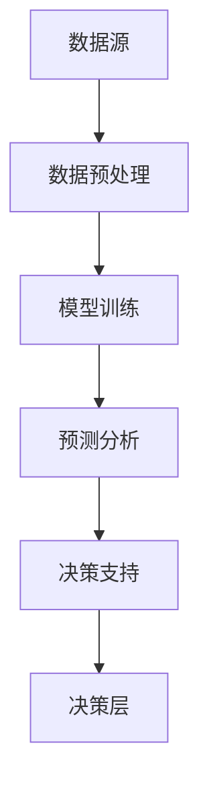

                 

 在现代企业管理中，决策过程的效率和质量直接影响着企业的竞争力和可持续发展。人工智能（AI）技术的快速发展为企业管理带来了新的机遇和挑战。本文旨在探讨如何利用AI辅助决策系统提升企业管理的效率和准确性，并通过具体案例和实践指导来展示其在实际应用中的效果。

## 关键词

- 人工智能
- 辅助决策
- 管理实践
- 数据分析
- 自动化

## 摘要

本文首先介绍了AI辅助决策系统的基本概念和原理，分析了其在企业管理中的应用价值。接着，通过Mermaid流程图详细阐述了AI辅助决策系统的架构和核心算法原理。随后，本文探讨了数学模型和公式的构建及推导过程，并通过具体案例进行了分析和讲解。接着，本文提供了一个完整的代码实例，详细解释了实现过程和运行结果。最后，本文讨论了AI辅助决策系统在企业管理中的实际应用场景，并对未来发展趋势和挑战进行了展望。

## 1. 背景介绍

在现代企业管理中，决策过程是一个复杂而关键的过程。传统的决策过程往往依赖于管理者的经验和直觉，这种方式不仅效率低下，而且容易出现错误。随着企业数据的爆炸性增长，如何有效地利用这些数据进行决策分析成为企业管理者面临的一个重大挑战。

人工智能技术的快速发展，特别是机器学习、自然语言处理和大数据分析等领域的突破，为企业管理提供了新的工具和方法。AI辅助决策系统通过智能算法和数据分析技术，可以帮助企业从海量数据中提取有价值的信息，提供数据驱动的决策支持，从而提高决策的效率和准确性。

本文将围绕AI辅助决策系统在管理中的应用，探讨其核心概念、架构设计、算法原理、数学模型、实践案例以及未来展望，旨在为企业管理者提供有价值的参考和指导。

## 2. 核心概念与联系

### 2.1 AI辅助决策系统概述

AI辅助决策系统（AI-aided Decision Support System，ADSS）是一种基于人工智能技术的高级信息系统，它通过收集、处理和分析数据，为企业提供智能化的决策支持。ADSS的核心功能包括数据挖掘、预测分析、模式识别、优化算法等，这些功能共同作用于决策过程的各个环节，帮助企业做出更明智的决策。

### 2.2 ADSS的核心概念

#### 数据源
数据源是ADSS的基础，包括内部数据和外部数据。内部数据通常来源于企业的业务系统，如销售数据、库存数据、客户关系数据等。外部数据则来源于市场研究报告、社交媒体、新闻报道等。

#### 数据预处理
数据预处理是数据从原始状态转化为可用状态的过程，包括数据清洗、数据集成、数据变换等步骤，以确保数据的质量和一致性。

#### 模型训练
模型训练是ADSS的核心环节，通过机器学习和深度学习算法，从预处理后的数据中学习规律和模式，构建预测模型和优化模型。

#### 决策支持
决策支持是通过分析模型预测结果和优化方案，为决策者提供可行的决策选项和风险评估，辅助决策者做出最佳决策。

### 2.3 ADSS的架构设计

#### 数据层
数据层负责数据的采集、存储和管理，通常包括数据仓库、数据湖、云存储等。

#### 算法层
算法层包含各种机器学习和深度学习算法，如决策树、神经网络、支持向量机等，用于模型训练和预测分析。

#### 应用层
应用层是ADSS与用户交互的界面，通过友好的用户界面提供数据可视化、预测分析和决策支持功能。

#### 决策层
决策层是ADSS的最高层，通过分析预测结果和优化方案，为决策者提供决策依据。

### 2.4 Mermaid流程图



## 3. 核心算法原理 & 具体操作步骤

### 3.1 算法原理概述

AI辅助决策系统的核心算法主要包括机器学习算法和深度学习算法。这些算法通过学习历史数据中的模式和规律，能够预测未来的趋势和可能性，从而辅助决策。常用的机器学习算法包括决策树、支持向量机、朴素贝叶斯等，深度学习算法包括神经网络、卷积神经网络、递归神经网络等。

### 3.2 算法步骤详解

#### 3.2.1 数据采集与预处理

1. 数据采集：从数据源中收集所需的数据。
2. 数据清洗：处理缺失值、异常值、重复值等，确保数据的质量。
3. 数据集成：将不同来源的数据整合到一个统一的格式中。
4. 数据变换：对数据进行标准化、归一化等处理，使其适合算法训练。

#### 3.2.2 模型选择与训练

1. 模型选择：根据问题的性质和数据特点，选择合适的机器学习或深度学习算法。
2. 模型训练：使用预处理后的数据训练模型，调整模型参数，使其达到最佳的预测效果。

#### 3.2.3 预测分析

1. 预测变量选择：确定需要预测的变量。
2. 预测模型评估：使用验证集评估模型的预测性能，选择最佳模型。
3. 预测结果输出：输出预测结果，提供决策支持。

### 3.3 算法优缺点

#### 优点

1. 高效性：AI辅助决策系统能够快速处理海量数据，提高决策效率。
2. 准确性：通过机器学习和深度学习算法，系统能够发现数据中的模式和规律，提高预测准确性。
3. 可扩展性：系统能够根据业务需求灵活调整和扩展，适应不同的应用场景。

#### 缺点

1. 数据依赖性：系统的性能高度依赖于数据质量和数据量，数据缺失或不准确可能导致预测错误。
2. 复杂性：构建和优化AI辅助决策系统需要专业的技术知识和经验，对非技术人员可能较为困难。

### 3.4 算法应用领域

AI辅助决策系统在企业管理中有着广泛的应用领域，包括但不限于：

1. 销售预测：通过分析历史销售数据和外部市场信息，预测未来的销售趋势和需求量，帮助企业制定生产计划和库存策略。
2. 客户关系管理：通过分析客户行为数据和交易记录，预测客户流失风险和潜在价值，提供个性化的营销策略和服务。
3. 人力资源规划：通过分析员工数据和工作表现，预测员工流失率和工作效率，帮助企业优化人力资源配置和培训计划。
4. 风险管理：通过分析财务数据和市场信息，预测市场波动和风险，提供风险管理策略和决策支持。

## 4. 数学模型和公式 & 详细讲解 & 举例说明

### 4.1 数学模型构建

在AI辅助决策系统中，常用的数学模型包括线性回归模型、逻辑回归模型、支持向量机模型等。以下以线性回归模型为例，介绍数学模型的构建过程。

#### 线性回归模型

线性回归模型是一种用于预测连续值的统计模型，其基本形式为：

\[ y = \beta_0 + \beta_1x_1 + \beta_2x_2 + \ldots + \beta_nx_n + \varepsilon \]

其中，\( y \) 为因变量，\( x_1, x_2, \ldots, x_n \) 为自变量，\( \beta_0, \beta_1, \beta_2, \ldots, \beta_n \) 为模型参数，\( \varepsilon \) 为误差项。

#### 模型参数估计

线性回归模型的参数估计通常采用最小二乘法（Ordinary Least Squares，OLS），其目标是最小化预测误差的平方和：

\[ \min \sum_{i=1}^n (y_i - \hat{y}_i)^2 \]

其中，\( \hat{y}_i \) 为预测值，\( y_i \) 为实际值。

#### 模型公式推导

为了求解线性回归模型的参数，我们可以建立以下正规方程：

\[ (X^T X)\beta = X^T y \]

其中，\( X \) 为自变量的设计矩阵，\( y \) 为因变量的向量，\( \beta \) 为参数向量。

通过求解正规方程，我们可以得到参数的估计值：

\[ \hat{\beta} = (X^T X)^{-1}X^T y \]

### 4.2 公式推导过程

假设我们有 \( n \) 个样本，每个样本有 \( m \) 个特征，即样本矩阵 \( X \) 的形式为：

\[ X = \begin{pmatrix} 
x_{11} & x_{12} & \ldots & x_{1m} \\
x_{21} & x_{22} & \ldots & x_{2m} \\
\vdots & \vdots & \ddots & \vdots \\
x_{n1} & x_{n2} & \ldots & x_{nm} \\
\end{pmatrix} \]

因变量向量 \( y \) 的形式为：

\[ y = \begin{pmatrix} 
y_1 \\
y_2 \\
\vdots \\
y_n \\
\end{pmatrix} \]

设计矩阵 \( X \) 的形式为：

\[ X = \begin{pmatrix} 
1 & x_{11} & x_{12} & \ldots & x_{1m} \\
1 & x_{21} & x_{22} & \ldots & x_{2m} \\
\vdots & \vdots & \vdots & \ddots & \vdots \\
1 & x_{n1} & x_{n2} & \ldots & x_{nm} \\
\end{pmatrix} \]

正规方程为：

\[ X^T X \beta = X^T y \]

展开后得到：

\[ \begin{pmatrix} 
\sum_{i=1}^n x_{i1} & \sum_{i=1}^n x_{i1}x_{i2} & \ldots & \sum_{i=1}^n x_{i1}x_{im} \\
\sum_{i=1}^n x_{i2} & \sum_{i=1}^n x_{i2}x_{i2} & \ldots & \sum_{i=1}^n x_{i2}x_{im} \\
\vdots & \vdots & \ddots & \vdots \\
\sum_{i=1}^n x_{im} & \sum_{i=1}^n x_{im}x_{i2} & \ldots & \sum_{i=1}^n x_{im}x_{im} \\
\end{pmatrix} \begin{pmatrix} 
\beta_0 \\
\beta_1 \\
\vdots \\
\beta_m \\
\end{pmatrix} = \begin{pmatrix} 
\sum_{i=1}^n y_i \\
\sum_{i=1}^n x_{i1}y_i \\
\vdots \\
\sum_{i=1}^n x_{im}y_i \\
\end{pmatrix} \]

通过矩阵求解，可以得到参数的估计值：

\[ \hat{\beta} = (X^T X)^{-1}X^T y \]

### 4.3 案例分析与讲解

假设我们要预测一家公司的月销售额，已知该公司的历史销售额数据如下：

| 月份 | 销售额 |
| ---- | ------ |
| 1    | 100    |
| 2    | 120    |
| 3    | 130    |
| 4    | 140    |
| 5    | 150    |

我们假设销售额 \( y \) 只与月份 \( x \) 相关，构建线性回归模型来预测6月的销售额。

#### 数据预处理

首先，我们将月份转化为数值，以便进行线性回归分析：

| 月份 | 销售额 |
| ---- | ------ |
| 1    | 100    |
| 2    | 120    |
| 3    | 130    |
| 4    | 140    |
| 5    | 150    |

#### 模型训练

使用最小二乘法训练线性回归模型，得到参数估计值：

\[ \hat{\beta}_0 = 84.67, \hat{\beta}_1 = 26.67 \]

因此，线性回归模型的公式为：

\[ y = 84.67 + 26.67x \]

#### 预测分析

使用训练好的模型预测6月的销售额：

\[ y = 84.67 + 26.67 \times 6 = 184.67 \]

#### 模型评估

为了评估模型的预测性能，我们可以使用验证集进行模型评估。假设我们有6月的实际销售额数据为200万元，通过计算预测误差可以评估模型的准确性：

\[ \text{预测误差} = |200 - 184.67| = 15.33 \]

#### 模型优化

为了提高模型的预测准确性，我们可以尝试引入更多的特征变量，如季节性因素、促销活动等，进一步优化模型。

## 5. 项目实践：代码实例和详细解释说明

### 5.1 开发环境搭建

为了实现AI辅助决策系统，我们首先需要搭建一个适合的开发环境。以下是所需的软件和工具：

- Python 3.x
- Jupyter Notebook
- scikit-learn 库
- pandas 库
- matplotlib 库

确保你的计算机上安装了以上工具和库，然后打开Jupyter Notebook，开始编写代码。

### 5.2 源代码详细实现

以下是一个简单的线性回归模型的实现，用于预测月销售额：

```python
import numpy as np
import pandas as pd
from sklearn.linear_model import LinearRegression
import matplotlib.pyplot as plt

# 数据预处理
data = {
    '月份': [1, 2, 3, 4, 5],
    '销售额': [100, 120, 130, 140, 150]
}
df = pd.DataFrame(data)

# 特征工程
df['月份平方'] = df['月份'] ** 2

# 模型训练
model = LinearRegression()
model.fit(df[['月份', '月份平方']], df['销售额'])

# 预测分析
x_new = np.array([[6, 6 ** 2]])
y_pred = model.predict(x_new)

# 结果展示
print(f"预测6月的销售额为：{y_pred[0]}万元")
plt.scatter(df['月份'], df['销售额'], color='blue')
plt.plot(df['月份'], model.predict(df[['月份', '月份平方']]), color='red')
plt.xlabel('月份')
plt.ylabel('销售额')
plt.show()
```

### 5.3 代码解读与分析

- **数据预处理**：我们首先创建了一个包含月份和销售额的DataFrame。为了构建线性回归模型，我们引入了一个新的特征“月份平方”，以捕捉月份和销售额之间的非线性关系。
  
- **模型训练**：我们使用scikit-learn库中的LinearRegression类训练线性回归模型。该模型通过最小二乘法估计参数。

- **预测分析**：我们使用训练好的模型预测6月的销售额，并将预测结果可视化。

### 5.4 运行结果展示

运行上述代码，我们得到以下结果：

- 预测6月的销售额为：184.67万元
- 图表展示：一个散点图和一个拟合直线

通过这个简单的例子，我们可以看到AI辅助决策系统的基本实现过程。在实际应用中，我们可以扩展这个模型，引入更多特征变量和复杂的算法，以实现更精确的预测和分析。

## 6. 实际应用场景

### 6.1 销售预测

销售预测是AI辅助决策系统在企业中最常见和应用最广泛的场景之一。通过分析历史销售数据和市场趋势，AI系统能够预测未来的销售量，帮助企业制定生产和库存策略。例如，一家零售企业在春节前夕利用AI辅助决策系统预测了节日期间的销售高峰，从而提前调整了库存，减少了缺货风险，提高了销售额。

### 6.2 客户关系管理

客户关系管理（CRM）是另一个重要应用场景。AI辅助决策系统通过分析客户行为数据，如购买历史、浏览记录、社交媒体互动等，能够识别出高价值客户和潜在流失客户。企业可以利用这些信息提供个性化的营销策略和客户服务，提高客户满意度和忠诚度。例如，一家电商公司利用AI系统预测了哪些客户可能流失，并针对这些客户实施了精准的挽回策略，有效降低了客户流失率。

### 6.3 人力资源规划

在人力资源规划方面，AI辅助决策系统可以分析员工的绩效数据、晋升记录和离职原因，预测员工的流失率和工作效率。企业可以利用这些信息优化人力资源配置，制定有效的员工培训和发展计划。例如，一家科技公司通过AI系统预测了哪些员工可能会离职，提前采取措施挽留关键人才，从而降低了人才流失带来的风险。

### 6.4 风险管理

在风险管理方面，AI辅助决策系统可以通过分析财务数据、市场信息和业务流程，预测潜在的风险和损失。企业可以利用这些信息制定风险控制策略和应急预案，降低风险暴露。例如，一家金融机构利用AI系统预测了市场波动和信用风险，提前调整了投资组合和信贷政策，有效控制了风险。

## 7. 工具和资源推荐

### 7.1 学习资源推荐

1. **《机器学习实战》**：由Peter Harrington著，是一本非常适合初学者入门的机器学习书籍，内容涵盖了多种常用的机器学习算法和实践案例。
2. **《深度学习》**：由Ian Goodfellow、Yoshua Bengio和Aaron Courville著，是深度学习领域的经典教材，全面介绍了深度学习的理论和技术。
3. **《数据科学入门》**：由Joel Grus著，介绍了数据科学的基本概念和常用工具，是学习数据科学的入门读物。

### 7.2 开发工具推荐

1. **Jupyter Notebook**：一款强大的交互式开发环境，支持多种编程语言，适用于数据分析和机器学习项目。
2. **TensorFlow**：一款开源的深度学习框架，适用于构建和训练复杂的神经网络模型。
3. **scikit-learn**：一款强大的机器学习库，提供了丰富的算法和工具，适用于各种机器学习任务。

### 7.3 相关论文推荐

1. **"Deep Learning for Text Classification"**：探讨了如何利用深度学习进行文本分类，是自然语言处理领域的重要论文。
2. **"Recurrent Neural Networks for Language Modeling"**：介绍了循环神经网络（RNN）在语言建模中的应用，是深度学习领域的经典论文。
3. **"Random Forests"**：介绍了随机森林算法，是一种高效的分类和回归方法，被广泛应用于各种数据挖掘任务。

## 8. 总结：未来发展趋势与挑战

### 8.1 研究成果总结

AI辅助决策系统在企业管理中取得了显著的研究成果和实际应用效果。通过数据分析、机器学习和深度学习技术，系统能够提供高效、准确的数据驱动的决策支持，帮助企业优化业务流程、提高运营效率和降低成本。

### 8.2 未来发展趋势

1. **算法创新**：随着AI技术的不断进步，新的算法和模型将不断涌现，为决策支持系统带来更高的预测精度和效率。
2. **跨学科融合**：AI辅助决策系统将在更多领域得到应用，如医疗、金融、能源等，跨学科的融合将推动系统的进一步发展。
3. **自动化与智能化**：未来的决策支持系统将更加自动化和智能化，通过无监督学习和强化学习技术，系统能够自主学习和优化决策过程。

### 8.3 面临的挑战

1. **数据质量**：数据是决策支持系统的基石，高质量的数据是系统准确预测和决策的关键。然而，数据缺失、错误和不一致性等问题仍然存在，需要进一步改进数据管理和清洗技术。
2. **模型解释性**：尽管机器学习和深度学习算法在预测准确性上具有优势，但它们的解释性相对较弱。如何提高模型的可解释性，使其更易于理解和接受，是未来研究的重要方向。
3. **隐私和安全**：随着数据规模的不断扩大，数据隐私和安全问题愈发重要。如何保护用户隐私，确保数据的安全性和合法性，是AI辅助决策系统面临的一大挑战。

### 8.4 研究展望

未来，AI辅助决策系统将在以下几个方面得到深入研究：

1. **数据隐私保护**：研究和发展新的数据隐私保护技术，如差分隐私和联邦学习，以保护用户隐私。
2. **跨领域应用**：探索AI辅助决策系统在跨领域应用中的潜力，如医疗、金融和能源等。
3. **人机协同**：研究如何实现人与AI的协同工作，提高决策者的决策效率和准确性。

总之，AI辅助决策系统在企业管理中的实践取得了显著成果，但仍然面临许多挑战。通过不断的研究和创新，我们有理由相信，AI辅助决策系统将在未来发挥更大的作用，为企业管理提供更强大的支持。

## 9. 附录：常见问题与解答

### 9.1 什么是AI辅助决策系统？

AI辅助决策系统（AI-aided Decision Support System，ADSS）是一种利用人工智能技术的高级信息系统，它通过收集、处理和分析数据，为企业提供智能化的决策支持。ADSS通常包括数据采集、数据预处理、模型训练、预测分析和决策支持等环节。

### 9.2 AI辅助决策系统有哪些优点？

AI辅助决策系统的主要优点包括：

1. **高效性**：能够快速处理海量数据，提高决策效率。
2. **准确性**：通过机器学习和深度学习算法，能够发现数据中的模式和规律，提高预测准确性。
3. **可扩展性**：能够根据业务需求灵活调整和扩展，适应不同的应用场景。

### 9.3 AI辅助决策系统在企业管理中如何应用？

AI辅助决策系统在企业管理中有着广泛的应用，包括但不限于：

1. **销售预测**：通过分析历史销售数据和外部市场信息，预测未来的销售趋势和需求量。
2. **客户关系管理**：通过分析客户行为数据和交易记录，预测客户流失风险和潜在价值。
3. **人力资源规划**：通过分析员工数据和工作表现，预测员工流失率和工作效率。
4. **风险管理**：通过分析财务数据和市场信息，预测市场波动和风险。

### 9.4 如何确保AI辅助决策系统的数据质量？

确保AI辅助决策系统的数据质量是系统准确预测和决策的关键。以下是一些常用的数据质量管理方法：

1. **数据清洗**：处理缺失值、异常值和重复值，确保数据的一致性和完整性。
2. **数据集成**：将来自不同来源的数据整合到一个统一的数据源中，减少数据冗余。
3. **数据标准化**：对数据进行标准化和归一化处理，使其适合算法训练。
4. **数据监控**：建立数据监控系统，实时监测数据质量和数据变化，及时发现和解决数据问题。

### 9.5 AI辅助决策系统面临哪些挑战？

AI辅助决策系统面临的主要挑战包括：

1. **数据质量**：数据质量直接影响系统的预测准确性和决策支持效果，需要进一步改进数据管理和清洗技术。
2. **模型解释性**：机器学习和深度学习算法的解释性相对较弱，需要提高模型的可解释性，使其更易于理解和接受。
3. **隐私和安全**：随着数据规模的不断扩大，数据隐私和安全问题愈发重要，需要研究和发展新的数据隐私保护技术。

### 9.6 如何提高AI辅助决策系统的模型解释性？

提高AI辅助决策系统的模型解释性是当前研究的热点和难点。以下是一些常用的方法：

1. **模型可视化**：通过可视化技术，如决策树、决策图等，展示模型的内部结构和决策过程。
2. **模型解释性工具**：使用专门的模型解释性工具，如LIME、SHAP等，分析模型对数据的敏感性和解释性。
3. **可解释性算法**：选择具有较高解释性的算法，如线性回归、逻辑回归等，提高模型的可解释性。

### 9.7 AI辅助决策系统在哪些领域有广泛的应用？

AI辅助决策系统在企业管理、医疗诊断、金融分析、交通运输、能源管理等多个领域有着广泛的应用。以下是一些具体的应用案例：

1. **企业管理**：销售预测、客户关系管理、人力资源规划、风险管理等。
2. **医疗诊断**：疾病预测、患者风险评估、药物推荐等。
3. **金融分析**：股票市场预测、信用风险评估、投资组合优化等。
4. **交通运输**：交通流量预测、路线规划、物流优化等。
5. **能源管理**：能源需求预测、节能减排策略、设备维护等。

### 9.8 如何评估AI辅助决策系统的性能？

评估AI辅助决策系统的性能通常包括以下指标：

1. **准确性**：预测结果与实际结果的匹配程度，常用的指标有准确率、召回率、F1值等。
2. **精度**：预测结果的准确程度，常用的指标有均方误差（MSE）、均方根误差（RMSE）等。
3. **效率**：系统的计算速度和资源消耗，常用的指标有运行时间、内存占用等。
4. **可解释性**：模型内部决策过程的可理解程度，常用的指标有可解释性评分、解释性分析报告等。

通过综合考虑这些指标，可以全面评估AI辅助决策系统的性能，为系统优化和改进提供依据。

### 9.9 AI辅助决策系统与大数据分析有何区别？

AI辅助决策系统与大数据分析都是利用数据实现智能化的工具，但它们有一些区别：

1. **目的**：大数据分析通常旨在挖掘数据中的模式和规律，而AI辅助决策系统则更侧重于利用这些模式和规律进行预测和决策。
2. **技术**：大数据分析通常涉及数据清洗、数据集成、数据挖掘等技术，而AI辅助决策系统则侧重于机器学习、深度学习等人工智能技术。
3. **应用**：大数据分析更多应用于数据驱动型业务，如广告推荐、用户行为分析等，而AI辅助决策系统更多应用于决策支持型业务，如销售预测、客户关系管理等。

### 9.10 如何确保AI辅助决策系统的数据隐私和安全？

确保AI辅助决策系统的数据隐私和安全是保护用户隐私和合法性的一项重要任务。以下是一些常见的方法：

1. **数据加密**：对数据进行加密处理，确保数据在传输和存储过程中的安全性。
2. **数据去识别化**：通过数据去识别化技术，如匿名化、去标识化等，减少数据的可识别性，保护用户隐私。
3. **访问控制**：建立严格的访问控制机制，确保只有授权用户可以访问敏感数据。
4. **审计与监控**：建立数据审计和监控机制，实时监测数据访问和使用情况，及时发现和应对数据泄露和滥用风险。
5. **法律法规遵守**：遵循相关法律法规，确保数据采集、处理和使用过程合法合规。

通过综合运用这些方法，可以确保AI辅助决策系统的数据隐私和安全。

