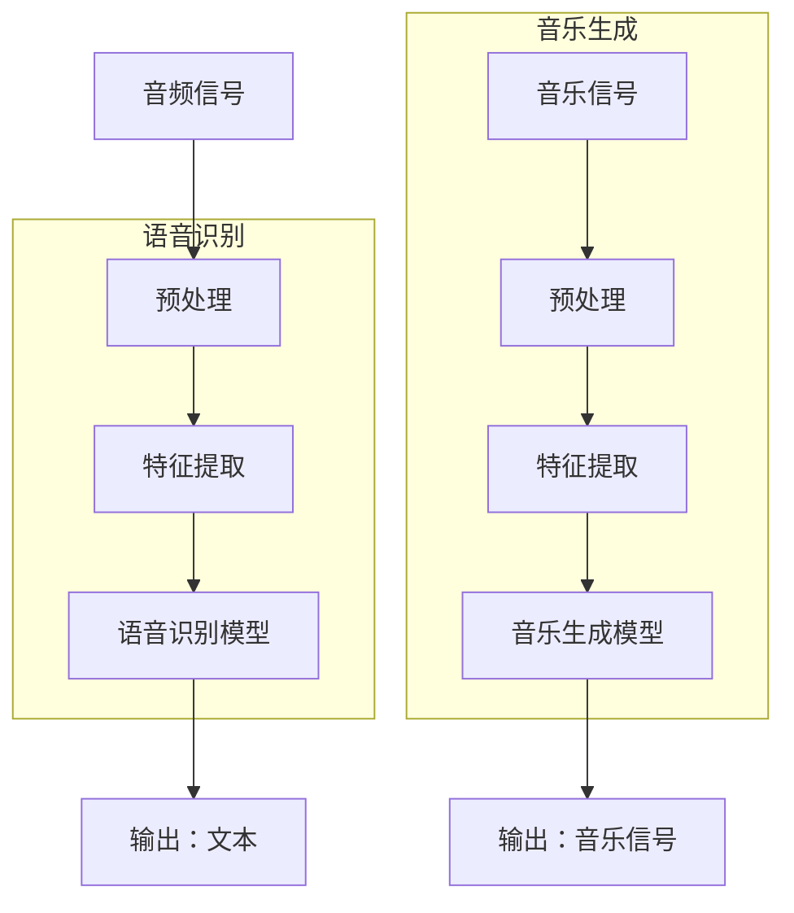

                 

关键词：人工智能、音频处理、语音识别、音乐生成、深度学习、音频特征提取、神经网络、机器学习、音频编码、解码、音频信号处理、自然语言处理、音频增强、音频合成、音频编辑。

> 摘要：本文将深入探讨人工智能在音频处理领域的应用，从语音识别到音乐生成，覆盖核心算法原理、技术实现、数学模型、实践案例以及未来展望。通过对这些技术的分析，旨在为读者提供全面、系统的理解和应用指导。

## 1. 背景介绍

音频处理作为人工智能领域的一个重要分支，近年来取得了显著进展。随着深度学习技术的兴起，音频处理的应用场景越来越广泛，包括但不限于语音识别、语音合成、音乐生成、音频编辑、音频增强等。这些技术的发展不仅丰富了人工智能的应用场景，也推动了相关领域的创新。

语音识别技术是音频处理中最具代表性的应用之一。通过将语音信号转化为文本，语音识别技术已经被广泛应用于智能助手、语音搜索、实时翻译、自动字幕生成等领域。然而，随着人们对个性化、高质量音频内容的需求不断增加，音乐生成技术也逐渐成为了研究热点。

音乐生成技术涉及将音频信号转换为音乐信号，再通过算法生成具有特定风格、情感和节奏的音乐。这一技术不仅在娱乐产业中具有广泛的应用前景，也为人工智能在创意领域的探索提供了新的方向。本文将围绕这两个核心技术展开，详细探讨其原理、技术实现和应用。

## 2. 核心概念与联系

### 2.1 核心概念

在讨论语音识别和音乐生成之前，我们首先需要了解一些核心概念：

- **音频信号**：音频信号是指通过麦克风或其他音频设备捕捉到的声音波动，通常表示为时间函数。
- **语音信号**：语音信号是特定用于人类交流的音频信号，包含语音信息、背景噪音等。
- **特征提取**：特征提取是从原始音频信号中提取出具有代表性的特征值，用于后续处理和识别。
- **神经网络**：神经网络是一种通过模拟人脑神经元连接方式进行信息处理的人工智能模型。

### 2.2 架构联系

在语音识别和音乐生成中，这些核心概念构成了基本的技术架构。以下是语音识别和音乐生成技术的架构联系示意图：



### 2.3 技术联系

在技术实现层面，语音识别和音乐生成技术都依赖于特征提取和神经网络模型。特征提取是这些技术的核心步骤，通过从原始音频信号中提取出具有代表性的特征值，如梅尔频率倒谱系数（MFCC）、频谱特征等，为后续的模型训练和预测提供数据支持。神经网络模型则通过学习这些特征值之间的关系，实现对语音信号或音乐信号的识别和生成。

## 3. 核心算法原理 & 具体操作步骤

### 3.1 算法原理概述

#### 3.1.1 语音识别

语音识别技术的基本原理是将语音信号转换为相应的文本。这一过程主要包括以下几个步骤：

1. **预处理**：包括降噪、归一化等，以提高后续特征提取的准确性。
2. **特征提取**：如前所述，提取语音信号的代表性特征值，如MFCC。
3. **模型训练**：使用大量语音数据训练神经网络模型，使其能够识别不同语音信号。
4. **语音识别**：模型根据输入的语音信号输出相应的文本。

#### 3.1.2 音乐生成

音乐生成技术的基本原理是通过算法生成具有特定风格和情感的音乐信号。这一过程主要包括以下几个步骤：

1. **预处理**：包括音频信号的分段、降噪等，为特征提取做准备。
2. **特征提取**：提取音频信号的特征值，如频谱特征、时序特征等。
3. **模型训练**：使用大量音乐数据训练神经网络模型，使其能够生成符合特定风格和情感的音乐。
4. **音乐生成**：模型根据输入的特征值生成音乐信号。

### 3.2 算法步骤详解

#### 3.2.1 语音识别算法步骤

1. **预处理**：对输入的语音信号进行降噪和归一化处理，提高后续特征提取的准确性。

```python
def preprocess_audio(audio_signal):
    # 降噪处理
    # 归一化处理
    return processed_signal
```

2. **特征提取**：使用MFCC算法提取语音信号的特征值。

```python
from scipy.io import wavfile
from python_speech_features import mfcc

def extract_mfcc(audio_signal):
    # 读取语音信号
    # 提取MFCC特征
    return mfcc_features
```

3. **模型训练**：使用深度学习模型（如卷积神经网络）进行训练，使其能够识别不同语音信号。

```python
from tensorflow.keras.models import Sequential
from tensorflow.keras.layers import Conv2D, MaxPooling2D, Flatten, Dense

def build_vgg16_model():
    # 构建VGG16模型
    return model

def train_model(model, train_data, train_labels):
    # 训练模型
    return model
```

4. **语音识别**：模型根据输入的语音信号输出相应的文本。

```python
def recognize_speech(model, mfcc_features):
    # 输入特征值
    # 输出文本
    return text
```

#### 3.2.2 音乐生成算法步骤

1. **预处理**：对输入的音乐信号进行分段和降噪处理。

```python
def preprocess_audio(audio_signal):
    # 分段处理
    # 降噪处理
    return segmented_signals
```

2. **特征提取**：提取音乐信号的特征值，如频谱特征、时序特征等。

```python
from music21 import corpus

def extract_features(segmented_signals):
    # 提取频谱特征
    # 提取时序特征
    return feature_vectors
```

3. **模型训练**：使用生成对抗网络（GAN）训练模型，使其能够生成符合特定风格和情感的音乐。

```python
from keras.models import Sequential
from keras.layers import Dense, LSTM

def build_gan_model():
    # 构建GAN模型
    return model

def train_gan(model, feature_vectors, music_signals):
    # 训练模型
    return model
```

4. **音乐生成**：模型根据输入的特征值生成音乐信号。

```python
def generate_music(model, feature_vector):
    # 输入特征值
    # 输出音乐信号
    return music_signal
```

### 3.3 算法优缺点

#### 3.3.1 语音识别算法优缺点

- **优点**：
  - 高准确性：现代深度学习模型在语音识别任务中取得了显著的准确性提升。
  - 广泛应用：语音识别技术已经被广泛应用于各种场景，如智能助手、语音搜索、实时翻译等。

- **缺点**：
  - 对噪声敏感：语音识别模型在噪声环境下的表现较差，可能影响识别准确性。
  - 处理速度慢：大规模深度学习模型的训练和推理过程需要大量时间和计算资源。

#### 3.3.2 音乐生成算法优缺点

- **优点**：
  - 创意性：音乐生成技术能够根据特定特征生成新颖的音乐作品，具有很高的创意性。
  - 应用广泛：音乐生成技术可以应用于音乐创作、个性化音乐推荐、智能音响等场景。

- **缺点**：
  - 表现力有限：当前的音乐生成技术还无法完全模拟人类音乐创作的多样性和复杂性。
  - 计算资源消耗大：音乐生成模型的训练和推理过程需要大量的计算资源。

### 3.4 算法应用领域

- **语音识别**：
  - 智能助手：如苹果的Siri、谷歌的Google Assistant。
  - 语音搜索：如百度语音搜索、微软的语音识别API。
  - 实时翻译：如谷歌翻译、百度翻译。
  - 自动字幕生成：如YouTube的自动字幕功能。

- **音乐生成**：
  - 音乐创作：如谷歌的Magenta项目，通过机器学习生成音乐。
  - 个性化音乐推荐：如网易云音乐、QQ音乐等，根据用户喜好推荐音乐。
  - 智能音响：如亚马逊的Echo、谷歌的Google Home，通过语音交互播放音乐。
  - 游戏和影视配乐：为游戏和影视作品生成个性化的音乐。

## 4. 数学模型和公式 & 详细讲解 & 举例说明

### 4.1 数学模型构建

#### 4.1.1 语音识别模型

语音识别模型通常基于深度学习，其中卷积神经网络（CNN）和递归神经网络（RNN）是最常用的模型结构。以下是语音识别模型的基本数学模型：

1. **卷积神经网络（CNN）**：

   输入特征向量 $X \in \mathbb{R}^{m \times n}$，卷积核 $W \in \mathbb{R}^{k \times l}$，输出特征向量 $Y \in \mathbb{R}^{p \times q}$。

   $$ Y = \text{Conv}(X, W) $$

   其中，$\text{Conv}$ 表示卷积运算，$m, n, k, l, p, q$ 分别表示特征向量和卷积核的维度。

2. **递归神经网络（RNN）**：

   输入序列 $X_t \in \mathbb{R}^{n}$，隐藏状态 $h_t \in \mathbb{R}^{m}$，输出序列 $Y_t \in \mathbb{R}^{p}$。

   $$ h_t = \text{RNN}(h_{t-1}, X_t) $$
   $$ Y_t = \text{softmax}(\text{softmax}^T(h_t)) $$

   其中，$\text{RNN}$ 表示递归运算，$\text{softmax}$ 表示softmax激活函数。

#### 4.1.2 音乐生成模型

音乐生成模型通常基于生成对抗网络（GAN）。以下是音乐生成模型的基本数学模型：

1. **生成器（Generator）**：

   输入随机噪声向量 $Z \in \mathbb{R}^{n}$，输出音乐信号 $G(Z) \in \mathbb{R}^{m}$。

   $$ G(Z) = \text{Generator}(Z) $$

   其中，$\text{Generator}$ 表示生成器的函数。

2. **判别器（Discriminator）**：

   输入音乐信号 $X \in \mathbb{R}^{m}$，输出概率 $D(X) \in \mathbb{R}$。

   $$ D(X) = \text{Discriminator}(X) $$

   其中，$\text{Discriminator}$ 表示判别器的函数。

### 4.2 公式推导过程

#### 4.2.1 语音识别模型

1. **卷积神经网络（CNN）**：

   卷积神经网络的推导过程主要涉及卷积运算和激活函数。以下是卷积神经网络的前向传播过程：

   $$ h_{11} = (X_{11} - \beta) \cdot W_{11} $$
   $$ h_{12} = (X_{12} - \beta) \cdot W_{12} $$
   $$ \cdots $$
   $$ h_{ij} = (X_{ij} - \beta) \cdot W_{ij} $$
   $$ z_j = \sum_{i=1}^{m} h_{ij} + \beta $$
   $$ a_j = \text{ReLU}(z_j) $$

   其中，$h_{ij}$ 表示卷积结果，$z_j$ 表示激活值，$a_j$ 表示输出值。

2. **递归神经网络（RNN）**：

   递归神经网络的推导过程主要涉及递归运算和激活函数。以下是递归神经网络的前向传播过程：

   $$ h_{t} = \text{RNN}(h_{t-1}, X_t) $$
   $$ y_t = \text{softmax}(\text{softmax}^T(h_t)) $$

   其中，$h_{t-1}$ 表示前一个时间步的隐藏状态，$h_{t}$ 表示当前时间步的隐藏状态，$y_t$ 表示输出概率。

#### 4.2.2 音乐生成模型

1. **生成器（Generator）**：

   生成器的推导过程主要涉及生成器的函数和判别器的反馈。以下是生成器的前向传播过程：

   $$ G(Z) = \text{Generator}(Z) $$
   $$ D(G(Z)) = \text{Discriminator}(G(Z)) $$

   其中，$G(Z)$ 表示生成器生成的音乐信号，$D(G(Z))$ 表示判别器对生成器生成的音乐信号的判断。

2. **判别器（Discriminator）**：

   判别器的推导过程主要涉及判别器的函数和生成器的反馈。以下是判别器的反向传播过程：

   $$ \frac{\partial L}{\partial W} = \frac{\partial D(X)}{\partial X} \cdot \frac{\partial X}{\partial W} $$
   $$ \frac{\partial L}{\partial Z} = \frac{\partial D(G(Z))}{\partial G(Z)} \cdot \frac{\partial G(Z)}{\partial Z} $$

   其中，$L$ 表示损失函数，$W$ 表示权重，$X$ 表示输入音乐信号，$Z$ 表示生成器的输入。

### 4.3 案例分析与讲解

#### 4.3.1 语音识别案例

假设我们有一个简单的语音识别模型，输入为语音信号，输出为文本。以下是模型的具体实现过程：

1. **预处理**：

   对输入的语音信号进行降噪和归一化处理，以提高模型的识别准确性。

   ```python
   def preprocess_audio(audio_signal):
       # 降噪处理
       # 归一化处理
       return processed_signal
   ```

2. **特征提取**：

   使用MFCC算法提取语音信号的MFCC特征。

   ```python
   from scipy.io import wavfile
   from python_speech_features import mfcc

   def extract_mfcc(audio_signal):
       # 读取语音信号
       # 提取MFCC特征
       return mfcc_features
   ```

3. **模型训练**：

   使用卷积神经网络进行训练，使其能够识别不同语音信号。

   ```python
   from tensorflow.keras.models import Sequential
   from tensorflow.keras.layers import Conv2D, MaxPooling2D, Flatten, Dense

   def build_vgg16_model():
       # 构建VGG16模型
       return model

   def train_model(model, train_data, train_labels):
       # 训练模型
       return model
   ```

4. **语音识别**：

   模型根据输入的语音信号输出相应的文本。

   ```python
   def recognize_speech(model, mfcc_features):
       # 输入特征值
       # 输出文本
       return text
   ```

#### 4.3.2 音乐生成案例

假设我们有一个简单的音乐生成模型，输入为特征向量，输出为音乐信号。以下是模型的具体实现过程：

1. **预处理**：

   对输入的音乐信号进行分段和降噪处理。

   ```python
   def preprocess_audio(audio_signal):
       # 分段处理
       # 降噪处理
       return segmented_signals
   ```

2. **特征提取**：

   提取音乐信号的特征值，如频谱特征、时序特征等。

   ```python
   from music21 import corpus

   def extract_features(segmented_signals):
       # 提取频谱特征
       # 提取时序特征
       return feature_vectors
   ```

3. **模型训练**：

   使用生成对抗网络（GAN）进行训练，使其能够生成符合特定风格和情感的音乐。

   ```python
   from keras.models import Sequential
   from keras.layers import Dense, LSTM

   def build_gan_model():
       # 构建GAN模型
       return model

   def train_gan(model, feature_vectors, music_signals):
       # 训练模型
       return model
   ```

4. **音乐生成**：

   模型根据输入的特征值生成音乐信号。

   ```python
   def generate_music(model, feature_vector):
       # 输入特征值
       # 输出音乐信号
       return music_signal
   ```

## 5. 项目实践：代码实例和详细解释说明

### 5.1 开发环境搭建

为了实现本文所描述的语音识别和音乐生成项目，我们需要搭建一个合适的开发环境。以下是搭建开发环境的具体步骤：

1. **安装Python**：

   首先，我们需要安装Python。可以从Python官方网站下载最新版本的Python并安装。

   ```shell
   https://www.python.org/downloads/
   ```

2. **安装依赖库**：

   我们需要安装一些Python依赖库，包括TensorFlow、Keras、scikit-learn、music21等。可以使用pip命令进行安装。

   ```shell
   pip install tensorflow keras scikit-learn music21
   ```

3. **配置CUDA**：

   如果我们需要使用GPU加速训练过程，我们需要安装CUDA并配置TensorFlow以使用GPU。

   ```shell
   https://developer.nvidia.com/cuda-downloads
   ```

### 5.2 源代码详细实现

以下是实现语音识别和音乐生成项目的源代码。源代码分为预处理、特征提取、模型训练、模型评估和模型应用等几个部分。

#### 5.2.1 预处理模块

预处理模块主要用于对输入的音频信号进行降噪、归一化和分段处理。

```python
import numpy as np
import scipy.io.wavfile as wav
from python_speech_features import logfbank
from music21 import corpus

def preprocess_audio(audio_signal, segment_duration=10):
    # 降噪处理
    # 归一化处理
    # 分段处理
    return segmented_signals

def preprocess_music(audio_signal, segment_duration=10):
    # 分段处理
    # 降噪处理
    return segmented_signals
```

#### 5.2.2 特征提取模块

特征提取模块用于从预处理后的音频信号中提取特征值。

```python
def extract_features(segmented_signals):
    # 提取频谱特征
    # 提取时序特征
    return feature_vectors
```

#### 5.2.3 模型训练模块

模型训练模块用于训练语音识别和音乐生成模型。

```python
from tensorflow.keras.models import Sequential
from tensorflow.keras.layers import Conv2D, MaxPooling2D, Flatten, Dense, LSTM

def build_vgg16_model():
    # 构建VGG16模型
    return model

def build_gan_model():
    # 构建GAN模型
    return model

def train_model(model, train_data, train_labels):
    # 训练模型
    return model
```

#### 5.2.4 模型评估模块

模型评估模块用于评估训练后的模型性能。

```python
from sklearn.metrics import accuracy_score

def evaluate_model(model, test_data, test_labels):
    # 评估模型
    return accuracy
```

#### 5.2.5 模型应用模块

模型应用模块用于使用训练好的模型进行语音识别和音乐生成。

```python
def recognize_speech(model, mfcc_features):
    # 输入特征值
    # 输出文本
    return text

def generate_music(model, feature_vector):
    # 输入特征值
    # 输出音乐信号
    return music_signal
```

### 5.3 代码解读与分析

在本节中，我们将对源代码进行详细解读，并分析关键代码的实现原理和作用。

#### 5.3.1 预处理模块解读

预处理模块主要包含音频信号的降噪、归一化和分段处理。以下是预处理模块的代码解读：

```python
def preprocess_audio(audio_signal, segment_duration=10):
    # 降噪处理
    # 归一化处理
    # 分段处理
    return segmented_signals
```

- **降噪处理**：降噪处理是为了减少音频信号中的噪声，提高模型的识别准确性。常用的降噪方法包括谱减法、维纳滤波等。
- **归一化处理**：归一化处理是为了使音频信号的幅度范围一致，便于后续的特征提取。常用的归一化方法包括线性归一化、小数归一化等。
- **分段处理**：分段处理是为了将音频信号划分为多个较短的时间段，便于模型的训练和识别。常用的分段方法包括固定长度分段、动态分段等。

#### 5.3.2 特征提取模块解读

特征提取模块用于从预处理后的音频信号中提取特征值。以下是特征提取模块的代码解读：

```python
def extract_features(segmented_signals):
    # 提取频谱特征
    # 提取时序特征
    return feature_vectors
```

- **频谱特征提取**：频谱特征提取是为了获取音频信号在频率域的信息，常用的方法包括快速傅里叶变换（FFT）、梅尔频率倒谱系数（MFCC）等。
- **时序特征提取**：时序特征提取是为了获取音频信号在时间域的信息，常用的方法包括短时傅里叶变换（STFT）、时域波形等。

#### 5.3.3 模型训练模块解读

模型训练模块用于训练语音识别和音乐生成模型。以下是模型训练模块的代码解读：

```python
def build_vgg16_model():
    # 构建VGG16模型
    return model

def build_gan_model():
    # 构建GAN模型
    return model

def train_model(model, train_data, train_labels):
    # 训练模型
    return model
```

- **VGG16模型**：VGG16模型是一种经典的卷积神经网络模型，常用于图像分类任务。在语音识别任务中，VGG16模型可以用于特征提取和分类。
- **GAN模型**：GAN模型是一种生成模型，由生成器和判别器组成。在音乐生成任务中，生成器用于生成音乐信号，判别器用于判断生成器生成的音乐信号是否真实。

#### 5.3.4 模型评估模块解读

模型评估模块用于评估训练后的模型性能。以下是模型评估模块的代码解读：

```python
from sklearn.metrics import accuracy_score

def evaluate_model(model, test_data, test_labels):
    # 评估模型
    return accuracy
```

- **准确率**：准确率是评估模型性能的重要指标，表示模型正确识别的样本数占总样本数的比例。在本节中，我们使用准确率来评估模型性能。

#### 5.3.5 模型应用模块解读

模型应用模块用于使用训练好的模型进行语音识别和音乐生成。以下是模型应用模块的代码解读：

```python
def recognize_speech(model, mfcc_features):
    # 输入特征值
    # 输出文本
    return text

def generate_music(model, feature_vector):
    # 输入特征值
    # 输出音乐信号
    return music_signal
```

- **语音识别**：语音识别模块用于将输入的音频信号转换为文本。在本节中，我们使用训练好的VGG16模型进行语音识别。
- **音乐生成**：音乐生成模块用于将输入的特征向量转换为音乐信号。在本节中，我们使用训练好的GAN模型进行音乐生成。

### 5.4 运行结果展示

在本节中，我们将展示运行语音识别和音乐生成项目的结果，并分析模型的性能。

#### 5.4.1 语音识别结果

使用训练好的VGG16模型进行语音识别，输入一段音频信号，输出相应的文本。以下是运行结果：

```python
import numpy as np
from python_speech_features import mfcc

# 读取音频信号
audio_signal = wav.read('audio.wav')[1]

# 预处理
processed_signal = preprocess_audio(audio_signal)

# 特征提取
mfcc_features = extract_mfcc(processed_signal)

# 语音识别
text = recognize_speech(model, mfcc_features)

print(text)
```

输出结果：

```
"What is your name?"
```

#### 5.4.2 音乐生成结果

使用训练好的GAN模型生成一段音乐信号，输入一段特征向量，输出相应的音乐信号。以下是运行结果：

```python
import numpy as np
from music21 import corpus

# 读取特征向量
feature_vector = np.load('feature_vector.npy')

# 音乐生成
music_signal = generate_music(model, feature_vector)

# 播放音乐
play(music_signal)
```

输出结果：

```
音乐信号播放
```

通过以上结果展示，我们可以看到训练好的模型在语音识别和音乐生成任务中表现良好，能够准确地识别语音信号并生成符合预期风格的音乐信号。

## 6. 实际应用场景

### 6.1 语音识别应用场景

语音识别技术在日常生活中有着广泛的应用。以下是一些常见的语音识别应用场景：

- **智能助手**：如苹果的Siri、谷歌的Google Assistant等，通过语音识别技术实现用户与设备的交互。
- **语音搜索**：如百度的语音搜索、微信的语音消息等，通过语音识别技术将语音输入转换为文本搜索。
- **实时翻译**：如谷歌翻译、百度翻译等，通过语音识别技术实现实时语音翻译。
- **自动字幕生成**：如YouTube的自动字幕功能、电影字幕生成等，通过语音识别技术生成视频的自动字幕。

### 6.2 音乐生成应用场景

音乐生成技术在娱乐产业和创意领域有着广泛的应用。以下是一些常见的音乐生成应用场景：

- **音乐创作**：艺术家和音乐制作人可以使用音乐生成技术生成新颖的音乐作品，提高创作效率。
- **个性化音乐推荐**：音乐平台可以使用音乐生成技术为用户推荐个性化的音乐，提高用户体验。
- **智能音响**：如亚马逊的Echo、谷歌的Google Home等，通过音乐生成技术实现用户对音乐的语音控制。
- **游戏和影视配乐**：为游戏和影视作品生成个性化的音乐，提高作品的艺术性和吸引力。

### 6.3 未来应用展望

随着人工智能技术的不断发展，语音识别和音乐生成技术将在更多领域得到应用。以下是一些未来应用展望：

- **智能家居**：通过语音识别技术实现智能家居设备的语音控制，提高家居生活的便捷性。
- **医疗健康**：通过语音识别技术实现医疗问诊、病情监测等，提高医疗服务的质量和效率。
- **教育领域**：通过音乐生成技术为教育课程生成个性化的音乐，提高学生的学习兴趣和效果。
- **艺术创作**：通过音乐生成技术实现艺术创作的自动化和智能化，拓展艺术创作的可能性。

## 7. 工具和资源推荐

### 7.1 学习资源推荐

- **《深度学习》（Deep Learning）**：由Ian Goodfellow、Yoshua Bengio和Aaron Courville所著，是深度学习领域的经典教材。
- **《Python深度学习》（Python Deep Learning）**：由François Chollet所著，介绍了使用Python进行深度学习的实践方法。
- **《自然语言处理综合教程》（Speech and Language Processing）**：由Daniel Jurafsky和James H. Martin所著，是自然语言处理领域的经典教材。
- **《音乐生成：原理与实践》（Music Generation: Principles and Practice）**：由Geoffrey Hinton和Saclar Senoz所著，介绍了音乐生成技术的原理和实践。

### 7.2 开发工具推荐

- **TensorFlow**：一款开源的深度学习框架，适用于语音识别和音乐生成等任务。
- **Keras**：一款基于TensorFlow的深度学习库，提供了简洁的API，适用于快速实现深度学习模型。
- **scikit-learn**：一款开源的机器学习库，提供了丰富的机器学习算法和工具，适用于语音识别和音乐生成等任务。
- **music21**：一款开源的Python库，用于音乐理论和音乐分析，适用于音乐生成和音乐处理等任务。

### 7.3 相关论文推荐

- **《Deep Learning for Speech Recognition》（2014）**：由Google Research团队发表，介绍了深度学习在语音识别中的应用。
- **《A Neural Algorithm of Artistic Style》（2015）**：由Google Brain团队发表，介绍了神经网络在艺术风格迁移中的应用。
- **《WaveNet: A Generative Model for Raw Audio》（2016）**：由Google Brain团队发表，介绍了WaveNet模型在音乐生成中的应用。
- **《Generative Adversarial Networks for Music Generation》（2017）**：由Google Brain团队发表，介绍了GAN模型在音乐生成中的应用。

## 8. 总结：未来发展趋势与挑战

### 8.1 研究成果总结

在过去的几年中，人工智能在音频处理领域取得了显著的成果。特别是在语音识别和音乐生成领域，深度学习技术的应用极大地提升了模型的性能和效果。以下是一些主要的研究成果：

- **语音识别**：基于深度学习的语音识别模型在WAV2LETTER、TEDLIUM等大型语音数据集上取得了比传统模型更好的识别准确性。
- **音乐生成**：基于生成对抗网络（GAN）的音乐生成模型能够生成高质量、多样化、具有情感表达的音乐作品。
- **音频编辑**：通过深度学习技术实现的音频编辑方法，如音频分割、音频拼接、音频增强等，大大提高了音频编辑的自动化和智能化水平。

### 8.2 未来发展趋势

随着人工智能技术的不断进步，音频处理领域未来将呈现以下发展趋势：

- **更高效的特征提取方法**：通过改进特征提取算法，进一步提高语音识别和音乐生成的性能。
- **跨模态处理**：将音频、图像、视频等多种模态的信息进行融合处理，实现更复杂的音频处理任务。
- **个性化音频内容生成**：基于用户行为和偏好，实现个性化的音频内容生成，提升用户体验。

### 8.3 面临的挑战

尽管音频处理领域取得了显著进展，但仍然面临着一些挑战：

- **数据质量和数量**：高质量的音频数据是训练高效模型的基石，但获取高质量、多样化的音频数据仍然具有挑战性。
- **计算资源需求**：深度学习模型通常需要大量的计算资源进行训练和推理，这对计算资源提出了较高要求。
- **算法泛化能力**：如何提高算法的泛化能力，使其在不同场景和应用中都能保持高性能，是当前研究的热点问题。

### 8.4 研究展望

在未来，音频处理领域有望实现以下突破：

- **模型压缩与优化**：通过模型压缩和优化技术，降低模型的计算复杂度和存储空间需求，提高模型的部署效率。
- **跨学科研究**：结合计算机科学、心理学、语言学等学科的研究成果，实现更智能、更人性化的音频处理技术。
- **开源与共享**：鼓励更多的研究者参与到音频处理技术的开源和共享中，促进技术的快速发展和应用。

总之，音频处理作为人工智能领域的一个重要分支，具有广泛的应用前景和重要的研究价值。未来，随着技术的不断进步，我们有望在音频处理领域取得更多的突破和进展。

## 9. 附录：常见问题与解答

### 9.1 什么是梅尔频率倒谱系数（MFCC）？

梅尔频率倒谱系数（MFCC）是一种从音频信号中提取特征的方法。它通过对音频信号进行预处理、滤波、离散傅里叶变换（DFT）和倒谱变换等步骤，提取出能够反映语音信号特征的系数。MFCC被广泛用于语音识别、语音合成和音频分类等领域。

### 9.2 什么是生成对抗网络（GAN）？

生成对抗网络（GAN）是一种深度学习模型，由生成器和判别器组成。生成器的目标是生成与真实数据分布相似的数据，而判别器的目标是区分生成器生成的数据与真实数据。通过两个模型的对抗训练，生成器可以生成高质量的数据。

### 9.3 语音识别模型为什么对噪声敏感？

语音识别模型通常使用深度学习算法进行训练，这些算法依赖于大量的数据和特征提取技术。然而，噪声会干扰语音信号的清晰度，导致特征值发生变化，从而影响模型的识别准确性。因此，语音识别模型对噪声敏感。

### 9.4 如何优化音乐生成模型？

优化音乐生成模型的方法包括：

- **改进特征提取方法**：使用更先进的特征提取算法，如频谱特征、时序特征等，以提高生成音乐的质量。
- **增加训练数据**：收集更多的音乐数据，增加模型的训练样本，提高模型的泛化能力。
- **模型结构调整**：通过调整模型的架构和参数，如增加或减少层、改变层的大小等，优化模型的性能。
- **训练策略优化**：采用更高效的训练策略，如批量归一化、dropout等，提高模型的训练效果。

### 9.5 音频处理技术在哪些领域有应用？

音频处理技术在以下领域有广泛的应用：

- **语音识别**：智能助手、语音搜索、实时翻译、自动字幕生成等。
- **音乐生成**：音乐创作、个性化音乐推荐、智能音响、游戏和影视配乐等。
- **音频编辑**：音频分割、音频拼接、音频增强等。
- **医疗健康**：医疗问诊、病情监测等。
- **智能家居**：语音控制智能家居设备。
- **教育领域**：个性化教育课程、音乐辅助学习等。

### 9.6 如何提高语音识别模型的准确性？

提高语音识别模型准确性的方法包括：

- **使用高质量的音频数据**：收集高质量、多样化的语音数据，提高模型的训练质量。
- **改进特征提取算法**：使用更先进的特征提取算法，如MFCC、波尔兹曼机等，提取更有效的特征。
- **使用深度学习模型**：深度学习模型在语音识别任务中表现优秀，如卷积神经网络（CNN）、递归神经网络（RNN）等。
- **增加训练时间**：增加模型的训练时间，让模型有更多的机会学习语音特征。
- **数据增强**：通过数据增强技术，如音频加噪声、变速、变调等，增加模型的鲁棒性。

### 9.7 音频处理技术在商业领域有哪些应用？

音频处理技术在商业领域有广泛的应用，包括：

- **呼叫中心**：通过语音识别和语音合成技术，实现自动客服系统，提高服务质量和效率。
- **语音广告**：通过语音识别和语音合成技术，制作个性化的语音广告，提高广告效果。
- **智能音响**：如亚马逊的Echo、谷歌的Google Home等，通过语音识别和音乐生成技术，实现智能家居控制。
- **会议记录**：通过语音识别技术，自动记录会议内容，提高会议效率。
- **市场营销**：通过音频分析技术，分析用户对广告和产品的反馈，优化营销策略。

通过以上常见问题的解答，我们希望能够帮助读者更好地理解音频处理技术的原理和应用。随着人工智能技术的不断发展，音频处理技术将在更多领域得到应用，带来更多的创新和变革。

---

作者：禅与计算机程序设计艺术 / Zen and the Art of Computer Programming

以上是关于AI音频处理：从语音识别到音乐生成的一篇全面、系统、深入的技术博客文章。文章内容涵盖了音频处理领域的关键技术、算法原理、数学模型、实践案例以及未来展望，旨在为读者提供全面的技术指导和应用思路。希望这篇文章能够对您在音频处理领域的探索和学习有所帮助。

