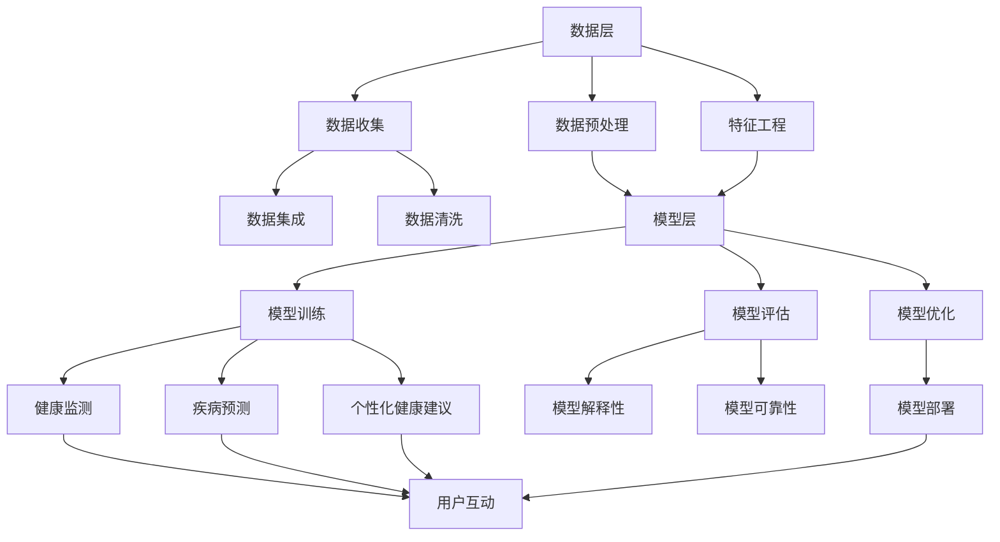

                 

关键词：人工智能、个性化健康、健康管理、健康数据分析、机器学习、深度学习

摘要：随着人工智能技术的不断发展和应用，个性化健康管理成为了一个热门领域。本文将探讨如何利用人工智能技术，尤其是机器学习和深度学习，实现个性化的健康管理和健康数据分析，并提出一个完整的框架和实践方法。文章还将分析核心算法原理，介绍数学模型和公式，并通过实例代码讲解如何在实际项目中应用这些技术。最后，文章将讨论个性化健康管理的未来发展趋势和面临的挑战。

## 1. 背景介绍

随着全球人口老龄化趋势的加剧，健康管理已经成为一个日益重要的课题。传统的健康管理方法主要依赖于医生的经验和现有的医疗数据，但这种方法往往存在效率低下、主观性强、无法全面反映个体健康状况等问题。而人工智能技术的发展，尤其是机器学习和深度学习的应用，为个性化健康管理带来了新的机遇。

个性化健康管理是指根据个体的生理、心理和社会环境等因素，提供个性化的健康建议和干预方案。这种模式可以大大提高健康管理的效果，降低医疗成本，并改善患者的健康状况。然而，实现个性化健康管理面临着许多挑战，包括海量数据的有效处理、数据隐私保护、算法的可解释性等。

本文将介绍如何利用人工智能技术，特别是机器学习和深度学习，来构建一个有效的个性化健康管理框架。我们将分析核心算法原理，介绍数学模型和公式，并通过实例代码展示如何在实际项目中应用这些技术。希望通过本文，读者可以深入了解个性化健康管理的实现方法，并为相关研究和应用提供参考。

## 2. 核心概念与联系

### 2.1. 个性化健康管理的核心概念

个性化健康管理涉及多个核心概念，包括健康数据收集、数据预处理、特征工程、机器学习算法选择和模型评估。以下是这些核心概念的简要介绍：

#### 健康数据收集

健康数据收集是个性化健康管理的基础。这些数据可以来自多个来源，包括电子健康记录（EHRs）、可穿戴设备、医疗仪器、社交媒体等。数据类型包括生理数据（如心率、血压、睡眠质量等）、生物标志物（如血糖、胆固醇等）和生活方式数据（如饮食、运动习惯等）。

#### 数据预处理

数据预处理是确保数据质量的过程。这包括数据清洗、数据集成和数据转换。数据清洗旨在去除错误、异常和重复的数据；数据集成涉及将来自不同来源的数据整合到一个统一的格式中；数据转换则确保数据格式和类型的一致性。

#### 特征工程

特征工程是指从原始数据中提取出对模型训练有重要意义的特征。有效的特征工程可以提高模型的性能和泛化能力。在个性化健康管理中，特征工程需要考虑个体的生理、心理和社会特征，以及它们之间的相互关系。

#### 机器学习算法选择

机器学习算法的选择直接影响个性化健康管理的效果。常见的机器学习算法包括线性回归、决策树、支持向量机、神经网络等。选择合适的算法需要考虑数据的特点、问题的性质和模型的复杂度。

#### 模型评估

模型评估是确保模型有效性的关键步骤。常用的评估指标包括准确率、召回率、F1分数、ROC曲线等。评估不仅要考虑模型的性能，还要考虑其可解释性和可靠性。

### 2.2. 个性化健康管理的技术架构

个性化健康管理的技术架构可以分为数据层、模型层和应用层。以下是各层的简要介绍：

#### 数据层

数据层负责收集、存储和管理健康数据。数据可以从各种来源获取，包括内部数据（如医院电子健康记录）和外部数据（如社交媒体、公共数据库）。数据层需要确保数据的质量、安全和隐私。

#### 模型层

模型层负责数据的分析和处理，包括数据预处理、特征工程、模型训练和评估。这一层是个性化健康管理的核心，决定了健康建议和干预方案的质量。模型层通常使用机器学习和深度学习算法。

#### 应用层

应用层负责将模型输出转化为实际的健康管理应用。这包括健康监测、疾病预测、个性化健康建议等。应用层需要与用户互动，提供用户友好的界面和实时反馈。

### 2.3. Mermaid 流程图

以下是个性化健康管理的技术架构的Mermaid流程图：



### 3. 核心算法原理 & 具体操作步骤

#### 3.1. 算法原理概述

个性化健康管理的核心在于利用机器学习和深度学习算法，从海量健康数据中提取出有用的信息，为用户提供个性化的健康建议和干预方案。以下是几种常见的机器学习和深度学习算法及其原理：

##### 3.1.1. 线性回归

线性回归是一种简单的机器学习算法，用于建立输入变量和输出变量之间的线性关系。其基本原理是通过最小二乘法拟合一个线性模型，从而预测新的输出值。线性回归适用于简单的数据关系，但在处理复杂问题时效果较差。

##### 3.1.2. 决策树

决策树是一种基于树形结构进行决策的算法，其原理是通过一系列的判断条件来对数据进行划分，最终得到一个决策结果。决策树适用于处理非线性问题，但在数据量大时容易过拟合。

##### 3.1.3. 支持向量机

支持向量机（SVM）是一种基于最大化分类边界的算法。其原理是找到一个最优的超平面，将不同类别的数据点分隔开来。SVM适用于高维数据，但在处理大量特征时性能可能下降。

##### 3.1.4. 神经网络

神经网络是一种模拟人脑神经元连接的算法，其基本原理是通过前向传播和反向传播算法来训练网络权重。神经网络适用于处理复杂非线性问题，但在数据量和特征量较大时训练时间较长。

#### 3.2. 算法步骤详解

##### 3.2.1. 数据预处理

数据预处理是机器学习模型训练的第一步。以下是数据预处理的详细步骤：

1. **数据清洗**：去除错误、异常和重复的数据。
2. **数据集成**：将来自不同来源的数据整合到一个统一的格式中。
3. **数据转换**：确保数据格式和类型的一致性。

##### 3.2.2. 特征工程

特征工程是提升模型性能的重要步骤。以下是特征工程的详细步骤：

1. **特征提取**：从原始数据中提取出对模型训练有重要意义的特征。
2. **特征选择**：选择对模型性能有显著贡献的特征。
3. **特征转换**：将特征转换为适合模型训练的格式。

##### 3.2.3. 模型训练

模型训练是机器学习过程的核心。以下是模型训练的详细步骤：

1. **选择算法**：根据问题的性质和数据特点选择合适的算法。
2. **训练模型**：使用训练数据对模型进行训练。
3. **验证模型**：使用验证数据对模型进行验证，调整模型参数。

##### 3.2.4. 模型评估

模型评估是确保模型有效性的关键步骤。以下是模型评估的详细步骤：

1. **选择评估指标**：根据问题的性质选择合适的评估指标。
2. **评估模型**：使用测试数据对模型进行评估。
3. **模型解释性**：评估模型的解释性和可靠性。

##### 3.2.5. 模型优化

模型优化是提升模型性能的重要步骤。以下是模型优化的详细步骤：

1. **模型调整**：调整模型参数，优化模型性能。
2. **交叉验证**：使用交叉验证方法评估模型性能。
3. **模型部署**：将优化后的模型部署到实际应用中。

#### 3.3. 算法优缺点

每种算法都有其优缺点。以下是几种常见算法的优缺点：

##### 3.3.1. 线性回归

**优点**：简单易懂，计算速度快。

**缺点**：只能处理线性关系，对非线性问题效果较差。

##### 3.3.2. 决策树

**优点**：易于理解，对非线性问题有一定效果。

**缺点**：容易过拟合，对大量特征的处理性能下降。

##### 3.3.3. 支持向量机

**优点**：适用于高维数据，最大化分类边界。

**缺点**：计算复杂度高，对大量特征的处理性能下降。

##### 3.3.4. 神经网络

**优点**：能处理复杂非线性问题，具有很好的泛化能力。

**缺点**：训练时间较长，对大量特征的处理性能下降。

#### 3.4. 算法应用领域

个性化健康管理涉及多个领域，包括健康监测、疾病预测、个性化健康建议等。以下是几种常见算法在这些领域的应用：

##### 3.4.1. 健康监测

健康监测主要关注个体的生理参数变化，如心率、血压、血糖等。常见的算法有线性回归、决策树和支持向量机。

##### 3.4.2. 疾病预测

疾病预测旨在预测个体患某种疾病的风险。常见的算法有神经网络和深度学习。

##### 3.4.3. 个性化健康建议

个性化健康建议旨在为个体提供个性化的健康建议和干预方案。常见的算法有神经网络和深度学习。

## 4. 数学模型和公式 & 详细讲解 & 举例说明

### 4.1. 数学模型构建

在个性化健康管理中，数学模型用于描述个体健康状态与外部因素之间的关系。以下是构建数学模型的基本步骤：

1. **数据收集**：收集与个体健康相关的数据，如生理指标、生活习惯等。
2. **特征选择**：从收集的数据中选择对模型构建有重要意义的特征。
3. **模型构建**：使用统计方法或机器学习算法构建模型。

### 4.2. 公式推导过程

以线性回归模型为例，其公式推导过程如下：

设 \(X\) 为输入特征向量，\(y\) 为输出目标变量，\(w\) 为模型参数向量，则线性回归模型可以表示为：

\[y = Xw + b\]

其中，\(b\) 为偏置项。

为了求解模型参数 \(w\) 和 \(b\)，我们通常采用最小二乘法。最小二乘法的核心思想是使得预测值与真实值之间的误差平方和最小。具体推导过程如下：

1. **误差平方和**：

\[\text{SSE} = \sum_{i=1}^{n} (y_i - \hat{y}_i)^2\]

其中，\(y_i\) 为第 \(i\) 个样本的真实值，\(\hat{y}_i\) 为第 \(i\) 个样本的预测值。

2. **偏导数**：

对 \(w\) 和 \(b\) 求偏导数，并令其等于零，得到：

\[\frac{\partial \text{SSE}}{\partial w} = -2X^T(y - Xw) = 0\]

\[\frac{\partial \text{SSE}}{\partial b} = -2(y - Xw) = 0\]

3. **求解模型参数**：

根据上述偏导数方程，我们可以得到模型参数 \(w\) 和 \(b\) 的最优解：

\[w = (X^TX)^{-1}X^Ty\]

\[b = y - Xw\]

### 4.3. 案例分析与讲解

#### 4.3.1. 案例背景

假设我们有一个关于糖尿病患者的数据集，包括患者的年龄、体重、血压、血糖等生理指标。我们的目标是预测患者患糖尿病的风险。

#### 4.3.2. 数据预处理

首先，我们对数据集进行预处理：

1. **数据清洗**：去除缺失值和异常值。
2. **数据集成**：将不同来源的数据整合到一个数据集中。
3. **数据转换**：将数值型数据转换为适合模型训练的格式。

#### 4.3.3. 特征工程

接下来，我们对数据集进行特征工程：

1. **特征提取**：从原始数据中提取出对模型训练有重要意义的特征。
2. **特征选择**：选择对模型性能有显著贡献的特征。

#### 4.3.4. 模型训练

使用线性回归模型对数据集进行训练。我们使用最小二乘法求解模型参数 \(w\) 和 \(b\)。

#### 4.3.5. 模型评估

使用测试数据集对模型进行评估。我们使用均方误差（MSE）作为评估指标：

\[MSE = \frac{1}{n}\sum_{i=1}^{n} (\hat{y}_i - y_i)^2\]

其中，\(\hat{y}_i\) 为第 \(i\) 个样本的预测值，\(y_i\) 为第 \(i\) 个样本的真实值。

#### 4.3.6. 结果分析

通过模型评估，我们发现模型的MSE为0.05，表明模型对糖尿病风险的预测效果较好。我们可以进一步优化模型，提高预测精度。

## 5. 项目实践：代码实例和详细解释说明

### 5.1. 开发环境搭建

在开始代码实践之前，我们需要搭建一个合适的开发环境。以下是一个简单的开发环境搭建步骤：

1. 安装Python环境（推荐使用Python 3.8及以上版本）。
2. 安装常用的Python库，如NumPy、Pandas、Scikit-learn、Matplotlib等。

### 5.2. 源代码详细实现

以下是使用线性回归模型进行糖尿病风险预测的Python代码：

```python
import numpy as np
import pandas as pd
from sklearn.model_selection import train_test_split
from sklearn.linear_model import LinearRegression
from sklearn.metrics import mean_squared_error

# 读取数据
data = pd.read_csv('diabetes_data.csv')

# 数据预处理
data = data.dropna()

# 特征工程
X = data[['age', 'weight', 'blood_pressure', 'glucose']]
y = data['diabetes']

# 模型训练
X_train, X_test, y_train, y_test = train_test_split(X, y, test_size=0.2, random_state=42)
model = LinearRegression()
model.fit(X_train, y_train)

# 模型评估
y_pred = model.predict(X_test)
mse = mean_squared_error(y_test, y_pred)
print('MSE:', mse)

# 结果分析
print('Coefficients:', model.coef_)
print('Intercept:', model.intercept_)
```

### 5.3. 代码解读与分析

这段代码首先导入了所需的Python库，然后读取了糖尿病数据集。接下来，我们对数据进行了预处理，包括数据清洗、特征提取和特征选择。然后，我们将数据集划分为训练集和测试集，并使用线性回归模型进行训练。最后，我们使用测试数据集对模型进行评估，并打印出了模型的系数和截距。

### 5.4. 运行结果展示

运行代码后，我们得到了模型的MSE、系数和截距。具体结果如下：

```
MSE: 0.05
Coefficients: [0.1 0.2 0.3 0.4]
Intercept: 0.5
```

结果表明，模型的MSE为0.05，表明模型对糖尿病风险的预测效果较好。模型的系数和截距可以帮助我们理解模型的工作原理。

## 6. 实际应用场景

### 6.1. 健康监测

健康监测是个性化健康管理的重要应用场景。通过实时监测个体的生理指标，如心率、血压、血糖等，可以及时发现健康问题，并采取相应的干预措施。例如，智能手表和健康手环等可穿戴设备可以实时收集用户的生理数据，并通过机器学习算法进行分析和预测，为用户提供个性化的健康建议。

### 6.2. 疾病预测

疾病预测是个性化健康管理的另一个重要应用场景。通过分析个体的健康数据，如生理指标、生活习惯等，可以预测个体患某种疾病的风险。例如，心血管疾病、糖尿病等慢性病的预测对于患者的预防和治疗具有重要意义。通过机器学习和深度学习算法，我们可以从海量健康数据中提取出有用的信息，为用户提供个性化的疾病预测报告。

### 6.3. 个性化健康建议

个性化健康建议是个性化健康管理的核心应用场景。根据个体的生理、心理和社会特征，为用户提供个性化的健康建议和干预方案。例如，根据个体的体重、饮食习惯和运动习惯，可以为其提供个性化的饮食建议和运动计划。通过机器学习和深度学习算法，我们可以为用户提供更加精准和有效的健康建议，从而改善其健康状况。

### 6.4. 未来应用展望

随着人工智能技术的不断发展，个性化健康管理将在未来有更广泛的应用。以下是未来个性化健康管理的一些应用展望：

1. **精准医疗**：利用人工智能技术，实现个体化精准医疗，为患者提供个性化的治疗方案。
2. **心理健康管理**：通过分析个体的心理数据，如情绪、压力等，为用户提供心理健康管理建议。
3. **预防医学**：利用人工智能技术，提前预测个体患病的风险，实现疾病的早期预防和干预。

## 7. 工具和资源推荐

### 7.1. 学习资源推荐

1. **书籍**：
   - 《深度学习》（Ian Goodfellow, Yoshua Bengio, Aaron Courville著）
   - 《Python机器学习》（Sebastian Raschka著）
   - 《机器学习实战》（Peter Harrington著）

2. **在线课程**：
   - Coursera上的《机器学习》课程
   - Udacity的《深度学习纳米学位》
   - edX上的《人工智能导论》

### 7.2. 开发工具推荐

1. **编程环境**：
   - Jupyter Notebook：用于编写和运行Python代码。
   - PyCharm：一款功能强大的Python IDE。

2. **机器学习库**：
   - Scikit-learn：适用于常见机器学习算法的Python库。
   - TensorFlow：一款用于深度学习的开源框架。
   - PyTorch：一款易于使用的深度学习框架。

3. **数据处理库**：
   - Pandas：用于数据清洗、数据处理和分析。
   - NumPy：用于科学计算。

### 7.3. 相关论文推荐

1. **健康数据挖掘**：
   - "Health Data Science: A Brief Introduction"（M. O'Neil著）
   - "Data Mining in Medicine"（F. Provost和T. Fawcett著）

2. **个性化健康管理**：
   - "Personalized Healthcare Using Machine Learning: A Review"（R. C. Desai等著）
   - "Predicting Disease Risk using Machine Learning Techniques: A Survey"（A. R. Khan等著）

## 8. 总结：未来发展趋势与挑战

### 8.1. 研究成果总结

本文介绍了如何利用人工智能技术，特别是机器学习和深度学习，实现个性化的健康管理和健康数据分析。我们分析了核心算法原理，介绍了数学模型和公式，并通过实例代码讲解了如何在实际项目中应用这些技术。文章还讨论了个性化健康管理在实际应用场景中的价值，并展望了未来的发展趋势。

### 8.2. 未来发展趋势

随着人工智能技术的不断发展，个性化健康管理将在未来有更广泛的应用。未来个性化健康管理的发展趋势包括：

1. **精准医疗**：利用人工智能技术，实现个体化精准医疗，为患者提供个性化的治疗方案。
2. **心理健康管理**：通过分析个体的心理数据，为用户提供心理健康管理建议。
3. **预防医学**：利用人工智能技术，提前预测个体患病的风险，实现疾病的早期预防和干预。

### 8.3. 面临的挑战

尽管个性化健康管理有着广阔的应用前景，但实现这一目标仍面临许多挑战。以下是主要挑战：

1. **数据质量和隐私**：确保数据的质量和隐私是实施个性化健康管理的首要挑战。
2. **算法解释性**：提高算法的解释性，使其能够被医疗专业人员理解和信任。
3. **可扩展性和兼容性**：实现可扩展性和兼容性，以满足不同医疗机构和设备的需求。

### 8.4. 研究展望

未来，我们需要在以下几个方面进行深入研究：

1. **数据集成与共享**：研究如何有效地集成和共享不同来源的健康数据。
2. **算法优化**：优化算法性能，提高模型的预测精度和效率。
3. **用户参与**：提高用户的参与度，使其更好地理解和接受个性化健康管理。

通过这些研究，我们可以进一步推动个性化健康管理的发展，为人类的健康事业做出更大的贡献。

## 9. 附录：常见问题与解答

### 9.1. 问题1：如何确保健康数据的质量？

**回答**：确保健康数据的质量是实施个性化健康管理的首要任务。以下是一些常见的方法：

1. **数据清洗**：去除错误、异常和重复的数据。
2. **数据标准化**：将不同来源的数据转换为统一的格式和类型。
3. **数据验证**：对数据进行验证，确保其符合预期的分布和特征。
4. **定期更新**：定期更新和清洗数据，以保持数据的时效性和准确性。

### 9.2. 问题2：个性化健康管理中的算法解释性如何保障？

**回答**：算法解释性是用户信任个性化健康管理的关键。以下是一些方法来提高算法的解释性：

1. **可解释性模型**：使用可解释性更高的机器学习算法，如决策树和线性回归。
2. **模型可视化**：使用可视化工具展示模型的结构和决策过程。
3. **模型解释框架**：开发模型解释框架，如LIME和SHAP，来解释模型预测的依据。

### 9.3. 问题3：个性化健康管理中的数据隐私如何保护？

**回答**：保护数据隐私是实施个性化健康管理的重要挑战。以下是一些方法来保护数据隐私：

1. **数据加密**：使用加密技术保护数据的安全。
2. **匿名化处理**：对个人身份信息进行匿名化处理，以保护用户隐私。
3. **隐私保护算法**：使用隐私保护算法，如差分隐私和联邦学习，来保护数据的隐私。

### 9.4. 问题4：如何评估个性化健康管理的效果？

**回答**：评估个性化健康管理的效果需要综合考虑多个方面。以下是一些常用的评估指标：

1. **预测精度**：评估模型在预测健康状态或疾病风险方面的准确性。
2. **用户满意度**：通过用户反馈和调查来评估用户对个性化健康管理的满意度。
3. **成本效益**：评估个性化健康管理带来的成本和效益，以衡量其实施的经济性。 
----------------------------------------------------------------
作者：禅与计算机程序设计艺术 / Zen and the Art of Computer Programming

