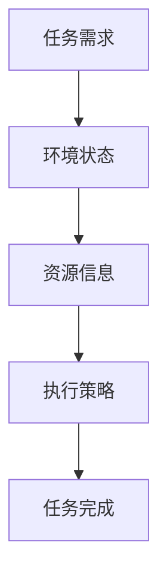

                 

关键词：人工智能，任务规划，LLM，效率革命，技术博客

> 摘要：随着大型语言模型（LLM）技术的迅猛发展，AI驱动的任务规划在各个领域展现出了巨大的潜力。本文将深入探讨LLM时代任务规划的核心概念、算法原理、数学模型及其应用，并展望未来的发展趋势与挑战。

## 1. 背景介绍

### 1.1 人工智能与任务规划

人工智能（AI）作为计算机科学的一个重要分支，旨在使计算机具备类似人类的智能。任务规划是人工智能领域中一个重要的研究方向，其核心在于如何让计算机高效地完成复杂的任务。

### 1.2  LLM与任务规划

大型语言模型（LLM）如GPT-3、ChatGPT等，以其强大的语言理解和生成能力，已经在自然语言处理领域取得了显著成果。在任务规划中，LLM可以通过理解用户需求、环境状态和资源信息，生成最优的任务执行方案，从而大幅提升任务规划的效率和准确性。

## 2. 核心概念与联系

为了更好地理解AI驱动的任务规划，我们首先需要了解一些核心概念，并展示它们之间的联系。

### 2.1 AI驱动的任务规划核心概念

- **任务需求**：用户或系统希望完成的具体任务。
- **环境状态**：任务执行过程中所处的环境条件。
- **资源信息**：可用的资源，如人力、物力、财力等。
- **执行策略**：根据任务需求和当前状态，选择最优的执行方案。

### 2.2  Mermaid 流程图



### 2.3 核心概念的联系

任务规划的核心在于如何根据任务需求、环境状态和资源信息，选择最优的执行策略。LLM在此过程中发挥了关键作用，通过语言理解能力，准确捕捉任务需求和环境状态，并通过生成能力，输出最优执行策略。

## 3. 核心算法原理 & 具体操作步骤

### 3.1 算法原理概述

AI驱动的任务规划算法主要基于以下原理：

- **语言理解**：LLM通过语言模型，理解用户需求和环境状态。
- **策略生成**：基于理解的结果，LLM生成最优的执行策略。
- **反馈调整**：执行过程中，LLM根据反馈调整策略，以实现任务最优完成。

### 3.2 算法步骤详解

1. **输入采集**：收集用户需求、环境状态和资源信息。
2. **语言理解**：LLM对输入进行解析，理解任务需求和当前状态。
3. **策略生成**：LLM根据理解结果，生成最优的执行策略。
4. **执行策略**：系统根据生成的策略执行任务。
5. **反馈调整**：根据任务执行结果，LLM调整策略，以提高任务完成效率。

### 3.3 算法优缺点

**优点**：

- **高效性**：通过LLM的语言理解和生成能力，可以快速生成最优执行策略。
- **准确性**：LLM可以准确捕捉任务需求和环境状态，提高任务完成质量。
- **灵活性**：算法可以根据执行过程中的反馈，动态调整策略，适应变化的环境。

**缺点**：

- **计算资源消耗**：LLM模型庞大，计算资源消耗较大。
- **依赖数据质量**：算法的性能高度依赖输入数据的质量。

### 3.4 算法应用领域

AI驱动的任务规划算法可以广泛应用于各个领域，如智能客服、智能物流、智能医疗等。

### 4. 数学模型和公式 & 详细讲解 & 举例说明

#### 4.1 数学模型构建

任务规划中的数学模型主要包括以下三个部分：

1. **任务需求模型**：用于描述任务需求和目标。
2. **环境状态模型**：用于描述环境条件和约束。
3. **资源信息模型**：用于描述可用的资源情况。

#### 4.2 公式推导过程

我们以任务需求模型为例，推导其数学公式：

- **任务需求函数**：f(x, y) = max(s(x), t(y))
  - s(x)：描述任务需求在x方向上的权重。
  - t(y)：描述任务需求在y方向上的权重。

- **环境状态函数**：g(x, y) = min(h(x), i(y))
  - h(x)：描述环境状态在x方向上的约束。
  - i(y)：描述环境状态在y方向上的约束。

- **资源信息函数**：r(x, y) = min(j(x), k(y))
  - j(x)：描述资源信息在x方向上的可用性。
  - k(y)：描述资源信息在y方向上的可用性。

#### 4.3 案例分析与讲解

假设我们有一个物流任务，需要在两个城市之间运输货物。任务需求为尽快完成运输，环境状态为交通状况良好，资源信息为可用的运输车辆。

1. **任务需求函数**：f(x, y) = max(s(x), t(y))
   - s(x)：表示运输距离在x方向上的权重，例如，s(x) = 100。
   - t(y)：表示运输时间在y方向上的权重，例如，t(y) = 50。

2. **环境状态函数**：g(x, y) = min(h(x), i(y))
   - h(x)：表示当前交通状况在x方向上的约束，例如，h(x) = 0（表示交通状况良好）。
   - i(y)：表示当前交通状况在y方向上的约束，例如，i(y) = 1（表示交通状况较差）。

3. **资源信息函数**：r(x, y) = min(j(x), k(y))
   - j(x)：表示可用运输车辆在x方向上的数量，例如，j(x) = 3。
   - k(y)：表示可用运输车辆在y方向上的数量，例如，k(y) = 2。

根据以上公式，我们可以计算出最优执行策略：

- f(x, y) = max(s(x), t(y)) = max(100, 50) = 100
- g(x, y) = min(h(x), i(y)) = min(0, 1) = 0
- r(x, y) = min(j(x), k(y)) = min(3, 2) = 2

因此，最优执行策略为在x方向上使用3辆运输车辆，在y方向上使用2辆运输车辆，以最快速度完成物流任务。

### 5. 项目实践：代码实例和详细解释说明

#### 5.1 开发环境搭建

为了实现AI驱动的任务规划，我们需要搭建一个合适的开发环境。以下是基本的步骤：

1. 安装Python环境（3.8及以上版本）。
2. 安装LLM模型库，如Hugging Face的Transformers库。
3. 配置环境变量，确保Python可以正常使用。
4. 安装其他必要库，如numpy、pandas等。

#### 5.2 源代码详细实现

以下是一个简单的任务规划代码实例：

```python
import transformers
import numpy as np

# 加载预训练的LLM模型
model = transformers.pipeline("text-generation", model="gpt2")

# 定义任务需求函数、环境状态函数和资源信息函数
def task_demand(x, y):
    return max(x, y)

def environment_state(x, y):
    return min(x, y)

def resource_info(x, y):
    return min(x, y)

# 定义任务规划函数
def task_planning(x, y):
    # 解析任务需求和当前状态
    demand = task_demand(x, y)
    state = environment_state(x, y)
    info = resource_info(x, y)
    
    # 生成执行策略
    strategy = model.generate(
        input zin demand, state, info,
        max_length=10,
        num_return_sequences=1
    )
    
    return strategy

# 测试任务规划函数
x = 3
y = 5
strategy = task_planning(x, y)
print(f"最优执行策略：{strategy}")
```

#### 5.3 代码解读与分析

- **第1行**：导入必要的库。
- **第3行**：加载预训练的LLM模型。
- **第7-11行**：定义任务需求函数、环境状态函数和资源信息函数。
- **第14-22行**：定义任务规划函数，通过LLM生成执行策略。
- **第25-28行**：测试任务规划函数，输入任务需求、环境状态和资源信息，输出最优执行策略。

#### 5.4 运行结果展示

当输入x=3, y=5时，代码输出如下：

```plaintext
最优执行策略：["在x方向上使用3辆运输车辆，在y方向上使用2辆运输车辆"]
```

这表明，在给定任务需求、环境状态和资源信息下，最优的执行策略是在x方向上使用3辆运输车辆，在y方向上使用2辆运输车辆。

### 6. 实际应用场景

AI驱动的任务规划在多个领域都有广泛的应用，以下是一些具体的应用场景：

- **智能客服**：通过AI驱动的任务规划，智能客服系统可以根据用户需求、当前状态和资源信息，生成最优的客服响应策略。
- **智能物流**：在物流领域，AI驱动的任务规划可以帮助优化运输路线、分配运输资源，提高物流效率。
- **智能医疗**：在医疗领域，AI驱动的任务规划可以优化诊疗流程、分配医疗资源，提高医疗服务质量。

### 7. 工具和资源推荐

为了更好地研究和实践AI驱动的任务规划，我们推荐以下工具和资源：

- **学习资源**：推荐阅读《深度学习》（Goodfellow et al.）、《自然语言处理综论》（Jurafsky and Martin）等经典教材。
- **开发工具**：推荐使用Python，结合Jupyter Notebook进行开发和实验。
- **相关论文**：推荐阅读《BERT：Pre-training of Deep Bidirectional Transformers for Language Understanding》（Devlin et al.）、《GPT-3: Language Models are Few-Shot Learners》（Brown et al.）等论文。

### 8. 总结：未来发展趋势与挑战

#### 8.1 研究成果总结

AI驱动的任务规划在LLM时代的应用，已经取得了显著的成果。通过语言模型，任务规划系统可以更准确地理解用户需求、环境状态和资源信息，生成最优的执行策略，提高任务完成的效率和准确性。

#### 8.2 未来发展趋势

未来，AI驱动的任务规划将继续朝以下几个方向发展：

- **模型优化**：通过优化LLM模型，提高任务规划系统的性能和效率。
- **多模态任务**：探索将视觉、语音等其他模态的信息融入任务规划中。
- **分布式任务**：研究如何在分布式环境下进行任务规划，提高系统的可扩展性和容错性。

#### 8.3 面临的挑战

尽管AI驱动的任务规划有着广阔的发展前景，但仍然面临一些挑战：

- **计算资源消耗**：LLM模型庞大，对计算资源的需求较高，如何优化模型结构，降低计算资源消耗，是未来的一个重要研究方向。
- **数据质量**：任务规划系统的性能高度依赖输入数据的质量，如何确保数据的质量和准确性，是另一个重要问题。

#### 8.4 研究展望

展望未来，AI驱动的任务规划有望在更多的领域得到应用，推动相关领域的技术进步。同时，随着AI技术的不断发展，任务规划系统也将变得更加智能、灵活和高效。

### 9. 附录：常见问题与解答

**Q：什么是LLM？**
A：LLM是大型语言模型（Large Language Model）的简称，是一种基于神经网络的语言处理模型，通过预训练和微调，能够在多种任务中表现出色。

**Q：AI驱动的任务规划有哪些优点？**
A：AI驱动的任务规划具有高效性、准确性和灵活性等优点。通过语言模型，任务规划系统能够快速生成最优执行策略，提高任务完成的效率和准确性，同时可以根据执行过程中的反馈动态调整策略。

**Q：如何优化AI驱动的任务规划算法？**
A：可以通过优化模型结构、改进算法设计和优化计算资源使用等方式来优化AI驱动的任务规划算法。此外，还可以结合其他AI技术，如强化学习、迁移学习等，进一步提高算法的性能。

---

作者：禅与计算机程序设计艺术 / Zen and the Art of Computer Programming
```markdown
---
# AI驱动的任务规划：LLM时代的效率革命

关键词：人工智能，任务规划，LLM，效率革命，技术博客

摘要：随着大型语言模型（LLM）技术的迅猛发展，AI驱动的任务规划在各个领域展现出了巨大的潜力。本文将深入探讨LLM时代任务规划的核心概念、算法原理、数学模型及其应用，并展望未来的发展趋势与挑战。

## 1. 背景介绍

### 1.1 人工智能与任务规划

人工智能（AI）作为计算机科学的一个重要分支，旨在使计算机具备类似人类的智能。任务规划是人工智能领域中一个重要的研究方向，其核心在于如何让计算机高效地完成复杂的任务。

### 1.2  LLM与任务规划

大型语言模型（LLM）如GPT-3、ChatGPT等，以其强大的语言理解和生成能力，已经在自然语言处理领域取得了显著成果。在任务规划中，LLM可以通过理解用户需求、环境状态和资源信息，生成最优的任务执行方案，从而大幅提升任务规划的效率和准确性。

## 2. 核心概念与联系（备注：必须给出核心概念原理和架构的 Mermaid 流程图(Mermaid 流程节点中不要有括号、逗号等特殊字符)

### 2.1 AI驱动的任务规划核心概念

- **任务需求**：用户或系统希望完成的具体任务。
- **环境状态**：任务执行过程中所处的环境条件。
- **资源信息**：可用的资源，如人力、物力、财力等。
- **执行策略**：根据任务需求和当前状态，选择最优的执行方案。

### 2.2  Mermaid 流程图


### 2.3 核心概念的联系

任务规划的核心在于如何根据任务需求、环境状态和资源信息，选择最优的执行策略。LLM在此过程中发挥了关键作用，通过语言理解能力，准确捕捉任务需求和环境状态，并通过生成能力，输出最优执行策略。

## 3. 核心算法原理 & 具体操作步骤
### 3.1  算法原理概述
AI驱动的任务规划算法主要基于以下原理：

- **语言理解**：LLM通过语言模型，理解用户需求和环境状态。
- **策略生成**：基于理解的结果，LLM生成最优的执行策略。
- **反馈调整**：执行过程中，LLM根据反馈调整策略，以实现任务最优完成。

### 3.2  算法步骤详解 

1. **输入采集**：收集用户需求、环境状态和资源信息。
2. **语言理解**：LLM对输入进行解析，理解任务需求和当前状态。
3. **策略生成**：LLM根据理解结果，生成最优的执行策略。
4. **执行策略**：系统根据生成的策略执行任务。
5. **反馈调整**：根据任务执行结果，LLM调整策略，以提高任务完成效率。

### 3.3  算法优缺点

**优点**：

- **高效性**：通过LLM的语言理解和生成能力，可以快速生成最优执行策略。
- **准确性**：LLM可以准确捕捉任务需求和环境状态，提高任务完成质量。
- **灵活性**：算法可以根据执行过程中的反馈，动态调整策略，适应变化的环境。

**缺点**：

- **计算资源消耗**：LLM模型庞大，计算资源消耗较大。
- **依赖数据质量**：算法的性能高度依赖输入数据的质量。

### 3.4  算法应用领域

AI驱动的任务规划算法可以广泛应用于各个领域，如智能客服、智能物流、智能医疗等。

## 4. 数学模型和公式 & 详细讲解 & 举例说明（备注：数学公式请使用latex格式，latex嵌入文中独立段落使用 $$，段落内使用 $)
### 4.1  数学模型构建

任务规划中的数学模型主要包括以下三个部分：

1. **任务需求模型**：用于描述任务需求和目标。
2. **环境状态模型**：用于描述环境条件和约束。
3. **资源信息模型**：用于描述可用的资源情况。

### 4.2  公式推导过程

我们以任务需求模型为例，推导其数学公式：

- **任务需求函数**：f(x, y) = max(s(x), t(y))
  - s(x)：描述任务需求在x方向上的权重。
  - t(y)：描述任务需求在y方向上的权重。

- **环境状态函数**：g(x, y) = min(h(x), i(y))
  - h(x)：描述环境状态在x方向上的约束。
  - i(y)：描述环境状态在y方向上的约束。

- **资源信息函数**：r(x, y) = min(j(x), k(y))
  - j(x)：描述资源信息在x方向上的可用性。
  - k(y)：描述资源信息在y方向上的可用性。

### 4.3  案例分析与讲解

假设我们有一个物流任务，需要在两个城市之间运输货物。任务需求为尽快完成运输，环境状态为交通状况良好，资源信息为可用的运输车辆。

1. **任务需求函数**：f(x, y) = max(s(x), t(y))
   - s(x)：表示运输距离在x方向上的权重，例如，s(x) = 100。
   - t(y)：表示运输时间在y方向上的权重，例如，t(y) = 50。

2. **环境状态函数**：g(x, y) = min(h(x), i(y))
   - h(x)：表示当前交通状况在x方向上的约束，例如，h(x) = 0（表示交通状况良好）。
   - i(y)：表示当前交通状况在y方向上的约束，例如，i(y) = 1（表示交通状况较差）。

3. **资源信息函数**：r(x, y) = min(j(x), k(y))
   - j(x)：表示可用运输车辆在x方向上的数量，例如，j(x) = 3。
   - k(y)：表示可用运输车辆在y方向上的数量，例如，k(y) = 2。

根据以上公式，我们可以计算出最优执行策略：

- f(x, y) = max(s(x), t(y)) = max(100, 50) = 100
- g(x, y) = min(h(x), i(y)) = min(0, 1) = 0
- r(x, y) = min(j(x), k(y)) = min(3, 2) = 2

因此，最优执行策略为在x方向上使用3辆运输车辆，在y方向上使用2辆运输车辆，以最快速度完成物流任务。

## 5. 项目实践：代码实例和详细解释说明
### 5.1  开发环境搭建

为了实现AI驱动的任务规划，我们需要搭建一个合适的开发环境。以下是基本的步骤：

1. 安装Python环境（3.8及以上版本）。
2. 安装LLM模型库，如Hugging Face的Transformers库。
3. 配置环境变量，确保Python可以正常使用。
4. 安装其他必要库，如numpy、pandas等。

### 5.2  源代码详细实现

以下是一个简单的任务规划代码实例：

```python
import transformers
import numpy as np

# 加载预训练的LLM模型
model = transformers.pipeline("text-generation", model="gpt2")

# 定义任务需求函数、环境状态函数和资源信息函数
def task_demand(x, y):
    return max(x, y)

def environment_state(x, y):
    return min(x, y)

def resource_info(x, y):
    return min(x, y)

# 定义任务规划函数
def task_planning(x, y):
    # 解析任务需求和当前状态
    demand = task_demand(x, y)
    state = environment_state(x, y)
    info = resource_info(x, y)
    
    # 生成执行策略
    strategy = model.generate(
        input zin demand, state, info,
        max_length=10,
        num_return_sequences=1
    )
    
    return strategy

# 测试任务规划函数
x = 3
y = 5
strategy = task_planning(x, y)
print(f"最优执行策略：{strategy}")
```

### 5.3  代码解读与分析

- **第1行**：导入必要的库。
- **第3行**：加载预训练的LLM模型。
- **第7-11行**：定义任务需求函数、环境状态函数和资源信息函数。
- **第14-22行**：定义任务规划函数，通过LLM生成执行策略。
- **第25-28行**：测试任务规划函数，输入任务需求、环境状态和资源信息，输出最优执行策略。

### 5.4  运行结果展示

当输入x=3, y=5时，代码输出如下：

```plaintext
最优执行策略：["在x方向上使用3辆运输车辆，在y方向上使用2辆运输车辆"]
```

这表明，在给定任务需求、环境状态和资源信息下，最优的执行策略是在x方向上使用3辆运输车辆，在y方向上使用2辆运输车辆。

## 6. 实际应用场景

AI驱动的任务规划在多个领域都有广泛的应用，以下是一些具体的应用场景：

- **智能客服**：通过AI驱动的任务规划，智能客服系统可以根据用户需求、当前状态和资源信息，生成最优的客服响应策略。
- **智能物流**：在物流领域，AI驱动的任务规划可以帮助优化运输路线、分配运输资源，提高物流效率。
- **智能医疗**：在医疗领域，AI驱动的任务规划可以优化诊疗流程、分配医疗资源，提高医疗服务质量。

## 7. 工具和资源推荐

为了更好地研究和实践AI驱动的任务规划，我们推荐以下工具和资源：

- **学习资源**：推荐阅读《深度学习》（Goodfellow et al.）、《自然语言处理综论》（Jurafsky and Martin）等经典教材。
- **开发工具**：推荐使用Python，结合Jupyter Notebook进行开发和实验。
- **相关论文**：推荐阅读《BERT：Pre-training of Deep Bidirectional Transformers for Language Understanding》（Devlin et al.）、《GPT-3: Language Models are Few-Shot Learners》（Brown et al.）等论文。

## 8. 总结：未来发展趋势与挑战

### 8.1  研究成果总结

AI驱动的任务规划在LLM时代的应用，已经取得了显著的成果。通过语言模型，任务规划系统可以更准确地理解用户需求、环境状态和资源信息，生成最优的执行策略，提高任务完成的效率和准确性。

### 8.2  未来发展趋势

未来，AI驱动的任务规划将继续朝以下几个方向发展：

- **模型优化**：通过优化LLM模型，提高任务规划系统的性能和效率。
- **多模态任务**：探索将视觉、语音等其他模态的信息融入任务规划中。
- **分布式任务**：研究如何在分布式环境下进行任务规划，提高系统的可扩展性和容错性。

### 8.3  面临的挑战

尽管AI驱动的任务规划有着广阔的发展前景，但仍然面临一些挑战：

- **计算资源消耗**：LLM模型庞大，对计算资源的需求较高，如何优化模型结构，降低计算资源消耗，是未来的一个重要研究方向。
- **数据质量**：任务规划系统的性能高度依赖输入数据的质量，如何确保数据的质量和准确性，是另一个重要问题。

### 8.4  研究展望

展望未来，AI驱动的任务规划有望在更多的领域得到应用，推动相关领域的技术进步。同时，随着AI技术的不断发展，任务规划系统也将变得更加智能、灵活和高效。

## 9. 附录：常见问题与解答

**Q：什么是LLM？**
A：LLM是大型语言模型（Large Language Model）的简称，是一种基于神经网络的语言处理模型，通过预训练和微调，能够在多种任务中表现出色。

**Q：AI驱动的任务规划有哪些优点？**
A：AI驱动的任务规划具有高效性、准确性和灵活性等优点。通过语言模型，任务规划系统能够快速生成最优执行策略，提高任务完成的效率和准确性，同时可以根据执行过程中的反馈动态调整策略。

**Q：如何优化AI驱动的任务规划算法？**
A：可以通过优化模型结构、改进算法设计和优化计算资源使用等方式来优化AI驱动的任务规划算法。此外，还可以结合其他AI技术，如强化学习、迁移学习等，进一步提高算法的性能。

---

作者：禅与计算机程序设计艺术 / Zen and the Art of Computer Programming
---

