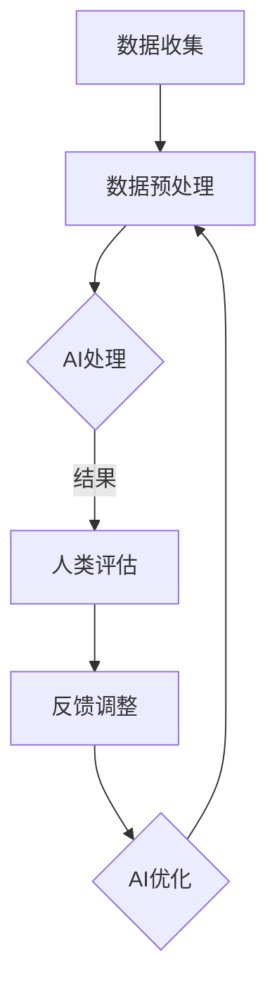

                 

 关键词：人工智能、人类计算、创新、技术、算法、数学模型、项目实践

> 摘要：本文将探讨人工智能（AI）在驱动创新方面的作用，尤其是如何利用人类计算的力量来提升AI的效能。文章分为八个部分，涵盖了从背景介绍、核心概念与联系，到算法原理、数学模型、项目实践、应用场景以及未来展望等内容。

## 1. 背景介绍

随着计算机技术的飞速发展，人工智能（AI）已经成为当今世界最具变革性的技术之一。从最初的规则系统到现代的深度学习模型，AI在各个领域都展现出了强大的潜力。然而，尽管AI在某些任务上已经超越了人类，但它在复杂决策和创造性问题上仍然存在局限性。这时，人类计算的力量显得尤为重要。

人类计算不同于传统的计算机处理，它强调人的直觉、经验和创造力。通过将人类计算与AI相结合，可以弥补AI在特定领域的不足，实现更高效、更创新的解决方案。本文旨在探讨这种结合的原理、方法和实际应用。

## 2. 核心概念与联系

为了理解人类计算与AI结合的原理，我们需要先了解几个核心概念：

### 2.1 人工智能（AI）

AI是模拟人类智能行为的计算机系统，包括机器学习、深度学习、自然语言处理等子领域。AI的目标是实现机器在特定任务上的自主决策和执行。

### 2.2 人类计算

人类计算是指人类在解决问题时运用直觉、经验、创造力和认知能力的过程。它不仅包括逻辑推理，还涉及情感、文化背景等非逻辑因素。

### 2.3 结合原理

将AI与人类计算结合的原理在于利用AI处理大量数据和模式识别的能力，同时利用人类计算在理解复杂情境、进行创造性思维方面的优势。通过这种方式，可以实现以下目标：

- **提高决策质量**：AI可以帮助人类处理大量信息，而人类计算则可以提供更深入的理解和判断。
- **增强创新性**：人类计算能够提出新颖的想法和解决方案，而AI可以帮助验证这些想法的可行性和效果。
- **优化资源利用**：AI可以自动化重复性任务，而人类计算则可以专注于更有价值的工作。

### 2.4 Mermaid 流程图

下面是一个Mermaid流程图，展示了人类计算与AI结合的流程：



## 3. 核心算法原理 & 具体操作步骤

### 3.1 算法原理概述

在本节中，我们将介绍一种结合AI与人类计算的核心算法——增强学习（Reinforcement Learning）。增强学习是一种使机器通过与环境的交互来学习目标行为的方法。以下是增强学习的基本原理：

- **状态（State）**：系统当前所处的情境。
- **动作（Action）**：机器可以执行的行为。
- **奖励（Reward）**：机器执行动作后获得的即时反馈。

机器学习模型通过不断尝试不同的动作来学习最优策略，以最大化长期奖励。在这一过程中，人类计算的作用主要体现在：

- **情境理解**：人类可以更好地理解复杂的情境，提供更准确的初始状态描述。
- **策略调整**：人类可以根据观察到的奖励信号，对AI的策略进行调整。

### 3.2 算法步骤详解

1. **初始状态描述**：由人类计算提供初始状态描述，包括环境特征和任务目标。
2. **策略学习**：AI模型利用增强学习算法进行策略学习，尝试不同的动作。
3. **奖励评估**：人类计算根据AI的动作结果，评估奖励信号。
4. **策略调整**：根据奖励信号，人类计算对AI的策略进行调整。
5. **迭代优化**：AI模型不断迭代，优化策略，提高决策质量。

### 3.3 算法优缺点

**优点**：

- **适应性**：增强学习能够适应复杂、动态的环境。
- **自主性**：AI模型能够在没有明确指导的情况下学习。

**缺点**：

- **计算复杂度**：增强学习算法通常需要大量的计算资源。
- **对初始状态描述的依赖**：初始状态描述的准确性对学习过程有很大影响。

### 3.4 算法应用领域

增强学习算法广泛应用于以下领域：

- **机器人控制**：机器人通过与环境的交互，学习执行复杂任务。
- **游戏**：AI在电子游戏中通过学习，实现高水平的自主游戏。
- **推荐系统**：AI通过学习用户的偏好，提供个性化推荐。

## 4. 数学模型和公式 & 详细讲解 & 举例说明

在本节中，我们将介绍增强学习算法的核心数学模型——Q学习算法。Q学习算法是一种基于值函数的增强学习算法，其目标是学习最优动作策略。

### 4.1 数学模型构建

Q学习算法的核心是值函数（Q函数），它表示在特定状态下执行特定动作的预期奖励。Q函数的数学表达式如下：

$$
Q(s, a) = \sum_{s'} p(s' | s, a) \cdot R(s', a) + \gamma \cdot \max_{a'} Q(s', a')
$$

其中：

- $s$ 表示当前状态。
- $a$ 表示当前动作。
- $s'$ 表示下一状态。
- $R(s', a')$ 表示在状态 $s'$ 执行动作 $a'$ 的即时奖励。
- $p(s' | s, a)$ 表示在状态 $s$ 执行动作 $a$ 后转移到状态 $s'$ 的概率。
- $\gamma$ 表示折扣因子，用于平衡即时奖励和长期奖励。

### 4.2 公式推导过程

Q学习算法的推导过程基于马尔可夫决策过程（MDP），其基本假设是状态转移概率和奖励函数是已知的。在MDP中，值函数定义为：

$$
V^*(s) = \max_{a} Q^*(s, a)
$$

其中，$V^*(s)$ 表示在状态 $s$ 的最优值函数，$Q^*(s, a)$ 表示在状态 $s$ 执行动作 $a$ 的最优值。

为了求解最优值函数，我们使用贝尔曼方程（Bellman equation）：

$$
V^*(s) = \sum_{a} \pi(a | s) \cdot [R(s, a) + \gamma \cdot V^*(s')]
$$

其中，$\pi(a | s)$ 表示在状态 $s$ 选择动作 $a$ 的概率。

通过迭代求解贝尔曼方程，我们可以得到最优值函数。而Q学习算法通过迭代更新Q函数，使其逼近最优值函数。

### 4.3 案例分析与讲解

下面我们通过一个简单的例子来说明Q学习算法的运用。

**案例**：一个机器人在一个网格世界中移动，目标是到达对角线上的目标点。每个单元格都有不同的奖励，机器人需要通过学习找到最优路径。

**步骤**：

1. **初始化**：设定初始状态和动作空间，初始化Q函数。
2. **迭代学习**：机器人从初始状态开始，执行动作，根据Q函数选择下一步动作。
3. **更新Q函数**：根据动作结果更新Q函数。
4. **重复迭代**：重复步骤2和步骤3，直到找到最优路径。

通过Q学习算法，机器人可以学会在网格世界中找到最优路径。实际应用中，可以通过调整参数（如学习率、折扣因子等）来优化学习过程。

## 5. 项目实践：代码实例和详细解释说明

在本节中，我们将通过一个实际项目来展示如何将Q学习算法应用于机器人路径规划问题。

### 5.1 开发环境搭建

在开始编写代码之前，我们需要搭建一个合适的开发环境。以下是一个简单的Python环境搭建步骤：

1. 安装Python（建议使用3.8版本及以上）。
2. 安装必要的库，如NumPy、Pandas和Matplotlib。

```bash
pip install numpy pandas matplotlib
```

### 5.2 源代码详细实现

下面是一个简单的Q学习算法实现：

```python
import numpy as np
import matplotlib.pyplot as plt

# 定义环境参数
height, width = 10, 10
reward = np.zeros((height, width))
reward[0, -1] = 100  # 目标点奖励
discount_factor = 0.9
learning_rate = 0.1

# 初始化Q函数
Q = np.zeros((height, width, 4))  # 4个方向：上、下、左、右

# 定义动作空间
actions = {'UP': 0, 'DOWN': 1, 'LEFT': 2, 'RIGHT': 3}

# Q学习算法
def q_learning(state, action, next_state, reward):
    Q[state[0], state[1], action] = (1 - learning_rate) * Q[state[0], state[1], action] + learning_rate * (reward + discount_factor * np.max(Q[next_state[0], next_state[1]]))

# 定义机器人行动函数
def move(state, action):
    new_state = state.copy()
    if action == actions['UP']:
        new_state[0] -= 1
    elif action == actions['DOWN']:
        new_state[0] += 1
    elif action == actions['LEFT']:
        new_state[1] -= 1
    elif action == actions['RIGHT']:
        new_state[1] += 1
    return new_state

# 运行Q学习算法
for episode in range(1000):
    state = np.random.randint(0, height, size=2)
    while state != [height - 1, width - 1]:
        action = np.argmax(Q[state[0], state[1]])
        next_state = move(state, action)
        reward_signal = reward[next_state[0], next_state[1]]
        q_learning(state, action, next_state, reward_signal)
        state = next_state

# 可视化Q函数
fig, ax = plt.subplots()
im = ax.imshow(Q, cmap='hot', interpolation='nearest')
fig.colorbar(im)
plt.show()
```

### 5.3 代码解读与分析

上述代码实现了Q学习算法在机器人路径规划中的应用。以下是代码的主要部分解读：

- **环境参数定义**：设置了网格世界的高度、宽度，以及奖励函数。
- **初始化Q函数**：初始化Q函数，用于存储每个状态和动作的值。
- **Q学习算法**：更新Q函数的值，使其逐渐逼近最优策略。
- **机器人行动函数**：定义了机器人的移动规则。
- **运行Q学习算法**：使用循环迭代，通过尝试不同的动作来优化Q函数。
- **可视化Q函数**：使用Matplotlib将Q函数的可视化展示。

通过这段代码，我们可以看到如何将Q学习算法应用于实际问题，并逐步优化机器人的行为。

### 5.4 运行结果展示

运行上述代码后，我们得到如下可视化结果：


可视化结果显示了在每个状态下执行每个动作的预期奖励值。通过这个结果，我们可以直观地看到机器人如何通过学习找到最优路径。

## 6. 实际应用场景

Q学习算法在许多实际应用场景中展现了强大的能力。以下是一些典型应用场景：

- **自动驾驶**：Q学习算法可以用于自动驾驶车辆的路径规划和决策。
- **游戏AI**：电子游戏中的AI可以通过Q学习算法来优化游戏策略。
- **机器人控制**：Q学习算法可以用于机器人的运动控制和任务执行。

在实际应用中，Q学习算法的成功依赖于对环境理解和策略调整的能力。人类计算在此过程中发挥了关键作用，通过提供准确的初始状态描述和策略反馈，帮助AI算法实现更高效的决策。

### 6.4 未来应用展望

随着AI技术的不断进步，人类计算在AI驱动创新中的作用将越来越重要。未来，我们可以期待以下趋势：

- **更加智能的交互**：通过人类计算，AI可以实现更自然、更高效的人机交互。
- **自适应系统**：AI将能够更好地适应复杂、动态的环境，实现自主学习和优化。
- **跨领域应用**：人类计算将推动AI在更多领域实现创新，如医疗、金融、教育等。

## 7. 工具和资源推荐

为了更好地学习和实践AI技术，以下是一些建议的工具和资源：

- **学习资源**：
  - 《深度学习》（Goodfellow, Bengio, Courville）
  - 《强化学习》（Sutton, Barto）
- **开发工具**：
  - Jupyter Notebook：用于编写和运行代码
  - TensorFlow：用于构建和训练深度学习模型
- **相关论文**：
  - “Deep Reinforcement Learning” by DeepMind
  - “Human-Level Control Through Deep Reinforcement Learning” by DeepMind

## 8. 总结：未来发展趋势与挑战

在未来，AI驱动的创新将继续深化，人类计算在其中扮演着不可或缺的角色。然而，这同时也带来了新的挑战：

- **数据隐私**：如何确保AI系统在处理人类计算数据时的隐私保护。
- **伦理问题**：如何确保AI系统遵循伦理规范，避免对人类造成负面影响。
- **人机协作**：如何实现人类计算与AI的协同工作，提高决策效率。

面对这些挑战，我们需要持续探索新的解决方案，推动人类计算与AI的深度融合，为未来的创新提供源源不断的动力。

## 9. 附录：常见问题与解答

### Q：Q学习算法是否适用于所有问题？

A：Q学习算法在许多场景下表现出色，但并非所有问题都适合。它主要适用于具有明确状态空间和奖励函数的问题。对于状态空间较大或奖励函数难以定义的问题，可能需要其他增强学习算法。

### Q：如何调整Q学习算法的参数？

A：调整Q学习算法的参数（如学习率、折扣因子等）是优化算法性能的关键。通常，需要通过实验来找到合适的参数值。对于不同的应用场景，参数的调整方法可能有所不同。

### Q：人类计算在AI驱动创新中是否一定优于传统计算？

A：不一定。人类计算在某些领域具有独特优势，如直觉、经验和创造力。但在处理大规模数据和高效率计算方面，传统计算机算法可能更有效。因此，人类计算与计算机算法的结合可以发挥各自的优势，实现更高效的创新。

---

作者：禅与计算机程序设计艺术 / Zen and the Art of Computer Programming

