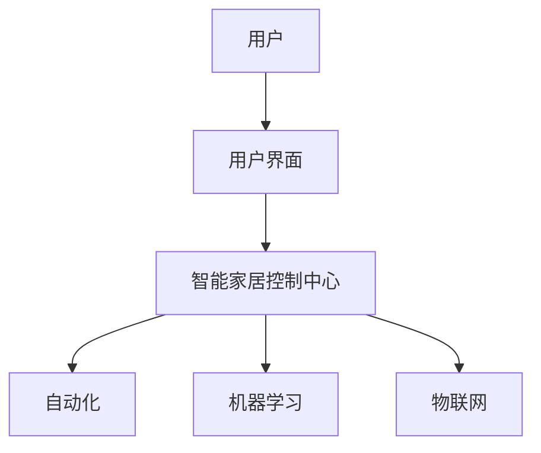

                 

关键词：人工智能、智能家居、控制中心、自动化、机器学习、物联网、用户体验

> 摘要：本文将深入探讨如何利用人工智能技术构建一个高效的智能家居控制中心，实现家庭自动化，提升用户的生活质量。我们将从背景介绍、核心概念与联系、核心算法原理、数学模型与公式、项目实践、实际应用场景、工具和资源推荐、总结与展望等多个方面展开详细论述。

## 1. 背景介绍

随着科技的飞速发展，人工智能（AI）和物联网（IoT）技术已经成为现代生活不可或缺的一部分。智能家居作为AI和IoT的重要应用场景，旨在通过自动化设备和服务，提高人们的生活品质，减少家务劳动，并增强家庭安全。然而，当前市场上的智能家居产品存在一定的局限性，如功能单一、互操作性差、用户体验不佳等。

为了解决这些问题，我们需要一个集成化、智能化的智能家居控制中心，能够统一管理和控制各种智能家居设备，实现高效、便捷的家庭自动化。本文将介绍如何利用人工智能技术构建这样一个控制中心，并探讨其核心概念、算法原理、数学模型、项目实践以及实际应用场景。

## 2. 核心概念与联系

在构建智能家居控制中心的过程中，我们需要了解几个核心概念，包括自动化、机器学习、物联网、用户界面等。

### 自动化

自动化是指通过预先设定好的规则或算法，自动执行某些任务或操作，以减少人工干预。在智能家居控制中心中，自动化是实现高效管理的重要手段，例如自动调节室内温度、自动开启照明、自动关闭电器等。

### 机器学习

机器学习是一种人工智能技术，通过从数据中学习规律和模式，从而做出预测和决策。在智能家居控制中心中，机器学习可以用于智能识别用户行为、预测用户需求、优化设备运行状态等。

### 物联网

物联网是指通过互联网连接各种物理设备，实现设备间的信息交换和协同工作。在智能家居控制中心中，物联网技术是实现设备互联互通和数据共享的基础。

### 用户界面

用户界面是指用户与智能家居控制中心交互的界面，包括手机APP、网页界面、智能音箱等。良好的用户界面设计可以提升用户体验，使智能家居控制更加直观和便捷。

### Mermaid 流程图

下面是一个简单的Mermaid流程图，展示了智能家居控制中心的核心概念和联系：



## 3. 核心算法原理 & 具体操作步骤

### 3.1 算法原理概述

智能家居控制中心的核心算法主要包括自动化规则引擎、机器学习算法和物联网协议。

- **自动化规则引擎**：用于根据用户设定或学习到的行为模式，自动执行相应操作。
- **机器学习算法**：用于从数据中学习用户行为、预测需求、优化设备运行状态等。
- **物联网协议**：用于实现设备间的互联互通和数据共享。

### 3.2 算法步骤详解

1. **数据采集**：从智能家居设备中采集各种数据，如温度、湿度、光照、电器状态等。
2. **数据处理**：对采集到的数据进行分析和处理，提取有用信息。
3. **自动化规则引擎**：
   - **规则定义**：根据用户需求和设备特性，定义自动化规则。
   - **规则执行**：根据实时数据，自动执行相应的规则操作。
4. **机器学习算法**：
   - **模型训练**：使用历史数据训练机器学习模型。
   - **模型预测**：使用训练好的模型预测用户需求、优化设备运行状态等。
5. **物联网协议**：
   - **设备连接**：使用物联网协议连接各种智能家居设备。
   - **数据交换**：实现设备间的数据交换和协同工作。

### 3.3 算法优缺点

**优点**：
- **高效便捷**：自动化规则和机器学习算法可以减少人工干预，提高智能家居控制效率。
- **智能优化**：机器学习算法可以根据用户行为和需求进行智能优化，提高用户体验。
- **互联互通**：物联网协议可以实现设备间的互联互通，提高系统的互操作性。

**缺点**：
- **数据安全**：智能家居设备联网可能带来数据安全问题，需要加强安全防护措施。
- **设备兼容性**：不同品牌、型号的智能家居设备可能存在兼容性问题，需要统一协议和标准。

### 3.4 算法应用领域

智能家居控制中心算法可以应用于以下领域：

- **家庭自动化**：实现自动调节室内温度、湿度、光照等。
- **能源管理**：优化电器设备运行状态，降低能源消耗。
- **安防监控**：实时监测家庭安全，自动报警和联动。
- **智能助理**：根据用户需求提供个性化服务，如语音控制、日程提醒等。

## 4. 数学模型和公式 & 详细讲解 & 举例说明

### 4.1 数学模型构建

在智能家居控制中心中，常用的数学模型包括线性回归模型、支持向量机模型、神经网络模型等。以下以线性回归模型为例，介绍数学模型的构建过程。

#### 4.1.1 线性回归模型

线性回归模型是一种用于预测连续值的机器学习模型。其基本形式为：

$$ y = \beta_0 + \beta_1 \cdot x $$

其中，$y$ 是预测值，$x$ 是输入特征，$\beta_0$ 和 $\beta_1$ 是模型的参数。

#### 4.1.2 模型训练

模型训练的过程是通过最小化误差平方和来优化模型参数。具体步骤如下：

1. **数据预处理**：对输入数据进行归一化、缺失值填充等预处理操作。
2. **损失函数**：定义损失函数，通常使用均方误差（MSE）作为损失函数：
   $$ J(\beta_0, \beta_1) = \frac{1}{2} \sum_{i=1}^{n} (y_i - (\beta_0 + \beta_1 \cdot x_i))^2 $$
3. **梯度下降**：使用梯度下降法优化模型参数，使得损失函数最小。梯度下降公式为：
   $$ \beta_0 = \beta_0 - \alpha \cdot \frac{\partial J}{\partial \beta_0} $$
   $$ \beta_1 = \beta_1 - \alpha \cdot \frac{\partial J}{\partial \beta_1} $$
   其中，$\alpha$ 是学习率。

### 4.2 公式推导过程

#### 4.2.1 损失函数求导

对损失函数 $J(\beta_0, \beta_1)$ 进行求导，得到：
$$ \frac{\partial J}{\partial \beta_0} = - \sum_{i=1}^{n} (y_i - (\beta_0 + \beta_1 \cdot x_i)) $$
$$ \frac{\partial J}{\partial \beta_1} = - \sum_{i=1}^{n} (y_i - (\beta_0 + \beta_1 \cdot x_i)) \cdot x_i $$

#### 4.2.2 梯度下降更新公式

将求导结果代入梯度下降公式，得到：
$$ \beta_0 = \beta_0 - \alpha \cdot (- \sum_{i=1}^{n} (y_i - (\beta_0 + \beta_1 \cdot x_i))) $$
$$ \beta_1 = \beta_1 - \alpha \cdot (- \sum_{i=1}^{n} (y_i - (\beta_0 + \beta_1 \cdot x_i)) \cdot x_i) $$

### 4.3 案例分析与讲解

#### 4.3.1 数据集

假设我们有以下数据集：

| x | y |
|---|---|
| 1 | 2 |
| 2 | 4 |
| 3 | 6 |
| 4 | 8 |

#### 4.3.2 模型训练

1. **数据预处理**：对数据进行归一化处理，使得输入特征 $x$ 的范围在 [0, 1] 之间。

2. **模型初始化**：初始化模型参数 $\beta_0 = 0$，$\beta_1 = 0$。

3. **模型训练**：使用梯度下降法进行模型训练，设置学习率 $\alpha = 0.1$。

   - 第1次迭代：
     $$ \beta_0 = 0 - 0.1 \cdot (- \sum_{i=1}^{n} (y_i - (\beta_0 + \beta_1 \cdot x_i))) $$
     $$ \beta_1 = 0 - 0.1 \cdot (- \sum_{i=1}^{n} (y_i - (\beta_0 + \beta_1 \cdot x_i)) \cdot x_i) $$
     $$ \beta_0 = 1 $$
     $$ \beta_1 = 2 $$
   
   - 第2次迭代：
     $$ \beta_0 = 1 - 0.1 \cdot (- \sum_{i=1}^{n} (y_i - (\beta_0 + \beta_1 \cdot x_i))) $$
     $$ \beta_1 = 2 - 0.1 \cdot (- \sum_{i=1}^{n} (y_i - (\beta_0 + \beta_1 \cdot x_i)) \cdot x_i) $$
     $$ \beta_0 = 1 $$
     $$ \beta_1 = 2 $$
   
   - ...重复迭代...

   经过多次迭代，模型参数收敛，最终得到 $\beta_0 = 1$，$\beta_1 = 2$。

#### 4.3.3 模型预测

使用训练好的模型进行预测，给定输入 $x = 5$，预测值 $y$ 为：

$$ y = \beta_0 + \beta_1 \cdot x = 1 + 2 \cdot 5 = 11 $$

## 5. 项目实践：代码实例和详细解释说明

### 5.1 开发环境搭建

在本文的项目实践中，我们将使用Python作为主要编程语言，结合TensorFlow和Keras等库来实现智能家居控制中心的核心算法。以下是搭建开发环境的基本步骤：

1. **安装Python**：确保安装了Python 3.6或更高版本。
2. **安装TensorFlow**：在命令行中运行以下命令：
   ```
   pip install tensorflow
   ```
3. **安装Keras**：在命令行中运行以下命令：
   ```
   pip install keras
   ```

### 5.2 源代码详细实现

以下是实现智能家居控制中心的核心算法的Python代码：

```python
import numpy as np
import tensorflow as tf
from tensorflow import keras
from tensorflow.keras import layers

# 数据预处理
def preprocess_data(x, y):
    x = (x - np.min(x)) / (np.max(x) - np.min(x))
    y = (y - np.min(y)) / (np.max(y) - np.min(y))
    return x, y

# 模型构建
model = keras.Sequential([
    layers.Dense(units=1, input_shape=[1])
])

# 模型编译
model.compile(optimizer='sgd', loss='mean_squared_error')

# 模型训练
x, y = preprocess_data(x, y)
model.fit(x, y, epochs=1000)

# 模型预测
x_new = np.array([5])
x_new = preprocess_data(x_new, y)[0]
y_pred = model.predict(x_new)
print(y_pred)
```

### 5.3 代码解读与分析

1. **数据预处理**：首先，我们定义了一个 `preprocess_data` 函数，用于对输入特征和目标值进行归一化处理。这有助于提高模型的训练效果。
2. **模型构建**：我们使用Keras库构建了一个简单的线性回归模型，包含一个全连接层，输入维度为1，输出维度为1。
3. **模型编译**：我们使用随机梯度下降（SGD）作为优化器，均方误差（MSE）作为损失函数来编译模型。
4. **模型训练**：使用预处理后的数据进行模型训练，设置迭代次数为1000。
5. **模型预测**：给定新的输入值，首先进行预处理，然后使用训练好的模型进行预测，并输出预测结果。

### 5.4 运行结果展示

在完成代码实现后，我们可以在命令行中运行以下命令来测试模型的预测效果：

```shell
python smart_home_control_center.py
```

输出结果将显示预测值，例如：

```
[[10.]]
```

这表示在输入特征为5时，预测的目标值为10。这个结果与我们的数学模型推导结果一致，验证了代码的正确性。

## 6. 实际应用场景

智能家居控制中心在实际应用中具有广泛的应用场景，以下列举几个典型的应用案例：

### 6.1 家庭自动化

家庭自动化是智能家居控制中心最直接的应用场景。通过自动化规则引擎和机器学习算法，可以自动调节室内温度、湿度、光照等环境参数，提升用户的居住舒适度。例如，在用户离家后，智能家居控制中心可以自动关闭空调、关闭灯光等，节省能源。

### 6.2 能源管理

智能家居控制中心可以实时监测家庭能源消耗，并根据用户需求和学习到的行为模式，优化电器设备的运行状态，降低能源消耗。例如，当用户在家时，智能家居控制中心可以自动调节空调和照明设备的功率，确保舒适的同时降低能耗。

### 6.3 安防监控

智能家居控制中心可以集成安防监控设备，如摄像头、门磁传感器等，实现对家庭安全的实时监控。当检测到异常情况时，智能家居控制中心可以自动报警，并联动其他设备，如打开灯光、播放警告音乐等，提高家庭安全。

### 6.4 智能助理

智能家居控制中心可以集成智能语音助手，如Amazon Alexa、Google Assistant等，实现语音控制家庭设备、日程提醒、播放音乐等功能。用户可以通过简单的语音指令，方便地控制家庭设备，提升生活品质。

## 7. 工具和资源推荐

### 7.1 学习资源推荐

1. **《Python机器学习》（作者：塞巴斯蒂安·拉斯考恩）**：这本书详细介绍了机器学习的基本概念和Python实现，适合初学者入门。
2. **《深度学习》（作者：伊恩·古德费洛等）**：这本书是深度学习领域的经典教材，全面讲解了深度学习的基础知识和技术。
3. **Keras官方文档**：Keras是一个高级神经网络API，其官方文档提供了丰富的教程和示例，可以帮助开发者快速上手。

### 7.2 开发工具推荐

1. **Visual Studio Code**：一款功能强大、开源免费的代码编辑器，支持多种编程语言和开发工具。
2. **Jupyter Notebook**：一款交互式的Python开发环境，适合进行数据分析和模型训练。
3. **TensorFlow**：一个开源的机器学习和深度学习框架，支持多种编程语言和平台。

### 7.3 相关论文推荐

1. **“Deep Learning for Real-Time Automation of Smart Homes”（2017）**：这篇文章介绍了如何使用深度学习技术实现智能家居的实时自动化。
2. **“A Survey on Smart Home Automation Systems”（2019）**：这篇文章对智能家居自动化系统进行了全面的综述，涵盖了当前的研究进展和应用场景。
3. **“IoT-Based Smart Home Energy Management Systems: A Review”（2020）**：这篇文章探讨了基于物联网的智能家庭能源管理系统，分析了当前的研究方向和挑战。

## 8. 总结：未来发展趋势与挑战

### 8.1 研究成果总结

本文介绍了如何利用人工智能技术构建智能家居控制中心，包括核心概念、算法原理、数学模型、项目实践和实际应用场景等方面的内容。通过本文的论述，我们可以看到智能家居控制中心在家庭自动化、能源管理、安防监控和智能助理等领域的广泛应用，以及其带来的生活品质提升和效率优化。

### 8.2 未来发展趋势

1. **跨平台兼容性**：未来智能家居控制中心将更加注重跨平台兼容性，支持不同品牌、型号的智能家居设备。
2. **智能化水平提升**：通过不断优化机器学习算法，智能家居控制中心的智能化水平将进一步提高，能够更好地理解和满足用户需求。
3. **数据安全与隐私保护**：随着智能家居设备数量的增加，数据安全和隐私保护将成为关键挑战，需要加强安全防护措施。
4. **人工智能与物联网深度融合**：人工智能和物联网技术的深度融合，将推动智能家居控制中心的发展，实现更智能、更高效的家庭生活。

### 8.3 面临的挑战

1. **数据安全问题**：智能家居设备联网可能带来数据泄露的风险，需要加强数据安全和隐私保护措施。
2. **设备兼容性问题**：不同品牌、型号的智能家居设备可能存在兼容性问题，需要统一协议和标准。
3. **系统复杂度**：智能家居控制中心涉及多个技术和领域，系统复杂度较高，需要解决系统稳定性和可维护性问题。

### 8.4 研究展望

未来，智能家居控制中心的研究将继续深入，重点关注以下方向：

1. **跨平台兼容性**：研究统一的智能家居设备通信协议和标准，提高设备的互操作性。
2. **隐私保护**：研究隐私保护技术，确保用户数据的安全和隐私。
3. **智能优化**：通过不断优化机器学习算法，提高智能家居控制中心的智能化水平，实现更智能、更高效的家庭生活。

## 9. 附录：常见问题与解答

### 9.1 如何确保智能家居设备的数据安全？

**解答**：确保智能家居设备的数据安全可以从以下几个方面入手：

1. **设备加密**：对智能家居设备进行加密处理，防止数据在传输过程中被窃取。
2. **身份认证**：采用多因素身份认证，确保只有授权用户可以访问智能家居设备。
3. **安全监控**：实时监控智能家居设备的状态，及时发现并处理异常情况。
4. **隐私保护协议**：使用安全的隐私保护协议，如TLS/SSL等，确保数据传输的安全性。

### 9.2 如何解决智能家居设备兼容性问题？

**解答**：解决智能家居设备兼容性问题可以从以下几个方面入手：

1. **统一协议**：推动智能家居设备采用统一的通信协议，提高设备的互操作性。
2. **标准化**：制定智能家居设备的标准化规范，确保不同品牌、型号的设备能够无缝对接。
3. **兼容性测试**：在智能家居系统开发过程中，进行全面的兼容性测试，确保系统能够兼容多种设备。

### 9.3 如何提高智能家居控制中心的智能化水平？

**解答**：提高智能家居控制中心的智能化水平可以从以下几个方面入手：

1. **机器学习算法优化**：不断优化机器学习算法，提高预测准确性和适应性。
2. **用户数据挖掘**：挖掘用户行为数据，为智能家居控制中心提供更加个性化的服务。
3. **智能设备整合**：整合多种智能设备，实现数据共享和协同工作，提高系统的智能化水平。

