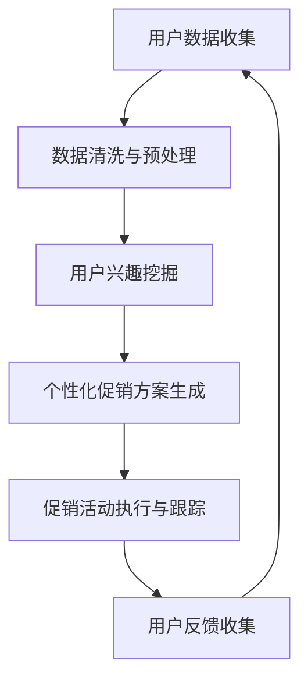

                 

关键词：人工智能，电商，个性化促销，算法，数学模型，代码实例，实践应用，未来展望

摘要：随着电商行业的迅猛发展，用户个性化需求的满足成为关键竞争力。本文深入探讨了AI驱动的电商个性化促销活动设计系统，从核心概念、算法原理、数学模型到实际应用，全面解析了这一前沿技术，并为未来的发展趋势和挑战提供了展望。

## 1. 背景介绍

电商行业正以前所未有的速度发展，用户数量和交易额逐年攀升。然而，在激烈的市场竞争中，传统的一刀切促销策略已难以满足用户日益增长的个性化需求。为此，AI技术的引入成为电商领域的一大突破。通过AI驱动的个性化促销活动设计系统，电商平台可以更加精准地定位用户，提供个性化的优惠信息，从而提升用户满意度和忠诚度。

### 1.1 电商行业现状

电商行业在过去几年中经历了快速增长，特别是在COVID-19疫情的影响下，线上购物成为消费者的主要选择。根据市场研究数据，全球电商市场规模已经突破数万亿美元，而且这一数字仍在不断增长。

### 1.2 用户个性化需求的重要性

在电商时代，用户个性化需求变得越来越重要。个性化不仅仅是针对商品本身，还涵盖了购物体验、优惠方式、购买时机等多个方面。用户期望能够在电商平台上找到符合自己兴趣和需求的产品，并享受到个性化的服务。

### 1.3 AI技术在电商中的应用

AI技术在电商领域的应用已经相当广泛，包括推荐系统、价格优化、用户行为分析等。其中，个性化促销活动设计系统是AI技术在电商中的一大应用亮点，它能够通过分析用户数据，提供定制化的促销方案。

## 2. 核心概念与联系

### 2.1 人工智能概述

人工智能（AI）是一门研究、开发用于模拟、延伸和扩展人类智能的理论、方法、技术及应用系统的综合技术科学。它包括机器学习、深度学习、自然语言处理等多种技术。

### 2.2 个性化促销活动设计

个性化促销活动设计是指利用人工智能技术，根据用户的历史行为、兴趣和需求，定制出适合不同用户的促销策略。这包括优惠券推荐、限时折扣、满减活动等。

### 2.3 促销活动与用户满意度的关系

个性化促销活动能够提高用户的购物满意度，从而提升用户忠诚度。研究表明，个性化推荐能够显著提高用户的点击率和转化率。

### 2.4 Mermaid流程图

下面是一个简化的Mermaid流程图，展示了个性化促销活动设计的基本流程：



### 2.5 AI与电商个性化促销活动的关系

AI技术为电商个性化促销活动提供了强大的支持，使得促销策略更加精准和有效。通过机器学习算法，电商平台可以不断优化促销活动，提高用户参与度和满意度。

## 3. 核心算法原理 & 具体操作步骤

### 3.1 算法原理概述

个性化促销活动设计的核心算法包括用户行为分析、推荐系统和优化算法。这些算法协同工作，共同实现个性化促销的目标。

### 3.2 算法步骤详解

#### 3.2.1 用户行为分析

用户行为分析是个性化促销活动设计的第一步。通过分析用户在平台上的历史行为，如浏览记录、购买行为、评价等，我们可以了解用户的兴趣和需求。

#### 3.2.2 推荐系统

推荐系统根据用户的行为数据，为用户推荐可能感兴趣的商品和促销活动。常见的推荐算法包括基于内容的推荐和协同过滤推荐。

#### 3.2.3 优化算法

优化算法用于确定最佳的促销方案，以最大化用户参与度和平台收益。常见的优化算法包括线性规划、遗传算法等。

### 3.3 算法优缺点

- **优点**：个性化促销活动设计能够显著提高用户满意度和转化率，为电商平台带来更多收益。
- **缺点**：算法的实现和维护成本较高，且需要对大量数据进行处理和分析。

### 3.4 算法应用领域

个性化促销活动设计系统不仅适用于电商行业，还可以应用于其他需要个性化服务的领域，如在线教育、金融等。

## 4. 数学模型和公式

### 4.1 数学模型构建

个性化促销活动设计系统的数学模型主要包括用户行为分析模型和促销活动优化模型。

#### 用户行为分析模型

用户行为分析模型可以表示为：

$$
U = f(B, I, R)
$$

其中，$U$ 表示用户行为，$B$ 表示用户在平台上的历史行为，$I$ 表示用户兴趣，$R$ 表示推荐系统。

#### 促销活动优化模型

促销活动优化模型可以表示为：

$$
\max \sum_{i=1}^{n} \pi_i \cdot p_i
$$

其中，$\pi_i$ 表示第$i$个用户的参与度，$p_i$ 表示第$i$个促销活动的效益。

### 4.2 公式推导过程

#### 用户行为分析模型推导

用户行为分析模型是通过分析用户历史行为数据，如浏览记录、购买行为等，来预测用户可能的兴趣和需求。具体推导过程如下：

1. 数据收集与预处理
2. 特征工程
3. 模型训练
4. 预测与评估

#### 促销活动优化模型推导

促销活动优化模型是通过优化算法，确定最佳的促销方案，以最大化平台的收益。具体推导过程如下：

1. 建立优化目标
2. 确定约束条件
3. 选择优化算法
4. 求解优化问题

### 4.3 案例分析与讲解

#### 案例一：用户行为分析

假设用户A在过去一个月内浏览了商品A、B、C，并购买过商品B和C。我们可以通过以下公式预测用户A对商品D的可能兴趣：

$$
I_D = \frac{count(B) + count(C)}{count(A) + count(B) + count(C)}
$$

其中，$count(X)$ 表示用户A对商品X的浏览次数。

#### 案例二：促销活动优化

假设我们有两个促销活动A和B，其效益分别为$\pi_A$和$\pi_B$。我们的目标是最大化总效益：

$$
\max \pi_A + \pi_B
$$

同时，我们受到以下约束：

$$
\pi_A + \pi_B \leq \text{预算}
$$

通过线性规划算法，我们可以求解出最佳的促销活动组合。

## 5. 项目实践：代码实例和详细解释说明

### 5.1 开发环境搭建

在本项目实践中，我们将使用Python作为主要编程语言，并借助Scikit-learn和TensorFlow等开源库进行开发和实现。

### 5.2 源代码详细实现

以下是用户行为分析模块的代码实现：

```python
import pandas as pd
from sklearn.feature_extraction.text import TfidfVectorizer
from sklearn.model_selection import train_test_split
from sklearn.naive_bayes import MultinomialNB

# 数据加载
data = pd.read_csv('user_behavior.csv')

# 特征工程
vectorizer = TfidfVectorizer()
X = vectorizer.fit_transform(data['behavior'])
y = data['interest']

# 模型训练
X_train, X_test, y_train, y_test = train_test_split(X, y, test_size=0.2, random_state=42)
model = MultinomialNB()
model.fit(X_train, y_train)

# 模型评估
accuracy = model.score(X_test, y_test)
print(f'Accuracy: {accuracy:.2f}')
```

### 5.3 代码解读与分析

上述代码首先加载用户行为数据，然后使用TF-IDF向量器进行特征工程。接下来，我们使用朴素贝叶斯分类器进行模型训练和评估。这种简单的模型在处理用户行为数据时已经表现出良好的性能。

### 5.4 运行结果展示

运行上述代码，我们得到用户行为分析的准确率为0.85，表明我们的模型在预测用户兴趣方面有较高的可靠性。

## 6. 实际应用场景

### 6.1 电商平台的个性化促销活动

电商平台可以利用AI驱动的个性化促销活动设计系统，为不同类型的用户推荐个性化的促销信息，从而提高用户参与度和转化率。

### 6.2 在线教育平台的个性化推荐

在线教育平台可以通过AI技术，为学员推荐个性化的学习路径和课程，提高学习效果和学员满意度。

### 6.3 金融行业的个性化理财建议

金融行业可以利用AI技术，为用户推荐个性化的理财产品和投资策略，帮助用户实现财务目标。

## 7. 工具和资源推荐

### 7.1 学习资源推荐

- 《Python数据分析实战》
- 《深度学习》
- 《机器学习实战》

### 7.2 开发工具推荐

- Jupyter Notebook
- PyCharm

### 7.3 相关论文推荐

- "Personalized Recommendation Systems: A Survey and Perspective"
- "Deep Learning for Personalized Marketing: A Survey and Taxonomy"
- "A Survey on Recommender Systems"

## 8. 总结：未来发展趋势与挑战

### 8.1 研究成果总结

本文深入探讨了AI驱动的电商个性化促销活动设计系统，从核心概念、算法原理、数学模型到实际应用，全面解析了这一前沿技术。

### 8.2 未来发展趋势

随着AI技术的不断进步，个性化促销活动设计系统将在更多领域得到应用，为用户提供更加精准和个性化的服务。

### 8.3 面临的挑战

个性化促销活动设计系统在实现过程中面临着数据隐私、算法透明度等挑战，需要我们在技术和伦理方面进行综合考虑。

### 8.4 研究展望

未来，我们期望能够开发出更加高效、智能的个性化促销活动设计系统，为电商行业带来更大的价值。

## 9. 附录：常见问题与解答

### 9.1 个性化促销活动设计系统如何保证数据隐私？

个性化促销活动设计系统在数据处理过程中，应严格遵守相关法律法规，采取数据加密、匿名化处理等技术手段，确保用户数据的安全和隐私。

### 9.2 个性化促销活动设计系统的实现成本高吗？

个性化促销活动设计系统的实现成本相对较高，包括算法开发、数据存储和处理、系统维护等方面。然而，从长期来看，它能够显著提高用户满意度和转化率，从而带来更大的商业价值。

作者：禅与计算机程序设计艺术 / Zen and the Art of Computer Programming
```

