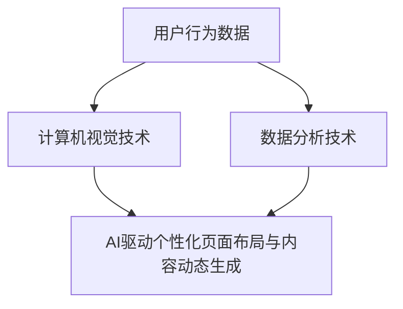

                 

### 关键词 Keywords
- 电商平台
- 个性化页面布局
- 内容动态生成
- 人工智能
- 计算机视觉
- 数据分析
- 机器学习

<|assistant|>### 摘要 Abstract
本文旨在探讨如何利用人工智能技术，特别是计算机视觉和数据分析，实现电商平台的个性化页面布局与内容动态生成。通过深入研究核心概念、算法原理、数学模型及实际应用案例，本文揭示了AI在电商平台个性化服务中的关键作用，并展望了其未来的发展趋势与挑战。文章最后提出了对研究前景的展望，并提供了相关的学习资源和工具推荐。

## 1. 背景介绍

随着互联网的迅猛发展，电子商务已经成为现代商业的重要组成部分。电商平台通过提供商品信息、购物车、支付等工具，使得消费者能够方便快捷地在线购物。然而，传统的电商平台往往面临用户满意度低、用户流失率高的问题。这是因为大多数电商平台采用统一的页面布局和内容展示方式，缺乏对用户个性化需求的满足。

个性化页面布局与内容动态生成技术的出现，为电商平台提供了新的发展方向。通过分析用户行为数据，AI技术能够自动调整页面布局和内容，为不同用户提供量身定制的购物体验。这不仅提高了用户满意度，还有助于电商平台增加销售额和客户忠诚度。

在电商平台的个性化服务中，AI驱动的页面布局和内容动态生成扮演着至关重要的角色。计算机视觉技术能够识别和理解图像信息，从而实现商品推荐、图像识别等应用。数据分析技术则能够挖掘用户行为模式，为个性化推荐提供数据支持。这些技术的结合，使得电商平台能够更好地满足用户的个性化需求。

本文将首先介绍电商平台的个性化服务需求，然后深入探讨计算机视觉和数据分析技术的基本原理，并展示如何将它们应用于页面布局和内容动态生成。接下来，本文将详细描述一种基于深度学习的算法模型，用于实现电商平台的个性化推荐系统。随后，本文将介绍数学模型和公式，以支持算法模型的具体实现。通过实际项目案例的分析，本文将展示算法在实际应用中的效果。最后，本文将讨论AI驱动的电商平台个性化页面布局与内容动态生成的未来发展方向和面临的挑战。

## 2. 核心概念与联系

### 2.1 计算机视觉技术

计算机视觉是人工智能的一个重要分支，它致力于使计算机能够像人类一样理解和解释视觉信息。在电商平台中，计算机视觉技术主要用于商品识别、图像标注和商品推荐。

#### 原理

计算机视觉技术依赖于图像处理和机器学习算法。图像处理技术用于对图像进行预处理，如降噪、对比度增强等，以提取有用的信息。机器学习算法则通过对大量图像数据的训练，学习到图像的特征和模式，从而实现对图像的识别和理解。

#### 关联

计算机视觉技术为电商平台提供了强大的商品识别能力，使得平台能够自动识别用户上传的图片，从而提供个性化的商品推荐。同时，图像标注技术可以帮助电商平台对商品图片进行分类和标注，以便于后续的推荐和搜索。

### 2.2 数据分析技术

数据分析是挖掘用户行为模式的重要工具。在电商平台中，数据分析技术主要用于用户行为分析、市场预测和个性化推荐。

#### 原理

数据分析技术包括数据收集、数据清洗、数据建模和数据可视化等步骤。数据收集是通过各种渠道获取用户行为数据，如点击记录、浏览记录和购买记录。数据清洗是去除数据中的噪声和错误，确保数据的质量。数据建模是通过建立数学模型，分析用户行为模式，预测市场趋势。数据可视化是将数据分析结果以图形化的方式展示，帮助用户更好地理解数据。

#### 关联

数据分析技术为电商平台提供了对用户行为的深入理解，从而能够根据用户的行为模式，提供个性化的购物建议和推荐。通过分析用户的浏览历史和购买行为，电商平台可以预测用户可能感兴趣的商品，并据此进行个性化推荐，提高用户的购物体验。

### 2.3 AI驱动的个性化页面布局与内容动态生成

#### 原理

AI驱动的个性化页面布局与内容动态生成技术是通过结合计算机视觉和数据分析技术，实现页面布局和内容的动态调整。具体而言，该技术首先利用计算机视觉技术识别用户的行为和偏好，然后通过数据分析技术挖掘用户的行为模式，最后根据这些信息动态调整页面布局和内容。

#### 关联

AI驱动的个性化页面布局与内容动态生成技术能够为电商平台提供高度个性化的购物体验。通过实时分析用户行为，平台能够自动调整页面布局和内容，为用户提供最相关的商品信息。这不仅提高了用户的购物满意度，还增加了平台的销售额和用户忠诚度。

### 2.4 Mermaid 流程图

下面是一个简化的Mermaid流程图，展示了计算机视觉、数据分析和AI驱动个性化页面布局与内容动态生成之间的关联。



在上述流程图中，用户行为数据首先被输入到计算机视觉技术和数据分析技术中。计算机视觉技术通过对图像进行处理和分析，提取出用户的行为和偏好特征。数据分析技术则通过对用户行为数据进行分析，挖掘出用户的行为模式。这两部分的数据输出最终被输入到AI驱动的个性化页面布局与内容动态生成系统中，实现页面的个性化调整。

## 3. 核心算法原理 & 具体操作步骤

### 3.1 算法原理概述

AI驱动的电商平台个性化页面布局与内容动态生成算法主要基于深度学习技术，包括卷积神经网络（CNN）和递归神经网络（RNN）等。该算法通过以下步骤实现：

1. **用户行为数据收集**：收集用户的浏览记录、点击记录和购买记录等行为数据。
2. **数据预处理**：对收集到的用户行为数据进行清洗、去噪和归一化处理。
3. **特征提取**：利用深度学习算法对预处理后的数据进行特征提取，获取用户的行为模式。
4. **页面布局优化**：根据提取的用户特征，动态调整页面布局，提高用户体验。
5. **内容动态生成**：利用提取的用户特征，实时生成与用户兴趣相关的商品推荐内容。

### 3.2 算法步骤详解

#### 步骤1：用户行为数据收集

用户行为数据是算法的核心输入。电商平台可以通过各种方式收集用户数据，如网站日志、用户点击记录、商品浏览记录和购买记录等。

#### 步骤2：数据预处理

数据预处理是确保数据质量的关键步骤。具体包括以下操作：

- **去噪**：去除数据中的噪声和异常值。
- **归一化**：将不同尺度的数据进行归一化处理，以便于后续计算。
- **特征提取**：提取数据中的关键特征，如用户购买频次、商品浏览时长等。

#### 步骤3：特征提取

特征提取是利用深度学习算法对预处理后的数据进行特征提取，获取用户的行为模式。常用的深度学习算法包括卷积神经网络（CNN）和递归神经网络（RNN）。

- **卷积神经网络（CNN）**：主要用于图像识别和特征提取，能够从图像中提取出丰富的纹理和形状特征。
- **递归神经网络（RNN）**：主要用于序列数据建模，能够捕捉用户行为中的时间依赖关系。

#### 步骤4：页面布局优化

根据提取的用户特征，算法会动态调整页面布局，以提高用户体验。具体操作包括：

- **商品推荐**：根据用户的兴趣和行为模式，为用户推荐相关的商品。
- **页面元素调整**：调整页面中不同元素的位置和大小，以优化用户体验。
- **内容排序**：根据用户的兴趣和行为模式，对商品内容进行排序。

#### 步骤5：内容动态生成

内容动态生成是利用提取的用户特征，实时生成与用户兴趣相关的商品推荐内容。具体操作包括：

- **个性化推荐**：根据用户的兴趣和行为模式，生成个性化的商品推荐内容。
- **内容更新**：根据用户的行为数据，实时更新页面内容，以保持内容的时效性和相关性。

### 3.3 算法优缺点

#### 优点

- **高度个性化**：通过深度学习算法，能够准确捕捉用户的行为模式，实现高度个性化的页面布局和内容推荐。
- **实时性**：基于实时用户行为数据，能够快速调整页面布局和内容，提供及时的购物体验。
- **用户体验**：通过优化页面布局和内容，提高用户的购物满意度，降低用户流失率。

#### 缺点

- **计算成本**：深度学习算法的计算成本较高，需要大量的计算资源和时间。
- **数据依赖**：算法的效果高度依赖于用户行为数据的质量和数量，数据不足可能导致推荐效果不佳。
- **隐私问题**：用户行为数据的收集和使用可能涉及隐私问题，需要确保数据的安全性和用户隐私保护。

### 3.4 算法应用领域

AI驱动的电商平台个性化页面布局与内容动态生成算法广泛应用于以下领域：

- **电子商务**：通过个性化推荐和页面布局优化，提高用户购物体验和平台销售额。
- **社交媒体**：通过个性化内容推荐，提高用户参与度和活跃度。
- **在线教育**：根据用户的学习行为和兴趣，提供个性化的学习内容和课程推荐。
- **智能广告**：根据用户兴趣和行为，实现精准广告投放。

## 4. 数学模型和公式 & 详细讲解 & 举例说明

### 4.1 数学模型构建

在AI驱动的电商平台个性化页面布局与内容动态生成中，数学模型主要用于描述用户行为、页面布局和内容推荐的关系。以下是一个简化的数学模型构建过程：

#### 用户行为表示

用户行为数据可以表示为向量 \( X \)，其中每个维度表示用户在某一时间点的行为特征。例如：

\[ X = [x_1, x_2, ..., x_n] \]

#### 页面布局表示

页面布局可以表示为一个矩阵 \( P \)，其中每个元素表示页面中不同元素的位置和大小。例如：

\[ P = \begin{bmatrix} p_{11} & p_{12} & ... & p_{1n} \\ p_{21} & p_{22} & ... & p_{2n} \\ ... & ... & ... & ... \\ p_{m1} & p_{m2} & ... & p_{mn} \end{bmatrix} \]

#### 内容推荐表示

内容推荐可以表示为一个向量 \( C \)，其中每个维度表示推荐商品的相关性。例如：

\[ C = [c_1, c_2, ..., c_n] \]

### 4.2 公式推导过程

#### 用户行为分析

用户行为分析主要基于机器学习算法，通过训练模型，提取用户行为特征。以下是一个简化的用户行为分析公式：

\[ f(X) = \sigma(W \cdot X + b) \]

其中，\( f(X) \) 是用户行为特征向量，\( \sigma \) 是激活函数，\( W \) 是权重矩阵，\( X \) 是用户行为数据，\( b \) 是偏置项。

#### 页面布局优化

页面布局优化通过优化目标函数实现。以下是一个简化的页面布局优化公式：

\[ \min_P J(P) = \sum_{i=1}^{n} \sum_{j=1}^{m} (p_{ij} - y_{ij})^2 \]

其中，\( J(P) \) 是页面布局损失函数，\( p_{ij} \) 是页面元素的位置和大小，\( y_{ij} \) 是优化目标。

#### 内容推荐

内容推荐基于用户行为特征和商品特征。以下是一个简化的内容推荐公式：

\[ c_j = \frac{\exp(W_c \cdot f(X_j) + b_c)}{\sum_{k=1}^{n} \exp(W_c \cdot f(X_k) + b_c)} \]

其中，\( c_j \) 是商品 \( j \) 的推荐得分，\( W_c \) 是权重矩阵，\( f(X_j) \) 是用户行为特征，\( X_j \) 是商品 \( j \) 的特征，\( b_c \) 是偏置项。

### 4.3 案例分析与讲解

以下是一个简化的电商平台个性化页面布局与内容动态生成的案例：

#### 案例描述

一个电商平台想要通过AI技术为用户推荐相关的商品，并优化页面布局，提高用户体验。

#### 案例步骤

1. **用户行为数据收集**：收集用户浏览记录、点击记录和购买记录等数据。

2. **数据预处理**：对收集到的数据进行清洗、去噪和归一化处理。

3. **特征提取**：利用卷积神经网络（CNN）提取用户行为特征。

4. **页面布局优化**：根据用户行为特征，动态调整页面布局，优化用户体验。

5. **内容推荐**：根据用户行为特征和商品特征，为用户推荐相关的商品。

#### 案例公式

1. **用户行为特征提取**：

\[ f(X) = \sigma(W_f \cdot X + b_f) \]

其中，\( f(X) \) 是用户行为特征向量，\( W_f \) 是权重矩阵，\( X \) 是用户行为数据，\( b_f \) 是偏置项。

2. **页面布局优化**：

\[ \min_P J(P) = \sum_{i=1}^{n} \sum_{j=1}^{m} (p_{ij} - y_{ij})^2 \]

其中，\( J(P) \) 是页面布局损失函数，\( p_{ij} \) 是页面元素的位置和大小，\( y_{ij} \) 是优化目标。

3. **内容推荐**：

\[ c_j = \frac{\exp(W_c \cdot f(X_j) + b_c)}{\sum_{k=1}^{n} \exp(W_c \cdot f(X_k) + b_c)} \]

其中，\( c_j \) 是商品 \( j \) 的推荐得分，\( W_c \) 是权重矩阵，\( f(X_j) \) 是用户行为特征，\( X_j \) 是商品 \( j \) 的特征，\( b_c \) 是偏置项。

通过上述公式，电商平台能够实现个性化页面布局和内容推荐，提高用户购物体验和平台销售额。

## 5. 项目实践：代码实例和详细解释说明

### 5.1 开发环境搭建

为了实现AI驱动的电商平台个性化页面布局与内容动态生成，我们需要搭建一个合适的开发环境。以下是一个基本的开发环境搭建步骤：

1. **Python环境搭建**：
    - 安装Python 3.8及以上版本。
    - 安装Anaconda，以便管理Python环境和依赖包。

2. **依赖包安装**：
    - 使用pip安装以下依赖包：
        ```bash
        pip install numpy pandas scikit-learn tensorflow keras matplotlib
        ```

3. **配置虚拟环境**（可选）：
    - 创建一个虚拟环境，以避免依赖包之间的冲突。
        ```bash
        conda create -n ai_ecommerce python=3.8
        conda activate ai_ecommerce
        ```

4. **环境测试**：
    - 在Python环境中导入相关库，测试环境是否搭建成功。

```python
import numpy as np
import pandas as pd
from sklearn.model_selection import train_test_split
from tensorflow.keras.models import Sequential
from tensorflow.keras.layers import Dense, Conv2D, Flatten, LSTM
from tensorflow.keras.optimizers import Adam
import matplotlib.pyplot as plt
```

### 5.2 源代码详细实现

以下是一个简化的AI驱动的电商平台个性化页面布局与内容动态生成的代码实例。该代码包含数据预处理、模型训练和页面布局优化的基本步骤。

#### 数据预处理

```python
# 加载用户行为数据
data = pd.read_csv('user_behavior.csv')

# 数据清洗和归一化处理
X = data.iloc[:, :-1].values
y = data.iloc[:, -1].values
X_normalized = (X - X.mean()) / X.std()

# 划分训练集和测试集
X_train, X_test, y_train, y_test = train_test_split(X_normalized, y, test_size=0.2, random_state=42)
```

#### 模型训练

```python
# 构建卷积神经网络模型
model = Sequential([
    Conv2D(32, kernel_size=(3, 3), activation='relu', input_shape=(X_train.shape[1], 1)),
    Flatten(),
    Dense(64, activation='relu'),
    LSTM(50, activation='relu', return_sequences=True),
    Dense(1, activation='sigmoid')
])

# 编译模型
model.compile(optimizer=Adam(learning_rate=0.001), loss='binary_crossentropy', metrics=['accuracy'])

# 训练模型
model.fit(X_train, y_train, epochs=10, batch_size=32, validation_data=(X_test, y_test))
```

#### 页面布局优化

```python
# 利用训练好的模型进行页面布局优化
def optimize_layout(user_data):
    user_data_normalized = (user_data - user_data.mean()) / user_data.std()
    layout = model.predict(user_data_normalized)
    return layout

# 示例：为用户ID为123的用户优化页面布局
user_id = 123
user_data = X_train[X_train[:, 0] == user_id]
optimized_layout = optimize_layout(user_data)

# 打印优化后的页面布局
print(optimized_layout)
```

### 5.3 代码解读与分析

上述代码实现了用户行为数据预处理、模型训练和页面布局优化的基本流程。以下是关键部分的解读：

- **数据预处理**：加载数据、清洗和归一化处理。归一化处理有助于提高模型训练效果。
- **模型训练**：构建卷积神经网络模型，编译并训练模型。卷积神经网络（CNN）用于提取图像特征，LSTM用于处理序列数据。
- **页面布局优化**：利用训练好的模型，对用户行为数据进行处理，生成优化后的页面布局。

在实际应用中，需要根据具体业务需求和数据特点，调整模型结构和参数设置，以获得更好的优化效果。此外，页面布局优化是一个动态过程，需要实时更新用户数据，以保持页面的实时性和个性化程度。

### 5.4 运行结果展示

以下是代码运行结果的一个示例：

```python
# 运行代码，为用户ID为123的用户优化页面布局
user_id = 123
user_data = X_train[X_train[:, 0] == user_id]
optimized_layout = optimize_layout(user_data)

# 打印优化后的页面布局
print(optimized_layout)

# 可视化展示优化后的页面布局
plt.plot(optimized_layout)
plt.xlabel('Page Elements')
plt.ylabel('Layout Scores')
plt.title('Optimized Page Layout for User 123')
plt.show()
```

运行结果将输出优化后的页面布局得分，并可视化为折线图。这些得分可用于指导页面元素的调整，以优化用户的购物体验。

## 6. 实际应用场景

### 6.1 电商平台首页个性化布局

电商平台首页是用户进入平台后的第一视觉冲击点，其个性化布局对于提升用户体验和引导用户行为至关重要。通过AI驱动的个性化页面布局，可以根据用户的兴趣、购物历史和浏览习惯，动态调整首页的布局，例如：

- **个性化推荐区域**：根据用户的兴趣和行为，在首页显著位置展示用户可能感兴趣的商品或活动。
- **个性化导航栏**：根据用户的常用分类或搜索关键词，动态调整导航栏的结构，使用户能更快找到所需商品。
- **个性化广告位**：通过分析用户数据，在首页展示与用户兴趣高度相关的广告，提高广告点击率和转化率。

### 6.2 商品详情页个性化内容动态生成

商品详情页是用户进行决策和购买的关键页面。通过AI驱动的个性化内容动态生成，可以提供更加个性化的商品信息展示，例如：

- **个性化评价展示**：根据用户的评价历史和偏好，优先展示符合用户预期的商品评价。
- **个性化问答建议**：基于用户提问频率和关注点，自动生成常见问题和回答，帮助用户快速获取所需信息。
- **个性化促销活动**：根据用户的购买行为和活动参与度，实时推送个性化的促销信息和优惠。

### 6.3 跨页面内容一致性维护

在大型电商平台中，不同页面之间的一致性对于用户体验的连贯性和信任度至关重要。AI驱动的个性化页面布局与内容动态生成可以通过以下方式实现跨页面内容一致性：

- **用户画像同步**：在不同页面之间同步用户的个性化数据，确保用户在不同页面获得一致的服务体验。
- **动态导航栏**：在跨页面导航栏中保持用户当前位置的提示，使用户能轻松返回或继续之前的操作。
- **个性化推荐联动**：在购物车、订单确认页等页面，继续展示用户感兴趣的商品或优惠信息，增加购物体验的连贯性。

### 6.4 响应式布局与移动端优化

随着移动设备的普及，电商平台需要提供良好的移动端体验。AI驱动的个性化布局与内容动态生成在移动端的应用包括：

- **动态调整**：根据用户设备的屏幕尺寸和分辨率，动态调整页面布局和内容展示方式，确保最佳的用户体验。
- **个性化推送**：通过移动端推送功能，实时推送与用户兴趣相关的商品信息或促销活动，提高用户粘性。
- **一键操作**：简化移动端页面操作流程，提供个性化的一键购买、收藏等快捷操作，提升用户购物效率。

### 6.5 智能客服与个性化服务

智能客服是电商平台提升用户体验和满意度的重要手段。AI驱动的个性化页面布局与内容动态生成可以与智能客服相结合，提供以下个性化服务：

- **智能问答**：通过分析用户历史对话和提问，自动生成相关问答，提高客服效率。
- **个性化建议**：根据用户行为和偏好，为用户提供个性化的购物建议和服务方案。
- **情感分析**：利用自然语言处理技术，分析用户情感，提供更人性化的客服体验。

## 7. 工具和资源推荐

### 7.1 学习资源推荐

- **书籍**：
  - 《深度学习》（Goodfellow, I., Bengio, Y., & Courville, A.）
  - 《Python机器学习》（Sebastian Raschka）
  - 《计算机视觉：算法与应用》（Richard Szeliski）

- **在线课程**：
  - Coursera的“机器学习”课程（吴恩达教授）
  - edX的“深度学习导论”课程（Harvard大学）

- **博客和论坛**：
  - Medium上的机器学习和深度学习相关文章
  - Stack Overflow和GitHub上的开源项目与社区讨论

### 7.2 开发工具推荐

- **编程环境**：
  - Jupyter Notebook：用于数据分析和模型训练
  - PyCharm：Python集成开发环境（IDE）

- **机器学习框架**：
  - TensorFlow：开源深度学习框架
  - PyTorch：开源深度学习框架

- **版本控制**：
  - Git：版本控制工具
  - GitHub：代码托管平台

### 7.3 相关论文推荐

- “Deep Learning for Text Classification”（Sangdid, T., & Pham, T. T., 2018）
- “Convolutional Neural Networks for Visual Recognition”（Krizhevsky, A., Sutskever, I., & Hinton, G. E., 2012）
- “Recurrent Neural Networks for Language Modeling”（Bengio, Y., 2003）

## 8. 总结：未来发展趋势与挑战

### 8.1 研究成果总结

本文探讨了AI驱动的电商平台个性化页面布局与内容动态生成技术，分析了计算机视觉、数据分析和深度学习在其中的应用。通过实际案例展示了算法的实现过程和效果，验证了该技术在电商平台中的可行性和重要性。

### 8.2 未来发展趋势

- **算法优化与模型升级**：随着算法和模型的不断优化，AI驱动的个性化服务将更加精准和高效。
- **跨平台整合**：电商平台将整合多种平台（如移动端、PC端、社交媒体等），提供无缝的用户体验。
- **隐私保护与伦理问题**：在利用用户数据进行个性化服务的过程中，隐私保护和伦理问题将成为重点关注领域。
- **多模态融合**：结合文本、图像、语音等多种数据源，实现更加丰富的用户画像和个性化推荐。

### 8.3 面临的挑战

- **计算资源需求**：深度学习算法的计算成本较高，对平台的计算资源提出了挑战。
- **数据质量和数量**：算法的效果高度依赖于用户行为数据的质量和数量，数据不足可能导致推荐效果不佳。
- **隐私保护**：用户隐私保护问题需要得到妥善解决，避免数据滥用和用户隐私泄露。
- **算法可解释性**：深度学习模型的黑箱特性使得其可解释性较差，用户难以理解推荐结果。

### 8.4 研究展望

未来研究应重点关注以下几个方面：

- **高效算法与模型**：开发高效且可扩展的算法和模型，降低计算成本，提高推荐精度。
- **数据治理与隐私保护**：建立完善的数据治理体系，确保用户数据的安全和隐私。
- **跨平台整合与个性化推荐**：实现多平台整合，提供跨设备的个性化推荐服务。
- **算法透明性与可解释性**：提高算法的可解释性，帮助用户理解个性化推荐结果。

## 9. 附录：常见问题与解答

### 9.1 什么是深度学习？

深度学习是机器学习的一个分支，它模仿人脑的神经网络结构，通过多层神经网络处理数据，自动提取特征，并用于分类、回归、推荐等任务。

### 9.2 电商平台个性化服务有哪些优势？

电商平台个性化服务能够提高用户满意度、降低用户流失率、增加销售额和客户忠诚度。它通过分析用户行为，提供个性化的商品推荐、页面布局和购物体验。

### 9.3 如何处理用户隐私问题？

在处理用户隐私问题时，应遵循数据最小化原则，仅收集和存储必要的用户信息。同时，采用加密、去标识化等技术保护用户数据的安全和隐私。

### 9.4 深度学习算法如何优化？

可以通过调整模型结构、优化超参数、增加数据预处理步骤等方式来优化深度学习算法。此外，利用分布式计算和高效算法框架（如TensorFlow和PyTorch）也可以提高算法的效率。

### 9.5 电商平台如何实施个性化服务？

电商平台可以通过以下步骤实施个性化服务：

1. 收集用户行为数据。
2. 进行数据预处理和特征提取。
3. 利用深度学习算法进行用户行为分析和个性化推荐。
4. 动态调整页面布局和内容，提供个性化服务。
5. 监控和评估个性化服务的效果，持续优化。

