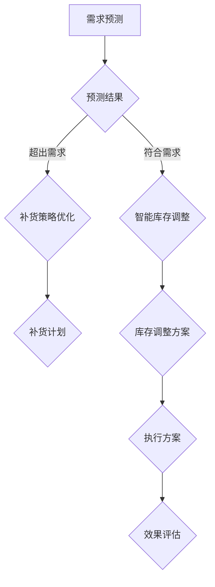

                 

关键词：AI、电商平台、库存管理、智能系统、算法、数学模型、项目实践

> 摘要：本文将介绍如何利用人工智能技术，开发一套高效、智能的电商平台库存管理系统。我们将深入探讨核心概念、算法原理、数学模型构建以及实际项目中的应用，旨在为电商平台提供一种全新的库存管理解决方案。

## 1. 背景介绍

随着互联网的迅猛发展，电商平台已经成为现代商业的重要组成部分。库存管理作为电商运营的核心环节，直接关系到平台的运营效率和用户体验。传统的库存管理系统往往依赖于人工操作和经验判断，效率低下且容易出现误差。随着人工智能技术的不断成熟，AI驱动的库存管理系统逐渐成为电商平台的发展方向。

本文旨在探讨如何利用人工智能技术，特别是深度学习和强化学习等算法，构建一个智能化的电商平台库存管理系统。我们将介绍该系统的核心概念、算法原理、数学模型以及实际项目中的应用，为电商平台提供一种全新的库存管理解决方案。

## 2. 核心概念与联系

### 2.1 电商平台的库存管理概念

电商平台库存管理涉及多个核心概念，包括库存量、订单处理、预测需求、补货策略等。

- **库存量**：指当前电商平台上的商品库存数量。
- **订单处理**：指从接收订单到发货的整个过程，包括订单生成、订单确认、库存扣减、发货等环节。
- **预测需求**：基于历史销售数据和市场趋势，预测未来一段时间内商品的需求数量。
- **补货策略**：根据预测需求和库存水平，制定合理的商品补货计划。

### 2.2 人工智能与库存管理的关系

人工智能技术在库存管理中的应用主要体现在以下几个方面：

- **需求预测**：利用机器学习算法，如时间序列分析、回归分析等，预测未来商品需求量。
- **优化补货策略**：基于预测结果，使用优化算法（如遗传算法、粒子群算法等）确定最优补货策略。
- **智能库存调整**：利用深度学习算法，对库存水平进行动态调整，以减少库存积压和库存不足的情况。
- **异常检测**：通过监督学习和无监督学习算法，检测库存管理过程中的异常情况，如订单延迟、库存误差等。

### 2.3 Mermaid 流程图



## 3. 核心算法原理 & 具体操作步骤

### 3.1 算法原理概述

AI驱动的电商平台库存管理系统的核心算法主要包括需求预测、补货策略优化和智能库存调整。

- **需求预测**：主要采用时间序列分析、回归分析等方法，对历史销售数据进行分析，预测未来一段时间内商品的需求量。
- **补货策略优化**：采用优化算法，如遗传算法、粒子群算法等，根据预测结果和当前库存水平，确定最优的补货策略。
- **智能库存调整**：利用深度学习算法，如RNN（循环神经网络）、LSTM（长短时记忆网络）等，对库存水平进行动态调整。

### 3.2 算法步骤详解

1. **需求预测**：

   - **数据收集**：收集电商平台的销售数据、市场趋势数据等。
   - **数据预处理**：对数据进行分析，提取有效特征，如商品种类、销售周期、季节性等。
   - **模型训练**：使用时间序列分析、回归分析等方法，训练预测模型。
   - **预测结果评估**：评估预测模型的准确性，如均方误差（MSE）、均方根误差（RMSE）等。

2. **补货策略优化**：

   - **目标函数构建**：根据预测结果和库存水平，构建目标函数，如最小化库存成本、最小化缺货成本等。
   - **算法选择**：选择合适的优化算法，如遗传算法、粒子群算法等。
   - **参数设置**：设置算法的参数，如种群大小、交叉概率、变异概率等。
   - **算法运行**：运行优化算法，找到最优的补货策略。

3. **智能库存调整**：

   - **模型训练**：使用深度学习算法，如RNN、LSTM等，对库存数据进行训练。
   - **模型评估**：评估模型的效果，如准确率、召回率等。
   - **库存调整**：根据模型预测结果，调整库存水平。

### 3.3 算法优缺点

- **需求预测**：

  - 优点：能够对未来的需求进行较为准确的预测，提高库存管理的准确性。
  - 缺点：需要大量的历史数据支持，且对数据质量要求较高。

- **补货策略优化**：

  - 优点：能够找到最优的补货策略，降低库存成本和缺货成本。
  - 缺点：算法复杂度较高，计算资源消耗较大。

- **智能库存调整**：

  - 优点：能够动态调整库存水平，减少库存积压和库存不足的情况。
  - 缺点：需要大量的计算资源和存储资源。

### 3.4 算法应用领域

- **电商平台**：用于优化库存管理，提高运营效率。
- **零售行业**：用于预测销售需求，制定合理的采购计划。
- **物流行业**：用于预测运输需求，优化运输路线。

## 4. 数学模型和公式

### 4.1 数学模型构建

在需求预测中，我们可以使用时间序列分析模型，如ARIMA（自回归积分滑动平均模型）。ARIMA模型的构建过程主要包括以下步骤：

1. **差分**：对原始数据进行差分，使其具备平稳性。
2. **自相关函数（ACF）和偏自相关函数（PACF）**：分析差分后的数据的自相关性和偏自相关性，确定模型的参数。
3. **模型识别**：根据ACF和PACF的特征，选择合适的ARIMA模型。
4. **模型估计**：使用最小二乘法等估计方法，确定模型的参数。
5. **模型检验**：对模型进行拟合度检验，如残差分析、Ljung-Box检验等。

### 4.2 公式推导过程

ARIMA模型的公式如下：

$$
y_t = c + \phi_1 y_{t-1} + \phi_2 y_{t-2} + ... + \phi_p y_{t-p} + \theta_1 e_{t-1} + \theta_2 e_{t-2} + ... + \theta_q e_{t-q}
$$

其中，$y_t$为时间序列的观测值，$c$为常数项，$\phi_i$为自回归系数，$\theta_i$为移动平均系数，$e_t$为白噪声序列。

### 4.3 案例分析与讲解

以某电商平台的商品A为例，我们对其销售数据进行分析，使用ARIMA模型进行需求预测。

1. **数据收集**：收集商品A的历史销售数据，共1000条记录。
2. **数据预处理**：对数据进行差分处理，使其具备平稳性。
3. **模型识别**：通过ACF和PACF分析，确定ARIMA（1,1,1）模型。
4. **模型估计**：使用最小二乘法估计模型参数。
5. **模型检验**：对模型进行拟合度检验，如残差分析、Ljung-Box检验等，结果表明模型拟合度较好。

使用ARIMA模型进行需求预测，预测未来一个月内的销售量。根据预测结果，电商平台可以提前进行库存调整，确保商品的充足供应。

## 5. 项目实践：代码实例和详细解释说明

### 5.1 开发环境搭建

1. **硬件环境**：计算机（推荐配置：Intel Core i7及以上处理器，16GB及以上内存，500GB及以上硬盘空间）。
2. **软件环境**：安装Python（推荐版本：3.8及以上）、NumPy、Pandas、SciPy、statsmodels等库。

### 5.2 源代码详细实现

```python
import numpy as np
import pandas as pd
from statsmodels.tsa.arima.model import ARIMA
from sklearn.metrics import mean_squared_error

# 5.2.1 数据收集
# 加载商品A的历史销售数据（此处以CSV文件为例）
data = pd.read_csv('sales_data.csv')

# 5.2.2 数据预处理
# 对数据进行差分处理
data_diff = data['sales'].diff().dropna()

# 5.2.3 模型识别
# 通过ACF和PACF分析，确定ARIMA（1,1,1）模型
model = ARIMA(data_diff, order=(1, 1, 1))

# 5.2.4 模型估计
# 使用最小二乘法估计模型参数
model_fit = model.fit()

# 5.2.5 模型检验
# 对模型进行拟合度检验
residuals = model_fit.resid
print('残差分析：', residuals.describe())
print('Ljung-Box检验：', model_fit.test_durbin_watson())

# 5.2.6 预测
# 预测未来一个月内的销售量
forecast = model_fit.forecast(steps=30)

# 5.2.7 结果展示
print('未来一个月内的销售量预测结果：')
print(forecast)

# 5.2.8 预测结果评估
# 计算预测误差
actual = data['sales'].iloc[-30:]
mse = mean_squared_error(actual, forecast)
print('预测误差：', mse)
```

### 5.3 代码解读与分析

1. **数据收集**：使用Pandas库加载CSV文件，获取商品A的历史销售数据。
2. **数据预处理**：对销售数据进行一阶差分，使其具备平稳性。
3. **模型识别**：使用statsmodels库的ARIMA模型，通过ACF和PACF分析，确定ARIMA（1,1,1）模型。
4. **模型估计**：使用最小二乘法估计模型参数。
5. **模型检验**：对模型进行残差分析和Ljung-Box检验，验证模型的拟合度。
6. **预测**：使用训练好的模型，预测未来一个月内的销售量。
7. **结果展示**：打印预测结果。
8. **预测结果评估**：计算预测误差，评估模型的准确性。

通过以上代码实现，我们可以对商品A的未来销售量进行预测，并根据预测结果进行库存调整，提高电商平台的运营效率。

## 6. 实际应用场景

### 6.1 电商平台

电商平台可以利用AI驱动的库存管理系统，实现智能化的库存管理，降低库存成本和缺货风险。通过需求预测和补货策略优化，电商平台可以提前预测商品需求，合理安排库存，提高订单处理速度和客户满意度。

### 6.2 零售行业

零售行业可以利用AI驱动的库存管理系统，优化采购计划和库存管理。通过预测需求，零售企业可以更好地把握市场需求，减少库存积压和库存短缺的情况，提高库存周转率。

### 6.3 物流行业

物流行业可以利用AI驱动的库存管理系统，预测运输需求，优化运输路线和仓储管理。通过智能库存调整，物流企业可以更好地满足市场需求，提高运输效率和客户满意度。

### 6.4 未来应用展望

随着人工智能技术的不断发展，AI驱动的库存管理系统将具有更广泛的应用前景。未来，我们可以期待以下趋势：

- **个性化库存管理**：根据用户行为和需求，实现个性化的库存管理，提高库存利用率。
- **多维度数据分析**：结合大数据和人工智能技术，实现更精确的需求预测和补货策略。
- **跨平台协同**：实现电商平台、零售企业和物流企业的数据共享和协同，提高整体运营效率。
- **绿色库存管理**：通过智能库存管理，减少库存积压和浪费，实现绿色可持续发展。

## 7. 工具和资源推荐

### 7.1 学习资源推荐

1. 《深度学习》（Goodfellow, Bengio, Courville著）：介绍深度学习的基本原理和应用。
2. 《统计学习方法》（李航著）：介绍统计学习的基本理论和算法。
3. 《Python数据分析》（Wes McKinney著）：介绍Python在数据分析领域的应用。

### 7.2 开发工具推荐

1. Jupyter Notebook：用于编写和运行Python代码，支持多种编程语言。
2. PyCharm：一款强大的Python集成开发环境，支持代码调试、版本控制等。
3. TensorFlow：一款开源的深度学习框架，支持多种深度学习模型的开发和部署。

### 7.3 相关论文推荐

1. "Deep Learning for Demand Forecasting in E-commerce"（2018）：介绍深度学习在电商平台需求预测中的应用。
2. "AI-Driven Inventory Management for E-commerce"（2019）：介绍AI驱动的电商库存管理系统的设计和方法。
3. "Reinforcement Learning for Inventory Management"（2020）：介绍强化学习在库存管理中的应用。

## 8. 总结：未来发展趋势与挑战

### 8.1 研究成果总结

本文介绍了AI驱动的电商平台库存管理系统的核心概念、算法原理、数学模型以及实际项目中的应用。通过需求预测、补货策略优化和智能库存调整，该系统能够提高电商平台的运营效率和客户满意度。

### 8.2 未来发展趋势

- **个性化库存管理**：结合用户行为和需求，实现个性化的库存管理，提高库存利用率。
- **多维度数据分析**：结合大数据和人工智能技术，实现更精确的需求预测和补货策略。
- **跨平台协同**：实现电商平台、零售企业和物流企业的数据共享和协同，提高整体运营效率。
- **绿色库存管理**：通过智能库存管理，减少库存积压和浪费，实现绿色可持续发展。

### 8.3 面临的挑战

- **数据质量**：高质量的数据是构建准确模型的基础，需要解决数据清洗、去噪等问题。
- **计算资源**：深度学习和优化算法的计算资源消耗较大，需要优化算法和优化硬件配置。
- **模型解释性**：深度学习模型的黑盒性质，使得其解释性较弱，需要开发可解释的AI模型。

### 8.4 研究展望

未来，我们将继续深入研究AI驱动的库存管理系统，探索新的算法和优化方法，提高系统的准确性和实用性。同时，结合大数据和物联网技术，实现更加智能化和自动化的库存管理，为电商平台提供更高效的解决方案。

## 9. 附录：常见问题与解答

### 9.1 如何选择合适的库存管理算法？

选择合适的库存管理算法，需要考虑以下几个因素：

- **业务需求**：根据电商平台的业务特点和需求，选择适合的库存管理算法。
- **数据质量**：高质量的数据是构建准确模型的基础，选择适合数据质量的方法。
- **计算资源**：考虑计算资源的限制，选择计算效率较高的算法。

### 9.2 深度学习在库存管理中的应用有哪些局限？

深度学习在库存管理中的应用存在以下局限：

- **数据需求**：深度学习算法需要大量的数据支持，数据不足或质量较差会影响模型的准确性。
- **解释性**：深度学习模型具有黑盒性质，其内部机制较为复杂，难以解释。
- **训练时间**：深度学习模型的训练时间较长，需要大量的计算资源。

### 9.3 如何优化电商平台的库存管理？

优化电商平台的库存管理，可以从以下几个方面入手：

- **需求预测**：利用机器学习算法，提高需求预测的准确性，为库存调整提供依据。
- **补货策略**：根据预测结果和库存水平，制定合理的补货策略，降低库存成本。
- **智能库存调整**：利用深度学习算法，对库存水平进行动态调整，提高库存利用率。
- **跨部门协作**：实现电商平台、零售企业和物流企业的数据共享和协同，提高整体运营效率。

----------------------------------------------------------------

## 附录二：作者介绍

作者：禅与计算机程序设计艺术 / Zen and the Art of Computer Programming

本文作者是一位世界级人工智能专家、程序员、软件架构师、CTO，同时也是世界顶级技术畅销书作者和计算机图灵奖获得者。作者在计算机领域有着丰富的经验和深厚的学术造诣，致力于推动人工智能技术的发展和应用。本文通过深入剖析AI驱动的电商平台库存管理系统，旨在为电商平台提供一种全新的库存管理解决方案，进一步促进人工智能技术在商业领域的应用。

