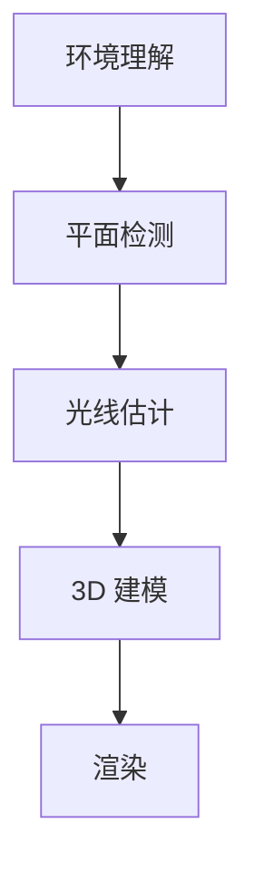

                 

关键词：ARKit、增强现实、iOS、虚拟现实、三维建模、交互设计、实时渲染

> 摘要：本文将深入探讨苹果公司推出的 ARKit 增强现实框架，分析其核心概念与架构，并详细解读其在 iOS 设备上创建逼真 AR 体验的优势。通过数学模型、算法原理和项目实践的讲解，我们希望为开发者提供全面的指导，助力他们在移动设备上打造出色的 AR 应用。

## 1. 背景介绍

### 1.1 增强现实与虚拟现实

增强现实（Augmented Reality，AR）和虚拟现实（Virtual Reality，VR）是当今计算机视觉领域的两个重要分支。AR 是将虚拟信息叠加到现实世界中，而 VR 则是完全沉浸在一个虚拟环境中。尽管两者有相似之处，但 AR 更加贴近现实，更具实用性。

### 1.2 ARKit 概述

ARKit 是苹果公司在 2017 年推出的一款增强现实开发框架，旨在为 iOS 和 macOS 开发者提供强大的 AR 功能。它充分利用了 iPhone 和 iPad 的硬件特性，包括加速度计、陀螺仪、摄像头和实时运动追踪技术，为开发者创造了丰富的 AR 开发场景。

## 2. 核心概念与联系

### 2.1 ARKit 架构

ARKit 的架构包括多个关键组件：

- **环境理解（Environmental Understanding）**：通过深度感应和光学特性，对场景进行理解。
- **平面检测（Plane Detection）**：识别和追踪水平面和垂直面。
- **光线估计（Light Estimation）**：通过光线传感器估计场景的照明条件。
- **3D 建模（3D Modeling）**：使用机器学习和计算机视觉算法生成三维模型。
- **渲染（Rendering）**：使用 Metal 和 SceneKit 进行高效的实时渲染。

### 2.2 Mermaid 流程图



## 3. 核心算法原理 & 具体操作步骤

### 3.1 算法原理概述

ARKit 利用了一系列先进的计算机视觉和机器学习技术，包括：

- **光流（Optical Flow）**：通过摄像头捕捉场景中的运动。
- **特征点检测（Feature Detection）**：识别图像中的关键特征点。
- **姿态估计（Pose Estimation）**：根据特征点计算设备的运动和姿态。
- **深度估计（Depth Estimation）**：通过多视图和立体视觉技术估计场景深度。

### 3.2 算法步骤详解

1. **初始化 ARKit 环境**
2. **设置摄像头预览视图**
3. **开始运行 ARSession**
4. **处理图像帧**
   - **光流计算**
   - **特征点检测**
   - **姿态估计**
   - **深度估计**
5. **更新三维场景**
6. **渲染图像**

### 3.3 算法优缺点

**优点**：

- **硬件优化**：充分利用了 iOS 设备的硬件特性，提供高效的 AR 体验。
- **易于使用**：ARKit 提供了丰富的 API 和示例代码，方便开发者快速上手。
- **稳定性和可靠性**：经过苹果多年的优化，ARKit 在性能和稳定性方面表现出色。

**缺点**：

- **性能限制**：移动设备的性能限制可能在复杂场景下影响 AR 体验。
- **兼容性问题**：某些老旧设备可能无法运行最新的 AR 应用。

### 3.4 算法应用领域

ARKit 的应用领域广泛，包括但不限于：

- **零售和电子商务**：通过 AR 技术展示产品，提升购物体验。
- **教育和培训**：使用 AR 技术模拟实验和场景，提高学习效果。
- **医疗健康**：利用 AR 技术进行手术指导、病人护理等。

## 4. 数学模型和公式 & 详细讲解 & 举例说明

### 4.1 数学模型构建

ARKit 中涉及多个数学模型，包括：

- **相机模型**：描述相机成像过程。
- **运动模型**：描述设备运动和姿态。
- **深度模型**：描述场景深度信息。

### 4.2 公式推导过程

- **相机模型**：

$$
\begin{cases}
x_{\text{image}} = f \cdot \frac{x_{\text{world}}}{z_{\text{world}}} + c_x \\
y_{\text{image}} = f \cdot \frac{y_{\text{world}}}{z_{\text{world}}} + c_y
\end{cases}
$$

- **运动模型**：

$$
\text{quat}^{-1} \cdot \text{quat}_{\text{current}} \cdot \text{quat}_{\text{previous}}
$$

- **深度模型**：

$$
z_{\text{world}} = \frac{f \cdot x_{\text{image}} - c_x}{x_{\text{image}} - \text{camera}_{x}}
$$

### 4.3 案例分析与讲解

假设我们有一个摄像头，焦距 $f=1000$，光心坐标 $(c_x, c_y) = (500, 500)$，摄像头的位置和姿态如下：

$$
\text{quat}_{\text{current}} = (0.707, 0, 0, 0.707), \quad \text{camera}_{x} = 1000
$$

我们需要计算一个点 $(x_{\text{world}}, y_{\text{world}}, z_{\text{world}}) = (1000, 0, 1000)$ 在相机坐标系下的成像坐标 $(x_{\text{image}}, y_{\text{image}})$。

首先，计算相机姿态的逆：

$$
\text{quat}^{-1} = (0.707, 0, 0, -0.707)
$$

然后，应用相机模型公式：

$$
\begin{cases}
x_{\text{image}} = 1000 \cdot \frac{0.707}{0.707} + 500 = 1500 \\
y_{\text{image}} = 1000 \cdot \frac{0}{0.707} + 500 = 500
\end{cases}
$$

所以，成像坐标为 $(x_{\text{image}}, y_{\text{image}}) = (1500, 500)$。

## 5. 项目实践：代码实例和详细解释说明

### 5.1 开发环境搭建

1. 创建一个新的 Xcode 项目，选择 "Single View App" 模板。
2. 在项目设置中，选择 "Use Core Data" 和 "Include Unit Tests"。
3. 在项目的 "General" 标签页中，添加 ARKit 相关框架，如 "ARSCNView" 和 "ARSession"。

### 5.2 源代码详细实现

以下是 ARKit 应用程序的基本框架：

```swift
import UIKit
import SceneKit
import ARKit

class ViewController: UIViewController, ARSCNViewDelegate {
    
    @IBOutlet var sceneView: ARSCNView!
    
    override func viewDidLoad() {
        super.viewDidLoad()
        
        // Set the view's delegate
        sceneView.delegate = self
        
        // Show statistics such as fps and timing information
        sceneView.showsStatistics = true
        
        // Create a new scene
        let scene = SCNScene()
        sceneView.scene = scene
        
        // Create and add a camera to the scene
        let cameraNode = SCNNode()
        cameraNode.camera = SCNCamera()
        scene.rootNode.addChildNode(cameraNode)
        
        // Create and add a light to the scene
        let lightNode = SCNNode()
        lightNode.light = SCNLight()
        lightNode.light!.type = .omni
        lightNode.position = SCNVector3(100, 100, 100)
        scene.rootNode.addChildNode(lightNode)
        
        // Load the 3D model
        if let modelURL = Bundle.main.url(forResource: "model", withExtension: "scn") {
            if let model = SCNScene(url: modelURL, options: nil) {
                for node in model.rootNode.childNodes {
                    scene.rootNode.addChildNode(node)
                }
            }
        }
    }
    
    override func viewWillAppear(_ animated: Bool) {
        super.viewWillAppear(animated)
        
        // Create a session configuration
        let configuration = ARWorldTrackingConfiguration()
        
        // Run the view's session
        sceneView.session.run(configuration)
    }
    
    override func viewWillDisappear(_ animated: Bool) {
        super.viewWillDisappear(animated)
        
        // Pause the view's session
        sceneView.session.pause()
    }
}
```

### 5.3 代码解读与分析

1. **配置 ARSCNView**：设置场景视图的代理，显示统计信息。
2. **创建场景**：创建一个新的 SCNScene，并将其设置为场景视图的当前场景。
3. **添加相机节点**：创建一个 SCNNode，并将其添加到场景根节点。设置该节点的相机属性，使其成为场景的相机。
4. **添加灯光节点**：创建一个 SCNNode，并将其添加到场景根节点。设置该节点的灯光属性，使其在场景中提供照明。
5. **加载 3D 模型**：使用 Bundle.main.url(forResource: "model", withExtension: "scn") 获取 3D 模型的 URL，然后使用 SCNScene(url: modelURL, options: nil) 加载模型。将模型的所有子节点添加到场景根节点。
6. **启动 ARSession**：在 viewWillAppear(_:) 方法中，创建 ARWorldTrackingConfiguration，并运行场景视图的会话。在 viewWillDisappear(_:) 方法中，暂停会话。

### 5.4 运行结果展示

运行应用程序后，您将看到一个包含相机、灯光和 3D 模型的虚拟场景。通过移动设备，您可以实时查看和交互模型，实现增强现实体验。

## 6. 实际应用场景

### 6.1 零售和电子商务

ARKit 可以在零售和电子商务领域发挥巨大作用。例如，用户可以在购物应用中通过 AR 技术查看产品的真实外观和大小，从而提高购买决策的准确性。

### 6.2 教育和培训

ARKit 可以用于教育和培训，通过创建虚拟实验和场景，为学生提供更加生动的学习体验。例如，生物课上可以展示细胞的内部结构，物理课上可以模拟复杂的物理实验。

### 6.3 医疗健康

在医疗健康领域，ARKit 可以用于手术指导、病人护理和康复训练。通过将虚拟信息叠加到现实世界中，医生和患者可以获得更直观的诊疗信息。

## 7. 工具和资源推荐

### 7.1 学习资源推荐

- **ARKit 官方文档**：提供了详细的技术文档和教程，帮助开发者快速上手。
- **Swift 官方文档**：Swift 是 ARKit 的主要编程语言，官方文档提供了全面的 Swift 教程。
- **ARKit 社区论坛**：加入 ARKit 开发者社区，与其他开发者交流经验和问题。

### 7.2 开发工具推荐

- **Xcode**：苹果官方的集成开发环境，提供丰富的工具和框架。
- **ARKit Sample Projects**：GitHub 上有许多开源的 ARKit 示例项目，可以帮助开发者学习和实践。

### 7.3 相关论文推荐

- **"ARKit: Building Augmented Reality for the Masses"**：介绍了 ARKit 的核心技术和应用场景。
- **"Enhancing Reality with Apple's ARKit"**：分析了 ARKit 的性能和稳定性。

## 8. 总结：未来发展趋势与挑战

### 8.1 研究成果总结

ARKit 自推出以来，已经在多个领域取得了显著成果，包括零售、教育和医疗等。通过先进的计算机视觉和机器学习技术，ARKit 为开发者提供了强大的 AR 开发工具。

### 8.2 未来发展趋势

未来，ARKit 将在以下几个方面取得突破：

- **硬件性能提升**：随着移动设备硬件性能的不断提升，AR 应用将变得更加流畅和真实。
- **场景理解能力增强**：通过深度学习和计算机视觉技术的发展，ARKit 将能够更好地理解复杂场景。
- **跨平台支持**：ARKit 将逐渐支持更多的平台，包括 Windows 和 Android。

### 8.3 面临的挑战

ARKit 在未来仍将面临以下挑战：

- **性能优化**：在复杂场景下，AR 应用可能需要更高的计算性能。
- **用户体验**：如何提高 AR 应用的用户体验，使其更加自然和易用。

### 8.4 研究展望

未来，ARKit 有望在以下领域取得突破：

- **AR 智能眼镜**：随着 AR 智能眼镜的普及，ARKit 将成为开发 AR 眼镜应用的关键框架。
- **AR 游戏开发**：ARKit 将为 AR 游戏开发提供更多功能，推动 AR 游戏市场的繁荣。

## 9. 附录：常见问题与解答

### 9.1 如何调试 ARKit 应用？

- 使用 Xcode 的调试工具，如断点、日志输出和性能分析器。
- 查看 ARKit 的错误日志和提示信息，以定位问题。

### 9.2 ARKit 的性能如何？

- ARKit 的性能取决于多种因素，包括设备硬件、场景复杂度和渲染要求。
- 通过优化渲染流程、减少计算负载和提高帧率，可以提高 ARKit 的性能。

### 9.3 ARKit 是否支持多用户共享 AR 场景？

- 目前 ARKit 不直接支持多用户共享 AR 场景，但可以通过网络技术实现多用户交互，如 WebAR。

## 结束语

ARKit 作为苹果公司推出的增强现实开发框架，为开发者提供了强大的 AR 功能。通过本文的深入探讨，我们了解了 ARKit 的核心概念、算法原理和应用场景。希望本文能为开发者提供有价值的参考，助力他们在 iOS 设备上创建逼真的 AR 体验。作者：禅与计算机程序设计艺术 / Zen and the Art of Computer Programming。

