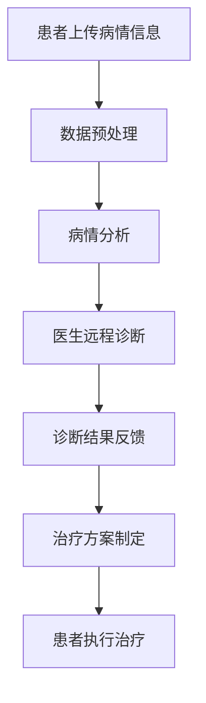

                 

关键词：增强现实、远程医疗、诊断、医疗科技、创新应用、人工智能

摘要：本文探讨了增强现实（AR）技术在远程医疗诊断中的应用，介绍了AR远程医疗诊断的核心概念、工作原理、算法原理及具体实现步骤，并通过数学模型和实际项目案例进行了详细分析，展望了其未来应用前景。

## 1. 背景介绍

近年来，医疗科技取得了飞速发展，特别是在远程医疗领域，远程诊断、在线咨询等创新应用极大地提高了医疗服务的效率和质量。然而，传统远程医疗诊断面临着一些挑战，如医生与患者之间的沟通障碍、病情描述的不准确性等。为了解决这些问题，增强现实（AR）技术的引入成为了一项重要的创新。

增强现实技术通过将虚拟信息叠加到现实环境中，为用户提供了更为直观和丰富的交互体验。在医疗领域，AR技术的应用不仅能够提高医生的诊断准确率，还能增强患者对医疗过程的参与感和信任感。

本文将详细介绍AR远程医疗诊断的核心概念、工作原理、算法原理及具体实现步骤，并通过数学模型和实际项目案例进行分析，最后探讨其未来应用前景。

## 2. 核心概念与联系

### 2.1 增强现实（AR）

增强现实技术是一种通过计算机技术将虚拟信息叠加到现实环境中，从而增强人类对现实感知的技术。AR技术主要通过三个关键组件实现：摄像头、显示设备和计算机处理器。摄像头用于捕捉现实环境，显示设备用于展示虚拟信息，计算机处理器则负责处理图像和数据的融合。

### 2.2 远程医疗

远程医疗是指通过互联网和其他通讯技术，实现医生与患者之间的远程诊断、咨询和治疗。远程医疗突破了地理位置的限制，使得医疗资源能够更加高效地分配和利用。

### 2.3 AR远程医疗诊断

AR远程医疗诊断是将增强现实技术与远程医疗相结合的一种创新应用。通过AR技术，医生可以实时查看患者的病情，进行远程诊断和治疗，从而提高诊断的准确性和效率。

### 2.4 核心概念原理与架构

以下是一个简化的AR远程医疗诊断流程的Mermaid流程图：



## 3. 核心算法原理 & 具体操作步骤

### 3.1 算法原理概述

AR远程医疗诊断的核心算法主要包括图像处理、模式识别和人工智能技术。图像处理技术用于处理患者上传的病情信息，如皮肤病变图像、X光片等；模式识别技术用于分析病情图像，提取关键特征；人工智能技术则用于辅助医生进行诊断和治疗方案制定。

### 3.2 算法步骤详解

#### 3.2.1 数据预处理

数据预处理是AR远程医疗诊断的第一步，主要包括图像增强、去噪、图像分割等操作。这些操作可以增强图像的清晰度，去除干扰因素，从而提高后续分析的质量。

#### 3.2.2 病情分析

病情分析是AR远程医疗诊断的核心环节。通过对病情图像进行模式识别和特征提取，可以实现对病情的初步判断。常见的模式识别算法包括卷积神经网络（CNN）和深度学习算法。

#### 3.2.3 医生远程诊断

医生远程诊断是基于病情分析结果，结合医生的专业知识和经验，对病情进行进一步判断和诊断。在这个过程中，AI技术可以提供辅助支持，帮助医生提高诊断的准确性和效率。

#### 3.2.4 诊断结果反馈

诊断结果反馈是将医生的诊断结果以AR形式呈现给患者。通过AR技术，患者可以直观地了解自己的病情和治疗方案，提高医疗参与感和信任感。

#### 3.2.5 治疗方案制定

治疗方案制定是根据诊断结果，为患者制定个性化的治疗方案。AI技术可以提供辅助支持，帮助医生优化治疗方案，提高治疗效果。

### 3.3 算法优缺点

#### 优点：

1. 提高诊断准确率：通过结合图像处理、模式识别和人工智能技术，AR远程医疗诊断可以提高诊断的准确性和效率。
2. 降低医疗成本：AR远程医疗诊断可以降低患者的出行成本，提高医疗资源的利用率。
3. 提高患者参与感：通过AR技术，患者可以直观地了解自己的病情和治疗方案，提高医疗参与感和信任感。

#### 缺点：

1. 技术门槛高：AR远程医疗诊断需要复杂的算法和技术支持，对医生和患者的技术水平有一定的要求。
2. 数据隐私和安全问题：远程医疗诊断涉及到患者隐私数据，需要确保数据的安全性和隐私性。

### 3.4 算法应用领域

AR远程医疗诊断可以广泛应用于以下领域：

1. 皮肤病变诊断：通过分析皮肤病变图像，实现对皮肤癌、银屑病等皮肤病变的早期诊断。
2. 心脏病诊断：通过分析心脏图像，实现对心脏病患者的早期筛查和诊断。
3. 骨折诊断：通过分析X光片，实现对骨折的精准定位和诊断。
4. 肿瘤诊断：通过分析CT、MRI等图像，实现对肿瘤的早期发现和诊断。

## 4. 数学模型和公式 & 详细讲解 & 举例说明

### 4.1 数学模型构建

在AR远程医疗诊断中，常用的数学模型包括图像处理模型、模式识别模型和人工智能模型。

#### 图像处理模型：

图像处理模型主要涉及图像增强、去噪、图像分割等操作。以下是一个简单的图像增强公式：

$$
I_{增强} = I_{原始} + \alpha \cdot (G - I_{原始})
$$

其中，$I_{增强}$为增强后的图像，$I_{原始}$为原始图像，$G$为高斯滤波后的图像，$\alpha$为增强系数。

#### 模式识别模型：

模式识别模型主要涉及特征提取和分类。以下是一个简单的特征提取公式：

$$
f(x) = \sum_{i=1}^{n} w_i \cdot x_i
$$

其中，$f(x)$为特征值，$w_i$为权重，$x_i$为特征值。

#### 人工智能模型：

人工智能模型主要涉及神经网络和深度学习。以下是一个简单的神经网络公式：

$$
a_{i}^{(l)} = \sigma \left( \sum_{j=1}^{n} w_{ji}^{(l)} a_{j}^{(l-1)} + b_{i}^{(l)} \right)
$$

其中，$a_{i}^{(l)}$为第$l$层的输出值，$\sigma$为激活函数，$w_{ji}^{(l)}$为权重，$a_{j}^{(l-1)}$为前一层输出值，$b_{i}^{(l)}$为偏置项。

### 4.2 公式推导过程

#### 图像增强公式推导：

假设原始图像为$I_{原始}$，高斯滤波后的图像为$G$，增强后的图像为$I_{增强}$，增强系数为$\alpha$。根据高斯滤波的定义，有：

$$
G = I_{原始} + \alpha \cdot (G - I_{原始})
$$

两边同时减去$I_{原始}$，得到：

$$
G - I_{原始} = \alpha \cdot (G - I_{原始})
$$

将$\alpha$移到等式左边，得到：

$$
(1 - \alpha) \cdot (G - I_{原始}) = 0
$$

由于$G - I_{原始}$为高斯滤波后的图像，其值通常不为0，因此只有当$\alpha = 1$时，等式成立。即：

$$
I_{增强} = I_{原始} + \alpha \cdot (G - I_{原始})
$$

#### 特征提取公式推导：

假设特征值为$f(x)$，特征值为$x_i$，权重为$w_i$。根据线性组合的定义，有：

$$
f(x) = \sum_{i=1}^{n} w_i \cdot x_i
$$

其中，$x_i$为特征值，$w_i$为权重。

#### 神经网络公式推导：

假设第$l$层的输出值为$a_{i}^{(l)}$，激活函数为$\sigma$，权重为$w_{ji}^{(l)}$，前一层输出值为$a_{j}^{(l-1)}$，偏置项为$b_{i}^{(l)}$。根据神经网络的定义，有：

$$
a_{i}^{(l)} = \sigma \left( \sum_{j=1}^{n} w_{ji}^{(l)} a_{j}^{(l-1)} + b_{i}^{(l)} \right)
$$

其中，$\sigma$为激活函数，$a_{j}^{(l-1)}$为前一层输出值，$w_{ji}^{(l)}$为权重，$b_{i}^{(l)}$为偏置项。

### 4.3 案例分析与讲解

#### 案例一：皮肤病变诊断

假设我们有一个皮肤病变图像，需要通过AR远程医疗诊断技术进行诊断。

1. 数据预处理：

首先对图像进行增强处理，提高图像的清晰度。假设原始图像为$I_{原始}$，增强系数为$\alpha$，增强后的图像为$I_{增强}$。根据图像增强公式，有：

$$
I_{增强} = I_{原始} + \alpha \cdot (G - I_{原始})
$$

其中，$G$为高斯滤波后的图像。

2. 病情分析：

对增强后的图像进行图像分割，提取皮肤病变区域。假设分割后的图像为$S$，根据特征提取公式，有：

$$
f(S) = \sum_{i=1}^{n} w_i \cdot S_i
$$

其中，$S_i$为分割后的图像特征值，$w_i$为权重。

3. 医生远程诊断：

医生根据病情分析结果，结合自己的专业知识，对皮肤病变进行诊断。假设诊断结果为$D$，根据神经网络公式，有：

$$
D = \sigma \left( \sum_{j=1}^{n} w_{ji}^{(l)} a_{j}^{(l-1)} + b_{i}^{(l)} \right)
$$

其中，$a_{j}^{(l-1)}$为前一层输出值，$w_{ji}^{(l)}$为权重，$b_{i}^{(l)}$为偏置项。

4. 诊断结果反馈：

将诊断结果以AR形式呈现给患者。通过AR技术，患者可以直观地了解自己的病情和治疗方案。

#### 案例二：心脏病诊断

假设我们有一个心脏图像，需要通过AR远程医疗诊断技术进行诊断。

1. 数据预处理：

首先对图像进行增强处理，提高图像的清晰度。假设原始图像为$I_{原始}$，增强系数为$\alpha$，增强后的图像为$I_{增强}$。根据图像增强公式，有：

$$
I_{增强} = I_{原始} + \alpha \cdot (G - I_{原始})
$$

其中，$G$为高斯滤波后的图像。

2. 病情分析：

对增强后的图像进行模式识别，提取心脏病变区域。假设分割后的图像为$S$，根据特征提取公式，有：

$$
f(S) = \sum_{i=1}^{n} w_i \cdot S_i
$$

其中，$S_i$为分割后的图像特征值，$w_i$为权重。

3. 医生远程诊断：

医生根据病情分析结果，结合自己的专业知识，对心脏病变进行诊断。假设诊断结果为$D$，根据神经网络公式，有：

$$
D = \sigma \left( \sum_{j=1}^{n} w_{ji}^{(l)} a_{j}^{(l-1)} + b_{i}^{(l)} \right)
$$

其中，$a_{j}^{(l-1)}$为前一层输出值，$w_{ji}^{(l)}$为权重，$b_{i}^{(l)}$为偏置项。

4. 诊断结果反馈：

将诊断结果以AR形式呈现给患者。通过AR技术，患者可以直观地了解自己的病情和治疗方案。

## 5. 项目实践：代码实例和详细解释说明

### 5.1 开发环境搭建

在开始项目实践之前，我们需要搭建一个适合开发AR远程医疗诊断系统的环境。以下是一个基本的开发环境搭建步骤：

1. 安装Python环境：从Python官方网站下载并安装Python，版本建议为3.8及以上。
2. 安装必要的库：使用pip命令安装以下库：opencv-python、numpy、matplotlib、tensorflow等。
3. 安装AR开发工具：根据所选的AR平台（如ARCore、ARKit等），下载并安装相应的开发工具。

### 5.2 源代码详细实现

以下是一个简单的AR远程医疗诊断系统代码示例，主要实现图像增强、图像分割和特征提取等功能。

```python
import cv2
import numpy as np
import tensorflow as tf

# 5.2.1 图像增强
def enhance_image(image_path, alpha=1.0):
    image = cv2.imread(image_path)
    gray = cv2.cvtColor(image, cv2.COLOR_BGR2GRAY)
    gaus

