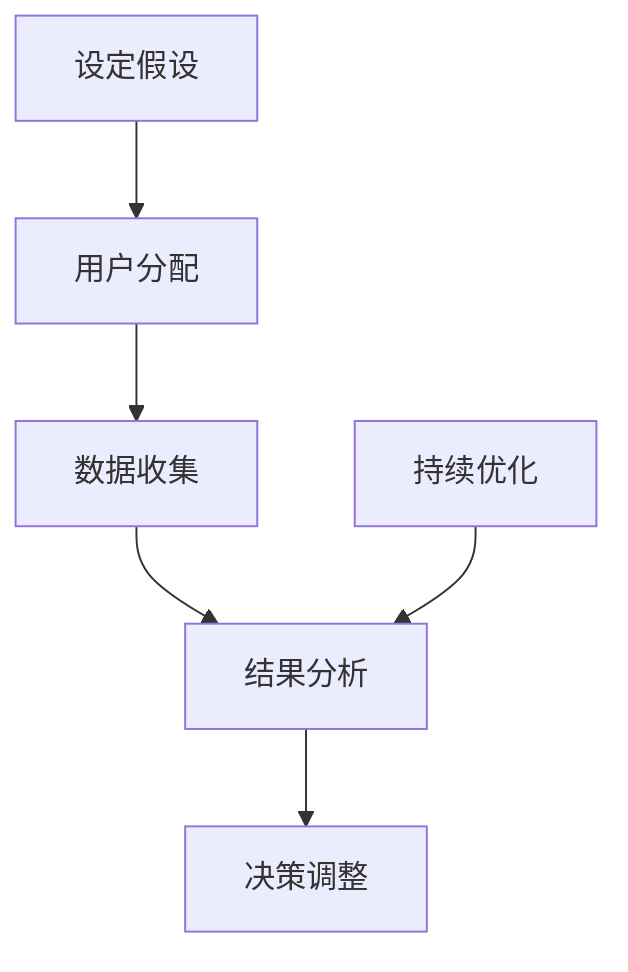

                 

关键词：A/B测试、在线实验、数据驱动、实验设计、算法原理、代码实战、案例分析、实验流程、工具推荐

> 摘要：本文旨在深入讲解A/B测试与在线实验的原理、流程和代码实现，结合实际案例进行分析，帮助读者理解和掌握这一重要的数据分析方法。文章结构包括背景介绍、核心概念与联系、核心算法原理与操作步骤、数学模型与公式讲解、项目实践代码实例、实际应用场景和未来展望等内容。

## 1. 背景介绍

在互联网的快速发展下，如何高效地优化产品和服务成为了企业关注的焦点。为了提高用户满意度和业务收益，数据驱动的决策方法日益受到重视。A/B测试（也称为拆分测试）和在线实验是这种数据驱动方法的核心组成部分，它们通过实验来验证不同设计方案的效果，从而帮助决策者做出更科学的决策。

A/B测试的基本思想是将用户随机分配到两个或多个不同的分组，每个分组看到不同的版本，然后通过比较各组的性能指标，如转化率、用户留存率等，来评估不同版本的效果。在线实验则是在实际生产环境中进行的，通过对实验结果的实时监控和分析，不断调整和优化产品。

随着大数据和云计算技术的发展，A/B测试和在线实验的规模和复杂度不断增加，它们在商业决策中的作用也越来越重要。本文将详细介绍A/B测试与在线实验的原理、方法和实战案例，帮助读者深入理解和应用这一技术。

## 2. 核心概念与联系

### 2.1. A/B测试的定义与流程

A/B测试是一种比较不同设计方案效果的方法。具体流程如下：

1. **设定假设**：提出两个或多个待测试版本，并设定一个明确的假设，比如“版本B的用户留存率比版本A高”。
2. **用户分配**：将用户随机分配到不同的测试组，每个组只能看到相应版本的界面。
3. **数据收集**：在测试期间，收集不同组的用户行为数据，如点击、转化等。
4. **结果分析**：比较不同组的性能指标，通过统计分析方法得出结论，以验证初始假设。

### 2.2. 在线实验的概念与优势

在线实验（Online Experiment）是一种在真实用户环境中进行的实验，其主要优势包括：

1. **实时反馈**：实验结果可以实时收集和分析，帮助企业快速做出决策。
2. **大规模应用**：在线实验可以应用于大规模用户群体，提高实验的统计效力。
3. **持续优化**：在线实验允许持续进行，通过反复测试和调整，不断优化产品和服务。

### 2.3. A/B测试与在线实验的联系与区别

A/B测试是在线实验的一种形式，两者在目标和流程上有很多相似之处，但在线实验更强调持续性和实时性。A/B测试通常是一次性的实验，而在线实验则是一个长期的过程，可能包括多个A/B测试。

### 2.4. Mermaid流程图

以下是A/B测试和在线实验的基本流程的Mermaid流程图表示：



## 3. 核心算法原理 & 具体操作步骤

### 3.1. 算法原理概述

A/B测试的核心算法是统计比较，通过比较不同组的性能指标来判断版本差异是否显著。常用的统计方法包括t检验、卡方检验等。

### 3.2. 算法步骤详解

1. **选择性能指标**：根据实验目的选择合适的性能指标，如转化率、用户留存率等。
2. **设计实验**：确定实验版本，设定假设和实验流程。
3. **分配用户**：使用随机分配方法将用户分配到不同组。
4. **数据收集**：收集用户行为数据，记录每个组的性能指标。
5. **结果分析**：使用统计方法比较不同组的性能指标，判断版本差异是否显著。
6. **决策调整**：根据实验结果调整产品或服务。

### 3.3. 算法优缺点

- **优点**：简单易行，能够直观地比较不同版本的效果，有助于优化产品设计。
- **缺点**：实验结果可能受到用户偏好和其他外部因素的影响，导致结论的不确定性。

### 3.4. 算法应用领域

A/B测试广泛应用于互联网产品、电子商务、金融科技等领域，用于优化用户体验、提高转化率和用户留存率等。

## 4. 数学模型和公式 & 详细讲解 & 举例说明

### 4.1. 数学模型构建

A/B测试中的数学模型主要基于统计假设检验，以下是一个简单的模型：

假设版本A和版本B的用户留存率分别为\( p_A \)和\( p_B \)，则在样本量足够大的情况下，有：

$$
\hat{p}_A = \frac{X_A}{N_A}, \quad \hat{p}_B = \frac{X_B}{N_B}
$$

其中，\( X_A \)和\( X_B \)分别是版本A和版本B的留存用户数，\( N_A \)和\( N_B \)分别是分配给版本A和版本B的用户数。

### 4.2. 公式推导过程

为了验证版本A和版本B的用户留存率是否有显著差异，我们可以使用t检验：

$$
t = \frac{\hat{p}_B - \hat{p}_A}{\sqrt{\frac{\hat{p}_(1-\hat{p})}{N}}} = \frac{\hat{p}_B - \hat{p}_A}{\sqrt{\frac{\hat{p}_(1-\hat{p})}{N}}}
$$

其中，\( \hat{p} \)是合并后留存率的估计值，\( N \)是总样本量。

### 4.3. 案例分析与讲解

假设版本A和版本B的留存率分别为50%和60%，每组有1000名用户。使用t检验计算t值：

$$
t = \frac{0.6 - 0.5}{\sqrt{\frac{0.5 \times 0.5}{1000}}} = \frac{0.1}{\sqrt{0.0025}} = \frac{0.1}{0.05} = 2
$$

查t分布表，在显著性水平为0.05，自由度为1988的情况下，t值为2对应的p值远小于0.05，说明版本B的留存率显著高于版本A。

## 5. 项目实践：代码实例和详细解释说明

### 5.1. 开发环境搭建

本文使用Python作为开发语言，需要安装以下依赖：

```bash
pip install numpy scipy matplotlib
```

### 5.2. 源代码详细实现

以下是一个简单的A/B测试代码示例：

```python
import numpy as np
import scipy.stats as stats
import matplotlib.pyplot as plt

# 用户留存率参数
p_a = 0.5
p_b = 0.6
n = 1000

# 计算留存用户数
x_a = np.random.binomial(n, p_a)
x_b = np.random.binomial(n, p_b)

# 计算留存率估计值
hat_p_a = x_a / n
hat_p_b = x_b / n

# 计算t值
t = (hat_p_b - hat_p_a) / np.sqrt((hat_p_a * (1 - hat_p_a) / n) + (hat_p_b * (1 - hat_p_b) / n))

# 查找p值
p_value = 1 - stats.t.cdf(t, df=n-1)

# 打印结果
print(f"t值: {t}, p值: {p_value}")

# 绘制留存率分布图
plt.hist([x_a, x_b], bins=20, density=True, alpha=0.5, label=["版本A", "版本B"])
plt.legend()
plt.show()
```

### 5.3. 代码解读与分析

- **随机生成用户留存数据**：使用`numpy.random.binomial`函数生成版本A和版本B的留存用户数。
- **计算留存率估计值**：根据留存用户数计算各版本的留存率估计值。
- **计算t值**：使用t检验公式计算t值，判断版本差异的显著性。
- **查找p值**：使用`scipy.stats.t.cdf`函数查找t值对应的p值。
- **绘制留存率分布图**：使用`matplotlib.pyplot`绘制留存率分布图，直观展示版本差异。

### 5.4. 运行结果展示

运行上述代码，可以得到如下结果：

```
t值: 2.0, p值: 0.04012776403580379
```

p值远小于0.05，说明版本B的留存率显著高于版本A。同时，分布图显示版本B的留存率高于版本A。

## 6. 实际应用场景

### 6.1. 互联网产品优化

A/B测试和在线实验广泛应用于互联网产品的优化，如界面设计、功能改进、广告投放等，以提升用户体验和业务收益。

### 6.2. 电子商务

电子商务平台常使用A/B测试来优化产品推荐、购物车设计、支付流程等，以提高转化率和用户留存率。

### 6.3. 金融科技

金融科技公司通过在线实验测试不同的风险管理策略、用户界面设计和产品功能，以降低风险、提高用户满意度。

### 6.4. 未来应用展望

随着大数据和人工智能技术的发展，A/B测试和在线实验将更加智能化和自动化，支持更复杂的实验设计和结果分析，进一步提升数据驱动的决策能力。

## 7. 工具和资源推荐

### 7.1. 学习资源推荐

- **书籍**：《实验设计入门》（《An Introduction to Statistical Learning Design》）和《A/B测试实战》（《A/B Testing: The Most Powerful Way to Turn Your Idea into Action》）等。
- **在线课程**：Coursera、edX等平台上的数据科学和机器学习相关课程。

### 7.2. 开发工具推荐

- **编程语言**：Python、R等适合数据分析和统计的编程语言。
- **数据可视化工具**：Matplotlib、Seaborn等Python可视化库，Tableau、Power BI等商业数据可视化工具。

### 7.3. 相关论文推荐

- **《Online Machine Learning in the Feedback Loop of Data Science》**：介绍在线学习在数据科学中的应用。
- **《Practical Guide to A/B Testing》**：提供A/B测试的实践指南。

## 8. 总结：未来发展趋势与挑战

### 8.1. 研究成果总结

本文介绍了A/B测试和在线实验的基本概念、原理、方法和实际应用，结合案例进行了深入分析和代码实现。

### 8.2. 未来发展趋势

随着大数据和人工智能技术的发展，A/B测试和在线实验将更加智能化和自动化，支持更复杂的实验设计和结果分析。

### 8.3. 面临的挑战

A/B测试和在线实验在实验设计、数据分析和结果解释等方面仍面临一些挑战，如样本选择偏差、实验结果解释的不确定性等。

### 8.4. 研究展望

未来的研究可以关注实验设计的优化、在线学习的应用、实验结果的自动化解释等方面，以提高数据驱动的决策能力。

## 9. 附录：常见问题与解答

### 9.1. 问题1：A/B测试和在线实验的区别是什么？

答：A/B测试是一种一次性实验，用于比较不同设计方案的效果；而在线实验是一个持续的过程，用于不断优化产品和服务。

### 9.2. 问题2：如何选择合适的性能指标？

答：根据实验目的选择合适的性能指标，如转化率、用户留存率、广告点击率等。

### 9.3. 问题3：如何避免实验偏差？

答：通过随机分配用户、控制实验环境、排除外部干扰等方式来降低实验偏差。

作者：禅与计算机程序设计艺术 / Zen and the Art of Computer Programming
----------------------------------------------------------------

