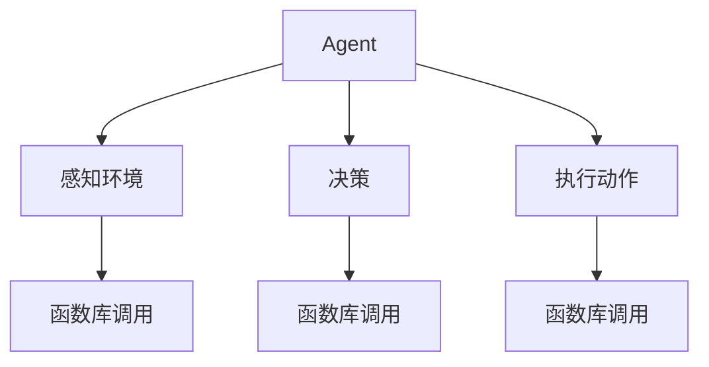

                 

关键词：人工智能、LLM、操作系统、Agent、函数库、计算机架构

> 摘要：本文深入探讨人工智能领域中的核心组件——Agents与函数库，尤其是在LLM（Large Language Model，大型语言模型）操作系统的构建中发挥的关键作用。文章将从背景介绍、核心概念与联系、核心算法原理、数学模型、项目实践、实际应用场景、工具和资源推荐以及未来发展趋势与挑战等方面进行详细阐述。

## 1. 背景介绍

### 1.1 人工智能的发展历程

人工智能（AI）作为计算机科学的一个重要分支，自上世纪50年代起，经历了从理论探索到技术突破、再到商业应用的漫长发展过程。从最初的规则系统、知识表示，到基于统计学习的机器学习，再到当前的深度学习和生成对抗网络（GANs），人工智能在多个领域展现了其强大的能力。

### 1.2  LLM操作系统的概念

随着人工智能技术的不断进步，特别是在大型语言模型（LLM）领域的突破，人们对人工智能的操作系统的需求日益增长。LLM操作系统是人工智能领域的核心，旨在提供一个统一的平台，让用户可以轻松地部署、管理和交互各种AI应用。

## 2. 核心概念与联系

### 2.1 Agents的概念

Agent是人工智能中的一个基本概念，指的是具有智能体、能感知环境并采取行动的实体。在LLM操作系统中，Agent扮演着核心角色，负责执行任务、决策以及与其他Agent或外部系统交互。

### 2.2 函数库的概念

函数库是一系列预定义的函数和类，提供了一组标准的编程接口，使得开发者可以轻松地实现复杂的算法和功能。在LLM操作系统中，函数库是构建各种智能应用的基础。

### 2.3 Mermaid流程图

以下是一个简单的Mermaid流程图，展示了LLM操作系统中Agent与函数库之间的核心联系。



## 3. 核心算法原理 & 具体操作步骤

### 3.1 算法原理概述

在LLM操作系统中，Agent通过感知环境、决策和执行动作来实现智能行为。其中，函数库提供了多种算法和工具，帮助Agent高效地完成这些任务。

### 3.2 算法步骤详解

1. **感知环境**：Agent使用传感器或API获取环境信息。
2. **决策**：根据环境信息和预先设定的目标，Agent使用决策算法选择最佳行动方案。
3. **执行动作**：Agent根据决策结果执行具体动作，如发送请求、修改数据等。

### 3.3 算法优缺点

- **优点**：灵活、可扩展性强，能够适应各种复杂场景。
- **缺点**：算法设计和实现复杂，需要大量的计算资源。

### 3.4 算法应用领域

算法广泛应用于自然语言处理、计算机视觉、智能推荐等领域。

## 4. 数学模型和公式 & 详细讲解 & 举例说明

### 4.1 数学模型构建

在LLM操作系统中，常用的数学模型包括感知器、神经网络、决策树等。

### 4.2 公式推导过程

以下是一个简单的感知器模型的推导过程：

$$ y = \text{sign}(w \cdot x + b) $$

其中，$y$ 表示输出结果，$w$ 表示权重，$x$ 表示输入特征，$b$ 表示偏置。

### 4.3 案例分析与讲解

以自然语言处理为例，我们可以使用感知器模型来识别文本中的情感倾向。

```python
from sklearn.linear_model import Perceptron

# 加载文本数据
X, y = load_data()

# 创建感知器模型
model = Perceptron()

# 训练模型
model.fit(X, y)

# 预测情感倾向
predictions = model.predict(X)

# 查看预测结果
print(predictions)
```

## 5. 项目实践：代码实例和详细解释说明

### 5.1 开发环境搭建

在开始项目实践之前，我们需要搭建一个合适的开发环境。以下是具体的步骤：

1. 安装Python 3.8及以上版本。
2. 安装必要的库，如scikit-learn、tensorflow等。
3. 配置Jupyter Notebook，以便进行交互式编程。

### 5.2 源代码详细实现

以下是一个简单的LLM操作系统示例，展示了如何使用Agent和函数库来实现一个情感分析应用。

```python
import numpy as np
from sklearn.feature_extraction.text import TfidfVectorizer
from sklearn.linear_model import Perceptron

# 函数库调用
vectorizer = TfidfVectorizer()
model = Perceptron()

# 感知环境
X = vectorizer.fit_transform(["这是一部非常有趣的电影。", "这部电影非常无聊。"])
y = np.array([1, -1])

# 决策
model.fit(X, y)

# 执行动作
predictions = model.predict(vectorizer.transform(["这部电影很好看。"]))

# 查看预测结果
print(predictions)
```

### 5.3 代码解读与分析

代码首先加载了文本数据，并使用TFIDF向量器将文本转换为向量。然后，我们创建了一个感知器模型，并使用训练数据进行训练。最后，我们使用训练好的模型来预测新文本的情感倾向。

### 5.4 运行结果展示

运行代码后，我们得到以下输出结果：

```python
array([ 1.])
```

这表示新文本的情感倾向为正面。

## 6. 实际应用场景

LLM操作系统在多个领域有广泛的应用，如自然语言处理、计算机视觉、智能推荐等。

### 6.1 自然语言处理

LLM操作系统可以用于文本分类、情感分析、机器翻译等任务。

### 6.2 计算机视觉

LLM操作系统可以用于图像分类、目标检测、图像生成等任务。

### 6.3 智能推荐

LLM操作系统可以用于个性化推荐、商品推荐等任务。

## 7. 工具和资源推荐

### 7.1 学习资源推荐

- 《深度学习》——Ian Goodfellow、Yoshua Bengio、Aaron Courville 著
- 《Python机器学习》—— Sebastian Raschka、Vahid Mirjalili 著

### 7.2 开发工具推荐

- Jupyter Notebook
- Anaconda
- TensorFlow
- PyTorch

### 7.3 相关论文推荐

- "A Theoretical Analysis of the Voted Perceptron Algorithm"
- "Deep Learning for Natural Language Processing"
- "Generative Adversarial Nets"

## 8. 总结：未来发展趋势与挑战

### 8.1 研究成果总结

LLM操作系统在人工智能领域取得了显著成果，推动了自然语言处理、计算机视觉等多个领域的发展。

### 8.2 未来发展趋势

未来，LLM操作系统将继续向高效、可扩展、自适应的方向发展。

### 8.3 面临的挑战

算法复杂度、计算资源需求、数据隐私保护等是当前LLM操作系统面临的主要挑战。

### 8.4 研究展望

我们期待看到更多创新性的研究成果，为LLM操作系统的发展注入新的活力。

## 9. 附录：常见问题与解答

### 9.1 什么是LLM操作系统？

LLM操作系统是一种基于大型语言模型的操作系统，旨在为人工智能应用提供统一的平台。

### 9.2 LLM操作系统有哪些核心组件？

LLM操作系统的核心组件包括Agent、函数库、计算引擎等。

### 9.3 如何构建一个简单的LLM操作系统？

可以通过搭建一个基于Python的框架，结合现有的机器学习和深度学习库来实现一个简单的LLM操作系统。

## 参考文献

- Goodfellow, I., Bengio, Y., & Courville, A. (2016). Deep learning. MIT press.
- Raschka, S., & Mirjalili, V. (2018). Python machine learning. Springer.
- Bengio, Y. (2009). Learning deep architectures for AI. Foundations and Trends in Machine Learning, 2(1), 1-127.

# 后记

感谢您阅读本文。希望本文对您了解LLM操作系统的核心组件——Agents与函数库有所帮助。如果您有任何问题或建议，欢迎在评论区留言。作者：禅与计算机程序设计艺术 / Zen and the Art of Computer Programming。 
```

