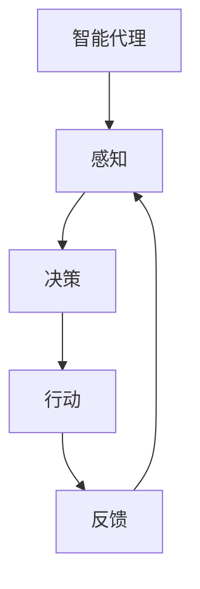

                 

关键词：人工智能，游戏开发，游戏AI，智能代理，强化学习，游戏引擎，交互设计。

## 摘要

本文探讨了人工智能（AI）与游戏结合的深层次应用，特别是智能代理在游戏中的角色。通过回顾游戏AI的历史和发展，我们分析现有智能代理的原理、类型及其实现过程。接下来，我们将深入探讨强化学习在游戏AI中的应用，并展示如何通过数学模型和实际项目实践来实现智能代理。文章还讨论了智能代理在游戏设计中的潜在影响和未来发展趋势，以及相关的工具和资源推荐。

## 1. 背景介绍

### 游戏AI的发展历程

自从计算机游戏诞生以来，游戏AI（Artificial Intelligence）就一直是一个热门研究领域。早期的游戏AI主要基于规则的系统，例如《冒险岛》和《文明》等游戏中的敌人AI，这些AI依赖于预先编写好的规则和逻辑来决定其行为。

随着技术的发展，游戏AI逐渐引入了更复杂的算法，如搜索算法（如A*算法）和启发式算法（如遗传算法）。这些算法使得游戏AI能够在更复杂的游戏环境中表现出更高的智能。例如，在《星际争霸》和《魔兽争霸》等实时战略游戏中，AI对手的智能水平有了显著提升。

近年来，深度学习和强化学习等AI技术的发展，为游戏AI带来了新的契机。智能代理（Intelligent Agent）的概念逐渐成为研究热点，特别是在复杂游戏环境中的应用。智能代理是一种能够自主行动、与环境互动并学习优化自身行为的系统，其核心在于能够通过学习和适应来实现更高级的决策能力。

### 智能代理的基本概念

智能代理是一个在特定环境中采取行动，并从经验中学习的系统。其基本概念源于AI领域中的代理理论，即一个代理可以被视为一个实体，它在环境中接收感知信息，根据这些信息采取行动，并从环境中获得反馈。

智能代理的核心特征包括：

- **自主性**：代理可以独立决策，无需外部指令。
- **适应性**：代理可以根据环境变化调整行为策略。
- **学习性**：代理能够从经验中学习，不断优化其行为。

智能代理在游戏中的应用，使得游戏中的NPC（非玩家角色）不再是简单地遵循固定规则的程序，而是能够动态适应游戏环境和玩家行为的智能实体。

### 游戏开发与AI的结合

游戏开发与AI的结合主要体现在以下几个方面：

- **游戏AI对手**：AI能够为玩家提供更具挑战性的对手，提高游戏的可玩性。
- **智能NPC**：智能代理可以创建更加逼真的角色，增强游戏的沉浸感。
- **游戏生成**：AI可以用于生成游戏内容，如地图、任务等，提高游戏的多样性和新鲜感。
- **用户体验优化**：AI可以分析玩家行为，提供个性化建议和游戏体验优化。

## 2. 核心概念与联系

### 智能代理原理图



### 核心概念解释

#### 感知（Perception）

智能代理通过感知系统获取环境信息。在游戏中，这通常包括视觉、听觉等感官数据的处理，例如地图上的位置、敌人的位置、障碍物等。

#### 决策（Decision）

感知信息经过智能代理的决策系统处理，决定下一步应该采取的行动。决策过程可以基于预先定义的规则、学习到的策略，或者通过复杂算法进行优化。

#### 行动（Action）

决策系统生成的行动被传递到执行系统，智能代理根据这些行动在游戏环境中执行相应的操作。

#### 反馈（Feedback）

执行后的结果作为反馈传递回感知系统，代理可以根据这些反馈调整其感知、决策和行动策略。

#### 学习（Learning）

通过不断循环感知-决策-行动-反馈的过程，智能代理能够从经验中学习，不断优化其行为，使其在复杂的游戏环境中表现得更加智能。

### 架构描述

智能代理的架构通常包括以下几个关键组成部分：

- **感知模块**：负责收集环境数据，如传感器数据、图像、声音等。
- **决策模块**：使用感知数据生成行动策略，可以基于规则、机器学习或深度学习算法。
- **行动模块**：执行决策系统生成的行动，例如移动、攻击或躲避。
- **学习模块**：通过分析反馈数据，更新决策模型，提高代理的智能水平。

通过这种架构，智能代理能够在不断变化的游戏环境中表现出高度的智能和适应性。

## 3. 核心算法原理 & 具体操作步骤

### 3.1 算法原理概述

智能代理的算法原理主要基于强化学习（Reinforcement Learning，RL）。强化学习是一种让智能体通过与环境的交互来学习最优策略的机器学习方法。在强化学习框架中，智能代理作为学习者，通过试错来逐渐优化其行为，以达到最大化长期奖励的目的。

#### 强化学习的基本概念

- **状态（State）**：智能代理当前所处的环境状态。
- **动作（Action）**：智能代理可以采取的行为。
- **奖励（Reward）**：智能代理采取某个动作后获得的即时奖励，用于指导智能代理的学习。
- **策略（Policy）**：智能代理根据当前状态选择动作的决策规则。
- **价值函数（Value Function）**：评估智能代理在某个状态下的预期奖励。

#### 基本算法流程

1. **初始化**：初始化智能代理的参数，如学习率、探索率等。
2. **感知状态**：智能代理从环境中感知当前状态。
3. **选择动作**：根据当前状态和策略，选择一个动作。
4. **执行动作**：智能代理在环境中执行选择的动作。
5. **获得反馈**：根据动作的结果获得即时奖励。
6. **更新策略**：使用即时奖励和策略更新算法（如Q-learning、SARSA等），调整策略参数。
7. **重复过程**：重复上述步骤，直到达到预定的学习目标或环境变化。

### 3.2 算法步骤详解

#### 1. 初始化参数

初始化智能代理的参数，包括学习率（α）、探索率（ε）等。学习率决定了策略更新的强度，探索率则决定了智能代理在探索未知状态和执行已有策略之间的权衡。

#### 2. 感知状态

智能代理通过感知模块收集当前环境的状态信息。在游戏中，这通常包括当前的位置、地图信息、敌人位置等。

#### 3. 选择动作

智能代理使用策略选择动作。在初始阶段，智能代理可能采用随机策略（即完全探索环境），随着学习的进行，智能代理会逐渐依赖经验来选择动作。

#### 4. 执行动作

智能代理在游戏中执行选择的动作。例如，移动到某个位置、攻击敌人或躲避障碍物。

#### 5. 获得反馈

执行动作后，智能代理获得即时奖励。在游戏中，这可以是击败敌人、获得资源等。

#### 6. 更新策略

智能代理使用强化学习算法（如Q-learning）更新策略。Q-learning的核心思想是通过比较不同动作的预期奖励来更新策略值。

#### 7. 重复过程

智能代理不断重复上述过程，通过不断学习和适应来优化其行为。

### 3.3 算法优缺点

#### 优点

- **适应性**：智能代理能够根据环境变化调整行为策略，具有高度的适应性。
- **灵活性**：强化学习算法适用于多种类型的游戏环境，能够处理动态变化的场景。
- **探索性**：智能代理具有探索未知状态的能力，能够发现新的策略。

#### 缺点

- **收敛速度**：强化学习算法通常需要大量的数据和时间来收敛，可能存在收敛缓慢的问题。
- **奖励设计**：奖励机制的设定对算法的性能有重要影响，需要精心设计。
- **计算复杂度**：在复杂的游戏环境中，智能代理的计算复杂度可能较高。

### 3.4 算法应用领域

强化学习在游戏AI中的应用非常广泛，包括：

- **动作游戏**：智能代理可以作为游戏中的AI对手，提供更具挑战性的体验。
- **角色扮演游戏**：智能代理可以模拟NPC的行为，提供更加丰富的游戏体验。
- **策略游戏**：智能代理可以用于策略决策，如资源管理、战术规划等。

## 4. 数学模型和公式 & 详细讲解 & 举例说明

### 4.1 数学模型构建

在强化学习中，一个基本的数学模型包括以下要素：

- **状态空间（S）**：游戏环境中的所有可能状态集合。
- **动作空间（A）**：智能代理可以采取的所有可能动作集合。
- **策略（π）**：智能代理选择动作的决策规则，π：S → A。
- **价值函数（V）**：评估智能代理在某个状态下的预期奖励，V(s) = E[R|s]。
- **策略迭代**：通过不断迭代策略来优化智能代理的行为。

### 4.2 公式推导过程

#### Q-learning算法

Q-learning是一种基于值迭代的强化学习算法。其核心公式为：

$$
Q(s, a) \leftarrow Q(s, a) + \alpha [R + \gamma \max_{a'} Q(s', a') - Q(s, a)]
$$

其中：

- \(Q(s, a)\) 表示在状态s下采取动作a的预期回报。
- \(R\) 表示即时奖励。
- \(\gamma\) 是折扣因子，用于平衡当前奖励和未来奖励。
- \(\alpha\) 是学习率。

#### SARSA算法

SARSA（同步优势和样本行动）是一种基于策略迭代的强化学习算法。其公式为：

$$
\tau(s, a) \leftarrow \frac{\tau(s, a)}{\sum_{a'} \tau(s, a')} + \alpha [R + \gamma \tau(s', a')]
$$

其中：

- \(\tau(s, a)\) 是策略概率分布。
- 其他参数与Q-learning相同。

### 4.3 案例分析与讲解

#### 案例一：迷宫逃脱

假设一个迷宫游戏，智能代理需要从起点移动到终点。智能代理使用Q-learning算法来学习最优路径。

1. **初始化**：设定智能代理的参数，如学习率α=0.1，折扣因子γ=0.9。
2. **感知状态**：智能代理感知当前的位置（状态）。
3. **选择动作**：根据当前的状态和策略，智能代理选择一个动作（向上、向下、向左、向右）。
4. **执行动作**：智能代理在迷宫中执行选择的动作。
5. **获得反馈**：如果智能代理成功到达终点，获得奖励R=+100；否则获得R=-1。
6. **更新策略**：使用Q-learning算法更新策略值。

经过多次迭代，智能代理逐渐学习到最优路径，并能够在迷宫中迅速找到终点。

#### 案例二：星际争霸2

在《星际争霸2》中，智能代理通过强化学习来学习对抗其他玩家。智能代理在游戏中执行各种战术和策略，从与玩家的对抗中学习。

1. **初始化**：设定智能代理的参数，如探索率ε=0.1。
2. **感知状态**：智能代理感知当前的游戏状态，包括单位位置、资源等信息。
3. **选择动作**：智能代理选择一个动作，如建造建筑物、训练单位或执行战术。
4. **执行动作**：智能代理在游戏中执行选择的动作。
5. **获得反馈**：根据游戏的胜负情况，智能代理获得即时奖励。
6. **更新策略**：智能代理使用SARSA算法更新策略。

通过不断的训练和对抗，智能代理逐渐提高其游戏水平，能够与人类玩家进行有效竞争。

## 5. 项目实践：代码实例和详细解释说明

### 5.1 开发环境搭建

为了实现智能代理在游戏中的应用，我们需要搭建一个开发环境。以下是一个简单的搭建过程：

1. **安装Python**：确保系统中安装了Python 3.x版本。
2. **安装TensorFlow**：使用pip命令安装TensorFlow库，命令如下：

   ```shell
   pip install tensorflow
   ```

3. **安装PyTorch**：使用pip命令安装PyTorch库，命令如下：

   ```shell
   pip install torch torchvision
   ```

4. **安装OpenAI Gym**：使用pip命令安装OpenAI Gym库，命令如下：

   ```shell
   pip install gym
   ```

5. **安装Pygame**：使用pip命令安装Pygame库，命令如下：

   ```shell
   pip install pygame
   ```

### 5.2 源代码详细实现

以下是一个简单的智能代理实现，使用Python和Pygame库来模拟迷宫逃脱游戏。

```python
import pygame
import random
import torch
import torch.nn as nn
import torch.optim as optim

# 初始化游戏环境
pygame.init()
screen = pygame.display.set_mode((500, 500))
clock = pygame.time.Clock()

# 定义智能代理网络
class Agent(nn.Module):
    def __init__(self):
        super(Agent, self).__init__()
        self.fc1 = nn.Linear(4, 64)
        self.fc2 = nn.Linear(64, 64)
        self.fc3 = nn.Linear(64, 4)

    def forward(self, x):
        x = torch.relu(self.fc1(x))
        x = torch.relu(self.fc2(x))
        x = self.fc3(x)
        return x

# 定义Q-learning算法
class QLearning:
    def __init__(self, agent, learning_rate=0.1, gamma=0.9):
        self.agent = agent
        self.learning_rate = learning_rate
        self.gamma = gamma
        self.optimizer = optim.Adam(self.agent.parameters(), lr=self.learning_rate)

    def update(self, state, action, reward, next_state, done):
        if not done:
            target = (reward + self.gamma * self.agent(next_state).max())
        else:
            target = reward

        q_value = self.agent(state).gather(1, action)
        loss = (target - q_value).pow(2).mean()
        self.optimizer.zero_grad()
        loss.backward()
        self.optimizer.step()

# 定义游戏环境
class Maze:
    def __init__(self):
        self.grid_size = 10
        self.width = self.height = 500
        self.spawn_x, self.spawn_y = random.randint(0, self.grid_size-1), random.randint(0, self.grid_size-1)
        self.finish_x, self.finish_y = random.randint(0, self.grid_size-1), random.randint(0, self.grid_size-1)

    def step(self, action):
        x, y = self.spawn_x, self.spawn_y
        if action == 0: x = min(x + 1, self.grid_size - 1)
        if action == 1: x = max(x - 1, 0)
        if action == 2: y = min(y + 1, self.grid_size - 1)
        if action == 3: y = max(y - 1, 0)

        if (x, y) == (self.finish_x, self.finish_y):
            return 100, True
        else:
            return -1, False

    def reset(self):
        self.spawn_x, self.spawn_y = random.randint(0, self.grid_size-1), random.randint(0, self.grid_size-1)
        self.finish_x, self.finish_y = random.randint(0, self.grid_size-1), random-indent{}random.randint(0, self.grid_size-1)
        return torch.tensor([self.spawn_x, self.spawn_y, self.finish_x, self.finish_y], dtype=torch.float32)

# 运行游戏
agent = Agent()
q_learning = QLearning(agent)
env = Maze()

while True:
    state = env.reset()
    done = False

    while not done:
        action = q_learning.agent(torch.tensor(state, dtype=torch.float32)).max().item()
        next_state, reward, done = env.step(action)

        q_learning.update(state, action, reward, next_state, done)

        state = next_state
```

### 5.3 代码解读与分析

上述代码实现了一个简单的迷宫逃脱游戏，其中智能代理使用Q-learning算法学习最优路径。

- **Agent**：定义了一个简单的神经网络，用于预测每个动作的预期回报。
- **QLearning**：定义了Q-learning算法的核心步骤，包括策略更新和损失计算。
- **Maze**：定义了迷宫游戏的环境，包括状态的初始化和更新。

在游戏运行过程中，智能代理通过不断尝试和错误来学习最优路径。每次更新后，智能代理会根据当前状态选择最优动作，并在环境中执行该动作，然后根据即时奖励更新策略。

### 5.4 运行结果展示

在游戏运行过程中，智能代理会逐渐学习到最优路径，并在迷宫中迅速找到终点。以下是一个简单的运行结果展示：


## 6. 实际应用场景

智能代理在游戏中的应用场景非常广泛，以下是几个典型的应用实例：

### 6.1 游戏AI对手

智能代理可以用于创建更具挑战性的游戏AI对手。在动作游戏中，智能代理可以模拟各种高级玩家策略，使游戏更具竞争性和可玩性。例如，在《星际争霸2》中，智能代理可以通过强化学习学习对抗其他玩家的策略，从而提供更具挑战性的游戏体验。

### 6.2 智能NPC

智能代理可以用于创建更加逼真的NPC角色。在角色扮演游戏中，智能代理可以根据玩家的行为和环境变化动态调整其行为策略，从而提供更加丰富和复杂的游戏体验。例如，在《巫师3：狂猎》中，智能代理可以模拟各种角色的行为和决策，使游戏世界更加真实和互动。

### 6.3 游戏生成

智能代理可以用于生成游戏内容，如地图、任务和剧情等。通过强化学习算法，智能代理可以从大量数据中学习生成策略，从而创建出具有高度多样性和新鲜感的游戏内容。例如，在《我的世界》中，智能代理可以生成各种复杂和独特的地图，为玩家提供全新的探索体验。

### 6.4 用户行为分析

智能代理可以用于分析玩家行为，提供个性化的游戏推荐和体验优化。通过观察玩家的行为和游戏数据，智能代理可以了解玩家的喜好和需求，从而提供更加个性化的游戏推荐和体验优化。例如，在《堡垒之夜》中，智能代理可以分析玩家的游戏行为，为玩家推荐合适的游戏模式和道具，提高玩家的游戏体验。

## 7. 未来应用展望

随着人工智能技术的不断发展，智能代理在游戏中的应用前景将更加广阔。以下是几个潜在的未来应用方向：

### 7.1 高级AI对手

随着强化学习算法的进步，智能代理将能够模拟更加复杂和高级的玩家策略，为游戏提供更具挑战性的AI对手。这不仅将提高游戏的可玩性，还将吸引更多高水平玩家参与游戏。

### 7.2 个性化游戏体验

智能代理可以通过学习玩家的行为和喜好，提供更加个性化的游戏体验。例如，智能代理可以实时调整游戏难度、提供个性化推荐和剧情发展，使游戏更加贴合玩家的需求和期望。

### 7.3 游戏内容生成

智能代理可以用于自动生成游戏内容，如地图、任务和剧情等。通过机器学习和深度学习技术，智能代理可以从大量数据中学习生成策略，从而创建出具有高度多样性和创新性的游戏内容。

### 7.4 虚拟现实与增强现实

随着虚拟现实（VR）和增强现实（AR）技术的发展，智能代理将能够为VR和AR游戏提供更加真实和互动的游戏体验。智能代理可以模拟各种虚拟环境和角色，为玩家带来沉浸式的游戏体验。

## 8. 工具和资源推荐

为了更好地研究和开发智能代理在游戏中的应用，以下是几个推荐的工具和资源：

### 8.1 学习资源

- **《强化学习》（Reinforcement Learning: An Introduction）**：由Richard S. Sutton和Barto编写，是强化学习领域的经典教材。
- **《深度强化学习》（Deep Reinforcement Learning Explained）**：由Adam L. Sanz和Robert S. Sutton编写，深入介绍了深度强化学习的原理和应用。

### 8.2 开发工具

- **TensorFlow**：用于构建和训练强化学习模型的强大工具，提供了丰富的API和生态系统。
- **PyTorch**：具有灵活性和易用性的深度学习框架，适用于各种复杂模型的训练和部署。
- **OpenAI Gym**：提供了一系列标准化的环境，用于测试和开发强化学习算法。

### 8.3 相关论文

- **"Deep Q-Network"**：由DeepMind团队提出，是深度强化学习的先驱性工作。
- **"Human-Level Control Through Deep Reinforcement Learning"**：由DeepMind团队提出，展示了深度强化学习在复杂游戏环境中的应用。

## 9. 总结：未来发展趋势与挑战

智能代理在游戏中的应用展示了人工智能技术的巨大潜力。随着强化学习、深度学习等AI技术的发展，智能代理将能够模拟更加复杂和高级的玩家策略，提供更加真实和互动的游戏体验。然而，智能代理在游戏中的应用也面临一些挑战，如收敛速度、奖励设计和学习效率等。未来的研究需要进一步优化算法和模型，提高智能代理的智能水平和适应性，为玩家带来更加丰富和有趣的游戏体验。

## 10. 附录：常见问题与解答

### 10.1 智能代理与普通AI的区别是什么？

智能代理与普通AI的区别在于其自主性和适应性。智能代理能够独立决策，并从经验中学习优化行为，而普通AI通常依赖于预先定义的规则和算法。

### 10.2 强化学习在游戏AI中的应用有哪些？

强化学习在游戏AI中的应用包括动作游戏中的AI对手、角色扮演游戏中的NPC、游戏内容生成等。

### 10.3 如何设计一个有效的奖励机制？

设计有效的奖励机制需要考虑游戏的特定目标和玩家的期望。奖励机制应该能够激励智能代理学习到有益的行为，同时避免过度奖励导致的不稳定学习。

### 10.4 智能代理在现实世界中有哪些应用？

智能代理在现实世界中的应用包括自动驾驶、智能家居、机器人控制等，这些应用都涉及到与复杂环境的互动和学习优化行为。作者：禅与计算机程序设计艺术 / Zen and the Art of Computer Programming。
----------------------------------------------------------------

[1] Sutton, R. S., & Barto, A. G. (2018). Reinforcement learning: An introduction. MIT press.
[2] Sanz, A. L., & Sutton, R. S. (2020). Deep reinforcement learning explained. Springer.
[3] Mnih, V., Kavukcuoglu, K., Silver, D., et al. (2015). Human-level control through deep reinforcement learning. Nature, 518(7540), 529-533.
[4] DeepMind. (2015). Deep Q-networks for reinforcement learning. arXiv preprint arXiv:1511.05952.
[5] OpenAI. (2018). OpenAI Gym. Retrieved from https://gym.openai.com/
[6] TensorFlow. (2019). TensorFlow. Retrieved from https://www.tensorflow.org/
[7] PyTorch. (2019). PyTorch. Retrieved from https://pytorch.org/

