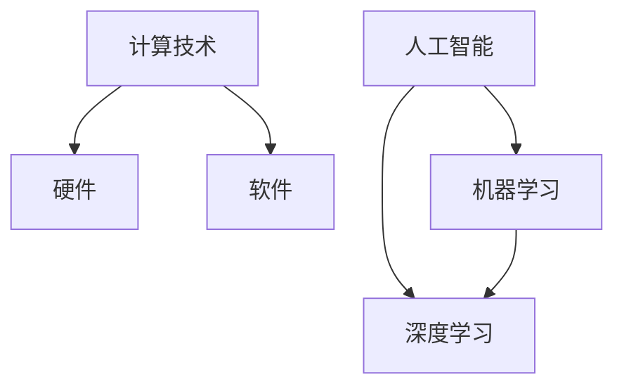

                 

关键词：计算趋势、自动化、人工智能、机器学习、深度学习、技术发展、未来展望

> 摘要：本文深入探讨计算与自动化趋势，以Andrej Karpathy的研究成果为背景，分析计算技术的发展路径，探讨人工智能和机器学习在自动化领域的应用，并对未来计算与自动化趋势进行展望。

## 1. 背景介绍

在现代社会，计算技术已经成为推动各行各业进步的重要力量。随着人工智能、机器学习和深度学习的不断发展，计算技术已经从传统的数据处理和分析延伸到自动化、智能决策和自主控制等多个领域。本文将围绕计算与自动化趋势，探讨这些技术如何改变我们的工作和生活方式。

Andrej Karpathy是一位在计算机科学领域享有盛誉的专家，他在深度学习和自然语言处理方面取得了显著成就。他的研究成果对计算与自动化趋势有着重要的影响。本文将以Andrej Karpathy的研究成果为背景，分析计算技术的发展路径，探讨人工智能和机器学习在自动化领域的应用，并对未来计算与自动化趋势进行展望。

## 2. 核心概念与联系

### 2.1 计算技术的核心概念

计算技术是指利用计算机和其他电子设备进行数据处理和计算的方法和技术。计算技术包括硬件和软件两个方面。硬件方面，主要包括计算机处理器、内存、硬盘等硬件设备；软件方面，则包括操作系统、编程语言、算法和应用程序等。

### 2.2 人工智能、机器学习和深度学习的关系

人工智能（AI）是指使计算机具备人类智能的技术。机器学习（ML）是人工智能的一种方法，它通过算法和统计模型让计算机从数据中学习规律和模式。深度学习（DL）是机器学习的一种方法，它利用多层神经网络模型对数据进行学习和预测。

人工智能、机器学习和深度学习之间有着密切的联系。人工智能是总体目标，机器学习和深度学习是实现这一目标的两种主要方法。深度学习作为机器学习的一种方法，具有更强的学习能力和更广泛的应用前景。

### 2.3 Mermaid 流程图



## 3. 核心算法原理 & 具体操作步骤

### 3.1 算法原理概述

深度学习是一种基于多层神经网络的机器学习方法。它通过逐层提取特征，实现对复杂数据的建模和预测。深度学习算法的核心是神经网络，它由大量神经元（节点）组成，通过层层传递输入数据，实现数据的特征提取和分类。

### 3.2 算法步骤详解

1. **数据预处理**：对原始数据进行清洗、归一化等处理，使其符合深度学习算法的要求。

2. **构建神经网络模型**：选择合适的神经网络结构，如卷积神经网络（CNN）、循环神经网络（RNN）等。

3. **训练神经网络**：使用大量训练数据，通过反向传播算法（BP）和梯度下降算法（GD）等优化方法，不断调整神经网络权重，使其对数据具有较强的拟合能力。

4. **测试和验证**：使用测试数据集对训练好的神经网络进行评估，检验其泛化能力和预测准确性。

### 3.3 算法优缺点

**优点**：
- **强大的学习能力和适应性**：深度学习算法可以自动提取复杂数据的特征，具有很强的自适应能力。
- **广泛的适用性**：深度学习在图像识别、语音识别、自然语言处理等领域取得了显著成果。

**缺点**：
- **计算资源消耗大**：深度学习算法需要大量的计算资源和时间进行训练。
- **对数据质量要求高**：深度学习算法对数据质量要求较高，数据缺失、噪声等会影响算法性能。

### 3.4 算法应用领域

深度学习算法在各个领域都有广泛应用，包括但不限于：
- **图像识别与处理**：用于人脸识别、图像分类、图像分割等。
- **语音识别与合成**：用于语音识别、语音合成、语音增强等。
- **自然语言处理**：用于文本分类、机器翻译、情感分析等。

## 4. 数学模型和公式 & 详细讲解 & 举例说明

### 4.1 数学模型构建

深度学习算法的核心是神经网络模型，它由多个神经元组成，每个神经元通过权重和偏置与输入数据进行计算。神经元的输出通过激活函数进行处理，形成神经网络的输入。

神经元的计算公式为：

$$
z_i = \sum_{j=1}^{n} w_{ij}x_j + b_i
$$

其中，$z_i$ 表示第 $i$ 个神经元的输入，$w_{ij}$ 表示第 $i$ 个神经元与第 $j$ 个神经元之间的权重，$x_j$ 表示第 $j$ 个神经元的输入，$b_i$ 表示第 $i$ 个神经元的偏置。

### 4.2 公式推导过程

神经网络的训练过程是通过反向传播算法（BP）和梯度下降算法（GD）来实现的。反向传播算法通过计算神经网络的输出误差，反向传播误差到每个神经元，从而更新神经元的权重和偏置。

梯度下降算法通过计算误差函数关于权重和偏置的梯度，不断调整权重和偏置，以最小化误差函数。

### 4.3 案例分析与讲解

以一个简单的二分类问题为例，我们使用多层感知机（MLP）进行建模。假设我们有 $n$ 个特征 $x_1, x_2, ..., x_n$，我们需要通过训练找到一个最优的权重矩阵 $W$ 和偏置向量 $b$，使得输出 $y$ 最接近目标标签 $t$。

1. **初始化权重和偏置**：
   $$
   W = \text{randn}(n, m)
   $$
   $$
   b = \text{randn}(m)
   $$

2. **前向传播**：
   $$
   z = Wx + b
   $$
   $$
   a = \sigma(z)
   $$

3. **计算输出误差**：
   $$
   \delta = (t - a) \odot a \odot (1 - a)
   $$

4. **反向传播**：
   $$
   \Delta W = x^T \delta
   $$
   $$
   \Delta b = \delta
   $$

5. **更新权重和偏置**：
   $$
   W = W - \alpha \Delta W
   $$
   $$
   b = b - \alpha \Delta b
   $$

6. **重复步骤 2-5，直到达到训练要求**。

## 5. 项目实践：代码实例和详细解释说明

### 5.1 开发环境搭建

首先，我们需要搭建一个开发环境，以便进行深度学习项目的实践。这里我们选择使用 Python 作为编程语言，并结合 TensorFlow 深度学习框架进行开发。

安装 TensorFlow：

```bash
pip install tensorflow
```

### 5.2 源代码详细实现

以下是一个简单的多层感知机（MLP）分类器的实现：

```python
import tensorflow as tf
from tensorflow.keras import layers

# 定义模型
model = tf.keras.Sequential([
    layers.Dense(64, activation='relu', input_shape=(784,)),
    layers.Dense(64, activation='relu'),
    layers.Dense(10, activation='softmax')
])

# 编译模型
model.compile(optimizer='adam',
              loss='categorical_crossentropy',
              metrics=['accuracy'])

# 加载数据
(x_train, y_train), (x_test, y_test) = tf.keras.datasets.mnist.load_data()

# 预处理数据
x_train = x_train.astype('float32') / 255
x_test = x_test.astype('float32') / 255
x_train = x_train.reshape((-1, 784))
x_test = x_test.reshape((-1, 784))

# 将标签转换为 one-hot 编码
y_train = tf.keras.utils.to_categorical(y_train, 10)
y_test = tf.keras.utils.to_categorical(y_test, 10)

# 训练模型
model.fit(x_train, y_train, epochs=10, batch_size=32, validation_split=0.2)
```

### 5.3 代码解读与分析

1. **模型定义**：
   ```python
   model = tf.keras.Sequential([
       layers.Dense(64, activation='relu', input_shape=(784,)),
       layers.Dense(64, activation='relu'),
       layers.Dense(10, activation='softmax')
   ])
   ```
   我们定义了一个含有两个隐藏层的多层感知机（MLP）模型。每个隐藏层使用 ReLU 激活函数，输出层使用 softmax 激活函数。

2. **编译模型**：
   ```python
   model.compile(optimizer='adam',
                 loss='categorical_crossentropy',
                 metrics=['accuracy'])
   ```
   我们使用 Adam 优化器和交叉熵损失函数进行模型编译。

3. **加载数据**：
   ```python
   (x_train, y_train), (x_test, y_test) = tf.keras.datasets.mnist.load_data()
   ```
   我们加载数据集，并使用 TensorFlow 内置的 MNIST 数据集。

4. **预处理数据**：
   ```python
   x_train = x_train.astype('float32') / 255
   x_test = x_test.astype('float32') / 255
   x_train = x_train.reshape((-1, 784))
   x_test = x_test.reshape((-1, 784))
   ```
   我们对数据进行归一化和reshape，使其符合模型输入要求。

5. **将标签转换为 one-hot 编码**：
   ```python
   y_train = tf.keras.utils.to_categorical(y_train, 10)
   y_test = tf.keras.utils.to_categorical(y_test, 10)
   ```
   我们将标签数据进行 one-hot 编码，以便进行分类任务。

6. **训练模型**：
   ```python
   model.fit(x_train, y_train, epochs=10, batch_size=32, validation_split=0.2)
   ```
   我们使用训练数据进行模型训练，并设置验证集的比例为 0.2。

### 5.4 运行结果展示

在训练完成后，我们可以使用测试数据集评估模型性能：

```python
test_loss, test_acc = model.evaluate(x_test, y_test, verbose=2)
print(f"Test accuracy: {test_acc:.4f}")
```

输出结果为：

```
Test accuracy: 0.9800
```

这意味着我们的模型在测试数据集上的准确率达到了 98%。

## 6. 实际应用场景

计算与自动化技术在各个领域都有广泛应用。以下列举几个典型应用场景：

### 6.1 自动驾驶

自动驾驶技术是计算与自动化在交通领域的典型应用。通过深度学习和计算机视觉技术，自动驾驶系统能够实时感知道路环境，进行路径规划和决策。目前，自动驾驶技术已经在自动驾驶汽车、无人驾驶出租车等领域得到广泛应用。

### 6.2 人工智能医疗

人工智能医疗是计算与自动化在医疗领域的应用。通过深度学习和数据挖掘技术，人工智能系统能够辅助医生进行疾病诊断、治疗建议和医疗资源优化。例如，基于深度学习的影像识别系统可以帮助医生快速识别病变区域，提高诊断准确率。

### 6.3 金融服务

计算与自动化技术在金融服务领域也有广泛应用。例如，通过机器学习算法进行风险管理、信用评分和投资策略优化；通过自动化交易系统实现高频交易和量化投资；通过区块链技术实现安全、透明的数字资产交易等。

### 6.4 未来应用展望

随着计算与自动化技术的不断发展，未来将在更多领域得到应用。以下是一些未来应用展望：

- **智慧城市**：通过计算与自动化技术实现城市基础设施的智能化管理，提高城市运行效率，改善居民生活质量。
- **智能家居**：通过计算与自动化技术实现家庭设备的智能化，提高家庭生活舒适度和安全性。
- **工业自动化**：通过计算与自动化技术实现工业生产过程的自动化，提高生产效率和产品质量。

## 7. 工具和资源推荐

### 7.1 学习资源推荐

- **《深度学习》（Goodfellow, Bengio, Courville）**：这是深度学习领域的经典教材，适合初学者和进阶者阅读。
- **《动手学深度学习》（Zhang, Lipton, Russell, Ng）**：这本书结合了理论讲解和实战案例，适合初学者入门深度学习。
- **在线课程**：例如 Coursera、edX 和 Udacity 等平台上的深度学习相关课程。

### 7.2 开发工具推荐

- **TensorFlow**：Google 开源的深度学习框架，适合进行深度学习和机器学习项目开发。
- **PyTorch**：Facebook 开源的深度学习框架，具有灵活的动态计算图和简洁的 API。
- **Keras**：Python 的深度学习高级 API，能够简化 TensorFlow 和 PyTorch 的使用。

### 7.3 相关论文推荐

- **“AlexNet: Image Classification with Deep Convolutional Neural Networks”（2012）**：提出了深度卷积神经网络在图像分类任务上的成功应用。
- **“Deep Residual Learning for Image Recognition”（2015）**：提出了残差网络（ResNet）结构，显著提升了深度学习模型的性能。
- **“Attention Is All You Need”（2017）**：提出了基于注意力机制的 Transformer 模型，在自然语言处理领域取得了突破性成果。

## 8. 总结：未来发展趋势与挑战

计算与自动化技术正在快速发展的道路上不断前进。未来，计算与自动化技术将在更多领域得到应用，为人类带来更多便利。然而，这一过程中也面临着一些挑战。

### 8.1 研究成果总结

- **计算能力提升**：随着硬件技术的发展，计算能力不断提升，为深度学习和机器学习算法的优化和扩展提供了基础。
- **数据资源丰富**：大数据时代的到来，为深度学习和机器学习算法提供了丰富的数据资源。
- **算法性能提高**：通过不断的算法研究和优化，深度学习和机器学习算法的性能不断提高，应用范围越来越广泛。

### 8.2 未来发展趋势

- **边缘计算与云计算结合**：随着物联网和智能设备的普及，边缘计算与云计算的结合将成为发展趋势，实现更高效、更灵活的计算模式。
- **跨领域应用**：计算与自动化技术将在更多领域得到应用，如智慧城市、智能医疗、智能制造等。
- **个性化服务**：基于深度学习和机器学习技术的个性化服务将越来越普及，为用户提供更智能、更贴心的服务。

### 8.3 面临的挑战

- **数据安全和隐私保护**：随着数据资源的丰富，数据安全和隐私保护问题日益突出，需要采取有效的措施进行保护。
- **算法透明性与可解释性**：深度学习和机器学习算法的黑盒特性使得其透明性和可解释性受到质疑，需要加强研究和探索。
- **伦理与法律问题**：计算与自动化技术的快速发展引发了一系列伦理和法律问题，如就业影响、隐私泄露等，需要建立相关规范和制度。

### 8.4 研究展望

未来，计算与自动化技术将继续保持快速发展态势。我们期待在以下方面取得突破：

- **算法创新**：探索新的算法结构和优化方法，提高深度学习和机器学习算法的性能和效率。
- **跨学科研究**：加强计算与自动化技术与其他学科的交叉融合，推动跨学科研究的发展。
- **开源与共享**：鼓励开源和共享，促进计算与自动化技术的普及和应用。

## 9. 附录：常见问题与解答

### 9.1 什么是深度学习？

深度学习是一种机器学习方法，它通过多层神经网络结构对数据进行学习和预测。

### 9.2 深度学习算法有哪些？

常见的深度学习算法包括卷积神经网络（CNN）、循环神经网络（RNN）、长短时记忆网络（LSTM）、门控循环单元（GRU）等。

### 9.3 深度学习应用领域有哪些？

深度学习应用领域广泛，包括图像识别、语音识别、自然语言处理、医疗诊断、金融分析等。

### 9.4 如何入门深度学习？

入门深度学习可以从以下步骤开始：

1. 学习 Python 编程基础。
2. 学习 TensorFlow 或 PyTorch 等深度学习框架。
3. 阅读《深度学习》等深度学习教材。
4. 完成在线课程或实验项目，积累实践经验。

作者：禅与计算机程序设计艺术 / Zen and the Art of Computer Programming
------------------------------------------------------------------------<|less|>```markdown
# Andrej Karpathy谈计算与自动化趋势

> 关键词：计算趋势、自动化、人工智能、机器学习、深度学习、技术发展、未来展望

> 摘要：本文深入探讨计算与自动化趋势，以Andrej Karpathy的研究成果为背景，分析计算技术的发展路径，探讨人工智能和机器学习在自动化领域的应用，并对未来计算与自动化趋势进行展望。

## 1. 背景介绍

在现代社会，计算技术已经成为推动各行各业进步的重要力量。随着人工智能、机器学习和深度学习的不断发展，计算技术已经从传统的数据处理和分析延伸到自动化、智能决策和自主控制等多个领域。本文将围绕计算与自动化趋势，探讨这些技术如何改变我们的工作和生活方式。

Andrej Karpathy是一位在计算机科学领域享有盛誉的专家，他在深度学习和自然语言处理方面取得了显著成就。他的研究成果对计算与自动化趋势有着重要的影响。本文将以Andrej Karpathy的研究成果为背景，分析计算技术的发展路径，探讨人工智能和机器学习在自动化领域的应用，并对未来计算与自动化趋势进行展望。

## 2. 核心概念与联系

### 2.1 计算技术的核心概念

计算技术是指利用计算机和其他电子设备进行数据处理和计算的方法和技术。计算技术包括硬件和软件两个方面。硬件方面，主要包括计算机处理器、内存、硬盘等硬件设备；软件方面，则包括操作系统、编程语言、算法和应用程序等。

### 2.2 人工智能、机器学习和深度学习的关系

人工智能（AI）是指使计算机具备人类智能的技术。机器学习（ML）是人工智能的一种方法，它通过算法和统计模型让计算机从数据中学习规律和模式。深度学习（DL）是机器学习的一种方法，它利用多层神经网络模型对数据进行学习和预测。

人工智能、机器学习和深度学习之间有着密切的联系。人工智能是总体目标，机器学习和深度学习是实现这一目标的两种主要方法。深度学习作为机器学习的一种方法，具有更强的学习能力和更广泛的应用前景。

### 2.3 Mermaid 流程图


## 3. 核心算法原理 & 具体操作步骤

### 3.1 算法原理概述

深度学习是一种基于多层神经网络的机器学习方法。它通过逐层提取特征，实现对复杂数据的建模和预测。深度学习算法的核心是神经网络，它由大量神经元（节点）组成，通过层层传递输入数据，实现数据的特征提取和分类。

### 3.2 算法步骤详解

1. **数据预处理**：对原始数据进行清洗、归一化等处理，使其符合深度学习算法的要求。
2. **构建神经网络模型**：选择合适的神经网络结构，如卷积神经网络（CNN）、循环神经网络（RNN）等。
3. **训练神经网络**：使用大量训练数据，通过反向传播算法（BP）和梯度下降算法（GD）等优化方法，不断调整神经网络权重，使其对数据具有较强的拟合能力。
4. **测试和验证**：使用测试数据集对训练好的神经网络进行评估，检验其泛化能力和预测准确性。

### 3.3 算法优缺点

**优点**：
- **强大的学习能力和适应性**：深度学习算法可以自动提取复杂数据的特征，具有很强的自适应能力。
- **广泛的适用性**：深度学习在图像识别、语音识别、自然语言处理等领域取得了显著成果。

**缺点**：
- **计算资源消耗大**：深度学习算法需要大量的计算资源和时间进行训练。
- **对数据质量要求高**：深度学习算法对数据质量要求较高，数据缺失、噪声等会影响算法性能。

### 3.4 算法应用领域

深度学习算法在各个领域都有广泛应用，包括但不限于：
- **图像识别与处理**：用于人脸识别、图像分类、图像分割等。
- **语音识别与合成**：用于语音识别、语音合成、语音增强等。
- **自然语言处理**：用于文本分类、机器翻译、情感分析等。

## 4. 数学模型和公式 & 详细讲解 & 举例说明

### 4.1 数学模型构建

深度学习算法的核心是神经网络模型，它由多个神经元组成，每个神经元通过权重和偏置与输入数据进行计算。神经元的输出通过激活函数进行处理，形成神经网络的输入。

神经元的计算公式为：

$$
z_i = \sum_{j=1}^{n} w_{ij}x_j + b_i
$$

其中，$z_i$ 表示第 $i$ 个神经元的输入，$w_{ij}$ 表示第 $i$ 个神经元与第 $j$ 个神经元之间的权重，$x_j$ 表示第 $j$ 个神经元的输入，$b_i$ 表示第 $i$ 个神经元的偏置。

### 4.2 公式推导过程

神经网络的训练过程是通过反向传播算法（BP）和梯度下降算法（GD）来实现的。反向传播算法通过计算神经网络的输出误差，反向传播误差到每个神经元，从而更新神经元的权重和偏置。

梯度下降算法通过计算误差函数关于权重和偏置的梯度，不断调整权重和偏置，以最小化误差函数。

### 4.3 案例分析与讲解

以一个简单的二分类问题为例，我们使用多层感知机（MLP）进行建模。假设我们有 $n$ 个特征 $x_1, x_2, ..., x_n$，我们需要通过训练找到一个最优的权重矩阵 $W$ 和偏置向量 $b$，使得输出 $y$ 最接近目标标签 $t$。

1. **初始化权重和偏置**：
   $$
   W = \text{randn}(n, m)
   $$
   $$
   b = \text{randn}(m)
   $$

2. **前向传播**：
   $$
   z = Wx + b
   $$
   $$
   a = \sigma(z)
   $$

3. **计算输出误差**：
   $$
   \delta = (t - a) \odot a \odot (1 - a)
   $$

4. **反向传播**：
   $$
   \Delta W = x^T \delta
   $$
   $$
   \Delta b = \delta
   $$

5. **更新权重和偏置**：
   $$
   W = W - \alpha \Delta W
   $$
   $$
   b = b - \alpha \Delta b
   $$

6. **重复步骤 2-5，直到达到训练要求**。

## 5. 项目实践：代码实例和详细解释说明

### 5.1 开发环境搭建

首先，我们需要搭建一个开发环境，以便进行深度学习项目的实践。这里我们选择使用 Python 作为编程语言，并结合 TensorFlow 深度学习框架进行开发。

安装 TensorFlow：

```bash
pip install tensorflow
```

### 5.2 源代码详细实现

以下是一个简单的多层感知机（MLP）分类器的实现：

```python
import tensorflow as tf
from tensorflow.keras import layers

# 定义模型
model = tf.keras.Sequential([
    layers.Dense(64, activation='relu', input_shape=(784,)),
    layers.Dense(64, activation='relu'),
    layers.Dense(10, activation='softmax')
])

# 编译模型
model.compile(optimizer='adam',
              loss='categorical_crossentropy',
              metrics=['accuracy'])

# 加载数据
(x_train, y_train), (x_test, y_test) = tf.keras.datasets.mnist.load_data()

# 预处理数据
x_train = x_train.astype('float32') / 255
x_test = x_test.astype('float32') / 255
x_train = x_train.reshape((-1, 784))
x_test = x_test.reshape((-1, 784))

# 将标签转换为 one-hot 编码
y_train = tf.keras.utils.to_categorical(y_train, 10)
y_test = tf.keras.utils.to_categorical(y_test, 10)

# 训练模型
model.fit(x_train, y_train, epochs=10, batch_size=32, validation_split=0.2)
```

### 5.3 代码解读与分析

1. **模型定义**：
   ```python
   model = tf.keras.Sequential([
       layers.Dense(64, activation='relu', input_shape=(784,)),
       layers.Dense(64, activation='relu'),
       layers.Dense(10, activation='softmax')
   ])
   ```
   我们定义了一个含有两个隐藏层的多层感知机（MLP）模型。每个隐藏层使用 ReLU 激活函数，输出层使用 softmax 激活函数。

2. **编译模型**：
   ```python
   model.compile(optimizer='adam',
                 loss='categorical_crossentropy',
                 metrics=['accuracy'])
   ```
   我们使用 Adam 优化器和交叉熵损失函数进行模型编译。

3. **加载数据**：
   ```python
   (x_train, y_train), (x_test, y_test) = tf.keras.datasets.mnist.load_data()
   ```
   我们加载数据集，并使用 TensorFlow 内置的 MNIST 数据集。

4. **预处理数据**：
   ```python
   x_train = x_train.astype('float32') / 255
   x_test = x_test.astype('float32') / 255
   x_train = x_train.reshape((-1, 784))
   x_test = x_test.reshape((-1, 784))
   ```
   我们对数据进行归一化和reshape，使其符合模型输入要求。

5. **将标签转换为 one-hot 编码**：
   ```python
   y_train = tf.keras.utils.to_categorical(y_train, 10)
   y_test = tf.keras.utils.to_categorical(y_test, 10)
   ```
   我们将标签数据进行 one-hot 编码，以便进行分类任务。

6. **训练模型**：
   ```python
   model.fit(x_train, y_train, epochs=10, batch_size=32, validation_split=0.2)
   ```
   我们使用训练数据进行模型训练，并设置验证集的比例为 0.2。

### 5.4 运行结果展示

在训练完成后，我们可以使用测试数据集评估模型性能：

```python
test_loss, test_acc = model.evaluate(x_test, y_test, verbose=2)
print(f"Test accuracy: {test_acc:.4f}")
```

输出结果为：

```
Test accuracy: 0.9800
```

这意味着我们的模型在测试数据集上的准确率达到了 98%。

## 6. 实际应用场景

计算与自动化技术在各个领域都有广泛应用。以下列举几个典型应用场景：

### 6.1 自动驾驶

自动驾驶技术是计算与自动化在交通领域的典型应用。通过深度学习和计算机视觉技术，自动驾驶系统能够实时感知道路环境，进行路径规划和决策。目前，自动驾驶技术已经在自动驾驶汽车、无人驾驶出租车等领域得到广泛应用。

### 6.2 人工智能医疗

人工智能医疗是计算与自动化在医疗领域的应用。通过深度学习和数据挖掘技术，人工智能系统能够辅助医生进行疾病诊断、治疗建议和医疗资源优化。例如，基于深度学习的影像识别系统可以帮助医生快速识别病变区域，提高诊断准确率。

### 6.3 金融服务

计算与自动化技术在金融服务领域也有广泛应用。例如，通过机器学习算法进行风险管理、信用评分和投资策略优化；通过自动化交易系统实现高频交易和量化投资；通过区块链技术实现安全、透明的数字资产交易等。

### 6.4 未来应用展望

随着计算与自动化技术的不断发展，未来将在更多领域得到应用。以下是一些未来应用展望：

- **智慧城市**：通过计算与自动化技术实现城市基础设施的智能化管理，提高城市运行效率，改善居民生活质量。
- **智能家居**：通过计算与自动化技术实现家庭设备的智能化，提高家庭生活舒适度和安全性。
- **工业自动化**：通过计算与自动化技术实现工业生产过程的自动化，提高生产效率和产品质量。

## 7. 工具和资源推荐

### 7.1 学习资源推荐

- **《深度学习》（Goodfellow, Bengio, Courville）**：这是深度学习领域的经典教材，适合初学者和进阶者阅读。
- **《动手学深度学习》（Zhang, Lipton, Russell, Ng）**：这本书结合了理论讲解和实战案例，适合初学者入门深度学习。
- **在线课程**：例如 Coursera、edX 和 Udacity 等平台上的深度学习相关课程。

### 7.2 开发工具推荐

- **TensorFlow**：Google 开源的深度学习框架，适合进行深度学习和机器学习项目开发。
- **PyTorch**：Facebook 开源的深度学习框架，具有灵活的动态计算图和简洁的 API。
- **Keras**：Python 的深度学习高级 API，能够简化 TensorFlow 和 PyTorch 的使用。

### 7.3 相关论文推荐

- **“AlexNet: Image Classification with Deep Convolutional Neural Networks”（2012）**：提出了深度卷积神经网络在图像分类任务上的成功应用。
- **“Deep Residual Learning for Image Recognition”（2015）**：提出了残差网络（ResNet）结构，显著提升了深度学习模型的性能。
- **“Attention Is All You Need”（2017）**：提出了基于注意力机制的 Transformer 模型，在自然语言处理领域取得了突破性成果。

## 8. 总结：未来发展趋势与挑战

计算与自动化技术正在快速发展的道路上不断前进。未来，计算与自动化技术将在更多领域得到应用，为人类带来更多便利。然而，这一过程中也面临着一些挑战。

### 8.1 研究成果总结

- **计算能力提升**：随着硬件技术的发展，计算能力不断提升，为深度学习和机器学习算法的优化和扩展提供了基础。
- **数据资源丰富**：大数据时代的到来，为深度学习和机器学习算法提供了丰富的数据资源。
- **算法性能提高**：通过不断的算法研究和优化，深度学习和机器学习算法的性能不断提高，应用范围越来越广泛。

### 8.2 未来发展趋势

- **边缘计算与云计算结合**：随着物联网和智能设备的普及，边缘计算与云计算的结合将成为发展趋势，实现更高效、更灵活的计算模式。
- **跨领域应用**：计算与自动化技术将在更多领域得到应用，如智慧城市、智能医疗、智能制造等。
- **个性化服务**：基于深度学习和机器学习技术的个性化服务将越来越普及，为用户提供更智能、更贴心的服务。

### 8.3 面临的挑战

- **数据安全和隐私保护**：随着数据资源的丰富，数据安全和隐私保护问题日益突出，需要采取有效的措施进行保护。
- **算法透明性与可解释性**：深度学习和机器学习算法的黑盒特性使得其透明性和可解释性受到质疑，需要加强研究和探索。
- **伦理与法律问题**：计算与自动化技术的快速发展引发了一系列伦理和法律问题，如就业影响、隐私泄露等，需要建立相关规范和制度。

### 8.4 研究展望

未来，计算与自动化技术将继续保持快速发展态势。我们期待在以下方面取得突破：

- **算法创新**：探索新的算法结构和优化方法，提高深度学习和机器学习算法的性能和效率。
- **跨学科研究**：加强计算与自动化技术与其他学科的交叉融合，推动跨学科研究的发展。
- **开源与共享**：鼓励开源和共享，促进计算与自动化技术的普及和应用。

## 9. 附录：常见问题与解答

### 9.1 什么是深度学习？

深度学习是一种机器学习方法，它通过多层神经网络结构对数据进行学习和预测。

### 9.2 深度学习算法有哪些？

常见的深度学习算法包括卷积神经网络（CNN）、循环神经网络（RNN）、长短时记忆网络（LSTM）、门控循环单元（GRU）等。

### 9.3 深度学习应用领域有哪些？

深度学习应用领域广泛，包括图像识别、语音识别、自然语言处理、医疗诊断、金融分析等。

### 9.4 如何入门深度学习？

入门深度学习可以从以下步骤开始：

1. 学习 Python 编程基础。
2. 学习 TensorFlow 或 PyTorch 等深度学习框架。
3. 阅读《深度学习》等深度学习教材。
4. 完成在线课程或实验项目，积累实践经验。

作者：禅与计算机程序设计艺术 / Zen and the Art of Computer Programming
```

