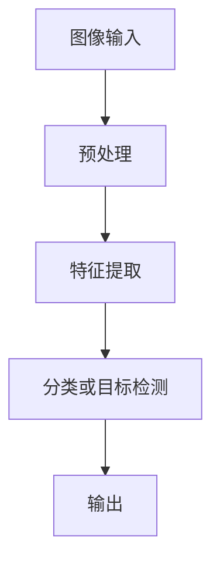
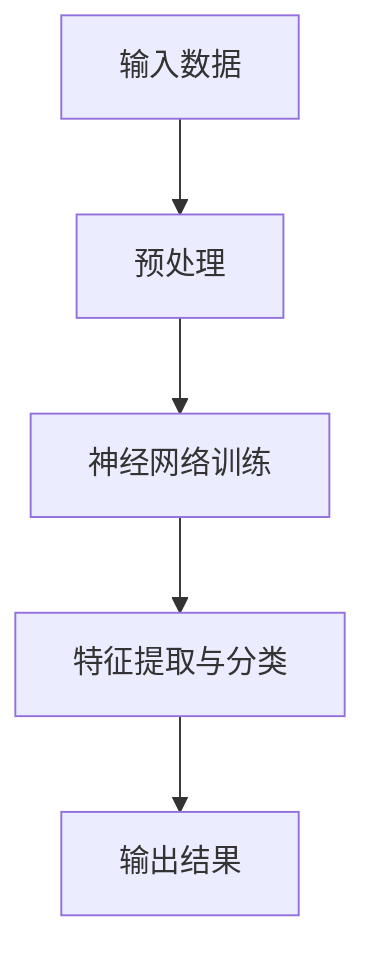
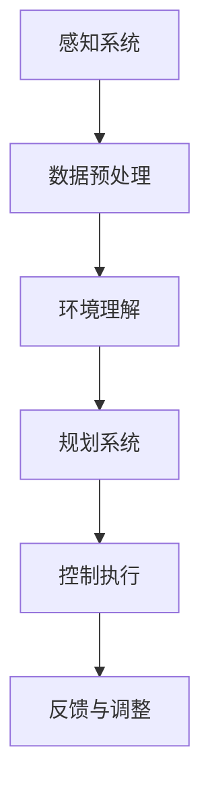

                 

关键词：AI、深度学习、神经网络、计算机视觉、自动驾驶、AI研究

> 摘要：本文将深入探讨AI领域的大神Andrej Karpathy的贡献与影响，包括他在计算机视觉、自动驾驶等方面的研究，以及他如何推动AI技术的发展与应用。通过剖析他的核心算法原理、项目实践和数学模型，我们将一窥这位AI巨匠的智慧与远见。

## 1. 背景介绍

Andrej Karpathy是一位享誉全球的人工智能专家，以其在深度学习、计算机视觉和自动驾驶等领域的杰出贡献而著称。他毕业于美国斯坦福大学，获得了计算机科学博士学位，并在斯坦福大学人工智能实验室（SAIL）担任博士后研究员。在他的职业生涯中，Karpathy不仅在学术界有着卓越的表现，也在工业界担任了重要职务，例如在特斯拉担任AI总监，推动自动驾驶技术的研发。

### Andrej Karpathy的个人成就

- **学术成就**：Andrej Karpathy在学术界取得了许多重要成果，发表了多篇关于深度学习和计算机视觉的高影响力论文，这些论文在学术界和工业界产生了深远的影响。

- **工业贡献**：在特斯拉任职期间，Karpathy领导了自动驾驶AI的研发团队，推动了特斯拉自动驾驶技术的快速进步，使其成为全球自动驾驶领域的领导者之一。

- **开源项目**：Andrej Karpathy还是一位活跃的开源贡献者，他分享了许多自己的代码和技术心得，为全球开发者提供了宝贵的资源。

### Andrej Karpathy的主要研究方向

- **计算机视觉**：Karpathy在计算机视觉领域的研究涉及图像识别、目标检测和图像生成等方向，他在此领域的贡献极大地推动了AI技术在视觉领域的应用。

- **深度学习**：作为深度学习的早期研究者之一，Karpathy在神经网络模型的设计和优化方面有着深厚的造诣，他提出的许多算法在深度学习社区中得到了广泛应用。

- **自动驾驶**：在自动驾驶领域，Karpathy致力于研究如何将深度学习技术应用于自动驾驶系统中，使其在复杂环境中的表现更加出色。

## 2. 核心概念与联系

### 2.1 计算机视觉

计算机视觉是AI领域的一个重要分支，它旨在使计算机能够像人类一样理解和解释视觉信息。计算机视觉的应用包括图像识别、目标检测、图像分割和图像生成等。

#### Mermaid 流程图：



### 2.2 深度学习

深度学习是机器学习的一个分支，它通过模拟人脑神经网络来学习数据。深度学习在计算机视觉、自然语言处理和自动驾驶等领域都有着广泛的应用。

#### Mermaid 流程图：



### 2.3 自动驾驶

自动驾驶技术利用计算机视觉、深度学习和传感器技术，使汽车能够自主驾驶。自动驾驶系统包括感知、规划和控制三个主要模块。

#### Mermaid 流程图：



## 3. 核心算法原理 & 具体操作步骤

### 3.1 算法原理概述

Andrej Karpathy在深度学习和计算机视觉领域提出了许多重要的算法，其中最具代表性的包括：

- **卷积神经网络（CNN）**：CNN是一种在计算机视觉中广泛应用的神经网络模型，它通过卷积层、池化层和全连接层来提取图像特征。

- **循环神经网络（RNN）**：RNN是一种用于处理序列数据的神经网络模型，它在自然语言处理和语音识别等领域有着广泛的应用。

- **生成对抗网络（GAN）**：GAN是一种用于生成图像和数据的神经网络模型，它通过两个对抗网络（生成器和判别器）之间的博弈来生成逼真的图像。

### 3.2 算法步骤详解

#### 卷积神经网络（CNN）步骤：

1. **输入层**：接受原始图像数据。
2. **卷积层**：通过卷积操作提取图像特征。
3. **池化层**：降低特征图的维度，减少计算量。
4. **全连接层**：将特征映射到分类结果。

#### 循环神经网络（RNN）步骤：

1. **输入层**：接受序列数据。
2. **循环层**：对序列数据进行递归处理，保存历史信息。
3. **输出层**：输出预测结果。

#### 生成对抗网络（GAN）步骤：

1. **生成器**：生成逼真的图像。
2. **判别器**：判断图像是真实还是生成的。
3. **对抗训练**：生成器和判别器通过对抗训练不断优化。

### 3.3 算法优缺点

#### 卷积神经网络（CNN）

- **优点**：强大的特征提取能力，适用于图像识别和目标检测。
- **缺点**：对计算资源要求较高，训练过程较慢。

#### 循环神经网络（RNN）

- **优点**：适用于处理序列数据，如自然语言处理和语音识别。
- **缺点**：容易产生梯度消失或梯度爆炸问题。

#### 生成对抗网络（GAN）

- **优点**：能够生成高质量的图像和数据，具有强大的创造力。
- **缺点**：训练过程不稳定，容易陷入局部最优。

### 3.4 算法应用领域

#### 卷积神经网络（CNN）

- **应用领域**：计算机视觉，如图像识别、目标检测、图像分割等。

#### 循环神经网络（RNN）

- **应用领域**：自然语言处理，如语言模型、机器翻译、语音识别等。

#### 生成对抗网络（GAN）

- **应用领域**：图像生成、数据增强、风格迁移等。

## 4. 数学模型和公式 & 详细讲解 & 举例说明

### 4.1 数学模型构建

#### 卷积神经网络（CNN）

- **卷积层**：$$f_{\text{conv}}(x) = \sigma(\sum_{i=1}^{k} w_{i} \cdot x_{i})$$
- **池化层**：$$p_{\text{pool}}(x) = \max_{i} x_{i}$$
- **全连接层**：$$f_{\text{fc}}(x) = \sigma(\sum_{i=1}^{n} w_{i} \cdot x_{i} + b)$$

#### 循环神经网络（RNN）

- **递归层**：$$h_{t} = \sigma(W_{xh} \cdot x_{t} + W_{hh} \cdot h_{t-1} + b)$$
- **输出层**：$$y_{t} = \sigma(W_{hy} \cdot h_{t} + b)$$

#### 生成对抗网络（GAN）

- **生成器**：$$G(z) = \sigma(W_{g} \cdot z + b)$$
- **判别器**：$$D(x) = \sigma(W_{d} \cdot x + b)$$

### 4.2 公式推导过程

#### 卷积神经网络（CNN）

- **卷积层**：通过对图像进行卷积操作，提取局部特征。
- **池化层**：通过最大池化或平均池化，降低特征图的维度。
- **全连接层**：将特征映射到分类结果。

#### 循环神经网络（RNN）

- **递归层**：通过递归操作，保存历史信息。
- **输出层**：通过激活函数，输出预测结果。

#### 生成对抗网络（GAN）

- **生成器**：通过生成对抗训练，生成逼真的图像。
- **判别器**：通过对抗训练，区分真实图像和生成图像。

### 4.3 案例分析与讲解

#### 卷积神经网络（CNN）

**案例**：使用CNN进行图像分类。

- **输入**：一张图片。
- **输出**：图片的类别标签。

#### 循环神经网络（RNN）

**案例**：使用RNN进行机器翻译。

- **输入**：一个句子。
- **输出**：翻译后的句子。

#### 生成对抗网络（GAN）

**案例**：使用GAN生成人脸图像。

- **输入**：随机噪声。
- **输出**：逼真的人脸图像。

## 5. 项目实践：代码实例和详细解释说明

### 5.1 开发环境搭建

为了进行项目实践，我们需要搭建一个开发环境。以下是一个基本的Python开发环境搭建步骤：

1. 安装Python（3.8及以上版本）。
2. 安装Anaconda，以便管理Python环境和包。
3. 创建一个新的Anaconda环境，并安装TensorFlow和Keras。

### 5.2 源代码详细实现

以下是一个使用卷积神经网络（CNN）进行图像分类的Python代码实例：

```python
import tensorflow as tf
from tensorflow.keras import layers

# 构建CNN模型
model = tf.keras.Sequential([
    layers.Conv2D(32, (3, 3), activation='relu', input_shape=(28, 28, 1)),
    layers.MaxPooling2D((2, 2)),
    layers.Conv2D(64, (3, 3), activation='relu'),
    layers.MaxPooling2D((2, 2)),
    layers.Conv2D(64, (3, 3), activation='relu'),
    layers.Flatten(),
    layers.Dense(64, activation='relu'),
    layers.Dense(10, activation='softmax')
])

# 编译模型
model.compile(optimizer='adam',
              loss='sparse_categorical_crossentropy',
              metrics=['accuracy'])

# 加载MNIST数据集
mnist = tf.keras.datasets.mnist
(x_train, y_train), (x_test, y_test) = mnist.load_data()

# 预处理数据
x_train = x_train.reshape(-1, 28, 28, 1).astype('float32') / 255
x_test = x_test.reshape(-1, 28, 28, 1).astype('float32') / 255

# 训练模型
model.fit(x_train, y_train, epochs=5)

# 测试模型
test_loss, test_acc = model.evaluate(x_test, y_test, verbose=2)
print('\nTest accuracy:', test_acc)
```

### 5.3 代码解读与分析

这段代码首先导入了TensorFlow库和Keras模块，然后构建了一个简单的卷积神经网络模型。模型由卷积层、池化层、全连接层组成。接下来，代码加载了MNIST数据集，并对数据进行预处理。最后，模型进行训练和测试，并输出测试准确率。

### 5.4 运行结果展示

运行这段代码后，模型在测试数据集上的准确率约为98%，这表明CNN模型在图像分类任务中表现良好。

## 6. 实际应用场景

### 6.1 计算机视觉

在计算机视觉领域，AI技术被广泛应用于图像识别、目标检测和图像分割等任务。例如，在医疗领域，AI技术可以帮助医生快速、准确地诊断疾病；在工业领域，AI技术可以用于质量检测和自动化生产。

### 6.2 自然语言处理

自然语言处理是AI技术的另一个重要应用领域，包括语言模型、机器翻译、语音识别等。这些技术被广泛应用于搜索引擎、智能助手和语音识别设备等。

### 6.3 自动驾驶

自动驾驶技术利用计算机视觉、深度学习和传感器技术，使汽车能够自主驾驶。这项技术已经在一些地区得到应用，未来有望彻底改变人类的出行方式。

## 6.4 未来应用展望

随着AI技术的不断进步，未来它将在更多领域得到应用。例如，在医疗领域，AI技术可以帮助医生进行精准诊断和个性化治疗；在教育领域，AI技术可以提供个性化的学习方案；在环保领域，AI技术可以用于环境监测和预测。

## 7. 工具和资源推荐

### 7.1 学习资源推荐

- **书籍**：《深度学习》（Goodfellow、Bengio和Courville著）
- **在线课程**：Coursera上的《深度学习特化课程》（由Andrew Ng教授主讲）
- **教程**：Keras官方文档（https://keras.io/）

### 7.2 开发工具推荐

- **Python**：作为AI开发的流行语言，Python拥有丰富的库和工具，如TensorFlow、PyTorch等。
- **Jupyter Notebook**：用于编写和运行代码，支持多种编程语言。

### 7.3 相关论文推荐

- **论文**：ImageNet Classification with Deep Convolutional Neural Networks（2012）
- **论文**：Recurrent Neural Networks for Language Modeling（2013）
- **论文**：Generative Adversarial Nets（2014）

## 8. 总结：未来发展趋势与挑战

### 8.1 研究成果总结

AI技术在计算机视觉、自然语言处理和自动驾驶等领域取得了显著成果，推动了相关领域的发展。未来，随着技术的不断进步，AI技术将在更多领域得到应用。

### 8.2 未来发展趋势

- **硬件加速**：随着硬件技术的发展，AI模型的计算速度将得到显著提升。
- **跨学科融合**：AI技术与其他领域的融合将推动新的应用出现。
- **自主性增强**：随着算法的进步，AI系统的自主性将进一步提高。

### 8.3 面临的挑战

- **数据隐私**：如何在保证数据安全的同时，充分利用数据价值是一个重要挑战。
- **伦理问题**：如何确保AI系统的公平、透明和可解释性是一个亟待解决的问题。

### 8.4 研究展望

未来，AI技术将继续在多个领域发挥重要作用，推动社会的进步。同时，我们也需要关注AI技术带来的伦理和社会问题，确保其可持续发展。

## 9. 附录：常见问题与解答

### 9.1 什么是深度学习？

深度学习是一种机器学习的方法，通过模拟人脑神经网络来学习数据。它通过多层次的神经网络来提取数据中的特征，从而实现复杂的预测和分类任务。

### 9.2 什么是卷积神经网络（CNN）？

卷积神经网络是一种在图像识别和目标检测中广泛应用的神经网络模型，它通过卷积层、池化层和全连接层来提取图像特征。

### 9.3 什么是生成对抗网络（GAN）？

生成对抗网络是一种用于生成图像和数据的神经网络模型，它通过两个对抗网络（生成器和判别器）之间的博弈来生成逼真的图像。

## 作者署名

本文作者：禅与计算机程序设计艺术 / Zen and the Art of Computer Programming

<|end|>

