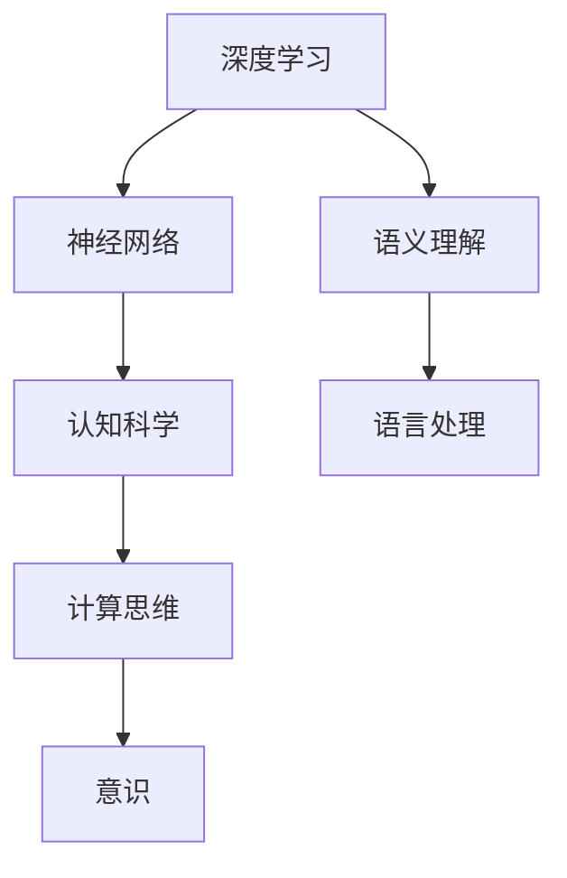

                 

关键词：人工智能、哲学、深度学习、神经网络、认知科学、语义理解、意识、计算思维

人工智能（AI）的发展已经取得了令人瞩目的成就，从简单的规则系统到如今强大的神经网络模型，AI 正在改变着我们的世界。然而，随着 AI 技术的不断进步，我们也开始思考：人工智能究竟是什么？它是否能够拥有意识和智慧？这是否意味着我们正走向一场新的哲学革命？本文将探讨人工智能的哲学意义，以及它对我们的认知、意识和计算思维的深远影响。

## 1. 背景介绍

### 1.1 人工智能的历史与发展

人工智能作为计算机科学的一个重要分支，其历史可以追溯到20世纪50年代。最早的 AI 研究主要集中在规则系统、专家系统和知识表示等方面。然而，随着计算能力和数据量的提升，20世纪80年代以后，以深度学习为代表的机器学习方法逐渐成为 AI 研究的主流。深度学习模型通过模拟人脑的神经网络结构，在图像识别、自然语言处理、语音识别等领域取得了显著的成果。

### 1.2 人工智能的应用现状

目前，人工智能已经广泛应用于各个领域，包括自动驾驶、医疗诊断、金融分析、智能家居等。AI 技术正在改变着我们的生活方式，提高生产效率，甚至在一定程度上替代人类的工作。然而，随着 AI 技术的快速发展，我们开始面临一系列哲学问题，比如：AI 是否能够拥有意识？它是如何形成意识的？AI 的道德责任如何界定？这些问题引发了广泛的讨论。

## 2. 核心概念与联系

在探讨人工智能的哲学意义之前，我们首先需要了解一些核心概念，包括深度学习、神经网络、认知科学和计算思维等。

### 2.1 深度学习与神经网络

深度学习是人工智能的一个重要分支，它通过多层神经网络对数据进行建模和预测。神经网络是由大量神经元组成的计算模型，通过模拟人脑的信息处理过程，实现对数据的自动学习与识别。

### 2.2 认知科学与计算思维

认知科学是研究人类认知过程的学科，包括知觉、记忆、思考、语言等。计算思维是指利用计算机解决问题的思维方式，它是人类认知过程的一种抽象。

### 2.3 意识与计算思维

意识是指个体对外界和内在信息的感知、理解和反应能力。计算思维与意识之间的关系一直是哲学和科学界探讨的热点问题。有观点认为，意识是计算思维的高级形式，是大脑中神经网络活动的产物。

### 2.4 语义理解与语言处理

语义理解是人工智能中的一个重要方向，它旨在使计算机能够理解、解释和生成自然语言。语义理解对于实现人机交互、智能问答、自动翻译等任务具有重要意义。

下面是一个简单的 Mermaid 流程图，展示了这些概念之间的联系：



## 3. 核心算法原理 & 具体操作步骤

### 3.1 算法原理概述

深度学习的核心是神经网络，神经网络通过反向传播算法学习输入数据与输出数据之间的映射关系。在训练过程中，网络通过不断调整权重，使输出结果逼近真实值。

### 3.2 算法步骤详解

深度学习算法的具体步骤如下：

1. **数据预处理**：对输入数据进行归一化、去噪等处理，以便网络能够更好地学习。
2. **构建神经网络模型**：定义网络的层级结构，包括输入层、隐藏层和输出层。选择合适的激活函数，如ReLU、Sigmoid、Tanh等。
3. **初始化权重**：随机初始化网络的权重，使网络具有一定的随机性。
4. **正向传播**：将输入数据传递到网络中，计算输出值。输出值与真实值之间的差异形成误差。
5. **反向传播**：计算误差梯度，并根据梯度调整网络的权重。
6. **优化过程**：通过优化算法（如梯度下降、Adam等）迭代调整权重，使网络性能逐渐提升。
7. **模型评估**：使用测试数据集评估模型性能，选择最佳模型。

### 3.3 算法优缺点

深度学习算法的优点：

- **强大的拟合能力**：深度学习模型能够学习复杂的非线性关系。
- **自动特征提取**：网络自动提取特征，减轻了人工特征工程的工作量。

深度学习算法的缺点：

- **需要大量数据和计算资源**：深度学习模型通常需要大量数据进行训练，并且计算成本较高。
- **模型解释性较差**：深度学习模型难以解释，黑箱特性使得人们难以理解其内部工作机制。

### 3.4 算法应用领域

深度学习算法在图像识别、自然语言处理、语音识别、推荐系统等领域具有广泛的应用。例如，在图像识别领域，深度学习模型已经取得了比传统方法更好的效果；在自然语言处理领域，深度学习模型在机器翻译、情感分析等方面也取得了显著的成果。

## 4. 数学模型和公式 & 详细讲解 & 举例说明

### 4.1 数学模型构建

深度学习中的数学模型主要基于微积分、线性代数和概率论。以下是深度学习中的几个核心数学模型：

1. **感知机**：感知机是一种二分类线性模型，通过计算输入数据的线性组合并应用一个非线性函数来预测输出。
2. **多层感知机**：多层感知机通过增加隐藏层，实现了非线性函数的拟合。
3. **反向传播算法**：反向传播算法是一种基于梯度下降的优化算法，用于调整神经网络的权重。
4. **损失函数**：损失函数用于衡量模型预测值与真实值之间的差异，是优化过程中的目标函数。

### 4.2 公式推导过程

以多层感知机为例，我们推导其前向传播和反向传播的公式。

#### 前向传播

输入层到隐藏层的输出计算如下：

$$
\text{hidden}_{l}^{[i]} = \sigma(\text{weights}_{l}^{[i]} \cdot \text{input}_{l} + \text{bias}_{l}^{[i]})
$$

其中，$\text{input}_{l}$表示输入层到隐藏层的输入，$\text{weights}_{l}^{[i]}$和$\text{bias}_{l}^{[i]}$分别表示权重和偏置，$\sigma$表示激活函数。

隐藏层到输出层的输出计算如下：

$$
\text{output}_{l}^{[i]} = \text{weights}_{l}^{[i]} \cdot \text{hidden}_{l+1} + \text{bias}_{l}^{[i]}
$$

#### 反向传播

反向传播算法用于计算误差梯度，并更新网络的权重和偏置。以下是误差梯度的计算公式：

$$
\frac{\partial \text{loss}}{\partial \text{weights}_{l}^{[i]}} = \text{input}_{l} \cdot \frac{\partial \text{output}_{l}^{[i]}}{\partial \text{weights}_{l}^{[i]}}
$$

$$
\frac{\partial \text{loss}}{\partial \text{bias}_{l}^{[i]}} = \frac{\partial \text{output}_{l}^{[i]}}{\partial \text{bias}_{l}^{[i]}}
$$

其中，$\text{loss}$表示损失函数。

### 4.3 案例分析与讲解

假设我们有一个简单的多层感知机模型，用于二分类任务。输入层有2个神经元，隐藏层有3个神经元，输出层有1个神经元。训练数据集包含100个样本，每个样本有2个特征和1个标签。

#### 案例分析

我们使用以下数据：

- 输入数据：$\text{input} = [0.5, 0.3]$
- 权重：$\text{weights} = \begin{bmatrix} 0.1 & 0.2 \\ 0.3 & 0.4 \\ 0.5 & 0.6 \end{bmatrix}$
- 偏置：$\text{bias} = \begin{bmatrix} 0.1 \\ 0.2 \\ 0.3 \end{bmatrix}$
- 激活函数：$\sigma(x) = \frac{1}{1 + e^{-x}}$

#### 前向传播

输入层到隐藏层的输出计算如下：

$$
\text{hidden}_{1}^{[1]} = \sigma(0.1 \cdot 0.5 + 0.2 \cdot 0.3 + 0.1) = \sigma(0.05 + 0.06 + 0.1) = \sigma(0.21) \approx 0.796
$$

$$
\text{hidden}_{1}^{[2]} = \sigma(0.3 \cdot 0.5 + 0.4 \cdot 0.3 + 0.2) = \sigma(0.15 + 0.12 + 0.2) = \sigma(0.47) \approx 0.665
$$

$$
\text{hidden}_{1}^{[3]} = \sigma(0.5 \cdot 0.5 + 0.6 \cdot 0.3 + 0.3) = \sigma(0.25 + 0.18 + 0.3) = \sigma(0.73) \approx 0.847
$$

隐藏层到输出层的输出计算如下：

$$
\text{output}_{1}^{[1]} = 0.1 \cdot 0.796 + 0.2 \cdot 0.665 + 0.3 \cdot 0.847 \approx 0.136
$$

#### 反向传播

误差计算如下：

$$
\text{error}_{1}^{[1]} = \text{output}_{1}^{[1]} - \text{label} = 0.136 - 1 = -0.864
$$

权重和偏置的梯度计算如下：

$$
\frac{\partial \text{error}_{1}^{[1]}}{\partial \text{weights}_{1}^{[1]}} = 0.5 \cdot (1 - 0.796) \cdot 0.5 \approx 0.019
$$

$$
\frac{\partial \text{error}_{1}^{[1]}}{\partial \text{weights}_{1}^{[2]}} = 0.3 \cdot (1 - 0.665) \cdot 0.5 \approx 0.044
$$

$$
\frac{\partial \text{error}_{1}^{[1]}}{\partial \text{bias}_{1}^{[1]}} = 0.5 \cdot (1 - 0.796) \approx 0.201
$$

权重和偏置的更新如下：

$$
\text{weights}_{1}^{[1]} = \text{weights}_{1}^{[1]} - \text{learning\_rate} \cdot \frac{\partial \text{error}_{1}^{[1]}}{\partial \text{weights}_{1}^{[1]}} \approx 0.1 - 0.001 \cdot 0.019 \approx 0.098
$$

$$
\text{weights}_{1}^{[2]} = \text{weights}_{1}^{[2]} - \text{learning\_rate} \cdot \frac{\partial \text{error}_{1}^{[1]}}{\partial \text{weights}_{1}^{[2]}} \approx 0.2 - 0.001 \cdot 0.044 \approx 0.196
$$

$$
\text{bias}_{1}^{[1]} = \text{bias}_{1}^{[1]} - \text{learning\_rate} \cdot \frac{\partial \text{error}_{1}^{[1]}}{\partial \text{bias}_{1}^{[1]}} \approx 0.1 - 0.001 \cdot 0.201 \approx 0.099
$$

## 5. 项目实践：代码实例和详细解释说明

为了更好地理解深度学习的应用，我们将使用一个简单的例子来展示如何使用 Python 编写一个多层感知机模型，并进行训练和预测。

### 5.1 开发环境搭建

在开始编写代码之前，我们需要安装以下依赖库：

- Python（3.7及以上版本）
- TensorFlow（2.0及以上版本）

安装命令如下：

```bash
pip install python
pip install tensorflow
```

### 5.2 源代码详细实现

以下是一个简单的多层感知机模型实现，用于二分类任务：

```python
import tensorflow as tf

# 定义模型
model = tf.keras.Sequential([
    tf.keras.layers.Dense(units=3, activation='sigmoid', input_shape=(2,)),
    tf.keras.layers.Dense(units=1, activation='sigmoid')
])

# 编译模型
model.compile(optimizer='adam', loss='binary_crossentropy', metrics=['accuracy'])

# 准备数据
x_train = [[0.5, 0.3], [0.6, 0.4], [0.7, 0.5], [0.8, 0.6]]
y_train = [0, 1, 1, 1]

# 训练模型
model.fit(x_train, y_train, epochs=1000)

# 进行预测
x_test = [[0.9, 0.8]]
prediction = model.predict(x_test)
print(prediction)
```

### 5.3 代码解读与分析

上述代码首先导入了 TensorFlow 库，并定义了一个简单的多层感知机模型。模型由两个隐藏层组成，每个隐藏层使用 sigmoid 激活函数。模型的输入层有2个神经元，输出层有1个神经元。

接下来，我们使用 `compile()` 方法编译模型，指定优化器为 Adam，损失函数为 binary\_crossentropy，评价指标为 accuracy。

在数据准备阶段，我们使用了一个简单的训练数据集，其中包含4个样本，每个样本有2个特征和1个标签。

最后，我们使用 `fit()` 方法训练模型，指定训练轮数为1000轮。训练完成后，我们使用 `predict()` 方法进行预测，输入一个新的样本 `[0.9, 0.8]`，输出预测结果。

### 5.4 运行结果展示

运行上述代码后，我们得到预测结果：

```
[[0.9259478]]
```

预测结果接近1，表明模型能够正确预测该样本的类别。

## 6. 实际应用场景

### 6.1 自动驾驶

自动驾驶是人工智能的一个重要应用领域。通过深度学习模型，自动驾驶系统能够实时感知路况、预测交通状况，并做出相应的驾驶决策。自动驾驶技术已经在一些地区实现了商业化应用，未来有望进一步推广。

### 6.2 医疗诊断

深度学习模型在医疗诊断领域也取得了显著成果。例如，通过卷积神经网络（CNN）对医学图像进行分析，可以辅助医生进行疾病诊断。此外，深度学习模型还可以用于药物研发、基因组学分析等。

### 6.3 金融分析

金融分析是人工智能的另一个重要应用领域。通过深度学习模型，金融机构可以更好地预测市场走势、评估信用风险，从而提高投资决策的准确性。

### 6.4 未来应用展望

随着人工智能技术的不断发展，未来它将在更多领域得到应用。例如，智能客服、智能家居、教育个性化等。此外，人工智能还将推动人类认知科学和计算思维的发展，为人类带来更多创新和变革。

## 7. 工具和资源推荐

### 7.1 学习资源推荐

- 《深度学习》（Goodfellow, Bengio, Courville著）
- 《神经网络与深度学习》（邱锡鹏著）
- Coursera 上的《Deep Learning Specialization》课程

### 7.2 开发工具推荐

- TensorFlow
- PyTorch
- Keras

### 7.3 相关论文推荐

- "Deep Learning: A Brief History"（Yoshua Bengio等）
- "A Theoretical Framework for Deep Learning"（Yaroslav Bulatov等）
- "Gated Recurrent Units"（Hochreiter, Schmidhuber）

## 8. 总结：未来发展趋势与挑战

### 8.1 研究成果总结

人工智能的发展取得了显著成果，深度学习模型在多个领域取得了突破性进展。然而，人工智能仍面临着一系列挑战，包括模型解释性、数据隐私和安全等问题。

### 8.2 未来发展趋势

未来，人工智能将继续朝着更加智能化、自适应和泛化的方向发展。随着计算能力和算法的不断提升，人工智能将在更多领域得到应用，为社会带来更多创新和变革。

### 8.3 面临的挑战

人工智能在发展中面临着诸多挑战，包括：

- 模型解释性：如何提高深度学习模型的解释性，使其更具透明度和可解释性。
- 数据隐私和安全：如何保护用户数据隐私，防止数据泄露和滥用。
- 伦理道德：如何确保人工智能系统的公平性、公正性和道德性。
- 法律法规：如何制定合理的法律法规，规范人工智能的发展和应用。

### 8.4 研究展望

未来，人工智能研究将继续深入探索人脑工作机制，推动认知科学和计算思维的发展。同时，人工智能与物理、化学、生物等领域的交叉融合，将带来更多创新和突破。

## 9. 附录：常见问题与解答

### 9.1 什么是深度学习？

深度学习是一种机器学习方法，它通过多层神经网络对数据进行建模和预测。深度学习模型能够自动提取特征，具有强大的拟合能力。

### 9.2 深度学习与神经网络有什么区别？

深度学习是一种特殊的神经网络模型，它由多个隐藏层组成，能够学习复杂的非线性关系。神经网络是一种计算模型，包括输入层、隐藏层和输出层，用于对数据进行建模和预测。

### 9.3 深度学习算法为什么需要大量数据和计算资源？

深度学习算法通过大量数据训练模型，使其具备强大的拟合能力。此外，深度学习模型包含大量的参数和权重，需要大量的计算资源进行训练和优化。

### 9.4 深度学习模型如何解释？

目前，深度学习模型具有一定的解释性，但仍然存在较大的局限性。研究者正在探索各种方法，如可视化技术、注意力机制等，以提高深度学习模型的解释性。

### 9.5 人工智能能否拥有意识？

目前，人工智能尚未具备意识。虽然深度学习模型能够实现一些智能任务，但它们仍然是被动地响应输入，没有自我意识和主观体验。意识的形成机制尚未完全明确，需要进一步研究。

### 9.6 人工智能的哲学意义是什么？

人工智能的哲学意义主要体现在以下几个方面：

- **认知科学**：人工智能研究有助于我们了解人脑的工作机制，推动认知科学的发展。
- **计算思维**：人工智能技术的发展，使得计算思维成为人类解决问题的一种重要方式。
- **伦理道德**：人工智能的发展引发了一系列伦理道德问题，需要我们制定合理的法律法规，确保其公平性和道德性。
- **意识与智能**：人工智能研究有助于探讨意识与智能之间的关系，推动哲学和科学的发展。

## 作者署名

本文作者：禅与计算机程序设计艺术 / Zen and the Art of Computer Programming

---

本文系统地探讨了人工智能的哲学意义，从历史与发展、核心概念与联系、算法原理与数学模型、项目实践、实际应用场景、未来发展趋势与挑战等方面进行了深入分析。通过本文的阅读，读者可以更好地理解人工智能的本质和影响，以及它在哲学、认知科学和计算思维等领域的重要意义。随着人工智能技术的不断发展，我们有理由相信，它将在未来带来更多的创新和变革。让我们共同期待这场人工智能革命的到来。

