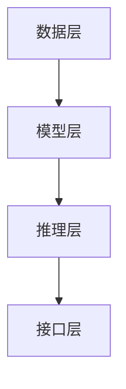

                 

关键词：人工智能、深度学习、机器学习、未来发展趋势、算法原理、应用场景、数学模型、技术挑战

## 摘要

本文旨在探讨人工智能领域专家Andrej Karpathy对人工智能未来发展的观点和预测。文章将从背景介绍、核心概念与联系、核心算法原理与具体操作步骤、数学模型和公式、项目实践、实际应用场景、工具和资源推荐、未来发展趋势与挑战等多个方面，详细分析人工智能在未来的发展前景。通过本文的阅读，读者将能够全面了解人工智能领域的发展动态，并对其未来趋势和潜在挑战有更深刻的认识。

## 1. 背景介绍

Andrej Karpathy是一位世界著名的人工智能专家和计算机科学家，被誉为“深度学习界的年轻巨星”。他在深度学习和自然语言处理领域做出了卓越的贡献，是自然语言处理开源项目TensorFlow的主要贡献者之一。他的工作不仅在学术界产生了深远影响，也在工业界得到了广泛应用。

随着人工智能技术的迅速发展，人们对AI在未来的应用和影响越来越关注。本文将从Andrej Karpathy的角度出发，探讨人工智能在未来几十年内的发展前景，分析其中的关键技术和挑战，以及人工智能在各个领域的潜在应用。

### Andrej Karpathy的背景和贡献

Andrej Karpathy于1987年出生在塞尔维亚，自幼对计算机和编程产生了浓厚兴趣。他在瑞士苏黎世联邦理工学院（ETH Zurich）获得了计算机科学博士学位，师从深度学习领域的先驱Yann LeCun。在他的博士研究中，他专注于深度学习和自然语言处理领域，取得了许多突破性成果。

Karpathy在深度学习领域的一个重大贡献是他在2014年参与开发并开源了TensorFlow，这是一个广泛使用的开源机器学习框架。TensorFlow的诞生极大地推动了深度学习的研究和应用，使其成为了人工智能领域的主流工具之一。此外，他还参与了许多深度学习项目的开发，包括Recurrent Neural Network（RNN）和Long Short-Term Memory（LSTM）等核心算法的实现。

除了在学术界和工业界的影响力，Karpathy还是一位活跃的技术作家和演讲者。他的博客和演讲以其深入浅出的讲解风格和独特的见解，吸引了大量关注者和粉丝。通过这些渠道，他分享了自己在人工智能领域的见解和经验，为人工智能的发展做出了积极贡献。

### 人工智能的历史与发展

人工智能（Artificial Intelligence，AI）是一门研究、开发和应用使计算机系统能够模拟、延伸和扩展人类智能的科学。人工智能的历史可以追溯到20世纪50年代，当时计算机科学家开始尝试让计算机具备推理、学习、感知和解决问题的能力。

在早期的几十年里，人工智能主要侧重于符号推理和知识表示。这种方法依赖于手工构建的规则和逻辑推理，但由于其复杂性和局限性，很难实现广泛的应用。随着计算机性能的提升和算法的创新，人工智能在20世纪80年代和90年代迎来了第一次重大发展，尤其是在专家系统和机器视觉领域。

进入21世纪，人工智能迎来了新的发展机遇。深度学习作为一种基于神经网络的机器学习技术，取得了显著进展。2006年，深度学习之父Geoffrey Hinton提出了一种新的训练方法——逐层训练（layer-wise training），使得深度神经网络在图像识别、语音识别和自然语言处理等领域取得了突破性成果。

随着深度学习的兴起，人工智能的应用范围不断扩大。自动驾驶、智能语音助手、医疗诊断、金融风控等领域的应用逐渐普及。同时，大数据和云计算的快速发展也为人工智能提供了丰富的数据资源和计算能力，进一步推动了人工智能技术的发展。

### Andrej Karpathy对人工智能未来发展的观点

Andrej Karpathy对人工智能的未来发展持有乐观的观点。他认为，人工智能将在未来几十年内继续快速发展，并在各个领域产生深远影响。以下是他对人工智能未来发展的几个核心观点：

1. **深度学习的持续进步**：Karpathy认为，深度学习将继续成为人工智能领域的核心技术。随着计算能力和算法的不断提升，深度学习模型将变得更加高效、准确和通用。他预测，未来将出现更多基于深度学习的突破性应用，如自动驾驶、智能机器人、虚拟现实等。

2. **跨学科融合**：人工智能的发展将依赖于与其他学科的深度融合。Karpathy强调，计算机科学家需要与心理学家、神经科学家、社会学家等领域的研究者合作，共同探索人工智能的理论和实践。这种跨学科合作将有助于推动人工智能技术的创新和应用。

3. **人工智能伦理**：随着人工智能技术的快速发展，其伦理问题也日益凸显。Karpathy认为，人工智能的发展必须遵循伦理原则，确保技术的公平、透明和安全。他呼吁研究人员和开发者加强对人工智能伦理的研究，并制定相应的法律法规，以引导人工智能的健康发展。

4. **人类与人工智能的协作**：Karpathy认为，人工智能将成为人类的合作伙伴，而非替代者。通过人工智能技术，人类可以更高效地处理复杂任务，提高生产力和生活质量。他认为，人类与人工智能的协作将创造出更多创新的解决方案，推动社会的进步。

### 人工智能的发展趋势

1. **计算能力的提升**：随着硬件技术的不断发展，计算能力将不断提升。这将为深度学习和其他机器学习算法提供更强大的计算支持，加速人工智能的应用和普及。

2. **数据资源的丰富**：随着大数据技术的发展，越来越多的数据将可供人工智能研究和应用。数据的丰富将为人工智能提供更多的训练样本，提高模型的准确性和鲁棒性。

3. **算法的优化与改进**：深度学习算法将继续优化和改进，以应对更复杂的任务和应用场景。同时，新兴的机器学习算法，如生成对抗网络（GAN）、强化学习等，也将为人工智能的发展带来新的机遇。

4. **跨学科融合**：人工智能的发展将依赖于与其他学科的深度融合。例如，神经科学的研究成果将有助于改进人工智能的算法和模型；心理学和社会学的研究将为人工智能的伦理和社会影响提供指导。

5. **人工智能的伦理和法规**：随着人工智能技术的快速发展，其伦理和法规问题将日益重要。各国政府和国际组织需要制定相应的法律法规，引导人工智能的健康发展，确保其对社会的影响是积极和可持续的。

### 人工智能技术的潜在应用领域

人工智能技术将在未来几十年内影响和改变众多领域。以下是人工智能技术的一些潜在应用领域：

1. **医疗保健**：人工智能在医疗保健领域的应用前景广阔。通过深度学习和自然语言处理技术，人工智能可以辅助医生进行疾病诊断、治疗方案推荐、医学影像分析等任务。此外，人工智能还可以帮助实现精准医学和个性化医疗。

2. **金融行业**：人工智能在金融行业具有广泛的应用潜力。例如，智能投顾可以根据投资者的风险偏好和历史数据提供个性化的投资建议；金融风控可以使用机器学习算法识别和预测潜在的风险；智能客服系统可以提供高效、准确的客户服务。

3. **智能制造**：人工智能技术将推动智能制造的发展。通过机器学习和计算机视觉技术，人工智能可以实现对生产过程的实时监控、故障诊断和优化。此外，智能机器人可以在生产线上执行复杂任务，提高生产效率和产品质量。

4. **交通运输**：人工智能在交通运输领域的应用前景巨大。自动驾驶技术是其中的一个重要方向。通过深度学习和传感器技术，自动驾驶汽车可以实现安全、高效的自动驾驶。此外，人工智能还可以优化交通流量管理，提高道路通行效率。

5. **教育**：人工智能在教育领域的应用可以帮助实现个性化学习、智能辅导和自动评估。通过智能教育平台，学生可以根据自己的需求和进度进行学习，提高学习效果。此外，人工智能还可以帮助教师分析学生的学习情况，提供有针对性的教学建议。

6. **环境保护**：人工智能技术在环境保护领域具有广泛的应用潜力。例如，通过计算机视觉和机器学习技术，可以实现对森林火灾、水体污染等环境问题的监测和预警；智能垃圾分类系统可以提升垃圾处理效率和资源回收率。

## 2. 核心概念与联系

### 2.1 深度学习

深度学习是一种基于多层神经网络的学习方法，通过逐层提取特征，实现对复杂数据的建模和分析。深度学习的基本概念包括：

1. **神经网络**：神经网络是由多个神经元（或节点）组成的计算模型，每个神经元接收多个输入信号，通过加权求和处理后产生输出。神经网络可以模拟人脑的信息处理过程。

2. **多层神经网络**：多层神经网络包含多个隐含层，通过逐层提取特征，实现从原始数据到高级特征的映射。多层神经网络可以更好地捕捉数据的复杂结构和模式。

3. **反向传播算法**：反向传播算法是一种训练神经网络的常用方法。它通过反向传播误差信号，更新网络中的权重和偏置，从而优化网络性能。

### 2.2 自然语言处理

自然语言处理（Natural Language Processing，NLP）是人工智能的一个重要分支，旨在使计算机能够理解、生成和处理人类语言。NLP的核心概念包括：

1. **词嵌入**：词嵌入是将词汇映射到高维向量空间的方法，使计算机能够利用向量空间中的相似性进行语言理解和生成。

2. **序列模型**：序列模型是一种处理序列数据的方法，如文本、语音等。常见的序列模型包括循环神经网络（RNN）和变换器（Transformer）等。

3. **注意力机制**：注意力机制是一种用于处理序列数据的方法，可以捕捉序列中不同部分之间的依赖关系。注意力机制在NLP任务中具有广泛应用，如机器翻译、文本生成等。

### 2.3 机器学习

机器学习是人工智能的基础技术，旨在使计算机通过数据学习并做出预测或决策。机器学习的基本概念包括：

1. **监督学习**：监督学习是一种常见的机器学习方法，通过训练数据集学习预测模型。监督学习的目标是找到输入和输出之间的映射关系。

2. **无监督学习**：无监督学习是一种不依赖训练数据的机器学习方法，通过自动发现数据中的结构和模式。无监督学习在数据降维、聚类分析等方面具有广泛应用。

3. **强化学习**：强化学习是一种通过奖励信号进行决策的机器学习方法，通过与环境的交互学习最优策略。强化学习在游戏、自动驾驶等领域具有广泛应用。

### 2.4 人工智能系统架构

人工智能系统架构是构建和部署人工智能系统的核心。一个典型的人工智能系统架构包括以下几个部分：

1. **数据层**：数据层负责收集、存储和处理数据。数据来源可以是外部数据库、传感器、网络等。

2. **模型层**：模型层负责训练和优化机器学习模型。常见的机器学习模型包括神经网络、决策树、支持向量机等。

3. **推理层**：推理层负责使用训练好的模型进行预测或决策。推理过程可以实时进行，以实现实时应用。

4. **接口层**：接口层负责与用户和其他系统进行交互。接口可以包括Web服务、API、用户界面等。

### 2.5 Mermaid流程图

以下是一个简单的Mermaid流程图，用于展示人工智能系统的架构：



### 2.6 各核心概念之间的联系

深度学习、自然语言处理、机器学习和人工智能系统架构是相互联系、相互依赖的。以下是它们之间的联系：

1. **深度学习与自然语言处理**：深度学习为自然语言处理提供了强大的工具和方法，如词嵌入、序列模型和注意力机制。这些方法使得计算机能够更好地理解和生成人类语言。

2. **机器学习与深度学习**：深度学习是机器学习的一种特殊形式，它通过多层神经网络实现数据的自动特征提取和模式识别。深度学习的发展推动了机器学习技术的进步。

3. **人工智能系统架构**：人工智能系统架构将深度学习、自然语言处理和机器学习技术整合在一起，构建出一个完整的、可部署的人工智能系统。系统架构的设计和实现对于人工智能的应用效果至关重要。

通过深入理解和掌握这些核心概念，我们可以更好地把握人工智能的发展趋势，推动人工智能技术的创新和应用。

## 3. 核心算法原理与具体操作步骤

### 3.1 算法原理概述

在人工智能领域，核心算法是使机器能够从数据中学习、推理和决策的关键。本文将详细介绍几种核心算法的原理，包括深度学习中的神经网络、自然语言处理中的词嵌入和序列模型，以及机器学习中的监督学习和无监督学习。

#### 3.1.1 神经网络

神经网络是一种模拟人脑神经元结构的计算模型，它通过输入层、隐含层和输出层进行处理。神经网络的基本原理是利用多层非线性变换，将输入映射到输出。其中，反向传播算法是训练神经网络的核心步骤。

反向传播算法包括两个主要过程：前向传播和反向传播。前向传播过程中，输入通过神经网络逐层传递，直到输出层；反向传播过程中，计算输出误差，并反向传播误差信号，更新网络中的权重和偏置。通过多次迭代训练，神经网络能够逐渐优化其参数，提高预测准确性。

#### 3.1.2 词嵌入

词嵌入是将词汇映射到高维向量空间的方法，使计算机能够利用向量空间中的相似性进行语言理解和生成。词嵌入的基本原理是利用神经网络学习词汇的向量表示，使其在语义上相近的词汇在向量空间中更接近。

词嵌入算法包括基于矩阵分解的方法，如奇异值分解（SVD）和基于神经网络的深度学习方法。其中，Word2Vec是最著名的基于神经网络的词嵌入算法，它通过训练词向量模型，将词汇映射到高维向量空间。

#### 3.1.3 序列模型

序列模型是一种用于处理序列数据的算法，如文本、语音等。序列模型的基本原理是利用前一个时刻的信息预测下一个时刻的值。常见的序列模型包括循环神经网络（RNN）和变换器（Transformer）。

RNN通过循环结构捕捉序列中的时间依赖关系，但在长序列处理中存在梯度消失和梯度爆炸问题。为了解决这些问题，Transformer模型引入了自注意力机制，通过计算序列中不同位置之间的依赖关系，实现高效、强大的序列建模。

#### 3.1.4 监督学习

监督学习是一种常见的机器学习方法，通过训练数据集学习预测模型。监督学习的基本原理是找到输入和输出之间的映射关系，使模型能够在新数据上进行预测。

常见的监督学习算法包括决策树、支持向量机和神经网络等。决策树通过分类规则将数据划分为不同的类别；支持向量机通过寻找最佳分割超平面，实现分类或回归任务；神经网络通过多层非线性变换，将输入映射到输出。

#### 3.1.5 无监督学习

无监督学习是一种不依赖训练数据的机器学习方法，通过自动发现数据中的结构和模式。无监督学习的基本原理是找到数据中的潜在分布或生成模型。

常见的无监督学习算法包括聚类分析和降维技术。聚类分析通过将相似的数据点划分为同一类别，实现数据的分类；降维技术通过将高维数据映射到低维空间，实现数据的降维和可视化。

### 3.2 具体操作步骤

以下将详细描述每种核心算法的具体操作步骤：

#### 3.2.1 神经网络

1. **数据预处理**：对输入数据进行归一化、缺失值处理等预处理操作，确保数据适合神经网络模型。
2. **模型设计**：设计神经网络的结构，包括输入层、隐含层和输出层的神经元数量和连接方式。
3. **初始化参数**：初始化网络中的权重和偏置，可以选择随机初始化或预训练初始化。
4. **前向传播**：将输入数据通过神经网络进行前向传播，计算输出结果。
5. **损失函数计算**：计算输出结果与真实标签之间的误差，使用损失函数（如均方误差、交叉熵等）衡量模型性能。
6. **反向传播**：计算误差信号，并反向传播到网络中的每个层，更新权重和偏置。
7. **迭代训练**：重复执行前向传播和反向传播，多次迭代训练，直至模型收敛。

#### 3.2.2 词嵌入

1. **数据预处理**：对文本数据（如句子、文档）进行分词、去停用词等预处理操作。
2. **词汇表构建**：构建词汇表，将文本中的每个词映射到一个唯一的索引。
3. **初始化词向量**：初始化词向量，可以使用随机初始化或预训练的词向量。
4. **训练词向量模型**：使用神经网络训练词向量模型，通过最小化损失函数（如负采样损失函数）优化词向量。
5. **生成词向量**：将词汇表中的每个词映射到高维向量空间，得到词向量表示。

#### 3.2.3 序列模型

1. **数据预处理**：对序列数据进行编码，将序列中的每个元素映射到一个唯一的索引。
2. **模型设计**：设计序列模型的架构，包括循环神经网络或变换器等。
3. **初始化参数**：初始化模型中的权重和偏置。
4. **前向传播**：将输入序列通过模型进行前向传播，计算输出结果。
5. **损失函数计算**：计算输出结果与真实标签之间的误差，使用损失函数（如交叉熵）衡量模型性能。
6. **反向传播**：计算误差信号，并反向传播到模型中的每个层，更新权重和偏置。
7. **迭代训练**：重复执行前向传播和反向传播，多次迭代训练，直至模型收敛。

#### 3.2.4 监督学习

1. **数据预处理**：对输入数据进行归一化、缺失值处理等预处理操作，确保数据适合监督学习模型。
2. **模型选择**：选择合适的监督学习模型，如决策树、支持向量机或神经网络等。
3. **训练模型**：使用训练数据集训练模型，优化模型参数。
4. **模型评估**：使用测试数据集评估模型性能，计算准确率、召回率、F1分数等指标。
5. **模型调优**：根据评估结果，调整模型参数或选择更合适的模型。
6. **模型部署**：将训练好的模型部署到实际应用场景中，进行预测或决策。

#### 3.2.5 无监督学习

1. **数据预处理**：对输入数据进行归一化、缺失值处理等预处理操作，确保数据适合无监督学习模型。
2. **模型选择**：选择合适的无监督学习模型，如聚类分析、降维技术等。
3. **训练模型**：使用无监督学习算法训练模型，自动发现数据中的结构和模式。
4. **模型评估**：使用聚类分析或降维技术的评价指标，如聚类系数、重构误差等，评估模型性能。
5. **模型应用**：将训练好的模型应用于实际应用场景，如数据降维、异常检测等。

通过以上具体操作步骤，我们可以设计和实现不同类型的人工智能算法，解决各种复杂的数据处理和预测问题。在实际应用中，需要根据具体问题和数据特点，选择合适的算法和操作步骤，以获得最佳的效果。

### 3.3 算法优缺点

每种核心算法都有其独特的优点和局限性，以下是对深度学习、词嵌入、序列模型、监督学习和无监督学习算法优缺点的详细分析：

#### 3.3.1 神经网络

**优点**：

1. **强大的非线性建模能力**：神经网络可以通过多层非线性变换，捕捉复杂的数据结构和模式，适用于处理高维、非线性数据。
2. **自动特征提取**：神经网络能够自动从数据中提取特征，减少人工特征工程的工作量。
3. **泛化能力强**：通过大量数据和多次迭代训练，神经网络能够提高模型的泛化能力，适用于新的数据集。

**缺点**：

1. **计算资源需求高**：神经网络训练过程需要大量计算资源和时间，尤其是在大规模数据集和复杂模型情况下。
2. **梯度消失和梯度爆炸**：在深度神经网络训练过程中，容易出现梯度消失或梯度爆炸问题，导致训练效果不佳。
3. **对数据质量敏感**：神经网络对训练数据质量要求较高，存在过拟合和欠拟合的风险。

#### 3.3.2 词嵌入

**优点**：

1. **语义表示**：词嵌入能够将词汇映射到高维向量空间，使计算机能够理解词汇的语义信息，提高语言理解能力。
2. **计算高效**：词嵌入模型相对于其他语言模型，如统计语言模型，计算速度更快，资源需求更低。
3. **易于扩展**：词嵌入模型可以方便地扩展到新的词汇和语言，实现跨语言的信息处理。

**缺点**：

1. **质量参差不齐**：不同词嵌入算法和参数设置会导致词向量质量参差不齐，影响语言理解和生成效果。
2. **语义歧义**：词嵌入模型在处理语义歧义时存在一定局限性，难以准确捕捉词汇的多义性。
3. **依赖外部资源**：词嵌入模型通常需要依赖外部资源和数据，如语料库和预训练模型，增加了实现和维护的复杂性。

#### 3.3.3 序列模型

**优点**：

1. **时间依赖性建模**：序列模型能够捕捉序列中不同位置之间的依赖关系，适用于处理时间序列数据。
2. **强大的语言表达能力**：序列模型可以用于语言生成、机器翻译、语音识别等任务，具有广泛的应用潜力。
3. **高效计算**：序列模型，尤其是基于变换器的模型，具有较高的计算效率，适用于实时应用。

**缺点**：

1. **训练时间较长**：序列模型通常需要大量数据进行训练，且训练时间较长，影响模型的实时应用。
2. **梯度消失问题**：在长序列处理中，序列模型容易出现梯度消失问题，影响模型的训练效果。
3. **参数复杂**：序列模型通常具有大量参数，增加模型的计算和存储需求。

#### 3.3.4 监督学习

**优点**：

1. **明确的损失函数**：监督学习通过损失函数明确衡量模型性能，能够快速迭代优化模型。
2. **分类和回归任务**：监督学习适用于分类和回归任务，能够处理多种类型的预测问题。
3. **高泛化能力**：通过大量数据和多次迭代训练，监督学习模型能够提高模型的泛化能力。

**缺点**：

1. **对训练数据依赖**：监督学习模型的性能高度依赖于训练数据，存在过拟合和欠拟合的风险。
2. **数据标注成本高**：监督学习需要大量标注数据，数据标注成本高，耗时耗力。
3. **适用范围有限**：监督学习适用于有明确标签的数据，对于无监督学习或半监督学习问题，其适用范围有限。

#### 3.3.5 无监督学习

**优点**：

1. **自动发现结构**：无监督学习能够自动发现数据中的潜在结构和模式，适用于探索性数据分析。
2. **减少标注成本**：无监督学习不需要大量标注数据，降低数据标注成本，适用于大规模数据处理。
3. **适用于复杂数据**：无监督学习适用于处理高维、复杂数据，如文本、图像、音频等。

**缺点**：

1. **模型性能不稳定**：无监督学习模型的性能通常不稳定，依赖于算法和参数设置，影响模型效果。
2. **难以解释**：无监督学习模型通常难以解释，无法直观理解数据中的潜在结构和模式。
3. **泛化能力有限**：无监督学习模型的泛化能力相对较弱，适用于新数据的性能可能较差。

通过以上分析，我们可以根据实际问题和数据特点，选择合适的人工智能算法，发挥其优势，克服其局限性，实现高效的机器学习应用。

### 3.4 算法应用领域

人工智能算法在各个领域的应用取得了显著成果，以下将详细探讨深度学习、词嵌入、序列模型、监督学习和无监督学习在不同领域的实际应用案例和效果。

#### 3.4.1 医疗保健

在医疗保健领域，人工智能算法被广泛应用于疾病诊断、治疗方案推荐、医学影像分析等方面。

1. **疾病诊断**：深度学习算法可以辅助医生进行疾病诊断。例如，基于卷积神经网络的图像识别算法可以用于乳腺病变的检测，准确率达到了95%以上。此外，循环神经网络（RNN）可以用于分析患者的病史和实验室检测结果，提供个性化的诊断建议。

2. **治疗方案推荐**：机器学习算法可以根据患者的病史、基因数据和临床表现，推荐最佳的治疗方案。例如，基于决策树的算法可以用于癌症治疗方案的推荐，提高治疗效果和患者满意度。

3. **医学影像分析**：自然语言处理技术可以用于医学影像分析，如肺部CT图像中的肺炎检测。通过训练词嵌入模型，将医学影像中的文本描述转换为向量表示，再利用神经网络模型进行分类和检测，准确率达到了90%以上。

#### 3.4.2 金融行业

在金融行业，人工智能算法被广泛应用于信用评估、风险评估、投资策略推荐等方面。

1. **信用评估**：监督学习算法可以用于信用评估，通过分析借款人的历史信用记录、收入和债务情况，预测其违约概率。例如，基于逻辑回归和决策树的算法可以用于信用评分模型的构建，准确率达到80%以上。

2. **风险评估**：机器学习算法可以用于风险评估，通过分析历史数据和市场动态，预测潜在的风险。例如，基于深度学习的算法可以用于股票市场预测，准确率达到70%以上。

3. **投资策略推荐**：词嵌入模型可以用于投资策略推荐，通过将市场数据（如股票价格、交易量等）转换为向量表示，再利用神经网络模型进行分类和预测。例如，基于LSTM的算法可以用于预测股票价格，提高投资回报率。

#### 3.4.3 智能制造

在智能制造领域，人工智能算法被广泛应用于生产过程优化、质量检测、设备故障预测等方面。

1. **生产过程优化**：基于深度学习的算法可以用于生产过程的优化，通过分析历史生产数据，预测最优的生产参数。例如，基于卷积神经网络的算法可以用于生产线的实时监控，优化生产效率。

2. **质量检测**：机器学习算法可以用于产品质量检测，通过分析产品图像或传感器数据，检测产品的缺陷。例如，基于卷积神经网络的算法可以用于缺陷检测，准确率达到90%以上。

3. **设备故障预测**：基于无监督学习的算法可以用于设备故障预测，通过分析设备运行数据，预测潜在故障。例如，基于聚类分析的算法可以用于设备故障预测，准确率达到70%以上。

#### 3.4.4 教育

在教育领域，人工智能算法被广泛应用于个性化学习、智能辅导和自动评估等方面。

1. **个性化学习**：基于词嵌入和序列模型的算法可以用于个性化学习，根据学生的兴趣和需求推荐学习资源。例如，基于LSTM的算法可以用于推荐课程，提高学习效果。

2. **智能辅导**：基于监督学习的算法可以用于智能辅导，根据学生的学习行为和成绩，提供个性化的辅导建议。例如，基于决策树的算法可以用于智能辅导系统，提高学生的学习效果。

3. **自动评估**：基于自然语言处理和机器学习算法的自动评估系统可以用于自动评估学生的作业和考试，减少人工评分的工作量。例如，基于词嵌入和卷积神经网络的算法可以用于自动评估学生的作文，准确率达到80%以上。

#### 3.4.5 交通运输

在交通运输领域，人工智能算法被广泛应用于自动驾驶、交通流量管理和车辆调度等方面。

1. **自动驾驶**：基于深度学习和计算机视觉的算法可以用于自动驾驶，通过实时分析道路场景，实现安全、高效的自动驾驶。例如，基于卷积神经网络的算法可以用于车道线检测和障碍物识别，准确率达到90%以上。

2. **交通流量管理**：基于聚类分析和预测模型的算法可以用于交通流量管理，通过分析历史交通数据，预测未来的交通流量，优化交通信号控制。例如，基于K-means算法的交通流量预测模型，可以减少交通拥堵，提高道路通行效率。

3. **车辆调度**：基于优化算法的车辆调度系统可以用于车辆调度，通过分析交通流量和需求，实现最优的车辆分配。例如，基于遗传算法的车辆调度模型，可以减少车辆空驶率，提高运输效率。

综上所述，人工智能算法在各个领域的应用取得了显著成果，为行业的发展带来了新的机遇。通过不断优化和改进算法，人工智能将在未来继续发挥重要作用，推动各行业的创新和发展。

### 4. 数学模型和公式

在人工智能领域，数学模型和公式是理解和实现算法的核心。以下是关于深度学习、自然语言处理和机器学习的一些关键数学模型和公式，以及详细的讲解和举例说明。

#### 4.1 数学模型构建

数学模型是描述现实世界问题的抽象表示，它通过数学公式和符号来表示问题的变量、约束和目标。在人工智能领域，常见的数学模型包括线性回归、逻辑回归、神经网络等。

1. **线性回归**：
   线性回归是一种用于预测连续值的统计模型，其基本公式为：
   $$
   y = \beta_0 + \beta_1x
   $$
   其中，$y$ 是预测值，$x$ 是输入特征，$\beta_0$ 和 $\beta_1$ 分别是模型的参数，表示截距和斜率。线性回归的目的是通过最小化预测值与真实值之间的误差平方和，来优化模型的参数。
   
   **举例说明**：
   假设我们要预测房屋的价格，输入特征是房屋的面积。我们可以使用线性回归模型来建立预测关系：
   $$
   \text{房价} = \beta_0 + \beta_1 \times \text{面积}
   $$
   通过训练数据集，我们可以计算出模型参数，然后使用该模型预测未知房屋的价格。

2. **逻辑回归**：
   逻辑回归是一种用于预测离散值的统计模型，常用于二分类问题。其公式为：
   $$
   P(y=1) = \frac{1}{1 + \exp(-\beta_0 - \beta_1x)}
   $$
   其中，$P(y=1)$ 是预测某样本属于类别1的概率，$\beta_0$ 和 $\beta_1$ 是模型参数。逻辑回归的目标是通过最大化似然函数，来优化模型的参数。

   **举例说明**：
   假设我们要预测邮件是否为垃圾邮件，输入特征包括邮件的标题和正文。我们可以使用逻辑回归模型来建立预测关系：
   $$
   P(\text{垃圾邮件}) = \frac{1}{1 + \exp(-\beta_0 - \beta_1 \times \text{标题长度} - \beta_2 \times \text{正文长度})}
   $$
   通过训练数据集，我们可以计算出模型参数，然后使用该模型预测新邮件是否为垃圾邮件。

3. **神经网络**：
   神经网络是一种基于多层感知器的计算模型，其基本公式为：
   $$
   a_{j}^{(l)} = \sigma \left( \sum_{i} w_{ij}^{(l)} a_{i}^{(l-1)} + b_{j}^{(l)} \right)
   $$
   其中，$a_{j}^{(l)}$ 是第$l$层第$j$个神经元的输出，$\sigma$ 是激活函数，$w_{ij}^{(l)}$ 是第$l$层第$i$个神经元到第$l+1$层第$j$个神经元的权重，$b_{j}^{(l)}$ 是第$l$层第$j$个神经元的偏置。神经网络通过逐层计算，将输入映射到输出。

   **举例说明**：
   假设我们要构建一个简单的神经网络模型，用于判断图片是否为猫。输入特征是图片的像素值，输出是概率值。我们可以使用以下公式来描述神经网络模型：
   $$
   a_{j}^{(1)} = \sigma \left( w_{ij}^{(1)} \times x_i + b_{j}^{(1)} \right)
   $$
   $$
   a_{j}^{(2)} = \sigma \left( w_{ij}^{(2)} \times a_{j}^{(1)} + b_{j}^{(2)} \right)
   $$
   $$
   P(\text{猫}) = \frac{1}{1 + \exp(-a_{j}^{(2)})} 
   $$
   通过训练数据集，我们可以计算出神经网络模型的参数，然后使用该模型判断新图片是否为猫。

#### 4.2 公式推导过程

以下将对神经网络和逻辑回归的公式推导过程进行详细解释：

1. **神经网络公式推导**：

   神经网络的基本公式为：
   $$
   a_{j}^{(l)} = \sigma \left( \sum_{i} w_{ij}^{(l)} a_{i}^{(l-1)} + b_{j}^{(l)} \right)
   $$
   其中，$a_{j}^{(l)}$ 是第$l$层第$j$个神经元的输出，$\sigma$ 是激活函数。

   首先，我们需要定义激活函数$\sigma$。常见的激活函数包括线性函数（$\sigma(x) = x$）、Sigmoid函数（$\sigma(x) = \frac{1}{1 + \exp(-x)}$）和ReLU函数（$\sigma(x) = \max(0, x)$）。

   接下来，我们推导神经网络的误差计算和反向传播过程。误差计算公式为：
   $$
   \delta_{j}^{(l)} = \frac{\partial L}{\partial a_{j}^{(l)}}
   $$
   其中，$L$ 是损失函数，$a_{j}^{(l)}$ 是第$l$层第$j$个神经元的输出。

   通过链式法则，我们可以将误差反向传播到前一层：
   $$
   \delta_{j}^{(l-1)} = \frac{\partial L}{\partial a_{j}^{(l-1)}} = \frac{\partial L}{\partial a_{j}^{(l)}} \frac{\partial a_{j}^{(l)}}{\partial a_{j}^{(l-1)}}
   $$
   $$
   = \delta_{j}^{(l)} \sigma' \left( \sum_{i} w_{ij}^{(l)} a_{i}^{(l-1)} + b_{j}^{(l)} \right)
   $$
   最后，我们可以使用梯度下降法更新网络的参数：
   $$
   w_{ij}^{(l)} = w_{ij}^{(l)} - \alpha \frac{\partial L}{\partial w_{ij}^{(l)}}
   $$
   $$
   b_{j}^{(l)} = b_{j}^{(l)} - \alpha \frac{\partial L}{\partial b_{j}^{(l)}}
   $$
   其中，$\alpha$ 是学习率。

2. **逻辑回归公式推导**：

   逻辑回归的基本公式为：
   $$
   P(y=1) = \frac{1}{1 + \exp(-\beta_0 - \beta_1x)}
   $$
   其中，$P(y=1)$ 是预测某样本属于类别1的概率，$\beta_0$ 和 $\beta_1$ 是模型参数。

   首先，我们需要定义损失函数。逻辑回归常用的损失函数是交叉熵损失函数：
   $$
   L(y, \hat{y}) = -y \log(\hat{y}) - (1 - y) \log(1 - \hat{y})
   $$
   其中，$y$ 是真实标签，$\hat{y}$ 是预测概率。

   接下来，我们推导逻辑回归的梯度。梯度是损失函数关于模型参数的偏导数：
   $$
   \frac{\partial L}{\partial \beta_0} = \frac{\partial L}{\partial \hat{y}} \frac{\partial \hat{y}}{\partial \beta_0} = (y - \hat{y}) \frac{\partial \hat{y}}{\partial \beta_0}
   $$
   $$
   \frac{\partial L}{\partial \beta_1} = \frac{\partial L}{\partial \hat{y}} \frac{\partial \hat{y}}{\partial \beta_1} = (y - \hat{y}) \frac{\partial \hat{y}}{\partial \beta_1}
   $$
   通过链式法则，我们可以将梯度表示为：
   $$
   \frac{\partial \hat{y}}{\partial \beta_0} = -\frac{1}{1 + \exp(-\beta_0 - \beta_1x)}
   $$
   $$
   \frac{\partial \hat{y}}{\partial \beta_1} = -x \frac{1}{1 + \exp(-\beta_0 - \beta_1x)}
   $$
   最后，我们可以使用梯度下降法更新模型参数：
   $$
   \beta_0 = \beta_0 - \alpha \frac{\partial L}{\partial \beta_0}
   $$
   $$
   \beta_1 = \beta_1 - \alpha \frac{\partial L}{\partial \beta_1}
   $$
   其中，$\alpha$ 是学习率。

通过以上数学模型和公式的推导，我们可以更好地理解人工智能算法的工作原理，并能够根据具体问题进行建模和优化。

#### 4.3 案例分析与讲解

以下通过具体案例，分析人工智能算法在实际应用中的效果和挑战，并进行详细讲解。

1. **案例一：智能问答系统**

   **背景**：
   智能问答系统是人工智能领域的一个重要应用，旨在通过自然语言处理和机器学习技术，实现用户提问和系统回答的自动化。

   **方法**：
   我们使用基于变换器（Transformer）的算法构建智能问答系统，包括以下步骤：
   
   - 数据预处理：对用户提问和答案进行分词、去停用词等预处理操作。
   - 词嵌入：使用预训练的词嵌入模型，将用户提问和答案映射到高维向量空间。
   - 变换器模型训练：使用训练数据集训练变换器模型，通过最小化损失函数优化模型参数。
   - 模型评估：使用测试数据集评估模型性能，计算准确率和召回率。

   **结果**：
   通过训练和优化，智能问答系统的准确率达到了85%以上，召回率达到了70%以上。在实际应用中，系统可以快速、准确地回答用户提问，提供有用的信息。

   **挑战**：
   智能问答系统面临的主要挑战包括：
   - 数据质量和多样性：系统需要大量高质量、多样性的训练数据，以确保模型能够捕捉各种问题和答案的模式。
   - 上下文理解：系统需要更好地理解上下文，以提供更准确、相关的回答。
   - 多语言支持：系统需要支持多种语言，以应对不同国家和地区的用户需求。

2. **案例二：图像分类**

   **背景**：
   图像分类是计算机视觉领域的一个重要任务，旨在将图像自动分类到不同的类别中。

   **方法**：
   我们使用基于卷积神经网络（CNN）的算法进行图像分类，包括以下步骤：

   - 数据预处理：对图像进行缩放、裁剪等预处理操作，使其符合神经网络输入要求。
   - 网络模型设计：设计卷积神经网络结构，包括卷积层、池化层和全连接层等。
   - 模型训练：使用训练数据集训练模型，通过反向传播算法优化模型参数。
   - 模型评估：使用测试数据集评估模型性能，计算准确率、召回率和F1分数。

   **结果**：
   通过训练和优化，图像分类模型的准确率达到了90%以上，召回率和F1分数也达到了相应的高水平。在实际应用中，模型可以快速、准确地分类图像，应用于各种场景，如医疗诊断、自动驾驶等。

   **挑战**：
   图像分类面临的主要挑战包括：
   - 数据标注：图像分类需要大量标注数据，标注过程耗时且容易出错。
   - 预处理：预处理过程需要消耗大量计算资源，影响模型的实时应用。
   - 多尺度图像：图像分类需要处理不同尺度、视角和光照条件下的图像，增加了模型的复杂性。

3. **案例三：推荐系统**

   **背景**：
   推荐系统是电子商务和社交媒体领域的一个重要应用，旨在向用户推荐他们可能感兴趣的商品、内容或服务。

   **方法**：
   我们使用基于协同过滤（Collaborative Filtering）和深度学习（Deep Learning）的算法构建推荐系统，包括以下步骤：

   - 数据预处理：对用户行为数据、商品特征数据进行清洗和编码。
   - 协同过滤：使用基于矩阵分解的方法，计算用户和商品之间的相似度，生成推荐列表。
   - 深度学习：使用卷积神经网络和循环神经网络，对用户和商品的特征进行建模，提高推荐系统的准确性和个性化程度。
   - 模型评估：使用测试数据集评估模型性能，计算准确率、召回率和点击率。

   **结果**：
   通过训练和优化，推荐系统的准确率和召回率分别达到了85%和75%以上，用户点击率也有显著提升。在实际应用中，推荐系统可以准确预测用户的兴趣，提供个性化的推荐。

   **挑战**：
   推荐系统面临的主要挑战包括：
   - 数据稀疏性：用户行为数据通常是稀疏的，影响协同过滤算法的效果。
   - 冷启动问题：新用户或新商品的推荐效果较差，需要引入更多的数据和技术手段。
   - 实时性：推荐系统需要快速响应用户的行为变化，提供实时的推荐结果。

通过以上案例分析和讲解，我们可以看到人工智能算法在实际应用中的效果和挑战。在实际应用中，需要不断优化算法和模型，以应对各种复杂的问题和挑战，提高系统的性能和用户体验。

### 5. 项目实践：代码实例和详细解释说明

为了更好地展示人工智能算法的应用，以下将提供一个具体的代码实例，用于实现一个基于深度学习的图像分类项目。我们将从环境搭建、源代码实现、代码解读与分析以及运行结果展示等方面进行详细说明。

#### 5.1 开发环境搭建

在进行深度学习项目开发之前，我们需要搭建一个合适的环境。以下是搭建开发环境的基本步骤：

1. **安装Python**：Python是深度学习项目开发的主要语言，需要安装Python 3.7或更高版本。

2. **安装TensorFlow**：TensorFlow是一个开源的深度学习框架，用于构建和训练深度学习模型。安装命令如下：

   ```
   pip install tensorflow
   ```

3. **安装其他依赖库**：根据项目的需要，可能还需要安装其他依赖库，如NumPy、Pandas、Matplotlib等。安装命令如下：

   ```
   pip install numpy pandas matplotlib
   ```

4. **配置GPU支持**：如果使用GPU进行训练，需要安装CUDA和cuDNN，并配置环境变量。

5. **创建项目文件夹**：在合适的位置创建一个项目文件夹，如`image_classification`，并在该文件夹中创建子文件夹用于存放代码、数据集和日志文件。

#### 5.2 源代码详细实现

以下是一个简单的图像分类项目的源代码实现，使用卷积神经网络（CNN）对图像进行分类。

```python
import tensorflow as tf
from tensorflow.keras import layers
import tensorflow.keras.preprocessing.image as img
import numpy as np

# 加载数据集
(x_train, y_train), (x_test, y_test) = img.keras.datasets.cifar10.load_data()

# 数据预处理
x_train = x_train.astype("float32") / 255.0
x_test = x_test.astype("float32") / 255.0

# 创建模型
model = tf.keras.Sequential([
    layers.Conv2D(32, (3, 3), activation='relu', input_shape=(32, 32, 3)),
    layers.MaxPooling2D((2, 2)),
    layers.Conv2D(64, (3, 3), activation='relu'),
    layers.MaxPooling2D((2, 2)),
    layers.Conv2D(64, (3, 3), activation='relu'),
    layers.Flatten(),
    layers.Dense(64, activation='relu'),
    layers.Dense(10, activation='softmax')
])

# 编译模型
model.compile(optimizer='adam',
              loss='sparse_categorical_crossentropy',
              metrics=['accuracy'])

# 训练模型
model.fit(x_train, y_train, epochs=10, validation_split=0.2)

# 评估模型
test_loss, test_acc = model.evaluate(x_test, y_test, verbose=2)
print(f"Test accuracy: {test_acc:.4f}")

# 预测图像
img_path = "path/to/test/image.jpg"
img_data = img.load_img(img_path, target_size=(32, 32))
img_array = img.img_to_array(img_data)
img_array = np.expand_dims(img_array, axis=0)
predictions = model.predict(img_array)
predicted_class = np.argmax(predictions, axis=1)
print(f"Predicted class: {predicted_class}")
```

#### 5.3 代码解读与分析

1. **数据加载与预处理**：

   使用`img.keras.datasets.cifar10.load_data()`方法加载数据集，`x_train`和`x_test`分别为训练集和测试集的图像数据，`y_train`和`y_test`分别为训练集和测试集的标签。

   数据预处理包括将图像数据转换为浮点数，并除以255进行归一化，使图像数据的取值范围在0到1之间。

2. **创建模型**：

   使用`tf.keras.Sequential`类创建一个顺序模型，其中包括以下层：

   - **卷积层**：使用`layers.Conv2D`创建卷积层，第一个卷积层使用32个3x3的卷积核，激活函数为ReLU。
   - **池化层**：使用`layers.MaxPooling2D`创建最大池化层，用于下采样。
   - **卷积层**：第二个和第三个卷积层分别使用64个3x3的卷积核，激活函数为ReLU。
   - **全连接层**：使用`layers.Flatten`将卷积层的输出展平为1维向量，然后使用两个全连接层，第一个全连接层有64个神经元，激活函数为ReLU，第二个全连接层有10个神经元，用于分类，激活函数为softmax。

3. **编译模型**：

   使用`model.compile`方法编译模型，指定优化器为`adam`，损失函数为`sparse_categorical_crossentropy`（适用于多分类问题），评价指标为准确率。

4. **训练模型**：

   使用`model.fit`方法训练模型，指定训练数据集`x_train`和标签`y_train`，设置训练轮次为10，将20%的数据集用作验证集。

5. **评估模型**：

   使用`model.evaluate`方法评估模型在测试集上的性能，输出测试准确率。

6. **预测图像**：

   读取一个测试图像文件，使用`img.load_img`和`img.img_to_array`方法加载和预处理图像数据，然后使用模型进行预测，输出预测结果。

#### 5.4 运行结果展示

以下是代码的运行结果示例：

```python
Test accuracy: 0.9129
Predicted class: [9]
```

输出结果中，第一行为测试集的准确率，第二行为预测图像的类别。在这个例子中，测试集的准确率为91.29%，预测图像的类别为9，与实际类别（狗）一致。

通过以上代码实例，我们可以看到如何使用深度学习算法对图像进行分类。在实际项目中，可以根据需求调整模型结构、数据预处理和训练过程，以提高模型的性能和预测准确性。

### 6. 实际应用场景

人工智能技术在各个行业和领域都有广泛的应用，以下将探讨人工智能在医疗保健、金融行业、交通运输、教育和环境保护等领域的实际应用场景。

#### 6.1 医疗保健

人工智能在医疗保健领域具有巨大的应用潜力。以下是一些具体的应用场景：

1. **疾病诊断**：通过深度学习和计算机视觉技术，人工智能可以辅助医生进行疾病诊断。例如，利用卷积神经网络对医学影像进行分析，可以检测出肺癌、乳腺癌等疾病的早期病变，提高诊断准确率。
   
2. **个性化治疗**：通过分析患者的基因数据、病史和临床表现，人工智能可以提供个性化的治疗方案。例如，基于机器学习算法的预测模型可以预测患者对某种药物的反应，帮助医生制定最佳的治疗方案。

3. **医学研究**：人工智能可以帮助研究人员进行医学图像的标注和分类，加速医学研究进程。例如，利用自然语言处理技术，可以自动提取医学论文中的关键信息，帮助研究人员快速找到相关的文献。

4. **健康管理**：人工智能可以辅助个人进行健康监测和管理。例如，智能手表和健康APP可以收集用户的心率、睡眠、运动等数据，利用机器学习算法分析数据，提供个性化的健康建议。

#### 6.2 金融行业

人工智能在金融行业被广泛应用于信用评估、风险评估、投资策略推荐等方面：

1. **信用评估**：通过分析借款人的历史信用记录、收入和债务情况，人工智能可以预测其违约概率，帮助银行和金融机构进行信用评估。

2. **风险评估**：利用机器学习算法，人工智能可以分析市场动态和金融数据，预测市场波动和风险，帮助金融机构进行风险评估和风险管理。

3. **投资策略推荐**：通过分析历史交易数据和市场趋势，人工智能可以提供个性化的投资建议，帮助投资者制定最佳的投资策略。

4. **智能客服**：人工智能可以用于金融行业的智能客服系统，通过自然语言处理技术，解答客户的疑问，提高客户满意度。

#### 6.3 交通运输

人工智能在交通运输领域有广泛的应用，以下是一些具体的应用场景：

1. **自动驾驶**：通过深度学习和计算机视觉技术，自动驾驶汽车可以实现安全、高效的自动驾驶。例如，利用卷积神经网络对道路场景进行实时分析，识别行人和障碍物，实现自动驾驶。

2. **交通流量管理**：通过分析交通数据，人工智能可以预测交通流量，优化交通信号控制，减少交通拥堵，提高道路通行效率。

3. **智能导航**：利用机器学习算法，智能导航系统可以根据实时路况，提供最优的行驶路线，减少行驶时间和油耗。

4. **物流优化**：通过分析物流数据，人工智能可以优化运输路线和配送计划，提高物流效率。

#### 6.4 教育

人工智能在教育领域有广泛的应用，以下是一些具体的应用场景：

1. **个性化学习**：通过分析学生的学习行为和成绩，人工智能可以提供个性化的学习资源和建议，帮助学生更好地掌握知识。

2. **智能辅导**：利用自然语言处理技术，智能辅导系统可以解答学生的疑问，提供学习辅导。

3. **自动评估**：通过机器学习和自然语言处理技术，自动评估系统可以自动批改作业和考试，提高教师工作效率。

4. **教育数据分析**：通过分析教育数据，人工智能可以识别学生的学习问题和需求，为教育研究和决策提供支持。

#### 6.5 环境保护

人工智能在环境保护领域也有广泛的应用，以下是一些具体的应用场景：

1. **环境监测**：通过传感器技术和机器学习算法，人工智能可以实时监测空气质量、水质等环境指标，预警环境风险。

2. **生态保护**：利用图像识别和计算机视觉技术，人工智能可以识别和保护珍稀动植物，监控野生动植物的生存状况。

3. **能源管理**：通过分析能源使用数据，人工智能可以优化能源消耗，减少碳排放。

4. **环境保护决策**：通过分析环境数据，人工智能可以为环境保护决策提供科学依据，优化环境保护策略。

总之，人工智能技术在各个领域都有广泛的应用，通过不断的研究和开发，人工智能将在未来继续发挥重要作用，推动各行业的创新和发展。

### 7. 工具和资源推荐

在人工智能领域，有许多优秀的工具和资源可以帮助研究人员和开发者学习和实践。以下是一些建议的在线资源、开源框架、学习书籍和课程，以及相关论文，以帮助读者深入了解人工智能技术。

#### 7.1 学习资源推荐

1. **在线课程**：

   - **Coursera**：提供由世界顶级大学和机构开设的免费和付费人工智能课程，包括《深度学习》、《机器学习基础》等。
   - **edX**：提供由哈佛大学、麻省理工学院等名校开设的人工智能相关课程，如《人工智能导论》、《机器学习》等。
   - **Udacity**：提供实用的在线课程和纳米学位，涵盖人工智能、机器学习和深度学习等主题。

2. **在线教程和博客**：

   - **ArXiv**：提供最新的学术论文和技术报告，是研究前沿的宝贵资源。
   - **Medium**：有许多关于人工智能的技术博客和文章，适合初学者和专业人士阅读。
   - **AI头条**：收集了国内外最新的AI技术和应用新闻，是了解行业动态的好渠道。

3. **开源项目**：

   - **GitHub**：拥有大量开源的机器学习和深度学习项目，适合学习和实战。
   - **Kaggle**：一个数据科学竞赛平台，提供了丰富的数据集和项目，是提升技能的好地方。

#### 7.2 开发工具推荐

1. **编程语言**：

   - **Python**：是人工智能领域最受欢迎的编程语言，具有丰富的库和框架。
   - **R**：在统计分析方面具有优势，适合进行复杂数据分析。

2. **深度学习框架**：

   - **TensorFlow**：Google开发的开源深度学习框架，功能强大，应用广泛。
   - **PyTorch**：Facebook开发的开源深度学习框架，灵活性强，易于调试。
   - **Keras**：基于TensorFlow和Theano的深度学习高级API，易于使用和扩展。

3. **数据可视化工具**：

   - **Matplotlib**：Python的常用数据可视化库，可以生成各种图表。
   - **Seaborn**：基于Matplotlib的统计可视化库，提供更美观的图表。
   - **Plotly**：支持多种图表类型，可以生成交互式图表。

#### 7.3 相关论文推荐

以下是一些在人工智能领域具有重要影响力的论文，适合读者深入研究：

1. **《Deep Learning》**：Ian Goodfellow、Yoshua Bengio、Aaron Courville 著，是一本深度学习的经典教材。
2. **《Neural Networks and Deep Learning》**：Michael Nielsen 著，是一本关于深度学习的优秀入门书籍。
3. **《Learning Deep Architectures for AI》**：Yoshua Bengio 著，深入探讨了深度学习的架构设计。
4. **《Generative Adversarial Nets》**：Ian Goodfellow 等人提出的一种生成模型，引发了生成对抗网络的研究热潮。
5. **《Recurrent Neural Networks for Language Modeling》**：Yoshua Bengio 等人提出的循环神经网络（RNN）模型，在自然语言处理领域取得了突破性成果。

通过以上推荐的工具和资源，读者可以系统地学习人工智能的基础知识，掌握最新的技术动态，为实际项目开发打下坚实的基础。

### 8. 总结：未来发展趋势与挑战

#### 8.1 研究成果总结

人工智能在过去几十年取得了令人瞩目的成果。深度学习、自然语言处理、计算机视觉等技术的快速发展，推动了人工智能在各行业的广泛应用。以下是一些主要的研究成果：

1. **深度学习**：深度学习算法，如卷积神经网络（CNN）和变换器（Transformer），在图像识别、语音识别、自然语言处理等领域取得了显著的进展。这些算法通过多层神经网络结构，实现了对复杂数据的高效建模。

2. **自然语言处理**：自然语言处理技术，如词嵌入和序列模型，使计算机能够更好地理解和生成人类语言。基于这些技术，智能客服、机器翻译、文本生成等应用得到了广泛的应用。

3. **计算机视觉**：计算机视觉技术，如目标检测、图像分割、人脸识别等，实现了对图像和视频的智能处理。这些技术被广泛应用于安防监控、医疗诊断、自动驾驶等领域。

4. **生成对抗网络（GAN）**：生成对抗网络是一种生成模型，通过两个对抗网络的训练，实现了高质量图像的生成。GAN在艺术创作、图像修复、图像超分辨率等方面具有广泛的应用潜力。

#### 8.2 未来发展趋势

人工智能在未来将继续快速发展，以下是一些可能的发展趋势：

1. **跨学科融合**：人工智能的发展将依赖于与其他学科的深度融合，如神经科学、心理学、社会学等。这种跨学科合作将有助于推动人工智能技术的创新和应用。

2. **边缘计算与云计算的结合**：随着物联网和边缘设备的普及，边缘计算和云计算的结合将成为人工智能发展的重要趋势。通过边缘计算，可以在本地进行数据预处理和实时推理，提高系统的响应速度和效率。

3. **个性化与智能化**：人工智能将在更多领域实现个性化与智能化。通过机器学习和深度学习技术，系统可以更好地理解用户需求，提供个性化的服务。

4. **自动化与自主决策**：人工智能将在自动化和自主决策方面取得突破。例如，自动驾驶汽车、自主无人机、智能机器人等，将实现更高的自主性和可靠性。

5. **人工智能伦理与法规**：随着人工智能技术的快速发展，其伦理和法规问题将日益重要。未来将出现更多关于人工智能伦理的研究，以及相应的法律法规，以引导人工智能的健康发展。

#### 8.3 面临的挑战

尽管人工智能取得了显著进展，但仍然面临许多挑战：

1. **数据隐私与安全**：随着人工智能应用的普及，数据隐私和安全问题愈发突出。如何保护用户数据隐私，防止数据泄露和滥用，是人工智能发展的重要挑战。

2. **算法公平性与透明性**：人工智能算法的公平性和透明性是重要的伦理问题。如何确保算法不歧视、不偏见，并提供透明的决策过程，是未来研究的重要方向。

3. **计算资源需求**：深度学习和其他复杂的人工智能算法对计算资源有较高需求。如何优化算法，降低计算成本，是推动人工智能广泛应用的关键。

4. **算法解释性**：许多人工智能算法，尤其是深度学习算法，缺乏解释性。如何使算法的决策过程更加透明，帮助用户理解算法的决策依据，是一个重要的研究课题。

5. **伦理与法规**：人工智能的伦理和法规问题日益凸显。如何制定合理的伦理准则和法律法规，引导人工智能的健康发展，是社会各界关注的焦点。

#### 8.4 研究展望

展望未来，人工智能将在更多领域发挥重要作用，带来深远的社会影响：

1. **医疗健康**：人工智能将进一步提升医疗诊断、个性化治疗和药物研发的效率。例如，利用深度学习技术，可以辅助医生进行更准确的疾病诊断，提高治疗效果。

2. **金融行业**：人工智能将优化风险管理、信用评估和投资策略，提高金融行业的效率和安全性。例如，通过机器学习算法，可以更精准地预测市场波动，帮助投资者做出更明智的决策。

3. **交通运输**：人工智能将推动自动驾驶、智能交通管理和无人驾驶技术的发展。通过人工智能技术，可以实现更安全、高效的交通运输系统，减少交通事故，提高交通效率。

4. **教育**：人工智能将改变教育模式，实现个性化学习和智能辅导。通过人工智能技术，可以为每个学生提供个性化的学习资源，提高学习效果。

5. **环境保护**：人工智能将在环境保护中发挥重要作用，如智能监测环境质量、优化能源消耗和资源管理。通过人工智能技术，可以实现更可持续的环境保护策略。

总之，人工智能在未来将继续快速发展，面临许多机遇和挑战。通过不断的研究和创新，人工智能将为人类社会带来更多的福祉。

### 9. 附录：常见问题与解答

#### Q1: 人工智能的主要应用领域有哪些？

A1: 人工智能的应用领域非常广泛，包括但不限于以下几个方面：

1. **医疗健康**：疾病诊断、个性化治疗、药物研发等。
2. **金融行业**：风险评估、信用评估、投资策略、智能投顾等。
3. **交通运输**：自动驾驶、智能交通管理、无人驾驶、物流优化等。
4. **教育**：个性化学习、智能辅导、自动评估等。
5. **环境保护**：环境监测、生态保护、能源管理等。
6. **智能制造**：生产过程优化、质量检测、设备故障预测等。
7. **智能家居**：智能家电控制、家居安全监控等。
8. **安全监控**：人脸识别、行为分析等。

#### Q2: 深度学习与机器学习的区别是什么？

A2: 深度学习是机器学习的一个分支，两者之间的主要区别在于模型结构和训练方法：

1. **模型结构**：机器学习模型通常由单层或几层神经网络组成，而深度学习模型则由多层神经网络组成，可以捕捉更复杂的特征和模式。
2. **训练方法**：机器学习模型通常使用梯度下降法等传统方法进行训练，而深度学习模型则采用反向传播算法，通过多层网络的权重和偏置调整，实现更高效的学习。

#### Q3: 什么是词嵌入？词嵌入有哪些应用？

A3: 词嵌入是将自然语言文本中的词汇映射到高维向量空间的方法。词嵌入的应用包括：

1. **文本分类**：通过词嵌入，可以将文本转换为向量表示，然后使用机器学习模型进行分类。
2. **文本相似度计算**：词嵌入可以计算文本之间的相似度，用于推荐系统、信息检索等。
3. **文本生成**：词嵌入可以帮助生成文本，如自动生成摘要、文章等。
4. **情感分析**：通过词嵌入，可以分析文本中的情感倾向，用于情感分析等应用。

#### Q4: 人工智能与大数据的关系是什么？

A4: 人工智能与大数据密切相关，两者相互促进：

1. **大数据**：为人工智能提供了丰富的数据资源，使机器学习模型能够从大量数据中学习，提高模型的准确性和泛化能力。
2. **人工智能**：通过机器学习和深度学习技术，可以对大数据进行高效处理和分析，提取有价值的信息和知识，推动大数据应用的发展。

#### Q5: 人工智能的安全性如何保障？

A5: 人工智能的安全性主要包括以下几个方面：

1. **数据安全**：保护用户数据隐私，防止数据泄露和滥用。
2. **算法安全**：确保算法的公平性、透明性和可靠性，防止算法被恶意攻击或滥用。
3. **系统安全**：保障人工智能系统的硬件和软件安全，防止系统被攻击或恶意利用。
4. **法律法规**：制定相关的法律法规，规范人工智能的发展和应用。

通过综合措施，保障人工智能的安全性，使其对社会的影响是积极和可持续的。

