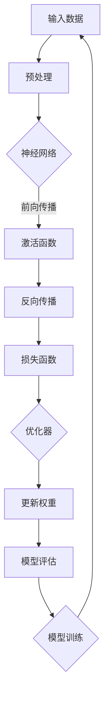
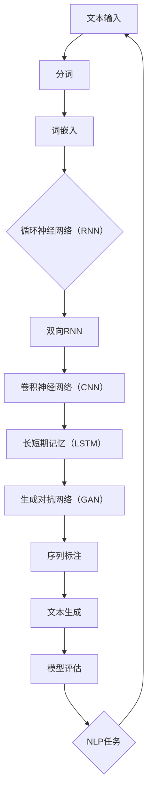

                 

关键词：人工智能，未来趋势，技术挑战，深度学习，软件开发，计算机视觉，自然语言处理，算法优化，可持续发展。

> 摘要：本文将探讨人工智能领域未来发展的主要挑战。通过分析当前的研究进展和实际应用，我们将探讨人工智能在深度学习、计算机视觉和自然语言处理等领域的瓶颈，并提出可能的解决方案。此外，文章还将讨论人工智能在伦理、可持续发展和未来职业影响等方面的挑战，以及如何应对这些问题。

## 1. 背景介绍

### 1.1 人工智能的起源与发展

人工智能（Artificial Intelligence, AI）是计算机科学的一个分支，旨在通过模拟人类智能来创建智能系统。自20世纪50年代以来，人工智能经历了多个发展阶段。从早期的规则基方法到现代的深度学习，人工智能技术取得了显著的进步。

### 1.2 深度学习的崛起

深度学习（Deep Learning）是人工智能的一个重要分支，通过神经网络模型对大量数据进行分析和学习。深度学习在计算机视觉、自然语言处理和语音识别等领域取得了突破性的成果，推动了人工智能的快速发展。

### 1.3 当前研究热点

随着深度学习的崛起，人工智能领域的研究热点主要集中在以下几个方面：

- **计算机视觉**：包括图像识别、目标检测、人脸识别等任务。
- **自然语言处理**：包括机器翻译、文本生成、情感分析等任务。
- **语音识别**：包括语音识别、语音合成等任务。
- **强化学习**：通过与环境互动学习策略，应用于游戏、机器人控制等领域。

## 2. 核心概念与联系

### 2.1 深度学习框架

为了更好地理解深度学习，我们可以使用以下Mermaid流程图来展示其核心概念和架构：



### 2.2 自然语言处理框架

自然语言处理（Natural Language Processing, NLP）是人工智能领域的一个重要分支，其核心概念和架构如下：



## 3. 核心算法原理 & 具体操作步骤

### 3.1 算法原理概述

在深度学习和自然语言处理领域，核心算法主要包括神经网络、卷积神经网络、循环神经网络和生成对抗网络等。

### 3.2 算法步骤详解

#### 3.2.1 神经网络

神经网络由多个神经元（节点）组成，每个神经元通过加权连接与其他神经元相连。输入数据经过前向传播，通过激活函数产生输出，然后通过反向传播更新权重。

#### 3.2.2 卷积神经网络

卷积神经网络（Convolutional Neural Network, CNN）是一种用于处理图像数据的神经网络。其核心是卷积层，通过卷积运算提取图像特征。

#### 3.2.3 循环神经网络

循环神经网络（Recurrent Neural Network, RNN）是一种用于处理序列数据的神经网络。其核心是循环结构，可以处理长短时依赖关系。

#### 3.2.4 生成对抗网络

生成对抗网络（Generative Adversarial Network, GAN）由生成器和判别器组成，通过对抗训练生成逼真的数据。

### 3.3 算法优缺点

每种算法都有其优缺点。例如，神经网络具有良好的泛化能力，但计算复杂度高；卷积神经网络在图像处理领域表现优异，但在处理文本数据时效果有限。

### 3.4 算法应用领域

深度学习和自然语言处理算法在计算机视觉、自然语言处理、语音识别等领域得到了广泛应用，推动了人工智能技术的发展。

## 4. 数学模型和公式 & 详细讲解 & 举例说明

### 4.1 数学模型构建

神经网络中的数学模型主要包括输入层、隐藏层和输出层。输入层将数据输入到网络中，隐藏层通过非线性变换提取特征，输出层产生最终输出。

### 4.2 公式推导过程

以下是一个简单的神经网络模型，其中输入层有n个神经元，隐藏层有m个神经元，输出层有k个神经元。

- 输入层到隐藏层的激活函数：

$$
a_{ij}^{(1)} = \sigma(w_{ij}^{(1)} \cdot x_j + b_{i}^{(1)})
$$

其中，$a_{ij}^{(1)}$ 表示隐藏层第i个神经元的激活值，$x_j$ 表示输入层第j个神经元的输入值，$w_{ij}^{(1)}$ 表示输入层到隐藏层的权重，$b_{i}^{(1)}$ 表示隐藏层第i个神经元的偏置。

- 隐藏层到输出层的激活函数：

$$
a_{ik}^{(2)} = \sigma(w_{ik}^{(2)} \cdot a_{ij}^{(1)} + b_{k}^{(2)})
$$

其中，$a_{ik}^{(2)}$ 表示输出层第k个神经元的激活值，$a_{ij}^{(1)}$ 表示隐藏层第i个神经元的激活值，$w_{ik}^{(2)}$ 表示隐藏层到输出层的权重，$b_{k}^{(2)}$ 表示输出层第k个神经元的偏置。

### 4.3 案例分析与讲解

假设我们有一个二分类问题，需要判断输入数据是否为正类。我们可以使用一个简单的神经网络模型来进行分类。

- 输入层有2个神经元，表示数据的两个特征。
- 隐藏层有3个神经元，用于提取特征。
- 输出层有1个神经元，用于产生分类结果。

通过训练，我们得到了神经网络的权重和偏置，并使用该模型对新的数据进行分类。

## 5. 项目实践：代码实例和详细解释说明

### 5.1 开发环境搭建

在本项目中，我们将使用Python作为主要编程语言，并借助TensorFlow和Keras等库来实现神经网络模型。

```python
# 安装TensorFlow和Keras
pip install tensorflow
pip install keras
```

### 5.2 源代码详细实现

以下是一个简单的二分类神经网络模型，用于判断输入数据是否为正类：

```python
from keras.models import Sequential
from keras.layers import Dense, Activation
from keras.optimizers import SGD

# 创建模型
model = Sequential()
model.add(Dense(3, input_dim=2, activation='sigmoid'))
model.add(Dense(1, activation='sigmoid'))

# 编译模型
model.compile(optimizer=SGD(lr=0.01), loss='binary_crossentropy', metrics=['accuracy'])

# 训练模型
model.fit(x_train, y_train, epochs=10, batch_size=32)
```

### 5.3 代码解读与分析

上述代码首先导入了所需的库，然后创建了Sequential模型，并添加了两个Dense层。第一个Dense层有3个神经元，输入维度为2，激活函数为sigmoid；第二个Dense层有1个神经元，激活函数也为sigmoid。接下来，我们编译模型，指定了优化器和损失函数，并使用训练数据进行了模型训练。

### 5.4 运行结果展示

在训练完成后，我们可以使用模型对测试数据进行预测，并评估模型的性能。

```python
# 预测测试数据
predictions = model.predict(x_test)

# 计算准确率
accuracy = (predictions >= 0.5).mean()
print("Accuracy:", accuracy)
```

## 6. 实际应用场景

### 6.1 计算机视觉

计算机视觉技术在图像识别、目标检测和图像生成等方面有广泛应用。例如，在自动驾驶领域，计算机视觉技术用于识别道路标志、行人和其他车辆，以提高行车安全性。

### 6.2 自然语言处理

自然语言处理技术在机器翻译、文本生成和情感分析等方面有广泛应用。例如，在社交媒体分析中，自然语言处理技术用于提取用户情感、识别热点话题等。

### 6.3 语音识别

语音识别技术在语音助手、语音合成和语音翻译等方面有广泛应用。例如，在智能家居领域，语音识别技术用于控制家电设备、播放音乐等。

## 7. 工具和资源推荐

### 7.1 学习资源推荐

- 《深度学习》（Goodfellow, Bengio, Courville）：一本关于深度学习的经典教材。
- 《Python深度学习》（François Chollet）：一本针对Python和深度学习的实践指南。
- 《自然语言处理实战》（Peter Norvig）：一本关于自然语言处理的应用指南。

### 7.2 开发工具推荐

- TensorFlow：一个开源的深度学习框架。
- Keras：一个基于TensorFlow的高层API。
- PyTorch：一个开源的深度学习框架。

### 7.3 相关论文推荐

- "Deep Learning"（Goodfellow, Bengio, Courville）：一篇关于深度学习的综述论文。
- "Generative Adversarial Nets"（Ian J. Goodfellow et al.）：一篇关于生成对抗网络的奠基性论文。
- "Attention is All You Need"（Vaswani et al.）：一篇关于Transformer模型的奠基性论文。

## 8. 总结：未来发展趋势与挑战

### 8.1 研究成果总结

近年来，人工智能在深度学习、计算机视觉和自然语言处理等领域取得了显著成果。这些成果不仅推动了人工智能技术的发展，也为实际应用带来了巨大价值。

### 8.2 未来发展趋势

随着计算能力的提升和大数据的普及，人工智能将在更多领域取得突破。未来，人工智能将更加注重跨学科融合，实现更加智能化的应用。

### 8.3 面临的挑战

尽管人工智能取得了显著成果，但仍然面临许多挑战。例如，算法优化、数据隐私和安全、伦理问题等。此外，人工智能的发展也将对就业和社会产生深远影响。

### 8.4 研究展望

针对人工智能面临的挑战，我们需要加强跨学科合作，推动技术创新，并关注伦理和社会影响。只有这样，人工智能才能实现可持续发展，为社会带来更多福祉。

## 9. 附录：常见问题与解答

### 9.1 人工智能是什么？

人工智能是指通过计算机程序模拟人类智能的技术，包括机器学习、深度学习、自然语言处理等领域。

### 9.2 深度学习是什么？

深度学习是一种基于神经网络的学习方法，通过多层神经网络对大量数据进行训练，以实现分类、识别等任务。

### 9.3 自然语言处理是什么？

自然语言处理是指使计算机能够理解和处理自然语言的技术，包括文本分类、机器翻译、情感分析等领域。

### 9.4 人工智能的应用领域有哪些？

人工智能在计算机视觉、自然语言处理、语音识别、自动驾驶、医疗诊断等领域有广泛应用。

### 9.5 人工智能的发展对就业有哪些影响？

人工智能的发展将改变就业结构，一方面，一些传统职业可能会被取代，另一方面，也将产生新的职业机会，如人工智能工程师、数据科学家等。

### 9.6 人工智能的发展对伦理有哪些挑战？

人工智能的发展带来了隐私、安全、伦理等方面的挑战，如数据隐私泄露、算法歧视等。

### 9.7 人工智能的发展对可持续发展有哪些贡献？

人工智能在能源管理、环境保护、灾害预防等领域有广泛应用，有助于推动可持续发展。

---

作者：禅与计算机程序设计艺术 / Zen and the Art of Computer Programming

本文旨在探讨人工智能领域的未来发展挑战，包括技术、伦理和社会等方面。随着人工智能技术的不断进步，我们有望实现更加智能化的应用，但同时也需要关注其带来的挑战。通过加强技术创新、关注伦理问题、推动可持续发展，人工智能将为人类社会带来更多福祉。未来，人工智能将在更多领域发挥重要作用，为我们创造一个更加美好的世界。
----------------------------------------------------------------

以上就是本文的完整内容，希望对您有所帮助。如果您有任何疑问或建议，欢迎在评论区留言。感谢您的阅读！

