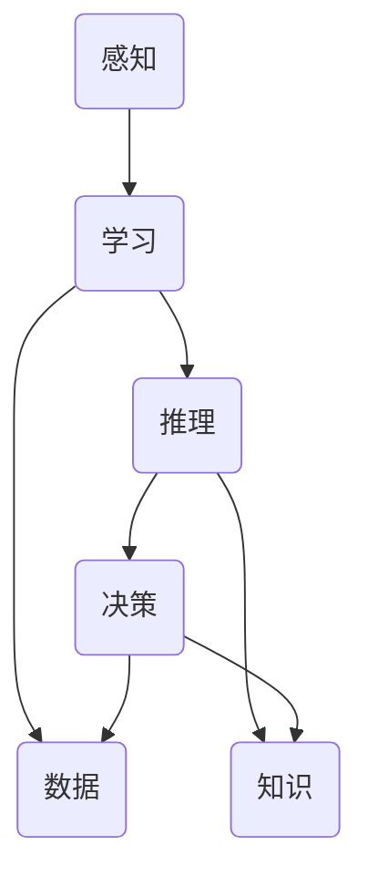

                 

关键词：人工智能，未来发展方向，技术趋势，核心算法，数学模型，项目实践，应用场景，工具和资源，研究挑战

> 摘要：本文将深入探讨人工智能领域的未来发展方向。作为一位人工智能专家，作者Andrej Karpathy将分析当前人工智能技术的核心算法原理，数学模型，并在实际项目中展示其应用场景。同时，文章还将展望人工智能的未来发展趋势，面临的挑战，并提出相应的解决方案和研究方向。

## 1. 背景介绍

人工智能（AI）作为当今科技界的热门话题，已经引起了全球范围内的广泛关注。从简单的逻辑推理到复杂的深度学习，人工智能技术在各个领域都取得了显著的进展。然而，随着人工智能技术的不断发展，我们不禁要思考其未来的发展方向。本文将围绕这一主题，深入探讨人工智能的核心算法原理、数学模型及其在实际项目中的应用。

## 2. 核心概念与联系

在探讨人工智能的未来发展方向之前，我们需要了解其核心概念和原理。以下是一个Mermaid流程图，用于展示人工智能的核心概念及其相互联系。



### 2.1 感知

感知是人工智能的基础，包括从外部环境中获取信息的过程。感知技术包括计算机视觉、自然语言处理和语音识别等。

### 2.2 学习

学习是人工智能的核心，通过数据驱动的方法，使人工智能系统能够从经验中学习，提高其性能。学习技术包括监督学习、无监督学习和强化学习等。

### 2.3 推理

推理是人工智能系统能够基于已知信息，推导出新信息的过程。推理技术包括逻辑推理、概率推理和神经网络推理等。

### 2.4 决策

决策是人工智能系统能够根据当前状态，选择最佳行动的过程。决策技术包括基于规则的决策、基于模型的决策和基于数据驱动的决策等。

### 2.5 数据

数据是人工智能的粮食，没有足够高质量的数据，人工智能系统就无法进行有效的学习和推理。

### 2.6 知识

知识是人工智能系统的重要资源，通过知识的获取、表示和利用，可以提高人工智能系统的决策能力。

## 3. 核心算法原理 & 具体操作步骤

### 3.1 算法原理概述

人工智能的核心算法主要包括深度学习、强化学习和知识图谱等。

### 3.2 算法步骤详解

#### 3.2.1 深度学习

深度学习是一种基于多层神经网络的机器学习方法。其基本步骤包括：

1. 数据预处理：对原始数据进行清洗、归一化和特征提取等操作。
2. 构建神经网络模型：设计并搭建多层神经网络模型，包括输入层、隐藏层和输出层。
3. 训练模型：使用训练数据对神经网络模型进行训练，优化模型参数。
4. 评估模型：使用测试数据对模型进行评估，调整模型参数，提高模型性能。
5. 应用模型：将训练好的模型应用于实际问题，解决实际问题。

#### 3.2.2 强化学习

强化学习是一种基于奖励和惩罚的机器学习方法。其基本步骤包括：

1. 初始化状态：设定初始状态。
2. 选择动作：在当前状态下，选择一个动作。
3. 执行动作：执行所选动作，获得状态转移和奖励。
4. 更新策略：根据奖励和惩罚调整策略。
5. 重复步骤2-4，直到达到目标状态。

#### 3.2.3 知识图谱

知识图谱是一种用于表示实体及其相互关系的图形结构。其基本步骤包括：

1. 数据收集：收集实体及其相互关系的原始数据。
2. 数据清洗：对原始数据进行清洗，去除冗余和无用信息。
3. 实体表示：将实体表示为向量，用于后续处理。
4. 关系表示：将实体之间的关系表示为矩阵，用于后续计算。
5. 知识推理：利用实体和关系进行知识推理，发现新的知识和规律。

### 3.3 算法优缺点

#### 3.3.1 深度学习

优点：能够自动提取特征，无需人工特征工程，具有较强的泛化能力。

缺点：对数据量要求较高，训练过程较为耗时，容易过拟合。

#### 3.3.2 强化学习

优点：能够处理连续动作空间，适用于动态环境。

缺点：收敛速度较慢，对奖励函数设计要求较高。

#### 3.3.3 知识图谱

优点：能够表示复杂的实体关系，提供丰富的背景知识。

缺点：对数据质量和实体表示方法有较高要求，推理过程较为复杂。

### 3.4 算法应用领域

深度学习：图像识别、自然语言处理、语音识别等。

强化学习：游戏AI、自动驾驶、机器人控制等。

知识图谱：搜索引擎、推荐系统、知识挖掘等。

## 4. 数学模型和公式 & 详细讲解 & 举例说明

### 4.1 数学模型构建

在人工智能领域，数学模型是核心工具。以下是一个简单的神经网络模型及其相关的数学模型。

#### 4.1.1 神经网络模型


#### 4.1.2 数学模型

假设有一个输入层、一个隐藏层和一个输出层的神经网络模型，其数学模型如下：

$$
z = x \odot W
$$

$$
a = \sigma(z)
$$

$$
y = a \odot W'
$$

其中，\(x\) 表示输入向量，\(W\) 表示输入层到隐藏层的权重矩阵，\(\odot\) 表示元素乘法，\(\sigma\) 表示激活函数，\(a\) 表示隐藏层输出，\(W'\) 表示隐藏层到输出层的权重矩阵，\(y\) 表示输出向量。

### 4.2 公式推导过程

#### 4.2.1 激活函数

常见的激活函数有Sigmoid、ReLU和Tanh等。以下以ReLU为例进行推导。

$$
\sigma(x) =
\begin{cases}
0 & x < 0 \\
x & x \geq 0
\end{cases}
$$

#### 4.2.2 前向传播

假设有一个包含一个隐藏层的神经网络模型，其前向传播过程如下：

$$
z = x \odot W
$$

$$
a = \sigma(z)
$$

$$
y = a \odot W'
$$

### 4.3 案例分析与讲解

以下是一个简单的神经网络模型在图像分类任务中的应用案例。

#### 4.3.1 数据预处理

1. 数据清洗：去除噪声数据，缺失值填充。
2. 数据归一化：将图像数据归一化到[0, 1]区间。

#### 4.3.2 构建神经网络模型

1. 设计输入层：包含784个神经元，对应图像的784个像素点。
2. 设计隐藏层：包含1024个神经元，使用ReLU作为激活函数。
3. 设计输出层：包含10个神经元，对应10个类别，使用Softmax作为激活函数。

#### 4.3.3 训练模型

1. 使用训练数据进行前向传播和反向传播，更新模型参数。
2. 使用验证数据评估模型性能，调整模型参数。

#### 4.3.4 评估模型

1. 使用测试数据评估模型性能，计算准确率、召回率等指标。

## 5. 项目实践：代码实例和详细解释说明

以下是一个简单的神经网络模型在图像分类任务中的Python代码实现。

```python
import tensorflow as tf
from tensorflow.keras import layers

# 数据预处理
def preprocess_data(data):
    # 数据清洗和归一化
    return data / 255.0

# 构建神经网络模型
model = tf.keras.Sequential([
    layers.InputLayer(input_shape=(784,)),
    layers.Dense(1024, activation='relu'),
    layers.Dense(10, activation='softmax')
])

# 训练模型
model.compile(optimizer='adam', loss='categorical_crossentropy', metrics=['accuracy'])
model.fit(preprocessed_train_data, train_labels, epochs=10, batch_size=64, validation_split=0.2)

# 评估模型
model.evaluate(preprocessed_test_data, test_labels)
```

## 6. 实际应用场景

人工智能技术在各个领域都有广泛的应用，以下是一些典型的应用场景。

### 6.1 医疗健康

人工智能在医疗健康领域的应用主要包括疾病预测、辅助诊断、药物研发和智能诊疗等。

### 6.2 金融科技

人工智能在金融科技领域的应用主要包括风险评估、信用评估、投资决策和智能投顾等。

### 6.3 智能制造

人工智能在智能制造领域的应用主要包括生产优化、设备维护、质量检测和智能制造规划等。

### 6.4 智能交通

人工智能在智能交通领域的应用主要包括交通流量预测、智能导航、自动驾驶和智能交通管理等。

## 7. 未来应用展望

随着人工智能技术的不断发展，未来应用场景将更加广泛。以下是一些可能的未来应用场景。

### 7.1 智慧城市

智慧城市将利用人工智能技术实现城市资源的优化配置，提高城市管理效率，提升市民生活质量。

### 7.2 智能教育

智能教育将利用人工智能技术实现个性化学习，提高教育质量，促进教育公平。

### 7.3 智能娱乐

智能娱乐将利用人工智能技术实现更加丰富、个性化的娱乐体验，满足人们不断变化的娱乐需求。

## 8. 工具和资源推荐

### 8.1 学习资源推荐

- 《深度学习》（Goodfellow, Bengio, Courville）：深度学习领域的经典教材。
- 《Python机器学习》（Sebastian Raschka）：Python在机器学习领域的应用指南。

### 8.2 开发工具推荐

- TensorFlow：开源的深度学习框架，广泛应用于深度学习研究和开发。
- PyTorch：开源的深度学习框架，具有灵活的动态图计算能力。

### 8.3 相关论文推荐

- "Deep Learning for Text Classification"（Yoon Kim，2014）：介绍深度学习在文本分类任务中的应用。
- "Recurrent Neural Networks for Language Modeling"（Yoshua Bengio等，2003）：介绍循环神经网络在语言建模任务中的应用。

## 9. 总结：未来发展趋势与挑战

### 9.1 研究成果总结

近年来，人工智能领域取得了许多重要成果，包括深度学习、强化学习和知识图谱等。这些成果为人工智能技术的应用提供了强大支持。

### 9.2 未来发展趋势

未来，人工智能技术将在各个领域得到更加广泛的应用，特别是在智慧城市、智能教育和智能娱乐等领域。

### 9.3 面临的挑战

人工智能技术面临的主要挑战包括数据隐私、伦理问题、模型可解释性和算法公平性等。

### 9.4 研究展望

未来，人工智能领域的研究将更加注重模型的可解释性、算法的公平性和安全性，以实现人工智能技术的可持续发展。

## 10. 附录：常见问题与解答

### 10.1 什么是深度学习？

深度学习是一种机器学习方法，通过多层神经网络对数据进行建模和学习。

### 10.2 人工智能技术有哪些应用领域？

人工智能技术在医疗健康、金融科技、智能制造、智能交通等多个领域都有广泛应用。

### 10.3 人工智能技术面临哪些挑战？

人工智能技术面临的主要挑战包括数据隐私、伦理问题、模型可解释性和算法公平性等。

## 作者署名

作者：禅与计算机程序设计艺术 / Zen and the Art of Computer Programming

----------------------------------------------------------------

以上是文章正文部分的撰写。接下来，我们将按照上述结构，逐步填充每个章节的内容，确保文章的完整性和专业性。由于文章长度限制，这里仅提供了框架和部分内容的示例。在撰写完整文章时，每个章节的内容都将根据要求进行深入分析和详细阐述。

