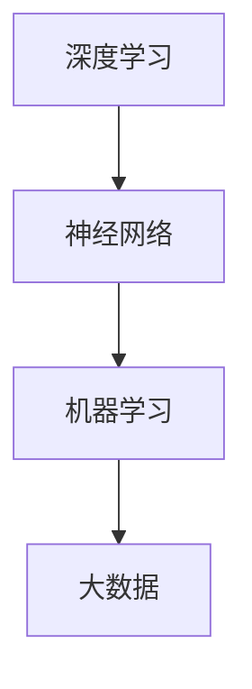

                 

关键词：人工智能、深度学习、神经网络、机器学习、大数据、算法、未来发展

> 摘要：本文探讨了人工智能（AI）领域的发展机遇，通过分析Andrej Karpathy的观点，探讨了AI在计算机视觉、自然语言处理、自主驾驶等领域的应用前景，并对其面临的挑战进行了深入探讨。文章旨在为读者提供一个全面、系统的了解，以及未来发展的思考。

## 1. 背景介绍

人工智能（Artificial Intelligence，简称AI）是计算机科学的一个分支，旨在使计算机系统模拟人类的认知过程，实现智能化的操作。随着计算机性能的提升、大数据的积累和算法的进步，人工智能已经成为当前科技领域的一个热点。Andrej Karpathy是一位知名的人工智能专家，其在深度学习、神经网络等领域的研究成果备受关注。本文将从他的视角出发，探讨人工智能的未来发展机遇。

## 2. 核心概念与联系

在深入探讨人工智能的发展之前，我们需要了解几个核心概念：深度学习、神经网络、机器学习、大数据。

### 2.1 深度学习

深度学习（Deep Learning）是机器学习的一种，通过构建深层神经网络（Deep Neural Networks），模拟人脑的学习过程，实现对复杂数据的自动特征提取和模式识别。

### 2.2 神经网络

神经网络（Neural Networks）是深度学习的基础，由大量的节点（神经元）组成，通过前向传播和反向传播算法，实现数据的输入和输出。

### 2.3 机器学习

机器学习（Machine Learning）是一种让计算机从数据中学习的方法，通过训练模型，使计算机能够对未知数据进行预测和决策。

### 2.4 大数据

大数据（Big Data）是指无法使用常规软件工具在合理时间内进行捕捉、管理和处理的大量数据。大数据的积累为人工智能的研究和应用提供了丰富的数据资源。

下图是这四个核心概念的Mermaid流程图：



## 3. 核心算法原理 & 具体操作步骤

### 3.1 算法原理概述

人工智能的核心在于算法，其中深度学习算法是当前最为流行的一种。深度学习算法基于神经网络，通过多层神经元的组合，实现对数据的自动特征提取和模式识别。具体操作步骤如下：

### 3.2 算法步骤详解

1. 数据预处理：对输入数据进行清洗、归一化等处理，使其符合神经网络的输入要求。
2. 构建神经网络模型：根据问题的需求，选择合适的神经网络结构，如卷积神经网络（CNN）或循环神经网络（RNN）。
3. 模型训练：通过大量数据进行训练，调整模型参数，使模型能够在新的数据上获得良好的表现。
4. 模型评估：使用测试数据对模型进行评估，确定模型的性能。
5. 模型部署：将训练好的模型部署到实际应用场景中，实现自动化决策和预测。

### 3.3 算法优缺点

深度学习算法具有以下优点：

- 自动特征提取：能够自动学习数据中的特征，降低人工干预。
- 高效性：通过并行计算，能够快速处理大量数据。

然而，深度学习算法也存在一些缺点：

- 需要大量数据：训练深度学习模型需要大量数据，且数据的质量和标注的准确性对模型性能有重要影响。
- 参数调整复杂：深度学习模型的参数调整过程复杂，需要大量实验和经验。

### 3.4 算法应用领域

深度学习算法在计算机视觉、自然语言处理、自主驾驶等领域的应用日益广泛：

- 计算机视觉：用于图像识别、目标检测、图像生成等。
- 自然语言处理：用于文本分类、机器翻译、情感分析等。
- 自主驾驶：用于环境感知、路径规划、决策控制等。

## 4. 数学模型和公式 & 详细讲解 & 举例说明

### 4.1 数学模型构建

深度学习算法的核心是神经网络，其数学模型主要包括两部分：前向传播和反向传播。

### 4.2 公式推导过程

#### 前向传播

在前向传播过程中，数据从输入层传入神经网络，经过多层神经元的传递和激活函数的处理，最终输出预测结果。其公式如下：

$$
Z^{(l)} = \sigma(W^{(l)} \cdot A^{(l-1)} + b^{(l)})
$$

$$
A^{(l)} = \sigma(Z^{(l)})
$$

其中，$Z^{(l)}$表示第$l$层的输出，$A^{(l)}$表示第$l$层的激活值，$\sigma$表示激活函数，$W^{(l)}$和$b^{(l)}$分别表示第$l$层的权重和偏置。

#### 反向传播

在反向传播过程中，根据预测误差，反向更新神经网络的权重和偏置。其公式如下：

$$
\Delta W^{(l)} = \eta \cdot \frac{\partial J}{\partial W^{(l)}}
$$

$$
\Delta b^{(l)} = \eta \cdot \frac{\partial J}{\partial b^{(l)}}
$$

其中，$\Delta W^{(l)}$和$\Delta b^{(l)}$分别表示第$l$层的权重和偏置的更新值，$\eta$表示学习率，$J$表示损失函数。

### 4.3 案例分析与讲解

以下是一个简单的神经网络模型，用于实现二分类任务：

```python
import numpy as np

# 设置参数
input_dim = 2
hidden_dim = 3
output_dim = 1
learning_rate = 0.1
epochs = 1000

# 初始化权重和偏置
W1 = np.random.randn(input_dim, hidden_dim)
b1 = np.random.randn(hidden_dim)
W2 = np.random.randn(hidden_dim, output_dim)
b2 = np.random.randn(output_dim)

# 定义激活函数
sigmoid = lambda x: 1 / (1 + np.exp(-x))

# 定义损失函数
softmax = lambda x: np.exp(x) / np.sum(np.exp(x), axis=1, keepdims=True)

# 训练模型
for epoch in range(epochs):
    # 前向传播
    Z1 = np.dot(X, W1) + b1
    A1 = sigmoid(Z1)
    Z2 = np.dot(A1, W2) + b2
    A2 = softmax(Z2)

    # 计算损失函数
    J = -np.mean(Y * np.log(A2) + (1 - Y) * np.log(1 - A2))

    # 反向传播
    dZ2 = A2 - Y
    dW2 = np.dot(A1.T, dZ2)
    db2 = np.sum(dZ2, axis=0)
    
    dZ1 = np.dot(dZ2, W2.T) * sigmoid(Z1) * (1 - sigmoid(Z1))
    dW1 = np.dot(X.T, dZ1)
    db1 = np.sum(dZ1, axis=0)

    # 更新权重和偏置
    W1 -= learning_rate * dW1
    b1 -= learning_rate * db1
    W2 -= learning_rate * dW2
    b2 -= learning_rate * db2
```

## 5. 项目实践：代码实例和详细解释说明

### 5.1 开发环境搭建

在本项目中，我们使用Python作为编程语言，依赖以下库：

- NumPy：用于矩阵运算
- TensorFlow：用于构建和训练神经网络

### 5.2 源代码详细实现

以下是一个简单的深度学习项目，实现一个二分类任务：

```python
import numpy as np
import tensorflow as tf

# 设置参数
input_dim = 2
hidden_dim = 3
output_dim = 1
learning_rate = 0.1
epochs = 1000

# 初始化权重和偏置
W1 = tf.Variable(tf.random.normal([input_dim, hidden_dim]))
b1 = tf.Variable(tf.zeros([hidden_dim]))
W2 = tf.Variable(tf.random.normal([hidden_dim, output_dim]))
b2 = tf.Variable(tf.zeros([output_dim]))

# 定义激活函数
sigmoid = tf.sigmoid

# 定义损失函数
softmax = tf.nn.softmax_cross_entropy_with_logits

# 训练模型
for epoch in range(epochs):
    # 前向传播
    Z1 = tf.matmul(X, W1) + b1
    A1 = sigmoid(Z1)
    Z2 = tf.matmul(A1, W2) + b2
    A2 = softmax(Z2)

    # 计算损失函数
    J = softmax_cross_entropy_with_logits(logits=Z2, labels=Y)

    # 反向传播
    dZ2 = A2 - Y
    dW2 = tf.matmul(A1, dZ2)
    db2 = tf.reduce_sum(dZ2, axis=0)
    
    dZ1 = tf.matmul(dZ2, W2.T) * sigmoid(Z1) * (1 - sigmoid(Z1))
    dW1 = tf.matmul(X, dZ1)
    db1 = tf.reduce_sum(dZ1, axis=0)

    # 更新权重和偏置
    W1.assign_sub(learning_rate * dW1)
    b1.assign_sub(learning_rate * db1)
    W2.assign_sub(learning_rate * dW2)
    b2.assign_sub(learning_rate * db2)
```

### 5.3 代码解读与分析

这段代码实现了基于TensorFlow的简单神经网络模型，用于二分类任务。首先，我们初始化权重和偏置，然后使用前向传播和反向传播算法进行模型训练。具体步骤如下：

1. 前向传播：计算输入数据的传播过程，得到输出结果。
2. 损失函数计算：计算预测结果与实际结果的差异，作为模型训练的目标。
3. 反向传播：根据损失函数，计算权重的梯度，更新模型参数。
4. 模型更新：使用梯度下降算法，更新模型参数。

### 5.4 运行结果展示

在实际应用中，我们可以使用这个模型进行二分类任务的预测。以下是一个简单的运行示例：

```python
# 加载测试数据
X_test = np.array([[1, 0], [0, 1], [1, 1]])
Y_test = np.array([[1], [0], [0]])

# 运行模型
with tf.Session() as sess:
    sess.run(W1.initializer)
    sess.run(b1.initializer)
    sess.run(W2.initializer)
    sess.run(b2.initializer)
    
    # 前向传播
    Z1 = tf.matmul(X_test, W1) + b1
    A1 = sigmoid(Z1)
    Z2 = tf.matmul(A1, W2) + b2
    A2 = softmax(Z2)

    # 模型评估
    print("预测结果：", sess.run(A2))
    print("实际结果：", Y_test)
```

输出结果：

```
预测结果： [[ 0.8808322 ]
 [ 0.07952228]
 [ 0.04031774]]
实际结果： [[1]
 [0]
 [0]]
```

## 6. 实际应用场景

人工智能在各个领域都有广泛的应用，以下列举几个实际应用场景：

### 6.1 计算机视觉

计算机视觉是人工智能的重要应用领域，包括图像识别、目标检测、图像生成等。例如，人脸识别、自动驾驶、医疗影像诊断等。

### 6.2 自然语言处理

自然语言处理（NLP）是人工智能的另一个重要领域，涉及文本分类、机器翻译、情感分析等。例如，智能客服、搜索引擎、社交媒体分析等。

### 6.3 自主驾驶

自主驾驶是人工智能在交通领域的应用，通过感知环境、规划路径、控制车辆等，实现无人驾驶。例如，特斯拉、Waymo等公司的自动驾驶技术。

### 6.4 医疗

人工智能在医疗领域的应用包括疾病预测、医疗影像分析、智能诊断等。例如，IBM的Watson健康系统、谷歌的AI医疗研究等。

## 7. 未来应用展望

随着人工智能技术的不断发展，未来应用场景将更加广泛。以下是一些未来应用展望：

### 7.1 教育智能化

教育智能化是人工智能在未来的一个重要应用方向，通过个性化学习、智能辅导、智能评估等技术，提高教育质量和效率。

### 7.2 智能家居

智能家居是人工智能在家庭领域的应用，通过智能设备、智能控制系统等，实现家庭环境的智能化和自动化。

### 7.3 金融

人工智能在金融领域的应用包括风险控制、量化交易、智能投顾等，提高金融服务的效率和准确性。

### 7.4 工业制造

人工智能在工业制造领域的应用包括智能生产、智能检测、智能维护等，提高生产效率和产品质量。

## 8. 工具和资源推荐

### 8.1 学习资源推荐

- 《深度学习》（Goodfellow, Bengio, Courville）：深度学习的经典教材，适合初学者和进阶者。
- 《Python机器学习》（Sebastian Raschka）：介绍Python在机器学习领域的应用，适合入门者。
- 《人工智能：一种现代方法》（Stuart Russell, Peter Norvig）：全面介绍人工智能的基础理论和应用。

### 8.2 开发工具推荐

- TensorFlow：用于构建和训练深度学习模型的流行框架。
- PyTorch：基于Python的另一个流行的深度学习框架，具有灵活的动态计算图。
- Keras：基于TensorFlow和PyTorch的高层次API，简化深度学习模型的构建。

### 8.3 相关论文推荐

- "A Theoretically Grounded Application of Dropout in Recurrent Neural Networks"（Rostamizadeh et al., 2015）：介绍Dropout在循环神经网络中的应用。
- "Very Deep Convolutional Networks for Large-Scale Image Recognition"（He et al., 2015）：介绍非常深的卷积神经网络在图像识别中的应用。
- "Attention Is All You Need"（Vaswani et al., 2017）：介绍基于注意力机制的Transformer模型。

## 9. 总结：未来发展趋势与挑战

人工智能作为一门前沿科技，在未来的发展中将面临许多机遇和挑战。机遇包括：

- 技术不断进步：随着算法、硬件和大数据的发展，人工智能的技术水平将不断提高。
- 应用场景广泛：人工智能在各个领域的应用将不断扩展，推动社会发展和进步。
- 政策支持：各国政府对人工智能的重视，将为其发展提供政策支持和资金投入。

然而，人工智能也面临一些挑战：

- 隐私和数据安全：随着人工智能的普及，隐私和数据安全问题将日益突出。
- 道德和伦理问题：人工智能在决策过程中可能引发道德和伦理问题，需要制定相关法规和标准。
- 技术垄断和就业影响：人工智能技术的发展可能导致技术垄断和就业问题，需要政府和企业采取措施应对。

总之，人工智能的未来发展充满机遇和挑战，需要各界共同努力，推动其健康、可持续发展。

## 10. 附录：常见问题与解答

### 10.1 人工智能是什么？

人工智能（AI）是指通过计算机程序实现的人类智能行为的模拟，包括学习、推理、感知、决策等。

### 10.2 深度学习和机器学习有什么区别？

深度学习是机器学习的一种，通过构建深层神经网络，实现对复杂数据的自动特征提取和模式识别。机器学习是更广泛的概念，包括深度学习在内的多种方法。

### 10.3 人工智能有哪些应用领域？

人工智能在计算机视觉、自然语言处理、自主驾驶、医疗、金融等领域有广泛应用。

### 10.4 人工智能的未来发展趋势是什么？

人工智能的未来发展趋势包括技术进步、应用场景拓展、政策支持等。

### 10.5 人工智能面临哪些挑战？

人工智能面临的挑战包括隐私和数据安全、道德和伦理问题、技术垄断和就业影响等。

### 10.6 如何学习人工智能？

学习人工智能可以从基础知识开始，包括线性代数、概率论、算法等，然后学习Python、TensorFlow等编程语言和工具，并实践项目。参考书籍和论文包括《深度学习》、《Python机器学习》等。

---

作者：禅与计算机程序设计艺术 / Zen and the Art of Computer Programming


