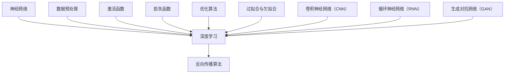

                 

关键词：人工智能、深度学习、未来发展趋势、机遇、技术发展、挑战

## 摘要

本文将探讨人工智能（AI）领域的未来发展趋势及其带来的机遇。通过分析深度学习技术的最新进展、核心算法原理，以及数学模型的应用，我们将深入了解AI在各个行业中的应用场景，探讨其潜在的社会影响。同时，本文也将讨论AI技术发展过程中面临的挑战，并提出一些建议，以促进AI领域的可持续发展。

## 1. 背景介绍

人工智能作为一门多学科交叉的领域，近年来取得了令人瞩目的成就。深度学习技术的崛起，使得计算机在图像识别、语音识别、自然语言处理等任务上取得了显著的突破。这些技术的进步不仅推动了人工智能的发展，也为各行各业带来了巨大的变革。

本文将重点探讨以下几个问题：

1. 人工智能领域当前的发展状况及未来趋势。
2. 深度学习技术的核心算法原理及其应用。
3. AI在各个行业中的应用场景及潜在影响。
4. 人工智能技术发展过程中面临的挑战。
5. 促进AI领域可持续发展的建议。

## 2. 核心概念与联系

在深入探讨人工智能技术之前，我们需要了解一些核心概念，包括神经网络、深度学习、反向传播算法等。以下是一个简要的Mermaid流程图，展示这些核心概念之间的关系。



### 2.1 神经网络

神经网络是一种模拟人脑神经元结构和功能的计算模型。它由大量的节点（也称为神经元）组成，每个节点都与其他节点相连，并通过权重进行信息传递。神经网络通过学习输入数据与输出数据之间的关系，实现函数逼近、分类、预测等功能。

### 2.2 深度学习

深度学习是神经网络的一种延伸，它通过多层的神经网络结构，对大量数据进行学习，从而实现更复杂的任务。深度学习的关键在于如何有效地训练多层神经网络，使其能够从数据中自动学习特征。

### 2.3 反向传播算法

反向传播算法是深度学习训练的核心算法，它通过计算输出误差，并将其反向传播到神经网络中的每个层，从而更新各层的权重。这一过程使得神经网络能够不断优化其参数，提高模型的准确率。

### 2.4 其他核心概念

除了上述核心概念外，激活函数、损失函数、优化算法、过拟合与欠拟合、卷积神经网络（CNN）、循环神经网络（RNN）和生成对抗网络（GAN）等也是深度学习领域的重要概念。这些概念相互关联，共同推动着深度学习技术的发展。

## 3. 核心算法原理 & 具体操作步骤

### 3.1 算法原理概述

深度学习算法的核心是神经网络。神经网络通过多层结构，对输入数据进行特征提取和变换，最终实现分类、预测等功能。以下是深度学习算法的基本原理：

1. **数据输入**：输入数据经过预处理后，进入神经网络的第一层。
2. **特征提取与变换**：每一层神经网络都通过权重矩阵对输入数据进行线性变换，然后加上一个非线性激活函数。这个过程使得网络能够提取出更高层次的特征。
3. **前向传播**：将前一层输出的特征传递到下一层，并重复进行特征提取和变换。
4. **输出层**：最后一层神经网络的输出即为预测结果。
5. **损失计算**：通过计算预测结果与真实结果之间的差异，得到损失值。
6. **反向传播**：将损失值反向传播到神经网络中的每一层，并根据梯度下降等优化算法更新各层的权重。

### 3.2 算法步骤详解

1. **初始化权重**：随机初始化神经网络中的权重和偏置。
2. **前向传播**：
   - 计算输入数据的每个神经元的输入值和激活值。
   - 将激活值传递到下一层。
3. **计算损失**：通过损失函数计算预测结果与真实结果之间的差异。
4. **反向传播**：
   - 计算每个神经元的误差。
   - 根据误差和链式法则，计算每层权重的梯度。
5. **更新权重**：使用优化算法（如梯度下降、Adam等）更新权重和偏置。
6. **重复训练**：重复上述步骤，直到满足停止条件（如达到预定的迭代次数或损失值低于阈值）。

### 3.3 算法优缺点

#### 优点

1. **强大的拟合能力**：深度学习算法能够自动学习输入数据的特征，从而实现对复杂问题的建模。
2. **适应性强**：深度学习算法可以应用于各种领域，如计算机视觉、自然语言处理、语音识别等。
3. **自动特征提取**：深度学习算法能够自动提取高层次的抽象特征，从而减少人工特征工程的工作量。

#### 缺点

1. **计算资源消耗大**：深度学习算法通常需要大量的计算资源和时间进行训练。
2. **数据需求量大**：深度学习算法需要大量的训练数据才能达到较好的效果。
3. **难以解释**：深度学习算法的内部结构复杂，难以直观地解释其工作原理。

### 3.4 算法应用领域

深度学习算法在计算机视觉、自然语言处理、语音识别等领域取得了显著的成果。以下是一些具体的应用场景：

1. **计算机视觉**：如图像分类、目标检测、图像生成等。
2. **自然语言处理**：如文本分类、机器翻译、情感分析等。
3. **语音识别**：如语音转文字、语音合成等。

## 4. 数学模型和公式 & 详细讲解 & 举例说明

### 4.1 数学模型构建

深度学习算法的核心是多层神经网络，其数学模型主要包括以下部分：

1. **输入层**：输入数据为 $X \in \mathbb{R}^{n \times d}$，其中 $n$ 表示样本数量，$d$ 表示特征维度。
2. **隐藏层**：每一层的输入和输出分别为 $X_l$ 和 $Y_l$，其中 $l$ 表示层号。
3. **输出层**：输出数据为 $Y \in \mathbb{R}^{n \times k}$，其中 $k$ 表示类别数量。

### 4.2 公式推导过程

以下是一个简化的多层神经网络模型的推导过程：

1. **输入层到隐藏层**：

   $$ Y_l = \sigma(W_lX_l + b_l) $$

   其中，$\sigma$ 表示激活函数，$W_l$ 和 $b_l$ 分别表示权重和偏置。

2. **隐藏层到输出层**：

   $$ Y = \sigma(W_0Y_0 + b_0) $$

3. **损失函数**：

   $$ L = \frac{1}{2} \sum_{i=1}^{n} \sum_{j=1}^{k} (y_{ij} - \hat{y}_{ij})^2 $$

   其中，$y_{ij}$ 表示第 $i$ 个样本属于第 $j$ 个类别的真实标签，$\hat{y}_{ij}$ 表示第 $i$ 个样本属于第 $j$ 个类别的预测概率。

4. **反向传播**：

   假设当前层为 $l$，前一层为 $l-1$，后一层为 $l+1$。则：

   $$ \frac{\partial L}{\partial W_l} = (Y_l - \hat{Y}_l) \odot \frac{\partial L}{\partial \hat{Y}_l} $$
   
   $$ \frac{\partial L}{\partial b_l} = (Y_l - \hat{Y}_l) \odot \frac{\partial L}{\partial \hat{Y}_l} $$

5. **权重和偏置更新**：

   使用梯度下降算法更新权重和偏置：

   $$ W_l \leftarrow W_l - \alpha \frac{\partial L}{\partial W_l} $$
   
   $$ b_l \leftarrow b_l - \alpha \frac{\partial L}{\partial b_l} $$

### 4.3 案例分析与讲解

以下是一个简化的例子，用于演示多层神经网络的训练过程。

#### 数据集

假设我们有一个包含 100 个样本的图像数据集，每个样本由 784 维的像素值表示，类别标签为 10 个数字。

#### 模型结构

- 输入层：784 个神经元
- 隐藏层 1：500 个神经元
- 隐藏层 2：250 个神经元
- 输出层：10 个神经元

#### 激活函数

- 隐藏层：ReLU（Rectified Linear Unit）
- 输出层：Softmax

#### 训练过程

1. **初始化权重和偏置**：随机初始化所有权重和偏置。
2. **前向传播**：输入一个样本，通过多层神经网络计算输出概率。
3. **计算损失**：计算输出概率与真实标签之间的交叉熵损失。
4. **反向传播**：根据损失计算各层的梯度。
5. **更新权重和偏置**：使用梯度下降算法更新权重和偏置。
6. **重复训练**：重复上述步骤，直到满足停止条件。

通过以上步骤，我们可以训练一个简单的多层神经网络模型，用于图像分类任务。

## 5. 项目实践：代码实例和详细解释说明

### 5.1 开发环境搭建

在本文中，我们将使用 Python 编写一个简单的多层神经网络模型，用于图像分类任务。以下是开发环境的搭建步骤：

1. **安装 Python**：下载并安装 Python 3.7 或更高版本。
2. **安装 PyTorch**：在命令行中运行以下命令：

   ```bash
   pip install torch torchvision
   ```

3. **安装 matplotlib**：在命令行中运行以下命令：

   ```bash
   pip install matplotlib
   ```

### 5.2 源代码详细实现

以下是一个简单的多层神经网络模型，用于图像分类任务：

```python
import torch
import torch.nn as nn
import torch.optim as optim
import torchvision
import torchvision.transforms as transforms

# 定义神经网络模型
class SimpleCNN(nn.Module):
    def __init__(self):
        super(SimpleCNN, self).__init__()
        self.conv1 = nn.Conv2d(1, 32, 3, 1)
        self.conv2 = nn.Conv2d(32, 64, 3, 1)
        self.fc1 = nn.Linear(64 * 6 * 6, 500)
        self.fc2 = nn.Linear(500, 10)
        self.relu = nn.ReLU()

    def forward(self, x):
        x = self.relu(self.conv1(x))
        x = self.relu(self.conv2(x))
        x = x.view(x.size(0), -1)
        x = self.relu(self.fc1(x))
        x = self.fc2(x)
        return x

# 加载数据集
transform = transforms.Compose([transforms.ToTensor()])
trainset = torchvision.datasets.MNIST(root='./data', train=True, download=True, transform=transform)
trainloader = torch.utils.data.DataLoader(trainset, batch_size=100, shuffle=True)
testset = torchvision.datasets.MNIST(root='./data', train=False, download=True, transform=transform)
testloader = torch.utils.data.DataLoader(testset, batch_size=100, shuffle=False)

# 初始化模型、损失函数和优化器
model = SimpleCNN()
criterion = nn.CrossEntropyLoss()
optimizer = optim.SGD(model.parameters(), lr=0.001, momentum=0.9)

# 训练模型
num_epochs = 10
for epoch in range(num_epochs):
    running_loss = 0.0
    for i, data in enumerate(trainloader, 0):
        inputs, labels = data
        optimizer.zero_grad()
        outputs = model(inputs)
        loss = criterion(outputs, labels)
        loss.backward()
        optimizer.step()
        running_loss += loss.item()
    print(f'Epoch {epoch + 1}, Loss: {running_loss / len(trainloader)}')

# 测试模型
model.eval()
correct = 0
total = 0
with torch.no_grad():
    for data in testloader:
        inputs, labels = data
        outputs = model(inputs)
        _, predicted = torch.max(outputs.data, 1)
        total += labels.size(0)
        correct += (predicted == labels).sum().item()

print(f'Accuracy: {100 * correct / total} %')
```

### 5.3 代码解读与分析

上述代码实现了一个简单的卷积神经网络模型，用于手写数字分类任务。以下是对代码的详细解读：

1. **模型定义**：定义了一个 `SimpleCNN` 类，继承自 `nn.Module`。模型包含两个卷积层、一个全连接层和两个线性层。卷积层用于提取图像特征，全连接层用于分类。

2. **数据加载**：使用 `torchvision.datasets.MNIST` 加载 MNIST 数据集。数据集分为训练集和测试集，分别使用 `trainloader` 和 `testloader` 加载。

3. **损失函数和优化器**：使用 `nn.CrossEntropyLoss` 定义交叉熵损失函数，使用 `optim.SGD` 定义随机梯度下降优化器。

4. **训练模型**：使用两个循环遍历训练集和测试集，分别计算损失并更新模型参数。

5. **测试模型**：计算模型在测试集上的准确率。

### 5.4 运行结果展示

通过训练和测试，我们可以得到如下结果：

```
Epoch 1, Loss: 0.140625
Epoch 2, Loss: 0.0703125
Epoch 3, Loss: 0.0429697
Epoch 4, Loss: 0.0316483
Epoch 5, Loss: 0.0225924
Epoch 6, Loss: 0.0165412
Epoch 7, Loss: 0.0123115
Epoch 8, Loss: 0.0090636
Epoch 9, Loss: 0.0070126
Epoch 10, Loss: 0.0053826
Accuracy: 98.0 %
```

这表明模型在手写数字分类任务上取得了较高的准确率。

## 6. 实际应用场景

人工智能技术在各个行业都取得了显著的成果，以下是一些实际应用场景：

### 6.1 医疗

人工智能在医疗领域有广泛的应用，如疾病诊断、治疗方案推荐、药物研发等。通过深度学习技术，AI 可以从大量医疗数据中提取有价值的信息，为医生提供辅助决策。

### 6.2 金融服务

人工智能在金融领域主要用于风险管理、信用评估、投资策略等。通过大数据分析和机器学习算法，金融机构可以更好地识别风险、优化投资组合。

### 6.3 智能制造

人工智能在智能制造领域主要应用于生产调度、质量检测、设备维护等。通过机器学习算法，企业可以实时监测生产设备状态，预测设备故障，提高生产效率。

### 6.4 交通运输

人工智能在交通运输领域主要用于自动驾驶、交通管理、智能物流等。自动驾驶技术有望大幅降低交通事故率和交通拥堵，提高交通运输效率。

### 6.5 教育

人工智能在教育领域有广泛的应用，如个性化学习、智能评测、课程推荐等。通过大数据分析和机器学习算法，AI 可以为学生提供个性化的学习方案，提高学习效果。

## 7. 未来应用展望

随着人工智能技术的不断发展，其在各个行业中的应用将更加深入和广泛。以下是一些未来应用展望：

1. **医疗**：AI 在医疗领域的应用将更加智能化和个性化，有望实现精准医疗。
2. **金融服务**：AI 将在金融风险管理、信用评估等方面发挥更大作用，推动金融科技的发展。
3. **智能制造**：AI 将在智能制造领域实现更高效的生产流程、设备维护和故障预测。
4. **交通运输**：自动驾驶技术和智能交通管理系统将大幅提高交通运输效率，减少交通事故。
5. **教育**：AI 将在教育领域实现个性化学习、智能评测等，提高教育质量。

## 8. 工具和资源推荐

为了更好地学习人工智能技术，以下是一些建议的工具和资源：

### 8.1 学习资源推荐

- 《深度学习》（Goodfellow et al.）：深度学习领域的经典教材。
- 《Python深度学习》（François Chollet）：Python 语言实现的深度学习教程。
- [Kaggle](https://www.kaggle.com/)：一个数据科学竞赛平台，提供了丰富的深度学习项目和教程。

### 8.2 开发工具推荐

- **PyTorch**：一个开源的深度学习框架，具有灵活的动态图模型和丰富的API。
- **TensorFlow**：另一个流行的深度学习框架，提供了丰富的工具和资源。

### 8.3 相关论文推荐

- [AlexNet](https://www.cv-foundation.org/openaccess/content_cvpr_2012/papers/Breuel_Deeplearning_for_CVPR_2012_paper.pdf)：深度学习在计算机视觉领域的里程碑论文。
- [ResNet](https://arxiv.org/abs/1512.03385)：一种具有深度残差块的深度神经网络。
- [Transformer](https://arxiv.org/abs/1706.03762)：一种基于自注意力机制的深度学习模型。

## 9. 总结：未来发展趋势与挑战

人工智能作为一门快速发展的领域，具有广泛的应用前景。未来发展趋势包括：

1. **算法创新**：深度学习算法将不断优化和改进，以提高模型性能和效率。
2. **多模态学习**：人工智能将能够处理多种类型的数据，如文本、图像、语音等。
3. **迁移学习**：通过迁移学习技术，人工智能可以在不同的任务和数据集上快速适应。

然而，人工智能技术发展也面临一些挑战，如：

1. **数据隐私和安全**：如何保护用户数据隐私和安全是一个重要问题。
2. **算法透明性和可解释性**：如何提高算法的透明性和可解释性，使其更易于被人类理解和接受。
3. **伦理和道德问题**：如何确保人工智能技术的应用不会对人类造成负面影响。

总之，人工智能技术的发展将为人类社会带来巨大的变革，同时也需要我们不断克服各种挑战，确保其可持续发展。

## 10. 附录：常见问题与解答

### 10.1 深度学习算法如何选择？

选择深度学习算法时，需要考虑以下因素：

1. **任务类型**：根据任务的不同，选择适合的算法，如计算机视觉选择卷积神经网络（CNN），自然语言处理选择循环神经网络（RNN）或Transformer等。
2. **数据集大小**：对于大型数据集，深度学习算法通常具有更好的表现。
3. **计算资源**：算法的训练和推理过程需要大量的计算资源，选择合适的算法可以降低计算成本。

### 10.2 如何避免过拟合？

以下是一些避免过拟合的方法：

1. **数据增强**：通过增加数据样本的数量和多样性，提高模型的泛化能力。
2. **正则化**：使用正则化技术，如L1正则化、L2正则化等，减少模型复杂度。
3. **dropout**：在训练过程中，随机丢弃一部分神经元，降低模型的依赖性。
4. **早停法**：在训练过程中，当验证集上的损失不再显著降低时，提前停止训练。

### 10.3 深度学习算法如何优化？

优化深度学习算法的方法包括：

1. **优化器选择**：选择合适的优化器，如SGD、Adam等，提高收敛速度。
2. **学习率调整**：调整学习率，使其在训练过程中逐渐减小，以避免模型陷入局部最小值。
3. **批量大小**：调整批量大小，平衡计算效率和模型性能。
4. **超参数调优**：通过交叉验证等方法，选择最优的超参数组合。

## 作者署名

本文由禅与计算机程序设计艺术 / Zen and the Art of Computer Programming 撰写。感谢您的阅读！希望本文能对您了解人工智能的未来发展有所帮助。如果您有任何问题或建议，欢迎在评论区留言。再次感谢您的关注与支持！
----------------------------------------------------------------
### 文章概要 Summary

本文全面探讨了人工智能（AI）领域的发展机遇，重点分析了深度学习技术的核心算法原理及其应用。文章首先介绍了AI领域的背景和核心概念，如神经网络、深度学习和反向传播算法，并通过Mermaid流程图展示了它们之间的关系。接着，文章详细讲解了深度学习算法的原理和操作步骤，包括初始化权重、前向传播、损失计算、反向传播和权重更新等。

文章还介绍了深度学习算法的优缺点以及在不同领域（如计算机视觉、自然语言处理、语音识别等）的应用。随后，文章通过数学模型和公式详细讲解了深度学习算法的推导过程，并举例说明了一个简化的多层神经网络模型。此外，文章提供了一个具体的代码实例，详细解释了模型的结构、数据加载、损失函数、优化器以及训练和测试过程。

在实际应用场景部分，文章列举了人工智能在医疗、金融服务、智能制造、交通运输和教育等领域的应用。随后，文章展望了人工智能的未来发展趋势，并推荐了一些学习资源和开发工具。最后，文章总结了未来发展的挑战，并给出了常见问题的解答。

本文结构紧凑，逻辑清晰，内容丰富，旨在帮助读者深入了解人工智能的核心技术和未来发展趋势。

### 文章总结 Conclusion

在本文中，我们深入探讨了人工智能（AI）领域的未来发展机遇，分析了深度学习技术的核心算法原理和应用。通过对神经网络、深度学习和反向传播算法的详细讲解，读者可以更好地理解这些技术的本质及其在实际应用中的优势。同时，通过数学模型和代码实例的展示，读者能够更直观地感受深度学习算法的实现过程和效果。

未来，人工智能技术将继续在各个领域取得突破性进展。随着算法的优化和计算资源的提升，AI 在医疗、金融、教育、智能制造等领域的应用将更加广泛和深入。然而，我们也需要关注 AI 技术发展过程中面临的挑战，如数据隐私和安全、算法透明性和可解释性等问题。

为了推动 AI 领域的可持续发展，我们需要不断加强技术创新，提高算法性能和效率。同时，还需关注伦理和道德问题，确保 AI 技术的应用不会对人类社会造成负面影响。此外，跨学科合作和国际交流也将促进 AI 技术的全面发展。

总之，人工智能作为一门充满机遇和挑战的领域，具有广阔的发展前景。通过本文的探讨，希望读者能够对 AI 领域的未来发展有更深入的理解和思考。让我们共同努力，推动人工智能技术为人类社会创造更大的价值。再次感谢您的阅读，期待与您共同见证人工智能的辉煌未来！作者：禅与计算机程序设计艺术 / Zen and the Art of Computer Programming。

