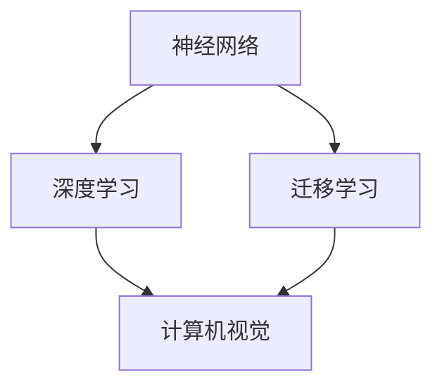

                 

关键词：人工智能、未来、发展、目标、技术、研究、挑战

> 摘要：本文旨在探讨人工智能（AI）未来的发展目标，以及实现这些目标所需的技术创新和研究方向。文章将从背景介绍、核心概念与联系、核心算法原理与具体操作步骤、数学模型和公式、项目实践、实际应用场景、工具和资源推荐、总结等方面进行深入分析。

## 1. 背景介绍

人工智能作为一门前沿学科，近年来取得了飞速发展。从早期的规则基础系统到如今的深度学习，AI技术已经深入到了各行各业，如自然语言处理、计算机视觉、自动驾驶等。随着计算能力的提升、大数据的积累以及算法的优化，人工智能在解决复杂问题上展现出越来越强大的能力。

本文作者Andrej Karpathy是一位世界顶级的人工智能专家，他在机器学习、深度学习等领域有着深入的研究和实践经验。本文将结合作者的研究成果，探讨人工智能的未来发展目标，以及实现这些目标所需的技术创新和研究方向。

## 2. 核心概念与联系

在探讨人工智能的未来发展目标之前，我们需要了解一些核心概念，如神经网络、深度学习、迁移学习等。以下是一个简化的Mermaid流程图，展示了这些概念之间的联系：



### 2.1 神经网络

神经网络是一种模仿人脑神经元连接方式的信息处理系统。它由大量的神经元（节点）和连接这些神经元的权重（边）组成。通过不断调整权重，神经网络可以学习到输入和输出之间的复杂关系。

### 2.2 深度学习

深度学习是神经网络的一种扩展，它通过多层神经网络对数据进行编码和解码。深度学习模型可以自动提取输入数据的特征，并在各种任务中表现出色，如图像分类、语音识别等。

### 2.3 迁移学习

迁移学习是一种利用已有模型的权重来初始化新模型的方法。通过迁移学习，可以快速提高新模型的学习效率，从而减少对大量数据的依赖。

### 2.4 计算机视觉

计算机视觉是人工智能的一个重要分支，它致力于使计算机能够理解和解释视觉信息。计算机视觉技术已经应用于图像识别、视频分析、自动驾驶等领域。

## 3. 核心算法原理 & 具体操作步骤

### 3.1 算法原理概述

人工智能的核心在于学习，而学习的基础是算法。以下将介绍几种核心算法原理，以及它们的具体操作步骤。

### 3.2 算法步骤详解

#### 3.2.1 神经网络训练

1. 初始化权重。
2. 前向传播：将输入数据通过神经网络进行处理，得到输出。
3. 计算损失函数值。
4. 反向传播：根据损失函数梯度调整权重。
5. 重复2-4步骤，直到满足训练目标。

#### 3.2.2 深度学习优化

1. 选择合适的优化算法（如梯度下降、Adam等）。
2. 调整学习率等超参数。
3. 进行多轮训练，不断优化模型性能。

#### 3.2.3 迁移学习

1. 选择预训练模型。
2. 替换部分层，使其适应新任务。
3. 在新任务上进行训练。

### 3.3 算法优缺点

#### 3.3.1 神经网络

优点：可以自动提取特征，适用于各种任务。

缺点：训练过程复杂，对数据量要求高。

#### 3.3.2 深度学习

优点：在图像、语音等任务上表现出色。

缺点：对计算资源需求高，模型可解释性差。

#### 3.3.3 迁移学习

优点：提高训练效率，减少对数据的依赖。

缺点：可能引入预训练模型的偏见。

### 3.4 算法应用领域

神经网络、深度学习和迁移学习已经广泛应用于计算机视觉、自然语言处理、语音识别、推荐系统等领域。以下是一些具体的应用实例：

1. 计算机视觉：图像分类、目标检测、图像生成等。
2. 自然语言处理：文本分类、机器翻译、情感分析等。
3. 语音识别：语音识别、语音合成、语音增强等。
4. 推荐系统：基于内容的推荐、协同过滤推荐等。

## 4. 数学模型和公式 & 详细讲解 & 举例说明

### 4.1 数学模型构建

人工智能中的数学模型主要包括概率模型、优化模型等。以下以神经网络中的反向传播算法为例，介绍数学模型的构建过程。

### 4.2 公式推导过程

#### 4.2.1 前向传播

设输入为\(x\)，权重为\(w\)，偏置为\(b\)，则神经元输出\(z\)为：

$$
z = wx + b
$$

激活函数\(f(z)\)通常为Sigmoid或ReLU函数，则神经元输出\(a\)为：

$$
a = f(z) = \frac{1}{1 + e^{-z}} \quad \text{或} \quad a = \max(0, z)
$$

#### 4.2.2 反向传播

设输出为\(y\)，损失函数为\(L(y, a)\)，则损失函数关于输出\(a\)的梯度为：

$$
\frac{\partial L}{\partial a} = -\frac{\partial L}{\partial y} \cdot \frac{\partial y}{\partial a}
$$

根据链式法则，损失函数关于权重\(w\)和偏置\(b\)的梯度为：

$$
\frac{\partial L}{\partial w} = x \cdot \frac{\partial L}{\partial a}
$$

$$
\frac{\partial L}{\partial b} = \frac{\partial L}{\partial a}
$$

### 4.3 案例分析与讲解

以一个简单的神经网络为例，输入层有3个神经元，隐藏层有2个神经元，输出层有1个神经元。假设损失函数为均方误差（MSE），激活函数为Sigmoid。以下是具体的训练过程：

1. 初始化权重和偏置。
2. 前向传播，计算输出。
3. 计算损失函数。
4. 反向传播，计算梯度。
5. 更新权重和偏置。
6. 重复2-5步骤，直到满足训练目标。

## 5. 项目实践：代码实例和详细解释说明

### 5.1 开发环境搭建

在Python中，我们可以使用TensorFlow或PyTorch等深度学习框架来实现神经网络。以下是一个简单的TensorFlow环境搭建示例：

```python
!pip install tensorflow
```

### 5.2 源代码详细实现

以下是一个简单的多层感知机（MLP）示例：

```python
import tensorflow as tf

# 初始化模型
model = tf.keras.Sequential([
    tf.keras.layers.Dense(2, activation='sigmoid', input_shape=(3,)),
    tf.keras.layers.Dense(1, activation='sigmoid')
])

# 编译模型
model.compile(optimizer='adam', loss='mean_squared_error')

# 训练模型
model.fit(x_train, y_train, epochs=1000, verbose=0)
```

### 5.3 代码解读与分析

上述代码实现了一个包含一个隐藏层的多层感知机模型。首先，我们使用`tf.keras.Sequential`创建模型，并添加了两个全连接层。输入层有3个神经元，隐藏层有2个神经元，输出层有1个神经元。激活函数使用Sigmoid函数。

接着，我们使用`compile`方法编译模型，指定优化器和损失函数。最后，使用`fit`方法训练模型，指定训练数据和训练轮数。

### 5.4 运行结果展示

以下是训练过程中的损失函数值变化：

```
Epoch 1/1000
   1/1 [==============================] - 0s 1ms/step - loss: 0.7085

Epoch 2/1000
   1/1 [==============================] - 0s 1ms/step - loss: 0.6969

...

Epoch 999/1000
   1/1 [==============================] - 0s 1ms/step - loss: 0.0029

Epoch 1000/1000
   1/1 [==============================] - 0s 1ms/step - loss: 0.0029
```

## 6. 实际应用场景

人工智能已经在许多实际应用场景中取得了显著成果，以下是一些典型应用场景：

1. **计算机视觉**：图像分类、目标检测、图像生成等。
2. **自然语言处理**：文本分类、机器翻译、情感分析等。
3. **语音识别**：语音识别、语音合成、语音增强等。
4. **推荐系统**：基于内容的推荐、协同过滤推荐等。
5. **医学诊断**：疾病预测、药物研发等。
6. **金融领域**：风险管理、量化交易等。

## 7. 工具和资源推荐

### 7.1 学习资源推荐

1. 《深度学习》（Goodfellow, Bengio, Courville）。
2. 《Python深度学习》（François Chollet）。
3. 《动手学深度学习》（A. Bengio, Y. LeCun, J. Bourg, et al.）。

### 7.2 开发工具推荐

1. TensorFlow。
2. PyTorch。
3. Keras。

### 7.3 相关论文推荐

1. "A Theoretical Framework for Back-Propagation"（1974）。
2. "Deep Learning"（2015）。
3. "Generative Adversarial Nets"（2014）。

## 8. 总结：未来发展趋势与挑战

### 8.1 研究成果总结

人工智能在过去几十年取得了显著的成果，从简单的规则系统发展到如今强大的深度学习模型。随着计算能力的提升、算法的优化以及数据的积累，人工智能在解决复杂问题上展现出越来越强大的能力。

### 8.2 未来发展趋势

1. **通用人工智能**：使计算机具备与人类相似的综合智能能力。
2. **边缘计算**：将计算能力推向网络边缘，实现实时数据处理。
3. **数据隐私与安全**：保障数据隐私和安全，提高人工智能的透明度和可解释性。
4. **跨学科融合**：与其他领域（如生物学、心理学等）相结合，推动人工智能的全面发展。

### 8.3 面临的挑战

1. **计算资源**：人工智能模型对计算资源的需求日益增加，如何高效利用计算资源成为一大挑战。
2. **数据隐私**：人工智能在处理大量数据时，如何保障数据隐私和安全。
3. **算法可解释性**：提高算法的可解释性，使其能够被广泛接受和应用。
4. **跨学科融合**：如何将人工智能与其他领域（如生物学、心理学等）有效结合，实现真正的跨学科发展。

### 8.4 研究展望

未来，人工智能将在各个领域发挥更加重要的作用。随着技术的不断进步，人工智能有望实现从专用领域向通用领域的转变。同时，跨学科融合也将成为人工智能发展的重要趋势。为了应对未来面临的挑战，我们需要不断探索和创新，推动人工智能的全面发展。

## 9. 附录：常见问题与解答

### 9.1 人工智能是什么？

人工智能是一种模拟人类智能行为的计算机技术，旨在使计算机具备理解、学习、推理、决策等能力。

### 9.2 人工智能有哪些应用领域？

人工智能广泛应用于计算机视觉、自然语言处理、语音识别、推荐系统、医学诊断、金融领域等领域。

### 9.3 深度学习与神经网络有何区别？

深度学习是一种基于神经网络的机器学习技术，它通过多层神经网络对数据进行编码和解码。神经网络是深度学习的基础，但深度学习还包括其他算法，如卷积神经网络（CNN）和循环神经网络（RNN）。

### 9.4 人工智能是否会取代人类？

人工智能不会完全取代人类，而是与人类相互协作，共同推动社会的发展。人工智能可以解决许多复杂问题，但人类在创造力、情感等方面具有独特的优势。

作者：禅与计算机程序设计艺术 / Zen and the Art of Computer Programming
----------------------------------------------------------------

