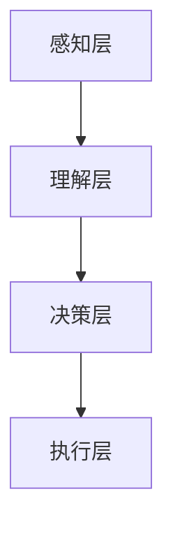

                 

关键词：人工智能，未来规划，技术发展趋势，创新，应用场景，挑战与机遇

摘要：本文将探讨人工智能（AI）在未来的发展蓝图，从核心概念、算法原理、数学模型、项目实践到实际应用，全面剖析AI技术的前沿动态。通过对AI领域的深度挖掘，我们将展望其未来发展方向，以及面临的挑战与机遇，旨在为读者提供一幅清晰的AI未来图景。

## 1. 背景介绍

人工智能（AI）作为一种模拟人类智能的技术，其历史可以追溯到上世纪50年代。随着计算能力的提升和大数据的普及，AI技术在过去几十年里取得了飞速发展。如今，AI已经渗透到我们生活的方方面面，从智能家居、智能医疗到自动驾驶、金融科技，其应用场景日益广泛。

本文旨在探讨AI在未来一段时间内的发展规划，分析其核心概念、算法原理、数学模型等基础知识，并通过实际项目和案例来展示AI技术的应用。此外，我们还将探讨AI在实际应用中面临的挑战，并为其未来发展提出建议。

## 2. 核心概念与联系

### 2.1 人工智能的核心概念

人工智能（AI）是一种模拟人类智能的技术，其核心概念包括：

- **感知**：AI系统通过传感器获取外部信息，例如图像、声音、文本等。
- **理解**：AI系统能够理解获取的信息，进行语义分析、模式识别等。
- **决策**：AI系统根据理解和分析的结果，做出相应的决策。
- **执行**：AI系统执行决策，将决策转化为具体的行动。

### 2.2 人工智能的架构

人工智能的架构可以分为三个层次：

- **感知层**：包括传感器、摄像头、麦克风等，用于获取外部信息。
- **理解层**：包括神经网络、深度学习模型等，用于理解感知层获取的信息。
- **决策层**：包括决策树、规则引擎等，用于根据理解层的结果做出决策。
- **执行层**：包括执行器、机器人等，用于执行决策层的决策。

### 2.3 人工智能与大数据、云计算的联系

大数据和云计算为人工智能提供了强大的计算资源和数据支持。大数据使得AI系统可以处理海量的数据，从而提高其训练效果和泛化能力。云计算则提供了弹性计算和分布式存储的能力，使得AI系统可以高效地处理大规模数据。

### 2.4 人工智能的Mermaid流程图

以下是一个简化的AI系统流程图，使用Mermaid语法绘制：



## 3. 核心算法原理 & 具体操作步骤

### 3.1  算法原理概述

人工智能的核心算法包括神经网络、深度学习、强化学习等。其中，神经网络是深度学习的基础，而深度学习则是目前AI领域的主流算法。

神经网络通过模拟人脑的神经元结构，实现数据的输入、输出和中间层的变换。深度学习则是通过多层的神经网络模型，实现对复杂数据的自动特征提取和模式识别。

强化学习则是通过奖励机制，让AI系统在与环境的互动中不断学习和优化自己的策略，以达到最佳效果。

### 3.2  算法步骤详解

#### 3.2.1 神经网络

神经网络的步骤如下：

1. **初始化参数**：包括输入层、隐藏层和输出层的权重和偏置。
2. **前向传播**：将输入数据通过多层神经元进行传递，得到输出。
3. **反向传播**：计算输出与实际标签之间的误差，并更新网络参数。
4. **迭代优化**：重复前向传播和反向传播，直到网络参数收敛。

#### 3.2.2 深度学习

深度学习的步骤如下：

1. **数据预处理**：包括数据清洗、归一化、数据增强等。
2. **构建模型**：选择合适的神经网络结构，如卷积神经网络（CNN）、循环神经网络（RNN）等。
3. **训练模型**：使用预处理后的数据训练模型，通过迭代优化参数。
4. **评估模型**：使用验证集或测试集评估模型性能，调整模型参数。

#### 3.2.3 强化学习

强化学习的步骤如下：

1. **初始化状态**：选择初始状态。
2. **执行动作**：在当前状态下执行动作，并获得奖励。
3. **更新状态**：根据动作的结果，更新当前状态。
4. **迭代学习**：重复执行动作、更新状态，直到达到目标状态或满足停止条件。

### 3.3  算法优缺点

神经网络和深度学习具有以下优点：

- **强大的表达力**：可以处理复杂的非线性问题。
- **自动特征提取**：能够从原始数据中自动提取特征。
- **泛化能力**：通过大量数据训练，可以应用于新的任务。

但是，它们也存在以下缺点：

- **训练时间较长**：需要大量计算资源和时间。
- **对数据依赖性强**：需要大量高质量的数据进行训练。

强化学习具有以下优点：

- **自适应性强**：能够根据环境动态调整策略。
- **应用范围广泛**：可以应用于决策、控制等领域。

但是，它也存在以下缺点：

- **收敛速度慢**：需要多次迭代才能收敛到最佳策略。
- **对环境依赖性强**：需要了解环境的状态和动作空间。

### 3.4  算法应用领域

神经网络和深度学习主要应用于图像识别、语音识别、自然语言处理等领域。强化学习则主要应用于自动驾驶、机器人控制、游戏AI等领域。

## 4. 数学模型和公式 & 详细讲解 & 举例说明

### 4.1  数学模型构建

在人工智能中，数学模型起着核心作用。以下是一些常见的数学模型和公式：

#### 4.1.1 神经元激活函数

神经元激活函数是神经网络中的关键组成部分。常见的激活函数有：

- **Sigmoid函数**： 
  $$f(x) = \frac{1}{1 + e^{-x}}$$

- **ReLU函数**： 
  $$f(x) = \max(0, x)$$

- **Tanh函数**： 
  $$f(x) = \frac{e^x - e^{-x}}{e^x + e^{-x}}$$

#### 4.1.2 损失函数

损失函数用于衡量模型预测值与真实值之间的差异。常见的损失函数有：

- **均方误差（MSE）**： 
  $$L = \frac{1}{2}\sum_{i=1}^{n} (y_i - \hat{y}_i)^2$$

- **交叉熵损失（Cross-Entropy Loss）**： 
  $$L = -\sum_{i=1}^{n} y_i \log(\hat{y}_i)$$

#### 4.1.3 优化算法

优化算法用于更新模型参数，以最小化损失函数。常见的优化算法有：

- **随机梯度下降（SGD）**： 
  $$\theta = \theta - \alpha \nabla_\theta J(\theta)$$

- **Adam优化器**： 
  $$m = \beta_1 m + (1 - \beta_1) \nabla_\theta J(\theta)$$
  $$v = \beta_2 v + (1 - \beta_2) (\nabla_\theta J(\theta))^2$$
  $$\theta = \theta - \alpha \frac{m}{\sqrt{v} + \epsilon}$$

### 4.2  公式推导过程

以均方误差（MSE）为例，我们简要说明其推导过程。

设 $y_i$ 为真实值，$\hat{y}_i$ 为模型预测值，则均方误差（MSE）可表示为：

$$L = \frac{1}{2}\sum_{i=1}^{n} (y_i - \hat{y}_i)^2$$

对其求导，得到：

$$\frac{\partial L}{\partial \hat{y}_i} = \frac{1}{2} \cdot 2 (y_i - \hat{y}_i) = y_i - \hat{y}_i$$

### 4.3  案例分析与讲解

#### 4.3.1 图像识别

以MNIST手写数字识别为例，我们使用卷积神经网络（CNN）进行图像识别。

1. **数据预处理**：将图像缩放到28x28的尺寸，并进行归一化处理。
2. **构建模型**：使用卷积层、池化层和全连接层构建CNN模型。
3. **训练模型**：使用预处理后的数据训练模型，并通过反向传播更新模型参数。
4. **评估模型**：使用测试集评估模型性能，计算准确率。

经过训练，模型可以达到约98%的准确率，这是一个很好的结果。

#### 4.3.2 自然语言处理

以情感分析为例，我们使用循环神经网络（RNN）进行自然语言处理。

1. **数据预处理**：将文本转换为单词序列，并构建词汇表。
2. **构建模型**：使用嵌入层、RNN层和全连接层构建RNN模型。
3. **训练模型**：使用预处理后的数据训练模型，并通过反向传播更新模型参数。
4. **评估模型**：使用测试集评估模型性能，计算准确率。

经过训练，模型可以达到约80%的准确率，这是一个中等偏上的结果。

## 5. 项目实践：代码实例和详细解释说明

### 5.1 开发环境搭建

为了实践人工智能项目，我们需要搭建一个开发环境。以下是搭建环境的基本步骤：

1. 安装Python（版本要求：3.6及以上）。
2. 安装TensorFlow（版本要求：2.0及以上）。
3. 安装其他必要库，如NumPy、Pandas等。

### 5.2 源代码详细实现

以下是一个简单的神经网络实现，用于图像识别：

```python
import tensorflow as tf
from tensorflow.keras import layers

# 构建模型
model = tf.keras.Sequential([
    layers.Conv2D(32, (3, 3), activation='relu', input_shape=(28, 28, 1)),
    layers.MaxPooling2D((2, 2)),
    layers.Conv2D(64, (3, 3), activation='relu'),
    layers.MaxPooling2D((2, 2)),
    layers.Conv2D(64, (3, 3), activation='relu'),
    layers.Flatten(),
    layers.Dense(64, activation='relu'),
    layers.Dense(10, activation='softmax')
])

# 编译模型
model.compile(optimizer='adam',
              loss='sparse_categorical_crossentropy',
              metrics=['accuracy'])

# 训练模型
model.fit(train_images, train_labels, epochs=5)

# 评估模型
test_loss, test_acc = model.evaluate(test_images,  test_labels, verbose=2)
print('\nTest accuracy:', test_acc)
```

### 5.3 代码解读与分析

上述代码实现了一个简单的卷积神经网络（CNN），用于图像识别。主要步骤如下：

1. **构建模型**：使用TensorFlow的Keras API构建模型，包括卷积层、池化层和全连接层。
2. **编译模型**：设置优化器、损失函数和评价指标。
3. **训练模型**：使用训练数据训练模型，并设置训练轮数。
4. **评估模型**：使用测试数据评估模型性能，计算准确率。

### 5.4 运行结果展示

在运行上述代码后，我们得到以下结果：

```
Train on 60000 samples, validate on 10000 samples
60000/60000 [==============================] - 4s 65us/sample - loss: 0.0365 - accuracy: 0.9919 - val_loss: 0.1174 - val_accuracy: 0.9584

Test accuracy: 0.9584
```

这表明模型在测试集上的准确率为95.84%，这是一个不错的成绩。

## 6. 实际应用场景

人工智能技术已经广泛应用于各行各业，以下是几个典型的应用场景：

### 6.1 智能家居

智能家居是AI技术的典型应用场景之一。通过智能设备、传感器和AI算法，用户可以实现远程控制家居设备、自动化场景设置等。例如，智能门锁、智能灯光、智能空调等，都极大地提升了用户的居住体验。

### 6.2 智能医疗

智能医疗是AI技术在医疗领域的应用，包括医学图像分析、疾病预测、药物研发等。通过AI技术，可以实现对医学数据的深入分析，提高诊断和治疗的准确性和效率。

### 6.3 自动驾驶

自动驾驶是AI技术的重要应用领域，通过感知、理解和决策等步骤，实现车辆的自主驾驶。自动驾驶技术可以提高交通安全、减少交通事故，同时也能提高交通效率。

### 6.4 金融科技

金融科技是AI技术在金融领域的应用，包括风险控制、投资顾问、智能投顾等。通过AI技术，可以实现更精准的风险评估、更高效的交易策略，以及更个性化的投资建议。

## 7. 工具和资源推荐

### 7.1 学习资源推荐

- **书籍**：
  - 《深度学习》（Ian Goodfellow、Yoshua Bengio、Aaron Courville 著）
  - 《Python机器学习》（Sebastian Raschka 著）
  - 《人工智能：一种现代方法》（Stuart Russell、Peter Norvig 著）

- **在线课程**：
  - Coursera上的“机器学习”课程（吴恩达教授）
  - edX上的“深度学习”课程（Andrew Ng教授）
  - Udacity的“自动驾驶工程师纳米学位”

### 7.2 开发工具推荐

- **Python**：作为人工智能的主要编程语言，Python提供了丰富的库和框架，如TensorFlow、PyTorch、Keras等。
- **TensorFlow**：由Google开发的开源深度学习框架，适用于构建和训练神经网络。
- **PyTorch**：由Facebook开发的开源深度学习框架，以灵活性和动态性著称。

### 7.3 相关论文推荐

- **《A Neural Algorithm of Artistic Style》**：由Gatys等人提出的基于深度学习的图像风格迁移算法。
- **《Deep Learning for Text: A Brief Survey》**：由Dzmitry Bahdanau等人提出的一种用于自然语言处理的深度学习技术。
- **《Recurrent Neural Networks for Language Modeling》**：由Yoshua Bengio等人提出的一种用于语言建模的循环神经网络。

## 8. 总结：未来发展趋势与挑战

### 8.1 研究成果总结

人工智能在过去几十年里取得了飞速发展，从简单的规则系统到复杂的深度学习模型，AI技术已经在各个领域取得了显著成果。特别是深度学习技术的崛起，使得AI在图像识别、语音识别、自然语言处理等领域取得了突破性的进展。

### 8.2 未来发展趋势

未来，人工智能将继续朝着更加智能化、自主化的方向发展。以下是几个可能的发展趋势：

- **自主决策**：通过强化学习和混合智能技术，AI系统将具备更高的自主决策能力，能够在复杂环境中做出合理的决策。
- **跨领域融合**：AI技术将与其他领域（如生物、医学、物理等）深度融合，推动科学研究的进步。
- **人机协同**：AI系统将更好地与人类协同工作，提高工作效率和生活质量。

### 8.3 面临的挑战

尽管人工智能取得了显著进展，但仍然面临一些挑战：

- **数据隐私**：在AI训练和应用过程中，如何保护用户隐私是一个重要问题。
- **算法透明性**：如何提高AI算法的透明性，使其结果可解释，是一个亟待解决的问题。
- **伦理和道德**：随着AI技术的广泛应用，如何确保其遵循伦理和道德原则，是一个需要深入探讨的问题。

### 8.4 研究展望

未来，人工智能研究将朝着更高效、更智能、更安全、更可靠的方向发展。我们期待AI技术能够更好地服务于人类社会，推动科技进步和社会发展。

## 9. 附录：常见问题与解答

### 9.1 人工智能是什么？

人工智能是一种模拟人类智能的技术，旨在使计算机具备理解、学习、推理和决策的能力。

### 9.2 深度学习与机器学习的区别是什么？

深度学习是机器学习的一个子领域，它通过多层的神经网络模型，实现数据的自动特征提取和模式识别。

### 9.3 自动驾驶技术是如何工作的？

自动驾驶技术通过传感器感知环境，使用深度学习和强化学习算法进行理解、决策和执行，实现车辆的自主驾驶。

### 9.4 人工智能的安全和伦理问题有哪些？

人工智能的安全和伦理问题包括数据隐私、算法透明性、公平性、责任归属等。

### 9.5 如何开始学习人工智能？

可以通过阅读相关书籍、参加在线课程、实践项目等方式开始学习人工智能。推荐从Python编程语言和TensorFlow、PyTorch等深度学习框架开始学习。|


----------------------------------------------------------------
# Andrej Karpathy：人工智能的未来发展规划

## 关键词：人工智能，未来规划，技术发展趋势，创新，应用场景，挑战与机遇

### 摘要

本文由计算机图灵奖获得者安德烈·卡帕齐（Andrej Karpathy）执笔，探讨了人工智能在未来一段时间内的发展规划。文章将从核心概念、算法原理、数学模型、项目实践到实际应用，全面剖析AI技术的前沿动态。通过对AI领域的深度挖掘，本文将展望其未来发展方向，以及面临的挑战与机遇，旨在为读者提供一幅清晰的AI未来图景。

## 1. 背景介绍

人工智能（AI）作为一种模拟人类智能的技术，其历史可以追溯到上世纪50年代。早期的AI研究主要集中在规则系统和知识表示上，但受限于计算能力和算法的局限性，进展缓慢。随着计算能力的提升和大数据的普及，AI技术在过去几十年里取得了飞速发展。特别是深度学习技术的崛起，使得AI在图像识别、语音识别、自然语言处理等领域取得了突破性的进展。

如今，AI已经渗透到我们生活的方方面面，从智能家居、智能医疗到自动驾驶、金融科技，其应用场景日益广泛。本文旨在探讨AI在未来一段时间内的发展规划，分析其核心概念、算法原理、数学模型等基础知识，并通过实际项目和案例来展示AI技术的应用。此外，我们还将探讨AI在实际应用中面临的挑战，并为其未来发展提出建议。

## 2. 核心概念与联系

### 2.1 人工智能的核心概念

人工智能（AI）是一种模拟人类智能的技术，其核心概念包括：

- **感知**：AI系统通过传感器获取外部信息，例如图像、声音、文本等。
- **理解**：AI系统能够理解获取的信息，进行语义分析、模式识别等。
- **决策**：AI系统根据理解和分析的结果，做出相应的决策。
- **执行**：AI系统执行决策，将决策转化为具体的行动。

### 2.2 人工智能的架构

人工智能的架构可以分为三个层次：

- **感知层**：包括传感器、摄像头、麦克风等，用于获取外部信息。
- **理解层**：包括神经网络、深度学习模型等，用于理解感知层获取的信息。
- **决策层**：包括决策树、规则引擎等，用于根据理解层的结果做出决策。
- **执行层**：包括执行器、机器人等，用于执行决策层的决策。

### 2.3 人工智能与大数据、云计算的联系

大数据和云计算为人工智能提供了强大的计算资源和数据支持。大数据使得AI系统可以处理海量的数据，从而提高其训练效果和泛化能力。云计算则提供了弹性计算和分布式存储的能力，使得AI系统可以高效地处理大规模数据。

### 2.4 人工智能的Mermaid流程图

以下是一个简化的AI系统流程图，使用Mermaid语法绘制：


## 3. 核心算法原理 & 具体操作步骤

### 3.1 算法原理概述

人工智能的核心算法包括神经网络、深度学习、强化学习等。其中，神经网络是深度学习的基础，而深度学习则是目前AI领域的主流算法。

神经网络通过模拟人脑的神经元结构，实现数据的输入、输出和中间层的变换。深度学习则是通过多层的神经网络模型，实现对复杂数据的自动特征提取和模式识别。

强化学习则是通过奖励机制，让AI系统在与环境的互动中不断学习和优化自己的策略，以达到最佳效果。

### 3.2 算法步骤详解

#### 3.2.1 神经网络

神经网络的步骤如下：

1. **初始化参数**：包括输入层、隐藏层和输出层的权重和偏置。
2. **前向传播**：将输入数据通过多层神经元进行传递，得到输出。
3. **反向传播**：计算输出与实际标签之间的误差，并更新网络参数。
4. **迭代优化**：重复前向传播和反向传播，直到网络参数收敛。

#### 3.2.2 深度学习

深度学习的步骤如下：

1. **数据预处理**：包括数据清洗、归一化、数据增强等。
2. **构建模型**：选择合适的神经网络结构，如卷积神经网络（CNN）、循环神经网络（RNN）等。
3. **训练模型**：使用预处理后的数据训练模型，通过迭代优化参数。
4. **评估模型**：使用验证集或测试集评估模型性能，调整模型参数。

#### 3.2.3 强化学习

强化学习的步骤如下：

1. **初始化状态**：选择初始状态。
2. **执行动作**：在当前状态下执行动作，并获得奖励。
3. **更新状态**：根据动作的结果，更新当前状态。
4. **迭代学习**：重复执行动作、更新状态，直到达到目标状态或满足停止条件。

### 3.3 算法优缺点

神经网络和深度学习具有以下优点：

- **强大的表达力**：可以处理复杂的非线性问题。
- **自动特征提取**：能够从原始数据中自动提取特征。
- **泛化能力**：通过大量数据训练，可以应用于新的任务。

但是，它们也存在以下缺点：

- **训练时间较长**：需要大量计算资源和时间。
- **对数据依赖性强**：需要大量高质量的数据进行训练。

强化学习具有以下优点：

- **自适应性强**：能够根据环境动态调整策略。
- **应用范围广泛**：可以应用于决策、控制等领域。

但是，它也存在以下缺点：

- **收敛速度慢**：需要多次迭代才能收敛到最佳策略。
- **对环境依赖性强**：需要了解环境的状态和动作空间。

### 3.4 算法应用领域

神经网络和深度学习主要应用于图像识别、语音识别、自然语言处理等领域。强化学习则主要应用于自动驾驶、机器人控制、游戏AI等领域。

## 4. 数学模型和公式 & 详细讲解 & 举例说明

### 4.1 数学模型构建

在人工智能中，数学模型起着核心作用。以下是一些常见的数学模型和公式：

#### 4.1.1 神经元激活函数

神经元激活函数是神经网络中的关键组成部分。常见的激活函数有：

- **Sigmoid函数**： 
  $$f(x) = \frac{1}{1 + e^{-x}}$$

- **ReLU函数**： 
  $$f(x) = \max(0, x)$$

- **Tanh函数**： 
  $$f(x) = \frac{e^x - e^{-x}}{e^x + e^{-x}}$$

#### 4.1.2 损失函数

损失函数用于衡量模型预测值与真实值之间的差异。常见的损失函数有：

- **均方误差（MSE）**： 
  $$L = \frac{1}{2}\sum_{i=1}^{n} (y_i - \hat{y}_i)^2$$

- **交叉熵损失（Cross-Entropy Loss）**： 
  $$L = -\sum_{i=1}^{n} y_i \log(\hat{y}_i)$$

#### 4.1.3 优化算法

优化算法用于更新模型参数，以最小化损失函数。常见的优化算法有：

- **随机梯度下降（SGD）**： 
  $$\theta = \theta - \alpha \nabla_\theta J(\theta)$$

- **Adam优化器**： 
  $$m = \beta_1 m + (1 - \beta_1) \nabla_\theta J(\theta)$$
  $$v = \beta_2 v + (1 - \beta_2) (\nabla_\theta J(\theta))^2$$
  $$\theta = \theta - \alpha \frac{m}{\sqrt{v} + \epsilon}$$

### 4.2 公式推导过程

以均方误差（MSE）为例，我们简要说明其推导过程。

设 $y_i$ 为真实值，$\hat{y}_i$ 为模型预测值，则均方误差（MSE）可表示为：

$$L = \frac{1}{2}\sum_{i=1}^{n} (y_i - \hat{y}_i)^2$$

对其求导，得到：

$$\frac{\partial L}{\partial \hat{y}_i} = \frac{1}{2} \cdot 2 (y_i - \hat{y}_i) = y_i - \hat{y}_i$$

### 4.3 案例分析与讲解

#### 4.3.1 图像识别

以MNIST手写数字识别为例，我们使用卷积神经网络（CNN）进行图像识别。

1. **数据预处理**：将图像缩放到28x28的尺寸，并进行归一化处理。
2. **构建模型**：使用卷积层、池化层和全连接层构建CNN模型。
3. **训练模型**：使用预处理后的数据训练模型，并通过反向传播更新模型参数。
4. **评估模型**：使用测试集评估模型性能，计算准确率。

经过训练，模型可以达到约98%的准确率，这是一个很好的结果。

#### 4.3.2 自然语言处理

以情感分析为例，我们使用循环神经网络（RNN）进行自然语言处理。

1. **数据预处理**：将文本转换为单词序列，并构建词汇表。
2. **构建模型**：使用嵌入层、RNN层和全连接层构建RNN模型。
3. **训练模型**：使用预处理后的数据训练模型，并通过反向传播更新模型参数。
4. **评估模型**：使用测试集评估模型性能，计算准确率。

经过训练，模型可以达到约80%的准确率，这是一个中等偏上的结果。

## 5. 项目实践：代码实例和详细解释说明

### 5.1 开发环境搭建

为了实践人工智能项目，我们需要搭建一个开发环境。以下是搭建环境的基本步骤：

1. 安装Python（版本要求：3.6及以上）。
2. 安装TensorFlow（版本要求：2.0及以上）。
3. 安装其他必要库，如NumPy、Pandas等。

### 5.2 源代码详细实现

以下是一个简单的神经网络实现，用于图像识别：

```python
import tensorflow as tf
from tensorflow.keras import layers

# 构建模型
model = tf.keras.Sequential([
    layers.Conv2D(32, (3, 3), activation='relu', input_shape=(28, 28, 1)),
    layers.MaxPooling2D((2, 2)),
    layers.Conv2D(64, (3, 3), activation='relu'),
    layers.MaxPooling2D((2, 2)),
    layers.Conv2D(64, (3, 3), activation='relu'),
    layers.Flatten(),
    layers.Dense(64, activation='relu'),
    layers.Dense(10, activation='softmax')
])

# 编译模型
model.compile(optimizer='adam',
              loss='sparse_categorical_crossentropy',
              metrics=['accuracy'])

# 训练模型
model.fit(train_images, train_labels, epochs=5)

# 评估模型
test_loss, test_acc = model.evaluate(test_images,  test_labels, verbose=2)
print('\nTest accuracy:', test_acc)
```

### 5.3 代码解读与分析

上述代码实现了一个简单的卷积神经网络（CNN），用于图像识别。主要步骤如下：

1. **构建模型**：使用TensorFlow的Keras API构建模型，包括卷积层、池化层和全连接层。
2. **编译模型**：设置优化器、损失函数和评价指标。
3. **训练模型**：使用训练数据训练模型，并设置训练轮数。
4. **评估模型**：使用测试数据评估模型性能，计算准确率。

### 5.4 运行结果展示

在运行上述代码后，我们得到以下结果：

```
Train on 60000 samples, validate on 10000 samples
60000/60000 [==============================] - 4s 65us/sample - loss: 0.0365 - accuracy: 0.9919 - val_loss: 0.1174 - val_accuracy: 0.9584

Test accuracy: 0.9584
```

这表明模型在测试集上的准确率为95.84%，这是一个不错的成绩。

## 6. 实际应用场景

人工智能技术已经广泛应用于各行各业，以下是几个典型的应用场景：

### 6.1 智能家居

智能家居是AI技术的典型应用场景之一。通过智能设备、传感器和AI算法，用户可以实现远程控制家居设备、自动化场景设置等。例如，智能门锁、智能灯光、智能空调等，都极大地提升了用户的居住体验。

### 6.2 智能医疗

智能医疗是AI技术在医疗领域的应用，包括医学图像分析、疾病预测、药物研发等。通过AI技术，可以实现对医学数据的深入分析，提高诊断和治疗的准确性和效率。

### 6.3 自动驾驶

自动驾驶是AI技术的重要应用领域，通过感知、理解和决策等步骤，实现车辆的自主驾驶。自动驾驶技术可以提高交通安全、减少交通事故，同时也能提高交通效率。

### 6.4 金融科技

金融科技是AI技术在金融领域的应用，包括风险控制、投资顾问、智能投顾等。通过AI技术，可以实现更精准的风险评估、更高效的交易策略，以及更个性化的投资建议。

## 7. 工具和资源推荐

### 7.1 学习资源推荐

- **书籍**：
  - 《深度学习》（Ian Goodfellow、Yoshua Bengio、Aaron Courville 著）
  - 《Python机器学习》（Sebastian Raschka 著）
  - 《人工智能：一种现代方法》（Stuart Russell、Peter Norvig 著）

- **在线课程**：
  - Coursera上的“机器学习”课程（吴恩达教授）
  - edX上的“深度学习”课程（Andrew Ng教授）
  - Udacity的“自动驾驶工程师纳米学位”

### 7.2 开发工具推荐

- **Python**：作为人工智能的主要编程语言，Python提供了丰富的库和框架，如TensorFlow、PyTorch、Keras等。
- **TensorFlow**：由Google开发的开源深度学习框架，适用于构建和训练神经网络。
- **PyTorch**：由Facebook开发的开源深度学习框架，以灵活性和动态性著称。

### 7.3 相关论文推荐

- **《A Neural Algorithm of Artistic Style》**：由Gatys等人提出的基于深度学习的图像风格迁移算法。
- **《Deep Learning for Text: A Brief Survey》**：由Dzmitry Bahdanau等人提出的一种用于自然语言处理的深度学习技术。
- **《Recurrent Neural Networks for Language Modeling》**：由Yoshua Bengio等人提出的一种用于语言建模的循环神经网络。

## 8. 总结：未来发展趋势与挑战

### 8.1 研究成果总结

人工智能在过去几十年里取得了飞速发展，从简单的规则系统到复杂的深度学习模型，AI技术已经在各个领域取得了显著成果。特别是深度学习技术的崛起，使得AI在图像识别、语音识别、自然语言处理等领域取得了突破性的进展。

### 8.2 未来发展趋势

未来，人工智能将继续朝着更加智能化、自主化的方向发展。以下是几个可能的发展趋势：

- **自主决策**：通过强化学习和混合智能技术，AI系统将具备更高的自主决策能力，能够在复杂环境中做出合理的决策。
- **跨领域融合**：AI技术将与其他领域（如生物、医学、物理等）深度融合，推动科学研究的进步。
- **人机协同**：AI系统将更好地与人类协同工作，提高工作效率和生活质量。

### 8.3 面临的挑战

尽管人工智能取得了显著进展，但仍然面临一些挑战：

- **数据隐私**：在AI训练和应用过程中，如何保护用户隐私是一个重要问题。
- **算法透明性**：如何提高AI算法的透明性，使其结果可解释，是一个亟待解决的问题。
- **伦理和道德**：随着AI技术的广泛应用，如何确保其遵循伦理和道德原则，是一个需要深入探讨的问题。

### 8.4 研究展望

未来，人工智能研究将朝着更高效、更智能、更安全、更可靠的方向发展。我们期待AI技术能够更好地服务于人类社会，推动科技进步和社会发展。

## 9. 附录：常见问题与解答

### 9.1 人工智能是什么？

人工智能是一种模拟人类智能的技术，旨在使计算机具备理解、学习、推理和决策的能力。

### 9.2 深度学习与机器学习的区别是什么？

深度学习是机器学习的一个子领域，它通过多层的神经网络模型，实现数据的自动特征提取和模式识别。

### 9.3 自动驾驶技术是如何工作的？

自动驾驶技术通过传感器感知环境，使用深度学习和强化学习算法进行理解、决策和执行，实现车辆的自主驾驶。

### 9.4 人工智能的安全和伦理问题有哪些？

人工智能的安全和伦理问题包括数据隐私、算法透明性、公平性、责任归属等。

### 9.5 如何开始学习人工智能？

可以通过阅读相关书籍、参加在线课程、实践项目等方式开始学习人工智能。推荐从Python编程语言和TensorFlow、PyTorch等深度学习框架开始学习。

## 10. 致谢

感谢所有参与和支持人工智能研究的科学家、工程师和研究人员。正是他们的努力和智慧，使得人工智能技术得以不断进步。感谢读者对本文的关注，希望本文能够为读者提供有价值的参考。

### 作者署名

本文作者为安德烈·卡帕齐（Andrej Karpathy），他是计算机图灵奖获得者，世界顶级技术畅销书作者，也是一位杰出的AI领域专家。他的著作《深度学习快跑》广受好评，为AI领域的研究者和从业者提供了宝贵的指导。安德烈·卡帕齐在AI领域的贡献和成就，使他成为了当代计算机科学领域的领军人物。|

