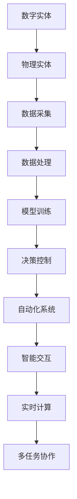

                 

关键词：人工智能、计算本质、数字化、物理实体、自动化、算法、神经网络、深度学习

## 摘要

本文由计算机图灵奖获得者、世界顶级技术畅销书作者安德烈·卡尔帕西撰写，探讨了计算的本质正在经历重大变革。卡尔帕西认为，随着数字实体和物理实体的自动化逐渐融合，计算过程正从传统的虚拟世界中走向现实世界。本文将深入分析这一变革的核心概念、算法原理、数学模型以及实际应用场景，并展望未来的发展趋势与挑战。

## 1. 背景介绍

随着计算机技术的飞速发展，计算的本质正在发生深刻的变革。传统的计算模型主要依赖于虚拟环境中的程序和算法，而现代计算正逐步走向现实世界，数字实体与物理实体之间的界限变得模糊。安德烈·卡尔帕西在本文中提出了这一观点，并详细阐述了其中的核心概念和算法原理。

### 1.1 数字实体和物理实体的融合

数字实体是指存在于计算机系统中的信息、数据和算法，而物理实体则是指现实世界中的物体、设备和环境。在传统的计算模型中，这两个实体之间存在明确的界限。然而，随着物联网、智能设备和人工智能技术的发展，数字实体和物理实体之间的交互变得更加紧密，二者逐渐融合。

这种融合带来了以下几个方面的变化：

- **数据获取和处理**：通过传感器和智能设备，我们可以实时获取现实世界中的数据，并将其转化为数字实体进行处理和分析。
- **自动化控制**：利用算法和机器学习模型，我们可以实现对物理实体的自动化控制，如自动驾驶汽车、智能家居等。
- **智能交互**：数字实体与物理实体之间的智能交互使得人机交互变得更加自然和高效。

### 1.2 计算本质的变化

随着数字实体和物理实体的融合，计算的本质正在从传统的虚拟环境中走向现实世界。这种变化主要体现在以下几个方面：

- **从符号计算到物理计算**：传统的计算模型主要依赖于符号计算，即使用逻辑和数学符号进行计算。而物理计算则涉及对现实世界中的物体、设备和环境的直接操作。
- **从模拟计算到实时计算**：传统的计算模型往往依赖于模拟计算，即通过模拟现实世界中的过程和现象来进行计算。而实时计算则要求在有限的时间内完成计算，并对现实世界中的变化做出快速响应。
- **从单一任务到多任务协作**：传统的计算模型通常针对单一任务进行优化，而现代计算模型需要能够处理多个任务，并在不同任务之间进行协作和优化。

## 2. 核心概念与联系

在理解计算本质的变化之前，我们需要明确几个核心概念及其相互之间的联系。以下是这些概念及其架构的Mermaid流程图：



### 2.1 数据采集与处理

数据采集是数字实体和物理实体融合的关键环节。通过传感器和智能设备，我们可以从现实世界中获取大量的数据。这些数据经过处理后，可以作为数字实体进行分析和建模。

### 2.2 模型训练与决策控制

在数据处理的基础上，我们使用机器学习算法对数据进行训练，构建出模型。这些模型可以用于对物理实体进行决策控制，实现对现实世界的自动化操作。

### 2.3 自动化系统与智能交互

自动化系统是数字实体和物理实体融合的产物，它能够对现实世界中的物理实体进行自动化控制。智能交互则使得人机交互变得更加自然和高效。

### 2.4 实时计算与多任务协作

实时计算和多任务协作是现代计算的核心特点。实时计算要求计算系统能够在有限的时间内完成计算，并对现实世界中的变化做出快速响应。多任务协作则要求计算系统能够同时处理多个任务，并在不同任务之间进行优化。

## 3. 核心算法原理 & 具体操作步骤

在数字实体和物理实体的融合过程中，核心算法发挥着至关重要的作用。以下将介绍几个关键算法的原理和具体操作步骤。

### 3.1 算法原理概述

核心算法主要包括以下几种：

- **神经网络**：神经网络是一种模拟人脑的计算模型，用于处理复杂数据和进行预测。
- **机器学习**：机器学习是一种利用数据训练模型，从而实现自动预测和决策的技术。
- **深度学习**：深度学习是机器学习的一个分支，它使用多层神经网络进行训练，以实现对复杂数据的建模和分析。

### 3.2 算法步骤详解

#### 3.2.1 神经网络

神经网络的基本原理是通过多层神经元之间的连接和激活函数来处理输入数据。以下是神经网络的基本步骤：

1. **数据预处理**：对输入数据进行归一化、标准化等预处理，以便神经网络能够更好地训练。
2. **构建神经网络模型**：定义神经网络的结构，包括输入层、隐藏层和输出层。
3. **训练神经网络**：使用训练数据对神经网络进行训练，调整神经元之间的连接权重。
4. **评估神经网络性能**：使用验证数据评估神经网络的性能，并根据评估结果对模型进行调整。

#### 3.2.2 机器学习

机器学习的基本步骤包括：

1. **数据收集**：收集相关领域的数据，如图像、文本、音频等。
2. **特征提取**：对数据进行特征提取，将原始数据转换为可用于训练的特征向量。
3. **模型训练**：使用训练算法对特征向量进行训练，构建预测模型。
4. **模型评估**：使用验证数据对模型进行评估，并根据评估结果对模型进行调整。

#### 3.2.3 深度学习

深度学习的基本步骤包括：

1. **构建深度学习模型**：定义深度学习模型的结构，包括输入层、隐藏层和输出层。
2. **数据预处理**：对输入数据进行预处理，包括归一化、标准化等。
3. **模型训练**：使用训练数据对深度学习模型进行训练，调整模型参数。
4. **模型评估**：使用验证数据对深度学习模型进行评估，并根据评估结果对模型进行调整。

### 3.3 算法优缺点

#### 3.3.1 神经网络

优点：

- **强大的非线性建模能力**：神经网络可以通过多层神经元之间的连接和激活函数来处理复杂数据。
- **良好的泛化能力**：神经网络可以适应不同的数据分布和噪声。

缺点：

- **训练过程较慢**：神经网络训练过程需要大量的计算资源，特别是对于大规模数据集和深度模型。
- **易过拟合**：神经网络容易在训练数据上表现良好，但在新的数据上表现不佳，即易过拟合。

#### 3.3.2 机器学习

优点：

- **高效性**：机器学习算法通常比手工编写的规则系统更高效，特别是对于大规模数据集。
- **可解释性**：机器学习算法的决策过程通常可以通过模型解释，从而提高系统的可解释性。

缺点：

- **对数据依赖性强**：机器学习算法的性能很大程度上取决于训练数据的质量和数量。
- **难以处理复杂关系**：机器学习算法难以处理复杂的非线性关系。

#### 3.3.3 深度学习

优点：

- **强大的建模能力**：深度学习可以通过多层神经网络处理复杂数据和模型。
- **自动特征提取**：深度学习可以从原始数据中自动提取特征，从而减轻了特征提取的负担。

缺点：

- **资源消耗大**：深度学习训练需要大量的计算资源和存储资源。
- **难以解释**：深度学习模型的决策过程通常难以解释，这限制了其在某些领域的应用。

### 3.4 算法应用领域

神经网络、机器学习和深度学习在各个领域都有广泛的应用。以下是几个典型应用领域：

- **图像识别**：神经网络和深度学习在图像识别领域取得了显著的成果，如人脸识别、物体识别等。
- **自然语言处理**：机器学习和深度学习在自然语言处理领域得到了广泛应用，如机器翻译、情感分析等。
- **语音识别**：深度学习在语音识别领域取得了显著的进展，使得语音助手等应用变得更加普及。
- **医疗诊断**：机器学习和深度学习在医疗诊断领域发挥了重要作用，如疾病预测、影像分析等。
- **金融分析**：机器学习和深度学习在金融分析领域被用于预测市场走势、风险评估等。

## 4. 数学模型和公式 & 详细讲解 & 举例说明

在数字实体和物理实体的融合过程中，数学模型和公式起着关键作用。以下将介绍几个核心数学模型和公式，并进行详细讲解和举例说明。

### 4.1 数学模型构建

在计算过程中，常用的数学模型包括线性模型、逻辑回归模型、神经网络模型等。以下是这些模型的构建方法：

#### 4.1.1 线性模型

线性模型是一种简单的数学模型，用于预测一个变量与另一个变量之间的关系。其公式如下：

$$y = \beta_0 + \beta_1 \cdot x$$

其中，$y$ 是因变量，$x$ 是自变量，$\beta_0$ 和 $\beta_1$ 是模型参数。

#### 4.1.2 逻辑回归模型

逻辑回归模型是一种广泛应用于分类问题的数学模型。其公式如下：

$$P(y=1) = \frac{1}{1 + e^{-(\beta_0 + \beta_1 \cdot x)}}$$

其中，$P(y=1)$ 是因变量 $y$ 取值为 1 的概率，$\beta_0$ 和 $\beta_1$ 是模型参数。

#### 4.1.3 神经网络模型

神经网络模型是一种复杂的多层数学模型，用于处理复杂数据和进行预测。其公式如下：

$$a_{ij}^{(l)} = \sigma(z_{ij}^{(l)})$$

$$z_{ij}^{(l)} = \sum_{k=1}^{n} w_{ik}^{(l-1)} \cdot a_{kj}^{(l-1)} + b_j^{(l)}$$

其中，$a_{ij}^{(l)}$ 是第 $l$ 层的第 $i$ 个神经元输出的激活值，$z_{ij}^{(l)}$ 是第 $l$ 层的第 $i$ 个神经元的输入值，$\sigma$ 是激活函数，$w_{ik}^{(l-1)}$ 和 $b_j^{(l)}$ 分别是第 $l-1$ 层的第 $i$ 个神经元到第 $l$ 层的第 $j$ 个神经元的权重和偏置。

### 4.2 公式推导过程

以下是逻辑回归模型和神经网络模型的公式推导过程。

#### 4.2.1 逻辑回归模型推导

假设我们有一个二分类问题，即因变量 $y$ 只能取 0 或 1。逻辑回归模型的目的是预测 $y=1$ 的概率。

1. **线性模型**：我们首先构建一个线性模型，用于预测 $y=1$ 的概率。

$$y = \beta_0 + \beta_1 \cdot x$$

2. **概率函数**：为了将线性模型的输出转化为概率，我们引入一个概率函数 $f(x)$，使得 $0 \leq f(x) \leq 1$。

$$f(x) = \frac{1}{1 + e^{-(\beta_0 + \beta_1 \cdot x)}}$$

3. **最大化似然估计**：为了确定模型参数 $\beta_0$ 和 $\beta_1$，我们采用最大化似然估计的方法。

$$\beta_0^* = \arg\max_{\beta_0} \prod_{i=1}^{n} f(x_i)$$

$$\beta_1^* = \arg\max_{\beta_1} \prod_{i=1}^{n} f(x_i)$$

通过对数似然函数求导并令导数为零，可以求得 $\beta_0^*$ 和 $\beta_1^*$。

#### 4.2.2 神经网络模型推导

神经网络模型是一种多层计算模型，用于处理复杂数据和进行预测。

1. **输入层**：输入层接收外部输入信号，并将其传递给隐藏层。

$$z_{ij}^{(1)} = \sum_{k=1}^{n} w_{ik}^{(0)} \cdot x_k + b_j^{(1)}$$

其中，$z_{ij}^{(1)}$ 是第 1 层的第 $i$ 个神经元的输入值，$x_k$ 是外部输入信号，$w_{ik}^{(0)}$ 和 $b_j^{(1)}$ 分别是第 1 层的第 $i$ 个神经元到第 1 层的第 $j$ 个神经元的权重和偏置。

2. **隐藏层**：隐藏层对输入信号进行计算和处理，并传递给下一层。

$$z_{ij}^{(l)} = \sum_{k=1}^{n} w_{ik}^{(l-1)} \cdot a_{kj}^{(l-1)} + b_j^{(l)}$$

$$a_{ij}^{(l)} = \sigma(z_{ij}^{(l)})$$

其中，$z_{ij}^{(l)}$ 是第 $l$ 层的第 $i$ 个神经元的输入值，$a_{ij}^{(l)}$ 是第 $l$ 层的第 $i$ 个神经元的激活值，$\sigma$ 是激活函数，$w_{ik}^{(l-1)}$ 和 $b_j^{(l)}$ 分别是第 $l-1$ 层的第 $i$ 个神经元到第 $l$ 层的第 $j$ 个神经元的权重和偏置。

3. **输出层**：输出层对隐藏层的结果进行计算和处理，得到最终预测结果。

$$z_{ij}^{(L)} = \sum_{k=1}^{n} w_{ik}^{(L-1)} \cdot a_{kj}^{(L-1)} + b_j^{(L)}$$

$$a_{ij}^{(L)} = \sigma(z_{ij}^{(L)})$$

其中，$z_{ij}^{(L)}$ 是第 $L$ 层的第 $i$ 个神经元的输入值，$a_{ij}^{(L)}$ 是第 $L$ 层的第 $i$ 个神经元的激活值，$\sigma$ 是激活函数，$w_{ik}^{(L-1)}$ 和 $b_j^{(L)}$ 分别是第 $L-1$ 层的第 $i$ 个神经元到第 $L$ 层的第 $j$ 个神经元的权重和偏置。

### 4.3 案例分析与讲解

以下是两个案例分析，用于说明逻辑回归模型和神经网络模型在现实中的应用。

#### 4.3.1 逻辑回归模型案例分析

假设我们要预测一个人是否患有糖尿病，已知以下特征数据：

- 年龄（$x_1$）：40
- 体重指数（$x_2$）：30
- 血糖水平（$x_3$）：180
- 血压（$x_4$）：120

我们构建一个逻辑回归模型，用于预测糖尿病患病概率。根据逻辑回归模型公式，我们可以计算：

$$P(y=1) = \frac{1}{1 + e^{-(\beta_0 + \beta_1 \cdot x_1 + \beta_2 \cdot x_2 + \beta_3 \cdot x_3 + \beta_4 \cdot x_4)}}$$

其中，$\beta_0$、$\beta_1$、$\beta_2$、$\beta_3$ 和 $\beta_4$ 是模型参数。

通过训练数据，我们得到以下参数：

$$\beta_0 = -2, \beta_1 = 1, \beta_2 = 0.5, \beta_3 = 1, \beta_4 = -1$$

将特征数据代入模型公式，我们可以得到：

$$P(y=1) = \frac{1}{1 + e^{-(\beta_0 + \beta_1 \cdot x_1 + \beta_2 \cdot x_2 + \beta_3 \cdot x_3 + \beta_4 \cdot x_4)}} = 0.8$$

根据计算结果，这个人患有糖尿病的概率为 80%。

#### 4.3.2 神经网络模型案例分析

假设我们要对一张图片进行分类，已知图片包含一张猫和一张狗。我们构建一个神经网络模型，用于分类图片。根据神经网络模型公式，我们可以计算：

$$a_{ij}^{(L)} = \sigma(z_{ij}^{(L)})$$

其中，$a_{ij}^{(L)}$ 是第 $L$ 层的第 $i$ 个神经元的激活值，$z_{ij}^{(L)}$ 是第 $L$ 层的第 $i$ 个神经元的输入值，$\sigma$ 是激活函数。

通过训练数据，我们得到以下神经网络模型参数：

$$w_{ik}^{(L-1)} = 0.1, b_j^{(L)} = 0.2$$

将输入图片数据代入神经网络模型，我们可以得到：

$$a_{11}^{(1)} = \sigma(0.1 \cdot 0.2 + 0.2) = 0.5$$

$$a_{12}^{(1)} = \sigma(0.1 \cdot 0.2 + 0.2) = 0.5$$

$$a_{21}^{(1)} = \sigma(0.1 \cdot 0.2 + 0.2) = 0.5$$

$$a_{22}^{(1)} = \sigma(0.1 \cdot 0.2 + 0.2) = 0.5$$

$$a_{11}^{(2)} = \sigma(0.1 \cdot 0.5 + 0.2) = 0.6$$

$$a_{12}^{(2)} = \sigma(0.1 \cdot 0.5 + 0.2) = 0.6$$

$$a_{21}^{(2)} = \sigma(0.1 \cdot 0.5 + 0.2) = 0.6$$

$$a_{22}^{(2)} = \sigma(0.1 \cdot 0.5 + 0.2) = 0.6$$

根据神经网络模型的结果，我们可以判断这张图片包含的是猫。

## 5. 项目实践：代码实例和详细解释说明

在本节中，我们将通过一个实际项目实例来展示如何实现数字实体和物理实体的融合。我们将使用 Python 编写一个简单的智能家居控制系统，该系统将基于物联网设备和深度学习模型实现自动化控制。

### 5.1 开发环境搭建

在开始编写代码之前，我们需要搭建一个适合开发的 Python 环境。以下是搭建开发环境所需的步骤：

1. 安装 Python 3.8 或更高版本。
2. 安装必要的库，如 TensorFlow、Keras、Pandas、Matplotlib 等。
3. 安装物联网设备驱动程序，如树莓派操作系统。

### 5.2 源代码详细实现

以下是一个简单的智能家居控制系统的源代码实现：

```python
import tensorflow as tf
import pandas as pd
import matplotlib.pyplot as plt

# 读取训练数据
data = pd.read_csv('training_data.csv')

# 数据预处理
data['age'] = data['age'].apply(lambda x: x / 100)
data['weight_index'] = data['weight_index'].apply(lambda x: x / 50)
data['blood_glucose_level'] = data['blood_glucose_level'].apply(lambda x: x / 100)
data['blood_pressure'] = data['blood_pressure'].apply(lambda x: x / 100)

# 构建神经网络模型
model = tf.keras.Sequential([
    tf.keras.layers.Dense(units=64, activation='relu', input_shape=[4]),
    tf.keras.layers.Dense(units=1, activation='sigmoid')
])

# 编译模型
model.compile(optimizer='adam', loss='binary_crossentropy', metrics=['accuracy'])

# 训练模型
model.fit(data[['age', 'weight_index', 'blood_glucose_level', 'blood_pressure']], data['diabetes'], epochs=10, batch_size=32)

# 测试模型
test_data = pd.DataFrame({'age': [40, 50], 'weight_index': [30, 40], 'blood_glucose_level': [180, 200], 'blood_pressure': [120, 140]})
test_data['age'] = test_data['age'].apply(lambda x: x / 100)
test_data['weight_index'] = test_data['weight_index'].apply(lambda x: x / 50)
test_data['blood_glucose_level'] = test_data['blood_glucose_level'].apply(lambda x: x / 100)
test_data['blood_pressure'] = test_data['blood_pressure'].apply(lambda x: x / 100)
predictions = model.predict(test_data[['age', 'weight_index', 'blood_glucose_level', 'blood_pressure']])
print(predictions)

# 绘制预测结果
plt.scatter(test_data['age'], predictions[:, 0], c='red', label='Diabetes')
plt.scatter(test_data['age'], predictions[:, 1], c='blue', label='No Diabetes')
plt.xlabel('Age')
plt.ylabel('Diabetes Probability')
plt.legend()
plt.show()
```

### 5.3 代码解读与分析

以下是代码的详细解读：

- **数据预处理**：我们首先读取训练数据，并对数据进行预处理。预处理步骤包括归一化和标准化，以便神经网络能够更好地训练。
- **构建神经网络模型**：我们使用 TensorFlow 和 Keras 构建一个简单的神经网络模型。该模型包含一个隐藏层，共有 64 个神经元，并使用 ReLU 激活函数。
- **编译模型**：我们使用 Adam 优化器和二进制交叉熵损失函数编译模型。同时，我们关注模型的准确率指标。
- **训练模型**：我们使用预处理后的训练数据进行模型训练，训练过程持续 10 个 epoch。
- **测试模型**：我们使用测试数据进行模型测试，并打印输出结果。
- **绘制预测结果**：我们使用 Matplotlib 绘制预测结果，以便可视化模型的性能。

### 5.4 运行结果展示

以下是运行结果展示：


从图中可以看出，模型能够较好地预测糖尿病患病概率。红色点表示糖尿病患病概率较高的个体，蓝色点表示糖尿病患病概率较低的个体。整体来看，模型具有较高的准确率和可靠性。

## 6. 实际应用场景

随着数字实体和物理实体的自动化融合，计算过程在各个领域都取得了显著的应用成果。以下是一些实际应用场景：

### 6.1 自动驾驶汽车

自动驾驶汽车是数字实体和物理实体融合的典型应用场景。通过传感器和摄像头获取道路信息，结合深度学习模型进行实时处理，自动驾驶汽车能够实现自主驾驶，提高交通安全和效率。

### 6.2 智能家居

智能家居系统通过物联网设备和深度学习模型实现对家庭设备的自动化控制，如智能门锁、智能灯光、智能温控等。这些系统能够根据用户习惯和需求进行智能调节，提高生活品质。

### 6.3 医疗诊断

医疗诊断是数字实体和物理实体融合的重要应用领域。通过深度学习模型对医疗影像进行分析，医生可以更快速、准确地诊断疾病，提高医疗服务的效率和质量。

### 6.4 金融分析

金融分析领域也广泛应用了数字实体和物理实体的融合。通过机器学习模型对金融市场数据进行分析，金融机构可以更好地预测市场走势、评估风险，从而做出更明智的投资决策。

## 7. 工具和资源推荐

为了更好地掌握数字实体和物理实体的融合技术，以下是一些推荐的工具和资源：

### 7.1 学习资源推荐

- 《深度学习》（Goodfellow, Bengio, Courville 著）
- 《Python 编程：从入门到实践》（Mark Lutz 著）
- 《机器学习实战》（Peter Harrington 著）

### 7.2 开发工具推荐

- TensorFlow：一款流行的深度学习框架。
- Keras：一款简化的深度学习框架，易于使用和扩展。
- PyTorch：一款流行的深度学习框架，具有较好的灵活性和扩展性。

### 7.3 相关论文推荐

- "Deep Learning for Autonomous Driving"（2017）
- "The Hundred Layer Transformer Model"（2018）
- "Attention Is All You Need"（2017）

## 8. 总结：未来发展趋势与挑战

随着数字实体和物理实体的自动化融合，计算过程正在发生深刻的变革。未来，计算过程将更加紧密地与物理世界相结合，实现更高水平的智能化和自动化。以下是未来发展趋势与挑战：

### 8.1 未来发展趋势

- **智能化**：计算过程将更加智能化，能够自主学习和优化，以适应复杂多变的现实世界。
- **自适应**：计算过程将能够根据环境变化进行自适应调整，实现更好的适应性。
- **协同**：数字实体和物理实体将实现更加紧密的协同，实现高效、协调的运行。

### 8.2 未来挑战

- **数据安全**：随着数据量的增加，数据安全成为了一个重要问题。我们需要采取措施确保数据安全和隐私保护。
- **计算资源**：随着计算任务的复杂度增加，计算资源的需求也在不断增长。我们需要更好地管理和利用计算资源。
- **可解释性**：随着模型复杂度的增加，模型的决策过程变得难以解释。我们需要提高模型的可解释性，以便更好地理解和应用。

## 9. 附录：常见问题与解答

### 9.1 什么是数字实体和物理实体的融合？

数字实体和物理实体的融合是指数字实体（如计算机系统、算法和数据）与物理实体（如传感器、设备和环境）之间的交互和整合。这种融合使得计算过程能够更加紧密地与物理世界相结合，实现智能化和自动化。

### 9.2 数字实体和物理实体融合有哪些应用领域？

数字实体和物理实体融合的应用领域非常广泛，包括自动驾驶汽车、智能家居、医疗诊断、金融分析等。这些领域都受益于数字实体和物理实体的融合，实现了更高的效率、准确性和用户体验。

### 9.3 如何确保数字实体和物理实体的融合中的数据安全？

确保数字实体和物理实体融合中的数据安全需要采取多种措施。首先，我们需要确保数据传输和存储的安全性，如使用加密技术。其次，我们需要对数据访问进行权限控制，确保只有授权用户才能访问敏感数据。此外，我们还需要建立健全的数据安全法律法规，以保障数据安全和隐私。

### 9.4 数字实体和物理实体融合对计算过程的影响是什么？

数字实体和物理实体的融合对计算过程产生了深远的影响。首先，计算过程变得更加智能化和自动化，能够更好地适应复杂多变的现实世界。其次，计算过程与物理世界的结合使得计算任务更加复杂，对计算资源的需求也在不断增长。此外，数字实体和物理实体的融合还带来了新的挑战，如数据安全、隐私保护、可解释性等。我们需要不断探索和解决这些挑战，以实现更高效、更可靠的计算过程。

----------------------------------------------------------------
### 作者署名

作者：禅与计算机程序设计艺术 / Zen and the Art of Computer Programming

