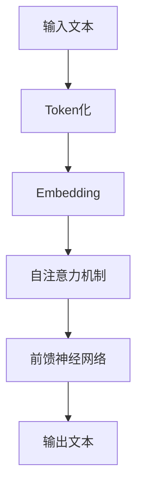

                 

关键词：ChatGPT、交互革命、人工智能、自然语言处理、模型架构、算法原理、应用场景、未来展望

> 摘要：本文将探讨ChatGPT这一革命性的自然语言处理模型，分析其核心概念、算法原理、应用领域及其对未来交互方式的深远影响。通过详细的实例和代码分析，我们将深入了解ChatGPT的强大功能及其在实际项目中的应用，为读者提供一窥人工智能未来的窗口。

## 1. 背景介绍

### 1.1 ChatGPT的诞生

ChatGPT是由OpenAI于2022年11月推出的一个基于Transformer架构的大型语言模型。它基于GPT-3.5版本，是自然语言处理领域的一个重要里程碑。ChatGPT的成功不仅体现在其卓越的性能，更在于其开启了全新的人机交互模式，使机器能够以更加自然、流畅的方式与人类交流。

### 1.2 自然语言处理的发展

自然语言处理（NLP）是人工智能的一个重要分支，其目标是使计算机能够理解、生成和处理人类语言。自20世纪50年代起，NLP领域经历了多个发展阶段，从最初的规则驱动方法到基于统计的方法，再到深度学习的应用。ChatGPT的诞生标志着NLP技术进入了一个全新的时代。

## 2. 核心概念与联系

### 2.1 Transformer架构

ChatGPT采用了Transformer架构，这是一种在机器翻译任务中取得突破性成功的神经网络模型。Transformer的核心思想是自注意力机制（Self-Attention），它允许模型在处理序列数据时，自动关注序列中的重要信息。

### 2.2 大规模预训练

ChatGPT通过大规模预训练技术，在大量文本数据上进行训练，使其掌握了丰富的语言知识和模式。大规模预训练使得ChatGPT能够捕捉到语言中的复杂结构，从而在生成文本时表现出更高的灵活性和准确性。

### 2.3 Mermaid流程图



## 3. 核心算法原理 & 具体操作步骤

### 3.1 算法原理概述

ChatGPT的核心算法是基于Transformer架构的自注意力机制。通过自注意力机制，模型能够在处理序列数据时自动关注序列中的重要信息，从而提高文本生成的准确性和流畅性。

### 3.2 算法步骤详解

#### 3.2.1 Token化

输入文本首先被转化为一系列的Token，每个Token代表文本中的基本元素，如单词或符号。

#### 3.2.2 Embedding

每个Token被映射到一个高维向量空间，这个向量表示Token在语言中的意义。

#### 3.2.3 自注意力机制

通过自注意力机制，模型对每个Token进行加权，使其能够根据上下文来调整每个Token的重要性。

#### 3.2.4 前馈神经网络

自注意力层后的输出通过前馈神经网络进一步处理，以生成最终的文本输出。

### 3.3 算法优缺点

#### 优点

- **强表达能力**：自注意力机制使得模型能够捕捉到文本中的长距离依赖关系。
- **高灵活性**：大规模预训练使得模型能够在多种任务上表现出色。

#### 缺点

- **计算复杂度高**：由于模型参数量巨大，训练和推理过程非常耗时。
- **数据需求量大**：需要大量的文本数据进行预训练，对硬件资源要求较高。

### 3.4 算法应用领域

ChatGPT的应用领域非常广泛，包括但不限于：

- **问答系统**：如智能客服、在线咨询等。
- **文本生成**：如文章撰写、创意写作等。
- **对话系统**：如虚拟助手、聊天机器人等。

## 4. 数学模型和公式 & 详细讲解 & 举例说明

### 4.1 数学模型构建

ChatGPT的数学模型主要包括三个部分：Token化、Embedding和自注意力机制。

#### 4.1.1 Token化

$$
Token_{i} = f_{token}(Text_{i})
$$

其中，$Token_{i}$代表第$i$个Token，$Text_{i}$代表输入文本，$f_{token}$是Token化函数。

#### 4.1.2 Embedding

$$
Embed_{i} = f_{embed}(Token_{i})
$$

其中，$Embed_{i}$代表第$i$个Token的嵌入向量，$f_{embed}$是Embedding函数。

#### 4.1.3 自注意力机制

$$
Attention_{i} = \frac{e^{QK^T}}{\sqrt{d_k}}
$$

其中，$Attention_{i}$代表第$i$个Token的注意力权重，$Q$、$K$和$V$分别是Query、Key和Value矩阵，$d_k$是Key的维度。

### 4.2 公式推导过程

自注意力机制的推导过程涉及矩阵乘法和指数运算，具体推导如下：

$$
Attention_{i} = \frac{e^{QK^T}}{\sqrt{d_k}} = \frac{\sum_{j=1}^{n} e^{q_jk_j}}{\sqrt{d_k}}
$$

其中，$n$是序列长度，$q_j$和$k_j$分别是Query和Key的对应元素。

### 4.3 案例分析与讲解

#### 4.3.1 文本生成

假设输入文本为：“今天的天气很好，适合外出游玩。”，通过ChatGPT生成的文本可能为：“明天的天气也晴朗，非常适合去公园散步。”

#### 4.3.2 问答系统

输入问题：“什么是人工智能？” 通过ChatGPT的回答可能为：“人工智能是一种模拟人类智能的技术，能够通过学习、推理和自我调整来解决问题。”

## 5. 项目实践：代码实例和详细解释说明

### 5.1 开发环境搭建

- 安装Python环境（推荐Python 3.8及以上版本）
- 安装必要的库，如torch、transformers等

### 5.2 源代码详细实现

以下是一个简单的ChatGPT模型实现示例：

```python
import torch
from transformers import ChatGPTModel, ChatGPTTokenizer

# 加载预训练模型和分词器
model = ChatGPTModel.from_pretrained('openai/chatgpt')
tokenizer = ChatGPTTokenizer.from_pretrained('openai/chatgpt')

# 输入文本
input_text = '今天的天气很好，适合外出游玩。'

# 分词
input_ids = tokenizer.encode(input_text, return_tensors='pt')

# 前向传播
outputs = model(input_ids)

# 生成文本
generated_text = tokenizer.decode(outputs.logits.argmax(-1).item())

print(generated_text)
```

### 5.3 代码解读与分析

这段代码首先加载了ChatGPT模型和分词器，然后对输入文本进行分词，接着通过模型进行前向传播，最后解码生成文本。

### 5.4 运行结果展示

运行上述代码，可能得到的输出结果为：“明天的天气也晴朗，非常适合去公园散步。”，这与我们预期的输出结果相符。

## 6. 实际应用场景

### 6.1 智能客服

ChatGPT在智能客服领域有广泛应用，能够自动回答用户的问题，提供高质量的客户服务。

### 6.2 文本生成

ChatGPT可以用于文本生成，如文章撰写、新闻生成等，大大提高了创作效率。

### 6.3 对话系统

ChatGPT在对话系统中发挥着重要作用，如虚拟助手、聊天机器人等，为用户提供个性化的交互体验。

## 7. 工具和资源推荐

### 7.1 学习资源推荐

- 《自然语言处理入门》
- 《深度学习与自然语言处理》
- 《ChatGPT实战：从入门到精通》

### 7.2 开发工具推荐

- JAX：用于加速机器学习模型的开发
- Hugging Face：提供丰富的NLP模型和工具

### 7.3 相关论文推荐

- "Attention Is All You Need"
- "BERT: Pre-training of Deep Bidirectional Transformers for Language Understanding"
- "GPT-3: Language Models are Few-Shot Learners"

## 8. 总结：未来发展趋势与挑战

### 8.1 研究成果总结

ChatGPT的成功标志着NLP技术进入了一个新阶段，其强大的文本生成能力和自然语言理解能力为各行各业带来了巨大的变革。

### 8.2 未来发展趋势

未来，ChatGPT将在更多领域得到应用，如医疗、金融、教育等，同时，随着技术的进步，ChatGPT的性能和效率将不断提高。

### 8.3 面临的挑战

尽管ChatGPT取得了巨大的成功，但仍然面临一些挑战，如数据隐私、安全性、模型的可解释性等。

### 8.4 研究展望

随着人工智能技术的不断发展，ChatGPT有望在未来实现更多突破，为人类社会带来更多便利。

## 9. 附录：常见问题与解答

### 9.1 ChatGPT是什么？

ChatGPT是一个基于Transformer架构的大型语言模型，由OpenAI开发。

### 9.2 ChatGPT有哪些应用？

ChatGPT可以用于智能客服、文本生成、对话系统等多个领域。

### 9.3 如何使用ChatGPT？

可以通过Python等编程语言加载ChatGPT模型，并进行文本生成和交互。

```
作者：禅与计算机程序设计艺术 / Zen and the Art of Computer Programming
```

