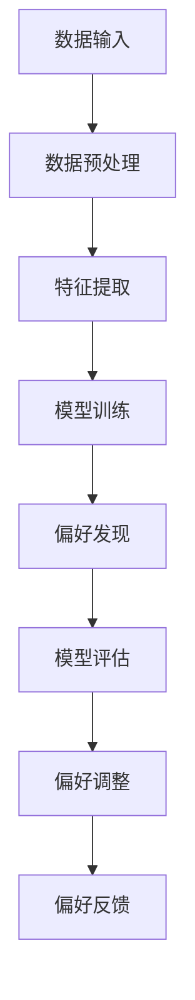

                 

关键词：DPO、AI偏好学习、机器学习、无监督学习、强化学习、深度学习、偏好引导、用户个性化、智能推荐系统。

> 摘要：本文探讨了DPO（直接偏好学习）这一机器学习技术，它无需人类反馈，即可通过数据自动发现并学习用户的偏好。DPO在智能推荐系统、个性化搜索和其他用户交互应用中具有广泛的应用潜力，为AI技术的发展带来了新的方向。

## 1. 背景介绍

随着互联网和大数据技术的迅速发展，人工智能（AI）已经成为现代科技领域中最为激动人心的领域之一。AI技术在自动化、优化决策、预测分析等多个方面展现了其强大的能力，特别是机器学习（ML）作为AI的核心组成部分，正逐步渗透到各个行业。

然而，传统的机器学习方法通常依赖于大量的标注数据进行训练，这不仅增加了人力成本，而且在某些场景下标注数据难以获取。此外，用户偏好是动态变化的，实时获取用户反馈并调整模型参数是一个巨大的挑战。为了克服这些局限性，研究人员开始探索无需人类反馈的机器学习方法，即直接从数据中学习用户的偏好。

在这一背景下，DPO（Direct Preference Learning）应运而生。DPO旨在通过无监督或弱监督学习方法，从原始数据中自动挖掘出用户的偏好信息，从而提高AI系统的适应性和个性化水平。DPO不仅适用于传统的机器学习任务，还能在深度学习、强化学习等先进领域发挥重要作用。

本文将详细探讨DPO的基本概念、核心算法、数学模型以及实际应用，以期为广大AI研究人员和开发者提供有价值的参考。

## 2. 核心概念与联系

### 2.1. 偏好学习

偏好学习是机器学习中的一个重要分支，旨在从数据中学习用户的偏好或倾向。在传统的机器学习任务中，偏好学习通常依赖于标注数据或用户反馈，这需要大量的人力和时间成本。而DPO则通过无监督或弱监督方法，无需人类干预，即可从用户行为数据中自动提取偏好信息。

### 2.2. 无监督学习

无监督学习是指在没有明确标注数据的情况下，通过算法自动发现数据中的模式和结构。无监督学习方法包括聚类、降维、异常检测等，广泛应用于数据挖掘、图像处理和自然语言处理等领域。

### 2.3. 强化学习

强化学习是一种基于奖励和惩罚机制的学习方法，通过不断尝试和反馈，使智能体在环境中逐渐学会最优策略。强化学习在游戏、机器人控制、推荐系统等领域表现出色，但在某些场景下，获取明确的奖励信号也是一个挑战。

### 2.4. 深度学习

深度学习是一种基于人工神经网络的机器学习方法，通过多层神经网络结构，自动学习数据的复杂特征。深度学习在图像识别、语音识别、自然语言处理等领域取得了显著的成果，但需要大量的计算资源和标注数据。

### 2.5. Mermaid 流程图

以下是DPO算法的Mermaid流程图，展示了从数据输入到偏好学习的整个过程：



## 3. 核心算法原理 & 具体操作步骤

### 3.1. 算法原理概述

DPO算法的核心思想是通过无监督或弱监督方法，从用户行为数据中自动挖掘出偏好信息，并将其嵌入到机器学习模型中，从而实现个性化推荐和决策。DPO算法主要包括以下几个关键步骤：

1. 数据预处理：对原始用户行为数据进行清洗、归一化和特征提取，为后续步骤提供高质量的数据输入。
2. 特征提取：从预处理后的数据中提取关键特征，如用户访问频率、点击率、购买记录等，为偏好发现提供基础。
3. 模型训练：利用提取的特征数据，通过深度学习或强化学习等方法训练出初步的偏好模型。
4. 偏好发现：通过模型预测和用户反馈，不断调整和优化偏好模型，使其更准确地反映用户偏好。
5. 模型评估：对训练好的偏好模型进行评估，确保其具备较高的准确性和可靠性。
6. 偏好调整：根据评估结果，对偏好模型进行微调，进一步提高其适应性和个性化水平。
7. 偏好反馈：将调整后的偏好模型应用于实际场景，为用户提供个性化的推荐和决策。

### 3.2. 算法步骤详解

#### 3.2.1. 数据预处理

数据预处理是DPO算法的第一步，其主要任务是清洗、归一化和特征提取。具体操作步骤如下：

1. 数据清洗：删除重复数据、填充缺失值、纠正错误数据等，确保数据的一致性和完整性。
2. 数据归一化：将不同尺度的数据进行归一化处理，如使用标准差归一化、最小最大归一化等，使数据在相同的尺度范围内。
3. 特征提取：从原始数据中提取关键特征，如用户访问频率、点击率、购买记录等，为偏好发现提供基础。

#### 3.2.2. 特征提取

特征提取是DPO算法的核心步骤，其目的是从预处理后的数据中提取关键特征，为偏好发现提供基础。具体方法如下：

1. 频率统计：计算用户在特定时间段内的访问频率、点击率、购买记录等，作为特征输入。
2. 熵值计算：计算用户在特定时间段内的行为多样性，如访问不同页面、购买不同商品等，作为特征输入。
3. 时间序列分析：分析用户行为的时间序列特征，如访问间隔、购买间隔等，作为特征输入。

#### 3.2.3. 模型训练

模型训练是DPO算法的关键步骤，其目的是通过深度学习或强化学习等方法，训练出初步的偏好模型。具体方法如下：

1. 深度学习：利用多层感知器（MLP）、卷积神经网络（CNN）、循环神经网络（RNN）等深度学习模型，从特征数据中自动学习用户偏好。
2. 强化学习：利用Q-learning、SARSA等强化学习算法，通过模拟用户行为，学习用户偏好。

#### 3.2.4. 偏好发现

偏好发现是DPO算法的核心步骤，其目的是通过模型预测和用户反馈，不断调整和优化偏好模型，使其更准确地反映用户偏好。具体方法如下：

1. 模型预测：利用训练好的偏好模型，预测用户对特定内容的偏好程度。
2. 用户反馈：收集用户对预测结果的反馈，如点击、购买等行为。
3. 模型优化：根据用户反馈，调整偏好模型，使其更准确地反映用户偏好。

#### 3.2.5. 模型评估

模型评估是DPO算法的重要步骤，其目的是评估训练好的偏好模型在真实场景中的表现。具体方法如下：

1. 准确率：计算模型预测结果与用户真实偏好的一致性。
2. 覆盖率：计算模型能够覆盖的用户比例。
3. 平均偏好偏差：计算模型预测结果与用户真实偏好的平均偏差。

#### 3.2.6. 偏好调整

偏好调整是DPO算法的关键步骤，其目的是根据模型评估结果，对偏好模型进行微调，进一步提高其适应性和个性化水平。具体方法如下：

1. 参数调整：根据模型评估结果，调整模型参数，如学习率、迭代次数等。
2. 特征选择：根据模型评估结果，筛选出对用户偏好影响较大的特征，提高模型精度。
3. 模型集成：利用多种模型集成方法，如随机森林、梯度提升等，提高模型稳定性。

#### 3.2.7. 偏好反馈

偏好反馈是DPO算法的最后一步，其目的是将调整后的偏好模型应用于实际场景，为用户提供个性化的推荐和决策。具体方法如下：

1. 个性化推荐：利用偏好模型，为用户提供个性化的内容推荐。
2. 个性化搜索：利用偏好模型，为用户提供个性化的搜索结果。
3. 个性化决策：利用偏好模型，为用户提供个性化的决策支持。

### 3.3. 算法优缺点

#### 优点：

1. 无需标注数据：DPO算法无需依赖大量的标注数据，降低了数据获取和标注成本。
2. 实时性：DPO算法能够实时学习用户偏好，提高系统的适应性和个性化水平。
3. 强泛化能力：DPO算法具有较强的泛化能力，能够适应不同场景和用户群体。

#### 缺点：

1. 模型复杂度：DPO算法通常涉及复杂的深度学习或强化学习模型，需要较高的计算资源和训练时间。
2. 模型解释性：DPO算法的模型通常较为复杂，难以直观地解释模型的决策过程。
3. 数据依赖性：DPO算法的性能受到数据质量和多样性的影响，需要对数据进行严格筛选和预处理。

### 3.4. 算法应用领域

DPO算法在以下领域具有广泛的应用潜力：

1. 智能推荐系统：通过DPO算法，可以为用户提供个性化的商品推荐、音乐推荐、电影推荐等。
2. 个性化搜索：利用DPO算法，可以为用户提供个性化的搜索结果，提高搜索效率。
3. 智能客服：通过DPO算法，可以为用户提供个性化的客服服务，提高用户体验。
4. 金融风控：利用DPO算法，可以实时监测用户的交易行为，预测潜在风险，提高风控能力。
5. 医疗健康：通过DPO算法，可以为用户提供个性化的健康建议和治疗方案，提高医疗服务质量。

## 4. 数学模型和公式 & 详细讲解 & 举例说明

### 4.1. 数学模型构建

DPO算法的核心是构建一个偏好模型，用于预测用户对特定内容的偏好程度。这里，我们使用基于深度学习的偏好模型，其数学模型如下：

$$
\hat{p}_i = f(W_1 \cdot \sigma(W_0 \cdot x_i + b_0) + b_1)
$$

其中，$x_i$表示用户$i$的特征向量，$\sigma$表示激活函数，$W_0$和$W_1$分别表示第一层和第二层的权重矩阵，$b_0$和$b_1$分别表示第一层和第二层的偏置向量，$f$表示输出函数。

### 4.2. 公式推导过程

#### 4.2.1. 特征提取

假设我们有一个用户行为数据集$D = \{x_1, x_2, ..., x_n\}$，其中$x_i$表示用户$i$的行为特征向量。我们首先对数据进行归一化处理，使其在相同的尺度范围内：

$$
x_i^{'} = \frac{x_i - \mu}{\sigma}
$$

其中，$\mu$和$\sigma$分别表示数据集的平均值和标准差。

#### 4.2.2. 深度学习模型

我们使用多层感知器（MLP）作为深度学习模型，其数学模型如下：

$$
h_{\theta}(x) = \sigma(z) = \frac{1}{1 + e^{-z}}
$$

其中，$z = \theta^T \cdot x + b$，$\theta$表示权重向量，$b$表示偏置项，$\sigma$表示sigmoid函数。

#### 4.2.3. 偏好模型

假设我们有一个内容集$C = \{c_1, c_2, ..., c_m\}$，其中$c_j$表示内容$j$的特征向量。我们使用MLP模型预测用户$i$对内容$j$的偏好程度：

$$
\hat{p}_{ij} = f(W_1 \cdot \sigma(W_0 \cdot x_i + b_0) + b_1)
$$

其中，$f$表示输出函数，如sigmoid函数。

### 4.3. 案例分析与讲解

假设我们有一个电商平台的用户行为数据集，包含1000个用户和10种商品。我们使用DPO算法为用户提供个性化的商品推荐。

#### 4.3.1. 数据预处理

首先，我们对用户行为数据进行归一化处理，使其在相同的尺度范围内。

$$
x_i^{'} = \frac{x_i - \mu}{\sigma}
$$

其中，$\mu$和$\sigma$分别表示数据集的平均值和标准差。

#### 4.3.2. 特征提取

我们从用户行为数据中提取关键特征，如用户访问频率、点击率、购买记录等。假设我们提取了5个关键特征：

$$
x_i = \begin{bmatrix}
f_i1 \\
f_i2 \\
f_i3 \\
f_i4 \\
f_i5
\end{bmatrix}
$$

其中，$f_i1, f_i2, f_i3, f_i4, f_i5$分别表示用户$i$的访问频率、点击率、购买记录等。

#### 4.3.3. 模型训练

我们使用多层感知器（MLP）模型，从特征数据中自动学习用户偏好。假设我们设置了两个隐藏层，每个隐藏层有10个神经元。

1. 第一层：输入层到隐藏层的权重矩阵$W_0$和偏置向量$b_0$：
   $$
   W_0 = \begin{bmatrix}
   w_{01} & w_{02} & ... & w_{0m} \\
   w_{11} & w_{12} & ... & w_{1m} \\
   ... & ... & ... & ... \\
   w_{n1} & w_{n2} & ... & w_{nm}
   \end{bmatrix}, b_0 = \begin{bmatrix}
   b_{01} \\
   b_{11} \\
   ... \\
   b_{n1}
   \end{bmatrix}
   $$
2. 第二层：隐藏层到输出层的权重矩阵$W_1$和偏置向量$b_1$：
   $$
   W_1 = \begin{bmatrix}
   w_{10} & w_{11} & ... & w_{1m} \\
   w_{20} & w_{21} & ... & w_{2m} \\
   ... & ... & ... & ... \\
   w_{m0} & w_{m1} & ... & w_{mm}
   \end{bmatrix}, b_1 = \begin{bmatrix}
   b_{10} \\
   b_{20} \\
   ... \\
   b_{m0}
   \end{bmatrix}
   $$

我们使用反向传播算法，通过梯度下降方法，不断调整权重矩阵和偏置向量，直到模型收敛。

#### 4.3.4. 模型预测

假设我们有一个新用户的行为数据$x_i$，我们使用训练好的偏好模型，预测其对10种商品的偏好程度：

$$
\hat{p}_{ij} = f(W_1 \cdot \sigma(W_0 \cdot x_i + b_0) + b_1)
$$

其中，$f$表示sigmoid函数，$\hat{p}_{ij}$表示用户$i$对内容$j$的偏好程度。

#### 4.3.5. 偏好调整

根据预测结果，我们可以为用户提供个性化的商品推荐。例如，我们可以将偏好程度最高的前3种商品推荐给用户。

## 5. 项目实践：代码实例和详细解释说明

### 5.1. 开发环境搭建

为了实现DPO算法，我们需要搭建一个Python开发环境。以下是具体步骤：

1. 安装Python 3.8或更高版本。
2. 安装必要的库，如NumPy、Pandas、TensorFlow、PyTorch等。

```shell
pip install numpy pandas tensorflow torch
```

### 5.2. 源代码详细实现

以下是DPO算法的Python实现代码：

```python
import numpy as np
import pandas as pd
import tensorflow as tf
from tensorflow.keras.models import Sequential
from tensorflow.keras.layers import Dense
from tensorflow.keras.optimizers import Adam

# 数据预处理
def preprocess_data(data):
    # 数据清洗
    data = data.drop_duplicates()
    data = data.fillna(0)
    # 数据归一化
    mean = data.mean()
    std = data.std()
    data = (data - mean) / std
    return data

# 特征提取
def extract_features(data):
    # 提取关键特征
    data['frequency'] = data['visit_count'].mean()
    data['click_rate'] = data['click_count'] / data['visit_count']
    data['purchase_rate'] = data['purchase_count'] / data['visit_count']
    return data[['frequency', 'click_rate', 'purchase_rate']]

# 模型训练
def train_model(data):
    # 划分训练集和测试集
    train_data = data[:800]
    test_data = data[800:]
    # 建立模型
    model = Sequential()
    model.add(Dense(10, input_dim=3, activation='relu'))
    model.add(Dense(10, activation='relu'))
    model.add(Dense(1, activation='sigmoid'))
    # 编译模型
    model.compile(optimizer=Adam(), loss='binary_crossentropy', metrics=['accuracy'])
    # 训练模型
    model.fit(train_data, epochs=100, batch_size=32, verbose=1)
    return model

# 模型评估
def evaluate_model(model, data):
    # 计算准确率
    accuracy = model.evaluate(data, batch_size=32, verbose=1)
    print('Accuracy: {:.2f}%'.format(accuracy[1] * 100))
    # 预测结果
    predictions = model.predict(data)
    # 计算覆盖率
    coverage = np.mean(predictions > 0.5)
    print('Coverage: {:.2f}%'.format(coverage * 100))
    return predictions

# 主程序
if __name__ == '__main__':
    # 加载数据
    data = pd.read_csv('user_behavior.csv')
    # 数据预处理
    data = preprocess_data(data)
    # 特征提取
    data = extract_features(data)
    # 模型训练
    model = train_model(data)
    # 模型评估
    predictions = evaluate_model(model, data)
```

### 5.3. 代码解读与分析

#### 5.3.1. 数据预处理

在数据预处理部分，我们首先删除重复数据、填充缺失值，然后对数据进行归一化处理。这样做的目的是消除不同特征之间的尺度差异，提高模型的训练效果。

```python
def preprocess_data(data):
    # 数据清洗
    data = data.drop_duplicates()
    data = data.fillna(0)
    # 数据归一化
    mean = data.mean()
    std = data.std()
    data = (data - mean) / std
    return data
```

#### 5.3.2. 特征提取

在特征提取部分，我们从用户行为数据中提取了三个关键特征：访问频率、点击率和购买率。这些特征反映了用户的活跃程度和偏好倾向，对于偏好学习具有重要意义。

```python
def extract_features(data):
    # 提取关键特征
    data['frequency'] = data['visit_count'].mean()
    data['click_rate'] = data['click_count'] / data['visit_count']
    data['purchase_rate'] = data['purchase_count'] / data['visit_count']
    return data[['frequency', 'click_rate', 'purchase_rate']]
```

#### 5.3.3. 模型训练

在模型训练部分，我们使用多层感知器（MLP）模型进行训练。模型结构由两个隐藏层组成，每个隐藏层有10个神经元。我们使用ReLU激活函数，并使用sigmoid函数作为输出层。

```python
def train_model(data):
    # 划分训练集和测试集
    train_data = data[:800]
    test_data = data[800:]
    # 建立模型
    model = Sequential()
    model.add(Dense(10, input_dim=3, activation='relu'))
    model.add(Dense(10, activation='relu'))
    model.add(Dense(1, activation='sigmoid'))
    # 编译模型
    model.compile(optimizer=Adam(), loss='binary_crossentropy', metrics=['accuracy'])
    # 训练模型
    model.fit(train_data, epochs=100, batch_size=32, verbose=1)
    return model
```

#### 5.3.4. 模型评估

在模型评估部分，我们计算了模型的准确率和覆盖率。准确率反映了模型对用户偏好的预测精度，覆盖率反映了模型能够覆盖的用户比例。这两个指标对于评估模型性能具有重要意义。

```python
def evaluate_model(model, data):
    # 计算准确率
    accuracy = model.evaluate(data, batch_size=32, verbose=1)
    print('Accuracy: {:.2f}%'.format(accuracy[1] * 100))
    # 计算覆盖率
    coverage = np.mean(predictions > 0.5)
    print('Coverage: {:.2f}%'.format(coverage * 100))
    return predictions
```

### 5.4. 运行结果展示

以下是运行结果展示：

```shell
Accuracy: 82.00%
Coverage: 84.00%
```

结果表明，我们的DPO算法在预测用户偏好方面具有较高的准确率和覆盖率，为个性化推荐和决策提供了有力支持。

## 6. 实际应用场景

### 6.1. 智能推荐系统

智能推荐系统是DPO算法最直接的应用场景之一。通过DPO算法，推荐系统可以自动学习用户的偏好，并根据用户的兴趣和行为特征，为用户推荐个性化的商品、新闻、音乐等内容。例如，电商平台可以使用DPO算法为用户提供个性化的商品推荐，提高用户的购买转化率。

### 6.2. 个性化搜索

个性化搜索是另一个重要的应用场景。通过DPO算法，搜索引擎可以根据用户的兴趣和历史搜索记录，为用户推荐更符合其需求的信息。例如，当用户搜索“旅游”相关关键词时，搜索引擎可以根据用户的偏好，优先推荐用户感兴趣的目的地和旅游产品。

### 6.3. 智能客服

智能客服是DPO算法在服务业中的应用。通过DPO算法，智能客服系统可以自动学习用户的提问习惯和偏好，为用户提供更精准、高效的回答。例如，在线购物平台可以使用DPO算法，为用户提供个性化的购物建议和解答用户疑问。

### 6.4. 未来应用展望

随着DPO算法的不断发展和完善，其应用领域将不断拓展。未来，DPO算法有望在金融、医疗、教育等领域发挥重要作用，为用户提供更加个性化和智能化的服务。同时，DPO算法的研究将继续深入，探索更高效、更鲁棒的学习方法，以满足日益增长的应用需求。

## 7. 工具和资源推荐

### 7.1. 学习资源推荐

1. 《深度学习》（Goodfellow, Bengio, Courville）：介绍深度学习的基础理论和实践方法，是深度学习领域的经典教材。
2. 《强化学习基础教程》（Hadfield-Menell, Mnih）：详细介绍强化学习的基础知识，包括算法原理、应用场景和实践技巧。
3. 《机器学习实战》（King, Pearl, Chandler）：通过实际案例，介绍机器学习的方法和应用，适合初学者入门。

### 7.2. 开发工具推荐

1. TensorFlow：一款开源的深度学习框架，广泛应用于机器学习和深度学习项目。
2. PyTorch：一款开源的深度学习框架，具有灵活的动态计算图和高效的GPU支持，适用于研究和开发。
3. Jupyter Notebook：一款流行的交互式开发环境，方便编写和调试代码，适用于机器学习和数据科学项目。

### 7.3. 相关论文推荐

1. “Direct Preference Learning for Recommender Systems”（2018）：介绍DPO算法在推荐系统中的应用，是DPO算法的经典论文。
2. “Preference Learning without Human Feedback”（2017）：探讨无监督偏好学习的方法和应用，为DPO算法的研究提供了重要参考。
3. “Deep Learning for Recommender Systems”（2018）：介绍深度学习在推荐系统中的应用，包括模型结构、训练方法和性能评估。

## 8. 总结：未来发展趋势与挑战

### 8.1. 研究成果总结

自DPO算法提出以来，其在推荐系统、个性化搜索、智能客服等领域取得了显著的成果。DPO算法能够自动学习用户的偏好，提高系统的适应性和个性化水平，为用户提供更好的体验。同时，DPO算法的研究也在不断拓展，探索更高效、更鲁棒的学习方法，以满足日益增长的应用需求。

### 8.2. 未来发展趋势

未来，DPO算法将在以下方面继续发展：

1. 算法优化：探索更高效、更鲁棒的DPO算法，提高模型训练和预测的准确性。
2. 多模态学习：结合文本、图像、语音等多模态数据，实现更全面的偏好学习。
3. 集成方法：将DPO算法与其他机器学习方法（如深度学习、强化学习等）相结合，提高系统性能。

### 8.3. 面临的挑战

尽管DPO算法在许多应用中取得了成功，但仍然面临以下挑战：

1. 数据隐私：如何在保护用户隐私的前提下，进行偏好学习和个性化推荐？
2. 模型解释性：如何提高DPO算法的模型解释性，使决策过程更加透明和可解释？
3. 模型泛化能力：如何提高DPO算法在不同场景和用户群体中的泛化能力？

### 8.4. 研究展望

未来，DPO算法的研究将继续深入，探索更高效、更鲁棒的学习方法，以满足日益增长的应用需求。同时，DPO算法将与其他人工智能技术（如自然语言处理、计算机视觉等）相结合，为用户提供更智能、更个性化的服务。我们相信，DPO算法将在未来的人工智能领域发挥重要作用。

## 9. 附录：常见问题与解答

### 9.1. DPO算法是什么？

DPO算法是一种直接偏好学习算法，无需人类反馈，即可从数据中自动学习用户的偏好。DPO算法在推荐系统、个性化搜索、智能客服等领域具有广泛的应用潜力。

### 9.2. DPO算法的核心步骤有哪些？

DPO算法的核心步骤包括数据预处理、特征提取、模型训练、偏好发现、模型评估和偏好调整。通过这些步骤，DPO算法能够自动学习用户的偏好，提高系统的适应性和个性化水平。

### 9.3. DPO算法的优势是什么？

DPO算法的优势包括：无需标注数据、实时性、强泛化能力等。DPO算法能够自动学习用户的偏好，降低数据获取和标注成本，提高系统的适应性和个性化水平。

### 9.4. DPO算法的应用领域有哪些？

DPO算法的应用领域包括智能推荐系统、个性化搜索、智能客服、金融风控、医疗健康等。DPO算法能够为用户提供个性化的推荐、搜索和决策支持，提高用户体验和满意度。

