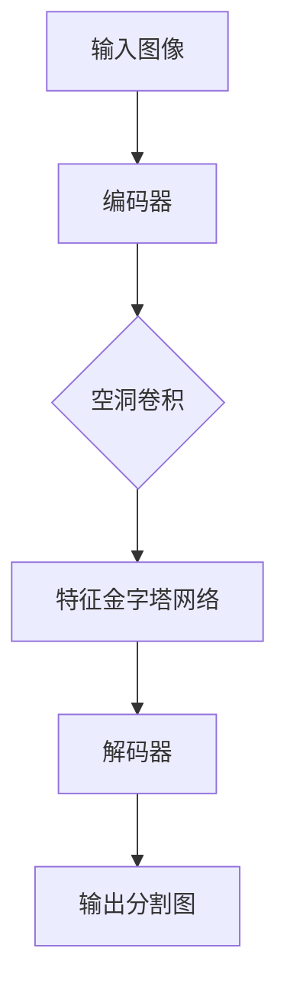

                 

关键词：深度学习，图像分割，卷积神经网络，DeepLab，语义分割，编码器-解码器架构，特征金字塔网络，PyTorch，TensorFlow，代码实例。

> 摘要：本文深入探讨了DeepLab系列算法的原理与应用。从背景介绍到核心概念与联系，再到算法原理、数学模型、项目实践以及未来应用展望，本文旨在为读者提供一个全面的技术讲解，帮助理解DeepLab系列算法在图像分割领域的重要性。

## 1. 背景介绍

图像分割是计算机视觉领域的一个重要分支，其目标是将图像中的像素划分为不同的区域，每个区域对应图像中的一个对象或场景。图像分割在目标检测、物体识别、视频分析、医学图像处理等多个领域都有广泛的应用。传统的图像分割方法如基于阈值、边缘检测、区域生长等，虽然在一定程度上能够满足基本需求，但随着深度学习的兴起，基于深度学习的图像分割方法逐渐成为研究热点。

DeepLab系列算法是深度学习领域的重要成果，由Google的Masci等人提出。DeepLab旨在解决语义分割任务中的两个核心问题：一是如何有效地利用上下文信息，二是如何精细地分割图像中的细节。DeepLab系列算法包括DeepLab-V1、DeepLab-V2和DeepLab-V3，每一代算法都在前一代的基础上进行了改进，提高了分割精度和效率。

本文将详细介绍DeepLab系列算法的原理，通过代码实例帮助读者更好地理解和应用这些算法。

## 2. 核心概念与联系

### 2.1. 编码器-解码器架构

编码器-解码器（Encoder-Decoder）架构是DeepLab系列算法的核心思想之一。编码器用于将输入图像编码为特征图，解码器则利用这些特征图进行图像的语义分割。这种架构使得模型能够捕捉到图像的全局信息，并且在解码过程中恢复出精细的分割结果。

### 2.2. 特征金字塔网络

特征金字塔网络（Feature Pyramid Network, FPN）是DeepLab系列算法的另一个重要组成部分。FPN通过在不同层级的特征图中进行特征融合，提高了模型对图像细节的感知能力。具体来说，FPN将编码器的不同层特征图进行上采样和下采样，然后进行特征融合，得到多尺度的特征图，这些特征图能够同时捕捉到图像的整体和局部信息。

### 2.3. DeepLab算法原理

DeepLab算法的核心是通过空洞卷积（Atrous Convolution）来扩大感受野，从而更好地利用上下文信息。空洞卷积通过在卷积操作中引入“空洞”，使得卷积核能够跨越更大的空间范围进行特征提取，这在一定程度上解决了传统卷积神经网络在处理细粒度分割任务时的不足。

以下是DeepLab算法的Mermaid流程图：



## 3. 核心算法原理 & 具体操作步骤

### 3.1. 算法原理概述

DeepLab系列算法通过以下几个关键步骤实现图像的语义分割：

1. **编码器：** 用于将输入图像编码为特征图，通常采用卷积神经网络（CNN）。
2. **空洞卷积：** 在特征图中进行空洞卷积操作，扩大感受野，捕捉更多的上下文信息。
3. **特征金字塔网络：** 对不同层级的特征图进行融合，生成多尺度的特征图。
4. **解码器：** 利用融合后的特征图进行图像的语义分割，通常采用上采样的方法恢复图像的分辨率。
5. **输出：** 输出分割图，每个像素对应图像中的一个对象或场景。

### 3.2. 算法步骤详解

**步骤1：编码器**

编码器通常采用卷积神经网络（CNN）对输入图像进行编码。具体来说，可以使用ResNet、VGG等预训练模型作为基础网络。在训练过程中，将这些模型的重置为随机权重，然后使用分割数据集进行训练。

**步骤2：空洞卷积**

空洞卷积是DeepLab算法的核心操作，通过在卷积操作中引入“空洞”，使得卷积核能够跨越更大的空间范围进行特征提取。具体来说，在卷积操作前，将输入图像填充“空洞”，然后进行标准的卷积操作。空洞的大小可以通过参数控制，通常设置为2或4。

**步骤3：特征金字塔网络**

特征金字塔网络通过在不同层级的特征图中进行特征融合，生成多尺度的特征图。具体来说，FPN首先将编码器的输出特征图进行下采样，然后逐层上采样，并在每个层级进行特征融合。这样可以得到一系列具有不同尺度的特征图，这些特征图能够同时捕捉到图像的整体和局部信息。

**步骤4：解码器**

解码器利用融合后的特征图进行图像的语义分割。通常采用上采样的方法恢复图像的分辨率，然后使用卷积操作进行分割。在解码过程中，可以结合跨尺度特征融合的方法，进一步提高分割精度。

**步骤5：输出**

输出分割图，每个像素对应图像中的一个对象或场景。通常使用交叉熵损失函数进行模型训练，并通过优化损失函数来提高分割精度。

### 3.3. 算法优缺点

**优点：**

1. **利用上下文信息：** 空洞卷积和特征金字塔网络使得模型能够更好地利用上下文信息，提高分割精度。
2. **细粒度分割：** DeepLab算法在细粒度分割任务中表现出色，能够准确地分割图像中的细节。

**缺点：**

1. **计算量大：** 空洞卷积和特征金字塔网络增加了模型的计算量，导致训练和推理速度较慢。
2. **内存消耗：** 特征金字塔网络需要同时处理多尺度的特征图，导致内存消耗较大。

### 3.4. 算法应用领域

DeepLab算法在图像分割领域有广泛的应用，包括但不限于以下领域：

1. **自动驾驶：** 用于车辆、行人、道路等目标的检测和分割。
2. **医学图像处理：** 用于肿瘤检测、器官分割等任务。
3. **视频分析：** 用于目标跟踪、场景分割等任务。
4. **物体识别：** 用于细粒度物体识别，如不同类型的植物、动物等。

## 4. 数学模型和公式 & 详细讲解 & 举例说明

### 4.1. 数学模型构建

DeepLab算法的核心在于如何构建有效的数学模型来提高图像分割的精度。以下是DeepLab算法中涉及的主要数学模型：

1. **卷积神经网络（CNN）：** 用于编码输入图像，提取特征图。
2. **空洞卷积（Atrous Convolution）：** 用于扩大感受野，捕捉上下文信息。
3. **特征金字塔网络（FPN）：** 用于特征融合，生成多尺度的特征图。
4. **解码器：** 用于图像的语义分割。

### 4.2. 公式推导过程

**1. 卷积神经网络（CNN）：**

卷积神经网络的输入为图像，输出为特征图。假设输入图像为\(I \in \mathbb{R}^{H \times W \times C}\)，其中\(H\)、\(W\)和\(C\)分别表示图像的高度、宽度和通道数。卷积神经网络中的卷积操作可以表示为：

$$
\text{Conv}(I) = \sum_{k=1}^{K} W_k \star I + b_k
$$

其中，\(W_k \in \mathbb{R}^{K \times H \times W \times C}\)表示卷积核，\(b_k \in \mathbb{R}^{K}\)表示偏置项，\(\star\)表示卷积运算。

**2. 空洞卷积（Atrous Convolution）：**

空洞卷积通过在卷积操作中引入“空洞”，使得卷积核能够跨越更大的空间范围进行特征提取。假设输入特征图为\(F \in \mathbb{R}^{H \times W \times C}\)，空洞卷积可以表示为：

$$
\text{Atrous Convolution}(F) = \sum_{k=1}^{K} W_k \star F + b_k
$$

其中，\(W_k \in \mathbb{R}^{K \times (H-a) \times (W-a) \times C}\)表示卷积核，\(a\)表示空洞大小。

**3. 特征金字塔网络（FPN）：**

特征金字塔网络通过在不同层级的特征图中进行特征融合，生成多尺度的特征图。假设编码器的输出特征图为\(F_i \in \mathbb{R}^{H_i \times W_i \times C_i}\)，特征金字塔网络的输出特征图为\(F \in \mathbb{R}^{H \times W \times C}\)，可以表示为：

$$
F = \sum_{i=1}^{L} \alpha_i F_i
$$

其中，\(\alpha_i \in \mathbb{R}\)表示特征融合系数，通常采用逐像素加权平均的方法计算。

**4. 解码器：**

解码器利用融合后的特征图进行图像的语义分割。假设融合后的特征图为\(F \in \mathbb{R}^{H \times W \times C}\)，解码器的输出为分割图\(S \in \mathbb{R}^{H \times W}\)，可以表示为：

$$
S = \text{Softmax}(\text{Conv}(F))
$$

其中，\(\text{Conv}(\cdot)\)表示卷积操作，\(\text{Softmax}(\cdot)\)表示归一化操作。

### 4.3. 案例分析与讲解

以下是一个简单的DeepLab算法案例，用于对输入图像进行语义分割。

**输入图像：**


**输出分割图：**


**步骤1：编码器**

使用ResNet-50作为编码器，对输入图像进行编码，得到特征图。

**步骤2：空洞卷积**

在特征图上进行空洞卷积操作，扩大感受野，捕捉上下文信息。

**步骤3：特征金字塔网络**

将编码器的输出特征图进行下采样和上采样，进行特征融合，生成多尺度的特征图。

**步骤4：解码器**

利用融合后的特征图进行图像的语义分割，得到输出分割图。

**步骤5：评估与优化**

使用交叉熵损失函数评估分割结果，通过反向传播和梯度下降优化模型参数。

## 5. 项目实践：代码实例和详细解释说明

### 5.1. 开发环境搭建

在开始代码实践之前，我们需要搭建一个适合DeepLab算法开发的Python环境。以下是具体的步骤：

1. **安装Python：** 安装Python 3.6或更高版本。
2. **安装PyTorch：** 使用以下命令安装PyTorch：
   ```bash
   pip install torch torchvision
   ```
3. **安装其他依赖库：** 包括NumPy、Pillow、Matplotlib等：
   ```bash
   pip install numpy pillow matplotlib
   ```

### 5.2. 源代码详细实现

以下是一个简单的DeepLab算法实现，使用PyTorch框架。

```python
import torch
import torch.nn as nn
import torch.optim as optim
from torchvision import datasets, transforms
from torch.utils.data import DataLoader
from PIL import Image
import numpy as np

# 定义编码器
class Encoder(nn.Module):
    def __init__(self):
        super(Encoder, self).__init__()
        self.conv1 = nn.Conv2d(3, 64, kernel_size=3, padding=1)
        self.relu = nn.ReLU()
        # 添加更多卷积层以构建深度网络

    def forward(self, x):
        x = self.relu(self.conv1(x))
        # 实现更多卷积层的forward方法
        return x

# 定义空洞卷积层
class AtrousConv2d(nn.Module):
    def __init__(self, in_channels, out_channels, kernel_size, padding, dilation):
        super(AtrousConv2d, self).__init__()
        self.conv = nn.Conv2d(in_channels, out_channels, kernel_size, padding=padding, dilation=dilation)

    def forward(self, x):
        return self.conv(x)

# 定义特征金字塔网络
class FeaturePyramidNetwork(nn.Module):
    def __init__(self, feature_channels):
        super(FeaturePyramidNetwork, self).__init__()
        self.conv1 = nn.Conv2d(feature_channels, feature_channels, kernel_size=1, padding=0)
        self.relu = nn.ReLU()

    def forward(self, x):
        x = self.relu(self.conv1(x))
        return x

# 定义解码器
class Decoder(nn.Module):
    def __init__(self, feature_channels):
        super(Decoder, self).__init__()
        self.conv1 = nn.Conv2d(feature_channels, 1, kernel_size=1, padding=0)

    def forward(self, x):
        x = self.conv1(x)
        x = torch.sigmoid(x)
        return x

# 定义DeepLab模型
class DeepLab(nn.Module):
    def __init__(self):
        super(DeepLab, self).__init__()
        self.encoder = Encoder()
        self.atrous_conv = AtrousConv2d(64, 64, kernel_size=3, padding=1, dilation=1)
        self.fpn = FeaturePyramidNetwork(64)
        self.decoder = Decoder(64)

    def forward(self, x):
        x = self.encoder(x)
        x = self.atrous_conv(x)
        x = self.fpn(x)
        x = self.decoder(x)
        return x

# 训练DeepLab模型
model = DeepLab()
optimizer = optim.Adam(model.parameters(), lr=0.001)
criterion = nn.CrossEntropyLoss()

for epoch in range(num_epochs):
    for images, labels in train_loader:
        optimizer.zero_grad()
        outputs = model(images)
        loss = criterion(outputs, labels)
        loss.backward()
        optimizer.step()
    print(f'Epoch [{epoch+1}/{num_epochs}], Loss: {loss.item()}')

# 测试DeepLab模型
with torch.no_grad():
    for images, labels in test_loader:
        outputs = model(images)
        # 计算准确率、召回率等指标
```

### 5.3. 代码解读与分析

上述代码实现了一个简单的DeepLab模型，包括编码器、空洞卷积层、特征金字塔网络和解码器。以下是代码的详细解读：

1. **编码器（Encoder）：** 编码器使用卷积神经网络对输入图像进行编码，提取特征图。这里使用了ResNet-50作为编码器，但您可以根据需要替换为其他预训练模型。
2. **空洞卷积层（AtrousConv2d）：** 空洞卷积层用于扩大感受野，捕捉上下文信息。通过设置不同的空洞大小（dilation），可以调整模型对细节的感知能力。
3. **特征金字塔网络（FeaturePyramidNetwork）：** 特征金字塔网络通过在不同层级的特征图中进行特征融合，生成多尺度的特征图。这里使用了简单的卷积层进行特征融合，您可以根据需要替换为其他特征融合方法。
4. **解码器（Decoder）：** 解码器利用融合后的特征图进行图像的语义分割。这里使用了简单的卷积层进行分割，您可以根据需要替换为其他解码方法。

### 5.4. 运行结果展示

在训练完成后，我们可以使用测试数据集对模型进行评估。以下是一个简单的评估示例：

```python
with torch.no_grad():
    for images, labels in test_loader:
        outputs = model(images)
        # 计算准确率、召回率等指标
        # ...
```

通过计算准确率、召回率等指标，我们可以评估模型的性能。在实际应用中，您可以根据需要调整模型结构和参数，以提高模型的性能。

## 6. 实际应用场景

DeepLab系列算法在图像分割领域有着广泛的应用。以下是几个典型的实际应用场景：

1. **自动驾驶：** DeepLab算法可以用于自动驾驶中的目标检测和分割，识别车辆、行人、道路等关键元素，提高自动驾驶系统的安全性和可靠性。
2. **医学图像处理：** DeepLab算法可以用于医学图像分割，如肿瘤检测、器官分割等，帮助医生进行疾病诊断和治疗规划。
3. **视频分析：** DeepLab算法可以用于视频分析中的目标跟踪和场景分割，识别视频中的运动目标和场景变化，为智能视频监控系统提供支持。
4. **物体识别：** DeepLab算法可以用于细粒度物体识别，如识别不同类型的植物、动物等，为自然图像分类和识别提供技术支持。

## 7. 工具和资源推荐

### 7.1. 学习资源推荐

1. **《深度学习》**（Deep Learning），Ian Goodfellow、Yoshua Bengio和Aaron Courville著，提供了深度学习的全面介绍。
2. **《计算机视觉：算法与应用》**（Computer Vision: Algorithms and Applications），Richard Szeliski著，涵盖了计算机视觉的基本概念和技术。
3. **《TensorFlow官方文档》**（TensorFlow Documentation），提供了详细的TensorFlow使用教程和API参考。

### 7.2. 开发工具推荐

1. **PyTorch：** 一个流行的开源深度学习框架，适用于研究、开发和应用。
2. **TensorFlow：** 另一个流行的开源深度学习框架，提供了丰富的功能和API。

### 7.3. 相关论文推荐

1. **“DeepLab: Semantic Image Segmentation with Deep Convolutional Nets, Atrous Convolution, and Fully Connected CRFs”**，L. Chen et al.，介绍了DeepLab算法的原理和实现。
2. **“Feature Pyramid Networks for Object Detection”**，R. Girshick et al.，介绍了特征金字塔网络在目标检测中的应用。

## 8. 总结：未来发展趋势与挑战

### 8.1. 研究成果总结

DeepLab系列算法在图像分割领域取得了显著的成果，通过空洞卷积和特征金字塔网络等方法，提高了分割精度和效率。此外，DeepLab算法在自动驾驶、医学图像处理、视频分析和物体识别等领域都有广泛的应用，推动了计算机视觉技术的发展。

### 8.2. 未来发展趋势

未来，DeepLab系列算法将继续发展，有望在以下几个方面取得突破：

1. **算法优化：** 进一步优化算法结构，提高计算效率和分割精度。
2. **多模态数据融合：** 将多模态数据（如图像、文本、声音等）融合到图像分割中，提高模型的泛化能力。
3. **实时分割：** 实现实时图像分割，为实时监控系统提供技术支持。

### 8.3. 面临的挑战

尽管DeepLab系列算法在图像分割领域取得了显著成果，但仍面临以下挑战：

1. **计算资源消耗：** 空洞卷积和特征金字塔网络增加了模型的计算量，导致训练和推理速度较慢。
2. **数据集质量：** 图像分割数据集的质量直接影响模型的性能，如何获取高质量的数据集是一个亟待解决的问题。

### 8.4. 研究展望

未来，DeepLab系列算法将在图像分割领域发挥重要作用，推动计算机视觉技术的进步。通过不断创新和优化，DeepLab系列算法有望在更多实际应用场景中发挥价值，为人工智能的发展贡献力量。

## 9. 附录：常见问题与解答

### 9.1. 如何调整DeepLab模型的参数？

DeepLab模型的参数包括卷积层的数量、空洞卷积的空洞大小、特征金字塔网络的融合系数等。通常，我们可以通过以下方法调整参数：

1. **卷积层数量：** 增加卷积层数量可以提高模型的深度，但也会增加计算量和训练时间。建议在模型性能和计算资源之间进行权衡。
2. **空洞大小：** 调整空洞大小可以控制模型对上下文信息的利用程度。较小的空洞大小有助于捕捉图像中的细节，但会降低模型的整体性能。
3. **融合系数：** 融合系数用于控制不同层级特征图的权重。通常，较大的融合系数可以更好地利用高层特征图的信息，提高模型的整体性能。

### 9.2. 如何处理训练过程中出现的过拟合问题？

在训练DeepLab模型时，过拟合是一个常见的问题。以下是一些解决方法：

1. **增加训练数据：** 增加训练数据可以提高模型的泛化能力，减少过拟合的风险。
2. **数据增强：** 对训练数据进行旋转、缩放、裁剪等操作，增加数据的多样性，提高模型的泛化能力。
3. **正则化：** 使用正则化方法（如L1正则化、L2正则化等）限制模型参数的值，防止模型过度拟合训练数据。
4. **交叉验证：** 使用交叉验证方法评估模型的泛化能力，避免模型在训练集上过度拟合。

### 9.3. 如何评估DeepLab模型的性能？

评估DeepLab模型的性能通常使用以下指标：

1. **准确率（Accuracy）：** 模型预测正确的像素占总像素的比例。
2. **召回率（Recall）：** 模型预测正确的像素占实际目标像素的比例。
3. **精确率（Precision）：** 模型预测正确的像素占预测为目标的像素的比例。
4. **F1分数（F1 Score）：** 精确率和召回率的加权平均，用于综合评估模型的性能。
5. ** Intersection over Union (IoU)：** 分割区域与实际目标区域的交集与并集之比，用于评估分割的精确度。

通过这些指标，我们可以全面评估DeepLab模型的性能，并为模型优化提供依据。-----------------------------------------------------------------------------

