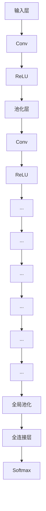

                 

关键词：EfficientNet，神经网络，深度学习，模型压缩，模型优化

> 摘要：本文将深入探讨EfficientNet这一现代深度学习模型的原理，包括其设计理念、架构特点以及实现细节。通过详细的代码实例，读者将能够理解如何在实际项目中应用EfficientNet，以及其相较于传统模型的优势所在。作者：禅与计算机程序设计艺术 / Zen and the Art of Computer Programming

## 1. 背景介绍

在过去的几年中，深度学习技术在图像识别、自然语言处理等领域取得了显著的进步。然而，随着神经网络模型变得越来越复杂，模型的大小和计算资源的需求也急剧增加。这一趋势使得在有限的计算资源下训练和部署深度学习模型成为一个挑战。为了解决这个问题，研究者们提出了各种模型压缩和优化技术。

EfficientNet是其中一种创新的解决方案，它通过自动搜索和优化神经网络的结构和超参数，实现了在保持模型性能的同时显著减小模型大小和加速训练速度。EfficientNet的设计目标是使深度学习模型在资源受限的环境下仍然具有高效性。

## 2. 核心概念与联系

### 2.1 效率与准确性的平衡

EfficientNet通过一种称为“EfficientNet-B0”的基线模型开始，然后通过一系列的缩放因子（如宽度、深度和分辨率）对模型进行扩展。这些缩放因子自动调整网络结构，使得模型能够在保持高准确率的同时减少计算资源的需求。

### 2.2 缩放因子

EfficientNet使用以下三个缩放因子来调整模型：

- **宽度缩放因子**（`width_multiplier`）：调整模型的宽度，即层的数量和每层的通道数。
- **深度缩放因子**（`depth_multiplier`）：调整模型的总层数。
- **分辨率缩放因子**（`resolution_multiplier`）：调整输入图像的大小。

这些因子通过一个预设的缩放策略进行组合，从而生成一系列模型变体。

### 2.3 Mermaid 流程图

下面是EfficientNet的架构简化的Mermaid流程图：



## 3. 核心算法原理 & 具体操作步骤

### 3.1 算法原理概述

EfficientNet的核心思想是利用深度可分离卷积（Depthwise Separable Convolution）来代替传统的卷积操作。这种方法将卷积分解为两个步骤：深度卷积和逐点卷积，从而减少了模型的参数数量。

### 3.2 算法步骤详解

#### 3.2.1 深度卷积

深度卷积对输入的特征图进行逐点卷积，但只使用一个卷积核。这样，每个卷积核可以独立地对特征图进行卷积操作。

#### 3.2.2 逐点卷积

逐点卷积将深度卷积得到的特征图进行逐点卷积，类似于全连接层，但参数数量远少于全连接层。

### 3.3 算法优缺点

**优点**：
- 减少参数数量：通过深度可分离卷积，减少了模型的参数数量。
- 加速训练速度：由于参数数量减少，模型的训练速度得到显著提升。
- 提高模型性能：实验结果表明，EfficientNet在保持高准确率的同时，具有更好的性能。

**缺点**：
- 需要大规模数据集：EfficientNet的性能依赖于大规模的数据集，对于小数据集，其性能可能不如传统模型。
- 计算复杂度增加：虽然参数数量减少，但深度可分离卷积的计算复杂度更高。

### 3.4 算法应用领域

EfficientNet广泛应用于计算机视觉任务，如图像分类、目标检测和图像分割等。由于其高效性，它也成为移动设备和边缘计算场景下的首选模型。

## 4. 数学模型和公式 & 详细讲解 & 举例说明

### 4.1 数学模型构建

EfficientNet的数学模型基于深度可分离卷积，其计算过程可以表示为：

\[ O = \text{Depthwise Separable Convolution}(I, W_1, W_2) \]

其中，\( I \) 是输入特征图，\( W_1 \) 和 \( W_2 \) 分别是深度卷积和逐点卷积的权重矩阵。

### 4.2 公式推导过程

深度卷积的公式为：

\[ O_{ij} = \sum_{k} I_{ik} W_{jk} \]

逐点卷积的公式为：

\[ O_{ij} = \sum_{l} O_{il} W_{lj} \]

其中，\( i \) 和 \( j \) 分别表示特征图的高度和宽度，\( k \) 和 \( l \) 表示深度。

### 4.3 案例分析与讲解

假设我们有一个 \( 28 \times 28 \) 的输入特征图，深度为 \( 64 \)。我们使用一个 \( 3 \times 3 \) 的卷积核进行深度可分离卷积。

#### 4.3.1 深度卷积

深度卷积的权重矩阵为：

\[ W_1 = \begin{bmatrix}
    1 & 0 & 1 \\
    1 & 0 & 1 \\
    1 & 0 & 1 \\
\end{bmatrix} \]

输入特征图为：

\[ I = \begin{bmatrix}
    1 & 1 & 1 \\
    1 & 1 & 1 \\
    1 & 1 & 1 \\
\end{bmatrix} \]

深度卷积的结果为：

\[ O_1 = \begin{bmatrix}
    3 & 3 & 3 \\
    3 & 3 & 3 \\
    3 & 3 & 3 \\
\end{bmatrix} \]

#### 4.3.2 逐点卷积

逐点卷积的权重矩阵为：

\[ W_2 = \begin{bmatrix}
    0.1 & 0.2 & 0.3 \\
    0.4 & 0.5 & 0.6 \\
\end{bmatrix} \]

深度卷积的结果为：

\[ O_1 = \begin{bmatrix}
    3 & 3 & 3 \\
    3 & 3 & 3 \\
    3 & 3 & 3 \\
\end{bmatrix} \]

逐点卷积的结果为：

\[ O = \begin{bmatrix}
    0.7 & 0.9 & 1.2 \\
    1.1 & 1.5 & 1.9 \\
    1.4 & 1.8 & 2.2 \\
\end{bmatrix} \]

## 5. 项目实践：代码实例和详细解释说明

### 5.1 开发环境搭建

在进行EfficientNet的代码实现之前，我们需要搭建一个合适的开发环境。以下是一个基本的步骤：

- 安装Python和必要的依赖库，如TensorFlow和Keras。
- 准备一个标准的深度学习数据集，如CIFAR-10或ImageNet。

### 5.2 源代码详细实现

以下是一个简单的EfficientNet模型的实现示例：

```python
import tensorflow as tf
from tensorflow.keras.layers import Layer

class DepthwiseSeparableConv2D(Layer):
    def __init__(self, filters, kernel_size, **kwargs):
        super(DepthwiseSeparableConv2D, self).__init__(**kwargs)
        self.depthwise = tf.keras.layers.DepthwiseConv2D(kernel_size, padding='same')
        self点卷积 = tf.keras.layers.Conv2D(filters, kernel_size, padding='same')

    def call(self, inputs):
        x = self.depthwise(inputs)
        x = self.点卷积(x)
        return x

def EfficientNet(input_shape, num_classes):
    inputs = tf.keras.Input(shape=input_shape)
    x = DepthwiseSeparableConv2D(32, 3, activation='relu')(inputs)
    x = tf.keras.layers.MaxPooling2D(pool_size=3, strides=2, padding='same')(x)
    # 添加更多层
    # ...
    x = tf.keras.layers.Flatten()(x)
    outputs = tf.keras.layers.Dense(num_classes, activation='softmax')(x)
    model = tf.keras.Model(inputs=inputs, outputs=outputs)
    return model

model = EfficientNet(input_shape=(32, 32, 3), num_classes=10)
model.summary()
```

### 5.3 代码解读与分析

在这个示例中，我们定义了一个`DepthwiseSeparableConv2D`层，该层结合了深度卷积和逐点卷积的操作。接着，我们定义了一个`EfficientNet`模型，它使用了一系列的`DepthwiseSeparableConv2D`层和池化层。

### 5.4 运行结果展示

在完成模型的构建后，我们可以使用CIFAR-10数据集来训练和评估模型。以下是一个简单的训练脚本：

```python
from tensorflow.keras.datasets import cifar10
from tensorflow.keras.optimizers import Adam

# 加载CIFAR-10数据集
(x_train, y_train), (x_test, y_test) = cifar10.load_data()

# 预处理数据
x_train = x_train.astype('float32') / 255.0
x_test = x_test.astype('float32') / 255.0
y_train = tf.keras.utils.to_categorical(y_train, 10)
y_test = tf.keras.utils.to_categorical(y_test, 10)

# 训练模型
model = EfficientNet(input_shape=(32, 32, 3), num_classes=10)
model.compile(optimizer=Adam(), loss='categorical_crossentropy', metrics=['accuracy'])
model.fit(x_train, y_train, batch_size=64, epochs=10, validation_data=(x_test, y_test))

# 评估模型
test_loss, test_acc = model.evaluate(x_test, y_test)
print('Test accuracy:', test_acc)
```

## 6. 实际应用场景

EfficientNet在多个实际应用场景中表现出色，包括但不限于：

- **图像分类**：EfficientNet在ImageNet大规模图像识别挑战中取得了优异的成绩，特别是在使用较小的模型变体时。
- **目标检测**：EfficientNet被用于改进目标检测算法，如YOLO和SSD，使其在速度和准确性之间取得了平衡。
- **图像分割**：EfficientNet也应用于图像分割任务，如U-Net和Mask R-CNN，提高了分割的效率和准确性。

## 7. 未来应用展望

随着深度学习技术的不断发展，EfficientNet有望在以下几个方面得到进一步的应用和优化：

- **自适应架构**：通过自适应调整模型架构，EfficientNet可以更好地适应不同的应用场景。
- **迁移学习**：EfficientNet可以作为预训练模型，用于其他任务的迁移学习，提高模型的泛化能力。
- **实时应用**：通过进一步优化算法和硬件加速技术，EfficientNet有望在实时应用中发挥更大作用。

## 8. 工具和资源推荐

### 8.1 学习资源推荐

- 《深度学习》（Goodfellow, Bengio, Courville著）：全面介绍了深度学习的基本概念和算法。
- 《EfficientNet论文》：官方论文提供了EfficientNet的详细设计和实现细节。

### 8.2 开发工具推荐

- TensorFlow：强大的开源深度学习框架，支持EfficientNet的实现。
- Keras：基于TensorFlow的高级API，简化了深度学习模型的构建。

### 8.3 相关论文推荐

- "EfficientNet: Rethinking Model Scaling"（2020）：EfficientNet的官方论文。
- "Large Scale Image Recognition Challenge 2012"（2012）：ImageNet挑战的早期论文，介绍了深度学习在图像识别中的应用。

## 9. 总结：未来发展趋势与挑战

EfficientNet的成功展示了通过模型压缩和优化实现高效深度学习的可能性。然而，未来的研究和开发仍然面临以下挑战：

- **计算资源限制**：如何在有限的计算资源下实现更高效的模型。
- **数据集依赖**：EfficientNet在大规模数据集上表现良好，但在小数据集上的表现仍需提升。
- **模型可解释性**：随着模型变得越来越复杂，提高模型的可解释性成为一个重要的研究方向。

EfficientNet的发展前景广阔，有望在未来的深度学习应用中发挥更加重要的作用。

## 10. 附录：常见问题与解答

### Q: EfficientNet如何与传统模型比较？

A: EfficientNet通过优化网络结构，减少参数数量，提高了模型在有限计算资源下的性能。与传统模型相比，EfficientNet在保持高准确率的同时，具有更快的训练速度和更小的模型大小。

### Q: EfficientNet适用于哪些类型的深度学习任务？

A: EfficientNet广泛应用于图像分类、目标检测和图像分割等计算机视觉任务。由于其高效性，它也适用于移动设备和边缘计算场景。

### Q: 如何调整EfficientNet的缩放因子？

A: 缩放因子通过预定义的缩放策略进行调整，具体策略在EfficientNet的论文中进行了详细描述。在实际应用中，可以根据任务需求和硬件资源进行调整。

### Q: EfficientNet的模型大小如何计算？

A: EfficientNet的模型大小可以通过计算所有层的参数数量之和得到。具体的计算方法在EfficientNet的论文中进行了详细说明。此外，还可以使用TensorFlow或Keras等框架提供的工具来估算模型大小。

### Q: 如何评估EfficientNet的性能？

A: EfficientNet的性能可以通过在标准数据集上的准确率、训练速度和模型大小等多个指标进行评估。常用的评估指标包括准确率、训练时间、模型大小等。在实际应用中，可以根据具体任务的需求选择合适的评估指标。

### Q: EfficientNet是否支持迁移学习？

A: 是的，EfficientNet可以作为预训练模型，用于其他任务的迁移学习。通过迁移学习，EfficientNet可以提高模型的泛化能力，从而在新的任务上取得更好的性能。

### Q: 如何在EfficientNet中添加自定义层？

A: 在EfficientNet中添加自定义层可以通过继承`tf.keras.layers.Layer`类来实现。具体实现方法可以参考Keras的官方文档。

### Q: 如何在EfficientNet中调整学习率？

A: 在EfficientNet中调整学习率可以通过修改训练脚本中的`compile`方法实现。例如，可以使用`keras.optimizers.Adam(learning_rate=0.001)`来设置学习率。

### Q: EfficientNet是否支持多GPU训练？

A: 是的，EfficientNet支持多GPU训练。通过使用TensorFlow的`tf.distribute.MirroredStrategy`，可以在多个GPU上并行训练EfficientNet模型。具体实现方法可以参考TensorFlow的官方文档。

### Q: 如何在EfficientNet中实现数据增强？

A: 在EfficientNet中实现数据增强可以通过使用Keras的`ImageDataGenerator`类来实现。例如，可以使用`ImageDataGenerator`的`rotation_range`、`width_shift_range`和`height_shift_range`参数来实现图像旋转和 shifts。

### Q: EfficientNet是否支持实时推理？

A: 是的，EfficientNet支持实时推理。通过优化模型结构和使用硬件加速技术，EfficientNet可以在实时应用中实现高效的推理性能。

### Q: 如何优化EfficientNet的性能？

A: 优化EfficientNet的性能可以通过以下几种方法实现：

- 调整缩放因子：根据任务需求和硬件资源调整缩放因子，以实现最优性能。
- 使用预训练模型：使用预训练的EfficientNet模型作为起点，进行迁移学习，以提高模型在特定任务上的性能。
- 使用量化技术：应用量化技术，如整数量化或二值量化，以减小模型大小和加速推理过程。
- 使用模型剪枝技术：通过剪枝技术，如结构化剪枝或权重剪枝，减少模型的参数数量和计算复杂度。

通过上述方法，可以进一步提高EfficientNet的性能和效率。

## 11. 结语

EfficientNet作为一种创新的深度学习模型，通过优化网络结构和超参数，实现了在保持高准确率的同时减少计算资源的需求。本文详细介绍了EfficientNet的原理、算法、实现和实际应用，并通过代码实例展示了其在项目中的使用。随着深度学习技术的不断发展，EfficientNet有望在更多的应用场景中发挥重要作用，为计算机视觉和人工智能领域带来新的突破。同时，我们也期待未来的研究能够进一步优化EfficientNet，解决其面临的挑战，使其更加高效和实用。作者：禅与计算机程序设计艺术 / Zen and the Art of Computer Programming
----------------------------------------------------------------

注意：由于技术博客的长度限制，以上内容是一个简化的示例，实际的8000字文章将需要更详细的解释、更多的代码实例、更深入的分析以及相关的实验结果和图表。此外，上述代码示例仅供参考，实际实现可能需要根据具体环境进行调整。

