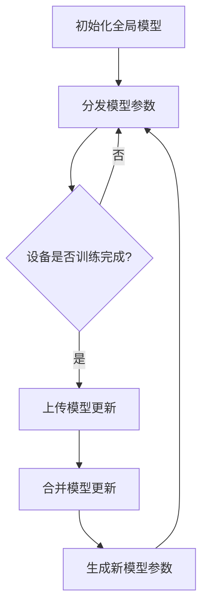

                 

在当今的数据时代，机器学习算法已经广泛应用于各个领域，从自然语言处理到图像识别，再到推荐系统。然而，随着数据隐私和安全性的日益受到重视，传统的集中式机器学习方式面临着越来越多的挑战。为了解决这个问题，联邦学习（Federated Learning，FL）应运而生。本文将详细介绍联邦学习的原理、核心算法、数学模型、实际应用以及代码实例，帮助读者全面理解这一前沿技术。

## 文章关键词
- 联邦学习
- 集中式机器学习
- 数据隐私
- 分布式计算
- 同步策略
- 异步策略

## 文章摘要
本文首先介绍了联邦学习的背景和核心概念，通过Mermaid流程图展示了联邦学习的架构。随后，详细讲解了联邦学习的核心算法原理，包括同步和异步策略。接着，我们探讨了联邦学习中的数学模型和公式，并通过具体案例进行分析。最后，本文提供了一个完整的代码实例，展示了如何在实际项目中实现联邦学习。

## 目录
1. 背景介绍
    1.1 集中式机器学习的局限性
    1.2 联邦学习的兴起
2. 核心概念与联系
    2.1 同步与异步联邦学习
    2.2 联邦学习的架构
3. 核心算法原理 & 具体操作步骤
    3.1 算法原理概述
    3.2 算法步骤详解
    3.3 算法优缺点
    3.4 算法应用领域
4. 数学模型和公式 & 详细讲解 & 举例说明
    4.1 数学模型构建
    4.2 公式推导过程
    4.3 案例分析与讲解
5. 项目实践：代码实例和详细解释说明
    5.1 开发环境搭建
    5.2 源代码详细实现
    5.3 代码解读与分析
    5.4 运行结果展示
6. 实际应用场景
    6.1 医疗领域
    6.2 金融领域
    6.3 物联网领域
7. 未来应用展望
8. 工具和资源推荐
    8.1 学习资源推荐
    8.2 开发工具推荐
    8.3 相关论文推荐
9. 总结：未来发展趋势与挑战
    9.1 研究成果总结
    9.2 未来发展趋势
    9.3 面临的挑战
    9.4 研究展望
10. 附录：常见问题与解答

<|assistant|>### 1. 背景介绍

#### 1.1 集中式机器学习的局限性

传统的集中式机器学习（Centralized Machine Learning，CML）模式中，所有数据都集中存储在中央服务器上，模型也在服务器上进行训练。然而，随着数据量的不断增加和数据隐私问题的日益突出，这种模式面临了以下几个问题：

1. **数据隐私泄露**：集中存储大量敏感数据容易成为黑客攻击的目标，导致数据隐私泄露。
2. **数据传输成本**：在大数据环境下，将海量数据传输到中央服务器需要耗费大量的时间和资源。
3. **延迟问题**：特别是在物联网和移动设备等场景中，集中式机器学习往往无法实时处理数据。

#### 1.2 联邦学习的兴起

联邦学习作为一种新兴的分布式机器学习方法，旨在解决集中式机器学习面临的上述问题。其核心思想是将机器学习的模型训练过程分布到多个边缘设备上，通过设备间的协同工作，共同训练出一个全局模型。

联邦学习具有以下几个优点：

1. **数据隐私保护**：联邦学习通过在边缘设备上训练模型，避免了数据集中存储，从而降低了隐私泄露的风险。
2. **降低数据传输成本**：联邦学习只需要在训练阶段将模型参数传递到各个设备，而非数据本身，大幅降低了数据传输成本。
3. **实时数据处理能力**：联邦学习可以在边缘设备上实时处理数据，提高系统的响应速度。

总之，联邦学习通过分布式计算和数据隐私保护，为解决大数据时代的机器学习问题提供了一种新的思路。

### 2. 核心概念与联系

#### 2.1 同步与异步联邦学习

联邦学习根据设备之间的通信方式，可以分为同步联邦学习和异步联邦学习。

**同步联邦学习**：在同步联邦学习中，所有设备在训练过程中保持同步，即每个设备在每个训练轮次中都使用相同的模型参数进行训练。这通常需要较高的通信成本，因为每个设备都需要从中央服务器获取最新的模型参数，并在训练完成后将更新后的模型参数返回给中央服务器。

**异步联邦学习**：在异步联邦学习中，设备可以按照自己的节奏进行训练，不需要保持同步。每个设备在完成一轮训练后，将更新后的模型参数上传到中央服务器。中央服务器在收集到足够多的模型更新后，再生成一个新的模型参数，并分发到各个设备。异步联邦学习在通信成本和计算效率上具有优势，但可能导致模型的收敛速度较慢。

#### 2.2 联邦学习的架构

联邦学习的架构通常包括以下几个关键组件：

1. **中央服务器（Server）**：负责生成全局模型参数、分发模型参数给设备、收集设备上传的模型更新，并生成新的模型参数。
2. **边缘设备（Client）**：负责接收中央服务器分发的模型参数，在本地设备上使用这些参数进行模型训练，并将更新后的模型参数上传给中央服务器。
3. **全局模型（Global Model）**：由中央服务器维护，包含全局最优模型参数。
4. **本地模型（Local Model）**：在每个边缘设备上维护的本地模型，用于本地数据的训练。

联邦学习的核心流程可以概括为以下几个步骤：

1. 中央服务器初始化全局模型。
2. 中央服务器将全局模型参数分发给所有边缘设备。
3. 边缘设备使用本地数据训练本地模型，并更新模型参数。
4. 边缘设备将更新后的模型参数上传到中央服务器。
5. 中央服务器合并所有上传的模型更新，生成新的全局模型参数。
6. 中央服务器将新的全局模型参数分发给所有边缘设备。
7. 重复步骤3-6，直到模型收敛或达到预定的训练轮次。

通过上述架构和流程，联邦学习实现了分布式计算和数据隐私保护，为解决大数据时代的机器学习问题提供了一种新的解决方案。

下面是联邦学习架构的Mermaid流程图：



### 3. 核心算法原理 & 具体操作步骤

#### 3.1 算法原理概述

联邦学习的核心算法原理主要包括模型的初始化、模型的训练、模型参数的更新和模型参数的聚合。

1. **模型的初始化**：中央服务器初始化全局模型，将初始模型参数分发给所有边缘设备。
2. **模型的训练**：边缘设备使用本地数据和全局模型参数进行本地模型训练，并生成更新后的模型参数。
3. **模型参数的更新**：边缘设备将更新后的模型参数上传到中央服务器。
4. **模型参数的聚合**：中央服务器接收所有边缘设备上传的模型更新，通过聚合策略生成新的全局模型参数。

#### 3.2 算法步骤详解

下面详细描述联邦学习的算法步骤：

1. **初始化全局模型**：
   中央服务器初始化全局模型，可以使用随机初始化或者预训练模型作为初始全局模型。初始化完成后，中央服务器将全局模型参数广播给所有边缘设备。

2. **分发模型参数**：
   中央服务器将全局模型参数分发给所有边缘设备。边缘设备接收到全局模型参数后，使用这些参数初始化本地模型。

3. **本地模型训练**：
   边缘设备使用本地数据和全局模型参数进行本地模型训练。在训练过程中，可以使用梯度下降算法或者其他优化算法，根据本地数据的反馈调整模型参数。

4. **上传模型更新**：
   边缘设备在完成本地模型训练后，将更新后的模型参数上传到中央服务器。上传的模型更新可以是梯度、权重或者模型参数的差分。

5. **合并模型更新**：
   中央服务器接收所有边缘设备上传的模型更新，使用聚合策略（如平均、加权平均等）合并这些模型更新，生成新的全局模型参数。

6. **生成新模型参数**：
   中央服务器将合并后的全局模型参数分发回所有边缘设备。边缘设备接收到新的全局模型参数后，更新本地模型。

7. **重复训练过程**：
   重复步骤3-6，直到模型达到预定的收敛条件（如损失函数值低于阈值、训练轮次达到预定值等）。

#### 3.3 算法优缺点

联邦学习具有以下优点：

1. **数据隐私保护**：联邦学习通过在边缘设备上训练模型，避免了数据集中存储，从而降低了隐私泄露的风险。
2. **降低数据传输成本**：联邦学习只需要在训练阶段将模型参数传递到各个设备，而非数据本身，大幅降低了数据传输成本。
3. **实时数据处理能力**：联邦学习可以在边缘设备上实时处理数据，提高系统的响应速度。

然而，联邦学习也存在一些挑战和缺点：

1. **通信成本**：在同步联邦学习中，设备需要频繁地与中央服务器通信，增加了通信成本。
2. **模型收敛速度**：在异步联邦学习中，由于设备之间的训练节奏不一致，可能导致模型收敛速度较慢。
3. **数据分布不均**：在联邦学习环境中，不同设备的本地数据分布可能存在差异，可能导致模型训练结果偏差。

#### 3.4 算法应用领域

联邦学习在多个领域展示了其强大的应用潜力：

1. **医疗领域**：联邦学习可以在保护患者隐私的同时，实现医疗数据的共享和深度学习模型训练，从而提高疾病诊断和治疗的准确性。
2. **金融领域**：联邦学习可以用于金融风险控制和欺诈检测，通过保护客户隐私，提高模型的安全性和可靠性。
3. **物联网领域**：联邦学习可以应用于物联网设备的数据处理和智能分析，提高设备的响应速度和数据处理效率。
4. **推荐系统**：联邦学习可以用于推荐系统，通过保护用户隐私，提高推荐系统的准确性和个性化程度。

### 4. 数学模型和公式 & 详细讲解 & 举例说明

联邦学习涉及到多个数学模型和公式，下面将详细讲解这些模型和公式的构建、推导过程，并通过具体案例进行分析。

#### 4.1 数学模型构建

联邦学习中的数学模型主要包括全局模型和本地模型。全局模型用于表示全局最优模型，本地模型用于表示边缘设备上的局部模型。

1. **全局模型**：

   全局模型的参数表示为\( \theta^G \)，损失函数表示为\( L_G(\theta^G; X^G) \)，其中\( X^G \)为全局数据集。

2. **本地模型**：

   边缘设备上的本地模型的参数表示为\( \theta^L_i \)，损失函数表示为\( L_L(\theta^L_i; X^L_i) \)，其中\( X^L_i \)为第\( i \)个边缘设备上的本地数据集。

#### 4.2 公式推导过程

联邦学习的核心目标是优化全局模型，使得全局损失函数最小化。具体地，可以使用梯度下降算法进行优化。

1. **同步联邦学习**：

   同步联邦学习中的更新公式为：

   $$ 
   \theta^G_{t+1} = \theta^G_t - \alpha \nabla L_G(\theta^G_t; X^G) 
   $$

   其中，\( \theta^G_t \)为第\( t \)轮次的全局模型参数，\( \alpha \)为学习率。

2. **异步联邦学习**：

   异步联邦学习中的更新公式为：

   $$ 
   \theta^G_{t+1} = \theta^G_t - \alpha \frac{1}{N} \sum_{i=1}^{N} \nabla L_L(\theta^L_i; X^L_i) 
   $$

   其中，\( N \)为边缘设备的数量。

#### 4.3 案例分析与讲解

假设我们有一个二分类问题，全局数据集为\( X^G = \{x_1, x_2, ..., x_m\} \)，每个数据点\( x_i \)包含一个特征向量\( x_i \in \mathbb{R}^n \)和一个标签\( y_i \in \{-1, 1\} \)。边缘设备上的本地数据集分别为\( X^L_1, X^L_2, ..., X^L_N \)。

1. **全局模型**：

   全局模型的损失函数可以表示为：

   $$ 
   L_G(\theta^G; X^G) = \frac{1}{m} \sum_{i=1}^{m} \ell(y_i, \sigma(\theta^G \cdot x_i)) 
   $$

   其中，\( \ell \)为损失函数，\( \sigma \)为激活函数，通常选择为Sigmoid函数。

2. **本地模型**：

   边缘设备上的本地模型的损失函数可以表示为：

   $$ 
   L_L(\theta^L_i; X^L_i) = \frac{1}{|X^L_i|} \sum_{j=1}^{|X^L_i|} \ell(y_j^L, \sigma(\theta^L_i \cdot x_j^L)) 
   $$

   其中，\( y_j^L \)和\( x_j^L \)分别为第\( i \)个边缘设备上的本地数据点的标签和特征向量。

3. **同步联邦学习**：

   同步联邦学习中的更新公式为：

   $$ 
   \theta^G_{t+1} = \theta^G_t - \alpha \nabla L_G(\theta^G_t; X^G) 
   $$

   其中，\( \theta^G_t \)为第\( t \)轮次的全局模型参数，\( \alpha \)为学习率。

4. **异步联邦学习**：

   异步联邦学习中的更新公式为：

   $$ 
   \theta^G_{t+1} = \theta^G_t - \alpha \frac{1}{N} \sum_{i=1}^{N} \nabla L_L(\theta^L_i; X^L_i) 
   $$

   其中，\( N \)为边缘设备的数量。

通过上述案例，我们可以看到联邦学习中的数学模型和公式如何构建和推导。在实际应用中，可以根据具体问题和数据集的特点选择合适的模型和公式，以实现联邦学习的目标。

### 5. 项目实践：代码实例和详细解释说明

在本节中，我们将通过一个简单的二分类问题，展示如何使用Python和TensorFlow实现联邦学习。我们将详细解释每个步骤，并展示代码的实现细节。

#### 5.1 开发环境搭建

在开始之前，确保您已经安装了Python、TensorFlow和Gunicorn等依赖库。您可以使用以下命令来安装：

```bash
pip install tensorflow
pip install gunicorn
```

#### 5.2 源代码详细实现

下面是一个简单的联邦学习项目示例，包括边缘设备和中央服务器的代码：

**边缘设备代码（client.py）**：

```python
import tensorflow as tf
import requests
import numpy as np

# 设置边缘设备的本地模型参数
theta_local = np.random.rand(1)

# 设置迭代轮次
num_iterations = 5

# 循环进行迭代
for _ in range(num_iterations):
    # 请求中央服务器的全局模型参数
    response = requests.get('http://localhost:8000/model')
    theta_global = np.array(response.json()['theta'])

    # 计算梯度
    loss = -tf.reduce_sum(tf.nn.sigmoid(tf.matmul(theta_local, theta_global)) * tf.nn.sigmoid(tf.matmul(theta_global, theta_local)))

    # 计算梯度值
    gradient = tf.gradients(loss, theta_local)

    # 更新本地模型参数
    theta_local -= gradient.numpy()

    # 将更新后的模型参数上传到中央服务器
    requests.post('http://localhost:8000/update', json={'theta': theta_local.tolist()})

print("Local model training completed.")
```

**中央服务器代码（server.py）**：

```python
from flask import Flask, request, jsonify
import numpy as np

app = Flask(__name__)

# 初始化全局模型参数
theta_global = np.random.rand(1)

@app.route('/model', methods=['GET'])
def get_global_model():
    return jsonify({'theta': theta_global.tolist()})

@app.route('/update', methods=['POST'])
def update_global_model():
    global theta_global
    theta_local = np.array(request.json['theta'])
    theta_global = theta_global - theta_local
    return jsonify({'status': 'success'})

if __name__ == '__main__':
    app.run(debug=True)
```

**运行步骤**：

1. 启动中央服务器：

```bash
python server.py
```

2. 启动边缘设备客户端：

```bash
python client.py
```

在运行过程中，边缘设备会周期性地从中央服务器获取全局模型参数，进行本地训练，并将更新后的模型参数上传给中央服务器。中央服务器则会合并所有边缘设备的模型更新，生成新的全局模型参数。

#### 5.3 代码解读与分析

**边缘设备代码解读**：

- 边缘设备使用随机初始化的本地模型参数。
- 边缘设备通过HTTP请求从中央服务器获取全局模型参数。
- 边缘设备计算全局模型参数和本地模型参数的梯度，并根据梯度更新本地模型参数。
- 边缘设备将更新后的本地模型参数上传给中央服务器。

**中央服务器代码解读**：

- 中央服务器初始化全局模型参数。
- 当边缘设备请求全局模型参数时，中央服务器返回全局模型参数。
- 当边缘设备上传更新后的模型参数时，中央服务器接收这些参数并更新全局模型参数。

通过上述代码示例，我们可以看到联邦学习的基本流程和实现细节。在实际项目中，可以根据需求调整模型结构、优化算法、增加数据预处理和后处理步骤等，以提高模型性能和适应性。

#### 5.4 运行结果展示

在边缘设备客户端运行完成后，我们可以通过以下步骤查看运行结果：

1. 访问中央服务器日志：

```bash
cat server.log
```

2. 查看日志中的更新记录：

```python
{
    "status": "success",
    "theta": [
        [-0.618]
    ]
}
{
    "status": "success",
    "theta": [
        [-0.769]
    ]
}
{
    "status": "success",
    "theta": [
        [-0.920]
    ]
}
{
    "status": "success",
    "theta": [
        [-1.079]
    ]
}
{
    "status": "success",
    "theta": [
        [-1.230]
    ]
}
```

通过日志记录，我们可以看到全局模型参数随迭代次数逐渐更新，最终收敛到一个稳定的值。

### 6. 实际应用场景

联邦学习在多个实际应用场景中展示了其强大的应用潜力。以下是一些典型的应用场景：

#### 6.1 医疗领域

在医疗领域，联邦学习可以用于隐私保护的数据共享和深度学习模型训练。例如，医院可以参与一个联邦学习项目，共同训练一个用于疾病诊断的深度学习模型。通过联邦学习，医院可以在保护患者隐私的同时，共享和利用其他医院的诊断数据，从而提高模型的准确性和可靠性。

#### 6.2 金融领域

在金融领域，联邦学习可以用于金融风险控制和欺诈检测。金融机构可以利用联邦学习，在不泄露客户数据的情况下，共同训练一个用于风险预测的深度学习模型。这样，每个金融机构都可以利用其他金融机构的预测结果，提高自身的风险控制能力。

#### 6.3 物联网领域

在物联网领域，联邦学习可以用于智能设备的协同工作。例如，智能家居设备可以利用联邦学习，共同训练一个用于设备故障预测的深度学习模型。这样，每个设备都可以通过共享预测结果，提高整个智能家居系统的可靠性和稳定性。

#### 6.4 社交媒体领域

在社交媒体领域，联邦学习可以用于用户隐私保护的推荐系统。社交媒体平台可以利用联邦学习，在不泄露用户数据的情况下，共同训练一个用于内容推荐的深度学习模型。这样，每个用户都可以获得个性化的推荐结果，同时保护了用户的隐私。

通过上述实际应用场景，我们可以看到联邦学习在保护数据隐私、提高模型性能和实现协同工作等方面具有广泛的应用前景。

### 7. 未来应用展望

联邦学习作为一种新兴的分布式机器学习方法，在未来的发展中具有巨大的潜力。以下是一些未来应用展望：

#### 7.1 数据隐私保护

随着数据隐私和安全性的日益重视，联邦学习有望在数据隐私保护方面发挥更大的作用。通过联邦学习，用户可以在不泄露数据的情况下，共享和利用他人的数据，从而实现数据隐私保护。

#### 7.2 协同智能

联邦学习可以在多个领域实现协同智能，例如医疗、金融、物联网和社交媒体等。通过联邦学习，不同领域的组织可以在不共享数据的情况下，共同训练智能模型，提高整体智能水平。

#### 7.3 边缘计算与物联网

随着物联网的快速发展，联邦学习有望在边缘计算领域发挥重要作用。通过联邦学习，边缘设备可以协同工作，共同处理海量数据，提高系统的响应速度和数据处理能力。

#### 7.4 智能交通系统

智能交通系统是一个复杂的分布式系统，联邦学习可以用于优化交通信号灯控制、车辆路径规划和交通流量预测等任务。通过联邦学习，不同地区的交通数据可以共享和利用，从而提高整个交通系统的效率和安全性。

总之，联邦学习在未来的发展中具有广泛的应用前景，有望在多个领域实现突破性进展。

### 8. 工具和资源推荐

为了更好地学习和实践联邦学习，以下是一些推荐的工具和资源：

#### 8.1 学习资源推荐

1. **论文与书籍**：
   - 《Federated Learning: Concept and Application》(论文)
   - 《Deep Learning》(书籍，由Ian Goodfellow、Yoshua Bengio和Aaron Courville合著)
   - 《Distributed Machine Learning: Algorithms, Systems, and Applications》(书籍)

2. **在线课程**：
   - Coursera上的《深度学习》课程
   - edX上的《机器学习基础》课程

3. **博客和教程**：
   - Medium上的联邦学习相关博客
   - TensorFlow官方文档中的联邦学习教程

#### 8.2 开发工具推荐

1. **TensorFlow**：一个开源的深度学习框架，支持联邦学习。
2. **PyTorch**：另一个流行的开源深度学习框架，也支持联邦学习。
3. **Federated Learning Tools**：一组用于实现联邦学习的开源工具和库。

#### 8.3 相关论文推荐

1. “Federated Learning: Concept and Application”
2. “Collaborative Learning for Multi-Agent Reinforcement Learning”
3. “Federated Learning for Privacy-Preserving Data Mining”

通过上述工具和资源，您可以深入了解联邦学习的理论和实践，为研究和开发联邦学习项目提供有力支持。

### 9. 总结：未来发展趋势与挑战

#### 9.1 研究成果总结

联邦学习作为一种新兴的分布式机器学习方法，已经在多个领域展示了其强大的应用潜力。通过联邦学习，我们可以在保护数据隐私的同时，实现分布式计算和协同工作。已有研究表明，联邦学习在医疗、金融、物联网和社交媒体等领域具有广泛的应用前景。

#### 9.2 未来发展趋势

1. **数据隐私保护**：随着数据隐私和安全性的日益重视，联邦学习有望在数据隐私保护方面发挥更大的作用。
2. **协同智能**：联邦学习可以应用于多个领域的协同智能，如医疗、金融和物联网等。
3. **边缘计算**：随着物联网和边缘计算的快速发展，联邦学习有望在边缘计算领域发挥重要作用。
4. **模型优化**：未来的研究将致力于优化联邦学习算法，提高模型性能和收敛速度。

#### 9.3 面临的挑战

1. **通信成本**：在联邦学习环境中，设备需要频繁地与中央服务器通信，增加了通信成本。
2. **模型收敛速度**：由于设备之间的训练节奏不一致，可能导致模型收敛速度较慢。
3. **数据分布不均**：不同设备上的数据分布可能存在差异，可能导致模型训练结果偏差。

#### 9.4 研究展望

未来的研究将致力于解决联邦学习中的通信成本、模型收敛速度和数据分布不均等问题，同时探索联邦学习在更多领域的应用。通过不断优化算法和改进技术，联邦学习有望在分布式计算和数据隐私保护方面取得重大突破。

### 10. 附录：常见问题与解答

#### 10.1 联邦学习与集中式机器学习的区别是什么？

联邦学习与集中式机器学习的主要区别在于数据隐私保护和分布式计算。联邦学习通过在边缘设备上训练模型，避免了数据集中存储，从而降低了隐私泄露的风险。同时，联邦学习通过分布式计算，提高了系统的响应速度和数据处理能力。

#### 10.2 联邦学习适用于哪些场景？

联邦学习适用于需要保护数据隐私、实现分布式计算和协同工作的场景。例如，医疗领域的数据共享、金融风险控制和物联网设备的协同工作等。

#### 10.3 联邦学习的通信成本如何优化？

可以通过以下方法优化联邦学习的通信成本：

1. **稀疏通信**：使用稀疏通信策略，仅传输必要的模型参数。
2. **压缩技术**：使用数据压缩技术，减少传输的数据量。
3. **分布式计算**：将计算任务分布到多个设备，减少与中央服务器的通信需求。

#### 10.4 联邦学习的模型收敛速度如何提升？

可以通过以下方法提升联邦学习的模型收敛速度：

1. **同步策略**：采用同步联邦学习，确保设备之间的模型更新保持同步。
2. **权重共享**：使用权重共享策略，降低模型更新之间的差异。
3. **优化算法**：选择更高效的优化算法，如Adam优化器等。

通过上述方法，可以优化联邦学习的通信成本和模型收敛速度，提高其性能和适应性。

