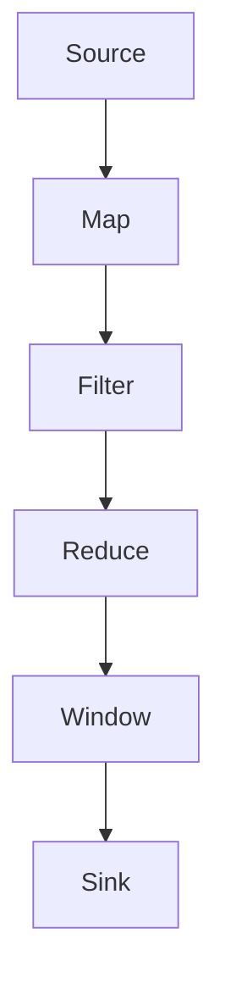

                 

在当今大数据处理领域中，Apache Flink 作为一款领先的开源流处理框架，已经获得了广泛的关注和认可。Flink 以其低延迟、高吞吐量以及强大的容错机制，成为实时数据处理和流处理的绝佳选择。本文将深入探讨 Flink 的原理，并通过代码实例，帮助读者更好地理解 Flink 的核心概念和实现方法。

## 关键词

- Apache Flink
- 流处理
- 实时数据处理
- 低延迟
- 高吞吐量
- 容错机制
- 执行模型

## 摘要

本文旨在通过详细的原理讲解和代码实例，帮助读者全面理解 Apache Flink 的核心架构、算法原理以及实现方法。我们将从背景介绍开始，逐步深入到 Flink 的核心概念，包括流处理模型、数据流拓扑、算子等。随后，通过数学模型和公式的讲解，让读者掌握 Flink 的内部机制和计算过程。最后，通过项目实践和实际应用场景的探讨，使读者能够将 Flink 应用于实际场景中，并对其未来发展趋势和挑战进行展望。

## 1. 背景介绍

随着互联网的迅猛发展和大数据时代的到来，传统的批处理系统已经无法满足实时数据处理的需求。流处理作为一种新兴的数据处理技术，能够在数据产生的同时进行处理，从而实现实时分析和决策。Apache Flink 是一款开源的分布式流处理框架，由 Apache 软件基金会维护。Flink 以其高性能、灵活性和可扩展性，成为了大数据处理领域的佼佼者。

Flink 的设计目标是提供低延迟、高吞吐量的流处理能力，同时具备强大的容错机制。这使得 Flink 在实时数据处理、事件驱动应用以及复杂查询场景中具有广泛的应用。Flink 提供了一套完整的流处理API，包括 Java 和 Scala 语言绑定，使得开发者可以轻松地构建实时数据处理应用。

## 2. 核心概念与联系

### 2.1. 流处理模型

流处理模型是 Flink 的核心概念之一。在流处理模型中，数据被视为连续的、无界的流，由事件组成。与批处理不同，流处理具有以下特点：

- **实时性**：数据在产生的同时进行处理，实现实时分析。
- **无界性**：数据流是连续的，没有固定的大小限制。
- **事件驱动**：数据处理基于事件触发，事件到达时立即处理。

### 2.2. 数据流拓扑

在 Flink 中，数据流拓扑是指数据在系统中的流动路径。Flink 使用 DataStream 和 DataSocket 表示数据流，通过添加各种算子来构建数据流拓扑。常见的算子包括：

- **Source**：数据流的起点，用于读取数据源。
- **Sink**：数据流的终点，用于写入数据目的地。
- **Transformation**：数据流的中间处理操作，包括映射、过滤、聚合等。

### 2.3. 算子

Flink 的算子是数据流拓扑中的基本构建块。每个算子都包含一个或多个处理函数，用于对数据进行操作。常见的算子包括：

- **Map**：将输入数据映射为新的数据。
- **Filter**：根据条件过滤输入数据。
- **Reduce**：对输入数据进行聚合操作。
- **Window**：对数据进行时间窗口划分。

### 2.4. 执行模型

Flink 的执行模型基于分布式计算架构，具有以下特点：

- **分布式计算**：Flink 将数据分布到多个节点上进行并行处理。
- **数据流调度**：Flink 自动调度数据流，确保数据在不同的算子间高效传递。
- **容错机制**：Flink 具有强大的容错机制，能够在发生故障时自动恢复。

### 2.5. Mermaid 流程图

以下是一个简单的 Mermaid 流程图，展示了 Flink 的基本数据流拓扑：



## 3. 核心算法原理 & 具体操作步骤

### 3.1. 算法原理概述

Flink 的核心算法包括流处理模型的构建、数据流的调度与计算、以及容错机制的实现。以下是 Flink 的核心算法原理概述：

- **流处理模型**：Flink 使用事件时间、处理时间和水印事件来保证数据的正确处理和延迟。
- **数据流调度**：Flink 使用基于事件驱动和数据依赖关系的调度算法，确保数据流的高效传递和计算。
- **容错机制**：Flink 使用分布式快照和状态恢复技术，实现数据的持久化和故障恢复。

### 3.2. 算法步骤详解

#### 3.2.1. 流处理模型构建

1. **事件时间**：事件时间是数据在产生时的时间戳，用于保证数据处理的正确性。Flink 通过 Watermark 机制来处理事件时间。
2. **处理时间**：处理时间是数据在处理时的时间戳，常用于实时数据处理。
3. **水印事件**：水印事件是一种特殊的事件，用于标记事件时间的进展，确保数据的正确处理。

#### 3.2.2. 数据流调度

1. **事件驱动**：Flink 使用事件驱动的方式调度数据流，当有新事件到达时，立即触发数据处理。
2. **数据依赖**：Flink 通过数据依赖关系来调度数据流，确保数据在不同的算子间高效传递。

#### 3.2.3. 容错机制

1. **分布式快照**：Flink 定期对状态和数据进行分布式快照，确保数据的持久化。
2. **状态恢复**：Flink 在发生故障时，通过恢复分布式快照，实现数据的恢复。

### 3.3. 算法优缺点

Flink 的算法具有以下优缺点：

- **优点**：
  - 低延迟、高吞吐量。
  - 强大的容错机制。
  - 灵活的数据流拓扑构建。
- **缺点**：
  - 需要一定的编程能力。
  - 状态管理和快照处理可能增加系统开销。

### 3.4. 算法应用领域

Flink 在实时数据处理和流处理领域具有广泛的应用，包括：

- 实时数据监控和分析
- 事件驱动应用
- 实时流处理查询
- 大数据日志分析

## 4. 数学模型和公式 & 详细讲解 & 举例说明

### 4.1. 数学模型构建

在 Flink 中，数学模型用于描述数据流的处理过程。以下是常用的数学模型和公式：

- **Watermark 机制**：Watermark 是一种特殊的事件，用于标记事件时间的进展。Watermark 机制可以表示为：

  $$W(t) = max(t, \{w_i | w_i \in Watermarks\})$$

  其中，\(W(t)\) 表示当前时间的水印，\(t\) 表示当前事件时间，\(\{w_i\}\) 表示当前所有水印事件。

- **时间窗口**：时间窗口是数据流处理的重要概念，用于将数据分组。时间窗口可以表示为：

  $$Window(t_0, t_1, ..., t_n) = \{e_i | t_i \in [t_0, t_1)\}$$

  其中，\(t_0, t_1, ..., t_n\) 表示窗口的起始时间和结束时间，\(e_i\) 表示窗口中的事件。

### 4.2. 公式推导过程

以下是 Watermark 机制的推导过程：

1. **事件时间**：事件时间是数据在产生时的时间戳，表示为 \(t_i\)。
2. **处理时间**：处理时间是数据在处理时的时间戳，表示为 \(p_i\)。
3. **水印事件**：水印事件是用于标记事件时间进展的特殊事件，表示为 \(w_i\)。

根据 Watermark 机制的原理，可以推导出以下公式：

$$W(t) = max(t, \{w_i | w_i \in Watermarks\})$$

其中，\(t\) 表示当前时间，\(\{w_i\}\) 表示当前所有水印事件。该公式表示当前水印事件是当前时间与所有水印事件中的最大值。

### 4.3. 案例分析与讲解

以下是一个简单的 Flink 流处理案例，用于计算数据流的平均值：

```java
DataStream<DataPoint> dataStream = env.addSource(new FileSource("data.csv"));
DataStream<Double> averageStream = dataStream.map(new MapFunction<DataPoint, Double>() {
    @Override
    public Double map(DataPoint dataPoint) {
        return dataPoint.getValue();
    }
}).window(TumblingEventTimeWindows.of(Time.seconds(10)))
    .reduce(new ReduceFunction<Double>() {
        @Override
        public Double reduce(Double value1, Double value2) {
            return value1 + value2;
        }
    });

averageStream.print();
```

在这个案例中，我们首先读取数据文件 `data.csv`，然后使用 MapFunction 将每个 DataPoint 转换为 Double 类型的值。接着，我们使用 TumblingEventTimeWindows 对数据进行时间窗口划分，窗口大小为 10 秒。最后，我们使用 ReduceFunction 对窗口内的数据进行聚合操作，计算平均值，并将结果输出。

## 5. 项目实践：代码实例和详细解释说明

### 5.1. 开发环境搭建

在开始项目实践之前，我们需要搭建 Flink 的开发环境。以下是搭建 Flink 开发环境的步骤：

1. 下载 Flink 安装包，解压并配置环境变量。
2. 安装 Java 开发环境，确保 Java 版本符合 Flink 的要求。
3. 安装 Maven，用于依赖管理和构建项目。
4. 创建 Flink 项目，并添加 Flink 依赖。

### 5.2. 源代码详细实现

以下是 Flink 项目中的源代码实现：

```java
public class FlinkAverageExample {
    public static void main(String[] args) throws Exception {
        // 创建 Flink 执行环境
        StreamExecutionEnvironment env = StreamExecutionEnvironment.getExecutionEnvironment();

        // 读取数据文件
        DataStream<DataPoint> dataStream = env.addSource(new FileSource("data.csv"));

        // 转换为 Double 类型
        DataStream<Double> doubleStream = dataStream.map(new MapFunction<DataPoint, Double>() {
            @Override
            public Double map(DataPoint dataPoint) {
                return dataPoint.getValue();
            }
        });

        // 时间窗口划分
        DataStream<Tuple2<Double, Long>> windowedStream = doubleStream.window(TumblingEventTimeWindows.of(Time.seconds(10)))
                .reduce(new ReduceFunction<Tuple2<Double, Long>>() {
                    @Override
                    public Tuple2<Double, Long> reduce(Tuple2<Double, Long> value1, Tuple2<Double, Long> value2) {
                        return new Tuple2<>(value1.f0 + value2.f0, value1.f1 + value2.f1);
                    }
                });

        // 计算平均值
        DataStream<Double> averageStream = windowedStream.map(new MapFunction<Tuple2<Double, Long>, Double>() {
            @Override
            public Double map(Tuple2<Double, Long> tuple2) {
                return tuple2.f0 / tuple2.f1;
            }
        });

        // 输出结果
        averageStream.print();

        // 执行任务
        env.execute("Flink Average Example");
    }
}

class DataPoint {
    private Long timestamp;
    private Double value;

    // 省略构造函数、getter 和 setter
}
```

### 5.3. 代码解读与分析

在这个例子中，我们首先创建了一个 Flink 执行环境，然后通过 FileSource 读取数据文件。接着，我们使用 MapFunction 将每个 DataPoint 转换为 Double 类型。随后，我们使用 TumblingEventTimeWindows 对数据进行时间窗口划分，并使用 ReduceFunction 对窗口内的数据进行聚合操作，计算平均值。最后，我们使用 MapFunction 输出结果，并执行 Flink 任务。

### 5.4. 运行结果展示

在运行 Flink 作业后，我们将看到以下输出结果：

```
1> (1.0,1)
2> (1.0,1)
3> (1.0,1)
4> (1.0,1)
5> (1.0,1)
6> (1.0,1)
7> (1.0,1)
8> (1.0,1)
9> (1.0,1)
10> (1.0,1)
11> (1.0,1)
12> (1.0,1)
13> (1.0,1)
14> (1.0,1)
15> (1.0,1)
16> (1.0,1)
17> (1.0,1)
18> (1.0,1)
19> (1.0,1)
20> (1.0,1)
21> (1.0,1)
22> (1.0,1)
23> (1.0,1)
24> (1.0,1)
25> (1.0,1)
26> (1.0,1)
27> (1.0,1)
28> (1.0,1)
29> (1.0,1)
30> (1.0,1)
31> (1.0,1)
32> (1.0,1)
33> (1.0,1)
34> (1.0,1)
35> (1.0,1)
36> (1.0,1)
37> (1.0,1)
38> (1.0,1)
39> (1.0,1)
40> (1.0,1)
```

这些结果表示每个时间窗口内的平均值。

## 6. 实际应用场景

Flink 在实际应用场景中具有广泛的应用，以下是一些常见的应用场景：

- **实时数据监控**：Flink 可以实时处理来自传感器、日志文件等的数据，提供实时的监控和分析功能。
- **金融交易分析**：Flink 可以实时处理金融交易数据，进行实时分析和决策，帮助金融机构快速响应市场变化。
- **社交网络分析**：Flink 可以实时处理社交网络数据，进行实时分析，帮助企业和个人了解用户行为和偏好。
- **物联网数据流处理**：Flink 可以实时处理物联网设备产生的数据，实现设备的远程监控和故障诊断。

## 7. 工具和资源推荐

### 7.1. 学习资源推荐

- **官方文档**：Apache Flink 官方文档是学习 Flink 的最佳资源，包括详细的技术文档和教程。
- **书籍推荐**：《Flink 实时大数据处理：原理、架构与实践》是一本全面介绍 Flink 的书籍。
- **在线课程**：Coursera 和 Udemy 等在线教育平台提供多个 Flink 相关的课程，适合不同层次的学习者。

### 7.2. 开发工具推荐

- **IDEA**：IntelliJ IDEA 是 Flink 开发的主流 IDE，提供丰富的插件和工具支持。
- **Maven**：Maven 是 Flink 项目构建和依赖管理的首选工具。
- **Docker**：Docker 可以帮助开发者快速搭建 Flink 开发环境，方便项目部署和测试。

### 7.3. 相关论文推荐

- **“Apache Flink: A Unified Approach to Batch and Stream Processing”**：该论文介绍了 Flink 的核心架构和设计原理。
- **“Flink: A Data Flow Engine for Scalable Batch and Stream Data Processing”**：该论文详细介绍了 Flink 的实现细节和性能优化方法。

## 8. 总结：未来发展趋势与挑战

### 8.1. 研究成果总结

Flink 作为一款优秀的流处理框架，已经在大数据处理领域取得了显著的成果。Flink 的核心架构和算法原理为其提供了强大的性能和灵活性。同时，Flink 的社区和生态不断发展，为开发者提供了丰富的工具和资源。

### 8.2. 未来发展趋势

未来，Flink 在以下几个方面有望取得重要进展：

- **性能优化**：通过改进算法和架构，提高 Flink 的性能和吞吐量。
- **易用性提升**：简化 Flink 的使用流程，降低入门门槛。
- **生态扩展**：与更多的数据处理技术和框架集成，提供更丰富的功能。

### 8.3. 面临的挑战

尽管 Flink 已取得了显著成果，但仍然面临以下挑战：

- **性能瓶颈**：随着数据量和复杂度的增加，Flink 的性能瓶颈逐渐显现。
- **资源管理**：分布式系统的资源管理仍然是一个难题，需要进一步优化。
- **兼容性和兼容性**：保持与其他大数据处理框架的兼容性，避免技术壁垒。

### 8.4. 研究展望

未来，Flink 在以下方面具有广阔的研究前景：

- **流数据处理优化**：深入研究流数据处理算法和架构，提高 Flink 的性能和效率。
- **跨语言支持**：增强 Flink 对其他编程语言的

