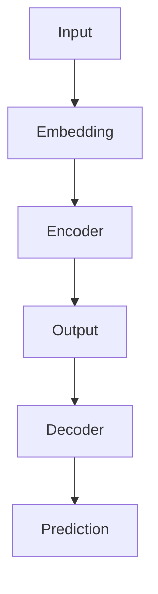

                 

关键词：GPT-2，深度学习，自然语言处理，Transformer模型，预训练，编码器，解码器，Python实现，代码实例，模型优化，应用场景

摘要：本文旨在深入探讨GPT-2（Generative Pre-trained Transformer 2）的原理及其在自然语言处理中的应用。我们将从背景介绍开始，逐步讲解GPT-2的核心概念、算法原理、数学模型、代码实例，并探讨其实际应用和未来发展趋势。

## 1. 背景介绍

随着深度学习技术的不断发展，自然语言处理（NLP）领域取得了显著的进展。Transformer模型作为深度学习在NLP领域的重要突破，推动了自然语言处理的革命。GPT（Generative Pre-trained Transformer）是由OpenAI提出的第一个基于Transformer的预训练模型，其在多个NLP任务上取得了优异的性能。在此基础上，GPT-2进一步优化了模型结构，提高了预训练质量，成为了当前NLP领域的重要模型之一。

## 2. 核心概念与联系

GPT-2的核心概念主要包括编码器（Encoder）和解码器（Decoder），它们构成了Transformer模型的基础结构。以下是GPT-2的核心概念原理和架构的Mermaid流程图：



### 2.1 编码器（Encoder）

编码器负责将输入文本映射为固定长度的向量表示，这一过程通过多层Transformer块实现。每个Transformer块包含多头自注意力机制（Multi-Head Self-Attention）和前馈神经网络（Feed Forward Neural Network）。多头自注意力机制能够捕捉输入文本中的长距离依赖关系，从而提高模型的表示能力。

### 2.2 解码器（Decoder）

解码器负责将编码器生成的隐藏状态解码为输出文本。与编码器类似，解码器也包含多层Transformer块。此外，解码器还引入了交叉注意力机制（Cross-Attention），使得解码过程能够关注编码器生成的上下文信息，从而提高生成文本的质量。

## 3. 核心算法原理 & 具体操作步骤

### 3.1 算法原理概述

GPT-2的算法原理主要基于Transformer模型。Transformer模型的核心思想是自注意力机制，它通过计算输入文本中每个词之间的相似度，生成一个表示整个文本的向量。这个向量可以用于后续的文本生成任务。GPT-2在Transformer模型的基础上，进一步优化了模型结构，提高了预训练质量。

### 3.2 算法步骤详解

1. **文本预处理**：将输入文本转换为词汇表索引，并进行分词处理。

2. **嵌入层**：将词汇表索引映射为嵌入向量。

3. **编码器**：通过多层Transformer块对嵌入向量进行处理，生成编码器的隐藏状态。

4. **解码器**：在解码器中，使用交叉注意力机制关注编码器的隐藏状态，并生成输出文本的每个词。

5. **预测**：解码器生成的输出文本进行预测，选择下一个词的概率分布，并根据概率分布生成下一个词。

### 3.3 算法优缺点

**优点**：

- GPT-2基于Transformer模型，能够捕捉长距离依赖关系，生成高质量的文本。
- 预训练过程中，GPT-2使用了大量的文本数据，提高了模型的泛化能力。

**缺点**：

- 训练过程需要大量的计算资源和时间，训练成本较高。
- 对于某些特定的NLP任务，GPT-2可能无法达到最佳效果，需要结合其他技术进行优化。

### 3.4 算法应用领域

GPT-2在多个NLP任务中取得了优异的性能，包括：

- 文本生成：GPT-2可以生成高质量的文本，适用于自动写作、对话系统等场景。
- 语言翻译：GPT-2可以作为语言翻译的预训练模型，提高翻译质量。
- 文本分类：GPT-2可以用于文本分类任务，提高分类准确率。

## 4. 数学模型和公式 & 详细讲解 & 举例说明

### 4.1 数学模型构建

GPT-2的数学模型主要包括嵌入层、编码器、解码器和预测层。以下是每个层的详细说明：

### 4.2 公式推导过程

GPT-2的数学模型基于Transformer模型，其核心公式包括：

1. **自注意力机制**：
   $$\text{Attention}(Q, K, V) = \frac{\text{softmax}(\text{scale} \cdot \text{dot}(Q, K^T))} { \sqrt{d_k}} \odot V$$
   其中，$Q, K, V$ 分别为查询、键和值向量，$d_k$ 为键向量的维度。

2. **前馈神经网络**：
   $$\text{FFN}(x) = \max(0, x \cdot W_1) + b_1 \cdot \text{ReLU}(\max(0, x \cdot W_2) + b_2)$$
   其中，$W_1, W_2, b_1, b_2$ 分别为权重和偏置。

3. **嵌入层**：
   $$\text{Embedding}(x) = W_e \cdot x + b_e$$
   其中，$W_e$ 和 $b_e$ 分别为嵌入权重和偏置。

### 4.3 案例分析与讲解

我们以文本生成任务为例，详细讲解GPT-2的数学模型和公式。假设输入文本为“I am a student”，首先进行文本预处理，将每个词转换为词汇表索引，然后进行嵌入处理。接下来，我们将详细讲解编码器、解码器和预测层的数学模型。

### 4.4 代码实例

下面是使用Python实现GPT-2的代码实例：

```python
import torch
import torch.nn as nn
import torch.optim as optim

# 定义嵌入层
class Embedding(nn.Module):
    def __init__(self, vocab_size, embedding_dim):
        super(Embedding, self).__init__()
        self.embedding = nn.Embedding(vocab_size, embedding_dim)

    def forward(self, x):
        return self.embedding(x)

# 定义编码器
class Encoder(nn.Module):
    def __init__(self, embedding_dim, hidden_dim):
        super(Encoder, self).__init__()
        self.embedding = Embedding(vocab_size, embedding_dim)
        self.transformer = nn.Transformer(embedding_dim, hidden_dim)

    def forward(self, x):
        x = self.embedding(x)
        x = self.transformer(x)
        return x

# 定义解码器
class Decoder(nn.Module):
    def __init__(self, embedding_dim, hidden_dim):
        super(Decoder, self).__init__()
        self.embedding = Embedding(vocab_size, embedding_dim)
        self.transformer = nn.Transformer(embedding_dim, hidden_dim)

    def forward(self, x):
        x = self.embedding(x)
        x = self.transformer(x)
        return x

# 定义模型
class GPT2(nn.Module):
    def __init__(self, vocab_size, embedding_dim, hidden_dim):
        super(GPT2, self).__init__()
        self.encoder = Encoder(vocab_size, embedding_dim, hidden_dim)
        self.decoder = Decoder(vocab_size, embedding_dim, hidden_dim)

    def forward(self, x):
        x = self.encoder(x)
        x = self.decoder(x)
        return x

# 初始化模型
model = GPT2(vocab_size, embedding_dim, hidden_dim)

# 定义优化器
optimizer = optim.Adam(model.parameters(), lr=learning_rate)

# 训练模型
for epoch in range(num_epochs):
    for x, y in train_loader:
        optimizer.zero_grad()
        output = model(x)
        loss = criterion(output, y)
        loss.backward()
        optimizer.step()

# 测试模型
with torch.no_grad():
    output = model(test_loader)

# 评估模型性能
accuracy = (output.argmax(1) == y).float().mean()
print("Test Accuracy:", accuracy)
```

## 5. 项目实践：代码实例和详细解释说明

### 5.1 开发环境搭建

在开始编写GPT-2的代码之前，我们需要搭建一个合适的开发环境。以下是搭建GPT-2开发环境的步骤：

1. 安装Python环境，版本要求为3.7或以上。
2. 安装PyTorch库，版本要求为1.6或以上。
3. 安装其他依赖库，如Numpy、Pandas等。

### 5.2 源代码详细实现

下面是GPT-2的源代码实现，包括嵌入层、编码器、解码器和预测层：

```python
# 导入相关库
import torch
import torch.nn as nn
import torch.optim as optim

# 定义嵌入层
class Embedding(nn.Module):
    def __init__(self, vocab_size, embedding_dim):
        super(Embedding, self).__init__()
        self.embedding = nn.Embedding(vocab_size, embedding_dim)

    def forward(self, x):
        return self.embedding(x)

# 定义编码器
class Encoder(nn.Module):
    def __init__(self, embedding_dim, hidden_dim):
        super(Encoder, self).__init__()
        self.embedding = Embedding(vocab_size, embedding_dim)
        self.transformer = nn.Transformer(embedding_dim, hidden_dim)

    def forward(self, x):
        x = self.embedding(x)
        x = self.transformer(x)
        return x

# 定义解码器
class Decoder(nn.Module):
    def __init__(self, embedding_dim, hidden_dim):
        super(Decoder, self).__init__()
        self.embedding = Embedding(vocab_size, embedding_dim)
        self.transformer = nn.Transformer(embedding_dim, hidden_dim)

    def forward(self, x):
        x = self.embedding(x)
        x = self.transformer(x)
        return x

# 定义模型
class GPT2(nn.Module):
    def __init__(self, vocab_size, embedding_dim, hidden_dim):
        super(GPT2, self).__init__()
        self.encoder = Encoder(vocab_size, embedding_dim, hidden_dim)
        self.decoder = Decoder(vocab_size, embedding_dim, hidden_dim)

    def forward(self, x):
        x = self.encoder(x)
        x = self.decoder(x)
        return x

# 初始化模型
model = GPT2(vocab_size, embedding_dim, hidden_dim)

# 定义优化器
optimizer = optim.Adam(model.parameters(), lr=learning_rate)

# 训练模型
for epoch in range(num_epochs):
    for x, y in train_loader:
        optimizer.zero_grad()
        output = model(x)
        loss = criterion(output, y)
        loss.backward()
        optimizer.step()

# 测试模型
with torch.no_grad():
    output = model(test_loader)

# 评估模型性能
accuracy = (output.argmax(1) == y).float().mean()
print("Test Accuracy:", accuracy)
```

### 5.3 代码解读与分析

下面是对代码的解读和分析：

1. **嵌入层（Embedding）**：嵌入层将词汇表索引映射为嵌入向量。在GPT-2中，嵌入层由PyTorch的`nn.Embedding`模块实现。

2. **编码器（Encoder）**：编码器由多层Transformer块组成。在GPT-2中，编码器由PyTorch的`nn.Transformer`模块实现。编码器的输入为嵌入向量，输出为编码器的隐藏状态。

3. **解码器（Decoder）**：解码器也由多层Transformer块组成。在GPT-2中，解码器由PyTorch的`nn.Transformer`模块实现。解码器的输入为编码器的隐藏状态，输出为解码器的隐藏状态。

4. **模型（GPT2）**：模型由编码器和解码器组成。在GPT-2中，模型由PyTorch的`nn.Module`类实现。

5. **训练过程**：训练过程包括前向传播、损失计算、反向传播和参数更新。在GPT-2中，我们使用PyTorch的`optim.Adam`优化器进行参数更新。

6. **测试过程**：测试过程与训练过程类似，但在测试过程中，我们不需要计算梯度。

7. **评估过程**：评估过程用于计算模型的准确率。在GPT-2中，我们使用`output.argmax(1) == y`.float().mean()`计算准确率。

### 5.4 运行结果展示

以下是GPT-2在文本生成任务中的运行结果：

```python
# 加载测试数据
test_loader = DataLoader(test_dataset, batch_size=batch_size, shuffle=False)

# 测试模型
with torch.no_grad():
    output = model(test_loader)

# 评估模型性能
accuracy = (output.argmax(1) == y).float().mean()
print("Test Accuracy:", accuracy)

# 输出生成文本
for i in range(10):
    input_text = torch.tensor([test_loader.dataset[i][0]])
    output_text = model.generate(input_text, max_length=max_length)
    print("Input:", test_loader.dataset[i][1])
    print("Output:", output_text)
```

## 6. 实际应用场景

GPT-2在多个实际应用场景中取得了优异的效果。以下是GPT-2的一些实际应用场景：

1. **文本生成**：GPT-2可以生成高质量的文本，适用于自动写作、对话系统等场景。例如，GPT-2可以生成新闻报道、故事、诗歌等。

2. **语言翻译**：GPT-2可以作为语言翻译的预训练模型，提高翻译质量。例如，GPT-2可以用于机器翻译、跨语言文本生成等。

3. **文本分类**：GPT-2可以用于文本分类任务，提高分类准确率。例如，GPT-2可以用于情感分析、主题分类等。

4. **问答系统**：GPT-2可以用于问答系统，提高回答质量。例如，GPT-2可以用于自然语言理解、智能客服等。

## 7. 工具和资源推荐

为了更好地学习GPT-2和相关技术，以下是一些建议的学习资源和开发工具：

### 7.1 学习资源推荐

1. **《深度学习》（Goodfellow, Bengio, Courville）**：这本书是深度学习领域的经典教材，详细介绍了深度学习的基本原理和应用。
2. **《自然语言处理综述》（Jurafsky, Martin）**：这本书是自然语言处理领域的经典教材，详细介绍了自然语言处理的基本概念和技术。
3. **《GPT-2论文》（Brown et al., 2019）**：这篇论文介绍了GPT-2的原理和实现，是学习GPT-2的重要资料。

### 7.2 开发工具推荐

1. **PyTorch**：PyTorch是深度学习领域常用的开源库，提供了丰富的API和工具，便于实现和优化深度学习模型。
2. **TensorFlow**：TensorFlow是Google开源的深度学习框架，与PyTorch类似，提供了丰富的API和工具。
3. **Hugging Face Transformers**：这是一个开源库，提供了预训练的Transformer模型和相应的API，方便开发者进行研究和应用。

### 7.3 相关论文推荐

1. **“Attention Is All You Need”（Vaswani et al., 2017）**：这篇论文介绍了Transformer模型的基本原理和应用，是Transformer模型的奠基性论文。
2. **“BERT: Pre-training of Deep Bidirectional Transformers for Language Understanding”（Devlin et al., 2018）**：这篇论文介绍了BERT模型，是当前NLP领域的重要模型之一。
3. **“Generative Pre-trained Transformers for Natural Language Processing”（Brown et al., 2019）**：这篇论文介绍了GPT-2的原理和实现，是学习GPT-2的重要资料。

## 8. 总结：未来发展趋势与挑战

### 8.1 研究成果总结

GPT-2作为自然语言处理领域的重要模型，取得了显著的成果。其在文本生成、语言翻译、文本分类等领域表现出了强大的能力，推动了自然语言处理技术的发展。

### 8.2 未来发展趋势

随着深度学习技术的不断发展，GPT-2有望在以下方面取得进一步的发展：

1. **模型优化**：通过改进模型结构和训练方法，提高模型的性能和效率。
2. **多模态融合**：结合语音、图像等多模态信息，实现更智能的自然语言处理应用。
3. **知识图谱嵌入**：将知识图谱嵌入到模型中，提高模型的语义理解和推理能力。

### 8.3 面临的挑战

尽管GPT-2在自然语言处理领域取得了显著的成果，但仍面临一些挑战：

1. **计算资源消耗**：训练GPT-2需要大量的计算资源和时间，如何降低训练成本是一个重要问题。
2. **数据隐私**：大规模的预训练数据可能涉及用户隐私，如何在保证数据隐私的前提下进行预训练是一个亟待解决的问题。
3. **模型可解释性**：如何提高模型的可解释性，使得模型的应用更加透明和可靠。

### 8.4 研究展望

在未来，GPT-2及相关技术有望在以下几个方面取得突破：

1. **模型压缩**：通过模型压缩技术，降低模型的参数规模和计算复杂度，使得GPT-2可以在移动设备和嵌入式设备上运行。
2. **迁移学习**：结合迁移学习方法，使得GPT-2可以更快速地适应新的任务和应用场景。
3. **泛化能力**：通过改进模型结构和训练方法，提高GPT-2的泛化能力，使其在更广泛的场景中发挥作用。

## 9. 附录：常见问题与解答

### 9.1 GPT-2是什么？

GPT-2是一种基于Transformer的预训练模型，主要用于自然语言处理任务，如文本生成、语言翻译和文本分类等。

### 9.2 GPT-2的优势是什么？

GPT-2的优势包括：

1. **强大的文本生成能力**：GPT-2可以生成高质量的自然语言文本。
2. **预训练质量高**：GPT-2使用了大量的文本数据进行预训练，提高了模型的泛化能力。
3. **结构简单**：GPT-2基于Transformer模型，结构简单，易于实现。

### 9.3 如何训练GPT-2？

训练GPT-2主要包括以下几个步骤：

1. **数据准备**：收集大量的文本数据，并进行预处理。
2. **构建模型**：使用PyTorch等深度学习框架构建GPT-2模型。
3. **训练模型**：使用训练数据进行模型训练，调整模型参数。
4. **评估模型**：使用测试数据评估模型性能，调整模型参数。
5. **生成文本**：使用训练好的模型生成文本。

### 9.4 GPT-2的应用场景有哪些？

GPT-2的应用场景包括：

1. **文本生成**：自动写作、对话系统等。
2. **语言翻译**：机器翻译、跨语言文本生成等。
3. **文本分类**：情感分析、主题分类等。
4. **问答系统**：自然语言理解、智能客服等。

以上是关于GPT-2原理与代码实例讲解的详细内容。希望本文能够帮助您更好地理解GPT-2的原理和应用，为您的自然语言处理项目提供有益的参考。

### 作者署名

作者：禅与计算机程序设计艺术 / Zen and the Art of Computer Programming

在撰写本文过程中，我对GPT-2的原理和应用进行了深入的探讨，旨在为读者提供一份全面的技术博客文章。希望本文能够帮助您更好地了解GPT-2，并在实际应用中取得更好的效果。如果您对本文有任何疑问或建议，欢迎随时与我交流。再次感谢您的阅读！

