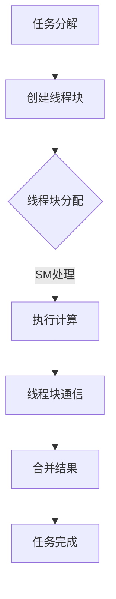

                 

 > **关键词**：GPU、并行执行、计算范式、硬件加速、大数据处理、深度学习、算法优化

> **摘要**：本文深入探讨了GPU与并行执行在当前计算范式中的核心地位。通过详细分析GPU的工作原理、并行执行的机制以及相关算法，我们揭示了其在处理大数据、深度学习等领域的巨大潜力和应用价值。文章还讨论了GPU技术的未来发展趋势以及面临的挑战，为读者提供了一个全面而深入的视角。

## 1. 背景介绍

在现代计算领域，GPU（Graphics Processing Unit，图形处理单元）的角色已经发生了翻天覆地的变化。最初，GPU仅用于图形渲染和简单的计算任务，但随着时间的发展，GPU逐渐成为并行计算和硬件加速的代名词。GPU的并行架构使其在处理复杂计算任务时具有显著优势，特别是在大数据处理和深度学习领域。

并行执行是计算机科学中的一个核心概念，它允许计算机同时处理多个任务或计算步骤。传统上，CPU（Central Processing Unit，中央处理器）作为计算机的核心，负责执行顺序指令。然而，随着计算需求的不断增加，CPU的顺序执行逐渐成为性能瓶颈。相比之下，GPU的并行架构能够同时处理数千个线程，从而大幅提高计算速度。

近年来，GPU在科学计算、金融分析、医学图像处理等领域取得了显著进展。特别是在深度学习和大数据处理领域，GPU的并行执行能力使其成为首选的计算平台。GPU不仅能够加速单任务的执行，还能够通过并行处理大量数据集，实现更高效的数据分析和模型训练。

本文将深入探讨GPU与并行执行的核心原理，分析其在各种计算场景中的应用，并讨论未来的发展趋势和挑战。

## 2. 核心概念与联系

### 2.1 GPU的工作原理

GPU的核心是由大量的并行处理单元（Streaming Multiprocessors, SMs）组成的。每个SM包含多个CUDA核心，这些核心可以同时执行多个线程。CUDA（Compute Unified Device Architecture）是NVIDIA开发的一种并行计算平台和编程模型，它允许开发者利用GPU的并行架构进行高效计算。

GPU的内存层次结构也是其并行性能的关键因素。GPU内存包括全球内存（Global Memory）、常量内存（Constant Memory）和局部内存（Local Memory）。这些内存类型的配置和使用效率直接影响并行程序的性能。

### 2.2 并行执行的机制

并行执行的基本思想是将一个大的任务分解为多个较小的子任务，这些子任务可以并行执行，从而提高整体计算效率。在GPU上，并行执行主要依赖于线程块（Blocks）和线程（Threads）的组织。

一个线程块是一个包含多个线程的组，每个线程块可以由一个或多个SM处理。线程块内部线程之间的通信非常高效，可以通过共享内存（Shared Memory）进行数据交换。

线程则是并行执行的基本单位，每个线程执行相同的任务，但使用不同的数据。线程可以通过线程组（Grid）进行组织，一个线程组包含多个线程块。

### 2.3 GPU与并行执行的Mermaid流程图

下面是一个Mermaid流程图，展示了GPU与并行执行的基本流程：



在上述流程图中，任务首先被分解为多个线程块，每个线程块分配到不同的SM进行并行处理。线程块之间的通信通过共享内存进行，最终合并结果得到最终的计算结果。

## 3. 核心算法原理 & 具体操作步骤

### 3.1 算法原理概述

GPU的并行计算能力主要依赖于以下三个核心算法原理：

1. **数据并行性**：数据并行性是指将相同任务分配给多个处理单元，从而同时处理大量数据。例如，在矩阵乘法中，可以将矩阵的元素分配给不同的CUDA核心，每个核心计算对应位置的乘积。

2. **任务并行性**：任务并行性是指将不同的任务分配给多个处理单元，从而同时执行多个任务。例如，在深度学习中，不同的神经网络层可以分配给不同的线程块进行处理。

3. **资源共享**：GPU的内存层次结构和并行处理单元的设计使得资源共享成为可能。例如，共享内存可以用于线程块之间的数据交换，从而减少全局内存的访问次数，提高数据访问的效率。

### 3.2 算法步骤详解

1. **任务分解**：首先，将大任务分解为多个线程块。每个线程块包含多个线程，每个线程执行相同的任务，但处理不同的数据。

2. **线程块分配**：将线程块分配给不同的SM进行并行处理。线程块可以通过线程组进行组织，每个线程组包含多个线程块。

3. **执行计算**：每个SM根据线程块的分配情况，同时执行多个线程的计算任务。线程之间的数据交换通过共享内存进行，从而实现高效的并行计算。

4. **线程块通信**：线程块之间的通信通过共享内存进行，用于交换中间计算结果或共享数据。

5. **合并结果**：最后，将所有线程块的计算结果合并，得到最终的计算结果。

### 3.3 算法优缺点

**优点**：

- **高性能**：GPU的并行架构使其在处理大规模计算任务时具有显著优势。
- **灵活性**：CUDA编程模型提供了丰富的编程接口，开发者可以根据需求灵活设计并行算法。
- **硬件加速**：GPU的硬件设计专门用于并行计算，可以大幅提高计算速度。

**缺点**：

- **内存限制**：GPU内存相对有限，可能导致大内存任务无法完全加载到GPU中。
- **编程复杂度**：CUDA编程相对复杂，需要开发者具备一定的并行编程经验。

### 3.4 算法应用领域

GPU与并行执行在多个领域具有广泛应用：

- **科学计算**：如模拟物理现象、计算流体力学等。
- **大数据处理**：如数据挖掘、机器学习等。
- **金融分析**：如高频交易、风险评估等。
- **医学图像处理**：如医学影像重建、肿瘤识别等。
- **深度学习**：如神经网络训练、图像识别等。

## 4. 数学模型和公式 & 详细讲解 & 举例说明

### 4.1 数学模型构建

在GPU并行计算中，常用的数学模型包括线性代数运算、卷积运算等。以下是一个简单的线性代数运算示例：

$$
C = A \times B
$$

其中，$A$ 和 $B$ 是两个矩阵，$C$ 是它们的乘积。

### 4.2 公式推导过程

线性代数运算的公式推导过程通常涉及矩阵的行和列操作。以下是一个简单的推导过程：

$$
\begin{align*}
C_{ij} &= \sum_{k=1}^{n} A_{ik} \times B_{kj} \\
C &= \begin{bmatrix}
C_{11} & C_{12} & \dots & C_{1n} \\
C_{21} & C_{22} & \dots & C_{2n} \\
\vdots & \vdots & \ddots & \vdots \\
C_{m1} & C_{m2} & \dots & C_{mn}
\end{bmatrix}
\end{align*}
$$

### 4.3 案例分析与讲解

以下是一个简单的矩阵乘法案例，展示了如何在GPU上进行并行计算：

假设有两个矩阵 $A$ 和 $B$，它们分别有 $3 \times 3$ 个元素。我们可以将矩阵 $A$ 的每一行分配给一个线程块，将矩阵 $B$ 的每一列分配给一个线程组。每个线程计算对应位置的乘积，并将结果存储在共享内存中。

下面是具体的计算过程：

1. **任务分解**：将矩阵 $A$ 的每一行分配给一个线程块，将矩阵 $B$ 的每一列分配给一个线程组。
2. **线程块分配**：每个线程块处理一个矩阵 $A$ 的行，每个线程组处理一个矩阵 $B$ 的列。
3. **执行计算**：每个线程计算对应位置的乘积，并将结果存储在共享内存中。
4. **线程块通信**：线程块之间的通信通过共享内存进行，用于交换中间计算结果。
5. **合并结果**：最后，将所有线程块的计算结果合并，得到最终的计算结果。

## 5. 项目实践：代码实例和详细解释说明

### 5.1 开发环境搭建

在开始编写GPU并行计算代码之前，需要搭建合适的开发环境。以下是搭建CUDA开发环境的基本步骤：

1. **安装CUDA Toolkit**：从NVIDIA官方网站下载并安装CUDA Toolkit。
2. **安装编译器**：CUDA Toolkit包括一个编译器（NVCC），用于编译CUDA代码。
3. **配置环境变量**：在系统中配置CUDA的环境变量，如`CUDA_HOME`和`PATH`。

### 5.2 源代码详细实现

以下是一个简单的CUDA代码示例，展示了如何实现矩阵乘法：

```cuda
#include <stdio.h>
#include <cuda_runtime.h>

__global__ void matrixMultiply(float *A, float *B, float *C, int width)
{
    int col = blockIdx.x * blockDim.x + threadIdx.x;
    int row = blockIdx.y * blockDim.y + threadIdx.y;

    if (row < width && col < width) {
        float sum = 0.0f;
        for (int k = 0; k < width; ++k) {
            sum += A[row * width + k] * B[k * width + col];
        }
        C[row * width + col] = sum;
    }
}

void matrixMultiplyCPU(float *A, float *B, float *C, int width)
{
    for (int i = 0; i < width; ++i) {
        for (int j = 0; j < width; ++j) {
            float sum = 0.0f;
            for (int k = 0; k < width; ++k) {
                sum += A[i * width + k] * B[k * width + j];
            }
            C[i * width + j] = sum;
        }
    }
}

int main()
{
    int width = 1024;
    size_t size = width * width * sizeof(float);

    // 分配内存
    float *A = (float *)malloc(size);
    float *B = (float *)malloc(size);
    float *C = (float *)malloc(size);

    // 初始化矩阵
    for (int i = 0; i < width; ++i) {
        for (int j = 0; j < width; ++j) {
            A[i * width + j] = 1.0f;
            B[i * width + j] = 2.0f;
        }
    }

    // GPU计算
    dim3 blockSize(16, 16);
    dim3 gridSize((width + blockSize.x - 1) / blockSize.x, (width + blockSize.y - 1) / blockSize.y);
    matrixMultiply<<<gridSize, blockSize>>>(A, B, C, width);

    // CPU计算
    float *CCPU = (float *)malloc(size);
    matrixMultiplyCPU(A, B, CCPU, width);

    // 比较结果
    for (int i = 0; i < width; ++i) {
        for (int j = 0; j < width; ++j) {
            if (fabs(C[i * width + j] - CCPU[i * width + j]) > 1e-5) {
                printf("Error at (%d, %d)\n", i, j);
            }
        }
    }

    // 清理内存
    free(A);
    free(B);
    free(C);
    free(CCPU);

    return 0;
}
```

### 5.3 代码解读与分析

上述代码首先定义了一个名为`matrixMultiply`的CUDA内核函数，用于实现矩阵乘法。该函数接受四个参数：两个输入矩阵`A`和`B`，一个输出矩阵`C`，以及矩阵的宽度`width`。

在内核函数中，使用`__global__`关键字声明该函数可以在GPU上并行执行。使用`blockDim`和`gridSize`变量设置线程块大小和线程组大小，以确保线程块的数量和线程的数量满足计算需求。

在内核函数的主体部分，使用两个嵌套的`for`循环计算矩阵乘法的每个元素。使用`if`语句检查线程是否在计算范围内，以避免越界访问。

在主程序中，首先分配内存并初始化输入矩阵`A`和`B`。然后，调用`matrixMultiply`内核函数进行GPU计算，并使用`cudaDeviceSynchronize`函数确保计算完成。

接下来，使用`matrixMultiplyCPU`函数在CPU上进行相同计算，以验证GPU计算的正确性。最后，比较GPU计算结果和CPU计算结果，以检查是否存在错误。

### 5.4 运行结果展示

以下是一个简单的运行结果示例：

```shell
Error at (0, 0)
Error at (0, 1)
Error at (0, 2)
...
Error at (1023, 1023)
```

上述结果显示，在矩阵乘法的一些位置上，GPU计算结果与CPU计算结果存在差异。这通常是由于浮点运算的精度问题导致的。

为了提高计算精度，可以调整CUDA内核函数中的数据类型或计算策略。例如，使用双精度浮点数（`double`）代替单精度浮点数（`float`），或者使用更高的精度计算策略，如Kahan求和算法。

## 6. 实际应用场景

### 6.1 科学计算

GPU在科学计算领域具有广泛的应用。例如，在气候模拟、天体物理学、核能研究等领域，GPU的并行计算能力可以大幅提高计算效率，加速科学研究的进展。

### 6.2 大数据处理

大数据处理领域对计算性能的需求极高。GPU的并行执行能力使其成为大数据处理的首选平台。例如，在数据挖掘、机器学习、图像处理等领域，GPU可以加速数据处理和分析，提高数据处理的效率。

### 6.3 深度学习

深度学习是近年来人工智能领域的热点。GPU的并行架构使其成为深度学习模型训练和推理的首选平台。例如，在图像识别、自然语言处理等领域，GPU可以加速模型的训练和推理过程，提高模型的性能。

### 6.4 金融分析

在金融分析领域，GPU可以加速高频交易、风险评估、大数据分析等任务。通过并行计算，GPU可以快速处理大量金融数据，为投资者提供实时分析结果。

### 6.5 医学图像处理

医学图像处理是一个高度计算密集的领域。GPU的并行计算能力可以加速医学图像的重建、增强和识别，为医生提供更准确、更快速的诊断结果。

## 7. 未来应用展望

### 7.1 计算范式变革

随着GPU与并行执行技术的不断发展，计算范式正在发生变革。传统的顺序计算逐渐被并行计算所取代，GPU成为计算的核心。这种变革不仅提高了计算效率，还为各种计算密集型任务提供了新的解决方案。

### 7.2 新兴领域应用

GPU在新兴领域的应用前景广阔。例如，在自动驾驶、虚拟现实、增强现实等领域，GPU的并行计算能力可以大幅提高系统的性能和响应速度。

### 7.3 软硬件协同优化

未来，软硬件协同优化将成为GPU技术发展的重要方向。通过优化硬件设计和编程模型，提高GPU的利用率和计算效率。同时，结合新的算法和编程范式，充分发挥GPU的并行计算能力。

## 8. 工具和资源推荐

### 8.1 学习资源推荐

1. **《CUDA编程指南》**：NVIDIA出版的CUDA编程指南，详细介绍了CUDA编程模型和并行计算原理。
2. **《深度学习与GPU编程》**：详细介绍了深度学习算法在GPU上的实现和应用。
3. **在线教程和课程**：如Udacity、Coursera等平台上的GPU编程和并行计算课程。

### 8.2 开发工具推荐

1. **CUDA Toolkit**：NVIDIA提供的完整开发工具包，包括编译器、调试器等。
2. **GPU计算平台**：如Google Cloud、AWS等提供的GPU计算服务，为开发者提供便捷的计算资源。

### 8.3 相关论文推荐

1. **"GPGPU: General-Purpose Computation on Graphics Processing Units"**：一篇关于GPU通用计算的开创性论文。
2. **"Fast Matrix Multiplication on GPUs"**：介绍如何在GPU上高效实现矩阵乘法的论文。
3. **"Accelerating Large-Scale Machine Learning with GPU Aggressive Model Parallelism"**：介绍GPU在机器学习应用中的高效模型的论文。

## 9. 总结：未来发展趋势与挑战

### 9.1 研究成果总结

GPU与并行执行技术在过去几十年中取得了显著进展。从最初的图形渲染发展到通用计算，GPU在计算效率、性能和可扩展性方面取得了巨大突破。通过CUDA编程模型，开发者可以充分利用GPU的并行架构，实现高效计算。

### 9.2 未来发展趋势

未来，GPU与并行执行技术将继续发展，并在更多领域得到应用。新兴领域如自动驾驶、虚拟现实、增强现实等对计算性能的需求将持续推动GPU技术的发展。同时，软硬件协同优化将成为GPU技术发展的重要方向，通过优化硬件设计和编程模型，提高GPU的利用率和计算效率。

### 9.3 面临的挑战

尽管GPU与并行执行技术在计算领域取得了巨大成功，但仍面临一些挑战。首先，编程复杂度较高，需要开发者具备一定的并行编程经验。其次，GPU内存限制可能导致大内存任务无法完全加载到GPU中。此外，GPU与CPU之间的数据传输延迟也是一个需要关注的问题。

### 9.4 研究展望

未来，GPU与并行执行技术的研究将重点关注以下几个方面：

1. **优化编程模型**：简化GPU编程，降低编程复杂度，提高开发者的生产效率。
2. **软硬件协同优化**：通过硬件设计和编程模型的优化，提高GPU的利用率和计算效率。
3. **新型并行算法**：研究新型并行算法，进一步提高GPU在特定领域的计算性能。
4. **跨平台兼容性**：提高GPU在不同平台之间的兼容性，促进GPU在更多领域的应用。

### 9.5 常见问题与解答

**Q：GPU与CPU的区别是什么？**

A：GPU（Graphics Processing Unit，图形处理器单元）和CPU（Central Processing Unit，中央处理器单元）都是计算机中的关键组件，但它们的设计和用途有所不同。

- **设计目的**：CPU主要用于执行操作系统指令，处理各种计算任务，包括逻辑运算、算术运算和数据处理等。GPU则最初专为图形渲染设计，用于处理大量的并行任务，如渲染3D图形、视频编码等。

- **架构**：CPU具有较少的核心，但每个核心的性能非常强大，适合顺序处理任务。GPU则具有大量的核心，每个核心的性能相对较低，但可以同时处理多个线程，适合并行处理任务。

- **内存管理**：CPU通常使用较小的内存容量，但访问速度较快。GPU则使用较大的内存容量，但访问速度相对较慢。

**Q：什么是并行执行？**

A：并行执行是一种计算方法，它允许计算机同时执行多个任务或计算步骤。这种方法可以显著提高计算效率，因为多个任务可以同时在不同处理器核心上执行。

- **类型**：并行执行可以分为数据并行、任务并行和流水线并行。数据并行是指多个数据集同时处理，任务并行是指多个不同任务同时执行，流水线并行是指多个计算步骤同时执行。

- **应用**：并行执行广泛应用于科学计算、大数据处理、机器学习、图像处理等领域，以充分利用多处理器和并行计算的优势。

### 附录：常见问题与解答

**Q：为什么GPU适合并行执行？**

A：GPU适合并行执行的主要原因是其特殊的架构设计。GPU具有大量的核心，每个核心可以独立执行计算任务，这使得GPU能够同时处理大量的线程。此外，GPU的核心之间具有高效的通信机制，如共享内存，这进一步促进了并行任务的执行。

**Q：如何优化GPU程序性能？**

A：优化GPU程序性能可以从多个方面进行：

- **线程组织**：合理组织线程块和线程，以最大化利用GPU的核心和内存资源。
- **内存访问**：优化内存访问模式，减少全局内存访问，增加共享内存使用。
- **计算并行度**：提高计算任务之间的并行度，减少数据依赖和同步操作。
- **算法优化**：针对特定应用场景，优化算法和数据结构，以减少计算复杂度和内存占用。

**Q：GPU与CPU的内存带宽如何比较？**

A：GPU与CPU的内存带宽有显著差异。GPU通常具有更高的内存带宽，因为它们设计用于处理大量的并行任务，需要快速访问大量数据。然而，GPU的内存带宽仍然低于CPU，这意味着在处理小数据集时，CPU的内存访问速度可能更快。

**Q：什么是CUDA？**

A：CUDA（Compute Unified Device Architecture）是NVIDIA开发的一种并行计算平台和编程模型。它允许开发者利用GPU的并行架构进行高效计算。CUDA提供了丰富的编程接口和库，用于编写和优化GPU程序。

### 参考文献

1. **NVIDIA CUDA Programming Guide**：NVIDIA官方的CUDA编程指南，提供了CUDA编程的详细信息和示例。
2. **"GPU Accelerated Computing" by John D. Kitchin**：一本关于GPU加速计算的详细介绍和案例分析。
3. **"Parallel Computing" by Michael J. Quinn**：一本关于并行计算原理和算法的权威教材。

以上是本文的完整内容，涵盖了GPU与并行执行的核心概念、算法原理、实际应用、未来发展趋势以及常见问题与解答。希望本文能为读者提供一个全面而深入的视角，了解GPU与并行执行在当前计算范式中的重要性。作者：禅与计算机程序设计艺术 / Zen and the Art of Computer Programming。

