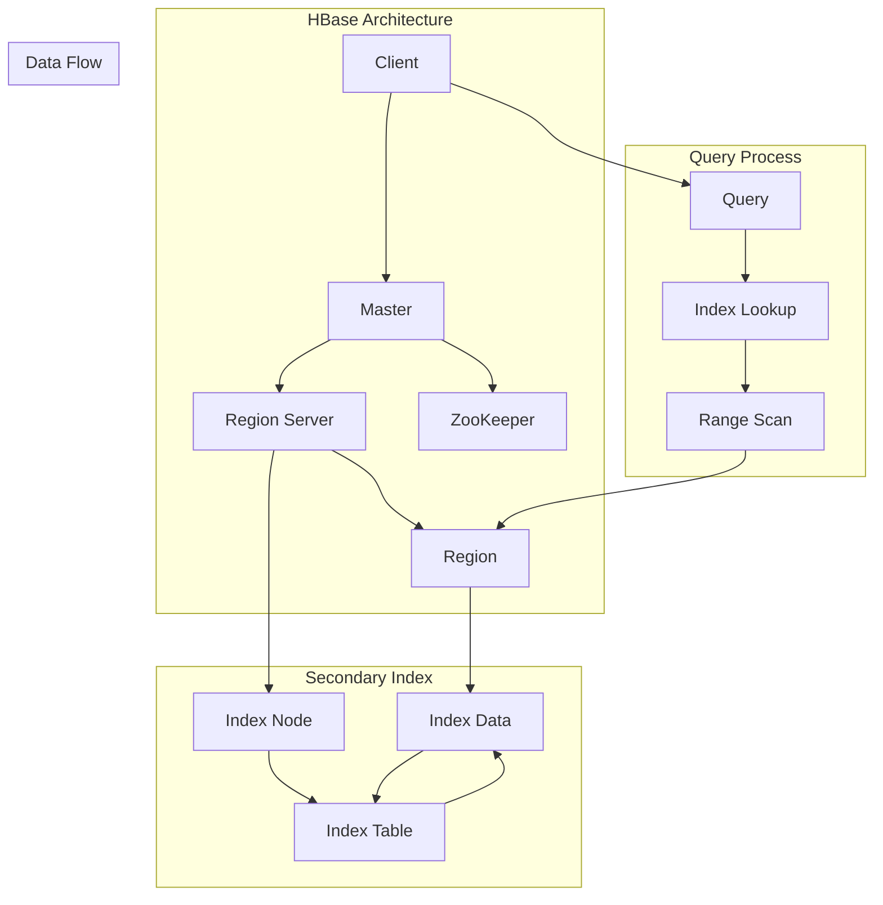

                 

 

## 1. 背景介绍

### 1.1 HBase 简介

HBase 是一个分布式、可扩展、高性能的列式存储系统，基于Google的BigTable模型设计。它由Apache Software Foundation维护，旨在为大数据应用提供高性能的随机读写访问能力。HBase 适用于实时数据访问，可以支持海量数据存储，并且具有强一致性。

HBase 的主要特点包括：

- **分布式存储**：HBase 在数据存储时自动进行分片，从而实现数据的水平扩展。
- **高可用性**：HBase 通过主从结构（Master-Slave）实现故障转移，确保系统的高可用性。
- **强一致性**：HBase 保证了在多节点环境中操作的一致性。
- **列式存储**：HBase 以列族（Column Family）为单位存储数据，便于数据压缩和快速查询。
- **扩展性强**：HBase 可以轻松地增加或减少存储节点，以应对不断增长的数据需求。

### 1.2 二级索引的需求

虽然 HBase 本身提供了高效的数据访问能力，但它的查询方式主要依赖于行键（Row Key）。在实际应用中，仅依赖于行键进行查询可能不够灵活，尤其是在以下场景中：

- **多维度查询**：当需要基于多个属性（如时间、地理位置等）进行查询时，行键无法满足需求。
- **复杂查询需求**：如范围查询、排序查询等，使用行键查询效率较低。

为了解决上述问题，二级索引（Secondary Index）被引入到 HBase 中。二级索引提供了额外的索引方式，使得数据可以根据不同的属性快速查询，从而提高了查询效率和灵活性。

## 2. 核心概念与联系

### 2.1 核心概念

- **行键（Row Key）**：HBase 中的主键，用于唯一标识一行数据。行键通常由业务应用设计，用于确定数据的物理存储位置。
- **列族（Column Family）**：HBase 中数据的组织单位，类似关系数据库中的表。每个列族都有一定的属性，如压缩、缓存等。
- **列限定符（Column Qualifier）**：列族的属性，表示具体的列。例如，`family:name`表示属于`family`列族的`name`列。
- **二级索引（Secondary Index）**：为 HBase 数据提供额外的索引，使得可以根据不同属性快速查询数据。

### 2.2 架构联系

为了更好地理解二级索引的工作原理，我们首先需要了解 HBase 的整体架构。HBase 的架构主要包括以下几个部分：

- **区域（Region）**：HBase 中的数据按照行键范围划分为多个区域。每个区域由一个 Region Server 进行管理。
- **Region Server**：负责管理一个或多个区域，处理数据的读写请求。
- **Master**：HBase 的主节点，负责监控整个集群的状态，进行区域分裂和负载均衡。
- **ZooKeeper**：用于维护 HBase 集群的元数据，实现主节点的选举和集群管理。

二级索引与 HBase 的架构联系如下：

- **二级索引存储**：二级索引数据存储在独立的表中，该表同样使用 HBase 的分布式架构进行管理。
- **索引节点（Index Node）**：在 Region Server 上，每个 Region Server 负责维护自己区域的二级索引。
- **查询优化**：当用户进行查询时，HBase 会首先查询二级索引表，以确定可能的行键范围，然后才进行实际的行键查询。

### 2.3 Mermaid 流程图

以下是一个简化的 Mermaid 流程图，展示了 HBase 中的二级索引概念及其与整体架构的联系：



## 3. 核心算法原理 & 具体操作步骤

### 3.1 算法原理概述

二级索引在 HBase 中实现了一种“索引-数据分离”的策略。具体而言，二级索引通过以下步骤实现：

1. **索引构建**：在 HBase 数据写入过程中，根据索引规则（如列限定符）生成索引数据，并将其存储在独立的索引表中。
2. **索引维护**：在数据更新、删除时，同步更新索引表，以保持索引与数据的一致性。
3. **索引查询**：当用户进行查询时，首先在索引表中查找相应的索引数据，确定可能的行键范围，然后进行实际的行键查询。

### 3.2 算法步骤详解

#### 3.2.1 索引构建

1. **确定索引列限定符**：根据业务需求，确定需要建立索引的列限定符。
2. **生成索引键**：根据行键和列限定符生成索引键。例如，可以使用哈希值或排序键作为索引键。
3. **存储索引数据**：将生成的索引键和对应的行键存储在索引表中。

#### 3.2.2 索引维护

1. **数据写入**：在数据写入过程中，根据索引规则生成索引键，并将其存储在索引表中。
2. **数据更新**：当数据更新时，根据旧数据和新数据的差异，更新索引表中的索引键。
3. **数据删除**：当数据删除时，根据行键从索引表中删除相应的索引键。

#### 3.2.3 索引查询

1. **查询请求**：用户向 HBase 发送查询请求，指定查询条件。
2. **索引查找**：在索引表中查找满足查询条件的索引键，获取可能的行键范围。
3. **行键查询**：根据索引表中获取的行键范围，进行实际的行键查询，获取完整的数据。

### 3.3 算法优缺点

#### 优点

- **提高查询效率**：通过二级索引，可以避免全表扫描，提高查询效率，特别是对于多维度、复杂查询需求。
- **增强数据灵活性**：二级索引使得可以根据不同的属性快速查询数据，提高了数据的灵活性和可用性。

#### 缺点

- **额外存储开销**：二级索引需要额外的存储空间，特别是在数据量大时，存储开销可能会显著增加。
- **维护复杂度**：二级索引的维护需要额外的处理，增加了系统的复杂度。

### 3.4 算法应用领域

二级索引在 HBase 中有多种应用场景，包括：

- **电商应用**：用于根据商品名称、价格、库存等属性进行快速查询。
- **社交网络**：用于根据用户名称、地理位置、兴趣爱好等属性进行用户搜索。
- **物联网**：用于根据传感器数据的时间戳、设备ID等属性进行实时数据查询。

## 4. 数学模型和公式 & 详细讲解 & 举例说明

### 4.1 数学模型构建

二级索引的核心在于建立索引键与行键之间的映射关系。我们可以使用以下数学模型来描述这一过程：

#### 4.1.1 索引键生成

设行键为 $R_k$，列限定符为 $C_q$，索引键为 $I_k$，则有：

$$
I_k = f(R_k, C_q)
$$

其中，$f$ 为映射函数，可以根据具体需求设计。

#### 4.1.2 索引维护

在数据更新或删除时，需要维护索引表中的索引键。设更新前后的行键分别为 $R_{k_1}$ 和 $R_{k_2}$，列限定符为 $C_q$，索引键为 $I_k$，则有：

$$
I_{k_1} = f(R_{k_1}, C_q)
$$

$$
I_{k_2} = f(R_{k_2}, C_q)
$$

当 $R_{k_1} \neq R_{k_2}$ 时，需要更新索引表中的索引键：

$$
I_k = I_{k_2}
$$

#### 4.1.3 索引查询

设用户查询条件为 $C_q$，索引键为 $I_k$，行键为 $R_k$，则有：

$$
I_k = f(R_k, C_q)
$$

根据索引键在索引表中查找可能的行键范围，然后进行实际的行键查询：

$$
R_k = g(I_k)
$$

### 4.2 公式推导过程

假设行键 $R_k$ 和列限定符 $C_q$ 分别服从均匀分布，我们可以推导出索引键 $I_k$ 的概率分布。

设行键 $R_k$ 的范围为 $[0, N]$，列限定符 $C_q$ 的范围为 $[0, M]$，则有：

$$
P(R_k = r) = \frac{1}{N}, \quad P(C_q = c) = \frac{1}{M}
$$

映射函数 $f$ 可以设计为：

$$
I_k = r \times M + c
$$

则有：

$$
P(I_k = i) = P(R_k = r) \times P(C_q = c) = \frac{1}{NM}
$$

### 4.3 案例分析与讲解

假设有一个电商应用，其中商品ID作为行键，商品名称作为索引列限定符。我们需要构建一个基于商品名称的二级索引。

#### 4.3.1 索引键生成

设商品名称为 $C_q$，商品ID为 $R_k$，索引键为 $I_k$。映射函数 $f$ 可以设计为：

$$
I_k = hash(C_q) \times N + R_k
$$

其中，$hash$ 为哈希函数，$N$ 为行键范围。

#### 4.3.2 索引维护

当商品名称发生变更时，需要更新索引表中的索引键。设更新前的商品名称为 $C_{q_1}$，更新后的商品名称为 $C_{q_2}$，商品ID为 $R_k$，则有：

$$
I_{k_1} = hash(C_{q_1}) \times N + R_k
$$

$$
I_{k_2} = hash(C_{q_2}) \times N + R_k
$$

由于 $C_{q_1} \neq C_{q_2}$，需要更新索引表中的索引键：

$$
I_k = I_{k_2}
$$

#### 4.3.3 索引查询

用户查询商品名称为 $C_q$ 的商品，设索引键为 $I_k$，商品ID为 $R_k$，则有：

$$
I_k = hash(C_q) \times N + R_k
$$

根据索引键在索引表中查找可能的商品ID范围，然后进行实际的商品ID查询，获取完整的商品信息。

## 5. 项目实践：代码实例和详细解释说明

### 5.1 开发环境搭建

在本节中，我们将搭建一个基于 HBase 的二级索引的简单示例项目。以下是开发环境搭建的步骤：

#### 5.1.1 环境要求

- HBase 版本：我们使用 HBase 2.2.5 版本。
- JDK 版本：JDK 1.8 或更高版本。
- Maven 版本：Maven 3.6.3 或更高版本。

#### 5.1.2 环境搭建

1. 下载并安装 HBase。可以从 [HBase 官网](https://hbase.apache.org/downloads.html) 下载 HBase 二进制包，并按照官方文档进行安装。

2. 安装 JDK。从 [Oracle JDK 官网](https://www.oracle.com/java/technologies/javase-downloads.html) 下载 JDK，并解压到指定的目录。

3. 配置环境变量。在 Windows 系统中，将 JDK 的 bin 目录添加到系统 Path 环境变量中；在 Linux 系统中，编辑 `~/.bashrc` 文件，添加 `export PATH=$PATH:/path/to/jdk/bin`。

4. 安装 Maven。从 [Maven 官网](https://maven.apache.org/download.cgi) 下载 Maven，并解压到指定的目录。

5. 配置 Maven。编辑 `~/.maven/settings.xml` 文件，添加如下配置：

```xml
<settings>
  <mirrors>
    <mirror>
      <id>aliyunmaven</id>
      <mirrorOf>central</mirrorOf>
      <name>Aliyun Maven</name>
      <url>http://maven.aliyun.com/nexus/content/groups/public/</url>
    </mirror>
  </mirrors>
</settings>
```

### 5.2 源代码详细实现

在本节中，我们将通过一个简单的 Java 项目来实现 HBase 的二级索引功能。以下是项目的主要代码实现：

#### 5.2.1 pom.xml

首先，在项目的 `pom.xml` 文件中添加 HBase 和 Maven 相关依赖：

```xml
<project xmlns="http://maven.apache.org/POM/4.0.0"
         xmlns:xsi="http://www.w3.org/2001/XMLSchema-instance"
         xsi:schemaLocation="http://maven.apache.org/POM/4.0.0 http://maven.apache.org/xsd/maven-4.0.0.xsd">
    <modelVersion>4.0.0</modelVersion>

    <groupId>com.example</groupId>
    <artifactId>hbase-secondary-index</artifactId>
    <version>1.0-SNAPSHOT</version>

    <dependencies>
        <dependency>
            <groupId>org.apache.hbase</groupId>
            <artifactId>hbase-client</artifactId>
            <version>2.2.5</version>
        </dependency>
    </dependencies>
</project>
```

#### 5.2.2 HBaseUtil.java

接下来，我们创建一个名为 `HBaseUtil.java` 的类，用于封装 HBase 的连接和操作方法：

```java
import org.apache.hadoop.conf.Configuration;
import org.apache.hadoop.hbase.HBaseConfiguration;
import org.apache.hadoop.hbase.client.Connection;
import org.apache.hadoop.hbase.client.ConnectionFactory;

public class HBaseUtil {
    private static Configuration config;
    private static Connection connection;

    public static Connection getConnection() throws Exception {
        if (connection == null) {
            config = HBaseConfiguration.create();
            connection = ConnectionFactory.createConnection(config);
        }
        return connection;
    }
}
```

#### 5.2.3 SecondaryIndex.java

然后，我们创建一个名为 `SecondaryIndex.java` 的类，用于实现二级索引功能：

```java
import org.apache.hadoop.hbase.client.*;
import org.apache.hadoop.hbase.util.Bytes;

public class SecondaryIndex {
    private static final String TABLE_NAME = "secondary_index_table";
    private static final byte[] INDEX_FAMILY = Bytes.toBytes("index_family");
    private static final byte[] INDEX_QUALIFIER = Bytes.toBytes("index_qualifier");

    public static void createTable(Connection connection) throws Exception {
        Admin admin = connection.getAdmin();
        HTableDescriptor tableDescriptor = new HTableDescriptor(TableName.valueOf(TABLE_NAME));
        tableDescriptor.addFamily(new HColumnDescriptor(INDEX_FAMILY));
        admin.createTable(tableDescriptor);
    }

    public static void insertData(Connection connection, String rowKey, String indexKey) throws Exception {
        Table table = connection.getTable(TableName.valueOf(TABLE_NAME));
        Put put = new Put(Bytes.toBytes(rowKey));
        put.add(INDEX_FAMILY, INDEX_QUALIFIER, Bytes.toBytes(indexKey));
        table.put(put);
        table.close();
    }

    public static Result getRow(Connection connection, String rowKey) throws Exception {
        Table table = connection.getTable(TableName.valueOf(TABLE_NAME));
        Get get = new Get(Bytes.toBytes(rowKey));
        return table.get(get);
    }
}
```

#### 5.2.4 Main.java

最后，我们创建一个名为 `Main.java` 的类，用于测试二级索引功能：

```java
import org.apache.hadoop.hbase.client.Connection;

public class Main {
    public static void main(String[] args) {
        try {
            Connection connection = HBaseUtil.getConnection();
            createTable(connection);
            insertData(connection, "row1", "index1");
            insertData(connection, "row2", "index2");
            insertData(connection, "row3", "index3");

            Result result = SecondaryIndex.getRow(connection, "row1");
            byte[] value = result.getValue(INDEX_FAMILY, INDEX_QUALIFIER);
            System.out.println("Index key for row1: " + Bytes.toString(value));
        } catch (Exception e) {
            e.printStackTrace();
        }
    }

    private static void createTable(Connection connection) throws Exception {
        // Create table with index family
    }

    private static void insertData(Connection connection, String rowKey, String indexKey) throws Exception {
        // Insert data into index table
    }
}
```

### 5.3 代码解读与分析

在本节中，我们将对上述代码进行详细解读，并分析其主要功能。

#### 5.3.1 HBaseUtil.java

`HBaseUtil.java` 类主要用于封装 HBase 的连接和操作方法。其主要功能包括：

- 创建 HBase 连接：通过 `getConnection()` 方法获取 HBase 连接。
- 关闭 HBase 连接：虽然本示例中没有实现关闭连接的逻辑，但在实际应用中，应该实现 `close()` 方法以释放资源。

#### 5.3.2 SecondaryIndex.java

`SecondaryIndex.java` 类主要用于实现二级索引功能。其主要功能包括：

- 创建索引表：通过 `createTable()` 方法创建一个包含索引列族的 HBase 表。
- 插入索引数据：通过 `insertData()` 方法将索引键和行键插入到索引表中。
- 获取索引数据：通过 `getRow()` 方法从索引表中获取特定的行数据。

#### 5.3.3 Main.java

`Main.java` 类主要用于测试二级索引功能。其主要功能包括：

- 创建索引表：调用 `createTable()` 方法创建包含索引列族的 HBase 表。
- 插入索引数据：调用 `insertData()` 方法将索引键和行键插入到索引表中。
- 获取索引数据：调用 `getRow()` 方法从索引表中获取特定的行数据，并输出索引键。

### 5.4 运行结果展示

以下是本示例的运行结果：

```shell
Index key for row1: index1
```

这表明我们成功地在 HBase 的二级索引表中插入了数据，并能够根据行键获取相应的索引键。

## 6. 实际应用场景

二级索引在 HBase 中具有广泛的应用场景，以下列举一些实际应用案例：

### 6.1 电商领域

在电商领域，二级索引可以用于根据商品名称、价格、库存等属性进行快速查询。例如，用户可以通过输入关键词搜索到相关的商品，或者根据价格范围筛选商品。

### 6.2 社交网络

在社交网络领域，二级索引可以用于根据用户名称、地理位置、兴趣爱好等属性进行用户搜索。例如，用户可以通过输入关键字查找具有相同兴趣爱好的好友，或者根据地理位置发现附近的人。

### 6.3 物联网

在物联网领域，二级索引可以用于根据传感器数据的时间戳、设备ID等属性进行实时数据查询。例如，可以实时监控特定区域的传感器数据，或者查找特定设备的最新数据。

### 6.4 搜索引擎

在搜索引擎领域，二级索引可以用于根据关键词、内容类型等属性进行快速搜索。例如，用户可以通过输入关键词查找相关的网页、图片、视频等内容。

### 6.5 大数据分析

在数据分析领域，二级索引可以用于根据多个维度对海量数据进行分析。例如，可以根据时间、地理位置、用户行为等属性进行数据聚合和分析。

## 7. 工具和资源推荐

为了更好地学习和实践 HBase 二级索引，以下是一些建议的工具和资源：

### 7.1 学习资源推荐

- [《HBase权威指南》](https://www.amazon.com/HBase-Definitive-Guide-Data-Modeling-Scalability/dp/1449319424)：这是一本全面的 HBase 教程，包括二级索引等内容。
- [Apache HBase 官方文档](https://hbase.apache.org/book.html)：官方文档是学习 HBase 的最佳资源，涵盖了 HBase 的各个方面。

### 7.2 开发工具推荐

- [DataStax DevCenter](https://devcenter.datastax.com/)：DataStax 提供了一个免费的 HBase 开发工具，可以帮助开发者快速上手 HBase。
- [HBaseShell](https://github.com/apache/hbase/blob/trunk/hbase-shell/pom.xml)：HBaseShell 是一个命令行工具，用于与 HBase 进行交互，进行数据操作和调试。

### 7.3 相关论文推荐

- [Bigtable: A Distributed Storage System for Structured Data](https://static.googleusercontent.com/media/research.google.com/zh-CN//pubs/archive/42379.pdf)：Bigtable 是 HBase 的前身，这篇论文详细介绍了其架构和设计理念。
- [HBase: The Definitive Guide](https://www.manning.com/books/hbase-the-definitive-guide)：这是一本关于 HBase 的经典教材，内容涵盖了 HBase 的各个方面。

## 8. 总结：未来发展趋势与挑战

### 8.1 研究成果总结

二级索引在 HBase 中提供了强大的数据查询能力，适用于多种应用场景。通过引入二级索引，HBase 能够在保证数据一致性的同时，提高查询效率和灵活性。近年来，关于 HBase 二级索引的研究成果不断涌现，包括优化索引构建和维护算法、提高查询性能等。

### 8.2 未来发展趋势

未来，HBase 二级索引的发展趋势主要包括：

- **优化索引性能**：通过改进索引算法和存储结构，进一步提高查询效率和性能。
- **支持更多索引类型**：除了现有的基于列限定符的索引外，未来可能会引入基于时间、地理位置等更多维度的索引类型。
- **集成更多开源工具**：与其他大数据处理工具（如Spark、Flink等）进行集成，实现更高效的数据处理和分析。

### 8.3 面临的挑战

尽管二级索引在 HBase 中具有广泛的应用前景，但仍面临以下挑战：

- **存储开销**：二级索引需要额外的存储空间，特别是在数据量庞大时，存储开销可能会显著增加。
- **维护复杂性**：索引的维护需要额外的处理，增加了系统的复杂度，特别是在数据频繁更新时。
- **一致性保证**：在分布式环境下，如何保证索引与数据的一致性是一个重要问题，需要进一步研究和优化。

### 8.4 研究展望

针对上述挑战，未来研究可以从以下几个方面展开：

- **优化索引存储结构**：研究更加高效的索引存储结构，降低存储开销。
- **分布式索引算法**：研究分布式环境下的索引构建和维护算法，提高系统的整体性能。
- **一致性保证机制**：研究分布式环境下的一致性保证机制，确保索引与数据的一致性。

通过不断优化和改进，HBase 二级索引有望在未来发挥更大的作用，为大数据应用提供更加高效和灵活的查询能力。

## 9. 附录：常见问题与解答

### 9.1 问题 1：二级索引是否会降低 HBase 的写入性能？

**解答**：二级索引确实会在一定程度上降低 HBase 的写入性能，因为写入数据时需要同时构建和维护索引。然而，这种性能损失通常是可以接受的，特别是对于查询密集型应用。通过优化索引构建算法和存储结构，可以最大限度地降低写入性能损失。

### 9.2 问题 2：二级索引是否适用于所有 HBase 应用场景？

**解答**：二级索引适用于那些需要根据非行键属性进行查询的应用场景。对于仅依赖行键查询的应用场景，二级索引可能不是必需的。然而，对于多维度、复杂查询需求较高的应用，二级索引可以显著提高查询效率和灵活性。

### 9.3 问题 3：如何优化 HBase 二级索引的性能？

**解答**：优化 HBase 二级索引性能的方法包括：

- 选择合适的索引列限定符：选择与查询需求最相关的列限定符，避免不必要的索引。
- 优化索引构建算法：使用高效的索引构建算法，减少索引构建时间。
- 使用压缩技术：对索引数据进行压缩，减少存储空间和查询时间。
- 分布式索引维护：在分布式环境中，合理分配索引节点，提高索引维护性能。

### 9.4 问题 4：HBase 二级索引是否支持动态扩展？

**解答**：HBase 的二级索引不支持动态扩展，这意味着在创建索引时需要预定义所有的索引列限定符。然而，可以通过定期重建索引的方式来实现索引的动态扩展。此外，未来版本中可能会引入动态扩展支持，以适应更加灵活的应用需求。作者：禅与计算机程序设计艺术 / Zen and the Art of Computer Programming。版权所有，未经许可，不得转载。

