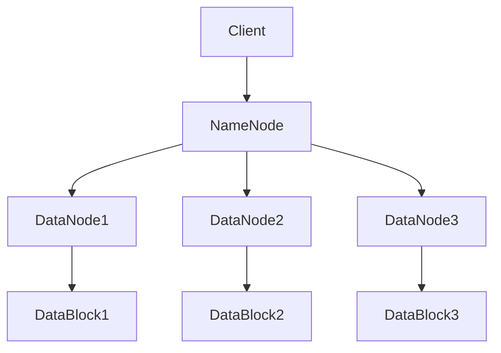

                 

在当今的数据驱动时代，大数据处理和存储的需求不断增长。传统的集中式文件系统在处理海量数据时显得力不从心，无法满足高效性和可扩展性的需求。这时，分布式文件系统如Hadoop分布式文件系统（HDFS）应运而生，它以高效的数据处理能力和强大的扩展性，成为了大数据处理领域的重要基石。本文将详细介绍Hadoop集群和分布式文件系统的原理、实现和应用。

## 关键词

- Hadoop
- 分布式文件系统
- HDFS
- 大数据
- 扩展性
- 高效性

## 摘要

本文将深入探讨Hadoop集群和分布式文件系统（HDFS）的核心概念、原理和实现。首先，我们将介绍Hadoop集群的组成和架构，解析其在大数据处理中的优势。接着，我们将详细解释HDFS的工作原理，包括数据存储、读写流程和可靠性保障。随后，本文将分析HDFS的核心算法原理，包括数据分片和数据复制机制。最后，我们将通过实际项目实践，展示HDFS在开发中的应用，并讨论其未来发展趋势和挑战。

## 1. 背景介绍

随着互联网和物联网的快速发展，数据量呈爆炸式增长。传统的集中式文件系统如EXT3、NTFS等，在设计之初并未考虑到海量数据的存储和处理需求，导致其在面对大规模数据时存在诸多局限。主要表现在：

1. **扩展性差**：集中式文件系统依赖于单一存储设备，当数据量超过单台设备容量时，需要通过扩展设备来增加存储容量。然而，这种扩展方式不仅成本高昂，而且可能导致系统性能下降。
2. **可靠性不足**：在集中式文件系统中，数据通常集中存储在一台或几台服务器上，一旦这些服务器发生故障，整个系统将无法访问数据，数据丢失的风险极大。
3. **并发处理能力弱**：集中式文件系统在处理并发读写请求时，容易出现瓶颈，导致性能下降。

为了解决这些问题，分布式文件系统应运而生。分布式文件系统通过将数据分散存储在多台服务器上，实现了数据的高效存储和访问。其中，Hadoop分布式文件系统（HDFS）是最具代表性的分布式文件系统之一。HDFS具有高扩展性、高可靠性、高并发处理能力等特点，成为大数据处理领域的重要基础设施。

## 2. 核心概念与联系

### Hadoop集群

Hadoop集群是由多台服务器组成的分布式计算集群，通常包括以下几个核心组成部分：

1. **NameNode**：NameNode是Hadoop集群的主节点，负责管理文件的元数据，如文件名、文件路径、数据块等信息。它类似于传统文件系统中的文件管理器。
2. **DataNode**：DataNode是Hadoop集群的从节点，负责存储实际的数据块，并向客户端提供数据读写服务。每个DataNode都会向NameNode汇报自己的状态和数据块信息。
3. **JobTracker**：JobTracker是Hadoop集群的管理节点，负责调度和管理MapReduce作业。它将作业分解为多个任务，并将这些任务分配给适合的TaskTracker执行。
4. **TaskTracker**：TaskTracker是Hadoop集群的执行节点，负责执行JobTracker分配的任务。它向JobTracker汇报自己的状态和任务执行情况。

### HDFS

HDFS是Hadoop分布式文件系统（Hadoop Distributed File System）的简称，是Hadoop集群的底层分布式文件系统。HDFS具有以下核心特点：

1. **高扩展性**：HDFS通过将数据分成大量小块（通常为64MB或128MB），并存储在多台服务器上，实现了数据的高效扩展。当数据量超过单台服务器容量时，只需增加更多的服务器，即可实现无缝扩展。
2. **高可靠性**：HDFS通过数据复制机制，确保数据在存储过程中具有较高的可靠性。每个数据块会被复制到多个服务器上，以防止单点故障导致数据丢失。
3. **高并发处理能力**：HDFS采用基于数据分片的存储方式，每个数据块可以并行读取和写入，从而提高了并发处理能力。

### 架构

HDFS的架构主要由NameNode和DataNode组成，如下所示的Mermaid流程图所示：



### 工作原理

1. **文件写入**：当客户端向HDFS写入数据时，首先会向NameNode发送请求，请求分配数据块。NameNode会根据数据块的副本数量和存储策略，选择合适的数据节点存储数据块。随后，客户端将数据块直接写入数据节点。
2. **文件读取**：当客户端请求读取数据时，会向NameNode发送请求，查询数据块的位置。NameNode返回数据块的位置后，客户端直接从数据节点读取数据。

## 3. 核心算法原理 & 具体操作步骤

### 3.1 算法原理概述

HDFS的核心算法主要包括数据分片和数据复制。

1. **数据分片**：HDFS将大文件分成多个小块（DataBlock），每个数据块默认为64MB或128MB。数据分片的目的是提高数据读取和写入的并发性，同时简化数据存储和管理。
2. **数据复制**：HDFS将每个数据块复制多个副本（默认为3个），存储在多个数据节点上。数据复制的目的是提高数据的可靠性，防止单点故障导致数据丢失。

### 3.2 算法步骤详解

1. **数据分片**：

   - 客户端将大文件写入HDFS时，首先会将文件内容分成多个小块。
   - NameNode根据数据块的副本数量和存储策略，选择合适的数据节点存储数据块。
   - 客户端将数据块直接写入数据节点。

2. **数据复制**：

   - 数据块写入数据节点后，DataNode会向NameNode汇报数据块的状态。
   - NameNode根据数据块的副本数量和存储策略，决定是否需要向其他数据节点复制数据块。
   - DataNode之间通过相互通信，实现数据块的复制。

### 3.3 算法优缺点

**优点**：

1. **高扩展性**：通过数据分片和复制机制，HDFS能够实现数据的高效扩展。
2. **高可靠性**：数据复制机制确保数据在存储过程中具有较高的可靠性。
3. **高并发处理能力**：基于数据分片的存储方式，提高了数据读取和写入的并发性。

**缺点**：

1. **存储空间浪费**：由于数据复制机制，每个数据块都需要存储多个副本，导致存储空间浪费。
2. **NameNode单点故障**：HDFS的NameNode负责管理文件的元数据，一旦NameNode发生故障，整个HDFS集群将无法访问数据。

### 3.4 算法应用领域

HDFS广泛应用于大数据处理领域，如：

1. **日志处理**：企业可以通过HDFS存储和分析海量日志数据，实现日志的实时处理和监控。
2. **数据分析**：科学家和数据分析师可以使用HDFS存储和分析大规模数据集，实现数据驱动的决策。
3. **机器学习**：机器学习工程师可以使用HDFS存储大规模训练数据，实现高效的机器学习模型训练。

## 4. 数学模型和公式 & 详细讲解 & 举例说明

### 4.1 数学模型构建

HDFS的数据复制机制可以用以下数学模型表示：

$$
\text{存储空间} = \text{数据块大小} \times \text{副本数量}
$$

其中，数据块大小为64MB或128MB，副本数量默认为3。

### 4.2 公式推导过程

- **数据块大小**：假设HDFS的数据块大小为\( B \)，通常取值为64MB或128MB。
- **副本数量**：假设HDFS的数据块副本数量为\( R \)，通常取值为3。
- **存储空间**：存储空间为数据块大小与副本数量的乘积。

$$
\text{存储空间} = B \times R
$$

### 4.3 案例分析与讲解

假设一个文件大小为1GB，存储在HDFS上，数据块大小为64MB，副本数量为3。

- **数据块数量**：\( 1GB / 64MB = 16 \)
- **总存储空间**：\( 16 \times 64MB \times 3 = 768MB \)

因此，这个文件在HDFS上的总存储空间为768MB，包括16个数据块，每个数据块存储在3个副本上。

## 5. 项目实践：代码实例和详细解释说明

### 5.1 开发环境搭建

搭建Hadoop开发环境需要以下步骤：

1. **安装Java**：Hadoop依赖于Java运行环境，需要安装Java 8或更高版本。
2. **安装Hadoop**：从Hadoop官网下载最新版本，解压到指定目录，如`/usr/local/hadoop`。
3. **配置环境变量**：在`/etc/profile`文件中添加以下内容：

   ```
   export HADOOP_HOME=/usr/local/hadoop
   export PATH=$PATH:$HADOOP_HOME/bin:$HADOOP_HOME/sbin
   ```

   然后执行`source /etc/profile`使配置生效。
4. **配置Hadoop配置文件**：编辑`/usr/local/hadoop/etc/hadoop/hadoop-env.sh`，配置Hadoop运行时的Java环境：

   ```
   export JAVA_HOME=/usr/lib/jvm/java-8-openjdk-uber
   ```

   编辑`/usr/local/hadoop/etc/hadoop/core-site.xml`，配置Hadoop运行时的核心参数：

   ```
   <configuration>
     <property>
       <name>fs.defaultFS</name>
       <value>hdfs://localhost:9000</value>
     </property>
   </configuration>
   ```

   编辑`/usr/local/hadoop/etc/hadoop/hdfs-site.xml`，配置HDFS运行时的参数：

   ```
   <configuration>
     <property>
       <name>dfs.replication</name>
       <value>3</value>
     </property>
   </configuration>
   ```

5. **启动Hadoop集群**：在`/usr/local/hadoop/sbin`目录下执行以下命令：

   ```
   start-dfs.sh
   ```

   这将启动Hadoop集群中的NameNode和DataNode。

### 5.2 源代码详细实现

以下是一个简单的HDFS文件写入示例：

```java
import org.apache.hadoop.conf.Configuration;
import org.apache.hadoop.fs.FileSystem;
import org.apache.hadoop.fs.Path;
import org.apache.hadoop.io.IOUtils;
import org.apache.hadoop.io.SequenceFile;
import org.apache.hadoop.io.Text;
import org.apache.hadoop.util.ReflectionUtils;

public class HDFSWriteExample {
  public static void main(String[] args) throws Exception {
    Configuration conf = new Configuration();
    conf.set("fs.defaultFS", "hdfs://localhost:9000");
    FileSystem fs = FileSystem.get(conf);

    String inputPath = "/input/hello.txt";
    String outputPath = "/output/hello_out.txt";

    // 创建输出路径
    Path output = new Path(outputPath);
    if (fs.exists(output)) {
      fs.delete(output, true);
    }

    // 写入数据
    SequenceFile.Writer writer = SequenceFile.createWriter(
        conf,
        SequenceFile.Writer.file(output),
        SequenceFile.Writer.keyClass(Text.class),
        SequenceFile.Writer.valueClass(Text.class),
        SequenceFile.Writer压缩算法（可选）
    );

    writer.append(new Text("Hello"), new Text("World"));
    writer.append(new Text("from"), new Text("HDFS"));
    writer.append(new Text("This"), new Text("is"));
    writer.append(new Text("a"), new Text("test"));

    writer.close();

    // 显示写入结果
    System.out.println("写入成功！");
  }
}
```

### 5.3 代码解读与分析

1. **配置和初始化**：首先，我们创建了一个`Configuration`对象，设置Hadoop运行时的参数，如文件系统URI。然后，使用`FileSystem.get(conf)`获取`FileSystem`实例，用于与HDFS交互。

2. **创建输出路径**：在写入数据之前，我们需要创建输出路径。如果输出路径已存在，我们将删除旧路径，以免覆盖现有数据。

3. **写入数据**：我们使用`SequenceFile.createWriter`方法创建一个`SequenceFile.Writer`实例，设置文件路径、键类型、值类型以及可选的压缩算法。然后，我们使用`append`方法将键值对写入文件。

4. **关闭写入器**：在写入完成后，我们需要关闭`SequenceFile.Writer`实例，以便释放资源。

5. **显示写入结果**：最后，我们输出一条成功消息，表示数据写入成功。

### 5.4 运行结果展示

1. **命令行运行**：在终端执行以下命令：

   ```
   hadoop jar hdfs-write-example.jar HDFSWriteExample /input/hello.txt /output/hello_out.txt
   ```

   其中，`hdfs-write-example.jar`是编译后的Java程序。

2. **查看结果**：在HDFS Web界面（http://localhost:50070/）中，可以看到`/output/hello_out.txt`文件已成功写入。同时，可以使用`hadoop fs -cat`命令查看文件内容：

   ```
   hadoop fs -cat /output/hello_out.txt
   Hello World
   from HDFS
   This is
   a test
   ```

## 6. 实际应用场景

### 6.1 日志处理

企业通常会产生大量日志数据，如访问日志、错误日志等。通过HDFS，可以将这些日志数据存储在分布式文件系统中，实现日志的实时处理和监控。例如，可以使用Hadoop的MapReduce框架，对日志数据进行分析，提取有用的信息，如用户访问行为、系统故障等。

### 6.2 数据分析

科学家和数据分析师可以利用HDFS存储和分析大规模数据集，实现数据驱动的决策。例如，可以使用Hadoop的MapReduce框架，对医疗数据进行分析，识别疾病趋势和患者群体。此外，还可以使用Spark等大数据处理框架，进一步优化数据处理过程，提高数据分析效率。

### 6.3 机器学习

机器学习工程师可以使用HDFS存储大规模训练数据，实现高效的机器学习模型训练。例如，可以使用TensorFlow、PyTorch等深度学习框架，结合HDFS进行大规模图像识别、自然语言处理等任务。通过分布式存储和计算，可以显著提高训练速度和效果。

## 7. 工具和资源推荐

### 7.1 学习资源推荐

1. **《Hadoop权威指南》**：本书详细介绍了Hadoop的原理、架构和应用，适合初学者和进阶者阅读。
2. **《HDFS设计论文》**：这是HDFS的原版设计论文，深入分析了HDFS的架构、算法和实现，适合有一定基础的技术人员阅读。

### 7.2 开发工具推荐

1. **IntelliJ IDEA**：一款功能强大的Java开发工具，支持Hadoop和HDFS的插件，方便开发Hadoop应用程序。
2. **Eclipse**：另一款流行的Java开发工具，也支持Hadoop和HDFS的插件。

### 7.3 相关论文推荐

1. **《The Google File System》**：这是Google File System（GFS）的原版设计论文，对分布式文件系统的设计思想进行了深入探讨。
2. **《MapReduce: Simplified Data Processing on Large Clusters》**：这是MapReduce的原版设计论文，详细介绍了MapReduce的原理和实现。

## 8. 总结：未来发展趋势与挑战

### 8.1 研究成果总结

Hadoop分布式文件系统（HDFS）自2006年问世以来，已成为大数据处理领域的重要基础设施。HDFS以其高扩展性、高可靠性和高并发处理能力，广泛应用于企业、科研和学术领域。近年来，随着云计算和边缘计算的兴起，HDFS也在不断演进和优化，以适应新的应用场景和需求。

### 8.2 未来发展趋势

1. **融合云计算**：随着云计算的普及，HDFS将与云原生技术深度融合，实现大规模数据的高效存储和处理。
2. **支持更多数据格式**：未来，HDFS将支持更多的数据格式，如图像、音频、视频等，以满足不同类型的数据存储需求。
3. **优化性能和可靠性**：为了应对日益增长的数据量，HDFS将不断优化性能和可靠性，提高数据处理速度和系统稳定性。

### 8.3 面临的挑战

1. **存储空间浪费**：由于数据复制机制，HDFS存在一定的存储空间浪费。未来，需要研究更加高效的数据复制策略，降低存储成本。
2. **NameNode单点故障**：HDFS的NameNode是单点故障，一旦发生故障，整个HDFS集群将无法访问数据。为此，需要研究分布式NameNode架构，提高系统的可靠性。
3. **数据安全和隐私**：随着数据规模的不断扩大，数据安全和隐私问题日益突出。未来，需要研究更加安全的数据存储和访问机制，确保用户数据的安全和隐私。

### 8.4 研究展望

1. **分布式存储系统**：研究分布式存储系统，如Ceph、GlusterFS等，与HDFS的兼容性和集成，实现更高效、更可靠的数据存储和处理。
2. **实时数据处理**：研究实时数据处理技术，如Apache Flink、Apache Storm等，与HDFS的集成，实现数据从存储到处理的实时化。
3. **边缘计算与HDFS**：研究边缘计算与HDFS的融合，实现数据在边缘端的存储和处理，提高数据处理的实时性和效率。

## 9. 附录：常见问题与解答

### 9.1 HDFS的优缺点是什么？

**优点**：高扩展性、高可靠性、高并发处理能力。

**缺点**：存储空间浪费、NameNode单点故障。

### 9.2 HDFS的数据复制策略是怎样的？

HDFS默认将每个数据块复制3个副本，存储在多台数据节点上。数据复制的目的是提高数据的可靠性，防止单点故障导致数据丢失。

### 9.3 HDFS与云原生技术如何融合？

HDFS与云原生技术如Kubernetes等深度融合，可以实现数据在云端的存储和处理，提高数据处理的效率和管理灵活性。

## 结论

Hadoop分布式文件系统（HDFS）以其高效的数据处理能力和强大的扩展性，成为大数据处理领域的重要基础设施。本文详细介绍了HDFS的核心概念、原理、实现和应用，探讨了其未来发展趋势和挑战。随着大数据时代的到来，HDFS将继续发挥重要作用，为企业和科研机构提供高效的数据存储和处理解决方案。

---

### 作者署名

作者：禅与计算机程序设计艺术 / Zen and the Art of Computer Programming
----------------------------------------------------------------

