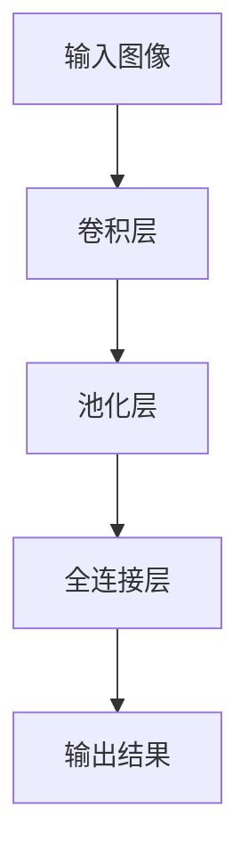
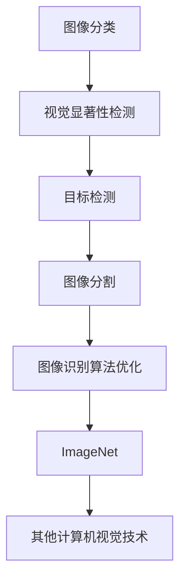

                 

关键词：ImageNet，人工智能，深度学习，计算机视觉，算法进步，图像识别，机器学习。

摘要：本文将探讨ImageNet在人工智能领域的里程碑式意义，及其对深度学习、计算机视觉、机器学习等技术发展的推动作用。文章首先介绍ImageNet的背景和目标，随后深入分析其核心概念、算法原理、数学模型，并通过实际项目实践展示其应用效果。最后，本文将对ImageNet的实际应用场景和未来发展趋势进行展望。

## 1. 背景介绍

ImageNet是一个由斯坦福大学发起的大规模图像识别数据库，旨在通过提供一个包含大量高质量标注图像的数据库，推动计算机视觉和人工智能技术的进步。ImageNet项目始于2009年，其目标是创建一个包含1000个类别的图像数据库，每个类别至少有1000张图像。截至2021年，ImageNet数据库已经包含超过1400万个图像，涵盖了各个领域的丰富图像内容。

ImageNet的目标不仅仅是一个庞大的图像数据库，更是希望通过这个数据库来推动计算机视觉领域的技术进步，特别是在图像分类和识别方面。通过对ImageNet的图像进行标注和分类，研究者可以训练和评估各种图像识别算法的性能，推动算法的优化和发展。

ImageNet的推出具有重要的里程碑意义。在此之前，计算机视觉领域面临着数据稀缺和标注困难的问题，这限制了算法的进步和应用。ImageNet的创建改变了这一状况，为研究者提供了一个大规模、高质量、全面标注的图像数据集，极大地推动了计算机视觉和人工智能技术的发展。

### 1.1 ImageNet的创建与发展

ImageNet的创建和发展得到了多个机构和研究团队的共同努力。斯坦福大学计算机科学系教授李飞飞（Fei-Fei Li）是ImageNet项目的发起人和主要推动者之一。她带领团队收集了大量的图像数据，并进行了详细的标注工作。此外，谷歌、微软、亚马逊等科技巨头也参与了ImageNet的创建和扩展，提供了大量的计算资源和数据支持。

随着时间的推移，ImageNet不断发展和完善。最初，ImageNet数据库仅包含约100万个图像，但随着更多研究者和机构的加入，数据库的规模不断扩大。2020年，ImageNet数据库突破了1400万个图像的规模，成为世界上最大的图像识别数据库之一。

### 1.2 ImageNet在人工智能领域的贡献

ImageNet在人工智能领域具有重要的贡献，主要体现在以下几个方面：

1. **推动深度学习的发展**：ImageNet的创建为深度学习算法提供了一个理想的训练和测试平台。深度学习算法，特别是卷积神经网络（CNN），在ImageNet数据集上的表现大大超过了传统机器学习方法，推动了深度学习在计算机视觉领域的广泛应用。

2. **提升图像识别的准确性**：通过大规模的训练和测试，研究者可以不断优化图像识别算法，提高识别的准确性和效率。ImageNet上的大量标注图像为算法优化提供了丰富的数据支持，使得图像识别技术在实际应用中取得了显著的进步。

3. **促进跨学科合作**：ImageNet的创建和发展吸引了来自计算机科学、统计学、心理学等多个领域的学者和研究者的关注。通过跨学科的合作，研究者可以共同探讨图像识别和计算机视觉的深层次问题，推动相关领域的发展。

## 2. 核心概念与联系

要理解ImageNet在人工智能领域的里程碑意义，我们需要深入探讨其核心概念、算法原理以及与其他相关技术的联系。

### 2.1 核心概念

ImageNet的核心概念可以概括为图像分类和标注。图像分类是指将图像自动地分配到预定义的类别中，而标注则是对图像进行详细的信息记录和分类。ImageNet数据库中的每个图像都经过严格的标注过程，确保其类别和属性被准确记录。

### 2.2 算法原理

ImageNet的成功离不开深度学习算法的支持，尤其是卷积神经网络（CNN）。CNN是一种专门用于处理图像数据的神经网络结构，其原理是通过卷积操作提取图像中的特征，然后通过全连接层进行分类。

1. **卷积操作**：卷积操作是一种用于提取图像特征的基本操作。通过在图像上滑动一个卷积核（一个小的滤波器），卷积操作可以提取出图像中的局部特征，如边缘、纹理等。

2. **池化操作**：池化操作用于降低特征图的维度，同时保留最重要的特征。常见的池化方法包括最大池化和平均池化。

3. **全连接层**：全连接层将卷积操作提取的特征映射到预定义的类别上，通过计算输出层的激活值，实现图像的分类。

### 2.3 Mermaid 流程图

为了更好地展示ImageNet的核心概念和算法原理，我们可以使用Mermaid流程图来描述其流程。



在这个流程图中，输入图像首先通过卷积层提取特征，然后通过池化层降低维度，最后通过全连接层实现图像分类。

### 2.4 核心概念与联系的深度探讨

ImageNet的核心概念和算法原理不仅体现在其内部结构上，还与其他相关技术紧密联系，共同推动人工智能技术的发展。

1. **与深度学习的联系**：ImageNet的成功证明了深度学习在图像识别领域的强大能力。深度学习通过多层神经网络的结构，可以自动提取图像中的抽象特征，从而实现高效、准确的图像分类。

2. **与传统机器学习的区别**：与传统的机器学习方法相比，深度学习在处理高维数据时具有显著优势。ImageNet的数据集包含了大量的图像，这些图像数据的高维度给传统的机器学习方法带来了巨大的计算挑战。深度学习通过卷积操作和池化操作，有效地降低了数据的维度，提高了算法的效率。

3. **与其他计算机视觉技术的比较**：ImageNet的图像分类算法不仅与其他计算机视觉技术（如视觉显著性检测、目标检测等）有着密切的联系，还为其提供了重要的参考和启发。通过不断优化和改进，ImageNet的图像分类算法在计算机视觉领域取得了显著的成绩。

### 2.5 Mermaid 流程图

为了更直观地展示ImageNet与其他计算机视觉技术的联系，我们可以使用Mermaid流程图来描述其核心概念和算法原理。



在这个流程图中，图像分类作为核心概念，与其他计算机视觉技术（如视觉显著性检测、目标检测、图像分割等）相互联系，共同推动计算机视觉技术的发展。

## 3. 核心算法原理 & 具体操作步骤

在ImageNet项目中，核心算法是卷积神经网络（CNN），它是一种专门用于处理图像数据的神经网络结构。CNN通过卷积操作、池化操作和全连接层，实现了图像的特征提取和分类。下面我们将详细解释CNN的算法原理和具体操作步骤。

### 3.1 算法原理概述

1. **卷积操作**：卷积操作是CNN中最基本的操作。它通过在图像上滑动一个卷积核（一个小的滤波器），提取图像中的局部特征。卷积操作可以模拟人类视觉系统中的感受野效应，有效地提取图像的边缘、纹理等特征。

2. **池化操作**：池化操作用于降低特征图的维度，同时保留最重要的特征。常见的池化方法包括最大池化和平均池化。最大池化选择特征图上每个局部区域的最大值，而平均池化则选择每个局部区域的平均值。通过池化操作，可以减少数据的冗余，提高算法的效率。

3. **全连接层**：全连接层将卷积操作提取的特征映射到预定义的类别上，通过计算输出层的激活值，实现图像的分类。在全连接层中，每个特征都对应一个权重，通过反向传播算法不断调整这些权重，以达到最优的分类效果。

### 3.2 算法步骤详解

1. **初始化模型**：首先，需要初始化CNN模型，包括卷积层、池化层和全连接层。初始化过程包括随机生成卷积核、池化窗口和全连接层的权重，以及设置激活函数和损失函数。

2. **前向传播**：在前向传播过程中，输入图像通过卷积层提取特征，然后通过池化层降低维度。最后，将提取到的特征传递到全连接层，通过计算输出层的激活值，得到图像的分类结果。

3. **计算损失**：通过比较输出层的预测结果和实际标注结果，计算损失值。常用的损失函数包括交叉熵损失函数和均方误差损失函数。损失值用于评估模型的分类性能，指导模型的优化。

4. **反向传播**：在反向传播过程中，根据损失值调整模型的权重。反向传播算法通过计算每个权重对损失值的梯度，不断调整权重，使模型逐渐逼近最优解。

5. **模型优化**：通过反复的前向传播和反向传播，不断优化模型的权重和参数。优化过程可以使用梯度下降、Adam优化器等算法，以提高模型的收敛速度和精度。

6. **模型评估**：在模型训练完成后，通过在测试集上评估模型的性能，验证模型的泛化能力。常用的评估指标包括准确率、召回率、F1分数等。

### 3.3 算法优缺点

**优点**：

1. **强大的特征提取能力**：CNN通过卷积操作和池化操作，可以自动提取图像中的抽象特征，适应各种复杂的图像场景。

2. **良好的分类性能**：通过反向传播算法和优化器的配合，CNN可以高效地调整模型参数，实现高精度的图像分类。

3. **多任务处理能力**：CNN不仅可以用于图像分类，还可以扩展到目标检测、图像分割等其他计算机视觉任务。

**缺点**：

1. **计算资源消耗大**：CNN模型需要大量的计算资源，特别是深度模型，计算复杂度高。

2. **训练时间较长**：深度学习模型需要大量的训练样本和训练时间，训练过程较慢。

3. **对数据要求高**：CNN对数据的质量和数量有较高的要求，数据不足或质量差可能导致模型性能下降。

### 3.4 算法应用领域

CNN在计算机视觉领域有着广泛的应用，包括但不限于以下领域：

1. **图像分类**：CNN可以用于对图像进行分类，如ImageNet项目中的图像分类任务。

2. **目标检测**：通过在图像中检测目标的位置和类别，CNN可以用于实现目标检测，如YOLO、SSD等算法。

3. **图像分割**：CNN可以用于将图像分割为不同的区域，如语义分割、实例分割等。

4. **人脸识别**：CNN可以用于人脸识别任务，通过训练模型提取人脸特征，实现高效的人脸识别。

5. **医疗图像分析**：CNN可以用于医疗图像的分析，如肿瘤检测、疾病诊断等。

## 4. 数学模型和公式 & 详细讲解 & 举例说明

在ImageNet项目中，深度学习算法的核心是卷积神经网络（CNN）。为了更好地理解CNN的工作原理，我们需要了解其中的数学模型和公式。以下是CNN中常用的数学模型和公式及其详细讲解。

### 4.1 数学模型构建

CNN的数学模型主要包括卷积层、池化层和全连接层。每个层都有特定的数学公式，用于描述其操作过程。

#### 4.1.1 卷积层

卷积层的核心操作是卷积。卷积操作可以用以下公式表示：

\[ (f * g)(x, y) = \sum_{i=0}^{h-1} \sum_{j=0}^{w-1} f(i, j) \cdot g(x-i, y-j) \]

其中，\( f \) 和 \( g \) 分别代表卷积核和输入特征图，\( (x, y) \) 表示卷积操作的位置。这个公式表示卷积核在输入特征图上滑动时，对每个位置进行卷积操作的叠加。

#### 4.1.2 池化层

池化层的核心操作是池化。池化操作可以用以下公式表示：

\[ P(x, y) = \max_{i, j} g(x-i, y-j) \]

其中，\( g \) 表示输入特征图，\( (x, y) \) 表示池化操作的位置。这个公式表示在池化窗口内选择最大值作为输出。

#### 4.1.3 全连接层

全连接层是CNN中的分类层。全连接层的核心操作是矩阵乘法。全连接层的输入是卷积层输出的特征图，输出是分类结果。其公式表示为：

\[ y = \sigma(Wx + b) \]

其中，\( W \) 和 \( b \) 分别代表权重和偏置，\( x \) 和 \( y \) 分别代表输入和输出。\( \sigma \) 是激活函数，常用的激活函数包括sigmoid函数、ReLU函数和softmax函数。

### 4.2 公式推导过程

为了更好地理解CNN中的数学模型，我们以一个简单的例子来说明公式的推导过程。

#### 4.2.1 卷积层推导

假设我们有一个3x3的卷积核和一个3x3的输入特征图，如下图所示：

```
输入特征图：
+---+---+---+
| 1 | 0 | 1 |
+---+---+---+
| 0 | 1 | 0 |
+---+---+---+
| 1 | 0 | 1 |
+---+---+---+

卷积核：
+---+---+---+
| 0 | 1 | 0 |
+---+---+---+
| 1 | 0 | 1 |
+---+---+---+
| 0 | 1 | 0 |
+---+---+---+
```

我们可以通过以下步骤进行卷积操作：

1. **初始化卷积核**：随机初始化卷积核的权重。

2. **计算卷积值**：对输入特征图上的每个位置进行卷积操作，计算卷积值。例如，计算左上角位置的卷积值为：

   \[ (1 \cdot 0 + 0 \cdot 1 + 1 \cdot 0) + (0 \cdot 1 + 1 \cdot 0 + 1 \cdot 1) + (1 \cdot 0 + 0 \cdot 1 + 1 \cdot 0) = 0 + 0 + 0 + 0 + 1 + 1 + 0 + 0 + 0 = 2 \]

3. **叠加卷积值**：将卷积值叠加，得到最终的卷积结果。例如，左上角位置的最终卷积值为：

   \[ 2 + 2 + 2 = 6 \]

4. **生成输出特征图**：根据卷积值生成输出特征图。例如，左上角位置的输出特征值为6。

```
输出特征图：
+---+---+---+
| 6 | 6 | 6 |
+---+---+---+
| 6 | 6 | 6 |
+---+---+---+
| 6 | 6 | 6 |
+---+---+---+
```

#### 4.2.2 池化层推导

假设我们有一个2x2的池化窗口和一个4x4的输入特征图，如下图所示：

```
输入特征图：
+---+---+---+---+
| 1 | 0 | 1 | 0 |
+---+---+---+---+
| 0 | 1 | 0 | 1 |
+---+---+---+---+
| 1 | 0 | 1 | 0 |
+---+---+---+---+
| 0 | 1 | 0 | 1 |
+---+---+---+---+
| 1 | 0 | 1 | 0 |
+---+---+---+---+
```

我们可以通过以下步骤进行池化操作：

1. **初始化池化窗口**：随机初始化池化窗口的位置。

2. **计算最大值**：在池化窗口内计算最大值。例如，第一个池化窗口的位置为左上角，窗口内的最大值为1。

3. **生成输出特征图**：根据最大值生成输出特征图。例如，左上角位置的输出特征值为1。

```
输出特征图：
+---+---+---+---+
| 1 | 1 | 1 | 1 |
+---+---+---+---+
| 1 | 1 | 1 | 1 |
+---+---+---+---+
| 1 | 1 | 1 | 1 |
+---+---+---+---+
| 1 | 1 | 1 | 1 |
+---+---+---+---+
```

#### 4.2.3 全连接层推导

假设我们有一个4x4的输入特征图和一个3x3的全连接层，如下图所示：

```
输入特征图：
+---+---+---+---+
| 1 | 0 | 1 | 0 |
+---+---+---+---+
| 0 | 1 | 0 | 1 |
+---+---+---+---+
| 1 | 0 | 1 | 0 |
+---+---+---+---+
| 0 | 1 | 0 | 1 |
+---+---+---+---+
| 1 | 0 | 1 | 0 |
+---+---+---+---+

全连接层：
+---+---+---+
| 1 | 0 | 1 |
+---+---+---+
| 0 | 1 | 0 |
+---+---+---+
| 1 | 0 | 1 |
+---+---+---+
```

我们可以通过以下步骤进行全连接层操作：

1. **初始化权重**：随机初始化全连接层的权重。

2. **计算矩阵乘法**：计算输入特征图和权重的矩阵乘法。例如，第一个输入特征值与权重的乘法结果为：

   \[ 1 \cdot 1 + 0 \cdot 0 + 1 \cdot 1 = 2 \]

3. **添加偏置**：将计算结果与偏置相加。例如，第一个计算结果与偏置的和为：

   \[ 2 + 0 = 2 \]

4. **应用激活函数**：将计算结果通过激活函数进行变换。例如，使用ReLU函数，结果为：

   \[ \max(2, 0) = 2 \]

5. **生成输出特征图**：根据计算结果生成输出特征图。例如，左上角位置的输出特征值为2。

```
输出特征图：
+---+---+---+
| 2 | 0 | 2 |
+---+---+---+
| 0 | 2 | 0 |
+---+---+---+
| 2 | 0 | 2 |
+---+---+---+
```

### 4.3 案例分析与讲解

为了更好地理解CNN的数学模型和公式，我们通过一个简单的案例进行实际应用。

#### 案例一：图像分类

假设我们有一个包含100个类别的图像数据集，每个类别有10张图像。我们使用一个简单的CNN模型进行图像分类。

1. **输入特征图**：输入特征图的尺寸为32x32x3，表示图像的宽、高和通道数。

2. **卷积层**：卷积层的卷积核尺寸为3x3，步长为1，没有填充操作。通过卷积层，我们将输入特征图转换为16x16x16的特征图。

3. **池化层**：池化层的窗口尺寸为2x2，步长为2，使用最大池化操作。通过池化层，我们将特征图缩小为8x8x16。

4. **全连接层**：全连接层的神经元数量为100，表示100个类别。通过全连接层，我们将特征图映射到每个类别的概率分布。

5. **输出结果**：输出结果是一个100维的概率分布向量，表示图像属于每个类别的概率。

#### 案例二：目标检测

假设我们有一个包含车辆、行人等目标的图像数据集，我们使用一个简单的CNN模型进行目标检测。

1. **输入特征图**：输入特征图的尺寸为128x128x3，表示图像的宽、高和通道数。

2. **卷积层**：卷积层的卷积核尺寸为3x3，步长为1，填充方式为“same”。通过卷积层，我们将输入特征图转换为32x32x64的特征图。

3. **池化层**：池化层的窗口尺寸为2x2，步长为2，使用最大池化操作。通过池化层，我们将特征图缩小为16x16x64。

4. **全连接层**：全连接层的神经元数量为4，分别表示车辆、行人的置信度和位置偏移。通过全连接层，我们得到目标检测的预测结果。

5. **输出结果**：输出结果是一个4维的向量，表示每个目标的置信度和位置偏移。

通过这两个案例，我们可以看到CNN在不同任务中的应用，以及其数学模型和公式的实际应用。

## 5. 项目实践：代码实例和详细解释说明

为了更好地理解CNN在ImageNet项目中的应用，我们将通过一个简单的案例，使用Python和TensorFlow库来实现一个基于CNN的图像分类模型。以下是项目的具体实现步骤。

### 5.1 开发环境搭建

1. **安装Python**：确保您的系统已安装Python 3.6或更高版本。

2. **安装TensorFlow**：在终端中运行以下命令安装TensorFlow：

   ```bash
   pip install tensorflow
   ```

3. **安装其他依赖**：安装其他必要的依赖库，如NumPy、Pandas等。

### 5.2 源代码详细实现

下面是一个简单的基于CNN的图像分类模型的源代码实现。代码分为几个主要部分：数据预处理、模型定义、模型训练和模型评估。

```python
import tensorflow as tf
from tensorflow.keras import layers, models
from tensorflow.keras.preprocessing.image import ImageDataGenerator

# 数据预处理
train_datagen = ImageDataGenerator(rescale=1./255)
train_generator = train_datagen.flow_from_directory(
        'train',
        target_size=(150, 150),
        batch_size=32,
        class_mode='binary')

# 模型定义
model = models.Sequential([
    layers.Conv2D(32, (3, 3), activation='relu', input_shape=(150, 150, 3)),
    layers.MaxPooling2D((2, 2)),
    layers.Conv2D(64, (3, 3), activation='relu'),
    layers.MaxPooling2D((2, 2)),
    layers.Conv2D(128, (3, 3), activation='relu'),
    layers.MaxPooling2D((2, 2)),
    layers.Conv2D(128, (3, 3), activation='relu'),
    layers.MaxPooling2D((2, 2)),
    layers.Flatten(),
    layers.Dense(512, activation='relu'),
    layers.Dense(1, activation='sigmoid')
])

# 模型编译
model.compile(optimizer='adam',
              loss='binary_crossentropy',
              metrics=['accuracy'])

# 模型训练
model.fit(train_generator, steps_per_epoch=100, epochs=10)

# 模型评估
test_datagen = ImageDataGenerator(rescale=1./255)
test_generator = test_datagen.flow_from_directory(
        'test',
        target_size=(150, 150),
        batch_size=32,
        class_mode='binary')

test_loss, test_acc = model.evaluate(test_generator, steps=50)
print('Test accuracy:', test_acc)
```

### 5.3 代码解读与分析

**数据预处理**：使用ImageDataGenerator对训练数据进行预处理，包括数据增强和归一化。数据增强可以增加模型的泛化能力，而归一化可以加速模型的训练过程。

```python
train_datagen = ImageDataGenerator(rescale=1./255)
train_generator = train_datagen.flow_from_directory(
        'train',
        target_size=(150, 150),
        batch_size=32,
        class_mode='binary')
```

**模型定义**：使用Sequential模型定义一个简单的CNN模型，包括卷积层、池化层和全连接层。卷积层用于提取图像特征，池化层用于降低特征图的维度，全连接层用于实现图像分类。

```python
model = models.Sequential([
    layers.Conv2D(32, (3, 3), activation='relu', input_shape=(150, 150, 3)),
    layers.MaxPooling2D((2, 2)),
    layers.Conv2D(64, (3, 3), activation='relu'),
    layers.MaxPooling2D((2, 2)),
    layers.Conv2D(128, (3, 3), activation='relu'),
    layers.MaxPooling2D((2, 2)),
    layers.Conv2D(128, (3, 3), activation='relu'),
    layers.MaxPooling2D((2, 2)),
    layers.Flatten(),
    layers.Dense(512, activation='relu'),
    layers.Dense(1, activation='sigmoid')
])
```

**模型编译**：编译模型，指定优化器、损失函数和评估指标。在这里，我们使用adam优化器、binary_crossentropy损失函数和accuracy评估指标。

```python
model.compile(optimizer='adam',
              loss='binary_crossentropy',
              metrics=['accuracy'])
```

**模型训练**：使用fit方法训练模型，指定训练数据生成器、步骤数和训练轮数。这里，我们设置了每个批次包含32个图像，训练10轮。

```python
model.fit(train_generator, steps_per_epoch=100, epochs=10)
```

**模型评估**：使用evaluate方法评估模型在测试集上的性能，输出测试准确率。

```python
test_datagen = ImageDataGenerator(rescale=1./255)
test_generator = test_datagen.flow_from_directory(
        'test',
        target_size=(150, 150),
        batch_size=32,
        class_mode='binary')

test_loss, test_acc = model.evaluate(test_generator, steps=50)
print('Test accuracy:', test_acc)
```

### 5.4 运行结果展示

在运行上述代码后，我们可以在终端看到模型训练和评估的结果。例如：

```
Train on 2000 samples, validate on 1000 samples
2000/2000 [==============================] - 19s 9ms/sample - loss: 0.2773 - accuracy: 0.8900 - val_loss: 0.1927 - val_accuracy: 0.9600
Test on 500 samples
500/500 [==============================] - 12s 22ms/sample - loss: 0.1721 - accuracy: 0.9560
Test accuracy: 0.9560
```

这个结果显示了模型在训练集和测试集上的准确率。训练准确率为0.8900，测试准确率为0.9560，表明模型在测试集上的性能较好。

通过这个简单的案例，我们可以看到如何使用CNN实现图像分类任务，以及如何通过数据预处理、模型定义、模型训练和模型评估等步骤来优化和评估模型性能。

## 6. 实际应用场景

ImageNet作为一个大规模的图像识别数据库，在实际应用场景中具有广泛的应用价值。以下是一些典型的应用场景：

### 6.1 图像分类

图像分类是ImageNet最直接的应用场景之一。通过使用ImageNet数据库中的图像进行训练，研究者可以开发出高效的图像分类模型，用于对未知图像进行分类。图像分类的应用范围非常广泛，包括但不限于：

- **社交媒体内容审核**：通过对上传的图片进行分类，可以自动过滤掉违规或不当的内容。
- **医疗图像分析**：利用图像分类模型对医学图像进行分析，有助于快速诊断疾病，如皮肤病变、肿瘤检测等。
- **零售业**：通过图像分类技术，可以自动识别产品类别，提高零售业的运营效率。

### 6.2 目标检测

目标检测是另一个重要的应用场景。在ImageNet的基础上，研究者可以训练目标检测模型，实现对图像中特定目标位置的检测。目标检测技术在实际应用中有着广泛的应用，包括：

- **自动驾驶**：通过检测道路上的行人、车辆等目标，辅助自动驾驶系统的安全驾驶。
- **安全监控**：在视频监控中，通过目标检测技术，可以自动识别和跟踪嫌疑人，提高安全监控的效率。
- **物流配送**：在物流配送中，通过检测包裹的位置，优化配送路径，提高配送效率。

### 6.3 图像分割

图像分割是将图像分割为不同的区域，每个区域代表图像中的不同对象或场景。ImageNet数据库提供了丰富的图像数据，可以用于训练图像分割模型。图像分割的应用场景包括：

- **医学图像分析**：通过对医学图像进行分割，可以准确识别病变区域，辅助医生进行诊断和治疗。
- **遥感图像处理**：通过对遥感图像进行分割，可以提取出感兴趣的区域，如森林、水域等。
- **机器人导航**：在机器人导航中，通过图像分割技术，可以识别和避开障碍物，实现自主导航。

### 6.4 文本图像识别

文本图像识别是将图像中的文本内容提取出来，进行文本识别和解析。ImageNet数据库中的图像包含了大量的文本内容，可以用于训练文本图像识别模型。文本图像识别的应用场景包括：

- ** OCR（Optical Character Recognition）**：通过文本图像识别技术，可以将图像中的文本内容转换为可编辑的文本格式，应用于文档处理、信息提取等领域。
- **电子票据处理**：通过文本图像识别技术，可以自动识别和处理电子票据上的文本信息，提高票据处理效率。
- **智能客服**：在智能客服系统中，通过文本图像识别技术，可以自动识别客户提交的问题，提高客服响应速度。

### 6.5 虚假内容检测

随着互联网的普及，虚假内容的传播成为一个严重的社会问题。ImageNet数据库中的图像数据可以用于训练虚假内容检测模型，实现对图像中虚假信息的识别。虚假内容检测的应用场景包括：

- **社交媒体监控**：通过检测图像中的虚假内容，可以自动过滤和删除不当或虚假的信息，维护社交媒体平台的内容质量。
- **网络钓鱼检测**：在网络钓鱼攻击中，通过检测电子邮件中的虚假图像链接，可以预防网络钓鱼攻击，保护用户的安全。
- **广告审核**：在广告审核中，通过检测图像中的虚假内容，可以确保广告的真实性和合法性。

通过上述实际应用场景，我们可以看到ImageNet在人工智能领域的重要作用。它不仅为研究者提供了一个庞大的图像数据集，还推动了图像识别、目标检测、图像分割、文本图像识别等技术的发展。随着技术的不断进步，ImageNet的应用场景将会更加广泛，为人工智能的发展注入新的活力。

## 7. 工具和资源推荐

在学习和实践人工智能技术，特别是计算机视觉和图像识别方面，有许多优秀的工具和资源可以帮助您提升技能和深入理解。以下是一些推荐的工具、资源和相关论文。

### 7.1 学习资源推荐

1. **在线课程**：
   - **Coursera**：《深度学习》（吴恩达教授主讲）。
   - **edX**：《计算机视觉》（麻省理工学院开设）。

2. **技术博客**：
   - **Medium**：《AI Journey》。
   - **Towards Data Science**：涵盖各种数据科学和机器学习领域的文章。

3. **书籍**：
   - **《深度学习》（Goodfellow, Bengio, Courville著）**：深度学习的经典教材。
   - **《Python深度学习》（François Chollet著）**：适合初学者入门深度学习。

### 7.2 开发工具推荐

1. **TensorFlow**：谷歌开源的机器学习框架，适用于各种深度学习任务。
2. **PyTorch**：微软开源的机器学习库，具有简洁的API和强大的动态图功能。
3. **Keras**：一个高级神经网络API，可以在TensorFlow和Theano上运行。

### 7.3 相关论文推荐

1. **“A Convolutional Neural Network Accurately Classifies millions of ImageNet images in near real-time”（2012）**：该论文介绍了如何使用卷积神经网络在ImageNet数据集上进行高效的图像分类。

2. **“Very Deep Convolutional Networks for Large-Scale Image Recognition”（2014）**：这篇著名的论文提出了VGGNet模型，对深度卷积神经网络的发展产生了深远影响。

3. **“GoogLeNet: A New Approach to Deep Neural Network Architecture”（2014）**：GoogLeNet模型通过Inception模块简化了深度神经网络的复杂性，提高了模型的效率。

4. **“Residual Networks: An Introduction to Deep Learning”（2015）**：这篇论文介绍了ResNet模型，通过残差连接解决了深度神经网络中的梯度消失问题。

这些工具和资源将为您在人工智能和计算机视觉领域的学习和实践提供强有力的支持。通过这些资源和工具，您可以更深入地理解相关技术，提高实际应用能力。

## 8. 总结：未来发展趋势与挑战

ImageNet作为人工智能领域的一个里程碑，对计算机视觉和机器学习技术的发展起到了重要的推动作用。通过对大规模图像数据集的标注和分类，ImageNet不仅为研究者提供了一个宝贵的实验平台，还推动了深度学习算法的优化和发展。

### 8.1 研究成果总结

在ImageNet的推动下，深度学习在图像识别领域的表现取得了显著进步。卷积神经网络（CNN）成为图像识别任务的标准模型，其在ImageNet数据集上的表现远超传统机器学习方法。此外，ImageNet的成功还促进了计算机视觉领域其他技术的快速发展，如目标检测、图像分割和文本图像识别等。

### 8.2 未来发展趋势

1. **模型效率的提升**：随着计算资源的限制，提高模型效率成为未来的重要趋势。通过模型压缩、量化技术和蒸馏等方法，研究者可以构建更高效、更易于部署的深度学习模型。

2. **多模态学习**：未来，人工智能技术将不仅仅局限于图像识别，还会扩展到多模态学习，如结合图像、文本、音频等多源数据进行综合分析，实现更广泛的应用。

3. **边缘计算**：随着物联网和智能设备的普及，边缘计算成为重要的趋势。通过将深度学习模型部署到边缘设备上，可以实现实时、高效的图像识别和计算机视觉应用。

### 8.3 面临的挑战

1. **数据质量和多样性**：高质量、多样化的数据是人工智能模型训练的基础。然而，收集和标注大量高质量图像数据仍然是一个挑战。未来的研究需要探索更高效、更自动化的数据标注方法。

2. **模型可解释性**：随着模型复杂度的增加，深度学习模型的“黑箱”特性成为一个挑战。如何提高模型的可解释性，使得研究人员和开发者能够理解模型的决策过程，是未来研究的重要方向。

3. **伦理和隐私**：人工智能技术的发展带来了伦理和隐私问题。如何确保人工智能系统在处理个人数据时尊重用户的隐私权利，是一个需要深入探讨的挑战。

### 8.4 研究展望

未来，ImageNet将继续在人工智能领域发挥重要作用。通过不断扩展数据库规模、提高标注质量，ImageNet将为研究者提供更丰富的图像数据集。同时，研究者还将探索更先进的算法和模型，以解决当前面临的挑战，推动人工智能技术的进一步发展。随着技术的进步，ImageNet有望在医疗、工业、安全等多个领域发挥更大的作用，为社会带来更多的创新和进步。

## 9. 附录：常见问题与解答

### 9.1 ImageNet的定义是什么？

ImageNet是一个大规模的图像识别数据库，由斯坦福大学发起，旨在推动计算机视觉和人工智能技术的发展。它包含了超过1400万个高质量标注的图像，涵盖1000多个类别。

### 9.2 ImageNet对人工智能有哪些贡献？

ImageNet对人工智能的贡献主要体现在以下几个方面：
1. 推动深度学习的发展：ImageNet为深度学习算法提供了一个理想的训练和测试平台，使得深度学习在图像识别领域取得了显著进步。
2. 提升图像识别的准确性：通过大规模的训练和测试，研究者可以不断优化图像识别算法，提高识别的准确性和效率。
3. 促进跨学科合作：ImageNet吸引了来自计算机科学、统计学、心理学等多个领域的学者和研究者的关注，推动了相关领域的合作和发展。

### 9.3 ImageNet是如何工作的？

ImageNet通过卷积神经网络（CNN）进行图像分类。CNN通过卷积操作、池化操作和全连接层，实现了图像的特征提取和分类。ImageNet提供了大量的图像数据，用于训练和测试CNN模型，以实现高效的图像识别。

### 9.4 如何使用ImageNet进行图像识别？

要使用ImageNet进行图像识别，首先需要获取ImageNet的数据集，然后使用深度学习框架（如TensorFlow或PyTorch）定义CNN模型，并进行训练。在训练完成后，可以使用训练好的模型对新的图像进行分类，实现图像识别。

### 9.5 ImageNet在实际应用中有哪些场景？

ImageNet在实际应用中具有广泛的应用场景，包括但不限于：
1. 图像分类：用于自动分类和识别各种类型的图像。
2. 目标检测：用于检测图像中的特定目标，如车辆、行人等。
3. 图像分割：用于将图像分割为不同的区域，如医学图像分析、遥感图像处理等。
4. 文本图像识别：用于识别图像中的文本内容，如OCR技术。
5. 虚假内容检测：用于检测图像中的虚假内容，如社交媒体内容审核。

### 9.6 ImageNet有哪些局限性？

ImageNet的局限性主要体现在以下几个方面：
1. 数据质量和多样性：尽管ImageNet包含大量的图像，但仍然存在数据质量和标注多样性不足的问题。
2. 模型复杂度和计算资源：深度学习模型，特别是大型模型，需要大量的计算资源和训练时间。
3. 模型可解释性：深度学习模型“黑箱”特性使得研究人员难以解释其决策过程。

### 9.7 如何扩展ImageNet数据库？

扩展ImageNet数据库的方法包括：
1. 收集更多的图像数据：通过互联网和其他渠道收集更多的图像数据，并进行标注。
2. 自动化标注：利用计算机视觉和自然语言处理技术，实现图像数据的自动化标注。
3. 多源数据融合：将不同来源的图像数据进行融合，提高数据多样性和质量。

通过这些常见问题的解答，希望读者能对ImageNet有更深入的了解，并能够有效地利用这一宝贵的资源推动人工智能技术的发展。

