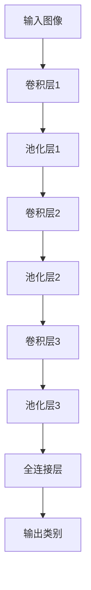

                 

关键词：ImageNet，计算机视觉，图像识别，卷积神经网络，深度学习，人工智能

## 摘要

本文将深入探讨ImageNet图像识别项目的背景、核心算法原理及其在实际应用中的重要性。通过详细分析卷积神经网络（CNN）的工作机制和具体操作步骤，我们旨在帮助读者理解图像识别领域的最新进展和未来发展方向。文章还将涵盖数学模型和公式推导，以及项目实践中的代码实例和运行结果展示。最后，我们将讨论实际应用场景、工具和资源推荐，并对未来发展趋势和挑战进行展望。

## 1. 背景介绍

### ImageNet的起源

ImageNet是一个由斯坦福大学和亚马逊公司共同发起的大型视觉识别挑战赛（Large Scale Visual Recognition Challenge, LVCSR），旨在推动计算机视觉领域的发展。该项目于2010年首次推出，目标是在图像识别任务上显著提升计算机的性能。ImageNet的成功不仅改变了计算机视觉的研究方向，也成为了深度学习领域的一个里程碑。

### 目标和意义

ImageNet项目的核心目标是构建一个包含大规模图像和标注数据的数据库，以便于研究人员和开发者进行训练和测试。其意义在于：

- **推动计算机视觉技术**：通过提供丰富的训练数据，促进算法的改进和性能的提升。
- **促进人工智能发展**：图像识别是人工智能的核心任务之一，ImageNet为AI的发展提供了强有力的支持。
- **提升实际应用价值**：在医疗、安防、自动驾驶等多个领域，图像识别技术的准确性和效率直接影响着应用的价值。

### 数据集规模

ImageNet包含了超过1400万个标注图像，涵盖了21,840个类别。这些图像来自互联网上的各种来源，经过严格的标注和筛选，确保了数据的质量和多样性。这个庞大的数据集为深度学习算法的训练提供了充足的资源。

## 2. 核心概念与联系

### 卷积神经网络（CNN）

卷积神经网络（Convolutional Neural Network, CNN）是深度学习领域的重要模型，特别适用于图像识别任务。其核心思想是利用卷积层对图像进行特征提取，并通过池化层减少数据维度，从而提高模型的效率和准确性。

### 架构原理

CNN的架构通常包括以下几个层次：

- **卷积层**：通过卷积操作提取图像的局部特征。
- **池化层**：降低图像分辨率，减少计算量和参数数量。
- **全连接层**：将特征图映射到类别标签。

### Mermaid流程图

以下是一个简单的CNN架构的Mermaid流程图：



### 核心概念原理

- **卷积操作**：通过卷积核在图像上滑动，提取局部特征。
- **激活函数**：常用的激活函数有ReLU、Sigmoid和Tanh，用于增加网络的非线性能力。
- **反向传播**：通过反向传播算法更新网络权重，优化模型性能。

## 3. 核心算法原理 & 具体操作步骤

### 3.1 算法原理概述

卷积神经网络通过以下几个步骤实现对图像的识别：

1. **输入层**：接收原始图像。
2. **卷积层**：通过卷积操作提取图像的局部特征。
3. **池化层**：对卷积层的结果进行降维处理。
4. **全连接层**：将特征映射到类别标签。
5. **输出层**：输出图像的类别预测。

### 3.2 算法步骤详解

#### 卷积层

- **卷积操作**：卷积层通过卷积核与图像进行卷积运算，提取图像特征。
- **激活函数**：通常使用ReLU作为激活函数，增加网络的非线性能力。

#### 池化层

- **最大池化**：选择窗口内最大的值作为输出。
- **平均池化**：计算窗口内所有值的平均值作为输出。

#### 全连接层

- **权重初始化**：通过随机初始化权重，避免梯度消失和爆炸问题。
- **反向传播**：利用梯度下降算法更新权重。

### 3.3 算法优缺点

#### 优点

- **强大的特征提取能力**：通过多层卷积和池化操作，能够提取丰富的图像特征。
- **高效计算**：卷积操作和池化操作的计算量相对较小，适合大规模图像处理。

#### 缺点

- **计算资源需求大**：深度网络的训练需要大量的计算资源和时间。
- **对数据依赖性强**：训练数据的质量直接影响模型的性能。

### 3.4 算法应用领域

- **图像分类**：例如ImageNet比赛中的物体分类。
- **目标检测**：例如自动驾驶中的行人检测。
- **图像生成**：例如GAN（生成对抗网络）。

## 4. 数学模型和公式 & 详细讲解 & 举例说明

### 4.1 数学模型构建

卷积神经网络中的主要数学模型包括卷积操作、激活函数和反向传播算法。

#### 卷积操作

$$
\text{output}_{ij} = \sum_{k=1}^{n} \text{weight}_{ikj} \cdot \text{input}_{ij}
$$

其中，$\text{output}_{ij}$是输出特征图上的元素，$\text{weight}_{ikj}$是卷积核上的权重，$\text{input}_{ij}$是输入图像上的元素。

#### 激活函数

$$
\text{output}_{ij} = \text{ReLU}(\sum_{k=1}^{n} \text{weight}_{ikj} \cdot \text{input}_{ij})
$$

其中，$\text{ReLU}(x) = \max(0, x)$。

#### 反向传播

$$
\Delta \text{weight}_{ikj} = \text{learning\_rate} \cdot \text{gradient}_{ij} \cdot \text{input}_{ij}
$$

其中，$\text{gradient}_{ij}$是损失函数对输出特征图上元素$\text{output}_{ij}$的梯度。

### 4.2 公式推导过程

#### 卷积操作

假设我们有一个大小为$m \times n$的输入图像和一个大小为$p \times q$的卷积核，卷积操作的计算过程如下：

1. **初始化权重**：随机初始化卷积核的权重。
2. **卷积操作**：将卷积核在输入图像上滑动，对每个位置进行卷积运算，得到输出特征图上的元素。
3. **激活函数**：对输出特征图上的元素应用激活函数，通常使用ReLU。

#### 激活函数

激活函数的主要作用是增加网络的非线性能力，常用的激活函数包括ReLU、Sigmoid和Tanh。

#### 反向传播

反向传播算法通过计算损失函数对网络权重的梯度，更新网络权重，优化模型性能。具体步骤如下：

1. **计算损失函数**：计算预测值与真实值之间的差距，得到损失函数。
2. **计算梯度**：利用链式法则计算损失函数对网络权重的梯度。
3. **更新权重**：根据梯度更新网络权重。

### 4.3 案例分析与讲解

以下是一个简单的例子，用于说明卷积神经网络的数学模型：

#### 输入图像

$$
\text{input}_{ij} =
\begin{bmatrix}
1 & 2 & 3 \\
4 & 5 & 6 \\
7 & 8 & 9
\end{bmatrix}
$$

#### 卷积核

$$
\text{weight}_{ikj} =
\begin{bmatrix}
1 & 0 \\
0 & 1
\end{bmatrix}
$$

#### 卷积操作

$$
\text{output}_{ij} =
\begin{bmatrix}
1 & 2 \\
4 & 5
\end{bmatrix}
$$

#### 激活函数

$$
\text{output}_{ij} =
\begin{bmatrix}
1 & 2 \\
4 & 5
\end{bmatrix}
$$

#### 反向传播

假设损失函数为：

$$
\text{loss} = (\text{output}_{ij} - \text{target}_{ij})^2
$$

其中，$\text{target}_{ij}$是期望的输出值。

#### 计算梯度

$$
\text{gradient}_{ij} = 2 \cdot (\text{output}_{ij} - \text{target}_{ij})
$$

#### 更新权重

$$
\Delta \text{weight}_{ikj} = \text{learning\_rate} \cdot \text{gradient}_{ij} \cdot \text{input}_{ij}
$$

## 5. 项目实践：代码实例和详细解释说明

### 5.1 开发环境搭建

为了运行卷积神经网络，我们需要安装以下环境：

- Python 3.7 或以上版本
- TensorFlow 2.x
- NumPy

### 5.2 源代码详细实现

以下是一个简单的卷积神经网络实现，用于对图像进行分类：

```python
import tensorflow as tf
from tensorflow.keras import layers

# 定义模型
model = tf.keras.Sequential([
    layers.Conv2D(32, (3, 3), activation='relu', input_shape=(28, 28, 1)),
    layers.MaxPooling2D((2, 2)),
    layers.Conv2D(64, (3, 3), activation='relu'),
    layers.MaxPooling2D((2, 2)),
    layers.Conv2D(64, (3, 3), activation='relu'),
    layers.Flatten(),
    layers.Dense(64, activation='relu'),
    layers.Dense(10, activation='softmax')
])

# 编译模型
model.compile(optimizer='adam',
              loss='sparse_categorical_crossentropy',
              metrics=['accuracy'])

# 加载数据
mnist = tf.keras.datasets.mnist
(x_train, y_train), (x_test, y_test) = mnist.load_data()

# 预处理数据
x_train = x_train.reshape((-1, 28, 28, 1)).astype(tf.float32) / 255
x_test = x_test.reshape((-1, 28, 28, 1)).astype(tf.float32) / 255

# 训练模型
model.fit(x_train, y_train, epochs=5)

# 评估模型
test_loss, test_acc = model.evaluate(x_test, y_test, verbose=2)
print('\nTest accuracy:', test_acc)
```

### 5.3 代码解读与分析

- **模型定义**：使用`tf.keras.Sequential`创建一个序列模型，包含卷积层、池化层和全连接层。
- **编译模型**：使用`model.compile`设置优化器和损失函数。
- **加载数据**：使用TensorFlow内置的MNIST数据集进行训练和测试。
- **预处理数据**：将数据reshape为模型所需的形状，并归一化。
- **训练模型**：使用`model.fit`训练模型。
- **评估模型**：使用`model.evaluate`评估模型的性能。

## 6. 实际应用场景

### 6.1 医学影像

卷积神经网络在医学影像分析中有着广泛的应用，如肿瘤检测、疾病诊断等。通过训练深度学习模型，可以自动识别图像中的异常区域，提高诊断的准确性和效率。

### 6.2 自动驾驶

自动驾驶系统依赖图像识别技术进行道路识别、障碍物检测和行人识别等任务。卷积神经网络能够处理大量图像数据，提高自动驾驶系统的安全性和可靠性。

### 6.3 物流与仓储

在物流和仓储领域，卷积神经网络可以用于图像识别任务，如货物分类、标签识别和仓库布局优化等。通过自动识别和处理图像数据，提高物流和仓储的效率和准确性。

## 7. 未来应用展望

### 7.1 高效能硬件支持

随着硬件技术的发展，如GPU、TPU等高效能硬件的普及，深度学习模型将能够处理更大量的图像数据，提高模型的训练速度和推理性能。

### 7.2 小样本学习

目前，深度学习模型对大量训练数据的需求较大。未来，小样本学习技术的发展将使得模型能够在少量数据上实现良好的性能，降低数据获取和标注的成本。

### 7.3 多模态学习

多模态学习是未来图像识别领域的一个重要研究方向。通过结合图像、文本、语音等多种模态的信息，可以进一步提高图像识别的准确性和鲁棒性。

## 8. 工具和资源推荐

### 8.1 学习资源推荐

- 《深度学习》（Goodfellow, Bengio, Courville著）：一本经典的深度学习教材。
- 《Python深度学习》（François Chollet著）：针对Python编程语言的深度学习实践指南。

### 8.2 开发工具推荐

- TensorFlow：Google开发的开源深度学习框架。
- PyTorch：Facebook开发的开源深度学习框架。

### 8.3 相关论文推荐

- Krizhevsky, A., Sutskever, I., & Hinton, G. E. (2012). ImageNet classification with deep convolutional neural networks. *Advances in Neural Information Processing Systems*, 25.
- Simonyan, K., & Zisserman, A. (2015). Very deep convolutional networks for large-scale image recognition. *International Conference on Learning Representations*.

## 9. 总结：未来发展趋势与挑战

### 9.1 研究成果总结

卷积神经网络在图像识别领域取得了显著的成果，推动了计算机视觉和人工智能的发展。通过大规模数据集的训练和模型优化，图像识别的准确性和效率得到了大幅提升。

### 9.2 未来发展趋势

未来，图像识别技术将在更多领域得到应用，如医学、自动驾驶、物流等。同时，随着硬件和算法的不断发展，深度学习模型将能够处理更复杂的图像任务。

### 9.3 面临的挑战

- **数据隐私和安全**：图像识别应用中涉及大量的个人隐私数据，如何确保数据的安全和隐私是一个重要挑战。
- **计算资源需求**：深度学习模型对计算资源的需求较大，如何在有限的资源下高效训练模型是一个挑战。
- **算法可解释性**：随着模型的复杂性增加，如何解释模型的决策过程成为一个挑战。

### 9.4 研究展望

未来，图像识别技术将继续朝着高效能、小样本学习和多模态学习等方向发展。通过不断的研究和创新，图像识别技术将在更多领域发挥重要作用。

## 附录：常见问题与解答

### Q：卷积神经网络如何提取图像特征？

A：卷积神经网络通过卷积层对图像进行特征提取。卷积层使用卷积核在图像上滑动，提取图像的局部特征。这些特征图经过池化层降维处理，然后通过全连接层映射到类别标签。

### Q：为什么使用ReLU作为激活函数？

A：ReLU（Rectified Linear Unit）激活函数是一种简单而有效的非线性函数，它能够增加网络的非线性能力，提高训练效率。ReLU函数在输入为正数时输出相同的值，在输入为负数时输出零，这种性质有助于加速网络的学习过程。

### Q：如何优化卷积神经网络的性能？

A：优化卷积神经网络的性能可以从以下几个方面进行：

- **数据增强**：通过随机裁剪、旋转、翻转等操作增加训练数据的多样性，提高模型的泛化能力。
- **正则化**：使用正则化方法，如L1、L2正则化，减少模型过拟合。
- **批量归一化**：通过批量归一化（Batch Normalization）稳定网络训练过程，提高训练速度。
- **调整超参数**：通过调整学习率、批次大小等超参数，优化模型的性能。

### Q：什么是小样本学习？

A：小样本学习（Few-Shot Learning）是指模型在少量训练样本上实现良好的性能。小样本学习旨在解决当训练样本数量有限时，如何让模型快速适应新任务的问题。小样本学习在现实应用中具有重要的意义，如新物种识别、新语言翻译等。

