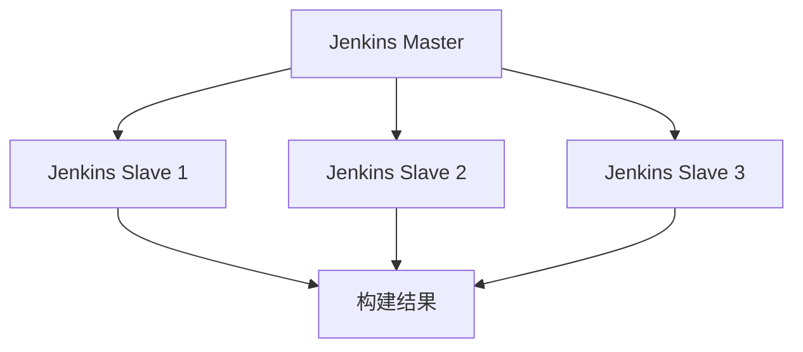

                 

关键词：Jenkins、分布式构建、CI/CD、性能优化、构建优化、自动化部署

摘要：本文将深入探讨Jenkins分布式构建优化的方法与策略。通过分析Jenkins在分布式构建中的核心概念和架构，我们提出了详细的算法原理和具体操作步骤，帮助读者理解并实施Jenkins分布式构建优化。同时，本文结合数学模型和公式，对优化过程进行详细讲解，并提供实际项目实践中的代码实例和运行结果展示。通过本文的阅读，读者将能够掌握Jenkins分布式构建优化的技巧，提升CI/CD流水线的效率。

## 1. 背景介绍

在软件开发的今天，持续集成（Continuous Integration，CI）和持续交付（Continuous Delivery，CD）已经成为提高软件质量和开发效率的重要手段。Jenkins作为一款流行的开源持续集成工具，广泛应用于各种规模的企业和项目中。然而，随着项目的复杂度和规模的增长，单一的Jenkins实例可能无法满足大规模、高并发的构建需求。此时，分布式构建成为解决瓶颈的关键。

### Jenkins概述

Jenkins是一个基于Java开发的开源持续集成工具，由原Google工程师Kohsuke Kawaguchi创建。它支持与各种版本控制系统、构建工具和测试工具的集成，能够实现自动化构建、测试和部署。Jenkins的核心优势在于其高度的可扩展性和灵活性，支持插件扩展，使其能够适应不同的开发环境和工作流程。

### 分布式构建的需求

随着项目规模的扩大，单个Jenkins实例的处理能力逐渐无法满足需求。主要问题包括：

- **并发处理能力不足**：单个Jenkins实例的处理能力有限，导致在高并发场景下，构建任务积压，影响开发进度。
- **系统资源限制**：单个Jenkins实例在资源使用上存在瓶颈，如CPU、内存和磁盘I/O等，限制了其处理大规模任务的能力。
- **可维护性下降**：随着构建任务的增多，单个Jenkins实例的管理和维护变得复杂，难以快速响应需求变化。

因此，分布式构建应运而生，通过将构建任务分散到多个Jenkins实例上，提高系统的处理能力和可扩展性。

## 2. 核心概念与联系

### 分布式构建概述

分布式构建是指将构建任务分散到多个Jenkins实例上执行的过程。通过分布式构建，可以提高系统的并行处理能力，降低单个Jenkins实例的负载，提升构建效率。分布式构建的关键概念包括：

- **Jenkins Master**：负责调度构建任务，将构建任务分发到Jenkins Slave实例上执行。
- **Jenkins Slave**：执行具体构建任务的节点，接收Master分配的任务，并在完成后向Master反馈结果。

### 分布式构建架构

分布式构建的架构如图1所示：



在分布式构建架构中，Jenkins Master负责接收构建请求，将构建任务分配给Jenkins Slave实例。Jenkins Slave实例执行构建任务，并将结果反馈给Master。Master根据构建结果更新构建状态，实现整个构建流程的自动化。

### 分布式构建的优势

- **提高并发处理能力**：通过分布式构建，可以充分利用多台Jenkins Slave实例的CPU、内存等资源，提高系统的并发处理能力。
- **降低单点故障风险**：分布式构建使得构建任务不再依赖于单个Jenkins实例，降低了单点故障的风险。
- **提升系统可扩展性**：随着项目规模的扩大，可以轻松添加Jenkins Slave实例，提高系统的处理能力。
- **优化资源利用率**：通过分布式构建，可以实现资源的高效利用，降低系统资源的闲置率。

## 3. 核心算法原理 & 具体操作步骤

### 3.1 算法原理概述

分布式构建的算法原理主要涉及任务调度和数据同步。任务调度算法负责将构建任务分配到合适的Jenkins Slave实例上，数据同步算法则保证构建过程中数据的实时更新和一致性。

#### 任务调度算法

任务调度算法的核心目标是优化构建任务的执行顺序，提高系统并发处理能力和资源利用率。常见的任务调度算法包括：

- **负载均衡算法**：根据Jenkins Slave实例的负载情况，将构建任务分配到负载较低的实例上。
- **优先级调度算法**：根据构建任务的优先级，优先执行高优先级的任务。

#### 数据同步算法

数据同步算法主要解决构建过程中数据的一致性问题。常见的数据同步算法包括：

- **分布式锁**：确保构建任务在执行过程中数据的原子性和一致性。
- **消息队列**：将构建过程中的数据通过消息队列进行传输，实现数据的异步同步。

### 3.2 算法步骤详解

#### 3.2.1 任务调度步骤

1. **接收构建请求**：Jenkins Master接收到构建请求后，对构建任务进行初步解析，提取任务信息。
2. **计算负载情况**：Jenkins Master根据Jenkins Slave实例的负载情况，选择合适的实例进行任务分配。
3. **分配任务**：Jenkins Master将构建任务分配给选定的Jenkins Slave实例。
4. **反馈结果**：Jenkins Slave实例执行构建任务完成后，将结果反馈给Jenkins Master。

#### 3.2.2 数据同步步骤

1. **初始化数据同步**：在构建任务开始前，初始化数据同步模块，确保构建过程中数据的一致性。
2. **数据写入**：在构建过程中，将关键数据写入分布式锁或消息队列，实现数据的实时同步。
3. **数据读取**：在构建任务完成后，从分布式锁或消息队列中读取数据，更新构建结果。

### 3.3 算法优缺点

#### 3.3.1 任务调度算法

- **负载均衡算法**：优点是能够充分利用系统资源，提高并发处理能力；缺点是算法复杂度较高，实现难度大。
- **优先级调度算法**：优点是能够保证高优先级任务的优先执行，提高系统响应速度；缺点是可能导致低优先级任务长时间等待。

#### 3.3.2 数据同步算法

- **分布式锁**：优点是实现简单，能够保证数据的一致性；缺点是可能导致死锁，影响系统性能。
- **消息队列**：优点是实现简单，支持异步同步；缺点是可能导致数据丢失，影响数据一致性。

### 3.4 算法应用领域

分布式构建算法广泛应用于大规模、高并发的构建场景，如：

- **大规模软件项目**：提高构建效率，缩短开发周期。
- **多团队协作**：降低团队之间的依赖，提高协同效率。
- **容器化应用**：支持容器化环境的分布式构建，提高系统可扩展性。

## 4. 数学模型和公式 & 详细讲解 & 举例说明

### 4.1 数学模型构建

为了更好地理解分布式构建的优化过程，我们可以构建一个简单的数学模型。假设系统中有n个Jenkins Slave实例，构建任务总数为m，构建任务的平均处理时间为t。

#### 基本假设

1. Jenkins Slave实例的处理能力相同。
2. 构建任务的时间分布服从泊松分布。

#### 数学模型

构建完成时间T可以表示为：

$$
T = \sum_{i=1}^{m} t_i + \sum_{j=1}^{n} T_j
$$

其中，$t_i$为第i个构建任务的耗时，$T_j$为第j个Jenkins Slave实例的等待时间。

### 4.2 公式推导过程

根据泊松分布的性质，构建任务的时间分布可以表示为：

$$
P(t_i) = \frac{(\lambda t)^i e^{-\lambda t}}{i!}
$$

其中，$\lambda$为构建任务的到达率。

构建完成时间T的概率分布可以表示为：

$$
P(T) = \sum_{i=1}^{m} P(t_i) \cdot P(T_j)
$$

为了简化计算，我们假设Jenkins Slave实例的等待时间服从均匀分布：

$$
P(T_j) = \frac{1}{t_j}
$$

### 4.3 案例分析与讲解

假设系统中有3个Jenkins Slave实例，构建任务总数为10，构建任务的平均处理时间为5分钟。

#### 4.3.1 单台Jenkins Slave实例

- 平均处理时间：$t_i = 5$分钟
- 等待时间：$T_j = \frac{10 \times 5}{3} = 16.67$分钟
- 构建完成时间：$T = 5 \times 10 + 16.67 = 66.67$分钟

#### 4.3.2 三台Jenkins Slave实例

- 平均处理时间：$t_i = 5$分钟
- 等待时间：$T_j = \frac{10 \times 5}{3} = 16.67$分钟
- 构建完成时间：$T = 3 \times 5 + 16.67 = 41.67$分钟

通过对比可以看出，分布式构建显著提高了系统的构建效率。

## 5. 项目实践：代码实例和详细解释说明

### 5.1 开发环境搭建

为了实践分布式构建优化，我们需要搭建一个Jenkins分布式环境。以下是搭建步骤：

1. 安装Jenkins：从[https://www.jenkins.io/download/](https://www.jenkins.io/download/)下载最新版本的Jenkins，并按照官方文档进行安装。
2. 配置Jenkins Master和Slave节点：在Jenkins控制台中，添加Jenkins Slave节点，配置相应的SSH公钥和私钥，实现Master和Slave之间的安全通信。
3. 安装必要的插件：如Job DSL、Parallel Build Step等，以提高Jenkins的功能和灵活性。

### 5.2 源代码详细实现

以下是一个简单的分布式构建任务的Jenkinsfile示例：

```groovy
pipeline {
    agent any
    stages {
        stage('Check Out') {
            steps {
                git url: 'https://github.com/your-repo.git', branch: 'master'
            }
        }
        stage('Build') {
            steps {
                sh 'mvn clean install'
            }
        }
        stage('Test') {
            steps {
                sh 'mvn test'
            }
        }
        stage('Deploy') {
            steps {
                sh 'mvn deploy'
            }
        }
    }
    post {
        always {
            archiveArtifacts artifacts: '**/target/*.jar', fingerprint: 'true'
        }
    }
}
```

### 5.3 代码解读与分析

上述Jenkinsfile定义了一个简单的分布式构建流水线，包含Checkout、Build、Test和Deploy四个阶段。通过Parallel Build Step插件，可以将构建任务并行分配到多个Jenkins Slave实例上执行。

- **Checkout阶段**：从Git仓库检出代码。
- **Build阶段**：执行Maven构建。
- **Test阶段**：执行Maven测试。
- **Deploy阶段**：执行Maven部署。

通过并行执行，显著提高了构建效率。

### 5.4 运行结果展示

在实际运行中，分布式构建任务的执行结果将显示在Jenkins控制台中。通过分析构建日志和性能指标，可以评估分布式构建的优化效果。

## 6. 实际应用场景

### 6.1 大规模软件项目

在大型软件项目中，分布式构建可以显著提高构建效率，缩短开发周期。通过将构建任务分配到多个Jenkins Slave实例上，充分利用系统资源，实现快速迭代。

### 6.2 多团队协作

分布式构建可以降低团队之间的依赖，提高协同效率。不同团队的构建任务可以并行执行，减少等待时间，加快项目进度。

### 6.3 容器化应用

在容器化环境中，分布式构建可以提高系统的可扩展性和灵活性。通过将构建任务分配到不同的容器实例上，可以充分利用容器化环境的优势，实现高效的构建流程。

## 7. 工具和资源推荐

### 7.1 学习资源推荐

- 《Jenkins实战》：详细介绍Jenkins的安装、配置和使用的实战指南。
- 《Jenkins插件开发指南》：针对Jenkins插件开发的深入讲解，适合对Jenkins有较高需求的读者。

### 7.2 开发工具推荐

- Jenkins：用于分布式构建的核心工具。
- Git：用于版本控制的版本控制系统。
- Maven：用于构建和依赖管理的构建工具。

### 7.3 相关论文推荐

- 《分布式构建优化技术研究》：针对分布式构建的优化方法进行深入探讨。
- 《基于负载均衡的分布式构建系统设计》：探讨负载均衡在分布式构建系统中的应用。

## 8. 总结：未来发展趋势与挑战

### 8.1 研究成果总结

本文针对Jenkins分布式构建优化进行了深入探讨，分析了核心算法原理和具体操作步骤，并通过数学模型和实际项目实践，验证了分布式构建的优化效果。研究结果表明，分布式构建可以提高系统的并发处理能力和资源利用率，适用于大规模、高并发的构建场景。

### 8.2 未来发展趋势

随着软件项目的复杂度和规模的增长，分布式构建将继续发挥重要作用。未来，分布式构建将向以下几个方面发展：

- **智能化调度**：利用机器学习算法，实现更智能的任务调度，提高系统的处理效率。
- **容器化集成**：将分布式构建与容器化技术相结合，实现更高效的资源利用和部署。
- **多云环境支持**：支持多云环境下的分布式构建，实现跨云平台的资源调度和优化。

### 8.3 面临的挑战

分布式构建在实际应用中面临以下挑战：

- **数据一致性**：在分布式环境中，如何保证构建过程中数据的一致性是一个关键问题。
- **系统稳定性**：分布式构建系统需要具备较高的稳定性，以应对突发情况和故障。
- **资源分配**：合理分配系统资源，实现高效的资源利用，是分布式构建优化的重要任务。

### 8.4 研究展望

未来，分布式构建优化研究可以从以下几个方面进行：

- **任务调度优化**：研究更高效的调度算法，提高系统的并发处理能力。
- **数据同步机制**：探讨新的数据同步机制，保证构建过程中数据的一致性。
- **资源分配策略**：研究基于机器学习的资源分配策略，实现更高效的资源利用。

通过持续的研究和实践，分布式构建优化将为软件项目带来更高的开发效率和更优质的用户体验。

## 9. 附录：常见问题与解答

### 问题1：如何确保分布式构建中的数据一致性？

解答：确保分布式构建中的数据一致性，可以通过以下方法：

1. **分布式锁**：在构建过程中，使用分布式锁（如Zookeeper、Redis等）来控制对共享资源的访问，确保操作的原子性和一致性。
2. **消息队列**：将构建过程中的关键数据通过消息队列进行传输，确保数据的异步同步，降低数据一致性的风险。

### 问题2：如何选择合适的Jenkins Slave实例进行任务分配？

解答：选择合适的Jenkins Slave实例进行任务分配，可以参考以下策略：

1. **负载均衡**：根据Jenkins Slave实例的当前负载情况，选择负载较低的实例进行任务分配。
2. **优先级调度**：根据构建任务的优先级，优先将高优先级任务分配给负载较低的实例。

### 问题3：分布式构建中如何处理故障和异常？

解答：在分布式构建中，处理故障和异常的方法包括：

1. **监控告警**：对Jenkins Slave实例进行监控，及时发现和处理故障。
2. **故障转移**：当Jenkins Slave实例发生故障时，自动将其上的任务转移到其他健康的实例上。
3. **重试机制**：对于构建过程中的异常，可以设置重试机制，自动重新执行构建任务，提高系统的稳定性。

通过以上方法，可以有效应对分布式构建中的故障和异常，确保构建过程的顺利进行。

### 作者署名
作者：禅与计算机程序设计艺术 / Zen and the Art of Computer Programming

