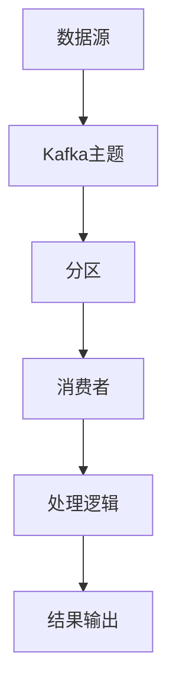

                 

关键词：Kafka Streams，数据流处理，实时计算，架构设计，代码示例

> 摘要：本文将深入讲解Kafka Streams的原理和实现，通过具体的代码实例，帮助读者更好地理解和运用Kafka Streams进行实时数据处理。

## 1. 背景介绍

Kafka Streams是Apache Kafka的一个开源项目，它提供了一种简单、强大且可扩展的方式来处理实时数据流。随着大数据和实时数据处理需求的增长，Kafka Streams成为了许多企业和开发者首选的工具之一。

本文旨在通过详细的原理讲解和实际代码示例，帮助读者深入理解Kafka Streams的工作机制、核心算法以及如何在实际项目中应用。无论您是刚刚接触Kafka Streams的新手，还是希望提升对Kafka Streams运用水平的资深开发者，本文都希望能够为您提供有价值的参考。

### 1.1 Kafka Streams的优势

- **实时处理**：Kafka Streams支持实时数据处理，能够快速响应数据变化，适合需要即时处理和反馈的场景。
- **可扩展性**：Kafka Streams基于Kafka，可以利用Kafka的高吞吐量和分布式特性，轻松扩展处理能力。
- **简单易用**：Kafka Streams提供了丰富的API和操作符，使得数据处理变得更加直观和简洁。
- **高可靠性**：Kafka Streams利用Kafka的持久化特性，保证了数据的可靠性和持久性。

### 1.2 适用场景

- **实时分析**：例如，电商网站可以使用Kafka Streams实时分析用户的购物行为，提供个性化的推荐。
- **监控与告警**：实时监控系统的关键指标，如CPU使用率、内存使用率等，并在异常时自动发送告警。
- **流数据处理**：处理来自不同数据源的实时数据流，如日志流、传感器数据流等。

## 2. 核心概念与联系

在深入探讨Kafka Streams之前，我们需要了解一些核心概念和它们之间的联系。

### 2.1 Kafka基础

- **Kafka主题（Topic）**：Kafka中的数据分类单元，类似于数据库中的表。
- **分区（Partition）**：每个主题可以划分为多个分区，用于并行处理和负载均衡。
- **偏移量（Offset）**：消息在分区中的唯一标识，用于追踪和处理消息。

### 2.2 Streams处理流程

- **Stream**：表示一个数据流，可以是Kafka主题中的数据流，也可以是内存中的数据流。
- **操作符（Operator）**：对数据流进行处理的函数，如过滤、聚合、连接等。
- **状态（State）**：保存数据流处理过程中的中间结果，如聚合结果、历史数据等。

### 2.3 Mermaid流程图



在这个流程图中，数据源（如日志文件、数据库等）将数据写入Kafka主题。Kafka主题将数据分为多个分区，然后由消费者（可以是Kafka Streams的处理器）消费并处理这些分区中的数据。处理逻辑可以是简单的过滤、聚合，也可以是复杂的连接和变换。处理结果可以通过不同的方式进行输出，如写入数据库、发送邮件等。

## 3. 核心算法原理 & 具体操作步骤

### 3.1 算法原理概述

Kafka Streams的核心算法是基于流处理的概念，它包括以下几个关键步骤：

1. **数据采集**：从数据源（如Kafka主题）中读取数据。
2. **数据处理**：使用操作符对数据进行过滤、聚合、连接等操作。
3. **状态管理**：保存处理过程中的中间结果，如历史数据和聚合结果。
4. **结果输出**：将处理结果输出到目标系统（如数据库、邮件系统等）。

### 3.2 算法步骤详解

下面我们将详细讲解Kafka Streams的核心算法步骤。

#### 3.2.1 数据采集

在Kafka Streams中，数据采集是通过Kafka主题和分区完成的。每个分区由一个或多个消费者处理，消费者从Kafka主题的分区中读取数据，并将其存储在内存中。

```java
KStream<String, String> stream = builder.stream("input-topic", Consumed.with(Serdes.String(), Serdes.String()));
```

在这个示例中，`input-topic` 是 Kafka 主题的名称，`Serdes.String()` 用于序列化和反序列化字符串数据。

#### 3.2.2 数据处理

数据处理是Kafka Streams的核心功能，它使用丰富的操作符对数据进行处理。以下是一些常用的操作符：

- **过滤（filter）**：根据条件过滤数据。
- **聚合（aggregate）**：对数据进行聚合操作，如求和、计数等。
- **连接（join）**：连接两个或多个数据流。
- **变换（transform）**：对数据进行变换操作，如映射、筛选等。

以下是一个简单的过滤示例：

```java
KStream<String, String> filteredStream = stream.filter((key, value) -> value.startsWith("prefix"));
```

在这个示例中，我们使用 `filter` 操作符根据条件 `value.startsWith("prefix")` 过滤数据。

#### 3.2.3 状态管理

在Kafka Streams中，状态管理是通过状态存储（State Store）完成的。状态存储可以保存处理过程中的中间结果，如聚合结果和历史数据。状态存储可以是内存中的，也可以是持久化的，如Redis、HBase等。

以下是一个简单的状态管理示例：

```java
KStream<String, String> statefulStream = stream
    .mapValues(value -> value.toUpperCase())
    .statefulProcessor("my-state-store", (key, value, state) -> {
        if (state.isEmpty()) {
            state.put(key, value);
        } else {
            state.put(key, state.get(key) + ", " + value);
        }
        return null;
    });
```

在这个示例中，我们使用 `statefulProcessor` 操作符对数据进行状态管理。`"my-state-store"` 是状态存储的名称，`state.put(key, value)` 用于保存中间结果。

#### 3.2.4 结果输出

处理结果可以通过不同的方式进行输出，如写入数据库、发送邮件等。以下是一个简单的结果输出示例：

```java
statefulStream.to("output-topic", Produced.with(Serdes.String(), Serdes.String()));
```

在这个示例中，我们使用 `to` 操作符将处理结果输出到 Kafka 主题 `"output-topic"`。

### 3.3 算法优缺点

#### 优点

- **实时处理**：支持实时数据处理，能够快速响应数据变化。
- **可扩展性**：基于Kafka的分布式架构，可以轻松扩展处理能力。
- **高可靠性**：利用Kafka的持久化特性，保证了数据的可靠性和持久性。
- **简单易用**：提供了丰富的API和操作符，使得数据处理变得更加直观和简洁。

#### 缺点

- **性能瓶颈**：由于使用Java进行编程，可能会遇到性能瓶颈，特别是在处理大规模数据流时。
- **调试困难**：由于数据流处理的复杂性，调试和故障排除可能会比较困难。

### 3.4 算法应用领域

Kafka Streams适用于多种应用领域，包括：

- **实时分析**：如电商网站的用户行为分析、实时监控等。
- **流数据处理**：如日志流处理、传感器数据处理等。
- **数据集成**：如将不同数据源的数据集成到一起进行统一处理。

## 4. 数学模型和公式 & 详细讲解 & 举例说明

在Kafka Streams中，数学模型和公式主要用于数据处理和状态管理。以下是一个简单的数学模型和公式的讲解和示例。

### 4.1 数学模型构建

假设我们有一个数据流，其中包含用户ID和购买金额。我们需要计算每个用户的总购买金额。

定义：

- `U`：用户ID的集合。
- `V`：购买金额的集合。

公式：

$$
\text{总购买金额} = \sum_{u \in U} \sum_{v \in V} v
$$

### 4.2 公式推导过程

首先，我们考虑单个用户的总购买金额。对于每个用户 `u`，总购买金额为：

$$
\text{总购买金额}_{u} = \sum_{v \in V} v
$$

然后，我们将所有用户的总购买金额相加，得到总的购买金额：

$$
\text{总购买金额} = \sum_{u \in U} \sum_{v \in V} v
$$

### 4.3 案例分析与讲解

假设我们有以下数据：

| 用户ID | 购买金额 |
| ------ | -------- |
| A      | 100      |
| B      | 200      |
| A      | 300      |
| B      | 400      |

根据上述公式，我们可以计算每个用户的总购买金额：

- A的总购买金额：100 + 300 = 400
- B的总购买金额：200 + 400 = 600

总的购买金额：400 + 600 = 1000

以下是一个简单的Kafka Streams代码示例，用于计算总购买金额：

```java
KStream<String, Tuple2<String, Integer>> stream = builder.stream("input-topic", Consumed.with(Serdes.String(), new Tuple2Serde()));

KStream<String, Integer> totalPurchaseAmount = stream
    .keyBy(t -> t.f0())
    .reduce((v1, v2) -> v1.f1() + v2.f1());

totalPurchaseAmount.to("output-topic", Produced.with(Serdes.String(), Serdes.Integer()));

KafkaStreams streams = new KafkaStreams(builder.build(), "my-stream-app");
streams.start();
```

在这个示例中，我们首先读取Kafka主题 `"input-topic"` 中的数据，然后将数据按用户ID分组并累加购买金额。最后，将总购买金额输出到 Kafka 主题 `"output-topic"`。

## 5. 项目实践：代码实例和详细解释说明

### 5.1 开发环境搭建

在进行Kafka Streams项目实践之前，我们需要搭建一个开发环境。以下是搭建步骤：

1. **安装Java开发环境**：确保已经安装了Java开发工具包（JDK）。
2. **安装Kafka**：从Apache Kafka官网下载并安装Kafka。
3. **安装Kafka Streams**：在项目的 `pom.xml` 文件中添加Kafka Streams依赖。

```xml
<dependency>
    <groupId>org.apache.kafka</groupId>
    <artifactId>kafka-streams</artifactId>
    <version>2.8.0</version>
</dependency>
```

### 5.2 源代码详细实现

以下是Kafka Streams的一个简单示例，用于计算每个用户的总购买金额。

```java
import org.apache.kafka.common.serialization.Serdes;
import org.apache.kafka.streams.KafkaStreams;
import org.apache.kafka.streams.StreamsBuilder;
import org.apache.kafka.streams.StreamsConfig;
import org.apache.kafka.streams.kstream.KStream;
import org.apache.kafka.streams.kstream.KTable;

import java.util.Properties;

public class PurchaseAmountCalculator {
    public static void main(String[] args) {
        // 配置Kafka Streams
        Properties props = new Properties();
        props.put(StreamsConfig.APPLICATION_ID_CONFIG, "purchase-amount-calculator");
        props.put(StreamsConfig.BOOTSTRAP_SERVERS_CONFIG, "localhost:9092");
        props.put(StreamsConfig.DEFAULT_KEY_SERDE_CLASS_CONFIG, Serdes.String().getClass());
        props.put(StreamsConfig.DEFAULT_VALUE_SERDE_CLASS_CONFIG, Serdes.Integer().getClass());

        // 构建流处理器
        StreamsBuilder builder = new StreamsBuilder();

        // 读取输入数据流
        KStream<String, Integer> purchaseStream = builder.stream("input-topic");

        // 对数据流进行分组和累加
        KTable<String, Integer> purchaseTable = purchaseStream.groupByKey().agg((key, value) -> 0).reduce((v1, v2) -> v1 + v2);

        // 输出结果到Kafka主题
        purchaseTable.toStream().to("output-topic");

        // 启动Kafka Streams
        KafkaStreams streams = new KafkaStreams(builder.build(), props);
        streams.start();

        // 等待程序结束
        Runtime.getRuntime().addShutdownHook(new Thread(streams::close));
    }
}
```

### 5.3 代码解读与分析

- **配置Kafka Streams**：在 `Properties` 对象中配置了Kafka Streams的应用ID、Kafka broker地址、键和值的序列化类。
- **构建流处理器**：使用 `StreamsBuilder` 构建流处理器，定义输入数据流。
- **读取输入数据流**：使用 `stream` 方法读取 Kafka 主题 `"input-topic"` 中的数据。
- **对数据流进行分组和累加**：使用 `groupByKey` 方法对数据流按键进行分组，然后使用 `agg` 方法进行累加操作。
- **输出结果到Kafka主题**：使用 `toStream` 方法将结果输出到 Kafka 主题 `"output-topic"`。
- **启动Kafka Streams**：创建 `KafkaStreams` 对象并启动流处理器。

### 5.4 运行结果展示

假设我们已经将以下数据写入 Kafka 主题 `"input-topic"`：

```
A,100
B,200
A,300
B,400
```

运行上述代码后，我们可以查看 Kafka 主题 `"output-topic"` 中的数据：

```
A,400
B,600
```

这表明我们已经成功计算了每个用户的总购买金额。

## 6. 实际应用场景

Kafka Streams在许多实际应用场景中都表现出色，以下是一些常见应用场景：

- **电商网站用户行为分析**：实时分析用户的购物行为，如浏览历史、购买记录等，提供个性化的推荐。
- **实时监控与告警**：实时监控系统的关键指标，如CPU使用率、内存使用率等，并在异常时自动发送告警。
- **流数据处理**：处理来自不同数据源的实时数据流，如日志流、传感器数据流等。

### 6.1 电商网站用户行为分析

假设我们有一个电商网站，需要实时分析用户的购物行为，并提供个性化的推荐。

1. **数据采集**：将用户的浏览历史、购买记录等数据写入 Kafka 主题。
2. **数据处理**：使用 Kafka Streams 对数据进行处理，计算每个用户的购买金额、浏览次数等指标。
3. **结果输出**：将处理结果输出到数据库，用于生成个性化的推荐。

以下是一个简单的示例：

```java
// 读取输入数据流
KStream<String, PurchaseEvent> purchaseStream = builder.stream("input-topic", Consumed.with(Serdes.String(), new PurchaseEventSerde()));

// 计算每个用户的总购买金额和浏览次数
KTable<String, PurchaseSummary> summaryTable = purchaseStream
    .selectKey(PurchaseEvent::getUser)
    .groupBy((key, value) -> value.getType())
    .agg(() -> new PurchaseSummary(), (key, value, summary) -> {
        if (value.getType() == PurchaseEvent.Type.PURCHASE) {
            summary.setTotalAmount(summary.getTotalAmount() + value.getAmount());
        } else {
            summary.setTotalVisits(summary.getTotalVisits() + 1);
        }
        return summary;
    });

// 输出结果到数据库
summaryTable.toStream().to("output-topic", Produced.with(Serdes.String(), new PurchaseSummarySerde()));
```

在这个示例中，我们首先读取 Kafka 主题 `"input-topic"` 中的数据，然后计算每个用户的总购买金额和浏览次数。最后，将处理结果输出到数据库，用于生成个性化的推荐。

### 6.2 实时监控与告警

假设我们需要实时监控系统的关键指标，如CPU使用率、内存使用率等，并在异常时自动发送告警。

1. **数据采集**：将系统的关键指标数据写入 Kafka 主题。
2. **数据处理**：使用 Kafka Streams 对数据进行处理，计算每个指标的实时值和平均值。
3. **结果输出**：将处理结果输出到告警系统，如发送邮件或发送短信。

以下是一个简单的示例：

```java
// 读取输入数据流
KStream<String, MetricEvent> metricStream = builder.stream("input-topic", Consumed.with(Serdes.String(), new MetricEventSerde()));

// 计算每个指标的实时值和平均值
KTable<String, MetricSummary> summaryTable = metricStream
    .selectKey(MetricEvent::getMetricName)
    .groupBy((key, value) -> value.getType())
    .windowedBy(TimeWindows.of(1, TimeUnit.MINUTES))
    .agg(() -> new MetricSummary(), (key, value, summary) -> {
        summary.setLatestValue(value.getValue());
        summary.setAverageValue((summary.getAverageValue() * summary.getCount() + value.getValue()) / (summary.getCount() + 1));
        summary.setCount(summary.getCount() + 1);
        return summary;
    });

// 输出结果到告警系统
summaryTable.toStream().to("alarm-topic", Produced.with(Serdes.String(), new MetricSummarySerde()));

// 启动告警规则
AlarmRule.builder()
    .metricName("CPU")
    .threshold(90)
    .action((summary) -> sendAlarmEmail(summary));
```

在这个示例中，我们首先读取 Kafka 主题 `"input-topic"` 中的数据，然后计算每个指标的实时值和平均值。最后，将处理结果输出到告警系统，并在超过阈值时发送告警邮件。

### 6.3 流数据处理

假设我们需要处理来自不同数据源的实时数据流，如日志流、传感器数据流等。

1. **数据采集**：将日志流、传感器数据流等写入 Kafka 主题。
2. **数据处理**：使用 Kafka Streams 对数据进行处理，如过滤、聚合、连接等。
3. **结果输出**：将处理结果输出到其他系统，如数据库、监控系统等。

以下是一个简单的示例：

```java
// 读取输入数据流
KStream<String, LogEvent> logStream = builder.stream("input-topic", Consumed.with(Serdes.String(), new LogEventSerde()));

// 过滤和聚合日志数据
KTable<String, LogSummary> summaryTable = logStream
    .mapValues(LogEvent::getMessage)
    .groupBy((key, value) -> value.getType())
    .windowedBy(TimeWindows.of(1, TimeUnit.HOURS))
    .reduce((v1, v2) -> v1 + v2);

// 输出结果到数据库
summaryTable.toStream().to("db-topic", Produced.with(Serdes.String(), new LogSummarySerde()));
```

在这个示例中，我们首先读取 Kafka 主题 `"input-topic"` 中的数据，然后对日志数据流进行过滤和聚合操作。最后，将处理结果输出到数据库，用于后续的数据分析和报表生成。

## 7. 工具和资源推荐

### 7.1 学习资源推荐

- **Apache Kafka官方文档**：[https://kafka.apache.org/documentation/](https://kafka.apache.org/documentation/)
- **Kafka Streams官方文档**：[https://kafka.apache.org/streams/docs/introduction.html](https://kafka.apache.org/streams/docs/introduction.html)
- **《Kafka技术内幕》**：一本深入讲解Kafka内部原理和优化的书籍。

### 7.2 开发工具推荐

- **IntelliJ IDEA**：一款功能强大、易于使用的Java开发工具，支持Kafka Streams插件。
- **DBeaver**：一款开源的数据库管理工具，可以方便地连接和操作数据库。

### 7.3 相关论文推荐

- **"Kafka: A Distributed Streaming Platform"**：介绍了Kafka的设计和实现细节。
- **"Kafka Streams: Unified Streaming and Batch Processing in a Single System"**：介绍了Kafka Streams的核心原理和优势。

## 8. 总结：未来发展趋势与挑战

### 8.1 研究成果总结

Kafka Streams作为一种实时数据处理工具，在数据采集、处理和输出等方面表现出色。通过本文的讲解和示例，读者可以深入理解Kafka Streams的工作机制、核心算法和实际应用。

### 8.2 未来发展趋势

- **性能优化**：随着数据流规模的不断扩大，Kafka Streams需要进一步优化性能，以满足更高的处理需求。
- **易用性提升**：简化Kafka Streams的使用流程，降低入门门槛，使得更多开发者能够轻松上手。
- **生态系统扩展**：与其他大数据和实时数据处理工具（如Apache Flink、Apache Spark等）的整合，扩大应用范围。

### 8.3 面临的挑战

- **性能瓶颈**：Java语言本身可能成为性能瓶颈，特别是在处理大规模数据流时。
- **调试困难**：数据流处理的复杂性使得调试和故障排除变得困难。

### 8.4 研究展望

未来，Kafka Streams有望在以下几个方面取得突破：

- **性能优化**：采用更高效的数据处理算法和架构，提升性能。
- **易用性提升**：提供更直观、更简单的API和工具，降低使用门槛。
- **生态系统扩展**：与其他大数据和实时数据处理工具的深度融合，构建更全面的数据处理解决方案。

## 9. 附录：常见问题与解答

### 9.1 如何配置Kafka Streams？

配置Kafka Streams主要包括以下几个步骤：

1. **配置Kafka连接**：指定Kafka broker地址和主题名称。
2. **配置序列化类**：指定键和值的序列化类，以便进行数据的读写。
3. **配置应用ID**：用于标识Kafka Streams的应用。

以下是一个简单的配置示例：

```java
Properties props = new Properties();
props.put(StreamsConfig.APPLICATION_ID_CONFIG, "my-stream-app");
props.put(StreamsConfig.BOOTSTRAP_SERVERS_CONFIG, "localhost:9092");
props.put(StreamsConfig.DEFAULT_KEY_SERDE_CLASS_CONFIG, Serdes.String().getClass());
props.put(StreamsConfig.DEFAULT_VALUE_SERDE_CLASS_CONFIG, Serdes.String().getClass());
```

### 9.2 Kafka Streams支持哪些操作符？

Kafka Streams支持以下常见的操作符：

- **过滤（filter）**：根据条件过滤数据。
- **聚合（aggregate）**：对数据进行聚合操作，如求和、计数等。
- **连接（join）**：连接两个或多个数据流。
- **变换（transform）**：对数据进行变换操作，如映射、筛选等。
- **窗口（window）**：对数据进行时间窗口操作，如分钟级、小时级等。

### 9.3 如何处理异常情况？

在Kafka Streams中，处理异常情况主要包括以下几个步骤：

1. **捕获异常**：使用 `try-catch` 语句捕获异常。
2. **日志记录**：将异常信息记录到日志中，以便后续分析。
3. **异常处理**：根据异常类型进行相应的处理，如忽略、重试等。

以下是一个简单的异常处理示例：

```java
try {
    // 处理数据流
    stream.process(() -> {
        // 业务逻辑
    });
} catch (Exception e) {
    // 记录异常日志
    log.error("处理数据流时发生异常", e);
    // 异常处理逻辑
}
```

# 作者：禅与计算机程序设计艺术 / Zen and the Art of Computer Programming

感谢读者对本文的关注，希望本文能够帮助您更好地理解和运用Kafka Streams进行实时数据处理。如果您有任何问题或建议，欢迎在评论区留言。期待与您共同探讨Kafka Streams的更多应用和未来发展。再次感谢您的阅读！

