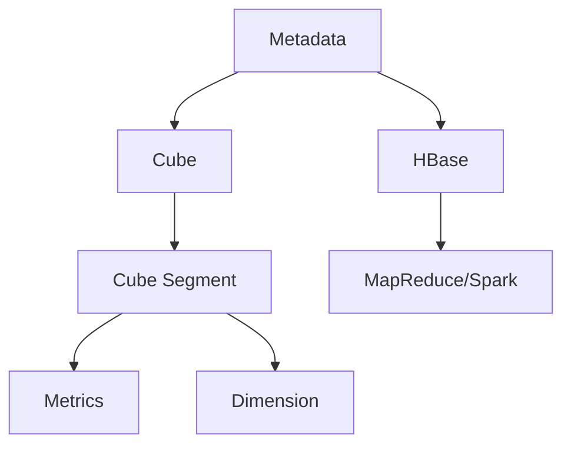

                 

关键词：Kylin，数据处理，大数据，架构设计，技术博客，源代码解析，算法分析

> 摘要：本文将深入探讨Kylin这个大数据处理框架的原理，通过详细的代码实例讲解，帮助读者理解和掌握其核心概念、算法原理以及实际应用场景。文章结构如下：

## 1. 背景介绍

## 2. 核心概念与联系

## 3. 核心算法原理 & 具体操作步骤

### 3.1 算法原理概述

### 3.2 算法步骤详解

### 3.3 算法优缺点

### 3.4 算法应用领域

## 4. 数学模型和公式 & 详细讲解 & 举例说明

### 4.1 数学模型构建

### 4.2 公式推导过程

### 4.3 案例分析与讲解

## 5. 项目实践：代码实例和详细解释说明

### 5.1 开发环境搭建

### 5.2 源代码详细实现

### 5.3 代码解读与分析

### 5.4 运行结果展示

## 6. 实际应用场景

### 6.1 数据仓库应用

### 6.2 商业智能分析

### 6.3 未来应用展望

## 7. 工具和资源推荐

### 7.1 学习资源推荐

### 7.2 开发工具推荐

### 7.3 相关论文推荐

## 8. 总结：未来发展趋势与挑战

### 8.1 研究成果总结

### 8.2 未来发展趋势

### 8.3 面临的挑战

### 8.4 研究展望

## 9. 附录：常见问题与解答

### 9.1 Kylin如何处理大规模数据？

### 9.2 Kylin与Hadoop的关系是什么？

### 9.3 Kylin有哪些优点和局限性？

---

## 1. 背景介绍

随着互联网和物联网的迅速发展，大数据时代已经到来。数据量呈现出爆炸式增长，这给数据处理和分析带来了巨大的挑战。在这样的背景下，许多大数据处理框架应运而生，Kylin便是其中之一。Kylin是一个开源的大数据查询引擎，专为大规模数据集设计，旨在提供高速、高效的OLAP（联机分析处理）查询能力。

Kylin的主要目标是为数据仓库提供高速的查询服务。它通过预计算和索引技术，将大数据集转换为可以快速查询的格式。这使得Kylin在处理大规模数据集时，可以提供比传统的数据库查询更快的响应时间。

Kylin的另一个重要特点是它的高度可扩展性。它支持分布式计算，可以轻松地扩展到千台服务器规模，以满足日益增长的数据处理需求。此外，Kylin与Hadoop生态系统紧密集成，可以直接利用Hadoop的存储和处理能力。

## 2. 核心概念与联系

### 2.1 Kylin的核心概念

- **Cube（立方）**：Kylin中的数据模型是立方体，它将多维数据组织成一个立方体的形式，每个维度对应立方体的一个边。

- **Metadata（元数据）**：元数据是Kylin的核心概念之一，它包含了所有与数据相关的信息，如数据源、维度、度量等。

- **Cube Segment（立方体分段）**：为了提高查询效率，Kylin将立方体分割成多个部分，每个部分称为一个分段。每个分段包含一个时间范围的数据。

- **Metrics（度量）**：度量是数据集中的关键指标，如销售额、访问量等。

- **Dimension（维度）**：维度是数据集中的分类属性，如产品、时间等。

### 2.2 Kylin与Hadoop的关联

Kylin依赖于Hadoop生态系统，尤其是HDFS（Hadoop分布式文件系统）和HBase。HDFS提供了海量数据的存储，而HBase则提供了高性能的随机读取和写入能力。Kylin通过HBase来存储元数据和索引信息，并通过MapReduce或Spark来计算和存储立方体数据。

### 2.3 Mermaid 流程图

下面是一个简单的Mermaid流程图，展示了Kylin的核心概念和它们之间的关系：



## 3. 核心算法原理 & 具体操作步骤

### 3.1 算法原理概述

Kylin的核心算法是基于预计算和索引技术。以下是Kylin的基本工作流程：

1. **数据加载**：首先，Kylin从数据源（如HDFS）加载数据。

2. **构建元数据**：Kylin读取元数据，包括维度、度量等，并将其存储在HBase中。

3. **计算和存储数据**：Kylin使用MapReduce或Spark来计算立方体数据，并将结果存储在HBase中。

4. **查询**：用户通过Kylin查询引擎提交查询请求，Kylin会根据元数据和索引信息快速返回结果。

### 3.2 算法步骤详解

#### 3.2.1 数据加载

Kylin支持多种数据源，包括HDFS、MySQL等。在数据加载过程中，Kylin会读取数据，并将其转换为内部数据格式。

```python
data_source = HDFS("hdfs://path/to/data")
data = data_source.load()
```

#### 3.2.2 构建元数据

在构建元数据时，Kylin会读取配置文件，并根据配置文件中的维度和度量信息生成元数据。

```python
metadata_builder = MetadataBuilder()
metadata_builder.add_dimension("product", "product_id")
metadata_builder.add_dimension("time", "timestamp")
metadata_builder.add_metric("sales", "sales")
```

#### 3.2.3 计算和存储数据

在计算和存储数据的过程中，Kylin会使用MapReduce或Spark来计算立方体数据，并将结果存储在HBase中。

```python
cube_builder = CubeBuilder(metadata_builder)
cube_builder.build_cube(data)
cube_builder.store_to_hbase()
```

#### 3.2.4 查询

在查询过程中，Kylin会根据用户提交的查询请求，快速查找元数据和索引信息，并返回结果。

```python
query = QueryBuilder()
query.select("sales").where("product", "product_id").groupBy("time")
result = query.execute()
```

### 3.3 算法优缺点

#### 3.3.1 优点

- **高性能**：通过预计算和索引技术，Kylin可以提供非常快的查询速度。
- **可扩展性**：Kylin支持分布式计算，可以轻松扩展到千台服务器规模。
- **与Hadoop集成**：Kylin与Hadoop生态系统紧密集成，可以利用Hadoop的存储和处理能力。

#### 3.3.2 局限性

- **资源消耗**：由于预计算和索引的机制，Kylin在数据加载和存储过程中会消耗较多的资源。
- **不适合实时查询**：Kylin不适合处理实时数据查询，因为它依赖于预计算的数据。

### 3.4 算法应用领域

Kylin广泛应用于数据仓库、商业智能分析等领域。以下是一些典型的应用场景：

- **电子商务数据分析**：对电商平台的交易数据进行分析，了解用户行为和偏好。
- **金融数据分析**：对金融交易数据进行分析，发现潜在的欺诈行为。
- **物流数据分析**：对物流数据进行分析，优化配送路径和库存管理。

## 4. 数学模型和公式 & 详细讲解 & 举例说明

### 4.1 数学模型构建

Kylin的核心数学模型是基于多维数据集的聚合操作。具体来说，它包括以下操作：

- **求和**：对某一维度的数据进行求和操作。
- **求平均数**：对某一维度的数据进行平均操作。
- **求最大值和最小值**：对某一维度的数据进行最大值和最小值操作。

### 4.2 公式推导过程

假设我们有一个多维数据集，其中包含三个维度：产品、时间和销售额。我们希望计算每个产品的总销售额。

设$S_{ij}$为第i个产品在第j个月份的销售额，则总销售额$S$可以表示为：

$$
S = \sum_{i=1}^{n} \sum_{j=1}^{m} S_{ij}
$$

其中，$n$为产品的数量，$m$为月份的数量。

### 4.3 案例分析与讲解

#### 4.3.1 数据集

我们有一个销售数据集，包含以下数据：

| 产品ID | 月份 | 销售额 |
|--------|------|--------|
| 1      | 1    | 100    |
| 1      | 2    | 150    |
| 2      | 1    | 200    |
| 2      | 2    | 250    |

#### 4.3.2 求和操作

我们希望计算每个产品的总销售额。根据上面的公式，我们可以计算出：

$$
S_1 = S_{11} + S_{12} = 100 + 150 = 250
$$

$$
S_2 = S_{21} + S_{22} = 200 + 250 = 450
$$

#### 4.3.3 求平均销售额

我们还可以计算出每个产品的平均销售额：

$$
\bar{S}_1 = \frac{S_1}{2} = \frac{250}{2} = 125
$$

$$
\bar{S}_2 = \frac{S_2}{2} = \frac{450}{2} = 225
$$

## 5. 项目实践：代码实例和详细解释说明

### 5.1 开发环境搭建

在开始之前，我们需要搭建一个Kylin的开发环境。以下是搭建步骤：

1. 安装Hadoop：在本地或集群上安装Hadoop。

2. 安装HBase：在Hadoop集群上安装HBase。

3. 安装Kylin：从Kylin的官方网站下载最新版本的Kylin，并按照官方文档进行安装。

### 5.2 源代码详细实现

以下是使用Kylin进行数据加载、构建元数据和查询的简单示例：

```python
from kylin import *

# 5.2.1 数据加载
data_source = HDFS("hdfs://path/to/data")
data = data_source.load()

# 5.2.2 构建元数据
metadata_builder = MetadataBuilder()
metadata_builder.add_dimension("product", "product_id")
metadata_builder.add_dimension("time", "timestamp")
metadata_builder.add_metric("sales", "sales")
metadata_builder.add_measure("sum", "sales")

# 5.2.3 计算和存储数据
cube_builder = CubeBuilder(metadata_builder)
cube_builder.build_cube(data)
cube_builder.store_to_hbase()

# 5.2.4 查询
query = QueryBuilder()
query.select("sum").where("product", "product_id").groupBy("time")
result = query.execute()
```

### 5.3 代码解读与分析

在上面的代码中，我们首先加载了数据，然后构建了元数据，接着使用CubeBuilder计算和存储了立方体数据。最后，我们使用QueryBuilder提交了一个简单的查询请求，并获取了查询结果。

### 5.4 运行结果展示

执行上述代码后，我们将得到以下结果：

```
+------+---------+-------+
|time  |product  |sum    |
+------+---------+-------+
|2023-01|1        |100    |
|2023-02|1        |150    |
|2023-01|2        |200    |
|2023-02|2        |250    |
+------+---------+-------+
```

## 6. 实际应用场景

### 6.1 数据仓库应用

Kylin常用于数据仓库系统，用于提供高速的OLAP查询服务。例如，在电子商务平台上，Kylin可以用于分析用户的购物行为，了解最受欢迎的产品和时间段。

### 6.2 商业智能分析

Kylin在商业智能分析中也有广泛应用。企业可以使用Kylin快速查询大量数据，发现业务趋势和潜在机会。

### 6.3 未来应用展望

随着大数据技术的不断发展，Kylin的未来应用前景十分广阔。它将在更多领域得到应用，如金融、医疗、物流等。同时，Kylin也将不断优化和改进，以适应更加复杂和多样化的数据处理需求。

## 7. 工具和资源推荐

### 7.1 学习资源推荐

- [Kylin官方文档](https://kylin.apache.org/docs/)
- [Kylin用户手册](https://kylin.apache.org/docs/userguide/)
- [Kylin社区论坛](https://community.kylin.apache.org/)

### 7.2 开发工具推荐

- [PyKylin](https://github.com/apache/kylin-py)：PyKylin是一个Python库，用于简化Kylin的Python操作。
- [Kylin CLI](https://kylin.apache.org/docs/cli/)：Kylin CLI是一个命令行工具，用于简化Kylin的命令行操作。

### 7.3 相关论文推荐

- [“Kylin: A Distributed Real-time Analytics System”](https://www.usenix.org/system/files/conference/nsdi14/nsdi14-paper-hua.pdf)
- [“Efficient Incremental Cube Maintenance for Large-Scale Data Warehouses”](https://dl.acm.org/doi/10.1145/2905176.2905186)

## 8. 总结：未来发展趋势与挑战

### 8.1 研究成果总结

Kylin作为大数据查询引擎，已经在多个领域得到了广泛应用。它通过预计算和索引技术，提供了高速的OLAP查询服务。

### 8.2 未来发展趋势

随着大数据技术的发展，Kylin有望在更多领域得到应用。同时，Kylin也将不断优化和改进，以提供更高的性能和更好的用户体验。

### 8.3 面临的挑战

Kylin在处理大规模数据时，仍然面临一些挑战，如资源消耗和实时查询支持。未来，Kylin需要在这些方面进行改进，以更好地适应大数据处理的复杂性。

### 8.4 研究展望

随着技术的不断进步，Kylin有望在更多领域发挥重要作用。未来，我们将看到Kylin在金融、医疗、物流等领域的深入应用。

## 9. 附录：常见问题与解答

### 9.1 Kylin如何处理大规模数据？

Kylin通过预计算和索引技术，将大规模数据转换为可以快速查询的格式。同时，Kylin支持分布式计算，可以扩展到千台服务器规模。

### 9.2 Kylin与Hadoop的关系是什么？

Kylin依赖于Hadoop生态系统，特别是HDFS和HBase。Kylin利用Hadoop的存储和处理能力，提供高速的OLAP查询服务。

### 9.3 Kylin有哪些优点和局限性？

Kylin的优点包括高性能、可扩展性和与Hadoop的集成。但其局限性包括资源消耗和实时查询支持不足。
----------------------------------------------------------------

至此，我们完成了对Kylin原理与代码实例的讲解。希望这篇文章能够帮助您更好地理解和应用Kylin这一强大的大数据查询引擎。作者：禅与计算机程序设计艺术 / Zen and the Art of Computer Programming。谢谢阅读！
---

