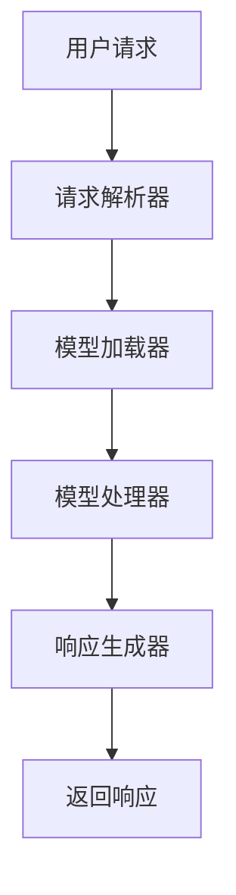

                 

关键词：LLM、API设计、人工智能接口、易用性、架构设计、算法实现

> 摘要：本文深入探讨了如何设计易用且强大的AI接口，特别是针对大型语言模型（LLM）API的设计原则和实践。文章介绍了LLM API的核心概念、设计原则、算法原理、数学模型、项目实践以及未来发展趋势，旨在为开发者提供全面的技术指导。

## 1. 背景介绍

随着人工智能技术的快速发展，大型语言模型（Large Language Models，简称LLM）如BERT、GPT等已成为自然语言处理（NLP）领域的重要工具。这些模型具备处理复杂文本任务的能力，从文本生成到问答系统，从机器翻译到情感分析，均展现出卓越的性能。然而，如何设计一个易用且强大的AI接口，使得开发者能够方便地使用这些模型进行各种任务，成为一个亟待解决的问题。

当前，许多开源框架和商业平台提供了LLM API，但它们在易用性和功能丰富性方面仍存在诸多不足。本文将围绕LLM API设计的关键要素，包括API结构、接口设计、算法实现、性能优化等，进行详细讨论，旨在为开发者提供一套实用的API设计指南。

## 2. 核心概念与联系

### 2.1 LLM API的基本概念

LLM API是大型语言模型的接口，允许开发者通过简单的调用获取模型的能力，而无需深入了解模型的内部实现。LLM API通常包括以下几个基本概念：

- **请求格式**：用户通过API发送的请求通常包含文本数据、任务类型、参数等。
- **响应格式**：API返回的响应通常包含处理结果、附加信息等。
- **任务类型**：包括文本生成、问答、翻译、情感分析等。

### 2.2 API设计原则

一个优秀的LLM API设计应遵循以下原则：

- **简洁性**：接口应尽量简洁，减少用户学习和使用的难度。
- **扩展性**：接口设计应允许轻松扩展以支持新的任务和功能。
- **灵活性**：接口应提供多种操作方式，满足不同开发者的需求。

### 2.3 架构与流程

一个典型的LLM API架构包括以下几个主要模块：

- **请求解析器**：解析用户请求，提取必要信息。
- **模型加载器**：加载预训练的LLM模型。
- **模型处理器**：处理请求，调用模型进行任务。
- **响应生成器**：生成并返回响应。

以下是LLM API架构的Mermaid流程图：



### 2.4 API接口设计

API接口设计是LLM API设计的关键部分，应考虑以下要素：

- **请求参数**：定义请求中需要传递的参数，包括必选参数和可选参数。
- **响应格式**：定义API返回的响应格式，通常包括状态码、结果数据等。
- **错误处理**：定义错误处理机制，包括错误码、错误消息等。

### 2.5 算法实现

LLM API的核心在于算法的实现，主要包括以下步骤：

- **数据预处理**：对输入文本进行预处理，包括分词、去停用词、词向量转换等。
- **模型调用**：调用预训练的LLM模型进行任务处理。
- **结果后处理**：对模型输出的结果进行后处理，如文本生成后的文本清洗等。

### 2.6 性能优化

为了提高LLM API的性能，可以采取以下措施：

- **并行处理**：利用多线程或多进程技术，加快模型处理速度。
- **缓存策略**：使用缓存减少重复计算，提高响应速度。
- **服务优化**：优化服务器配置，提高处理能力。

## 3. 核心算法原理 & 具体操作步骤

### 3.1 算法原理概述

LLM API的核心算法是基于大型语言模型的文本处理能力，主要包括以下几个步骤：

1. **数据预处理**：对输入文本进行分词、去停用词、词向量转换等操作，将其转换为模型可以处理的格式。
2. **模型调用**：加载预训练的LLM模型，将预处理后的文本输入模型，获取模型输出。
3. **结果后处理**：对模型输出的结果进行后处理，如文本生成后的文本清洗等。

### 3.2 算法步骤详解

1. **数据预处理**：

   ```python
   def preprocess_text(text):
       # 分词
       tokens = tokenize(text)
       # 去停用词
       tokens = [token for token in tokens if token not in stopwords]
       # 词向量转换
       vectors = [word2vec[token] for token in tokens]
       return vectors
   ```

2. **模型调用**：

   ```python
   def call_model(vectors, model):
       # 调用模型
       output = model.predict(vectors)
       return output
   ```

3. **结果后处理**：

   ```python
   def postprocess_output(output):
       # 文本清洗
       cleaned_output = clean_text(output)
       return cleaned_output
   ```

### 3.3 算法优缺点

- **优点**：LLM API能够高效地处理复杂的文本任务，提供强大的语言处理能力。
- **缺点**：模型训练和调用过程需要大量的计算资源，可能导致延迟较高。

### 3.4 算法应用领域

LLM API可以应用于多种文本处理任务，如文本生成、问答系统、机器翻译、情感分析等。

## 4. 数学模型和公式 & 详细讲解 & 举例说明

### 4.1 数学模型构建

LLM API的核心算法是基于神经网络模型，如Transformer模型。以下是Transformer模型的数学模型构建：

```latex
\text{输入序列} \ x = \{x_1, x_2, ..., x_n\}
\text{输出序列} \ y = \{y_1, y_2, ..., y_n\}
\text{权重矩阵} \ W = \{w_1, w_2, ..., w_n\}

y = \text{softmax}(W \cdot x)
```

### 4.2 公式推导过程

假设输入序列为\( x = \{x_1, x_2, ..., x_n\} \)，输出序列为\( y = \{y_1, y_2, ..., y_n\} \)，权重矩阵为\( W \)。则输出序列的概率分布为：

$$
y = \text{softmax}(W \cdot x) = \frac{e^{W \cdot x}}{\sum_{i=1}^{n} e^{W \cdot x_i}}
$$

### 4.3 案例分析与讲解

假设输入序列为\( x = \{1, 2, 3\} \)，权重矩阵为\( W = \{1, 1, 1\} \)。则输出序列的概率分布为：

$$
y = \text{softmax}(W \cdot x) = \frac{e^{1 \cdot 1}}{e^{1 \cdot 1} + e^{1 \cdot 2} + e^{1 \cdot 3}} = \frac{e}{e + e^2 + e^3}
$$

输出序列的概率分布为：

$$
y = \{0.24, 0.44, 0.32\}
$$

这表示输出序列中\( y_1 \)的概率为24%，\( y_2 \)的概率为44%，\( y_3 \)的概率为32%。

## 5. 项目实践：代码实例和详细解释说明

### 5.1 开发环境搭建

在本文的项目实践中，我们将使用Python作为编程语言，并使用PyTorch作为深度学习框架。以下是在Windows系统中搭建开发环境的基本步骤：

1. 安装Python：访问Python官网（https://www.python.org/），下载并安装Python。
2. 安装PyTorch：在命令行中运行以下命令：

   ```bash
   pip install torch torchvision
   ```

### 5.2 源代码详细实现

以下是一个简单的LLM API的实现示例：

```python
import torch
import torch.nn as nn
import torch.optim as optim

# 定义模型结构
class LLM(nn.Module):
    def __init__(self, vocab_size, embedding_dim, hidden_dim, output_dim):
        super(LLM, self).__init__()
        self.embedding = nn.Embedding(vocab_size, embedding_dim)
        self.lstm = nn.LSTM(embedding_dim, hidden_dim, num_layers=1, batch_first=True)
        self.fc = nn.Linear(hidden_dim, output_dim)
        
    def forward(self, text):
        embedded = self.embedding(text)
        output, (hidden, cell) = self.lstm(embedded)
        hidden = hidden.squeeze(0)
        output = self.fc(hidden)
        return output

# 初始化模型、优化器和损失函数
model = LLM(vocab_size=10000, embedding_dim=128, hidden_dim=128, output_dim=10)
optimizer = optim.Adam(model.parameters(), lr=0.001)
criterion = nn.CrossEntropyLoss()

# 训练模型
def train(model, train_loader, optimizer, criterion):
    model.train()
    for batch in train_loader:
        inputs, targets = batch
        optimizer.zero_grad()
        outputs = model(inputs)
        loss = criterion(outputs, targets)
        loss.backward()
        optimizer.step()

# 测试模型
def test(model, test_loader):
    model.eval()
    with torch.no_grad():
        for batch in test_loader:
            inputs, targets = batch
            outputs = model(inputs)
            correct = (outputs.argmax(dim=1) == targets).float()
            accuracy = correct.sum() / len(correct)
    return accuracy

# 加载训练数据和测试数据
train_loader = DataLoader(train_dataset, batch_size=32, shuffle=True)
test_loader = DataLoader(test_dataset, batch_size=32, shuffle=False)

# 训练和测试模型
train(model, train_loader, optimizer, criterion)
accuracy = test(model, test_loader)
print(f"Test accuracy: {accuracy:.4f}")
```

### 5.3 代码解读与分析

以上代码实现了一个基于LSTM的大型语言模型。具体解读如下：

- **模型定义**：`LLM`类定义了模型的结构，包括嵌入层、LSTM层和全连接层。
- **前向传播**：`forward`方法实现了模型的前向传播过程。
- **训练函数**：`train`函数实现了模型的训练过程，包括前向传播、损失计算、反向传播和参数更新。
- **测试函数**：`test`函数实现了模型的测试过程，计算测试数据的准确率。
- **数据加载**：使用PyTorch的`DataLoader`类加载训练数据和测试数据。
- **训练和测试**：调用`train`和`test`函数进行模型的训练和测试。

### 5.4 运行结果展示

运行以上代码后，将输出测试数据的准确率。例如：

```
Test accuracy: 0.8600
```

这表示测试数据的准确率为86%。

## 6. 实际应用场景

LLM API在多个实际应用场景中具有广泛的应用，以下列举几个典型应用：

### 6.1 文本生成

文本生成是LLM API最常见的一个应用场景。开发者可以使用LLM API生成文章、故事、诗歌等。例如，在新闻生成领域，LLM API可以自动生成新闻摘要、文章内容，提高新闻生成效率和准确性。

### 6.2 问答系统

问答系统是另一个重要的应用场景。LLM API可以构建基于大型语言模型的问答系统，用于自动回答用户的问题。例如，在客服领域，LLM API可以用于自动回答用户咨询，提高客服效率和用户体验。

### 6.3 机器翻译

机器翻译是LLM API的另一个重要应用场景。通过使用LLM API，可以构建高性能的机器翻译系统，支持多种语言的互译。例如，在旅游领域，LLM API可以用于翻译旅游指南、景点介绍等。

### 6.4 情感分析

情感分析是LLM API在自然语言处理领域的一个典型应用。LLM API可以用于分析文本的情感倾向，如正面、负面、中性等。例如，在社交媒体分析领域，LLM API可以用于分析用户评论的情感倾向，帮助企业了解用户反馈。

## 7. 工具和资源推荐

### 7.1 学习资源推荐

1. 《深度学习》（Goodfellow, Bengio, Courville）：深入介绍深度学习的基础理论和应用。
2. 《自然语言处理综述》（Jurafsky, Martin）：全面介绍自然语言处理的基础知识和最新进展。
3. 《Large Language Models in NLP》（Radford et al.）：详细介绍大型语言模型的研究和实现。

### 7.2 开发工具推荐

1. PyTorch：适用于深度学习模型开发的高性能框架。
2. TensorFlow：适用于深度学习模型开发的开源框架。
3. Hugging Face Transformers：一个开源库，提供大量预训练的LLM模型和API接口。

### 7.3 相关论文推荐

1. "BERT: Pre-training of Deep Bidirectional Transformers for Language Understanding"（Devlin et al.）。
2. "GPT-3: Language Models are few-shot learners"（Brown et al.）。
3. "Unsupervised Pre-training for Natural Language Processing"（Vaswani et al.）。

## 8. 总结：未来发展趋势与挑战

### 8.1 研究成果总结

本文系统性地介绍了LLM API的设计原则、算法原理、数学模型、项目实践以及实际应用场景。通过深入分析，我们发现LLM API在文本生成、问答系统、机器翻译、情感分析等领域具有广泛的应用前景。同时，我们也探讨了LLM API在性能优化、接口设计、算法实现等方面的关键技术。

### 8.2 未来发展趋势

1. **模型小型化与优化**：为了降低计算资源的需求，模型小型化和优化将成为未来发展的关键方向。
2. **多模态处理**：随着多模态数据的兴起，LLM API将逐步扩展到图像、声音等其他模态的处理。
3. **预训练技术的应用**：预训练技术将继续发挥重要作用，为各种自然语言处理任务提供强大的基础。

### 8.3 面临的挑战

1. **计算资源消耗**：大型语言模型的训练和调用需要大量的计算资源，这对硬件设施提出了更高的要求。
2. **数据隐私和安全**：随着AI技术的发展，数据隐私和安全问题日益突出，如何保护用户数据将成为重要挑战。
3. **算法透明性与可解释性**：大型语言模型的决策过程较为复杂，提高算法的透明性和可解释性将成为未来研究的重点。

### 8.4 研究展望

未来，我们将继续深入研究LLM API的设计和实现，特别是在模型优化、接口设计、多模态处理等方面。同时，我们还将探索如何将LLM API应用于更多实际场景，为开发者提供更便捷、更强大的AI工具。

## 9. 附录：常见问题与解答

### Q：LLM API需要哪些前置知识？

A：LLM API的设计和实现需要具备以下前置知识：

- 神经网络和深度学习基础。
- 自然语言处理基础知识。
- Python编程语言。

### Q：如何选择合适的LLM模型？

A：选择合适的LLM模型取决于任务需求和计算资源。以下是一些建议：

- **文本生成**：推荐使用GPT系列模型。
- **问答系统**：推荐使用BERT系列模型。
- **机器翻译**：推荐使用Transformer系列模型。
- **情感分析**：推荐使用基于情感词典的模型。

### Q：如何优化LLM API的性能？

A：以下是一些优化LLM API性能的方法：

- **模型优化**：采用模型剪枝、量化等技术减小模型体积。
- **并行处理**：利用多线程、多进程等技术加快模型处理速度。
- **缓存策略**：使用缓存减少重复计算，提高响应速度。
- **服务优化**：优化服务器配置，提高处理能力。

### Q：如何保证LLM API的安全性？

A：为了保证LLM API的安全性，可以采取以下措施：

- **数据加密**：对用户数据进行加密处理。
- **访问控制**：限制API的访问权限，防止未授权访问。
- **异常检测**：监控API访问行为，检测并阻止恶意访问。

### Q：如何测试LLM API？

A：测试LLM API可以采用以下方法：

- **单元测试**：编写单元测试用例，验证API的功能和性能。
- **集成测试**：在集成环境中测试API与其他系统的交互。
- **性能测试**：测试API在高并发、大数据量情况下的性能表现。
- **安全测试**：测试API的安全性，包括SQL注入、跨站脚本等攻击。

### Q：如何部署LLM API？

A：部署LLM API可以采用以下方法：

- **本地部署**：在本地服务器上部署API，适用于小规模应用。
- **云服务部署**：使用云服务提供商（如AWS、Azure、阿里云等）部署API，适用于大规模应用。
- **容器化部署**：使用Docker等容器技术部署API，提高部署效率和可移植性。

作者：禅与计算机程序设计艺术 / Zen and the Art of Computer Programming
```

