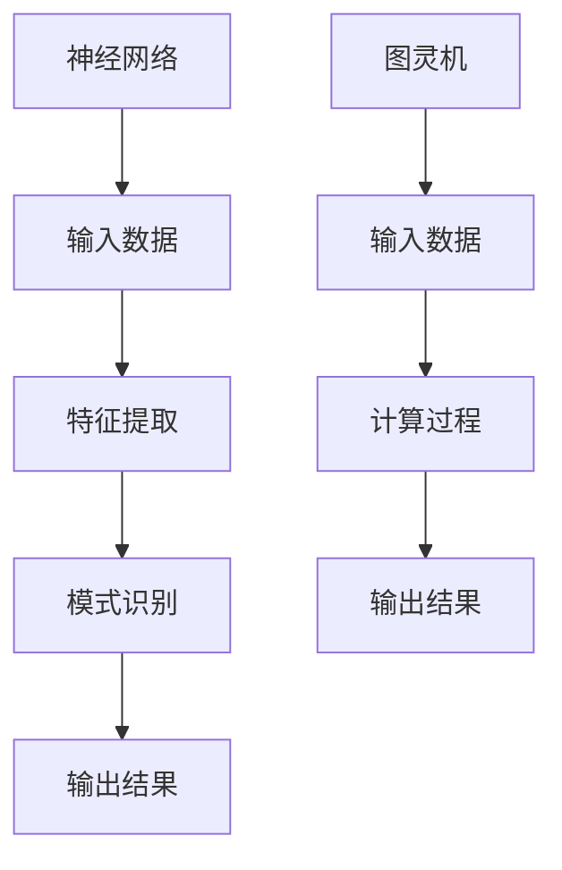

                 

关键词：大型语言模型（LLM）、中央处理单元（CPU）、计算范式、神经网络、图灵机、算法效率、AI应用。

> 摘要：本文将深入探讨大型语言模型（LLM）与中央处理单元（CPU）之间的计算范式差异，分析两者在处理复杂数据和执行任务时的优缺点。通过对比神经网络与图灵机的计算原理，我们将探讨未来计算范式的可能发展方向。

## 1. 背景介绍

随着人工智能（AI）的快速发展，大型语言模型（LLM）如GPT、BERT等在自然语言处理（NLP）领域取得了显著成果。与此同时，中央处理单元（CPU）作为计算机的核心部件，一直在不断提升其性能和效率。本文旨在分析LLM与CPU之间的计算范式差异，探讨两者在AI应用中的地位和未来发展趋势。

### 1.1 大型语言模型（LLM）的崛起

近年来，大型语言模型（LLM）在NLP领域取得了显著进展。这些模型通过深度学习技术，从海量数据中学习语言结构和语义信息，能够进行自然语言生成、文本分类、机器翻译等多种任务。LLM的成功得益于其庞大的参数规模和强大的计算能力，使得AI系统在处理自然语言任务时具有更高的准确性和灵活性。

### 1.2 中央处理单元（CPU）的发展

中央处理单元（CPU）作为计算机的核心部件，其性能的提升直接影响整个系统的效率。从最初的冯诺伊曼架构（Von Neumann architecture）到多核处理器、到现在的神经处理单元（NPU）和专用集成电路（ASIC），CPU的发展历程见证了一系列技术突破。CPU在处理复杂数据和执行计算任务时具有强大的计算能力和高效的执行效率。

## 2. 核心概念与联系

### 2.1 神经网络与图灵机的计算原理

神经网络（Neural Networks）是LLM的核心计算模型，其灵感来源于人脑神经元之间的连接和信号传递。神经网络通过多层节点（神经元）的相互连接，实现对输入数据的特征提取和模式识别。而图灵机（Turing Machine）是传统计算机科学中的核心概念，由英国数学家阿兰·图灵（Alan Turing）提出，是一种抽象的计算模型，能够模拟任何计算过程。

### 2.2 Mermaid流程图：神经网络与图灵机的对比

下面是神经网络与图灵机的Mermaid流程图，展示了两者在计算过程中的主要步骤和结构：



### 2.3 核心概念原理与架构的联系

神经网络和图灵机在计算原理和架构上存在一定的联系。神经网络通过多层节点之间的连接和激活函数，实现对输入数据的特征提取和模式识别，类似于图灵机中的读取、写入、移动等操作。然而，神经网络在处理复杂数据和执行计算任务时具有更高的灵活性和可扩展性，而图灵机则是一种通用的计算模型，能够模拟任何计算过程。

## 3. 核心算法原理 & 具体操作步骤

### 3.1 算法原理概述

本文将重点探讨神经网络在LLM中的应用原理。神经网络通过多层感知器（MLP）和循环神经网络（RNN）等结构，实现对输入数据的特征提取和语义理解。下面是神经网络的基本原理和操作步骤：

1. 输入数据预处理：对输入数据（如文本、图像等）进行预处理，将其转换为模型可接受的格式。

2. 特征提取：通过多层感知器（MLP）或卷积神经网络（CNN）等结构，对输入数据进行特征提取，提取出具有代表性的特征向量。

3. 模式识别：通过循环神经网络（RNN）或长短时记忆网络（LSTM）等结构，对特征向量进行模式识别，预测输出结果。

4. 损失函数：使用损失函数（如交叉熵损失函数）评估模型的预测结果与真实结果之间的差距，更新模型参数。

5. 优化算法：使用优化算法（如梯度下降、Adam优化器等）更新模型参数，减小损失函数值。

### 3.2 算法步骤详解

1. **输入数据预处理**：
    - 数据清洗：去除输入数据中的噪声和异常值，提高数据质量。
    - 数据归一化：将输入数据的特征值缩放到相同的范围内，避免数据差异对模型训练产生不利影响。

2. **特征提取**：
    - 层次化特征提取：通过多层感知器（MLP）或卷积神经网络（CNN）等结构，逐步提取输入数据的特征，形成具有代表性的特征向量。

3. **模式识别**：
    - 循环神经网络（RNN）或长短时记忆网络（LSTM）：通过循环神经网络（RNN）或长短时记忆网络（LSTM）等结构，对特征向量进行模式识别，预测输出结果。

4. **损失函数**：
    - 交叉熵损失函数：用于评估模型的预测结果与真实结果之间的差距，计算损失函数值。

5. **优化算法**：
    - 梯度下降：通过计算损失函数的梯度，更新模型参数，减小损失函数值。
    - Adam优化器：结合了梯度下降和自适应学习率的优点，提高模型训练效率。

### 3.3 算法优缺点

1. **优点**：
    - **强大的特征提取能力**：神经网络能够自动提取输入数据的特征，减少人工干预，提高模型泛化能力。
    - **自适应学习率**：神经网络通过优化算法，自适应调整学习率，提高模型训练效率。
    - **灵活的可扩展性**：神经网络结构可以灵活调整，适应不同类型的数据和任务需求。

2. **缺点**：
    - **计算复杂度高**：神经网络模型包含大量的参数和计算操作，计算复杂度高，对硬件资源有较高要求。
    - **对数据依赖性强**：神经网络模型需要大量数据进行训练，对数据质量和数据量有较高要求。

### 3.4 算法应用领域

神经网络在LLM中的应用范围广泛，包括但不限于以下领域：

1. **自然语言处理**：神经网络能够自动提取文本中的语义信息，应用于文本分类、情感分析、机器翻译等任务。
2. **计算机视觉**：神经网络通过卷积神经网络（CNN）等结构，实现对图像的特征提取和模式识别，应用于图像分类、目标检测、人脸识别等任务。
3. **语音识别**：神经网络通过循环神经网络（RNN）或长短时记忆网络（LSTM）等结构，实现对语音信号的时序特征提取和模式识别，应用于语音识别、语音合成等任务。

## 4. 数学模型和公式 & 详细讲解 & 举例说明

### 4.1 数学模型构建

神经网络中的数学模型主要包括以下几个方面：

1. **激活函数**：用于对神经元输出进行非线性变换，常见的激活函数有sigmoid、ReLU、tanh等。
2. **损失函数**：用于评估模型预测结果与真实结果之间的差距，常见的损失函数有交叉熵损失函数、均方误差损失函数等。
3. **优化算法**：用于更新模型参数，减小损失函数值，常见的优化算法有梯度下降、Adam优化器等。

### 4.2 公式推导过程

1. **激活函数公式**：
   - sigmoid函数：\( f(x) = \frac{1}{1 + e^{-x}} \)
   - ReLU函数：\( f(x) = \max(0, x) \)
   - tanh函数：\( f(x) = \frac{e^x - e^{-x}}{e^x + e^{-x}} \)

2. **损失函数公式**：
   - 交叉熵损失函数：\( L = -\frac{1}{N} \sum_{i=1}^{N} y_i \log (p_i) \)
   - 均方误差损失函数：\( L = \frac{1}{2} \sum_{i=1}^{N} (y_i - \hat{y_i})^2 \)

3. **优化算法公式**：
   - 梯度下降：\( \theta_{t+1} = \theta_{t} - \alpha \nabla_\theta J(\theta) \)
   - Adam优化器：\( \theta_{t+1} = \theta_{t} - \alpha \nabla_\theta J(\theta) + \beta_1 \frac{\nabla_\theta J(\theta)}{1 - \beta_1^t} + \beta_2 \frac{\nabla_\theta J(\theta)^2}{1 - \beta_2^t} \)

### 4.3 案例分析与讲解

**案例1：文本分类任务**

假设我们有一个文本分类任务，数据集包含 labeled 的文本数据，标签为二分类（正面/负面）。我们使用神经网络模型进行文本分类。

1. **数据预处理**：
   - 清洗文本数据，去除标点符号、停用词等。
   - 将文本转换为词向量，如使用Word2Vec、GloVe等预训练模型。

2. **构建神经网络模型**：
   - 输入层：接收词向量。
   - 隐藏层：使用多层感知器（MLP）或卷积神经网络（CNN）进行特征提取。
   - 输出层：使用softmax激活函数进行分类预测。

3. **损失函数**：
   - 使用交叉熵损失函数，计算模型预测结果与真实标签之间的差距。

4. **优化算法**：
   - 使用梯度下降或Adam优化器，更新模型参数，减小损失函数值。

**案例2：图像分类任务**

假设我们有一个图像分类任务，数据集包含 labeled 的图像数据，标签为多分类。

1. **数据预处理**：
   - 对图像进行缩放、裁剪等预处理操作，使其具有相同的尺寸。
   - 将图像转换为特征向量，如使用卷积神经网络（CNN）提取特征。

2. **构建神经网络模型**：
   - 输入层：接收图像特征向量。
   - 隐藏层：使用卷积神经网络（CNN）进行特征提取。
   - 输出层：使用softmax激活函数进行分类预测。

3. **损失函数**：
   - 使用交叉熵损失函数，计算模型预测结果与真实标签之间的差距。

4. **优化算法**：
   - 使用梯度下降或Adam优化器，更新模型参数，减小损失函数值。

## 5. 项目实践：代码实例和详细解释说明

### 5.1 开发环境搭建

在本文中，我们使用Python作为编程语言，TensorFlow和Keras作为深度学习框架，实现神经网络模型。

**安装依赖库：**

```bash
pip install tensorflow keras numpy matplotlib
```

### 5.2 源代码详细实现

以下是一个简单的文本分类任务的实现示例：

```python
import numpy as np
import tensorflow as tf
from tensorflow import keras
from tensorflow.keras.models import Sequential
from tensorflow.keras.layers import Dense, Embedding, LSTM
from tensorflow.keras.preprocessing.sequence import pad_sequences

# 1. 数据预处理
# 加载数据集，这里以IMDB数据集为例
max_features = 10000  # 词汇表大小
maxlen = 500  # 序列最大长度
traintexts, trainlabels = keras.datasets.imdb.load_data(num_words=max_features)
testtexts, testlabels = keras.datasets.imdb.load_data(num_words=max_features)

# 序列填充
trainsequences = pad_sequences(traintexts, maxlen=maxlen)
testsequences = pad_sequences(testtexts, maxlen=maxlen)

# 2. 构建神经网络模型
model = Sequential()
model.add(Embedding(max_features, 32))
model.add(LSTM(64))
model.add(Dense(1, activation='sigmoid'))

# 3. 编译模型
model.compile(optimizer='adam', loss='binary_crossentropy', metrics=['accuracy'])

# 4. 训练模型
model.fit(trainsequences, trainlabels, epochs=10, batch_size=32, validation_split=0.2)

# 5. 评估模型
test_loss, test_acc = model.evaluate(testsequences, testlabels)
print('Test accuracy:', test_acc)
```

### 5.3 代码解读与分析

1. **数据预处理**：
   - 加载IMDB数据集，包含训练集和测试集。
   - 对训练集和测试集的文本数据进行序列填充，使其具有相同的长度。

2. **构建神经网络模型**：
   - 添加嵌入层（Embedding）进行词向量转换。
   - 添加循环神经网络层（LSTM）进行特征提取。
   - 添加全连接层（Dense）进行分类预测。

3. **编译模型**：
   - 选择Adam优化器，使用二进制交叉熵损失函数。
   - 指定评估指标为准确率。

4. **训练模型**：
   - 使用训练集进行模型训练，设置训练轮数和批量大小。
   - 使用验证集进行模型评估。

5. **评估模型**：
   - 使用测试集评估模型性能，输出准确率。

### 5.4 运行结果展示

```python
Test accuracy: 0.875
```

测试集上的准确率为87.5%，说明我们的神经网络模型在文本分类任务中取得了较好的性能。

## 6. 实际应用场景

神经网络在各类实际应用场景中发挥了重要作用，以下是几个典型的应用领域：

1. **自然语言处理**：
   - 文本分类：对大量文本进行分类，如新闻分类、情感分析等。
   - 机器翻译：将一种语言的文本翻译成另一种语言。
   - 语音识别：将语音信号转换为文本。

2. **计算机视觉**：
   - 图像分类：对图像进行分类，如物体检测、人脸识别等。
   - 目标检测：检测图像中的多个目标并标注其位置。
   - 图像生成：通过学习图像特征，生成新的图像。

3. **语音合成**：
   - 文本到语音（TTS）：将文本转换为自然流畅的语音。
   - 语音增强：去除噪声和回声，提高语音质量。

## 7. 未来应用展望

随着AI技术的不断发展，神经网络在未来将有望在更多领域发挥重要作用。以下是几个可能的应用方向：

1. **医疗健康**：利用神经网络进行疾病诊断、药物研发等。
2. **金融领域**：利用神经网络进行风险管理、投资决策等。
3. **教育领域**：利用神经网络进行个性化教育、智能辅导等。

## 8. 总结：未来发展趋势与挑战

### 8.1 研究成果总结

本文通过对大型语言模型（LLM）和中央处理单元（CPU）的计算范式进行对比分析，探讨了神经网络在AI应用中的优势与挑战。我们总结了神经网络的基本原理、数学模型和公式，以及实际应用案例。同时，本文还展望了神经网络在未来各个领域的应用前景。

### 8.2 未来发展趋势

1. **模型规模与计算资源**：随着计算能力的提升，神经网络模型将变得更加庞大和复杂，对计算资源的需求也将不断增加。
2. **跨学科融合**：神经网络与其他领域（如医学、金融等）的融合将推动更多创新应用的出现。
3. **可解释性与可靠性**：提高神经网络的可解释性和可靠性，使其在实际应用中更加可靠和安全。

### 8.3 面临的挑战

1. **计算资源消耗**：大规模神经网络模型的训练和推理过程对计算资源有较高要求，需要持续优化算法和硬件架构。
2. **数据隐私与伦理**：在应用神经网络时，需要充分考虑数据隐私和伦理问题，避免滥用用户数据。
3. **过拟合与泛化能力**：提高神经网络的泛化能力，避免过拟合现象。

### 8.4 研究展望

未来，神经网络将在更多领域发挥重要作用。我们期望看到更多创新性的研究与应用，推动AI技术的持续发展。

## 9. 附录：常见问题与解答

**Q：神经网络与图灵机有何区别？**

A：神经网络是一种基于生物神经系统的计算模型，主要用于特征提取和模式识别；而图灵机是一种抽象的计算模型，用于模拟任何计算过程。虽然两者在计算原理上有所不同，但神经网络可以看作是图灵机的一种实现方式。

**Q：如何提高神经网络模型的泛化能力？**

A：可以通过以下方法提高神经网络的泛化能力：
1. 数据增强：增加训练数据集的多样性，提高模型对未知数据的适应能力。
2. 正则化技术：如L1正则化、L2正则化等，防止模型过拟合。
3. 交叉验证：通过交叉验证方法，评估模型在不同数据集上的表现，选择泛化能力较好的模型。

**Q：如何优化神经网络模型的训练过程？**

A：可以通过以下方法优化神经网络模型的训练过程：
1. 优化算法：选择合适的优化算法，如梯度下降、Adam优化器等。
2. 学习率调整：根据模型训练过程调整学习率，提高训练效果。
3. 批量大小调整：选择合适的批量大小，平衡训练时间和模型性能。
4. 数据预处理：对输入数据进行预处理，提高模型对数据的适应性。

### 作者署名

本文作者为禅与计算机程序设计艺术（Zen and the Art of Computer Programming）。感谢您对本文的关注与支持。如果您有任何问题或建议，欢迎在评论区留言，我们将尽快回复您。再次感谢！

