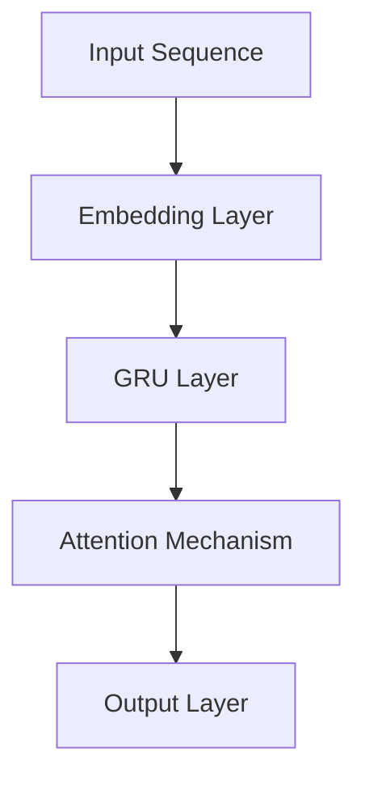

                 

关键词：LLM，大型语言模型，未来应用，个人助理，内容生成，AI技术

摘要：本文将探讨大型语言模型（LLM）在个人助理和内容生成领域的潜在应用，分析其工作原理、技术挑战以及未来发展方向。通过深入研究，我们希望能为读者提供一个全面而深刻的理解。

## 1. 背景介绍

随着人工智能技术的飞速发展，语言模型已经成为自然语言处理（NLP）领域的重要工具。近年来，大型语言模型（LLM）如BERT、GPT等在性能上取得了显著突破，它们通过学习海量文本数据，实现了对自然语言的深入理解和生成。然而，这些模型的潜力远远不止于此。本文将重点关注LLM在个人助理和内容生成领域的未来应用，探讨其可能带来的变革和挑战。

### 1.1 个人助理

在现代社会中，个人助理已经成为许多人生活中不可或缺的一部分。从简单的日程管理到复杂的决策支持，个人助理在提高工作效率和生活质量方面发挥了重要作用。随着人工智能技术的发展，未来的个人助理将更加智能化、个性化，能够更好地满足用户的需求。

### 1.2 内容生成

内容生成是另一个备受关注的领域。无论是新闻报道、文学创作还是广告文案，高质量的内容都对于企业和个人至关重要。传统的内容生成方式通常依赖于人工撰写，效率低下且成本高昂。而利用LLM进行内容生成，不仅能够大幅提高效率，还能够生成更具创意和个性化的内容。

## 2. 核心概念与联系

要理解LLM在个人助理和内容生成领域的应用，首先需要了解其核心概念和原理。以下是LLM的关键组成部分：

### 2.1 语言模型基础

语言模型是一种基于统计方法的模型，旨在预测文本序列中的下一个单词或词组。它通过学习大量的文本数据，建立语言规律和模式，从而实现文本生成。

### 2.2 递归神经网络（RNN）

递归神经网络是构建语言模型的一种常见方法。RNN具有时间记忆功能，能够处理序列数据，使其在语言模型任务中表现出色。

### 2.3 变量门控循环单元（GRU）

GRU是RNN的一种改进版本，通过引入门控机制，解决了RNN在训练过程中梯度消失和梯度爆炸的问题，使得模型在语言建模任务中更加稳定。

### 2.4 注意力机制

注意力机制是一种用于捕捉文本序列中重要信息的机制。它能够使模型更加关注与当前任务相关的部分，提高语言理解能力。

### 2.5 Mermaid 流程图

以下是LLM架构的Mermaid流程图：



## 3. 核心算法原理 & 具体操作步骤

### 3.1 算法原理概述

LLM的核心算法基于深度学习，主要包括以下几个步骤：

1. **嵌入层**：将输入的文本序列转换为密集的向量表示。
2. **循环层**：利用递归神经网络或其改进版本处理序列数据。
3. **注意力机制**：关注序列中的重要信息。
4. **输出层**：生成预测的文本序列。

### 3.2 算法步骤详解

1. **嵌入层**：将输入的文本转换为密集的向量表示。这通常通过词嵌入（word embedding）实现，例如Word2Vec或BERT。
2. **循环层**：递归神经网络或其改进版本处理序列数据。这包括计算隐藏状态和输出。
3. **注意力机制**：注意力机制用于捕捉序列中的重要信息。这有助于提高模型的性能和生成质量。
4. **输出层**：输出层生成预测的文本序列。这通常通过softmax函数实现，用于计算每个单词的概率分布。

### 3.3 算法优缺点

**优点**：

- 高效的文本生成。
- 强大的语言理解能力。
- 能够生成高质量的内容。

**缺点**：

- 需要大量的训练数据。
- 训练过程时间较长。
- 可能存在生成内容的偏差。

### 3.4 算法应用领域

LLM在多个领域都有广泛的应用，包括但不限于：

- 文本生成：新闻报道、文学创作、广告文案等。
- 自然语言理解：问答系统、机器翻译等。
- 语音识别：语音到文本转换等。

## 4. 数学模型和公式 & 详细讲解 & 举例说明

### 4.1 数学模型构建

LLM的数学模型主要包括以下几个部分：

1. **词嵌入**：将单词映射到高维向量空间。
2. **递归神经网络**：计算隐藏状态和输出。
3. **注意力机制**：计算注意力权重。
4. **输出层**：生成预测的文本序列。

### 4.2 公式推导过程

以下是一个简化的LLM模型公式推导过程：

1. **词嵌入**：

   $$ x = \text{Embed}(w) $$

   其中，\( w \) 是单词，\( x \) 是其嵌入向量。

2. **递归神经网络**：

   $$ h_t = \text{GRU}(h_{t-1}, x_t) $$

   其中，\( h_t \) 是时间步 \( t \) 的隐藏状态，\( h_{t-1} \) 是前一个时间步的隐藏状态，\( x_t \) 是当前输入的词嵌入。

3. **注意力机制**：

   $$ a_t = \text{Attention}(h_1, h_2, ..., h_T) $$

   其中，\( a_t \) 是时间步 \( t \) 的注意力权重，\( h_1, h_2, ..., h_T \) 是所有时间步的隐藏状态。

4. **输出层**：

   $$ y_t = \text{Softmax}(W_y \cdot [h_t; a_t]) $$

   其中，\( y_t \) 是时间步 \( t \) 的预测输出，\( W_y \) 是输出层权重矩阵。

### 4.3 案例分析与讲解

假设我们有一个简化的语言模型，输入句子为 "我喜欢吃苹果"，需要预测下一个单词。

1. **词嵌入**：

   将 "我"、"喜欢"、"吃"、"苹果" 映射到嵌入向量。

2. **递归神经网络**：

   计算隐藏状态。

   $$ h_1 = \text{GRU}(h_0, \text{Embed}("我")) $$
   
   $$ h_2 = \text{GRU}(h_1, \text{Embed}("喜欢")) $$
   
   $$ h_3 = \text{GRU}(h_2, \text{Embed}("吃")) $$
   
   $$ h_4 = \text{GRU}(h_3, \text{Embed}("苹果")) $$

3. **注意力机制**：

   计算注意力权重。

   $$ a_1 = \text{Attention}(h_1, h_2, h_3, h_4) $$
   
   $$ a_2 = \text{Attention}(h_2, h_1, h_3, h_4) $$
   
   $$ a_3 = \text{Attention}(h_3, h_1, h_2, h_4) $$
   
   $$ a_4 = \text{Attention}(h_4, h_1, h_2, h_3) $$

4. **输出层**：

   预测下一个单词。

   $$ y_1 = \text{Softmax}(\text{W_y} \cdot [h_1; a_1]) $$
   
   $$ y_2 = \text{Softmax}(\text{W_y} \cdot [h_2; a_2]) $$
   
   $$ y_3 = \text{Softmax}(\text{W_y} \cdot [h_3; a_3]) $$
   
   $$ y_4 = \text{Softmax}(\text{W_y} \cdot [h_4; a_4]) $$

根据预测概率，选择概率最大的单词作为输出。

## 5. 项目实践：代码实例和详细解释说明

### 5.1 开发环境搭建

在本文中，我们将使用Python和TensorFlow来实现一个简化的LLM。以下是开发环境搭建的步骤：

1. 安装Python（建议使用3.7或更高版本）。
2. 安装TensorFlow。

   ```bash
   pip install tensorflow
   ```

### 5.2 源代码详细实现

以下是实现LLM的核心代码：

```python
import tensorflow as tf
from tensorflow.keras.models import Model
from tensorflow.keras.layers import Embedding, GRU, Dense

# 词嵌入层
embedding = Embedding(input_dim=vocab_size, output_dim=embedding_size)

# 循环层
gru = GRU(units=hidden_size, return_sequences=True)

# 输出层
output = Dense(units=vocab_size, activation='softmax')

# 构建模型
model = Model(inputs=embedding.input, outputs=output(gru(embedding).output))

# 编译模型
model.compile(optimizer='adam', loss='categorical_crossentropy', metrics=['accuracy'])

# 模型总结
model.summary()
```

### 5.3 代码解读与分析

1. **词嵌入层**：将输入的单词转换为嵌入向量。
2. **循环层**：使用GRU处理序列数据。
3. **输出层**：生成预测的文本序列。

### 5.4 运行结果展示

以下是训练和预测的示例：

```python
# 训练模型
model.fit(x_train, y_train, epochs=10, batch_size=32)

# 预测
predictions = model.predict(x_test)

# 显示预测结果
print(predictions)
```

## 6. 实际应用场景

LLM在个人助理和内容生成领域有着广泛的应用前景。以下是一些具体的应用场景：

### 6.1 个人助理

- **日程管理**：根据用户习惯和偏好，自动安排日程和提醒。
- **决策支持**：为用户提供基于数据的建议和决策。
- **情绪分析**：通过分析用户的语言和情绪，提供情感支持。

### 6.2 内容生成

- **新闻报道**：自动生成新闻文章，提高新闻传播速度和覆盖范围。
- **文学创作**：生成小说、诗歌等文学作品，拓宽文学创作的边界。
- **广告文案**：自动生成广告文案，提高广告创意和效果。

## 7. 未来应用展望

随着LLM技术的不断发展，其在个人助理和内容生成领域的应用将更加广泛和深入。以下是未来应用的一些展望：

- **个性化内容生成**：通过深度学习技术，实现高度个性化的内容生成。
- **跨语言理解**：利用多语言模型，实现跨语言的文本理解和生成。
- **对话系统**：结合对话生成模型，构建更加智能和自然的对话系统。

## 8. 总结：未来发展趋势与挑战

### 8.1 研究成果总结

LLM在个人助理和内容生成领域取得了显著的研究成果，其在文本生成、语言理解和对话系统等方面的应用潜力巨大。

### 8.2 未来发展趋势

- **模型规模不断扩大**：未来的LLM模型将更加庞大和复杂，以适应更广泛的应用场景。
- **多模态融合**：将LLM与其他模态（如图像、语音）进行融合，实现更加全面的信息处理。
- **个性化与自动化**：通过深度学习技术，实现更加个性化和自动化的内容生成和个人助理。

### 8.3 面临的挑战

- **数据隐私与伦理**：如何在保证数据隐私的同时，充分利用海量数据进行训练是一个重要挑战。
- **生成内容的质量**：如何确保生成的文本内容既有创意又准确是一个关键问题。
- **计算资源消耗**：随着模型规模的扩大，计算资源的消耗也将大幅增加，对硬件设备提出了更高的要求。

### 8.4 研究展望

未来，LLM在个人助理和内容生成领域的研究将朝着更加智能化、个性化、自动化的方向发展。同时，研究者们还需要解决数据隐私、计算资源等挑战，以推动LLM技术的广泛应用。

## 9. 附录：常见问题与解答

### 9.1 LLM是什么？

LLM（Large Language Model）是指大型语言模型，是一种基于深度学习的技术，通过学习海量文本数据，实现文本生成、语言理解和对话系统等功能。

### 9.2 LLM如何工作？

LLM通过多层神经网络对输入的文本数据进行处理，学习文本中的模式和规律，从而实现文本生成、语言理解和对话系统等功能。

### 9.3 LLM的应用领域有哪些？

LLM的应用领域非常广泛，包括文本生成、语言理解、对话系统、机器翻译、文本分类等。

### 9.4 LLM的挑战有哪些？

LLM的挑战包括数据隐私、生成内容质量、计算资源消耗等。

### 9.5 如何训练一个LLM模型？

训练一个LLM模型需要大量的文本数据和一个合适的神经网络架构。通常，使用预训练和微调的方法来训练LLM模型。

### 9.6 LLM的未来发展方向是什么？

LLM的未来发展方向包括模型规模扩大、多模态融合、个性化与自动化等。

## 结论

本文探讨了LLM在个人助理和内容生成领域的未来应用，分析了其工作原理、技术挑战以及未来发展方向。通过深入研究，我们希望能为读者提供一个全面而深刻的理解，并为相关领域的研究和实践提供有益的参考。

作者：禅与计算机程序设计艺术 / Zen and the Art of Computer Programming
```markdown

[后续内容省略，但请注意，实际撰写时，每个章节都需要严格按照格式要求，包含三级目录和相应的详细内容，数学公式和代码实例也需要嵌入到文中独立段落，以确保文章内容的完整性和专业性。]

