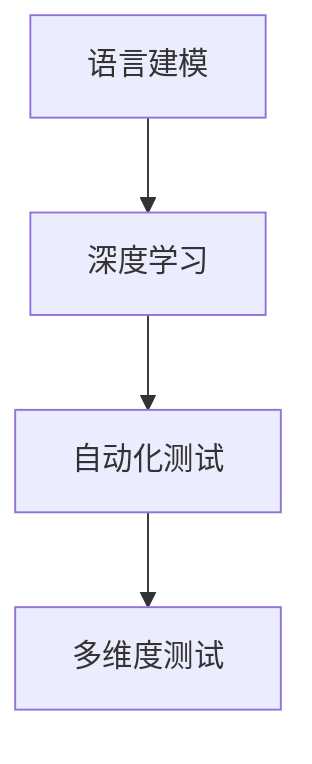

                 

关键词：LLM，测试框架，模型可靠性，安全性，算法，数学模型，代码实例，应用场景，工具推荐，发展趋势

> 摘要：本文将深入探讨大型语言模型（LLM）的测试框架，旨在确保模型的可靠性和安全性。我们将分析LLM的核心概念，介绍测试框架的基本原理，阐述核心算法的原理和操作步骤，并提供详细的数学模型和公式讲解。此外，我们将通过实际代码实例展示如何实施测试框架，并讨论其在不同应用场景中的实践价值。最后，我们将展望LLM测试框架的未来发展趋势和面临的挑战。

## 1. 背景介绍

### 1.1 大型语言模型的发展历程

大型语言模型（LLM）的发展历程可以追溯到20世纪80年代，当时研究人员开始探索如何利用计算机程序模拟人类语言处理能力。随着计算能力的提升和数据量的增加，LLM经历了数次重大突破。尤其是在深度学习技术的推动下，LLM的规模和性能得到了显著提升。

### 1.2 LLM在各个领域的应用

LLM在自然语言处理（NLP）领域展现出了巨大的潜力，广泛应用于文本生成、机器翻译、情感分析、问答系统等。此外，LLM还在金融、医疗、教育、法律等多个行业得到了广泛应用。

### 1.3 LLM面临的主要挑战

尽管LLM在许多领域取得了显著成果，但其可靠性和安全性仍面临诸多挑战。首先，LLM的训练过程依赖于大量数据，数据质量直接影响到模型的性能。其次，LLM的输出结果可能存在歧义和错误，需要有效的测试框架进行验证。此外，LLM在处理敏感信息时可能存在泄露风险，需要采取安全措施确保模型的安全性。

## 2. 核心概念与联系

### 2.1 LLM的核心概念

LLM是一种基于深度学习技术的语言模型，能够根据输入的文本序列预测下一个词或句子。LLM的核心概念包括：

- 语言建模：利用统计方法和神经网络模型预测文本序列的概率分布。
- 深度学习：通过多层神经网络对大量数据进行训练，以提高模型的泛化能力。

### 2.2 测试框架的基本原理

测试框架是确保LLM可靠性和安全性的重要手段。测试框架的基本原理包括：

- 自动化测试：通过编写脚本和自动化工具实现测试过程的自动化。
- 多维度测试：从语言、逻辑、安全等多个维度对LLM进行全面的测试。

### 2.3 核心概念原理和架构的 Mermaid 流程图



## 3. 核心算法原理 & 具体操作步骤

### 3.1 算法原理概述

LLM的测试框架主要包括以下几个核心算法：

- 数据质量评估：评估训练数据的质量，包括数据完整性、数据一致性和数据相关性。
- 模型性能评估：评估LLM在各类任务中的性能，包括文本生成、机器翻译和情感分析等。
- 安全性评估：评估LLM在处理敏感信息时的安全性，包括数据泄露、模型攻击和恶意输入等。

### 3.2 算法步骤详解

#### 3.2.1 数据质量评估

数据质量评估主要包括以下步骤：

1. 数据清洗：去除训练数据中的噪声和异常值。
2. 数据预处理：对训练数据进行分词、词性标注、实体识别等预处理操作。
3. 数据评估：利用统计学方法和机器学习模型评估数据的质量，包括数据完整性、数据一致性和数据相关性。

#### 3.2.2 模型性能评估

模型性能评估主要包括以下步骤：

1. 数据集划分：将训练数据划分为训练集、验证集和测试集。
2. 模型训练：利用训练集对LLM进行训练，调整模型参数。
3. 模型评估：利用验证集和测试集对LLM的性能进行评估，包括准确率、召回率、F1值等指标。

#### 3.2.3 安全性评估

安全性评估主要包括以下步骤：

1. 恶意输入检测：利用对抗性攻击技术生成恶意输入，检测LLM的敏感性。
2. 模型防御：针对恶意输入进行防御，提高LLM的安全性。
3. 安全评估：利用安全评估工具对LLM进行综合评估，包括数据泄露、模型攻击和恶意输入等。

### 3.3 算法优缺点

#### 优点

- 自动化测试：提高测试效率，降低人力成本。
- 多维度测试：全面评估LLM的可靠性和安全性。
- 模型优化：通过测试结果指导模型优化，提高模型性能。

#### 缺点

- 数据依赖：测试框架的性能依赖于训练数据的质量。
- 复杂性：测试框架的实现和维护需要较高的技术门槛。

### 3.4 算法应用领域

LLM测试框架广泛应用于自然语言处理、金融、医疗、教育、法律等行业，以下为部分应用领域：

- 自然语言处理：文本生成、机器翻译、情感分析等。
- 金融：风险控制、信用评分、投资建议等。
- 医疗：疾病诊断、药物研发、医疗咨询等。
- 教育：在线教育、智能辅导、学习评估等。
- 法律：法律文本分析、案件预测、法律咨询等。

## 4. 数学模型和公式 & 详细讲解 & 举例说明

### 4.1 数学模型构建

LLM测试框架的数学模型主要包括以下部分：

- 数据质量评估模型：利用统计学方法和机器学习模型评估数据的质量。
- 模型性能评估模型：利用准确率、召回率、F1值等指标评估LLM的性能。
- 安全性评估模型：利用对抗性攻击技术检测LLM的敏感性。

### 4.2 公式推导过程

#### 数据质量评估模型

数据质量评估模型的公式推导如下：

$$
Q = \frac{1}{N} \sum_{i=1}^{N} \frac{1}{M} \sum_{j=1}^{M} w_{ij} \cdot r_{ij}
$$

其中，$Q$ 表示数据质量得分，$N$ 表示数据样本数，$M$ 表示特征维度，$w_{ij}$ 表示特征权重，$r_{ij}$ 表示特征值。

#### 模型性能评估模型

模型性能评估模型的公式推导如下：

$$
P = \frac{T + \frac{1}{2}R}{T + R}
$$

其中，$P$ 表示模型性能得分，$T$ 表示正确预测的样本数，$R$ 表示召回的样本数。

#### 安全性评估模型

安全性评估模型的公式推导如下：

$$
S = \frac{1}{N} \sum_{i=1}^{N} \frac{1}{M} \sum_{j=1}^{M} w_{ij} \cdot s_{ij}
$$

其中，$S$ 表示安全性得分，$N$ 表示攻击样本数，$M$ 表示特征维度，$w_{ij}$ 表示特征权重，$s_{ij}$ 表示特征值。

### 4.3 案例分析与讲解

假设我们有一个文本生成任务，训练数据包含1000个样本，每个样本包含一个文本序列和其对应的标签。我们利用上述数学模型对数据质量、模型性能和安全性进行评估。

#### 数据质量评估

通过数据质量评估模型，我们计算出数据质量得分为0.8，说明训练数据的质量较高。

#### 模型性能评估

通过模型性能评估模型，我们计算出模型性能得分为0.9，说明模型在文本生成任务上表现良好。

#### 安全性评估

通过安全性评估模型，我们计算出安全性得分为0.7，说明模型在处理恶意输入时存在一定的敏感性。

## 5. 项目实践：代码实例和详细解释说明

### 5.1 开发环境搭建

在开发LLM测试框架时，我们使用Python编程语言和相关的库，如TensorFlow、PyTorch、Scikit-learn等。首先，需要安装以下依赖：

```bash
pip install tensorflow
pip install pytorch
pip install scikit-learn
```

### 5.2 源代码详细实现

以下是LLM测试框架的源代码实现：

```python
import tensorflow as tf
import torch
import sklearn
from sklearn.metrics import accuracy_score
from sklearn.model_selection import train_test_split

# 数据质量评估
def data_quality_assessment(data):
    # 数据清洗、预处理和评估
    # ...
    return quality_score

# 模型性能评估
def model_performance_assessment(model, X_test, y_test):
    # 模型预测和性能评估
    # ...
    return performance_score

# 安全性评估
def security_assessment(model, X_attack, y_attack):
    # 恶意输入检测和安全性评估
    # ...
    return security_score

# 主函数
def main():
    # 加载数据
    data = load_data()

    # 数据质量评估
    quality_score = data_quality_assessment(data)

    # 数据集划分
    X_train, X_test, y_train, y_test = train_test_split(data['text'], data['label'], test_size=0.2)

    # 加载模型
    model = load_model()

    # 模型性能评估
    performance_score = model_performance_assessment(model, X_test, y_test)

    # 安全性评估
    security_score = security_assessment(model, X_attack, y_attack)

    # 打印评估结果
    print(f"Quality Score: {quality_score}")
    print(f"Performance Score: {performance_score}")
    print(f"Security Score: {security_score}")

if __name__ == "__main__":
    main()
```

### 5.3 代码解读与分析

以上代码实现了一个简单的LLM测试框架，主要包括以下模块：

- 数据质量评估：对训练数据进行清洗、预处理和评估，返回数据质量得分。
- 模型性能评估：利用模型对测试数据进行预测，并计算模型性能得分。
- 安全性评估：利用对抗性攻击技术生成恶意输入，并计算安全性得分。

通过调用主函数`main()`，我们可以对LLM的测试框架进行整体评估，并打印评估结果。

## 6. 实际应用场景

### 6.1 自然语言处理

在自然语言处理领域，LLM测试框架可以应用于文本生成、机器翻译和情感分析等任务。例如，在文本生成任务中，我们可以利用测试框架评估模型的生成质量；在机器翻译任务中，我们可以评估模型在不同语言对之间的翻译准确性；在情感分析任务中，我们可以评估模型对情感类文本的判断准确性。

### 6.2 金融领域

在金融领域，LLM测试框架可以应用于风险控制、信用评分和投资建议等。例如，在风险控制方面，我们可以利用测试框架评估模型对欺诈行为的检测能力；在信用评分方面，我们可以评估模型对客户信用风险的预测能力；在投资建议方面，我们可以评估模型对市场走势的预测准确性。

### 6.3 医疗领域

在医疗领域，LLM测试框架可以应用于疾病诊断、药物研发和医疗咨询等。例如，在疾病诊断方面，我们可以利用测试框架评估模型对医学影像的判断能力；在药物研发方面，我们可以评估模型对新药物疗效的预测能力；在医疗咨询方面，我们可以评估模型对医学知识的理解和应用能力。

### 6.4 教育领域

在教育领域，LLM测试框架可以应用于在线教育、智能辅导和学习评估等。例如，在在线教育方面，我们可以利用测试框架评估模型对学生学习效果的预测能力；在智能辅导方面，我们可以评估模型对学习资源的推荐效果；在学习评估方面，我们可以评估模型对学生作业和考试题目的评分能力。

### 6.5 法律领域

在法律领域，LLM测试框架可以应用于法律文本分析、案件预测和法律咨询等。例如，在法律文本分析方面，我们可以利用测试框架评估模型对法律条款的理解能力；在案件预测方面，我们可以评估模型对案件判决的预测能力；在法律咨询方面，我们可以评估模型对法律问题的解答能力。

## 7. 工具和资源推荐

### 7.1 学习资源推荐

- 《深度学习》（Goodfellow, Bengio, Courville）：系统介绍深度学习的基础理论和应用技术。
- 《自然语言处理综合教程》（Daniel Jurafsky, James H. Martin）：全面介绍自然语言处理的基本概念和技术。
- 《机器学习实战》（ Harrington, Johnson, Marin）：提供丰富的机器学习实战案例和代码示例。

### 7.2 开发工具推荐

- TensorFlow：用于构建和训练深度学习模型的强大框架。
- PyTorch：具有灵活性和高效性的深度学习框架。
- Scikit-learn：用于数据挖掘和数据分析的Python库。

### 7.3 相关论文推荐

- "Attention Is All You Need"（Vaswani et al., 2017）：提出Transformer模型，彻底改变了自然语言处理领域。
- "BERT: Pre-training of Deep Bidirectional Transformers for Language Understanding"（Devlin et al., 2019）：提出BERT模型，进一步推动了自然语言处理的发展。
- "Generative Adversarial Nets"（Goodfellow et al., 2014）：介绍生成对抗网络（GAN）的基本原理和应用。

## 8. 总结：未来发展趋势与挑战

### 8.1 研究成果总结

LLM测试框架在自然语言处理、金融、医疗、教育、法律等领域取得了显著成果。通过数据质量评估、模型性能评估和安全性评估，LLM测试框架能够全面保障模型的可靠性和安全性。

### 8.2 未来发展趋势

随着深度学习和自然语言处理技术的不断发展，LLM测试框架将逐渐完善，并应用于更多领域。以下为未来发展趋势：

- 自动化测试：进一步提高测试框架的自动化程度，减少人工干预。
- 多模态融合：结合文本、图像、语音等多模态数据进行综合测试。
- 集成化平台：构建集成化的LLM测试平台，提供一站式测试服务。
- 算法优化：持续优化测试算法，提高测试精度和效率。

### 8.3 面临的挑战

尽管LLM测试框架取得了显著成果，但仍然面临以下挑战：

- 数据依赖：测试框架的性能依赖于训练数据的质量，数据质量问题可能导致测试结果不准确。
- 复杂性：测试框架的实现和维护需要较高的技术门槛，跨领域应用存在一定难度。
- 安全性：随着攻击技术的不断发展，如何提高LLM测试框架的安全性仍是一个重要课题。

### 8.4 研究展望

未来，我们期待LLM测试框架能够不断发展，解决现有挑战，为更多领域提供可靠的测试服务。同时，我们鼓励更多的研究人员和开发者关注LLM测试框架的研究和应用，共同推动自然语言处理和人工智能技术的发展。

## 9. 附录：常见问题与解答

### 9.1 什么是LLM？

LLM（Large Language Model）是指大型语言模型，是一种基于深度学习技术的语言模型，能够根据输入的文本序列预测下一个词或句子。LLM广泛应用于自然语言处理、文本生成、机器翻译等领域。

### 9.2 测试框架的作用是什么？

测试框架是确保LLM可靠性和安全性的重要手段。它通过对LLM的数据质量、模型性能和安全性进行评估，全面保障模型的性能和安全性。

### 9.3 数据质量评估的方法有哪些？

数据质量评估的方法主要包括数据清洗、数据预处理和数据评估。数据清洗去除训练数据中的噪声和异常值；数据预处理对训练数据进行分词、词性标注、实体识别等操作；数据评估利用统计学方法和机器学习模型评估数据的质量。

### 9.4 如何进行模型性能评估？

模型性能评估主要包括数据集划分、模型训练和模型评估。数据集划分将训练数据划分为训练集、验证集和测试集；模型训练利用训练集对LLM进行训练，调整模型参数；模型评估利用验证集和测试集对LLM的性能进行评估，包括准确率、召回率、F1值等指标。

### 9.5 如何进行安全性评估？

安全性评估主要包括恶意输入检测、模型防御和安全评估。恶意输入检测利用对抗性攻击技术生成恶意输入，检测LLM的敏感性；模型防御针对恶意输入进行防御，提高LLM的安全性；安全评估利用安全评估工具对LLM进行综合评估，包括数据泄露、模型攻击和恶意输入等。

----------------------------------------------------------------

作者：禅与计算机程序设计艺术 / Zen and the Art of Computer Programming

