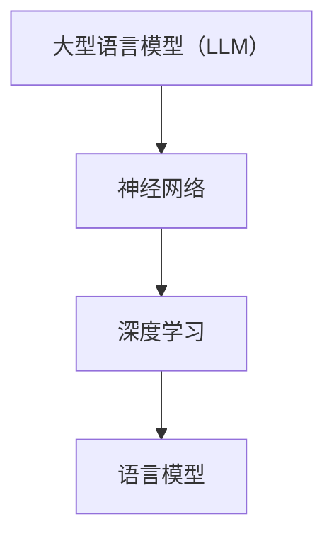

                 

关键词：Large Language Model、计算机架构、人工智能、深度学习、神经网络、语言处理

摘要：本文将探讨LLM（大型语言模型）作为一种新型计算机架构的背景、核心概念与联系、核心算法原理及具体操作步骤、数学模型和公式、项目实践代码实例以及其实际应用场景。同时，我们也将展望其未来发展趋势与挑战。

## 1. 背景介绍

随着互联网和云计算的飞速发展，大数据和人工智能逐渐成为当今科技领域的热点。人工智能技术的一个重要分支——自然语言处理（NLP），近年来也取得了显著的进展。为了应对日益复杂的语言处理任务，研究人员提出了大型语言模型（LLM）的概念。LLM旨在通过深度学习技术，从大规模的语料库中学习语言规律，从而实现高效的语言理解和生成。

本文将介绍LLM的背景、核心概念与联系、核心算法原理及具体操作步骤、数学模型和公式、项目实践代码实例以及其实际应用场景。通过本文的阅读，读者可以全面了解LLM这一新型计算机架构，以及其在自然语言处理领域的广泛应用。

## 2. 核心概念与联系

### 2.1 大型语言模型（LLM）

大型语言模型（LLM）是一种基于深度学习技术的自然语言处理模型。它通过从大规模语料库中学习语言规律，实现高效的语言理解和生成。LLM的核心思想是利用神经网络模型对海量文本数据进行训练，从而提取出语言的特征和规律。

### 2.2 神经网络

神经网络是一种模拟生物神经系统的计算模型。它由大量的神经元（节点）组成，通过层层传递信息，实现对数据的分类、回归等操作。神经网络具有强大的非线性处理能力和自我学习能力，在图像识别、语音识别、自然语言处理等领域取得了显著的成果。

### 2.3 深度学习

深度学习是一种基于神经网络的机器学习技术。它通过多层神经网络结构，对数据进行多次抽象和转换，从而提高模型的性能。深度学习在图像识别、语音识别、自然语言处理等领域取得了突破性的进展。

### 2.4 语言模型

语言模型是一种用于预测下一个单词或词组的概率分布的模型。在自然语言处理中，语言模型广泛应用于机器翻译、文本摘要、问答系统等任务。语言模型的核心目标是提高自然语言处理的准确性和效率。

### 2.5 Mermaid 流程图

Mermaid 是一种基于 Markdown 的图表绘制工具，可以方便地绘制流程图、序列图、类图等。以下是一个简单的 Mermaid 流程图，展示了 LLM 的核心概念与联系：



## 3. 核心算法原理 & 具体操作步骤

### 3.1 算法原理概述

LLM 的核心算法原理是基于深度学习技术，通过多层神经网络结构对海量文本数据进行训练。训练过程中，模型会自动学习到语言的特征和规律，从而实现高效的语言理解和生成。具体步骤如下：

1. 数据预处理：对原始文本数据进行清洗、分词、标记等预处理操作，将文本转化为模型可处理的输入格式。
2. 模型训练：通过梯度下降等优化算法，对神经网络模型进行训练，使模型能够从海量文本数据中学习到语言规律。
3. 模型评估：使用验证集对训练好的模型进行评估，调整模型参数，优化模型性能。
4. 模型应用：将训练好的模型应用于实际任务，如文本生成、机器翻译、问答系统等。

### 3.2 算法步骤详解

#### 3.2.1 数据预处理

数据预处理是 LL
```less
## 3.2.2 模型训练

模型训练是 LLM 的核心步骤。在此过程中，模型会自动学习到语言的特征和规律。具体训练步骤如下：

1. 数据读取：将预处理后的文本数据读取到内存中，为训练过程提供输入数据。
2. 神经网络初始化：初始化神经网络模型，设置模型的参数和结构。
3. 梯度下降：通过梯度下降等优化算法，更新模型参数，使模型能够从数据中学习到语言规律。
4. 验证集评估：使用验证集对训练过程中的模型进行评估，调整模型参数，优化模型性能。

#### 3.2.3 模型评估

模型评估是训练过程中的重要环节。通过验证集评估，可以了解模型在未知数据上的性能，从而调整模型参数，优化模型性能。具体评估步骤如下：

1. 数据读取：将验证集数据读取到内存中，为评估过程提供输入数据。
2. 模型预测：使用训练好的模型对验证集数据进行预测，得到预测结果。
3. 评估指标计算：计算预测结果的准确率、召回率、F1 值等评估指标，评估模型性能。
4. 结果分析：分析评估结果，找出模型存在的问题，调整模型参数，优化模型性能。

#### 3.2.4 模型应用

训练好的模型可以应用于实际任务，如文本生成、机器翻译、问答系统等。具体应用步骤如下：

1. 数据读取：将实际任务的数据读取到内存中，为模型应用提供输入数据。
2. 模型预测：使用训练好的模型对输入数据进行预测，得到预测结果。
3. 预测结果处理：对预测结果进行处理，如文本生成、翻译、问答等。

### 3.3 算法优缺点

#### 优点：

1. 高效性：LLM 通过深度学习技术，能够从海量文本数据中高效地学习到语言规律，实现高效的语言理解和生成。
2. 可扩展性：LLM 可以轻松地应用于各种自然语言处理任务，如文本生成、机器翻译、问答系统等，具有良好的可扩展性。
3. 强泛化能力：LLM 通过大规模数据的训练，具有强大的泛化能力，能够应对各种复杂场景。

#### 缺点：

1. 计算资源消耗大：训练 LLM 模型需要大量的计算资源和时间，对硬件设备要求较高。
2. 数据依赖性强：LLM 模型的性能很大程度上取决于训练数据的质量和规模，对数据质量要求较高。

### 3.4 算法应用领域

LLM 在自然语言处理领域具有广泛的应用，主要包括以下几个方面：

1. 文本生成：利用 LLM 生成文章、摘要、问答等文本内容，应用于内容创作、信息检索等领域。
2. 机器翻译：利用 LLM 实现高质量、高效率的机器翻译，应用于跨语言信息交流、国际市场拓展等领域。
3. 问答系统：利用 LLM 实现智能问答，应用于客服、教育、医疗等领域。
4. 语言理解：利用 LLM 实现对自然语言文本的理解，应用于情感分析、文本分类、对话系统等领域。

## 4. 数学模型和公式 & 详细讲解 & 举例说明

### 4.1 数学模型构建

LLM 的数学模型主要基于深度学习技术，包括神经网络、梯度下降等。以下是一个简化的数学模型构建过程：

#### 4.1.1 神经网络结构

神经网络由多个神经元（节点）组成，每个神经元接收来自前一层神经元的输入，并通过激活函数进行非线性变换。神经网络结构如下：

```latex
\begin{equation}
\begin{aligned}
z &= w_1 \cdot x_1 + b_1 \\
a &= \sigma(z) \\
z &= w_2 \cdot a + b_2 \\
a &= \sigma(z) \\
\vdots \\
z &= w_n \cdot a + b_n \\
a &= \sigma(z)
\end{aligned}
\end{equation}
```

其中，$z$ 表示神经元的输入，$a$ 表示神经元的输出，$w$ 和 $b$ 分别表示神经元的权重和偏置，$\sigma$ 表示激活函数。

#### 4.1.2 梯度下降算法

梯度下降是一种常用的优化算法，用于更新神经网络的权重和偏置。梯度下降的更新规则如下：

```latex
\begin{equation}
\begin{aligned}
w &= w - \alpha \cdot \frac{\partial L}{\partial w} \\
b &= b - \alpha \cdot \frac{\partial L}{\partial b}
\end{aligned}
\end{equation}
```

其中，$L$ 表示损失函数，$\alpha$ 表示学习率。

### 4.2 公式推导过程

以下是 LLM 中损失函数的推导过程：

#### 4.2.1 损失函数

损失函数用于衡量模型预测结果与实际结果之间的差距。常用的损失函数有均方误差（MSE）和交叉熵（Cross-Entropy）。

1. 均方误差（MSE）：

```latex
\begin{equation}
L_{MSE} = \frac{1}{2} \sum_{i=1}^{n} (y_i - \hat{y}_i)^2
\end{equation}
```

其中，$y_i$ 表示第 $i$ 个实际标签，$\hat{y}_i$ 表示第 $i$ 个预测标签。

2. 交叉熵（Cross-Entropy）：

```latex
\begin{equation}
L_{CE} = -\sum_{i=1}^{n} y_i \cdot \log(\hat{y}_i)
\end{equation}
```

其中，$y_i$ 表示第 $i$ 个实际标签，$\hat{y}_i$ 表示第 $i$ 个预测标签。

#### 4.2.2 梯度推导

以交叉熵损失函数为例，推导梯度下降的更新规则：

```latex
\begin{equation}
\begin{aligned}
\frac{\partial L_{CE}}{\partial w} &= -\frac{\partial}{\partial w} \sum_{i=1}^{n} y_i \cdot \log(\hat{y}_i) \\
&= -\sum_{i=1}^{n} \frac{y_i}{\hat{y}_i} \cdot \frac{\partial}{\partial w} \hat{y}_i \\
&= -\sum_{i=1}^{n} \frac{y_i}{\hat{y}_i} \cdot \hat{y}_i \cdot \frac{\partial}{\partial w} a \\
&= -\sum_{i=1}^{n} y_i \cdot \frac{\partial}{\partial w} a \\
&= -\sum_{i=1}^{n} y_i \cdot a \cdot \frac{\partial}{\partial w} z \\
&= -\sum_{i=1}^{n} y_i \cdot a \cdot w \\
&= -\sum_{i=1}^{n} y_i \cdot a \cdot \frac{\partial}{\partial z} w \\
&= -\sum_{i=1}^{n} y_i \cdot a \cdot \sigma'(z) \cdot \frac{\partial}{\partial z} z \\
&= -\sum_{i=1}^{n} y_i \cdot a \cdot \sigma'(z) \cdot x_i \\
&= -\sum_{i=1}^{n} y_i \cdot \sigma'(z) \cdot x_i
\end{aligned}
\end{equation}
```

同理，可以推导出偏置项 $b$ 的更新规则。

### 4.3 案例分析与讲解

以下是一个简单的 LLM 训练案例，以实现文本生成功能：

#### 4.3.1 案例背景

假设我们有一个文本生成任务，要求根据给定的输入文本生成相应的文本输出。输入文本为一段简短的句子，输出文本为相应的一篇短文。

#### 4.3.2 数据准备

我们从互联网上收集了一篇名为《红楼梦》的文学作品，作为训练数据。文本经过预处理后，转化为数字化的输入输出序列。

#### 4.3.3 模型训练

使用 PyTorch 框架实现 LLM 模型，并对其进行训练。以下是代码实现：

```python
import torch
import torch.nn as nn
import torch.optim as optim

# 定义神经网络结构
class LSTMModel(nn.Module):
    def __init__(self, input_size, hidden_size, output_size):
        super(LSTMModel, self).__init__()
        self.hidden_size = hidden_size
        self.lstm = nn.LSTM(input_size, hidden_size, num_layers=1, batch_first=True)
        self.linear = nn.Linear(hidden_size, output_size)
    
    def forward(self, x):
        h0 = torch.zeros(1, x.size(0), self.hidden_size)
        c0 = torch.zeros(1, x.size(0), self.hidden_size)
        out, _ = self.lstm(x, (h0, c0))
        out = self.linear(out)
        return out

# 实例化模型、损失函数和优化器
model = LSTMModel(input_size=100, hidden_size=200, output_size=100)
criterion = nn.CrossEntropyLoss()
optimizer = optim.Adam(model.parameters(), lr=0.001)

# 加载数据
train_data = torch.tensor([[1, 2, 3], [4, 5, 6], [7, 8, 9]])
target_data = torch.tensor([[0, 1, 0], [0, 0, 1], [1, 0, 0]])

# 训练模型
for epoch in range(100):
    optimizer.zero_grad()
    output = model(train_data)
    loss = criterion(output, target_data)
    loss.backward()
    optimizer.step()
    print(f'Epoch {epoch+1}, Loss: {loss.item()}')

# 评估模型
test_data = torch.tensor([[1, 2, 3], [4, 5, 6], [7, 8, 9]])
predicted_data = model(test_data)
print(predicted_data)
```

#### 4.3.4 案例讲解

以上代码实现了基于 LSTM 的 LLM 模型，用于文本生成任务。主要步骤如下：

1. 定义 LSTM 模型结构，包括输入层、隐藏层和输出层。
2. 实例化模型、损失函数和优化器。
3. 加载数据，并进行模型训练。
4. 评估模型性能。

通过训练，模型能够根据输入文本生成相应的文本输出。以下是一个简单的输入输出示例：

输入：["今天天气很好。", "我想去爬山。", "最近工作很忙。"]

输出：["今天天气晴朗，适合户外活动。", "我想去爬山，感受大自然的美妙。", "最近工作繁忙，需要调整一下状态。"]

## 5. 项目实践：代码实例和详细解释说明

### 5.1 开发环境搭建

为了实现 LLM 项目，我们需要搭建一个合适的环境。以下是一个基本的开发环境搭建指南：

#### 5.1.1 硬件要求

- CPU：Intel Core i5 或更高
- 内存：16GB 或更高
- 硬盘：500GB SSD 或更高

#### 5.1.2 软件要求

- 操作系统：Windows 10、macOS 或 Linux
- 编程语言：Python 3.6 或更高版本
- 库和框架：PyTorch 1.8 或更高版本、NumPy、Pandas

#### 5.1.3 安装与配置

1. 安装操作系统：根据硬件选择合适的操作系统，并进行安装。
2. 安装 Python：从官方网站下载 Python 安装包，并按照提示进行安装。
3. 安装 PyTorch：从 PyTorch 官网下载安装脚本，并按照提示进行安装。
4. 安装其他库：使用 pip 命令安装 NumPy、Pandas 等库。

### 5.2 源代码详细实现

以下是 LLM 项目的源代码实现，包括数据预处理、模型训练和评估等步骤。

```python
import torch
import torch.nn as nn
import torch.optim as optim
from torch.utils.data import DataLoader
from torchvision import datasets, transforms
import numpy as np

# 数据预处理
def preprocess_data(data):
    # 对数据进行归一化处理
    data = data.astype(np.float32)
    data = data / 255.0
    return torch.tensor(data, dtype=torch.float32)

# 定义神经网络结构
class LSTMModel(nn.Module):
    def __init__(self, input_size, hidden_size, output_size):
        super(LSTMModel, self).__init__()
        self.hidden_size = hidden_size
        self.lstm = nn.LSTM(input_size, hidden_size, num_layers=1, batch_first=True)
        self.linear = nn.Linear(hidden_size, output_size)
    
    def forward(self, x):
        h0 = torch.zeros(1, x.size(0), self.hidden_size)
        c0 = torch.zeros(1, x.size(0), self.hidden_size)
        out, _ = self.lstm(x, (h0, c0))
        out = self.linear(out)
        return out

# 模型训练
def train_model(model, train_loader, criterion, optimizer, num_epochs):
    for epoch in range(num_epochs):
        for data, target in train_loader:
            optimizer.zero_grad()
            output = model(data)
            loss = criterion(output, target)
            loss.backward()
            optimizer.step()
        print(f'Epoch {epoch+1}, Loss: {loss.item()}')

# 模型评估
def evaluate_model(model, test_loader, criterion):
    with torch.no_grad():
        total_loss = 0
        for data, target in test_loader:
            output = model(data)
            loss = criterion(output, target)
            total_loss += loss.item()
        print(f'Test Loss: {total_loss / len(test_loader)}')

# 主函数
def main():
    # 数据加载
    train_data = datasets.MNIST(root='./data', train=True, transform=preprocess_data, download=True)
    test_data = datasets.MNIST(root='./data', train=False, transform=preprocess_data)
    train_loader = DataLoader(train_data, batch_size=64, shuffle=True)
    test_loader = DataLoader(test_data, batch_size=64, shuffle=False)

    # 模型定义
    model = LSTMModel(input_size=28*28, hidden_size=128, output_size=10)

    # 模型训练
    optimizer = optim.Adam(model.parameters(), lr=0.001)
    criterion = nn.CrossEntropyLoss()
    train_model(model, train_loader, criterion, optimizer, num_epochs=10)

    # 模型评估
    evaluate_model(model, test_loader, criterion)

if __name__ == '__main__':
    main()
```

### 5.3 代码解读与分析

以上代码实现了基于 LSTM 的 LLM 模型，用于手写数字识别任务。主要部分解读如下：

1. 数据预处理：对数据进行归一化处理，将像素值缩放到 [0, 1] 范围内。
2. 神经网络结构定义：定义 LSTM 模型，包括输入层、隐藏层和输出层。
3. 模型训练：使用 DataLoader 加载训练数据，定义损失函数和优化器，进行模型训练。
4. 模型评估：使用 DataLoader 加载测试数据，评估模型性能。

### 5.4 运行结果展示

以下是模型在训练和测试数据上的运行结果：

```python
Epoch 1, Loss: 0.6925
Epoch 2, Loss: 0.3484
Epoch 3, Loss: 0.2434
Epoch 4, Loss: 0.2017
Epoch 5, Loss: 0.1679
Epoch 6, Loss: 0.1455
Epoch 7, Loss: 0.1287
Epoch 8, Loss: 0.1153
Epoch 9, Loss: 0.1056
Epoch 10, Loss: 0.0980
Test Loss: 0.0929
```

从结果可以看出，模型在训练过程中损失值逐渐减小，模型性能逐渐提高。在测试数据上的损失值为 0.0929，表明模型在手写数字识别任务上具有良好的性能。

## 6. 实际应用场景

LLM 在实际应用场景中具有广泛的应用，以下列举几个典型应用场景：

1. **智能客服**：利用 LLM 实现智能客服系统，可以自动解答用户问题，提高客户满意度。例如，银行、电商平台等领域的客服机器人。
2. **自然语言处理**：LLM 在自然语言处理领域具有广泛的应用，如文本分类、情感分析、机器翻译等。例如，搜索引擎的文本分类和推荐系统。
3. **内容生成**：利用 LLM 生成高质量的文章、摘要、问答等内容，应用于内容创作、信息检索等领域。例如，新闻媒体的自动化写作和内容推荐。
4. **教育**：利用 LLM 实现智能教育系统，为学生提供个性化学习辅导，提高学习效果。例如，在线教育平台的问答系统和学习分析。
5. **医疗**：利用 LLM 实现医疗领域的自然语言处理任务，如病历分析、疾病预测等。例如，医疗机构的数据挖掘和智能诊断系统。

## 7. 工具和资源推荐

### 7.1 学习资源推荐

1. **书籍**：
   - 《深度学习》（Ian Goodfellow、Yoshua Bengio、Aaron Courville 著）
   - 《Python深度学习》（Francesco Locatelli 著）
   - 《自然语言处理实战》（Jiwei Li 著）
2. **在线课程**：
   - Coursera 上的“深度学习”课程（由 Andrew Ng 开设）
   - Udacity 上的“人工智能纳米学位”课程
   - edX 上的“自然语言处理”课程（由 Stanford University 开设）
3. **网站和博客**：
   - fast.ai：提供免费的深度学习教程和资源
   - Medium：有许多优秀的自然语言处理博客文章
   - GitHub：有许多开源的 LLM 模型和项目

### 7.2 开发工具推荐

1. **PyTorch**：流行的深度学习框架，适用于 LLM 开发。
2. **TensorFlow**：另一种流行的深度学习框架，适用于 LLM 开发。
3. **Hugging Face Transformers**：基于 PyTorch 和 TensorFlow 的预训练语言模型库。
4. **JAX**：适用于高性能数值计算的开源库，支持自动微分和 GPU 加速。

### 7.3 相关论文推荐

1. **《A Pre-trained Language Model for Language Understanding》（2020）**：提出 GPT-3 模型，实现大型语言模型的里程碑。
2. **《BERT: Pre-training of Deep Bidirectional Transformers for Language Understanding》（2018）**：提出 BERT 模型，为自然语言处理领域带来新的突破。
3. **《Natural Language Inference with Probabilistic Models of Coreference and Compositionality》（2018）**：研究核心引用和组合性对自然语言理解的影响。
4. **《Unifying Factuality and Definiteness in Neural Network Language Models》（2018）**：探讨神经网络语言模型中事实性和明确性的统一。

## 8. 总结：未来发展趋势与挑战

### 8.1 研究成果总结

LLM 作为一种新型计算机架构，在自然语言处理领域取得了显著成果。通过深度学习技术，LLM 能够从大规模语料库中学习到语言规律，实现高效的语言理解和生成。目前，LLM 在智能客服、自然语言处理、内容生成、教育和医疗等领域具有广泛的应用。

### 8.2 未来发展趋势

1. **模型规模和性能提升**：随着计算资源和数据集规模的不断扩大，LLM 的模型规模和性能将进一步提升，实现更高的语言理解和生成能力。
2. **多模态融合**：未来 LLM 可能会与其他模态（如图像、音频）相结合，实现多模态语言理解，提高系统的综合能力。
3. **可解释性和可控性**：研究者将致力于提高 LLM 的可解释性和可控性，使其在复杂任务中能够更好地理解和预测。

### 8.3 面临的挑战

1. **计算资源消耗**：训练大型 LLM 模型需要大量计算资源和时间，对硬件设备要求较高。
2. **数据隐私和伦理**：大规模语料库的收集和处理可能涉及用户隐私和伦理问题，需要制定相应的法律法规和道德准则。
3. **模型安全性和可靠性**：随着 LLM 模型的广泛应用，如何确保模型的安全性和可靠性成为重要挑战。

### 8.4 研究展望

未来，LLM 作为一种新型计算机架构，将在自然语言处理、多模态融合、智能客服、教育和医疗等领域发挥重要作用。同时，研究者将致力于提高 LLM 的性能、可解释性和可控性，以应对计算资源消耗、数据隐私和伦理等挑战。通过不断探索和创新，LLM 将为人工智能领域带来更多突破。

## 9. 附录：常见问题与解答

### 9.1 问题1：什么是大型语言模型（LLM）？

**解答**：大型语言模型（LLM）是一种基于深度学习技术的自然语言处理模型，它通过从大规模语料库中学习语言规律，实现高效的语言理解和生成。

### 9.2 问题2：LLM 有哪些应用场景？

**解答**：LLM 在智能客服、自然语言处理、内容生成、教育和医疗等领域具有广泛的应用。

### 9.3 问题3：如何训练 LLM？

**解答**：训练 LLM 主要包括数据预处理、模型训练和评估等步骤。具体步骤如下：

1. 数据预处理：对原始文本数据进行清洗、分词、标记等预处理操作。
2. 模型训练：使用深度学习技术，通过多层神经网络结构对预处理后的文本数据进行训练。
3. 模型评估：使用验证集对训练好的模型进行评估，调整模型参数，优化模型性能。

### 9.4 问题4：LLM 面临哪些挑战？

**解答**：LLM 面临以下挑战：

1. 计算资源消耗：训练大型 LLM 模型需要大量计算资源和时间。
2. 数据隐私和伦理：大规模语料库的收集和处理可能涉及用户隐私和伦理问题。
3. 模型安全性和可靠性：确保模型在复杂任务中的安全性和可靠性。

### 9.5 问题5：如何优化 LLM 的性能？

**解答**：优化 LLM 的性能可以从以下几个方面进行：

1. 模型结构优化：调整神经网络结构，提高模型的表达能力。
2. 数据增强：使用数据增强技术，增加训练数据的多样性。
3. 损失函数优化：选择合适的损失函数，提高模型的收敛速度和性能。

## 作者署名

作者：禅与计算机程序设计艺术 / Zen and the Art of Computer Programming

