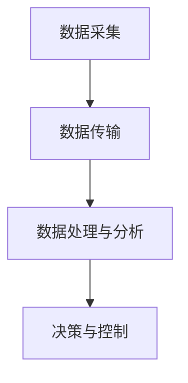

                 

关键词：语言模型、物联网、智能设备、人工智能、边缘计算、云计算、数据处理、实时决策

> 摘要：随着物联网技术的快速发展，将语言模型（LLM）与物联网（IoT）结合成为了一个热门的研究方向。本文首先介绍了语言模型和物联网的基本概念，然后探讨了两者结合的潜在优势、面临的挑战以及未来的发展趋势。文章通过实际案例展示了LLM与IoT结合的应用场景，并提出了相关的开发工具和资源推荐。最后，总结了研究现状，展望了未来的发展方向和面临的挑战。

## 1. 背景介绍

### 1.1 物联网（IoT）

物联网是指通过各种信息传感设备，将各种物品与网络相连接，实现智能化识别、定位、追踪、监控和管理的一种网络。物联网技术涵盖了传感器技术、网络通信技术、数据处理技术等多个领域。自2010年以来，物联网技术取得了迅速发展，其应用领域也从简单的智能家居、智能城市扩展到工业4.0、智能交通、智能医疗等多个方面。

### 1.2 语言模型（LLM）

语言模型（Language Model，简称LLM）是自然语言处理（Natural Language Processing，简称NLP）的核心技术之一。它通过统计学习的方法，根据大规模语料库中的词语关系，预测下一个词语的概率分布。近年来，深度学习技术的发展使得神经网络语言模型（如BERT、GPT等）取得了显著的性能提升，大大提高了自然语言处理任务的准确性。

## 2. 核心概念与联系

### 2.1 物联网与语言模型的关系

物联网设备和传感器采集的海量数据需要通过语言模型进行处理和分析，从而实现对设备的智能控制和实时决策。语言模型可以帮助物联网设备理解和处理自然语言，从而提高其交互能力和智能化水平。

### 2.2 物联网与语言模型结合的架构

物联网与语言模型结合的架构可以分为以下几个层次：

1. **数据采集与传输**：传感器和设备采集数据，并通过无线网络传输到边缘计算或云计算平台。
2. **数据处理与分析**：在边缘计算或云计算平台上，语言模型对数据进行处理和分析，提取有用的信息。
3. **决策与控制**：基于分析结果，系统做出实时决策，控制物联网设备的运行。

以下是物联网与语言模型结合的 Mermaid 流程图：



## 3. 核心算法原理 & 具体操作步骤

### 3.1 算法原理概述

物联网与语言模型结合的核心算法主要包括数据预处理、语言模型训练、模型部署和实时交互等步骤。其中，数据预处理和语言模型训练是关键步骤，直接影响到系统的性能和准确性。

### 3.2 算法步骤详解

1. **数据预处理**：对采集到的数据进行清洗、去噪和格式化，使其符合语言模型的输入要求。
2. **语言模型训练**：使用预处理后的数据训练神经网络语言模型，如BERT或GPT等。
3. **模型部署**：将训练好的模型部署到边缘计算或云计算平台上，以实现实时数据处理和分析。
4. **实时交互**：物联网设备与语言模型进行实时交互，实现智能控制和决策。

### 3.3 算法优缺点

#### 优点

- **高效处理海量数据**：语言模型可以高效地对物联网设备采集的海量数据进行处理和分析。
- **实时决策与控制**：通过实时交互，物联网设备可以快速响应环境变化，做出智能决策。

#### 缺点

- **计算资源消耗**：语言模型训练和部署需要大量的计算资源和时间。
- **隐私保护**：物联网设备采集的数据可能包含敏感信息，如何保护用户隐私是一个重要问题。

### 3.4 算法应用领域

- **智能家居**：通过语言模型，智能家居设备可以更好地理解用户需求，实现智能控制和自动化。
- **智能城市**：在城市管理中，语言模型可以帮助分析交通流量、环境质量等数据，实现智能决策和优化。
- **工业4.0**：在工业生产中，语言模型可以用于设备故障预测、生产优化等，提高生产效率和降低成本。

## 4. 数学模型和公式 & 详细讲解 & 举例说明

### 4.1 数学模型构建

语言模型通常基于神经网络构建，常用的模型包括循环神经网络（RNN）、长短期记忆网络（LSTM）和变换器（Transformer）等。以下是变换器模型的数学模型构建：

$$
E = \sum_{i=1}^{n} w_i e_i
$$

其中，$E$ 表示总能量，$w_i$ 表示第 $i$ 个单词的权重，$e_i$ 表示第 $i$ 个单词的能量。

### 4.2 公式推导过程

变换器模型的公式推导涉及复杂的数学运算，主要包括加法注意力机制和缩放点积注意力机制。以下是推导过程的简化版本：

$$
Q = \sum_{i=1}^{n} q_i
$$

$$
K = \sum_{i=1}^{n} k_i
$$

$$
V = \sum_{i=1}^{n} v_i
$$

其中，$Q$、$K$ 和 $V$ 分别表示查询、键和值。

### 4.3 案例分析与讲解

以下是一个智能家居场景的案例：

假设我们有一个智能空调系统，它可以根据室内温度和用户设定的温度进行自动调节。语言模型可以帮助空调系统理解用户的需求，实现智能控制。

1. **数据采集**：传感器采集室内温度数据。
2. **数据预处理**：对温度数据进行清洗、去噪和格式化。
3. **语言模型训练**：使用预处理后的温度数据训练变换器模型。
4. **模型部署**：将训练好的模型部署到边缘计算平台上。
5. **实时交互**：空调系统与模型进行实时交互，根据室内温度和用户需求进行温度调节。

## 5. 项目实践：代码实例和详细解释说明

### 5.1 开发环境搭建

为了实践LLM与IoT的结合，我们需要搭建一个开发环境。以下是搭建过程：

1. **硬件环境**：选择一款具有较高计算性能的边缘计算设备，如树莓派。
2. **软件环境**：安装Python环境、TensorFlow库和Keras库。

### 5.2 源代码详细实现

以下是智能空调系统的源代码实现：

```python
import tensorflow as tf
from tensorflow.keras.models import Sequential
from tensorflow.keras.layers import LSTM, Dense

# 数据预处理
def preprocess_data(data):
    # 清洗、去噪和格式化数据
    # ...
    return processed_data

# 语言模型训练
def train_model(data):
    # 创建LSTM模型
    model = Sequential()
    model.add(LSTM(units=128, activation='relu', input_shape=(None, data.shape[1])))
    model.add(Dense(units=1))

    # 编译模型
    model.compile(optimizer='adam', loss='mse')

    # 训练模型
    model.fit(data, epochs=100)

    return model

# 实时交互
def interact_with_model(model, temperature):
    # 将温度数据输入模型，获取温度调节建议
    suggestion = model.predict(temperature)
    return suggestion
```

### 5.3 代码解读与分析

以上代码实现了智能空调系统的核心功能。首先，数据预处理函数用于清洗、去噪和格式化温度数据。然后，训练模型函数使用预处理后的数据训练LSTM模型。最后，实时交互函数根据温度数据与模型进行实时交互，获取温度调节建议。

### 5.4 运行结果展示

在运行智能空调系统时，我们可以观察到温度调节建议的实时变化。通过不断优化模型和算法，可以进一步提高系统的性能和准确性。

## 6. 实际应用场景

### 6.1 智能家居

智能家居是LLM与IoT结合的重要应用场景之一。通过语言模型，智能家居设备可以更好地理解用户需求，实现智能控制和自动化。例如，智能空调、智能照明、智能安防等设备都可以利用LLM与IoT的结合实现更高级的功能。

### 6.2 智能城市

智能城市是另一个重要的应用场景。通过LLM与IoT的结合，可以实现对城市交通、环境、公共安全等多方面数据的实时分析和决策。例如，智能交通系统可以通过语言模型分析交通流量数据，实现交通信号灯的智能调控，提高交通效率。

### 6.3 工业4.0

在工业4.0领域，LLM与IoT的结合可以帮助实现设备的智能监测、故障预测和生产优化。例如，通过语言模型分析设备运行数据，可以预测设备故障并及时维护，降低设备故障率和生产成本。

## 7. 工具和资源推荐

### 7.1 学习资源推荐

- 《深度学习》（Goodfellow, Bengio, Courville著）：介绍了深度学习的基础知识和最新进展。
- 《Python编程：从入门到实践》：介绍了Python编程的基础知识和实际应用。

### 7.2 开发工具推荐

- TensorFlow：用于构建和训练深度学习模型的强大工具。
- Keras：基于TensorFlow的高级神经网络API，易于使用和扩展。

### 7.3 相关论文推荐

- "Attention Is All You Need"：介绍了变换器模型，是语言模型领域的经典论文。
- "BERT: Pre-training of Deep Bidirectional Transformers for Language Understanding"：介绍了BERT模型，是自然语言处理领域的里程碑式论文。

## 8. 总结：未来发展趋势与挑战

### 8.1 研究成果总结

LLM与IoT的结合在智能家居、智能城市、工业4.0等多个领域取得了显著成果。通过语言模型，物联网设备可以实现更高级的功能和更智能的交互。

### 8.2 未来发展趋势

- **边缘计算与云计算的融合**：随着边缘计算技术的发展，LLM与IoT的结合将更加紧密，实现更高效的实时数据处理和决策。
- **隐私保护**：随着用户对隐私保护的重视，如何在保证数据处理效率的同时保护用户隐私将成为重要研究方向。

### 8.3 面临的挑战

- **计算资源消耗**：语言模型训练和部署需要大量的计算资源和时间，如何在有限的资源下实现高效的模型训练和部署是一个重要挑战。
- **数据隐私保护**：如何在保证数据可用性的同时保护用户隐私是一个重要问题。

### 8.4 研究展望

- **跨领域应用**：随着LLM与IoT技术的不断发展，未来将在更多领域实现跨领域应用，推动人工智能技术的进步。
- **标准化和规范化**：为了实现LLM与IoT的广泛应用，需要制定相应的标准和规范，提高系统的互操作性和可扩展性。

## 9. 附录：常见问题与解答

### 9.1 为什么选择变换器模型作为语言模型？

变换器模型具有以下优点：

- **并行计算**：变换器模型可以并行计算，提高了计算效率。
- **长距离依赖**：变换器模型可以捕捉长距离依赖关系，提高了模型的准确性。

### 9.2 如何保护用户隐私？

保护用户隐私的方法包括：

- **数据加密**：对用户数据进行加密，防止数据泄露。
- **匿名化**：对用户数据进行匿名化处理，保护用户隐私。

### 9.3 如何优化语言模型的性能？

优化语言模型性能的方法包括：

- **数据增强**：通过数据增强技术，增加训练数据的多样性。
- **模型压缩**：通过模型压缩技术，降低模型的计算复杂度。

### 9.4 如何实现边缘计算与云计算的融合？

实现边缘计算与云计算的融合的方法包括：

- **协同计算**：将边缘计算和云计算结合起来，实现资源的协同计算。
- **分布式存储**：将数据存储在边缘计算设备和云计算平台之间，实现分布式存储。

---

**作者：禅与计算机程序设计艺术 / Zen and the Art of Computer Programming**

