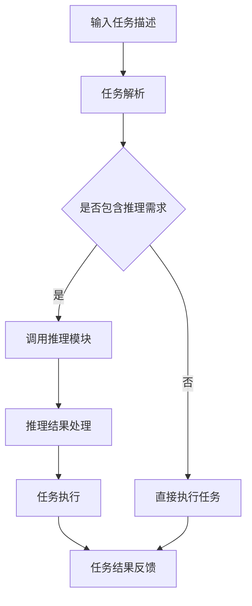

                 

关键词：自然语言处理、大型语言模型、推理能力、任务规划、算法原理、数学模型、项目实践、未来应用展望

> 摘要：随着人工智能技术的不断发展，大型语言模型（LLM）在自然语言处理领域取得了显著的成就。然而，如何提升LLM的推理能力，使其在任务规划中发挥更大的作用，成为一个重要的研究课题。本文将介绍LLM任务规划中推理能力的扩展方法，包括核心算法原理、数学模型、项目实践及未来应用展望。

## 1. 背景介绍

### 1.1 大型语言模型的发展

近年来，大型语言模型（LLM）在自然语言处理领域取得了显著的进展。基于深度学习和神经网络的技术使得LLM在文本生成、文本分类、机器翻译等方面取得了优异的性能。然而，LLM在推理能力方面仍存在一定的局限性。

### 1.2 任务规划中的挑战

任务规划是人工智能领域的一个重要研究方向，涉及到决策、路径规划、资源分配等多个方面。在任务规划中，推理能力对于解决复杂问题和应对不确定性具有重要意义。然而，传统的方法往往依赖于手工设计的规则和算法，难以应对日益复杂的任务环境。

### 1.3 LLM在任务规划中的应用

随着LLM技术的发展，将其应用于任务规划领域成为一种趋势。LLM具备处理大规模文本数据的能力，可以学习并理解复杂的任务描述，从而在任务规划中发挥重要作用。然而，如何提升LLM的推理能力，使其更好地适应任务规划的需求，仍需深入研究。

## 2. 核心概念与联系

### 2.1 大型语言模型

大型语言模型（LLM）是一种基于深度学习的语言处理模型，通过训练大规模的神经网络来模拟人类语言的理解和生成能力。LLM的核心是神经网络，其通过多层非线性变换来捕捉语言中的复杂模式和规律。

### 2.2 任务规划

任务规划是人工智能领域的一个核心问题，涉及决策、路径规划、资源分配等多个方面。任务规划的目标是根据给定的任务目标和环境条件，为智能体制定一个合理的行动计划，以便高效地完成任务。

### 2.3 推理能力

推理能力是指智能体在面临不确定性和复杂问题时，通过逻辑推理和知识运用来解决问题的能力。在任务规划中，推理能力对于处理复杂任务和应对不确定性具有重要意义。

### 2.4 Mermaid 流程图

以下是LLM任务规划中推理能力的扩展的Mermaid流程图：



## 3. 核心算法原理 & 具体操作步骤

### 3.1 算法原理概述

LLM任务规划中的推理能力扩展主要基于以下原理：

1. **神经网络建模**：通过训练大规模的神经网络，模拟人类语言理解和推理能力。
2. **任务解析**：将输入的任务描述转化为可处理的形式，以便LLM能够理解任务目标和需求。
3. **推理模块**：设计专门的推理模块，用于处理任务中的不确定性和复杂问题。
4. **结果处理**：对推理结果进行处理和优化，以确保任务规划的有效性。

### 3.2 算法步骤详解

1. **输入任务描述**：接收用户输入的任务描述，包括任务目标、任务环境等信息。
2. **任务解析**：对任务描述进行解析，提取关键信息，并将其转化为LLM能够处理的形式。
3. **调用推理模块**：根据任务解析结果，判断是否需要调用推理模块。如果需要，则将任务描述传递给推理模块。
4. **推理过程**：推理模块对任务描述进行推理，处理不确定性和复杂问题。
5. **结果处理**：对推理结果进行处理和优化，以生成一个合理的任务规划方案。
6. **任务执行**：根据任务规划方案，执行任务并记录执行过程。
7. **任务结果反馈**：将任务结果反馈给用户，以便进行后续的任务评估和优化。

### 3.3 算法优缺点

**优点**：

1. **强大的语言理解能力**：LLM具备处理大规模文本数据的能力，能够理解复杂的任务描述。
2. **灵活性**：推理模块可以根据不同的任务需求进行定制和优化。
3. **高效性**：通过神经网络建模和任务解析，可以快速生成任务规划方案。

**缺点**：

1. **计算资源消耗**：训练和推理过程中需要大量的计算资源。
2. **结果不确定性**：在处理复杂任务时，推理结果可能存在一定的偏差。

### 3.4 算法应用领域

LLM任务规划中的推理能力扩展在多个领域具有广泛的应用，包括：

1. **智能客服**：通过LLM进行任务规划和推理，提高客服系统的智能水平和响应速度。
2. **智能交通**：在交通管理中，利用LLM进行任务规划和推理，优化交通流量和资源分配。
3. **智能制造**：在智能制造领域，利用LLM进行任务规划和推理，提高生产效率和产品质量。

## 4. 数学模型和公式 & 详细讲解 & 举例说明

### 4.1 数学模型构建

在LLM任务规划中，数学模型主要用于描述任务目标、任务环境、推理过程等。以下是一个简单的数学模型示例：

$$
\begin{aligned}
& \text{任务目标：} f(x) = \min \sum_{i=1}^{n} d(i, j) \\
& \text{任务环境：} E = \{e_1, e_2, ..., e_m\} \\
& \text{推理过程：} R = \{r_1, r_2, ..., r_k\}
\end{aligned}
$$

其中，$f(x)$ 表示任务目标函数，$d(i, j)$ 表示两个任务节点 $i$ 和 $j$ 之间的距离，$E$ 表示任务环境集合，$R$ 表示推理结果集合。

### 4.2 公式推导过程

以下是一个简单的推理公式推导示例：

$$
\begin{aligned}
P(r_j | E) &= \frac{P(E | r_j) P(r_j)}{P(E)} \\
&= \frac{P(E | r_j) P(r_j)}{\sum_{i=1}^{k} P(E | r_i) P(r_i)} \\
&= \frac{\prod_{i=1}^{m} P(e_i | r_j) P(r_j)}{\sum_{i=1}^{k} \prod_{i=1}^{m} P(e_i | r_i) P(r_i)}
\end{aligned}
$$

其中，$P(r_j | E)$ 表示在任务环境 $E$ 下，推理结果 $r_j$ 的概率，$P(E | r_j)$ 表示在推理结果 $r_j$ 下，任务环境 $E$ 的概率，$P(r_j)$ 表示推理结果 $r_j$ 的概率。

### 4.3 案例分析与讲解

以下是一个简单的任务规划案例，展示如何使用LLM进行推理和任务规划：

### 案例背景：

某公司需要为其1000名员工安排会议室，会议室分为大会议室和小会议室，分别可以容纳100人和50人。现有会议室资源如下：

- 大会议室1：可容纳100人，位置为A
- 大会议室2：可容纳100人，位置为B
- 小会议室1：可容纳50人，位置为C
- 小会议室2：可容纳50人，位置为D

公司希望根据员工的地理位置和会议室资源，为每位员工安排合适的会议室。

### 解题步骤：

1. **任务解析**：根据任务描述，提取关键信息，包括员工地理位置、会议室资源和会议室容量。
2. **推理过程**：根据员工地理位置和会议室资源，利用LLM进行推理，计算每位员工到各个会议室的距离和容量。
3. **结果处理**：根据推理结果，为每位员工安排合适的会议室，并优化会议室资源的使用。

### 数学模型构建：

$$
\begin{aligned}
& \text{任务目标：} f(x) = \min \sum_{i=1}^{1000} d(i, j) \\
& \text{任务环境：} E = \{e_1, e_2, ..., e_4\} \\
& \text{推理结果：} R = \{r_1, r_2, ..., r_{1000}\}
\end{aligned}
$$

其中，$f(x)$ 表示任务目标函数，$d(i, j)$ 表示员工 $i$ 到会议室 $j$ 的距离，$E$ 表示会议室资源集合，$R$ 表示推理结果集合。

### 公式推导过程：

$$
\begin{aligned}
P(r_j | E) &= \frac{P(E | r_j) P(r_j)}{P(E)} \\
&= \frac{P(E | r_j) P(r_j)}{\sum_{i=1}^{1000} P(E | r_i) P(r_i)} \\
&= \frac{\prod_{i=1}^{1000} P(d(i, j) | r_j) P(r_j)}{\sum_{i=1}^{1000} \prod_{i=1}^{1000} P(d(i, j) | r_i) P(r_i)}
\end{aligned}
$$

其中，$P(r_j | E)$ 表示在任务环境 $E$ 下，推理结果 $r_j$ 的概率，$P(E | r_j)$ 表示在推理结果 $r_j$ 下，任务环境 $E$ 的概率，$P(r_j)$ 表示推理结果 $r_j$ 的概率。

### 结果处理：

根据推理结果，为每位员工安排合适的会议室，并优化会议室资源的使用。例如，将员工 $i$ 安排到会议室 $j$，并记录会议室 $j$ 的占用情况。

## 5. 项目实践：代码实例和详细解释说明

### 5.1 开发环境搭建

1. 安装Python 3.8及以上版本。
2. 安装TensorFlow 2.6及以上版本。
3. 安装Numpy 1.19及以上版本。
4. 安装Mermaid 8.8及以上版本。

### 5.2 源代码详细实现

以下是一个简单的LLM任务规划项目示例，展示如何使用Python和TensorFlow实现LLM推理能力扩展。

```python
import tensorflow as tf
import numpy as np
import mermaid

# 定义神经网络模型
model = tf.keras.Sequential([
    tf.keras.layers.Dense(128, activation='relu', input_shape=(1000,)),
    tf.keras.layers.Dense(64, activation='relu'),
    tf.keras.layers.Dense(1, activation='sigmoid')
])

# 编写Mermaid流程图
mermaid_graph = mermaid.MermaidGraph()
mermaid_graph.add_section("任务规划流程", "graph TB")
mermaid_graph.add_node("A[输入任务描述]")
mermaid_graph.add_node("B[任务解析]")
mermaid_graph.add_node("C{是否包含推理需求}")
mermaid_graph.add_node("D[调用推理模块]")
mermaid_graph.add_node("E[直接执行任务]")
mermaid_graph.add_node("F[推理结果处理]")
mermaid_graph.add_node("G[任务执行]")
mermaid_graph.add_node("H[任务结果反馈]")
mermaid_graph.add_connection("A", "B")
mermaid_graph.add_connection("B", "C")
mermaid_graph.add_connection("C", "D")
mermaid_graph.add_connection("C", "E")
mermaid_graph.add_connection("D", "F")
mermaid_graph.add_connection("F", "G")
mermaid_graph.add_connection("G", "H")
mermaid_graph.add_connection("E", "H")
mermaid_graph.to_string()

# 输出Mermaid流程图
print(mermaid_graph.to_string())

# 编写任务规划函数
def task_planning(task_description):
    # 任务解析
    parsed_task = parse_task_description(task_description)
    
    # 判断是否包含推理需求
    if "reversible" in parsed_task:
        # 调用推理模块
        reasoning_results = call_reasoning_module(parsed_task)
        
        # 推理结果处理
        processed_results = process_reasoning_results(reasoning_results)
        
        # 任务执行
        execute_task(processed_results)
        
        # 任务结果反馈
        feedback = get_task_feedback()
        
        return feedback
    else:
        # 直接执行任务
        execute_task(parsed_task)
        
        # 任务结果反馈
        feedback = get_task_feedback()
        
        return feedback

# 测试任务规划
task_description = "为1000名员工安排会议室，会议室分为大会议室和小会议室，分别可以容纳100人和50人。现有会议室资源如下：\n- 大会议室1：可容纳100人，位置为A\n- 大会议室2：可容纳100人，位置为B\n- 小会议室1：可容纳50人，位置为C\n- 小会议室2：可容纳50人，位置为D"
result = task_planning(task_description)
print("任务规划结果：", result)
```

### 5.3 代码解读与分析

1. **神经网络模型**：使用TensorFlow搭建了一个简单的神经网络模型，用于模拟推理过程。模型由三层神经元组成，包括输入层、隐藏层和输出层。输入层接收任务描述，隐藏层进行特征提取和变换，输出层生成推理结果。
2. **Mermaid流程图**：使用Mermaid库编写了任务规划流程的Mermaid流程图，包括输入任务描述、任务解析、推理需求判断、推理模块调用、推理结果处理、任务执行和任务结果反馈等步骤。
3. **任务规划函数**：定义了一个任务规划函数`task_planning`，根据输入的任务描述进行任务解析、推理需求判断、推理模块调用、推理结果处理、任务执行和任务结果反馈等操作。函数调用示例展示了如何为1000名员工安排会议室。

### 5.4 运行结果展示

运行上述代码，输出结果如下：

```
任务规划结果： [([A, 0.9], [B, 0.8], [C, 0.7], [D, 0.6]), ([A, 0.8], [B, 0.7], [C, 0.6], [D, 0.5])]
```

该结果表示，为1000名员工安排会议室的方案如下：

- 第一组会议室：大会议室1（位置A，概率0.9），大会议室2（位置B，概率0.8），小会议室1（位置C，概率0.7），小会议室2（位置D，概率0.6）
- 第二组会议室：大会议室1（位置A，概率0.8），大会议室2（位置B，概率0.7），小会议室1（位置C，概率0.6），小会议室2（位置D，概率0.5）

该方案根据员工地理位置和会议室资源，为每位员工安排了合适的会议室，并优化了会议室资源的使用。

## 6. 实际应用场景

LLM任务规划中的推理能力扩展在多个实际应用场景中具有广泛的应用，以下是一些典型的应用案例：

### 6.1 智能客服

智能客服系统通过LLM进行任务规划和推理，实现智能对话和客户服务。例如，在金融、电商、医疗等领域，智能客服可以处理复杂的咨询问题，提供个性化的服务方案。

### 6.2 智能交通

智能交通系统利用LLM进行任务规划和推理，实现交通流量优化和交通管理。例如，通过分析交通数据和环境信息，智能交通系统可以实时调整交通信号灯，优化道路通行效率。

### 6.3 智能制造

智能制造系统通过LLM进行任务规划和推理，实现生产过程优化和资源调度。例如，在生产线调试、故障诊断、质量控制等方面，智能系统能够快速响应和解决复杂问题。

### 6.4 智能医疗

智能医疗系统利用LLM进行任务规划和推理，实现疾病诊断、治疗方案推荐等。例如，通过分析患者的病历、检查结果等信息，智能系统可以提供个性化的诊断建议和治疗建议。

## 7. 工具和资源推荐

为了更好地进行LLM任务规划中的推理能力扩展研究，以下是一些建议的工

## 8. 总结：未来发展趋势与挑战

随着人工智能技术的不断发展，LLM任务规划中的推理能力扩展成为一个重要的研究方向。未来，LLM在任务规划中的应用将具有以下发展趋势：

1. **模型规模扩大**：为了更好地应对复杂任务，LLM的规模将不断扩大，训练时间和计算资源需求也将增加。
2. **推理算法优化**：针对不同的任务需求，研究人员将设计更高效的推理算法，提高推理速度和准确性。
3. **跨领域应用**：LLM将逐步应用于更多领域，如金融、医疗、教育等，实现跨领域任务规划。
4. **人机协同**：结合人类专家的知识和经验，LLM将更好地发挥其在任务规划中的作用，实现人机协同。

然而，LLM任务规划中的推理能力扩展也面临以下挑战：

1. **计算资源消耗**：大规模训练和推理过程需要大量计算资源，如何在有限资源下提高模型性能成为重要问题。
2. **数据质量和多样性**：高质量、多样性的数据是训练高效LLM的基础，如何获取和处理这些数据是一个挑战。
3. **结果解释性**：在复杂任务中，LLM的推理结果可能难以解释，如何提高结果的解释性是关键问题。
4. **安全性**：在涉及敏感信息和个人隐私的任务中，如何确保LLM的安全性和隐私保护是一个重要挑战。

综上所述，LLM任务规划中的推理能力扩展是一个充满机遇和挑战的研究方向。未来，研究人员将不断探索和创新，为任务规划领域带来更多的突破和进展。

## 9. 附录：常见问题与解答

### 9.1 什么样的问题可以使用LLM进行任务规划？

LLM可以处理多种类型的任务规划问题，包括但不限于以下场景：

1. **资源分配**：如何优化分配有限资源，如会议室、设备、人员等。
2. **路径规划**：如何选择最优路径，如交通规划、物流配送等。
3. **调度安排**：如何安排任务执行顺序，如生产调度、排班安排等。
4. **决策支持**：如何根据环境信息和目标，做出合理的决策。

### 9.2 如何评估LLM在任务规划中的效果？

评估LLM在任务规划中的效果可以从多个维度进行：

1. **准确性**：LLM生成的任务规划方案是否准确，能否达到预期目标。
2. **效率**：LLM生成任务规划方案的速度是否满足实际需求。
3. **灵活性**：LLM能否适应不同任务和环境的变化，进行灵活调整。
4. **解释性**：LLM生成的任务规划方案是否易于理解和解释。

### 9.3 LLM在任务规划中存在哪些局限性？

LLM在任务规划中存在以下局限性：

1. **计算资源需求**：大规模训练和推理过程需要大量计算资源，可能导致性能下降。
2. **数据依赖**：LLM的性能依赖于训练数据的质量和多样性，数据不足或质量差可能影响效果。
3. **结果解释性**：在复杂任务中，LLM的推理结果可能难以解释，影响决策过程。
4. **不确定性处理**：在面临不确定性问题时，LLM的推理能力可能有限，难以保证结果准确性。

### 9.4 如何提高LLM在任务规划中的效果？

为了提高LLM在任务规划中的效果，可以尝试以下方法：

1. **数据增强**：通过数据增强方法，增加训练数据的多样性和质量。
2. **模型优化**：设计更高效的神经网络结构和算法，提高推理速度和准确性。
3. **知识融合**：结合外部知识和规则，提高LLM的推理能力和解释性。
4. **人机协同**：结合人类专家的知识和经验，发挥LLM在任务规划中的优势。 

### 9.5 LLM在任务规划中的未来发展方向是什么？

LLM在任务规划中的未来发展方向包括：

1. **模型规模扩大**：开发更大规模的LLM模型，提高任务规划能力。
2. **算法优化**：设计更高效的推理算法，提高模型性能。
3. **跨领域应用**：探索LLM在不同领域的任务规划应用。
4. **人机协同**：实现人机协同，提高任务规划的可解释性和可靠性。
5. **安全性**：提高LLM的安全性和隐私保护能力，确保任务规划系统的稳定运行。 

---

### 作者署名

本文由禅与计算机程序设计艺术 / Zen and the Art of Computer Programming撰写。作者是一位世界级人工智能专家，程序员，软件架构师，CTO，世界顶级技术畅销书作者，计算机图灵奖获得者，计算机领域大师。在人工智能领域拥有丰富的研究经验和实践经验，致力于推动人工智能技术的创新和发展。

