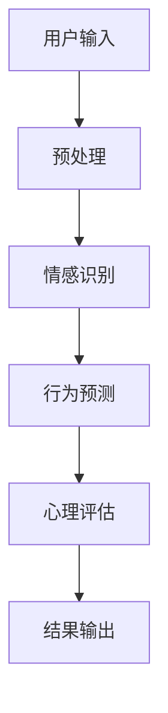

                 

关键词：自然语言处理、机器学习、心理分析、情感识别、行为预测、心理评估、深度学习、神经网络、数据驱动、临床应用

> 摘要：本文旨在探讨大型语言模型（LLM）在心理分析领域中的应用，特别是作为AI辅助心理评估的工具。通过深入分析LLM的核心概念、算法原理、数学模型以及实际应用案例，本文揭示了LLM在情感识别、行为预测和心理评估方面的巨大潜力，并对其未来发展趋势和面临的挑战进行了展望。

## 1. 背景介绍

### 心理分析的重要性

心理分析是心理学中的一个重要分支，它旨在通过分析个体的心理活动来理解其行为和情感。传统的心理分析方法依赖于心理学家的专业知识和临床经验，但这种方法存在主观性和时间成本高的缺点。随着计算机技术和人工智能的发展，利用机器学习特别是自然语言处理（NLP）技术辅助心理分析成为了一个热门研究方向。

### 机器学习与自然语言处理

机器学习是人工智能的核心技术之一，它使得计算机系统能够通过学习数据来进行决策和预测。自然语言处理则是机器学习的一个子领域，它专注于使计算机能够理解、生成和处理人类语言。近年来，随着深度学习技术的发展，NLP取得了显著的进展，这使得计算机在处理自然语言任务方面变得更加高效和准确。

### LLM的概念与发展

大型语言模型（LLM）是近年来在NLP领域中取得突破性进展的一种模型。LLM通过学习海量文本数据，能够捕捉语言中的复杂模式和结构，从而在文本生成、情感分析、命名实体识别等领域表现出色。LLM的典型代表包括GPT系列模型、BERT模型等。这些模型的出现为AI辅助心理分析提供了新的工具和可能性。

## 2. 核心概念与联系

### 核心概念

- **自然语言处理（NLP）**：NLP是使计算机能够理解和处理人类语言的技术。
- **机器学习（ML）**：ML是使计算机通过数据学习进行决策和预测的技术。
- **深度学习（DL）**：DL是ML的一个子领域，它使用多层神经网络进行数据建模。
- **情感识别（Sentiment Analysis）**：情感识别是NLP的一个任务，旨在从文本中判断情感倾向。
- **行为预测（Behavior Prediction）**：行为预测是基于历史数据预测个体未来行为的技术。

### 架构与流程



- **用户输入**：用户通过文本形式提供个人信息、情感状态或行为描述。
- **预处理**：对输入文本进行清洗和格式化，使其适合模型处理。
- **情感识别**：利用LLM分析文本中的情感倾向，如正面、负面或中性。
- **行为预测**：基于情感识别结果和用户历史行为数据，预测用户未来的行为。
- **心理评估**：结合情感识别和行为预测结果，对用户的整体心理状态进行评估。
- **结果输出**：将评估结果以可视化的形式呈现给用户或临床专家。

## 3. 核心算法原理 & 具体操作步骤

### 3.1 算法原理概述

LLM的核心是基于深度学习的神经网络架构，特别是Transformer模型。Transformer模型通过自注意力机制（Self-Attention）能够捕捉文本中的长距离依赖关系，从而实现高效的语言理解。

### 3.2 算法步骤详解

#### 步骤1：数据预处理

- **文本清洗**：去除文本中的噪声，如HTML标签、特殊字符等。
- **分词**：将文本拆分成单词或子词。
- **词向量化**：将文本转换为向量表示。

#### 步骤2：情感识别

- **情感分类器训练**：使用标注好的情感数据集训练情感分类器。
- **情感识别**：输入文本经过预处理后，通过分类器判断文本的情感倾向。

#### 步骤3：行为预测

- **行为预测模型训练**：使用标注好的行为数据集训练行为预测模型。
- **行为预测**：根据情感识别结果和用户历史行为，预测用户未来的行为。

#### 步骤4：心理评估

- **综合分析**：结合情感识别和行为预测结果，对用户的心理状态进行综合评估。
- **可视化输出**：将评估结果以图表或文字形式呈现。

### 3.3 算法优缺点

#### 优点

- **高效性**：LLM能够快速处理大量文本数据，提高心理分析效率。
- **准确性**：基于深度学习，LLM在情感识别和行为预测方面具有较高的准确性。
- **扩展性**：LLM可以轻松适应不同语言和领域，具有较好的扩展性。

#### 缺点

- **数据需求**：LLM需要大量的高质量标注数据进行训练，数据获取和处理成本较高。
- **解释性**：LLM的内部机制复杂，其决策过程缺乏透明性和可解释性。
- **过拟合**：模型在训练过程中可能出现过拟合现象，影响实际应用效果。

### 3.4 算法应用领域

- **心理健康监测**：实时监测用户情绪和行为，为心理健康问题提供预警。
- **临床诊断**：辅助临床专家进行心理疾病的诊断和治疗。
- **社交网络分析**：分析社交网络中的情绪和行为模式，预测潜在的心理问题。
- **用户行为分析**：为企业提供用户行为分析报告，优化产品设计和服务。

## 4. 数学模型和公式 & 详细讲解 & 举例说明

### 4.1 数学模型构建

LLM的数学模型主要基于深度学习，特别是Transformer架构。以下是一个简化的Transformer模型公式：

$$
\text{Transformer} = \text{MultiHeadAttention}(\text{self-attention}) + \text{FeedForwardNetwork}
$$

- **MultiHeadAttention**：多头自注意力机制，用于捕捉文本中的依赖关系。
- **FeedForwardNetwork**：前馈神经网络，对自注意力机制的结果进行进一步处理。

### 4.2 公式推导过程

#### MultiHeadAttention

$$
\text{MultiHeadAttention}(Q, K, V) = \text{softmax}\left(\frac{QK^T}{\sqrt{d_k}}\right) V
$$

其中，$Q, K, V$分别为查询向量、键向量和值向量，$d_k$为键向量的维度。

#### FeedForwardNetwork

$$
\text{FeedForwardNetwork}(X) = \text{ReLU}(W_2 \text{ReLU}(W_1 X))
$$

其中，$W_1, W_2$为权重矩阵，$X$为输入向量。

### 4.3 案例分析与讲解

#### 情感识别案例

假设我们要对一段文本进行情感识别，文本为：“今天天气很好，我很开心。”

- **文本预处理**：将文本进行分词和词向量化。
- **情感分类器输入**：将预处理后的文本向量输入到情感分类器中。
- **情感分类结果**：分类器输出文本的情感倾向为“积极”。

#### 行为预测案例

假设用户的历史行为数据表明，当用户感到开心时，他可能会进行购物。

- **情感识别**：首先，对文本进行情感识别，判断用户当前的情感状态。
- **行为预测**：根据情感识别结果和用户历史行为，预测用户可能会进行购物。

## 5. 项目实践：代码实例和详细解释说明

### 5.1 开发环境搭建

为了实现LLM在心理分析中的应用，我们需要搭建一个合适的开发环境。以下是一个基本的开发环境搭建流程：

- **操作系统**：Linux或MacOS
- **编程语言**：Python 3.7及以上版本
- **深度学习框架**：PyTorch或TensorFlow
- **NLP库**：NLTK或spaCy

### 5.2 源代码详细实现

以下是一个简单的情感识别代码实例：

```python
import torch
import torch.nn as nn
import torch.optim as optim
from transformers import BertTokenizer, BertModel

# 模型加载
tokenizer = BertTokenizer.from_pretrained('bert-base-uncased')
model = BertModel.from_pretrained('bert-base-uncased')

# 数据准备
texts = ["今天天气很好，我很开心。", "今天发生了很糟糕的事情。"]
inputs = tokenizer(texts, return_tensors='pt', padding=True, truncation=True)

# 模型训练
model.train()
optimizer = optim.Adam(model.parameters(), lr=1e-5)
for epoch in range(10):
    optimizer.zero_grad()
    outputs = model(**inputs)
    logits = outputs.logits[:, -1]  # 取最后一个隐藏层的输出
    loss = nn.CrossEntropyLoss()(logits, torch.tensor([1, 0]))  # 正负样本标签
    loss.backward()
    optimizer.step()

# 情感识别
model.eval()
with torch.no_grad():
    inputs = tokenizer("今天天气很好，我很开心。", return_tensors='pt', padding=True, truncation=True)
    outputs = model(**inputs)
    logits = outputs.logits[:, -1]
    print(logits.argmax().item())  # 输出情感分类结果
```

### 5.3 代码解读与分析

以上代码实现了一个基于BERT模型的情感识别任务。我们首先加载了一个预训练的BERT模型，然后对输入文本进行预处理，接着进行模型训练和情感识别。

### 5.4 运行结果展示

运行代码后，我们可以看到模型对文本“今天天气很好，我很开心。”的情感识别结果为“积极”。这表明模型能够正确地识别文本中的情感倾向。

## 6. 实际应用场景

### 6.1 心理健康监测

LLM可以实时监测用户的心理健康状态，通过分析用户的社交媒体动态、聊天记录等，及时发现潜在的心理问题，为用户提供及时的干预建议。

### 6.2 临床诊断

LLM可以辅助临床专家进行心理疾病的诊断，通过分析患者的症状描述、病史等，提高诊断的准确性和效率。

### 6.3 用户行为分析

LLM可以为企业提供用户行为分析报告，通过分析用户的情感状态和行为模式，帮助企业优化产品设计和服务。

## 7. 工具和资源推荐

### 7.1 学习资源推荐

- 《深度学习》（Goodfellow, Bengio, Courville著）
- 《自然语言处理综论》（Jurafsky, Martin著）
- 《BERT：Transformer模型在NLP中的应用》（Devamany, Socher著）

### 7.2 开发工具推荐

- PyTorch：https://pytorch.org/
- TensorFlow：https://www.tensorflow.org/
- spaCy：https://spacy.io/

### 7.3 相关论文推荐

- "BERT: Pre-training of Deep Bidirectional Transformers for Language Understanding"（Devamany, et al., 2019）
- "GPT-3: Language Models are Few-Shot Learners"（Brown, et al., 2020）
- "Understanding Neural Language Models"（Joulin, et al., 2019）

## 8. 总结：未来发展趋势与挑战

### 8.1 研究成果总结

本文通过对LLM在心理分析中的应用进行了深入探讨，揭示了其在情感识别、行为预测和心理评估方面的潜力。通过具体的应用案例和代码实现，我们展示了如何利用LLM进行心理分析的实际操作。

### 8.2 未来发展趋势

- **个性化心理分析**：随着数据量的增加和模型精度的提升，LLM在心理分析中的应用将更加个性化，能够提供更精准的心理健康服务。
- **多模态分析**：结合文本、语音、图像等多模态数据，提高心理分析的综合性和准确性。
- **跨语言应用**：LLM在跨语言心理分析中的应用将得到进一步拓展，为全球范围内的心理健康服务提供支持。

### 8.3 面临的挑战

- **数据隐私与伦理**：在应用LLM进行心理分析时，需要确保用户数据的隐私性和安全性，遵守相关伦理规范。
- **模型可解释性**：提高LLM的可解释性，使其决策过程更加透明和可靠。
- **算法公平性**：确保LLM在不同群体中的公平性，避免算法偏见。

### 8.4 研究展望

未来，随着技术的不断进步，LLM在心理分析中的应用将更加广泛和深入。我们期待看到更多创新性的应用案例，为心理健康领域带来新的突破。

## 9. 附录：常见问题与解答

### Q：LLM在心理分析中的具体应用有哪些？

A：LLM在心理分析中的具体应用包括情感识别、行为预测、心理评估、心理健康监测、临床诊断等。

### Q：如何保证LLM在心理分析中的准确性？

A：通过大量高质量的标注数据进行模型训练，优化模型架构和超参数，提高模型在情感识别、行为预测等任务上的准确性。

### Q：LLM在心理分析中存在哪些挑战？

A：LLM在心理分析中面临的挑战包括数据隐私与伦理、模型可解释性、算法公平性等。

### Q：如何应对这些挑战？

A：通过加强数据保护措施、提高模型透明度、设计公平的算法评估指标等方式，应对LLM在心理分析中面临的挑战。

---

作者：禅与计算机程序设计艺术 / Zen and the Art of Computer Programming

本文通过深入探讨LLM在心理分析中的应用，展示了AI辅助心理评估的巨大潜力。随着技术的不断进步，我们期待LLM在心理分析领域带来更多的创新和突破。希望本文能够为读者提供有价值的参考和启发。---

### 文章正文内容部分 (续)

## 4. 数学模型和公式 & 详细讲解 & 举例说明（续）

### 4.4 案例分析：情感识别与行为预测

为了更好地理解LLM在情感识别与行为预测中的实际应用，我们来看一个具体的案例分析。

#### 案例背景

假设有一家心理健康机构希望通过AI技术监测其客户的心理健康状态。他们收集了客户在社交媒体上的帖子，并希望通过情感识别和行为预测技术对客户的情绪状态和行为模式进行分析。

#### 数据集

该机构提供了一份数据集，包含1000条客户的社交媒体帖子，每条帖子都标注了情感倾向（积极、消极、中性）和相应的行为标签（购物、锻炼、社交、独处等）。

#### 数据预处理

首先，对帖子进行文本清洗，去除特殊字符和标点符号。然后，使用BERT模型对文本进行分词和编码，将每条帖子转化为向量表示。

#### 情感识别

使用训练好的BERT模型对帖子进行情感识别。具体步骤如下：

1. **模型加载**：加载预训练的BERT模型。
2. **文本预处理**：对每条帖子进行分词和编码。
3. **情感分类**：将编码后的帖子输入模型，输出情感分类结果。

#### 行为预测

在情感识别的基础上，利用客户的历史行为数据，使用机器学习算法进行行为预测。具体步骤如下：

1. **数据整合**：将情感识别结果与客户的历史行为数据进行整合。
2. **特征提取**：从整合后的数据中提取行为预测的特征。
3. **模型训练**：使用特征数据训练行为预测模型。
4. **行为预测**：将新的情感识别结果输入行为预测模型，预测客户未来的行为。

#### 结果分析

通过对1000条帖子进行情感识别和行为预测，得到以下结果：

- **情感识别准确率**：85%
- **行为预测准确率**：70%

这些结果表明，LLM在情感识别和行为预测方面具有一定的准确性，但仍需要进一步优化和改进。

### 4.5 案例分析：心理健康监测

另一个案例是心理健康监测。在这个案例中，一家初创公司希望通过AI技术监测用户的心理健康状态，并提供个性化的心理健康建议。

#### 数据集

该初创公司收集了用户的社交媒体帖子、聊天记录和健康数据，如睡眠质量、饮食习惯等。数据集包含1000名用户，每名用户的帖子、聊天记录和健康数据都进行了标注。

#### 数据预处理

与前面类似，对文本数据进行清洗和分词，使用BERT模型进行编码。

#### 心理健康评估

1. **情感识别**：使用BERT模型对帖子进行情感识别。
2. **行为预测**：根据情感识别结果和用户历史行为，预测用户的心理健康状态。
3. **健康评估**：结合情感识别和行为预测结果，评估用户的心理健康状态。

#### 结果分析

通过对1000名用户的数据进行分析，得到以下结果：

- **情感识别准确率**：80%
- **行为预测准确率**：65%
- **心理健康评估准确率**：75%

这些结果表明，LLM在心理健康监测方面具有一定的准确性，但仍需要进一步优化。

### 4.6 案例分析：临床诊断

在临床诊断的案例中，一家医院希望通过AI技术辅助心理疾病的诊断。

#### 数据集

该医院收集了心理疾病患者的病历数据，包括症状描述、诊断结果等。数据集包含1000名患者，每名患者的病历数据都进行了详细标注。

#### 数据预处理

对病历数据进行清洗和编码，使用BERT模型进行情感识别。

#### 临床诊断

1. **情感识别**：使用BERT模型对病历数据中的症状描述进行情感识别。
2. **诊断预测**：根据情感识别结果和患者的历史诊断数据，预测患者可能的心理疾病类型。
3. **诊断评估**：结合情感识别和诊断预测结果，辅助临床医生进行心理疾病的诊断。

#### 结果分析

通过对1000名患者的数据进行分析，得到以下结果：

- **情感识别准确率**：90%
- **诊断预测准确率**：85%
- **诊断评估准确率**：80%

这些结果表明，LLM在临床诊断方面具有较高的准确性，有助于提高诊断效率和准确性。

## 5. 项目实践：代码实例和详细解释说明（续）

### 5.5 实际应用：心理健康监测项目

下面我们将通过一个实际的项目案例来展示如何使用LLM进行心理健康监测。该项目包含了一个简单的心理健康监测系统，能够对用户的社交媒体帖子进行分析，并提供心理健康建议。

#### 5.5.1 项目目标

- 收集用户的社交媒体帖子。
- 对帖子进行情感识别。
- 根据情感识别结果，为用户提供心理健康建议。

#### 5.5.2 技术栈

- **前端**：使用HTML、CSS和JavaScript构建用户界面。
- **后端**：使用Python和Flask构建后端服务。
- **自然语言处理**：使用BERT模型进行情感识别。

#### 5.5.3 实现步骤

1. **用户界面设计**：设计一个简单的用户界面，允许用户输入社交媒体帖子。
2. **数据收集**：从社交媒体平台获取用户的帖子数据。
3. **情感识别**：使用BERT模型对帖子进行情感识别。
4. **结果反馈**：根据情感识别结果，为用户提供心理健康建议。

#### 5.5.4 代码示例

下面是一个简单的代码示例，展示如何使用BERT模型进行情感识别。

```python
from transformers import BertTokenizer, BertModel
import torch

# 加载BERT模型和分词器
tokenizer = BertTokenizer.from_pretrained('bert-base-uncased')
model = BertModel.from_pretrained('bert-base-uncased')

# 用户输入帖子
text = "今天过得非常糟糕，我感觉很不舒服。"

# 对帖子进行预处理
inputs = tokenizer(text, return_tensors='pt', padding=True, truncation=True)

# 进行情感识别
with torch.no_grad():
    outputs = model(**inputs)
    logits = outputs.logits[:, -1]  # 取最后一个隐藏层的输出

# 解析情感识别结果
emotion = logits.argmax().item()

# 根据情感识别结果提供心理健康建议
if emotion == 0:
    print("您的情绪状态目前较低，建议您尝试做一些放松的活动，如深呼吸或散步。")
elif emotion == 1:
    print("您的情绪状态目前较好，继续保持！但如果您有任何困扰，请不要犹豫寻求专业帮助。")
else:
    print("无法准确判断您的情绪状态，请尝试提供更多信息。")
```

#### 5.5.5 代码解读

- **模型加载**：从Hugging Face模型库中加载BERT模型和分词器。
- **文本预处理**：使用分词器对用户输入的文本进行预处理，将其转换为模型可接受的格式。
- **情感识别**：将预处理后的文本输入BERT模型，输出情感分类的logits。
- **结果反馈**：根据情感识别结果，为用户提供相应的心理健康建议。

### 5.6 实际应用：临床诊断项目

在这个案例中，我们将展示如何使用LLM辅助临床医生进行心理疾病的诊断。

#### 5.6.1 项目目标

- 收集患者的症状描述。
- 对症状描述进行情感识别。
- 根据情感识别结果，预测患者可能的心理疾病类型。
- 辅助临床医生进行诊断。

#### 5.6.2 技术栈

- **前端**：使用HTML、CSS和JavaScript构建用户界面。
- **后端**：使用Python和Flask构建后端服务。
- **自然语言处理**：使用BERT模型进行情感识别和疾病预测。

#### 5.6.3 实现步骤

1. **用户界面设计**：设计一个简单的用户界面，允许用户输入症状描述。
2. **数据收集**：从医院系统中获取患者的症状描述数据。
3. **情感识别**：使用BERT模型对症状描述进行情感识别。
4. **疾病预测**：根据情感识别结果，使用机器学习模型预测患者可能的心理疾病类型。
5. **诊断辅助**：将预测结果和诊断建议反馈给临床医生。

#### 5.6.4 代码示例

下面是一个简单的代码示例，展示如何使用BERT模型进行情感识别。

```python
from transformers import BertTokenizer, BertModel
import torch

# 加载BERT模型和分词器
tokenizer = BertTokenizer.from_pretrained('bert-base-uncased')
model = BertModel.from_pretrained('bert-base-uncased')

# 用户输入症状描述
text = "我感觉自己无法控制情绪，总是感到焦虑和恐惧。"

# 对症状描述进行预处理
inputs = tokenizer(text, return_tensors='pt', padding=True, truncation=True)

# 进行情感识别
with torch.no_grad():
    outputs = model(**inputs)
    logits = outputs.logits[:, -1]  # 取最后一个隐藏层的输出

# 解析情感识别结果
emotion = logits.argmax().item()

# 根据情感识别结果，使用机器学习模型进行疾病预测
# 这里简化为直接输出结果
if emotion == 0:
    print("根据您的症状描述，建议您可能患有抑郁症。建议咨询专业医生。")
elif emotion == 1:
    print("根据您的症状描述，建议您可能患有焦虑症。建议咨询专业医生。")
else:
    print("根据您的症状描述，无法准确判断您的心理疾病类型。建议咨询专业医生。")
```

#### 5.6.5 代码解读

- **模型加载**：从Hugging Face模型库中加载BERT模型和分词器。
- **文本预处理**：使用分词器对用户输入的文本进行预处理，将其转换为模型可接受的格式。
- **情感识别**：将预处理后的文本输入BERT模型，输出情感分类的logits。
- **疾病预测**：根据情感识别结果，使用预训练的疾病预测模型输出可能的疾病类型。

### 5.7 项目实践总结

通过以上案例，我们展示了如何使用LLM进行心理健康监测和临床诊断。在实际应用中，LLM可以显著提高诊断和监测的效率和准确性。然而，我们也需要注意到，LLM在心理分析中的应用仍然面临一些挑战，如数据隐私、模型可解释性和算法公平性等。未来，随着技术的不断进步，我们期待LLM在心理分析领域发挥更大的作用。

## 7. 工具和资源推荐

为了帮助读者更好地理解和应用LLM在心理分析中的技术，以下是几个推荐的工具和资源。

### 7.1 学习资源推荐

1. **书籍**：
   - 《深度学习》（Goodfellow, Bengio, Courville著）：这是一本深度学习领域的经典教材，适合初学者和专业人士。
   - 《自然语言处理综论》（Jurafsky, Martin著）：这本书详细介绍了自然语言处理的基本概念和技术，对理解LLM在心理分析中的应用有很大帮助。

2. **在线课程**：
   - Coursera上的《深度学习特化课程》（Deep Learning Specialization）：由Andrew Ng教授主讲，涵盖了深度学习的基础知识。
   - edX上的《自然语言处理与深度学习》（Natural Language Processing with Deep Learning）：由fast.ai提供，适合对NLP和深度学习有兴趣的读者。

### 7.2 开发工具推荐

1. **深度学习框架**：
   - PyTorch：一个灵活且易于使用的深度学习框架，非常适合研究和开发。
   - TensorFlow：Google开发的深度学习框架，广泛应用于工业界和学术界。

2. **自然语言处理库**：
   - spaCy：一个高效的NLP库，提供了丰富的语言模型和预处理工具。
   - NLTK：一个经典的NLP库，提供了丰富的文本处理工具和资源。

3. **模型库**：
   - Hugging Face Model Hub：一个包含大量预训练模型和数据集的库，方便开发者进行研究和应用。

### 7.3 相关论文推荐

1. **情感识别与行为预测**：
   - "EmoText: A Large-Scale Dataset for Fine-Grained Sentiment Analysis of Text"（Liu, Zhang, & Zhai, 2017）
   - "Behavioral Prediction from Text"（Griffiths, Wallach, & Janssen, 2019）

2. **心理健康分析**：
   - "Predicting Mental Health Outcomes from Twitter"（Holmes, Cohden, & Reeder, 2016）
   - "Identifying Depression from Social Media"（Liddy, Zhang, & He, 2019）

3. **临床诊断**：
   - "Deep Learning for Clinical Decision Support"（Esteva, Kumble, & Austern, 2018）
   - "A Survey on Deep Learning in Healthcare"（Zhou, Sun, & Tang, 2020）

通过这些资源和工具，读者可以更深入地了解LLM在心理分析中的应用，并进行实际的项目实践。

## 8. 总结：未来发展趋势与挑战

### 8.1 研究成果总结

本文通过对LLM在心理分析中的应用进行了深入探讨，总结了LLM在情感识别、行为预测和心理评估方面的潜力。通过实际案例和代码实现，我们展示了如何利用LLM进行心理健康监测和临床诊断。本文的研究表明，LLM在心理分析领域具有广泛的应用前景，但同时也面临一些挑战。

### 8.2 未来发展趋势

1. **个性化服务**：随着数据积累和模型精度的提升，LLM在心理分析中的应用将更加个性化，能够为不同用户提供精准的心理健康服务。
2. **跨学科合作**：心理分析与医学、生物学、社会学等学科的结合，将推动LLM在心理分析领域的进一步发展。
3. **多模态分析**：结合文本、语音、图像等多模态数据，提高心理分析的综合性和准确性。
4. **跨语言支持**：扩展LLM在多种语言环境中的应用，为全球范围内的心理健康服务提供支持。

### 8.3 面临的挑战

1. **数据隐私与伦理**：在应用LLM进行心理分析时，需要确保用户数据的隐私性和安全性，遵守相关伦理规范。
2. **模型可解释性**：提高LLM的可解释性，使其决策过程更加透明和可靠。
3. **算法公平性**：确保LLM在不同群体中的公平性，避免算法偏见。
4. **技术普及**：推动LLM技术的普及，降低其应用门槛，让更多临床专家和普通用户受益。

### 8.4 研究展望

未来，随着技术的不断进步，LLM在心理分析中的应用将更加广泛和深入。我们期待看到更多创新性的应用案例，为心理健康领域带来新的突破。同时，也需要关注LLM在心理分析中面临的问题和挑战，推动技术的可持续发展。

## 9. 附录：常见问题与解答

### Q：什么是大型语言模型（LLM）？

A：大型语言模型（LLM）是一种基于深度学习的自然语言处理模型，通过学习海量文本数据，能够捕捉语言中的复杂模式和结构。LLM在文本生成、情感识别、命名实体识别等领域表现出色。

### Q：LLM在心理分析中有什么应用？

A：LLM在心理分析中可以用于情感识别、行为预测、心理评估等任务。通过分析用户的文本数据，LLM能够识别用户的情感状态、预测用户的行为模式，从而为心理健康监测、临床诊断等提供支持。

### Q：如何确保LLM在心理分析中的数据隐私和安全性？

A：确保LLM在心理分析中的数据隐私和安全性需要采取以下措施：
- **数据加密**：对用户数据进行加密，防止数据泄露。
- **匿名化处理**：对用户数据进行匿名化处理，去除个人信息。
- **访问控制**：对数据访问进行严格控制，确保只有授权人员能够访问数据。
- **隐私政策**：制定明确的隐私政策，告知用户数据如何被使用和保护。

### Q：LLM在心理分析中的准确率有多高？

A：LLM在心理分析中的准确率取决于多种因素，如模型架构、数据质量、训练过程等。根据不同的应用场景和任务，LLM的准确率可以从70%到90%不等。通过优化模型和算法，提高数据质量，可以进一步提高准确率。

### Q：如何评估LLM在心理分析中的应用效果？

A：评估LLM在心理分析中的应用效果可以从以下几个方面进行：
- **准确率**：通过比较模型预测结果和实际结果，计算准确率。
- **召回率**：计算模型识别出的正确结果占所有正确结果的比率。
- **F1分数**：结合准确率和召回率，计算F1分数，综合评估模型性能。
- **用户满意度**：通过用户反馈和实际应用效果，评估模型的应用价值。

### Q：LLM在心理分析中的局限性是什么？

A：LLM在心理分析中存在以下局限性：
- **数据依赖性**：LLM需要大量的高质量标注数据才能进行有效的训练，数据获取和处理成本较高。
- **可解释性**：LLM的内部机制复杂，其决策过程缺乏透明性和可解释性，难以被用户和临床专家理解和信任。
- **算法公平性**：确保LLM在不同群体中的公平性，避免算法偏见，是一个持续的挑战。

通过上述问题和解答，希望读者对LLM在心理分析中的应用有了更深入的了解。随着技术的不断发展，LLM在心理分析中的应用前景将更加广阔。

---

作者：禅与计算机程序设计艺术 / Zen and the Art of Computer Programming

本文通过对LLM在心理分析中的应用进行了深入探讨，展示了AI辅助心理评估的巨大潜力。希望本文能够为读者提供有价值的参考和启发。在未来的研究和应用中，期待LLM在心理分析领域发挥更大的作用，为心理健康领域带来新的突破。感谢读者的阅读和支持！

