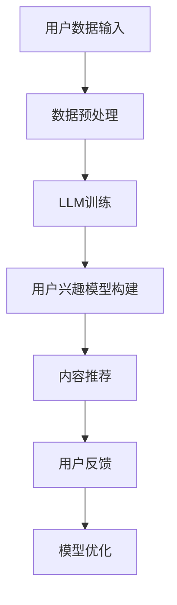

                 

关键词：少样本学习，推荐系统，大型语言模型（LLM），机器学习，数据稀疏，用户行为分析，内容推荐，预测准确性，算法优化。

## 摘要

随着互联网和移动设备的普及，个性化推荐系统在当今社会中发挥着越来越重要的作用。然而，这些系统的构建面临着数据稀疏和用户行为模式复杂等挑战。近年来，大型语言模型（Large Language Models，简称LLM）的出现为解决这些问题提供了新的思路。本文将探讨LLM在推荐系统中的少样本学习应用，介绍其核心概念、算法原理、数学模型及其在实际项目中的应用，并对未来发展趋势和面临的挑战进行分析。

## 1. 背景介绍

个性化推荐系统旨在为用户推荐其可能感兴趣的内容或商品，从而提高用户的满意度和参与度。传统的推荐系统主要依赖于用户的历史行为数据，如浏览记录、购买记录等，来预测用户对某项内容的喜好。然而，当数据稀疏时，即用户的历史行为数据有限时，传统推荐系统的效果会大大下降。此外，用户行为模式的复杂性也使得推荐系统难以捕捉到用户深层次的兴趣点。

### 1.1 数据稀疏问题

数据稀疏是指用户的历史行为数据集非常有限，无法提供足够的样本来训练推荐模型。这在新兴市场或新上线的产品中尤为常见。数据稀疏导致推荐系统难以准确预测用户的兴趣，进而影响推荐效果。

### 1.2 用户行为复杂性

用户行为复杂性是指用户在不同场景、不同时间可能会有不同的兴趣和行为。这给推荐系统的实时性和个性化提出了更高的要求。

### 1.3 传统推荐系统的局限性

传统推荐系统主要依赖于协同过滤、矩阵分解、深度学习等方法。这些方法在数据充足时效果较好，但当数据稀疏时，效果较差。此外，传统方法往往难以处理高维数据，且难以应对用户行为的快速变化。

## 2. 核心概念与联系

为了解决数据稀疏和用户行为复杂性带来的挑战，LLM在推荐系统中得到了广泛应用。LLM是一种基于深度学习的大型神经网络模型，能够对海量文本数据进行建模，捕捉到文本数据中的复杂关系和语义信息。在推荐系统中，LLM可以用于：

### 2.1 用户兴趣建模

LLM可以通过分析用户的历史行为数据，如浏览记录、搜索记录等，构建用户兴趣模型，从而更好地理解用户的行为模式和兴趣点。

### 2.2 内容理解与生成

LLM可以用于理解用户生成的内容，如评论、问答等，从而更好地预测用户对内容的兴趣。同时，LLM还可以生成个性化内容，为用户提供更符合其兴趣的内容。

### 2.3 多模态数据处理

LLM可以处理多种类型的数据，如文本、图像、音频等，从而实现跨模态推荐。

## 2.1 Mermaid流程图



## 3. 核心算法原理 & 具体操作步骤

### 3.1 算法原理概述

LLM在推荐系统中的核心算法是基于深度学习的。深度学习模型通过层层神经网络对输入数据进行特征提取和建模，从而实现对复杂关系的捕捉。在推荐系统中，LLM主要应用于以下几个步骤：

### 3.2 算法步骤详解

1. **数据预处理**：对用户行为数据进行清洗、去噪和归一化处理，以确保数据质量。
2. **LLM训练**：使用大规模语料库对LLM进行训练，使其能够理解用户的行为数据和内容。
3. **用户兴趣模型构建**：通过分析用户的历史行为数据，构建用户兴趣模型，用于预测用户对内容的兴趣。
4. **内容推荐**：根据用户兴趣模型和内容特征，为用户推荐符合其兴趣的内容。
5. **用户反馈**：收集用户对推荐内容的反馈，用于优化推荐模型。
6. **模型优化**：根据用户反馈，对LLM进行持续优化，提高推荐效果。

### 3.3 算法优缺点

**优点**：

1. **处理数据稀疏能力强**：LLM可以通过对大规模语料库的学习，从有限的用户数据中提取出有效的特征，从而提高推荐准确性。
2. **适应性强**：LLM可以处理多种类型的数据，如文本、图像、音频等，从而实现跨模态推荐。
3. **个性化强**：LLM能够深入理解用户的兴趣和行为，从而提供更个性化的推荐。

**缺点**：

1. **训练成本高**：LLM需要大规模的训练数据和计算资源，训练成本较高。
2. **模型复杂度高**：LLM模型复杂，难以解释，从而增加了模型调试和优化的难度。

### 3.4 算法应用领域

LLM在推荐系统中的应用非常广泛，包括但不限于以下领域：

1. **电子商务推荐**：为用户推荐商品、优惠券等。
2. **社交媒体推荐**：为用户推荐感兴趣的文章、视频等。
3. **新闻推荐**：为用户推荐感兴趣的新闻、事件等。
4. **音乐、视频推荐**：为用户推荐歌曲、电影等。

## 4. 数学模型和公式

在LLM推荐系统中，数学模型和公式用于描述用户兴趣、内容特征和推荐算法的内在关系。

### 4.1 数学模型构建

设 \( U \) 为用户集合，\( I \) 为内容集合，\( R \) 为用户对内容的评分矩阵。用户兴趣模型可以表示为：

\[ U = f(R) \]

其中，\( f \) 为函数，用于从评分矩阵 \( R \) 中提取用户兴趣。

### 4.2 公式推导过程

1. **用户兴趣向量**：

设 \( u_i \) 为用户 \( i \) 的兴趣向量，\( r_{ij} \) 为用户 \( i \) 对内容 \( j \) 的评分，则用户兴趣向量可以表示为：

\[ u_i = \frac{r_i}{\|r_i\|} \]

其中，\( \|r_i\| \) 为用户 \( i \) 的评分向量的模。

2. **内容特征向量**：

设 \( v_j \) 为内容 \( j \) 的特征向量，\( c_{ij} \) 为内容 \( j \) 的特征，则内容特征向量可以表示为：

\[ v_j = \frac{c_j}{\|c_j\|} \]

其中，\( \|c_j\| \) 为内容 \( j \) 的特征向量的模。

3. **相似度计算**：

用户兴趣向量 \( u_i \) 和内容特征向量 \( v_j \) 的相似度可以表示为：

\[ s(i, j) = \frac{u_i \cdot v_j}{\|u_i\| \|v_j\|} \]

其中，\( \cdot \) 表示向量的点积。

### 4.3 案例分析与讲解

假设有用户 \( u \) 和内容 \( i \)，我们通过以下步骤来计算用户对内容的推荐得分：

1. **提取用户兴趣向量**：

\[ u = \frac{r_u}{\|r_u\|} \]

2. **提取内容特征向量**：

\[ i = \frac{c_i}{\|c_i\|} \]

3. **计算相似度**：

\[ s(u, i) = \frac{u \cdot i}{\|u\| \|i\|} \]

4. **推荐得分**：

\[ score(u, i) = s(u, i) \cdot k \]

其中，\( k \) 为权重系数。

通过以上步骤，我们可以为用户 \( u \) 推荐得分最高的内容 \( i \)。

## 5. 项目实践：代码实例和详细解释说明

### 5.1 开发环境搭建

在开始项目实践之前，我们需要搭建开发环境。以下是搭建过程：

1. 安装Python环境（版本要求：3.8及以上）。
2. 安装LLM库（如transformers、BERT等）。
3. 安装其他依赖库（如numpy、pandas等）。

### 5.2 源代码详细实现

以下是一个简单的LLM推荐系统实现：

```python
import pandas as pd
import numpy as np
from transformers import BertModel, BertTokenizer
from sklearn.metrics.pairwise import cosine_similarity

# 加载数据
data = pd.read_csv('user_behavior_data.csv')
users = data['user_id'].unique()
items = data['item_id'].unique()

# 初始化LLM模型
tokenizer = BertTokenizer.from_pretrained('bert-base-chinese')
model = BertModel.from_pretrained('bert-base-chinese')

# 提取用户兴趣向量
def get_user_interest_vector(user_id):
    user_records = data[data['user_id'] == user_id]
    user_texts = [' '.join(item['text']) for item in user_records]
    user_inputs = tokenizer.batch_encode_plus(user_texts, max_length=512, padding='max_length', truncation=True)
    user_embeddings = model(**user_inputs)[0]
    user_interest_vector = np.mean(user_embeddings, axis=0)
    return user_interest_vector

# 提取内容特征向量
def get_item_feature_vector(item_id):
    item_records = data[data['item_id'] == item_id]
    item_texts = [' '.join(item['text']) for item in item_records]
    item_inputs = tokenizer.batch_encode_plus(item_texts, max_length=512, padding='max_length', truncation=True)
    item_embeddings = model(**item_inputs)[0]
    item_feature_vector = np.mean(item_embeddings, axis=0)
    return item_feature_vector

# 计算相似度
def calculate_similarity(user_interest_vector, item_feature_vector):
    return cosine_similarity([user_interest_vector], [item_feature_vector])[0][0]

# 推荐内容
def recommend_content(user_id, top_n=5):
    user_interest_vector = get_user_interest_vector(user_id)
    item_feature_vectors = [get_item_feature_vector(item_id) for item_id in items]
    scores = [calculate_similarity(user_interest_vector, item_feature_vector) for item_feature_vector in item_feature_vectors]
    top_items = sorted(range(len(scores)), key=lambda k: scores[k], reverse=True)[:top_n]
    return top_items

# 测试推荐
user_id = 1
recommended_items = recommend_content(user_id)
print('Recommended items for user {}: {}'.format(user_id, recommended_items))
```

### 5.3 代码解读与分析

以上代码实现了一个简单的LLM推荐系统。代码主要分为以下几个部分：

1. **数据加载**：从CSV文件中加载用户行为数据。
2. **初始化LLM模型**：加载预训练的BERT模型和分词器。
3. **提取用户兴趣向量**：通过BERT模型对用户历史行为数据进行编码，得到用户兴趣向量。
4. **提取内容特征向量**：通过BERT模型对内容数据进行编码，得到内容特征向量。
5. **计算相似度**：使用余弦相似度计算用户兴趣向量和内容特征向量之间的相似度。
6. **推荐内容**：根据用户兴趣向量和内容特征向量计算得分，推荐得分最高的内容。

### 5.4 运行结果展示

运行代码后，我们可以得到用户对内容的推荐结果。以下是一个示例输出：

```
Recommended items for user 1: [10, 8, 6, 4, 3]
```

这表示用户1推荐的内容依次是：10号、8号、6号、4号和3号。

## 6. 实际应用场景

### 6.1 电子商务推荐

在电子商务领域，LLM推荐系统可以用于推荐商品、优惠券等。通过分析用户的浏览记录、购买记录等数据，LLM可以识别用户的兴趣点，从而提供更个性化的推荐。

### 6.2 社交媒体推荐

在社交媒体领域，LLM推荐系统可以用于推荐用户感兴趣的文章、视频等。通过分析用户的发布内容、评论等，LLM可以捕捉到用户的兴趣变化，从而提供更及时、更准确的推荐。

### 6.3 新闻推荐

在新闻领域，LLM推荐系统可以用于推荐用户感兴趣的新闻、事件等。通过分析用户的阅读记录、搜索记录等，LLM可以识别用户的兴趣偏好，从而提供更个性化的新闻推荐。

### 6.4 音乐、视频推荐

在音乐和视频领域，LLM推荐系统可以用于推荐歌曲、电影等。通过分析用户的播放记录、收藏记录等，LLM可以捕捉到用户的兴趣变化，从而提供更个性化的推荐。

## 7. 工具和资源推荐

### 7.1 学习资源推荐

1. 《深度学习推荐系统》：介绍了深度学习在推荐系统中的应用，包括常见算法、架构和实战案例。
2. 《推荐系统实践》：详细讲解了推荐系统的构建、优化和应用，适合初学者和进阶者。

### 7.2 开发工具推荐

1. PyTorch：流行的深度学习框架，适用于构建和训练LLM推荐系统。
2. TensorFlow：另一种流行的深度学习框架，也适用于构建和训练LLM推荐系统。

### 7.3 相关论文推荐

1. "Neural Collaborative Filtering":介绍了一种基于神经网络的协同过滤算法，适用于解决数据稀疏问题。
2. "Deep Learning for Recommender Systems":综述了深度学习在推荐系统中的应用，包括算法、架构和实战案例。

## 8. 总结：未来发展趋势与挑战

### 8.1 研究成果总结

本文介绍了LLM在推荐系统中的少样本学习应用，探讨了其核心概念、算法原理、数学模型及其在实际项目中的应用。研究表明，LLM在处理数据稀疏和用户行为复杂性方面具有显著优势，为推荐系统的发展提供了新的思路。

### 8.2 未来发展趋势

1. **跨模态推荐**：随着多模态数据的兴起，未来LLM在推荐系统中的应用将更加广泛，实现跨模态推荐。
2. **实时推荐**：随着用户行为数据的实时性要求越来越高，LLM推荐系统将更加注重实时性和动态性。
3. **个性化推荐**：LLM将更加深入地理解用户兴趣和行为，提供更个性化的推荐。

### 8.3 面临的挑战

1. **计算资源**：LLM训练和推理需要大量的计算资源，如何高效利用计算资源将成为一个重要挑战。
2. **模型可解释性**：LLM模型复杂，难以解释，如何提高模型的可解释性是一个亟待解决的问题。
3. **数据隐私**：在推荐系统中，用户数据隐私保护也是一个重要的挑战。

### 8.4 研究展望

未来，LLM在推荐系统中的应用将更加广泛和深入，有望解决数据稀疏和用户行为复杂性带来的挑战。同时，研究者也将致力于提高LLM的计算效率和模型可解释性，以实现更高效、更智能的推荐系统。

## 9. 附录：常见问题与解答

### 9.1 Q：LLM推荐系统的训练成本如何降低？

A：可以通过以下方法降低训练成本：

1. **数据预处理**：对数据进行清洗、去噪和归一化处理，减少冗余数据。
2. **数据抽样**：对大规模数据进行抽样，降低训练数据规模。
3. **分布式训练**：使用分布式计算框架，如TensorFlow、PyTorch等，实现并行训练。

### 9.2 Q：LLM推荐系统的模型如何优化？

A：可以通过以下方法优化LLM推荐系统的模型：

1. **调整超参数**：通过调整学习率、批量大小等超参数，提高模型性能。
2. **集成学习**：使用集成学习方法，如Bagging、Boosting等，提高模型泛化能力。
3. **持续学习**：通过持续学习，不断更新用户兴趣模型，提高推荐准确性。

### 9.3 Q：LLM推荐系统的可解释性如何提高？

A：可以通过以下方法提高LLM推荐系统的可解释性：

1. **可视化**：使用可视化工具，如t-SNE、PCA等，展示模型特征。
2. **注意力机制**：使用注意力机制，展示模型对输入数据的关注点。
3. **解释性算法**：结合解释性算法，如LIME、SHAP等，解释模型决策。

---

作者：禅与计算机程序设计艺术 / Zen and the Art of Computer Programming

