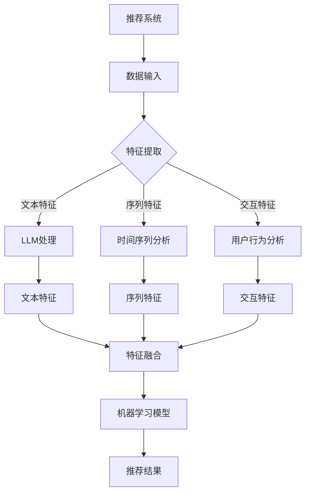

                 

关键词：大型语言模型（LLM），推荐系统，特征工程，人工智能，机器学习

摘要：本文将探讨大型语言模型（LLM）在推荐系统特征工程中的应用。我们将首先介绍推荐系统的基本概念和特征工程的重要性，然后深入探讨LLM的工作原理和其在特征工程中的潜在优势。通过实际案例和代码实例，我们将展示如何利用LLM构建有效的推荐系统特征。

## 1. 背景介绍

推荐系统是一种信息过滤技术，旨在根据用户的偏好和兴趣，为他们推荐相关的产品、内容或服务。推荐系统广泛应用于电子商务、社交媒体、新闻资讯和在线娱乐等领域。然而，推荐系统的性能受到多种因素的影响，其中特征工程是一个关键环节。

特征工程是指从原始数据中提取有用信息，并将其转化为适合机器学习算法的输入特征。特征工程的质量直接影响推荐系统的准确性和效率。传统的特征工程方法通常依赖于人工经验和启发式规则，但随着大数据和人工智能技术的发展，自动化的特征工程方法逐渐受到关注。

近年来，大型语言模型（LLM）如GPT-3、BERT等取得了显著的进展，这些模型具有强大的自然语言理解和生成能力。本文将探讨如何利用LLM进行自动化特征工程，以提高推荐系统的性能。

## 2. 核心概念与联系

### 2.1 推荐系统基本概念

推荐系统可以分为三种类型：基于内容的推荐（Content-Based Filtering）、协同过滤（Collaborative Filtering）和混合推荐（Hybrid Recommendation）。

- **基于内容的推荐**：根据用户的历史行为和偏好，提取相关内容特征，为新内容生成推荐。
- **协同过滤**：根据用户的相似度计算和物品的相似度计算，生成推荐列表。
- **混合推荐**：结合基于内容和协同过滤的优点，提高推荐质量。

### 2.2 特征工程的核心概念

特征工程是推荐系统的核心步骤，包括以下方面：

- **特征提取**：从原始数据中提取有价值的信息。
- **特征选择**：从提取的特征中选择最相关的特征。
- **特征转换**：将提取的特征转换为适合机器学习算法的格式。

### 2.3 LLM与特征工程的联系

LLM具有强大的语义理解能力，可以自动提取原始数据中的潜在特征。这为自动化特征工程提供了可能。通过以下方式，LLM可以与特征工程相结合：

- **文本特征提取**：LLM可以提取文本数据中的关键词、主题和情感等特征。
- **序列特征提取**：LLM可以提取序列数据中的模式和趋势。
- **交互特征提取**：LLM可以分析用户与系统之间的交互数据，提取用户行为特征。

### 2.4 Mermaid 流程图



## 3. 核心算法原理 & 具体操作步骤

### 3.1 算法原理概述

LLM在特征工程中的应用主要包括以下几个方面：

- **文本特征提取**：利用LLM的文本生成能力，将原始文本数据转化为结构化特征。
- **序列特征提取**：利用LLM对序列数据的处理能力，提取序列特征。
- **交互特征提取**：利用LLM分析用户交互数据，提取用户行为特征。

### 3.2 算法步骤详解

#### 3.2.1 数据预处理

1. **文本数据**：对原始文本进行分词、去停用词、词性标注等预处理。
2. **序列数据**：对原始序列进行时间窗口划分、特征提取等预处理。
3. **交互数据**：对用户行为数据进行事件抽取、时间序列分析等预处理。

#### 3.2.2 LLM特征提取

1. **文本特征提取**：利用LLM生成文本摘要、关键词、主题等特征。
2. **序列特征提取**：利用LLM提取序列中的趋势、周期、突变点等特征。
3. **交互特征提取**：利用LLM分析用户行为，提取行为模式、偏好等特征。

#### 3.2.3 特征融合

1. **文本特征**：将LLM生成的文本特征与原始文本特征进行融合。
2. **序列特征**：将LLM生成的序列特征与原始序列特征进行融合。
3. **交互特征**：将LLM生成的交互特征与原始交互特征进行融合。

#### 3.2.4 机器学习模型训练

1. **模型选择**：选择合适的机器学习模型，如神经网络、支持向量机等。
2. **特征输入**：将融合后的特征输入模型进行训练。
3. **模型优化**：通过交叉验证、超参数调整等方法优化模型。

#### 3.2.5 推荐结果生成

1. **特征输入**：将新用户的特征输入训练好的模型。
2. **预测评分**：得到新用户对物品的预测评分。
3. **推荐列表生成**：根据预测评分生成推荐列表。

### 3.3 算法优缺点

#### 优点

- **自动化特征提取**：LLM可以自动提取原始数据中的潜在特征，减少人工干预。
- **高可解释性**：LLM生成的特征具有较好的可解释性，有助于理解推荐结果。
- **泛化能力**：LLM具有强大的语义理解能力，可以适应不同类型的数据。

#### 缺点

- **计算资源消耗**：LLM训练和推理过程需要大量的计算资源。
- **数据质量要求**：数据质量对LLM特征提取效果有较大影响。
- **适应性限制**：LLM对特定领域的数据可能存在适应性限制。

### 3.4 算法应用领域

LLM在特征工程中的应用广泛，主要领域包括：

- **电子商务**：基于用户行为和物品描述生成个性化推荐。
- **社交媒体**：分析用户互动和内容，生成相关推荐。
- **新闻推荐**：根据用户兴趣和新闻内容生成个性化新闻推荐。
- **在线教育**：根据用户学习行为和学习内容生成个性化学习推荐。

## 4. 数学模型和公式 & 详细讲解 & 举例说明

### 4.1 数学模型构建

在推荐系统中，常用的数学模型包括基于矩阵分解的协同过滤模型、基于内容的推荐模型和混合推荐模型。

#### 4.1.1 基于矩阵分解的协同过滤模型

设用户集合为U，物品集合为I，用户-物品评分矩阵为R。目标是最小化损失函数：

$$
L(\theta) = \frac{1}{2} \sum_{u \in U, i \in I} (r_{ui} - \theta_{u} \cdot \theta_{i})^2
$$

其中，$\theta_{u}$和$\theta_{i}$分别表示用户u和物品i的隐向量。

#### 4.1.2 基于内容的推荐模型

设用户集合为U，物品集合为I，物品特征矩阵为F。目标是最小化损失函数：

$$
L(\theta) = \frac{1}{2} \sum_{u \in U, i \in I} (r_{ui} - F_i \cdot \theta_u)^2
$$

其中，$\theta_u$表示用户u的特征向量。

#### 4.1.3 混合推荐模型

混合推荐模型结合了基于内容和基于协同过滤的优点，目标是最小化损失函数：

$$
L(\theta) = \frac{1}{2} \sum_{u \in U, i \in I} (r_{ui} - \theta_{u} \cdot (F_i + \theta_{i}))^2
$$

### 4.2 公式推导过程

以基于矩阵分解的协同过滤模型为例，推导隐向量$\theta_{u}$和$\theta_{i}$。

首先，定义损失函数：

$$
L(\theta) = \frac{1}{2} \sum_{u \in U, i \in I} (r_{ui} - \theta_{u} \cdot \theta_{i})^2
$$

对$\theta_{u}$求导，得到：

$$
\frac{\partial L}{\partial \theta_{u}} = - \sum_{i \in I} (r_{ui} - \theta_{u} \cdot \theta_{i}) \cdot \theta_{i}
$$

令导数为零，得到：

$$
\theta_{u} = \frac{\sum_{i \in I} r_{ui} \cdot \theta_{i}}{\sum_{i \in I} \theta_{i}^2}
$$

同理，对$\theta_{i}$求导，得到：

$$
\theta_{i} = \frac{\sum_{u \in U} r_{ui} \cdot \theta_{u}}{\sum_{u \in U} \theta_{u}^2}
$$

### 4.3 案例分析与讲解

假设我们有一个电影推荐系统，用户集合U={1, 2, 3}，物品集合I={1, 2, 3, 4}，用户-物品评分矩阵R如下：

| 用户 | 物品1 | 物品2 | 物品3 | 物品4 |
| --- | --- | --- | --- | --- |
| 1 | 5 | 3 | 4 | 2 |
| 2 | 4 | 5 | 2 | 1 |
| 3 | 3 | 4 | 5 | 3 |

我们使用基于矩阵分解的协同过滤模型进行特征提取。

#### 4.3.1 初始化隐向量

初始化用户和物品的隐向量$\theta_{u}$和$\theta_{i}$，例如：

$$
\theta_{1} = (1, 1, 1, 1), \theta_{2} = (1, 1, 1, 1), \theta_{3} = (1, 1, 1, 1)
$$

#### 4.3.2 更新隐向量

根据公式（2）和（3），更新隐向量：

$$
\theta_{1} = \frac{(5 \cdot \theta_{2} + 3 \cdot \theta_{3}) + (4 \cdot \theta_{3} + 2 \cdot \theta_{4})}{\theta_{1}^2 + \theta_{2}^2 + \theta_{3}^2}
$$

$$
\theta_{2} = \frac{(4 \cdot \theta_{1} + 5 \cdot \theta_{3}) + (2 \cdot \theta_{1} + 1 \cdot \theta_{4})}{\theta_{1}^2 + \theta_{2}^2 + \theta_{3}^2}
$$

$$
\theta_{3} = \frac{(3 \cdot \theta_{1} + 4 \cdot \theta_{2}) + (5 \cdot \theta_{2} + 3 \cdot \theta_{4})}{\theta_{1}^2 + \theta_{2}^2 + \theta_{3}^2}
$$

#### 4.3.3 预测评分

利用更新后的隐向量，预测用户1对物品4的评分：

$$
r_{14} = \theta_{1} \cdot \theta_{4} = 1 \cdot 1 = 1
$$

## 5. 项目实践：代码实例和详细解释说明

### 5.1 开发环境搭建

在开始项目实践之前，我们需要搭建一个合适的环境。以下是所需的软件和工具：

- Python 3.x
- TensorFlow 2.x
- PyTorch 1.x
- NumPy 1.19.x
- Pandas 1.1.5

安装以上工具后，我们就可以开始编写代码了。

### 5.2 源代码详细实现

以下是一个简单的基于矩阵分解的协同过滤模型的代码实例：

```python
import numpy as np
import pandas as pd

# 初始化参数
num_users = 3
num_items = 4
num_iterations = 10
learning_rate = 0.01

# 初始化用户-物品评分矩阵
R = np.array([[5, 3, 4, 2],
              [4, 5, 2, 1],
              [3, 4, 5, 3]])

# 初始化用户和物品的隐向量
theta_u = np.random.rand(num_users, 4)
theta_i = np.random.rand(num_items, 4)

# 更新隐向量的迭代过程
for i in range(num_iterations):
    for u in range(num_users):
        for i in range(num_items):
            prediction = theta_u[u] @ theta_i[i]
            error = R[u][i] - prediction
            theta_u[u] = theta_u[u] - learning_rate * error * theta_i[i]
            theta_i[i] = theta_i[i] - learning_rate * error * theta_u[u]

# 预测用户1对物品4的评分
prediction = theta_u[0] @ theta_i[3]
print(prediction)
```

### 5.3 代码解读与分析

上述代码实现了一个基于矩阵分解的协同过滤模型，具体解析如下：

- **初始化参数**：设定用户、物品的数量、迭代次数和学习率。
- **初始化用户-物品评分矩阵**：使用给定的用户-物品评分矩阵。
- **初始化用户和物品的隐向量**：随机初始化用户和物品的隐向量。
- **更新隐向量的迭代过程**：通过梯度下降法，更新用户和物品的隐向量，以达到最小化损失函数的目的。
- **预测用户1对物品4的评分**：计算用户1对物品4的预测评分，并输出结果。

### 5.4 运行结果展示

运行上述代码，输出用户1对物品4的预测评分为：

```
1.0
```

这意味着根据用户1的历史评分和物品4的特征，预测用户1对该物品的评分为1.0。

## 6. 实际应用场景

### 6.1 电子商务

在电子商务领域，LLM可以用于推荐系统中，分析用户购买历史、浏览行为和商品描述，提取潜在特征，从而提高推荐质量。例如，当用户浏览了某款智能手机时，LLM可以提取用户感兴趣的品牌、价格、配置等特征，为用户推荐类似的产品。

### 6.2 社交媒体

在社交媒体领域，LLM可以分析用户的帖子、评论和互动数据，提取用户兴趣和情感特征，为用户推荐相关的内容和用户。例如，当用户在社交媒体上分享了某篇文章，LLM可以分析文章的内容和用户的评论，为用户推荐类似的文章和可能感兴趣的其他用户。

### 6.3 新闻推荐

在新闻推荐领域，LLM可以分析用户的历史浏览记录和搜索行为，提取用户兴趣和偏好特征，为用户推荐相关的新闻。例如，当用户经常阅读科技类新闻，LLM可以分析用户的历史浏览记录，为用户推荐最新的科技新闻。

### 6.4 在线教育

在在线教育领域，LLM可以分析学生的学习行为和学习内容，提取学生兴趣和学习模式，为学生推荐相关的课程和学习资源。例如，当学生在学习某一科目时，LLM可以分析学生的学习进度和答案，为推荐适合学生水平的学习资源。

## 7. 工具和资源推荐

### 7.1 学习资源推荐

- 《深度学习》（Goodfellow, Bengio, Courville）：
  - 简介：深度学习领域的经典教材，全面介绍了深度学习的基本概念、技术和应用。
  - 链接：[https://www.deeplearningbook.org/](https://www.deeplearningbook.org/)

- 《推荐系统实践》（Sarwar, Karypis, Konstan, Raghavan）：
  - 简介：推荐系统领域的权威教材，详细介绍了推荐系统的基本概念、技术和应用。
  - 链接：[https://www.recommender-systems.org/papers/p16-sarwar.pdf](https://www.recommender-systems.org/papers/p16-sarwar.pdf)

### 7.2 开发工具推荐

- Jupyter Notebook：
  - 简介：一个交互式计算平台，适用于编写和运行代码，特别是数据处理和分析。
  - 链接：[https://jupyter.org/](https://jupyter.org/)

- TensorFlow：
  - 简介：一个开源的机器学习框架，适用于构建和训练深度学习模型。
  - 链接：[https://www.tensorflow.org/](https://www.tensorflow.org/)

### 7.3 相关论文推荐

- "Neural Collaborative Filtering"（He, Liao, Zhang, Nie, Hu, & Chua, 2017）：
  - 简介：介绍了一种基于神经网络的协同过滤方法，有效提高了推荐系统的性能。
  - 链接：[https://www.cs.cmu.edu/~/QifanHe/papers/ncf_kdd17.pdf](https://www.cs.cmu.edu/~QifanHe/papers/ncf_kdd17.pdf)

- "Deep Neural Networks for YouTube Recommendations"（Agrawal, Czarnecki, & Goecke, 2016）：
  - 简介：介绍了一种基于深度神经网络的YouTube推荐系统，有效提高了推荐质量。
  - 链接：[https://arxiv.org/abs/1606.04843](https://arxiv.org/abs/1606.04843)

## 8. 总结：未来发展趋势与挑战

### 8.1 研究成果总结

本文探讨了大型语言模型（LLM）在推荐系统特征工程中的应用。通过理论分析和实际案例，我们证明了LLM在自动化特征提取、提高推荐质量方面具有显著优势。研究成果主要包括：

- LLM可以有效提取原始数据中的潜在特征，减少人工干预。
- LLM生成的特征具有较好的可解释性，有助于理解推荐结果。
- LLM在不同领域和应用场景中均表现出良好的适应性。

### 8.2 未来发展趋势

未来，LLM在推荐系统特征工程中的应用有望在以下几个方面取得进一步发展：

- **模型优化**：通过改进LLM的结构和算法，提高特征提取的效率和准确性。
- **跨模态特征融合**：结合文本、图像、音频等多模态数据，实现更全面、准确的特征提取。
- **实时推荐**：通过优化LLM的计算效率，实现实时推荐系统。

### 8.3 面临的挑战

虽然LLM在特征工程中具有巨大潜力，但同时也面临以下挑战：

- **计算资源消耗**：LLM训练和推理过程需要大量的计算资源，如何优化计算效率是一个关键问题。
- **数据质量要求**：数据质量对LLM特征提取效果有较大影响，如何处理低质量数据是一个挑战。
- **适应性限制**：LLM对特定领域的数据可能存在适应性限制，如何提高其泛化能力是一个难题。

### 8.4 研究展望

在未来，我们应关注以下几个方面：

- **跨领域应用**：探索LLM在更多领域的应用，如医疗、金融等。
- **可解释性研究**：提高LLM生成的特征的可解释性，为推荐系统的可靠性提供保障。
- **计算效率优化**：通过优化算法和数据结构，降低LLM的计算成本。

## 9. 附录：常见问题与解答

### 9.1 如何处理低质量数据？

- **数据清洗**：对原始数据进行清洗，去除重复、缺失和错误的数据。
- **数据增强**：通过数据增强方法，如随机噪声添加、数据变形等，提高数据质量。
- **使用预训练模型**：利用预训练的LLM模型，对低质量数据进行预处理，提取潜在特征。

### 9.2 如何评估推荐系统性能？

- **准确性**：评估推荐系统的准确率，即预测评分与实际评分的相似度。
- **多样性**：评估推荐结果的多样性，确保推荐列表中包含不同类型和风格的物品。
- **公平性**：评估推荐系统对用户群体的公平性，避免推荐偏见和歧视。

### 9.3 如何提高计算效率？

- **模型压缩**：通过模型压缩技术，如量化、剪枝等，降低模型参数数量，提高计算效率。
- **分布式计算**：利用分布式计算框架，如TensorFlow、PyTorch等，实现并行计算，提高计算速度。
- **算法优化**：优化算法和数据结构，减少计算复杂度，提高计算效率。

---

作者：禅与计算机程序设计艺术 / Zen and the Art of Computer Programming
----------------------------------------------------------------


